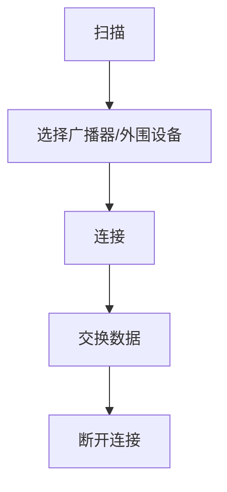

                 

蓝牙技术作为无线通信的一种重要方式，已经广泛应用于各种设备中，包括智能手机、平板电脑、电脑等。然而，随着物联网（IoT）的兴起，对低功耗无线通信的需求越来越大，传统的蓝牙技术已经无法满足这种需求。于是，Bluetooth Low Energy（BLE）应运而生。本文将详细介绍BLE的技术原理、核心概念、算法原理、数学模型、实际应用场景、未来发展趋势与挑战，以及相关的工具和资源推荐。

## 1. 背景介绍

蓝牙技术最早起源于1994年，由爱立信公司发起，旨在为移动设备提供无线连接。随着技术的发展，蓝牙逐渐从单一的技术演变成一套完整的通信协议，涵盖了多种不同的通信模式。然而，传统的蓝牙技术（我们通常所说的Classic Bluetooth）在功耗、数据传输速率和通信距离等方面都有一定的限制，难以满足日益增长的物联网设备对低功耗、低复杂度、低成本和高可靠性的需求。

为了解决这些问题，蓝牙特别兴趣组（Bluetooth Special Interest Group，简称SIG）于2010年推出了BLE。BLE是一种专为低功耗设备设计的无线通信协议，其目标是在保证数据传输速率和通信距离的同时，大幅降低设备的功耗。BLE的出现，为物联网的发展提供了强大的技术支撑。

## 2. 核心概念与联系

### 2.1. BLE的基本概念

BLE的全称是Bluetooth Low Energy，它是一种基于短包传输的低功耗无线通信技术。与传统的蓝牙技术相比，BLE具有以下几个显著特点：

1. **低功耗**：BLE采用了一种新的传输模式，可以在发送和接收数据时大幅度降低功耗。这使得BLE特别适合于电池供电的设备，如传感器、智能手表、健康监测设备等。

2. **低复杂度**：BLE的协议栈相对简单，这使得设备的开发和维护变得更加容易。

3. **低带宽**：BLE的数据传输速率相对较低，但足以满足大多数物联网设备的需求。

4. **支持广播**：BLE支持设备之间的广播通信，这使得设备可以无需建立连接即可传输数据。

### 2.2. BLE的架构

BLE的架构主要包括三个部分：中央设备（Central）、外围设备（Peripheral）和广播器（Broadcaster）。

- **中央设备（Central）**：中央设备负责连接和管理外围设备和广播器。它可以同时连接多个外围设备和广播器，并从它们那里接收数据。

- **外围设备（Peripheral）**：外围设备通常是传感器或执行器，负责向中央设备发送数据或接收中央设备的控制命令。

- **广播器（Broadcaster）**：广播器负责发送广播消息，任何处于附近范围内的设备都可以接收到这些消息。

### 2.3. BLE的工作原理

BLE的工作原理可以概括为以下几个步骤：

1. **扫描**：设备可以通过扫描周围的广播信号来发现其他设备。
2. **连接**：设备可以通过扫描结果选择一个广播器或外围设备进行连接。
3. **交换数据**：设备可以通过连接通道交换数据。
4. **断开连接**：设备在数据交换完成后可以断开连接。

### 2.4. BLE的核心概念原理和架构的Mermaid流程图



## 3. 核心算法原理 & 具体操作步骤

### 3.1. 算法原理概述

BLE的核心算法包括扫描算法、连接算法和数据交换算法。

- **扫描算法**：设备通过扫描周围的广播信号来发现其他设备。
- **连接算法**：设备通过扫描结果选择一个广播器或外围设备进行连接。
- **数据交换算法**：设备通过连接通道交换数据。

### 3.2. 算法步骤详解

#### 3.2.1. 扫描算法

扫描算法的步骤如下：

1. 设备开启扫描模式。
2. 设备接收周围的广播信号。
3. 设备对接收到的信号进行处理，提取出广播器的信息。
4. 设备根据提取的信息选择一个广播器或外围设备。

#### 3.2.2. 连接算法

连接算法的步骤如下：

1. 设备通过扫描算法选择一个广播器或外围设备。
2. 设备向所选设备发送连接请求。
3. 选设备接受连接请求，并分配一个连接ID。
4. 设备和选设备建立连接。

#### 3.2.3. 数据交换算法

数据交换算法的步骤如下：

1. 设备通过连接通道向选设备发送数据。
2. 选设备接收数据，并进行处理。
3. 选设备通过连接通道向设备发送数据。
4. 设备接收数据，并进行处理。

### 3.3. 算法优缺点

BLE算法的优点包括：

- **低功耗**：BLE的算法设计使得设备在发送和接收数据时功耗非常低，非常适合电池供电的设备。
- **低复杂度**：BLE的算法相对简单，设备的开发和维护变得更加容易。

BLE算法的缺点包括：

- **低带宽**：BLE的数据传输速率相对较低，可能无法满足对高速数据传输的需求。
- **广播通信的延迟**：由于BLE支持广播通信，设备的响应时间可能会有所延迟。

### 3.4. 算法应用领域

BLE算法的应用领域非常广泛，包括但不限于：

- **物联网**：BLE可以用于物联网设备之间的数据传输，如智能家居、智能城市等。
- **健康监测**：BLE可以用于健康监测设备与手机之间的数据传输，如智能手表、健康手环等。
- **工业自动化**：BLE可以用于工业自动化设备之间的数据传输，如传感器、执行器等。

## 4. 数学模型和公式 & 详细讲解 & 举例说明

### 4.1. 数学模型构建

BLE的数学模型主要包括以下几个方面：

1. **信号强度模型**：描述设备接收到的信号强度与距离之间的关系。
2. **功耗模型**：描述设备在发送和接收数据时的功耗。
3. **数据传输模型**：描述设备在连接通道上传输数据的过程。

### 4.2. 公式推导过程

1. **信号强度模型**：

   假设设备A与设备B之间的距离为d，设备A的信号强度为S_A，设备B的信号强度为S_B。根据无线信号的衰减规律，可以得到以下公式：

   $$ S_B = S_A \cdot \left( \frac{d_0}{d} \right)^2 $$

   其中，$d_0$为设备的通信距离。

2. **功耗模型**：

   设备在发送数据时的功耗为P_send，设备在接收数据时的功耗为P_receive。根据功耗的定义，可以得到以下公式：

   $$ P_send = P_0 + \alpha \cdot I $$

   $$ P_receive = P_0 + \beta \cdot I $$

   其中，$P_0$为设备的静态功耗，$\alpha$和$\beta$为与设备设计和应用场景相关的系数，I为设备的工作电流。

3. **数据传输模型**：

   设备在连接通道上传输数据时，数据传输速率V与信号强度S之间的关系可以表示为：

   $$ V = k \cdot S $$

   其中，k为与通信协议和设备性能相关的系数。

### 4.3. 案例分析与讲解

假设有一款智能家居设备，其通信距离为100米，信号强度为-70dBm。该设备在发送数据时的功耗为100mW，在接收数据时的功耗为50mW。我们需要计算该设备在100米距离处的功耗。

根据信号强度模型，可以得到：

$$ S = -70 \text{dBm} = 10^{-70/10} \text{W} = 10^{-7} \text{W} $$

根据功耗模型，可以得到：

$$ P_send = 100 \text{mW} = 10^{-2} \text{W} $$

$$ P_receive = 50 \text{mW} = 10^{-2} \text{W} $$

根据数据传输模型，可以得到：

$$ V = k \cdot S = 10^{-7} \text{W} \cdot k $$

将信号强度和功耗的值代入公式，可以得到：

$$ P_send = 10^{-2} \text{W} + 10^{-7} \text{W} \cdot k = 10^{-2} \text{W} + 0.001 \text{W} $$

$$ P_receive = 10^{-2} \text{W} + 10^{-7} \text{W} \cdot k = 10^{-2} \text{W} + 0.001 \text{W} $$

因此，该设备在100米距离处的总功耗为：

$$ P_{total} = P_send + P_receive = 2 \times 10^{-2} \text{W} + 0.002 \text{W} = 0.022 \text{W} $$

这表明，在100米距离处，该智能家居设备的功耗非常低，非常适合电池供电。

## 5. 项目实践：代码实例和详细解释说明

### 5.1. 开发环境搭建

在编写BLE项目之前，我们需要搭建一个合适的开发环境。这里我们使用Android Studio作为开发工具，并使用Android蓝牙API进行开发。

1. 安装Android Studio。
2. 创建一个新的Android项目。
3. 在项目的build.gradle文件中添加以下依赖：

   ```groovy
   implementation 'com.android.support:ble:28.0.0'
   ```

### 5.2. 源代码详细实现

以下是实现BLE连接的简单示例代码：

```java
// 引入蓝牙API
import android.bluetooth.BluetoothAdapter;
import android.bluetooth.BluetoothDevice;
import android.bluetooth.BluetoothGatt;
import android.bluetooth.BluetoothGattCallback;
import android.bluetooth.BluetoothGattCharacteristic;
import android.bluetooth.BluetoothProfile;

public class BLEConnector {

    private BluetoothAdapter mBluetoothAdapter;
    private BluetoothGatt mBluetoothGatt;

    public BLEConnector() {
        mBluetoothAdapter = BluetoothAdapter.getDefaultAdapter();
    }

    public void connect(String address) {
        BluetoothDevice device = mBluetoothAdapter.getRemoteDevice(address);
        mBluetoothGatt = device.connectGatt(null, false, mGattCallback);
    }

    private final BluetoothGattCallback mGattCallback = new BluetoothGattCallback() {
        @Override
        public void onConnectionStateChange(BluetoothGatt gatt, int status, int newState) {
            if (newState == BluetoothProfile.STATE_CONNECTED) {
                mBluetoothGatt.discoverServices();
            } else if (newState == BluetoothProfile.STATE_DISCONNECTED) {
                // 断开连接，处理逻辑
            }
        }

        @Override
        public void onServicesDiscovered(BluetoothGatt gatt, int status) {
            if (status == BluetoothGatt.GATT_SUCCESS) {
                // 发现服务，处理逻辑
            }
        }

        @Override
        public void onCharacteristicRead(BluetoothGatt gatt, BluetoothGattCharacteristic characteristic, int status) {
            if (status == BluetoothGatt.GATT_SUCCESS) {
                // 读取数据，处理逻辑
            }
        }

        @Override
        public void onCharacteristicChanged(BluetoothGatt gatt, BluetoothGattCharacteristic characteristic) {
            // 数据变更，处理逻辑
        }
    };
}
```

### 5.3. 代码解读与分析

上述代码是用于连接BLE设备的简单示例。首先，我们创建了一个BLEConnector类，该类包含一个用于连接设备的connect()方法。该方法接受一个蓝牙设备的地址作为参数，并使用Android蓝牙API尝试连接该设备。

在connect()方法中，我们首先获取一个蓝牙适配器（BluetoothAdapter）实例，并使用该适配器获取远程设备（BluetoothDevice）实例。然后，我们使用该设备实例创建一个蓝牙套接字（BluetoothGatt）实例，并调用connectGatt()方法尝试连接设备。

在连接过程中，我们使用了BluetoothGattCallback类来监听连接状态、服务发现、数据读取和数据变更等事件。这些事件的处理逻辑可以在对应的回调方法中编写。

### 5.4. 运行结果展示

当我们运行上述代码时，BLEConnector类会尝试连接指定的蓝牙设备。如果连接成功，设备将进入扫描模式，并开始广播信号。我们的设备可以接收到这些信号，并选择一个广播器进行连接。

一旦连接建立，设备就可以开始交换数据。我们可以通过读取设备的特征（Characteristic）来获取数据，或者监听特征的变化来实时获取数据。

## 6. 实际应用场景

BLE技术因其低功耗、低复杂度和低成本的特点，已经在多个领域得到广泛应用。

### 6.1. 物联网

在物联网领域，BLE技术被广泛应用于智能家居、智能城市、智能工业等领域。例如，智能灯泡、智能门锁、智能传感器等设备都可以通过BLE与中央控制系统进行通信。

### 6.2. 健康监测

在健康监测领域，BLE技术被广泛应用于智能手表、健康手环等设备中。这些设备可以通过BLE与手机进行通信，实时传输用户的健康数据，如心率、步数、睡眠质量等。

### 6.3. 工业自动化

在工业自动化领域，BLE技术被广泛应用于传感器、执行器等设备中。这些设备可以通过BLE与中央控制系统进行通信，实现数据的采集和控制的自动化。

### 6.4. 未来应用展望

随着BLE技术的不断发展和完善，未来它将在更多领域得到应用。例如，在智能交通领域，BLE可以用于车辆与交通信号灯、道路传感器的通信，实现智能交通管理；在医疗领域，BLE可以用于远程医疗监控，实现医生与患者的实时通信；在农业领域，BLE可以用于智能农田管理，实现农业生产的智能化。

## 7. 工具和资源推荐

### 7.1. 学习资源推荐

- 《蓝牙技术手册》：详细介绍了蓝牙技术的工作原理、协议栈和开发方法。
- 《Bluetooth Low Energy：The Basics》：一本关于BLE技术的基础教程，适合初学者阅读。

### 7.2. 开发工具推荐

- Android Studio：官方的Android开发工具，支持BLE开发。
- nRF Connect：一款功能强大的BLE开发工具，包括设备扫描、连接、数据传输等功能。

### 7.3. 相关论文推荐

- “Bluetooth Low Energy: The Next Big Thing in Wireless Sensor Networks”：
  这篇论文详细介绍了BLE在无线传感器网络中的应用。
- “An Overview of Bluetooth Low Energy Technology”：
  这篇论文对BLE技术进行了全面的概述，包括其工作原理、协议栈和性能分析。

## 8. 总结：未来发展趋势与挑战

### 8.1. 研究成果总结

自BLE技术推出以来，已经取得了显著的成果。首先，BLE在功耗、数据传输速率和通信距离等方面得到了大幅提升，满足了物联网设备对低功耗、低复杂度和低成本的需求。其次，BLE的应用领域不断扩展，从智能家居、健康监测到工业自动化，BLE都发挥了重要作用。

### 8.2. 未来发展趋势

未来，BLE技术将继续朝着更高性能、更广泛应用的方向发展。首先，随着5G网络的普及，BLE将与其他无线技术（如Wi-Fi、NB-IoT等）相结合，实现更高效、更可靠的数据传输。其次，BLE将在智能城市、智能交通、智能医疗等领域发挥更大作用，推动社会生产方式的变革。

### 8.3. 面临的挑战

然而，BLE技术也面临着一些挑战。首先，由于BLE的低功耗特性，其数据传输速率相对较低，可能无法满足某些对高速数据传输有需求的场景。其次，BLE的广播通信模式可能导致通信延迟，影响用户体验。最后，随着BLE应用领域的扩展，如何确保数据安全和隐私保护也是一个重要问题。

### 8.4. 研究展望

未来，BLE技术的研究将重点解决以下几个方面的问题：

- 提高数据传输速率：通过优化协议栈、提高通信频率等手段，提升BLE的数据传输速率。
- 降低通信延迟：通过改进广播通信机制、提高数据处理效率等手段，降低BLE的通信延迟。
- 数据安全和隐私保护：通过加密、认证等手段，确保BLE通信过程中的数据安全和隐私保护。

总之，BLE技术在未来具有广阔的发展前景，同时也面临着一系列挑战。只有不断改进和创新，才能使BLE技术在各个领域发挥更大的作用。

## 9. 附录：常见问题与解答

### 9.1. 什么是BLE？

BLE（Bluetooth Low Energy）是一种专为低功耗设备设计的无线通信技术。它具有低功耗、低复杂度和低带宽等特点，适用于物联网、健康监测、工业自动化等多个领域。

### 9.2. BLE与传统蓝牙（Classic Bluetooth）有什么区别？

BLE与传统蓝牙在功耗、复杂度和带宽等方面有显著区别。BLE的功耗更低，协议更简单，数据传输速率也较低。而传统蓝牙则适用于对数据传输速率和通信距离有较高要求的设备。

### 9.3. BLE如何实现低功耗？

BLE通过采用短包传输、低频率通信和睡眠模式等技术实现低功耗。设备在发送和接收数据时，会尽可能减少电流的消耗，从而延长电池寿命。

### 9.4. BLE的数据传输速率是多少？

BLE的数据传输速率通常在1Mbps左右，但实际传输速率可能受到通信距离、设备性能和信号干扰等因素的影响。

### 9.5. BLE的安全性能如何？

BLE提供了多种安全机制，如加密、认证和配对等，确保通信过程中的数据安全和隐私保护。然而，由于BLE的协议相对简单，安全问题仍需引起重视。

### 9.6. BLE适用于哪些应用场景？

BLE适用于物联网、健康监测、工业自动化等多个领域。它特别适合电池供电的设备，如传感器、智能手表、健康手环等。

## 10. 结束语

蓝牙技术作为无线通信的一种重要方式，随着物联网的兴起，其应用场景越来越广泛。BLE作为一种低功耗、低复杂度的无线通信技术，已经成为物联网领域的重要支柱。本文详细介绍了BLE的技术原理、核心概念、算法原理、数学模型、实际应用场景、未来发展趋势与挑战，以及相关的工具和资源推荐。希望本文能帮助读者更好地理解和应用BLE技术，推动物联网的发展。作者：禅与计算机程序设计艺术 / Zen and the Art of Computer Programming。----------------------------------------------------------------

<|im_end|>## 2. 核心概念与联系

### 2.1. BLE的基本概念

BLE（Bluetooth Low Energy）是蓝牙技术的一种版本，它旨在提供一种更节能、更简单的无线连接方式，以支持低功耗设备如物联网（IoT）设备和可穿戴设备。BLE与传统的蓝牙技术（即蓝牙经典技术，也称为蓝牙高能耗模式）相比，具有以下几个核心特点：

- **低功耗**：BLE设计用于在低功耗设备上运行，如智能手表、健康监测设备等，这些设备通常依赖电池供电。BLE通过减少设备处于活跃状态的时间来降低功耗，实现了与普通蓝牙设备相比的显著节能效果。
- **简单易用**：BLE简化了蓝牙协议栈，使得开发更为简单，设备能够更快地连接到网络并传输数据。
- **小数据包传输**：BLE使用小数据包传输，这意味着它不适合大文件传输，但非常适合频繁的小数据传输，如传感器数据。
- **广播模式**：BLE支持广播模式，使得设备可以无需建立连接就能接收数据，这在物联网设备之间进行数据广播时非常有用。

### 2.2. BLE的架构

BLE的架构包括以下几个关键组件：

- **GAP（Generic Access Profile）**：GAP定义了如何发现和连接设备，包括设备名称、设备状态等。
- **GATT（Generic Attribute Profile）**：GATT定义了如何在设备之间传输数据，包括数据的读写操作。
- **SM（Security Manager）**：SM负责确保蓝牙通信的安全性，包括身份验证、加密等。
- **ATT（Attribute Protocol）**：ATT是GATT的一部分，它定义了如何在设备之间传输属性。
- **LL（Link Layer）**：LL是蓝牙物理层的实现，负责无线信号的发送和接收。

#### GAP（Generic Access Profile）

GAP提供了基础服务，使得设备能够被发现、连接和配置。它定义了以下核心功能：

- **设备发现**：设备如何广播其存在，以及如何响应查找请求。
- **设备名称**：如何设置和读取设备的名称。
- **设备类别**：如何定义设备类别，以便于识别不同类型的设备。
- **连接配置**：如何建立和配置连接，包括连接类型、传输模式和连接参数等。

#### GATT（Generic Attribute Profile）

GATT定义了如何传输和操作数据属性。它包括以下几个关键概念：

- **服务（Service）**：服务是一组相关的特性（Characteristics）的集合，它们共同实现了某种功能。
- **特性（Characteristics）**：特性是服务中的一个数据项，可以是读、写、通知或指示等。
- **描述符（Descriptors）**：描述符提供了关于特性的额外信息，如用户定义的描述信息、数据格式等。
- **属性（Attributes）**：属性是GATT中的数据单元，它们存储在GATT服务器中，并可以通过GATT协议进行访问。

#### SM（Security Manager）

SM提供了安全服务，以确保蓝牙通信的安全。SM的主要功能包括：

- **配对（Bonding）**：通过配对，两个设备可以建立安全连接，并共享密钥。
- **身份验证**：在连接过程中，设备可以要求对方进行身份验证，以确保通信的安全性。
- **加密**：SM可以启用加密，以确保传输的数据在传输过程中不被截获或篡改。

#### ATT（Attribute Protocol）

ATT定义了如何在设备之间传输属性。它包括以下操作：

- **读取（Read）**：客户端可以读取服务器上的属性值。
- **写入（Write）**：客户端可以修改服务器上的属性值。
- **通知（Notification）**：服务器可以向客户端发送更新通知，以便客户端可以实时获取数据。
- **指示（Indication）**：与通知类似，但客户端需要确认接收到的数据。

#### LL（Link Layer）

LL是蓝牙物理层和链路层的实现，负责无线信号的发送和接收。LL的主要功能包括：

- **频率 hopping**：通过在多个频率之间快速切换，以避免干扰。
- **信号编码**：使用特定的编码方案，如跳频扩频（FHSS）或直序扩频（DSSS），以实现信号的传输。
- **数据包传输**：确保数据包的正确传输，包括错误检测和纠正。

### 2.3. BLE的工作原理

BLE的工作原理可以概括为以下几个步骤：

1. **设备发现**：设备可以通过广播信号广播其存在，其他设备可以通过扫描这些广播信号来发现它们。
2. **建立连接**：一旦发现感兴趣的设备，设备可以发起连接请求，并通过GAP建立连接。
3. **数据传输**：建立连接后，设备可以通过GATT进行数据传输。这包括读取、写入、通知和指示等操作。
4. **断开连接**：当数据传输完成后，设备可以断开连接，以节省功耗。

### 2.4. BLE的核心概念原理和架构的Mermaid流程图

以下是一个使用Mermaid绘制的BLE架构的流程图：

```mermaid
graph TB
subgraph BLE架构
    A[通用访问配置文件(GAP)] --> B[通用属性配置文件(GATT)]
    B --> C[安全管理(SM)]
    B --> D[属性协议(ATT)]
    A --> E[链路层(LL)]
end
```

在上述流程图中，GAP负责设备发现和连接，GATT负责数据传输，SM负责安全管理，ATT定义了数据传输协议，而LL负责无线信号的发送和接收。这些组件共同构成了BLE的核心架构，使得BLE能够实现低功耗、简单易用的无线通信。

