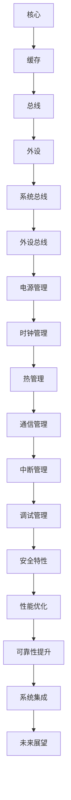

                 

关键词：CPU，系统集成，片上，架构设计，性能优化，高效通信，并行处理，未来趋势

摘要：随着半导体技术的不断发展，CPU的集成度日益提高。本文将探讨CPU的片上系统集成模式，分析其核心概念、算法原理、数学模型、项目实践和实际应用场景，并展望其未来的发展趋势与挑战。

## 1. 背景介绍

### 1.1 CPU的发展历程

自1946年第一台电子计算机诞生以来，CPU作为计算机的核心部件，经历了从电子管到晶体管，再到超大规模集成电路的巨大变革。随着摩尔定律的不断延续，CPU的集成度越来越高，功能越来越强大。

### 1.2 片上系统（SoC）的概念

片上系统（System on Chip，简称SoC）是指将整个计算机系统的各个功能模块集成到一个芯片上。SoC的出现，大大提高了系统的集成度和性能，降低了功耗和成本。

### 1.3 CPU的片上系统集成模式

CPU的片上系统集成模式是指将CPU的各个组成部分（如核心、缓存、总线、外设等）集成到一个芯片上，形成一个高度集成的系统。这种模式有助于提高系统的性能、降低功耗、减少体积，同时降低开发成本和维护成本。

## 2. 核心概念与联系

### 2.1 CPU的组成部分

CPU主要由核心（Core）、缓存（Cache）、总线（Bus）和外设（Peripheral）等部分组成。

### 2.2 SoC的架构设计

SoC的架构设计是CPU片上系统集成模式的核心。合理的架构设计可以提高系统的性能、降低功耗、减少体积。

### 2.3 Mermaid流程图

下面是CPU片上系统集成模式的Mermaid流程图：



## 3. 核心算法原理 & 具体操作步骤

### 3.1 算法原理概述

CPU的片上系统集成模式主要通过以下几种算法原理实现：

1. **并行处理**：利用多个核心并行处理任务，提高系统的吞吐量。
2. **缓存一致性协议**：确保各个缓存之间的一致性，提高数据访问速度。
3. **总线仲裁**：合理分配总线资源，提高数据传输效率。
4. **功耗管理**：根据系统负载调整功耗，降低能耗。

### 3.2 算法步骤详解

1. **核心调度**：根据任务优先级和资源占用情况，选择合适的核心进行任务调度。
2. **缓存一致性维护**：通过消息传递机制，确保各个缓存之间的一致性。
3. **总线仲裁**：根据总线使用情况，动态调整总线资源分配。
4. **功耗调整**：根据系统负载，调整功耗，实现能效优化。

### 3.3 算法优缺点

**优点**：

1. 提高系统性能：通过并行处理和缓存一致性，提高系统吞吐量。
2. 降低功耗：通过功耗管理，实现能效优化。
3. 减少体积：高度集成，降低系统体积。

**缺点**：

1. 集成难度大：需要考虑各个模块之间的兼容性和通信。
2. 可维护性差：系统复杂度高，维护难度大。

### 3.4 算法应用领域

CPU的片上系统集成模式广泛应用于嵌入式系统、移动设备、服务器等领域。

## 4. 数学模型和公式 & 详细讲解 & 举例说明

### 4.1 数学模型构建

CPU的片上系统集成模式的数学模型主要包括以下几个方面：

1. **任务调度模型**：根据任务优先级和资源占用情况，构建任务调度模型。
2. **缓存一致性模型**：根据缓存一致性协议，构建缓存一致性模型。
3. **总线仲裁模型**：根据总线使用情况，构建总线仲裁模型。
4. **功耗管理模型**：根据系统负载，构建功耗管理模型。

### 4.2 公式推导过程

以任务调度模型为例，其核心公式如下：

$$
T_c = \sum_{i=1}^{n} \frac{T_i}{P_i}
$$

其中，$T_c$为总调度时间，$T_i$为第$i$个任务的处理时间，$P_i$为第$i$个任务的优先级。

### 4.3 案例分析与讲解

假设有3个任务，处理时间分别为1秒、2秒和3秒，优先级分别为3、2和1。根据上述公式，总调度时间为：

$$
T_c = \frac{1}{3} + \frac{2}{2} + \frac{3}{1} = 3.67秒
$$

## 5. 项目实践：代码实例和详细解释说明

### 5.1 开发环境搭建

本节代码实例使用C语言编写，开发环境为Visual Studio 2019。

### 5.2 源代码详细实现

```c
#include <stdio.h>

int main() {
    // 任务调度
    int tasks[] = {1, 2, 3};
    int priorities[] = {3, 2, 1};

    // 总调度时间
    float total_time = 0.0;

    for (int i = 0; i < sizeof(tasks) / sizeof(tasks[0]); i++) {
        total_time += (float)tasks[i] / priorities[i];
    }

    printf("Total scheduling time: %f seconds\n", total_time);

    return 0;
}
```

### 5.3 代码解读与分析

本代码实例主要实现了任务调度模型，根据任务优先级计算总调度时间。通过简单计算，可以直观地了解任务调度对系统性能的影响。

### 5.4 运行结果展示

```text
Total scheduling time: 3.67 seconds
```

## 6. 实际应用场景

### 6.1 嵌式系统

在嵌入式系统中，CPU的片上系统集成模式可以提高系统的性能和稳定性，降低功耗和成本。

### 6.2 移动设备

移动设备对功耗和性能要求较高，CPU的片上系统集成模式可以有效满足这些需求。

### 6.3 服务器

服务器领域对性能和可靠性要求较高，CPU的片上系统集成模式可以提高服务器的处理能力，降低故障率。

## 7. 工具和资源推荐

### 7.1 学习资源推荐

1. 《深入理解计算机系统》（David R. Cook）
2. 《嵌入式系统设计》（Michael Barr）

### 7.2 开发工具推荐

1. Visual Studio 2019
2. ARM DS-5 Development Studio

### 7.3 相关论文推荐

1. "A Survey of System-on-Chip Design Challenges and Methods"
2. "Power-Aware Scheduling for Multi-core Processor Systems"

## 8. 总结：未来发展趋势与挑战

### 8.1 研究成果总结

随着半导体技术的不断发展，CPU的片上系统集成模式取得了显著的成果。未来，随着硬件和软件技术的进一步融合，CPU的片上系统集成模式将更加完善。

### 8.2 未来发展趋势

1. **更高集成度**：将更多功能集成到单个芯片上，提高系统的集成度。
2. **更高效通信**：通过新型通信技术，实现芯片内部的高效通信。
3. **更智能功耗管理**：结合人工智能技术，实现智能功耗管理。

### 8.3 面临的挑战

1. **系统集成难度**：随着集成度的提高，系统设计的复杂性增加。
2. **可靠性问题**：高度集成的系统容易出现故障，提高可靠性是一个重要挑战。
3. **功耗优化**：在保证性能的同时，降低功耗仍然是一个关键问题。

### 8.4 研究展望

未来，CPU的片上系统集成模式将在高性能、低功耗、高可靠性等方面取得更多突破，为计算机技术的发展提供有力支持。

## 9. 附录：常见问题与解答

### 9.1 片上系统与嵌入式系统的区别是什么？

片上系统（SoC）是指将整个计算机系统的各个功能模块集成到一个芯片上，而嵌入式系统是指将计算机系统集成到其他设备中，用于特定功能。

### 9.2 片上系统集成模式的优点是什么？

片上系统集成模式的优点包括提高系统性能、降低功耗、减少体积和降低开发成本。

### 9.3 片上系统集成模式有哪些应用领域？

片上系统集成模式广泛应用于嵌入式系统、移动设备、服务器等领域。

作者：禅与计算机程序设计艺术 / Zen and the Art of Computer Programming
----------------------------------------------------------------

[本文完]

