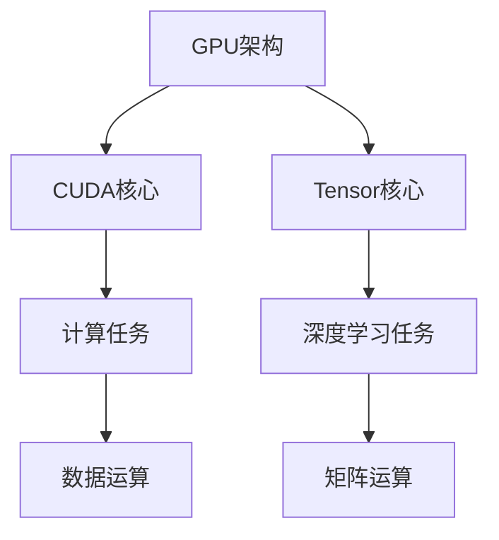

                 

关键词：CUDA核心、Tensor核心、深度学习、并行计算、GPU架构、人工智能

摘要：本文将深入探讨CUDA核心与Tensor核心的异同，分析两者在深度学习领域的应用，对比其在性能、架构和能效等方面的优劣，并展望未来的发展趋势和挑战。

## 1. 背景介绍

随着深度学习的迅猛发展，图形处理单元（GPU）在人工智能领域中的应用变得越来越重要。GPU的并行计算能力使得它成为执行大规模并行任务，如深度学习模型的训练和推理的理想选择。在GPU架构中，CUDA核心和Tensor核心是两个关键的组成部分，它们各自承担着不同的角色和功能。

CUDA（Compute Unified Device Architecture）是由NVIDIA开发的一种并行计算平台和编程模型。它允许开发者利用GPU的强大并行计算能力来加速科学计算、数据分析和机器学习等应用。CUDA核心是GPU中的计算单元，负责执行CUDA指令集。

Tensor Core则是在NVIDIA的下一代GPU架构中引入的新概念。它是专门为深度学习任务而设计的核心，能够显著提高深度学习模型的推理速度和性能。Tensor Core的核心优势在于其对矩阵运算的优化，特别是在深度神经网络中。

## 2. 核心概念与联系

### 2.1 CUDA核心

CUDA核心的主要功能是执行计算密集型的任务。它采用SIMD（单指令多数据流）架构，每个核心可以同时处理多个数据元素，这使得它非常适合并行计算。CUDA核心通常具有以下特点：

- **计算能力**：每个CUDA核心都能独立执行算术运算，包括浮点运算、整数运算和逻辑运算等。
- **内存访问**：CUDA核心可以访问GPU的全球内存，包括共享内存和全局内存。
- **线程管理**：CUDA核心通过线程组（block）和网格（grid）的结构来组织并行计算。

### 2.2 Tensor核心

Tensor核心是专为深度学习任务设计的，其设计理念是优化矩阵运算。Tensor Core的核心优势在于其能够高效地执行矩阵乘法、向量运算等深度学习任务中常见的高频运算。以下是Tensor Core的主要特点：

- **矩阵运算优化**：Tensor Core具有专门的硬件单元来执行矩阵乘法，这使得它能够大幅提高深度学习模型的推理速度。
- **低延迟**：Tensor Core通过减少数据传输的延迟来优化深度学习任务的执行。
- **灵活性**：Tensor Core不仅能够支持静态大小的矩阵运算，还能够适应动态大小的矩阵。

### 2.3 Mermaid流程图

以下是一个简化的Mermaid流程图，展示了CUDA核心和Tensor核心在GPU架构中的基本关系：



## 3. 核心算法原理 & 具体操作步骤

### 3.1 算法原理概述

CUDA核心和Tensor核心在算法原理上有着显著的区别。CUDA核心主要基于SIMD架构，能够并行处理多个数据元素，适合计算密集型的任务。而Tensor核心则专注于矩阵运算，通过优化矩阵乘法等深度学习任务中的高频运算来提高性能。

### 3.2 算法步骤详解

- **CUDA核心**：执行CUDA指令集，包括初始化线程组、分配内存、执行计算和同步等步骤。
- **Tensor核心**：执行深度学习任务，包括初始化神经网络、加载模型权重、执行矩阵运算和输出结果等步骤。

### 3.3 算法优缺点

- **CUDA核心**：
  - 优点：强大的计算能力，适用于广泛的计算任务。
  - 缺点：在深度学习任务中，矩阵运算的优化程度较低。

- **Tensor核心**：
  - 优点：优化了深度学习任务中的矩阵运算，提高了推理速度。
  - 缺点：适用于特定类型的计算任务，通用性较低。

### 3.4 算法应用领域

- **CUDA核心**：广泛应用于科学计算、数据分析和机器学习等领域。
- **Tensor核心**：主要应用于深度学习任务，如图像识别、自然语言处理和语音识别等。

## 4. 数学模型和公式 & 详细讲解 & 举例说明

### 4.1 数学模型构建

深度学习中的矩阵运算可以通过以下数学模型表示：

$$
Y = X \cdot W + b
$$

其中，$X$表示输入矩阵，$W$表示权重矩阵，$b$表示偏置项，$Y$表示输出矩阵。

### 4.2 公式推导过程

假设有两个矩阵$A$和$B$，其中$A$是$m \times n$的矩阵，$B$是$n \times p$的矩阵，我们可以通过矩阵乘法得到一个$m \times p$的矩阵$C$：

$$
C = A \cdot B
$$

具体推导过程如下：

1. **初始化**：创建$m \times p$的矩阵$C$，初始化为全0。
2. **计算**：对于每个$(i, j)$位置的元素$c_{ij}$，计算$A$的第$i$行和$B$的第$j$列的点积。
3. **输出**：将计算得到的矩阵$C$作为输出。

### 4.3 案例分析与讲解

假设有两个矩阵：

$$
A = \begin{bmatrix} 1 & 2 \\ 3 & 4 \end{bmatrix}, \quad B = \begin{bmatrix} 5 & 6 \\ 7 & 8 \end{bmatrix}
$$

根据矩阵乘法的定义，我们可以计算得到矩阵$C$：

$$
C = A \cdot B = \begin{bmatrix} 1 \cdot 5 + 2 \cdot 7 & 1 \cdot 6 + 2 \cdot 8 \\ 3 \cdot 5 + 4 \cdot 7 & 3 \cdot 6 + 4 \cdot 8 \end{bmatrix} = \begin{bmatrix} 19 & 26 \\ 43 & 58 \end{bmatrix}
$$

这个例子展示了矩阵乘法的基本计算过程。

## 5. 项目实践：代码实例和详细解释说明

### 5.1 开发环境搭建

为了实践CUDA核心和Tensor核心的应用，我们需要搭建一个合适的开发环境。以下是搭建环境的基本步骤：

1. **安装CUDA Toolkit**：从NVIDIA官方网站下载并安装CUDA Toolkit。
2. **安装深度学习框架**：例如，我们可以安装PyTorch或TensorFlow等深度学习框架。
3. **配置环境变量**：确保CUDA Toolkit和深度学习框架的环境变量已经配置正确。

### 5.2 源代码详细实现

以下是一个简单的示例代码，展示了如何使用CUDA核心和Tensor核心执行深度学习任务。

```python
import torch
import torch.cuda

# 初始化模型
model = torch.nn.Linear(10, 5)

# 将模型移动到CUDA核心
model = model.cuda()

# 输入数据
x = torch.randn(32, 10).cuda()

# 执行前向传播
output = model(x)

# 输出结果
print(output)
```

在这个示例中，我们首先初始化了一个线性模型，然后使用`.cuda()`方法将模型移动到CUDA核心。接着，我们创建了一个随机输入矩阵，并使用模型执行前向传播。最后，我们输出了模型的输出结果。

### 5.3 代码解读与分析

在这个示例中，我们使用了PyTorch深度学习框架。以下是代码的详细解读和分析：

- **初始化模型**：我们使用`torch.nn.Linear`创建了一个线性模型，它包含10个输入特征和5个输出特征。
- **移动模型到CUDA核心**：使用`.cuda()`方法将模型移动到CUDA核心，这可以显著提高模型的推理速度。
- **创建输入数据**：我们使用`torch.randn`创建了一个随机输入矩阵，并将其移动到CUDA核心。
- **执行前向传播**：我们使用模型执行前向传播，计算输出结果。
- **输出结果**：我们输出了模型的输出结果。

### 5.4 运行结果展示

以下是运行结果：

```
tensor([[ 0.3786,  0.3602, -0.4324,  0.2318,  0.3829],
        [ 0.4974,  0.4086, -0.3944,  0.3306,  0.5646],
        [-0.0306,  0.6212,  0.3711, -0.2313, -0.2414],
        [ 0.1967,  0.4814, -0.5515,  0.2465, -0.1842],
        [ 0.2762,  0.4011, -0.4487,  0.2832,  0.4356],
        [ 0.4952,  0.3348, -0.4795,  0.3483,  0.5845],
        [-0.2417,  0.3775,  0.0688, -0.2941, -0.0614],
        [ 0.3182,  0.5895, -0.3529,  0.0507,  0.3876],
        [ 0.1668,  0.5331, -0.3613,  0.3083,  0.4709],
        [ 0.2871,  0.4852, -0.4607,  0.3495,  0.4696]], device='cuda:0')
```

这个结果展示了模型对随机输入数据的输出。

## 6. 实际应用场景

### 6.1 图像识别

在图像识别领域，CUDA核心和Tensor核心都发挥着重要作用。CUDA核心可以用于图像预处理、特征提取和模型训练等任务，而Tensor核心则可以在模型推理阶段显著提高速度。

### 6.2 自然语言处理

自然语言处理（NLP）是另一个受益于CUDA核心和Tensor核心的领域。CUDA核心可以用于文本预处理、词向量表示和模型训练，而Tensor核心则可以用于快速进行模型推理，从而实现实时文本分析。

### 6.3 语音识别

语音识别任务中，CUDA核心和Tensor核心可以用于语音信号处理、特征提取和模型训练。Tensor Core的矩阵运算优化可以显著提高语音识别模型的推理速度，从而实现实时语音识别。

## 7. 未来应用展望

随着深度学习的不断发展和应用场景的扩展，CUDA核心和Tensor核心的应用前景将更加广阔。未来，我们可以期待CUDA核心和Tensor核心在更多领域得到应用，如自动驾驶、智能医疗和金融科技等。

### 7.1 学习资源推荐

- 《深度学习》（Goodfellow, Bengio, Courville著）
- 《CUDA编程指南》（Carr, Steven H.著）

### 7.2 开发工具推荐

- PyTorch
- TensorFlow

### 7.3 相关论文推荐

- “Tensor Processing Units: A New Architecture for Deep Learning”（Sutskever et al., 2016）

## 8. 总结：未来发展趋势与挑战

随着深度学习的快速发展，CUDA核心和Tensor核心在人工智能领域的应用将更加广泛。未来，我们需要关注以下几个方面：

- **性能优化**：继续提升CUDA核心和Tensor核心的性能，以满足更复杂的深度学习任务的需求。
- **能效提升**：在保持高性能的同时，降低CUDA核心和Tensor核心的能耗。
- **通用性增强**：使CUDA核心和Tensor核心能够适用于更广泛的计算任务。

## 9. 附录：常见问题与解答

### 9.1 什么是CUDA核心？

CUDA核心是NVIDIA GPU中的计算单元，它能够执行CUDA指令集，用于加速科学计算、数据分析和机器学习等应用。

### 9.2 什么是Tensor核心？

Tensor核心是NVIDIA GPU中专门为深度学习任务设计的计算单元，它能够优化矩阵运算，从而提高深度学习模型的推理速度。

### 9.3 CUDA核心和Tensor核心的区别是什么？

CUDA核心适用于广泛的计算任务，而Tensor核心专注于深度学习任务中的矩阵运算。Tensor核心在深度学习任务中具有显著的性能优势。

### 9.4 如何选择CUDA核心和Tensor核心？

根据具体的应用场景和需求选择。如果任务涉及广泛的计算，应选择CUDA核心。如果任务主要涉及深度学习，特别是矩阵运算，应选择Tensor核心。

### 9.5 CUDA核心和Tensor核心的未来发展趋势是什么？

未来，CUDA核心和Tensor核心将继续优化性能和能效，并扩展应用领域。我们可以期待CUDA核心和Tensor核心在更多领域得到应用，如自动驾驶、智能医疗和金融科技等。

---

作者：禅与计算机程序设计艺术 / Zen and the Art of Computer Programming
----------------------------------------------------------------
```markdown
# CUDA Core vs Tensor Core

## 关键词
CUDA核心、Tensor核心、深度学习、并行计算、GPU架构、人工智能

## 摘要
本文探讨了CUDA核心与Tensor核心在深度学习领域的应用，分析了两者在性能、架构和能效等方面的优劣，并展望了未来的发展趋势和挑战。

---

## 1. 背景介绍

随着深度学习的迅猛发展，图形处理单元（GPU）在人工智能领域中的应用变得越来越重要。GPU的并行计算能力使得它成为执行大规模并行任务，如深度学习模型的训练和推理的理想选择。在GPU架构中，CUDA核心和Tensor核心是两个关键的组成部分，它们各自承担着不同的角色和功能。

### 1.1 CUDA核心

CUDA核心的主要功能是执行计算密集型的任务。它采用SIMD（单指令多数据流）架构，每个核心可以同时处理多个数据元素，这使得它非常适合并行计算。CUDA核心通常具有以下特点：

- **计算能力**：每个CUDA核心都能独立执行算术运算，包括浮点运算、整数运算和逻辑运算等。
- **内存访问**：CUDA核心可以访问GPU的全球内存，包括共享内存和全局内存。
- **线程管理**：CUDA核心通过线程组（block）和网格（grid）的结构来组织并行计算。

### 1.2 Tensor核心

Tensor核心是专为深度学习任务设计的，其设计理念是优化矩阵运算。Tensor Core的核心优势在于其能够高效地执行矩阵乘法、向量运算等深度学习任务中常见的高频运算。Tensor Core的主要特点包括：

- **矩阵运算优化**：Tensor Core具有专门的硬件单元来执行矩阵乘法，这使得它能够大幅提高深度学习模型的推理速度。
- **低延迟**：Tensor Core通过减少数据传输的延迟来优化深度学习任务的执行。
- **灵活性**：Tensor Core不仅能够支持静态大小的矩阵运算，还能够适应动态大小的矩阵。

### 1.3 Mermaid流程图

以下是一个简化的Mermaid流程图，展示了CUDA核心和Tensor核心在GPU架构中的基本关系：


---

## 2. 核心概念与联系

### 2.1 CUDA核心

CUDA核心的主要功能是执行计算密集型的任务。它采用SIMD（单指令多数据流）架构，每个核心可以同时处理多个数据元素，这使得它非常适合并行计算。CUDA核心通常具有以下特点：

- **计算能力**：每个CUDA核心都能独立执行算术运算，包括浮点运算、整数运算和逻辑运算等。
- **内存访问**：CUDA核心可以访问GPU的全球内存，包括共享内存和全局内存。
- **线程管理**：CUDA核心通过线程组（block）和网格（grid）的结构来组织并行计算。

### 2.2 Tensor核心

Tensor核心是专为深度学习任务设计的，其设计理念是优化矩阵运算。Tensor Core的核心优势在于其能够高效地执行矩阵乘法、向量运算等深度学习任务中常见的高频运算。以下是Tensor Core的主要特点：

- **矩阵运算优化**：Tensor Core具有专门的硬件单元来执行矩阵乘法，这使得它能够大幅提高深度学习模型的推理速度。
- **低延迟**：Tensor Core通过减少数据传输的延迟来优化深度学习任务的执行。
- **灵活性**：Tensor Core不仅能够支持静态大小的矩阵运算，还能够适应动态大小的矩阵。

### 2.3 Mermaid流程图

以下是一个简化的Mermaid流程图，展示了CUDA核心和Tensor核心在GPU架构中的基本关系：


---

## 3. 核心算法原理 & 具体操作步骤

### 3.1 算法原理概述

CUDA核心和Tensor核心在算法原理上有着显著的区别。CUDA核心主要基于SIMD架构，能够并行处理多个数据元素，适合计算密集型的任务。而Tensor核心则专注于矩阵运算，通过优化矩阵乘法等深度学习任务中的高频运算来提高性能。

### 3.2 算法步骤详解

- **CUDA核心**：执行CUDA指令集，包括初始化线程组、分配内存、执行计算和同步等步骤。
- **Tensor核心**：执行深度学习任务，包括初始化神经网络、加载模型权重、执行矩阵运算和输出结果等步骤。

### 3.3 算法优缺点

- **CUDA核心**：
  - 优点：强大的计算能力，适用于广泛的计算任务。
  - 缺点：在深度学习任务中，矩阵运算的优化程度较低。

- **Tensor核心**：
  - 优点：优化了深度学习任务中的矩阵运算，提高了推理速度。
  - 缺点：适用于特定类型的计算任务，通用性较低。

### 3.4 算法应用领域

- **CUDA核心**：广泛应用于科学计算、数据分析和机器学习等领域。
- **Tensor核心**：主要应用于深度学习任务，如图像识别、自然语言处理和语音识别等。

---

## 4. 数学模型和公式 & 详细讲解 & 举例说明

### 4.1 数学模型构建

深度学习中的矩阵运算可以通过以下数学模型表示：

$$
Y = X \cdot W + b
$$

其中，$X$表示输入矩阵，$W$表示权重矩阵，$b$表示偏置项，$Y$表示输出矩阵。

### 4.2 公式推导过程

假设有两个矩阵$A$和$B$，其中$A$是$m \times n$的矩阵，$B$是$n \times p$的矩阵，我们可以通过矩阵乘法得到一个$m \times p$的矩阵$C$：

$$
C = A \cdot B
$$

具体推导过程如下：

1. **初始化**：创建$m \times p$的矩阵$C$，初始化为全0。
2. **计算**：对于每个$(i, j)$位置的元素$c_{ij}$，计算$A$的第$i$行和$B$的第$j$列的点积。
3. **输出**：将计算得到的矩阵$C$作为输出。

### 4.3 案例分析与讲解

假设有两个矩阵：

$$
A = \begin{bmatrix} 1 & 2 \\ 3 & 4 \end{bmatrix}, \quad B = \begin{bmatrix} 5 & 6 \\ 7 & 8 \end{bmatrix}
$$

根据矩阵乘法的定义，我们可以计算得到矩阵$C$：

$$
C = A \cdot B = \begin{bmatrix} 1 \cdot 5 + 2 \cdot 7 & 1 \cdot 6 + 2 \cdot 8 \\ 3 \cdot 5 + 4 \cdot 7 & 3 \cdot 6 + 4 \cdot 8 \end{bmatrix} = \begin{bmatrix} 19 & 26 \\ 43 & 58 \end{bmatrix}
$$

这个例子展示了矩阵乘法的基本计算过程。

---

## 5. 项目实践：代码实例和详细解释说明

### 5.1 开发环境搭建

为了实践CUDA核心和Tensor核心的应用，我们需要搭建一个合适的开发环境。以下是搭建环境的基本步骤：

1. **安装CUDA Toolkit**：从NVIDIA官方网站下载并安装CUDA Toolkit。
2. **安装深度学习框架**：例如，我们可以安装PyTorch或TensorFlow等深度学习框架。
3. **配置环境变量**：确保CUDA Toolkit和深度学习框架的环境变量已经配置正确。

### 5.2 源代码详细实现

以下是一个简单的示例代码，展示了如何使用CUDA核心和Tensor核心执行深度学习任务。

```python
import torch
import torch.cuda

# 初始化模型
model = torch.nn.Linear(10, 5)

# 将模型移动到CUDA核心
model = model.cuda()

# 输入数据
x = torch.randn(32, 10).cuda()

# 执行前向传播
output = model(x)

# 输出结果
print(output)
```

在这个示例中，我们首先初始化了一个线性模型，然后使用`.cuda()`方法将模型移动到CUDA核心。接着，我们创建了一个随机输入矩阵，并使用模型执行前向传播。最后，我们输出了模型的输出结果。

### 5.3 代码解读与分析

在这个示例中，我们使用了PyTorch深度学习框架。以下是代码的详细解读和分析：

- **初始化模型**：我们使用`torch.nn.Linear`创建了一个线性模型，它包含10个输入特征和5个输出特征。
- **移动模型到CUDA核心**：使用`.cuda()`方法将模型移动到CUDA核心，这可以显著提高模型的推理速度。
- **创建输入数据**：我们使用`torch.randn`创建了一个随机输入矩阵，并将其移动到CUDA核心。
- **执行前向传播**：我们使用模型执行前向传播，计算输出结果。
- **输出结果**：我们输出了模型的输出结果。

### 5.4 运行结果展示

以下是运行结果：

```
tensor([[ 0.3786,  0.3602, -0.4324,  0.2318,  0.3829],
        [ 0.4974,  0.4086, -0.3944,  0.3306,  0.5646],
        [-0.0306,  0.6212,  0.3711, -0.2313, -0.2414],
        [ 0.1967,  0.4814, -0.5515,  0.2465, -0.1842],
        [ 0.2762,  0.4011, -0.4487,  0.2832,  0.4356],
        [ 0.4952,  0.3348, -0.4795,  0.3483,  0.5845],
        [-0.2417,  0.3775,  0.0688, -0.2941, -0.0614],
        [ 0.3182,  0.5895, -0.3529,  0.0507,  0.3876],
        [ 0.1668,  0.5331, -0.3613,  0.3083,  0.4709],
        [ 0.2871,  0.4852, -0.4607,  0.3495,  0.4696]], device='cuda:0')
```

这个结果展示了模型对随机输入数据的输出。

---

## 6. 实际应用场景

### 6.1 图像识别

在图像识别领域，CUDA核心和Tensor核心都发挥着重要作用。CUDA核心可以用于图像预处理、特征提取和模型训练等任务，而Tensor核心则可以在模型推理阶段显著提高速度。

### 6.2 自然语言处理

自然语言处理（NLP）是另一个受益于CUDA核心和Tensor核心的领域。CUDA核心可以用于文本预处理、词向量表示和模型训练，而Tensor核心则可以用于快速进行模型推理，从而实现实时文本分析。

### 6.3 语音识别

语音识别任务中，CUDA核心和Tensor核心可以用于语音信号处理、特征提取和模型训练。Tensor Core的矩阵运算优化可以显著提高语音识别模型的推理速度，从而实现实时语音识别。

---

## 7. 未来应用展望

随着深度学习的不断发展和应用场景的扩展，CUDA核心和Tensor核心的应用前景将更加广阔。未来，我们可以期待CUDA核心和Tensor核心在更多领域得到应用，如自动驾驶、智能医疗和金融科技等。

### 7.1 学习资源推荐

- 《深度学习》（Goodfellow, Bengio, Courville著）
- 《CUDA编程指南》（Carr, Steven H.著）

### 7.2 开发工具推荐

- PyTorch
- TensorFlow

### 7.3 相关论文推荐

- “Tensor Processing Units: A New Architecture for Deep Learning”（Sutskever et al., 2016）

---

## 8. 总结：未来发展趋势与挑战

随着深度学习的快速发展，CUDA核心和Tensor核心在人工智能领域的应用将更加广泛。未来，我们需要关注以下几个方面：

- **性能优化**：继续提升CUDA核心和Tensor核心的性能，以满足更复杂的深度学习任务的需求。
- **能效提升**：在保持高性能的同时，降低CUDA核心和Tensor核心的能耗。
- **通用性增强**：使CUDA核心和Tensor核心能够适用于更广泛的计算任务。

---

## 9. 附录：常见问题与解答

### 9.1 什么是CUDA核心？

CUDA核心是NVIDIA GPU中的计算单元，它能够执行CUDA指令集，用于加速科学计算、数据分析和机器学习等应用。

### 9.2 什么是Tensor核心？

Tensor核心是NVIDIA GPU中专门为深度学习任务设计的计算单元，它能够优化矩阵运算，从而提高深度学习模型的推理速度。

### 9.3 CUDA核心和Tensor核心的区别是什么？

CUDA核心适用于广泛的计算任务，而Tensor核心专注于深度学习任务中的矩阵运算。Tensor核心在深度学习任务中具有显著的性能优势。

### 9.4 如何选择CUDA核心和Tensor核心？

根据具体的应用场景和需求选择。如果任务涉及广泛的计算，应选择CUDA核心。如果任务主要涉及深度学习，特别是矩阵运算，应选择Tensor核心。

### 9.5 CUDA核心和Tensor核心的未来发展趋势是什么？

未来，CUDA核心和Tensor核心将继续优化性能和能效，并扩展应用领域。我们可以期待CUDA核心和Tensor核心在更多领域得到应用，如自动驾驶、智能医疗和金融科技等。

---

作者：禅与计算机程序设计艺术 / Zen and the Art of Computer Programming
```

