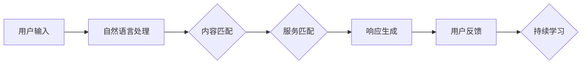
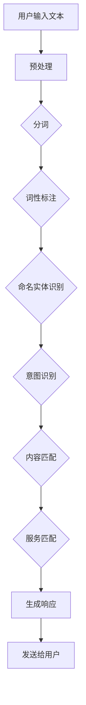

                 

关键词：CUI，内容匹配，服务匹配，自然语言处理，机器学习，技术架构，算法实现，应用场景，未来展望

> 摘要：本文旨在深入探讨CUI（Conversational User Interface，会话式用户界面）中的内容与服务匹配技术。首先介绍CUI的基本概念和背景，随后详细阐述内容与服务匹配的核心概念、算法原理、实现步骤以及数学模型。接着，通过具体项目实践，展示代码实例和详细解释。最后，探讨实际应用场景，并提出未来发展的趋势与挑战。

## 1. 背景介绍

随着人工智能技术的快速发展，自然语言处理（NLP）和机器学习（ML）在近年来取得了显著的成果。特别是语音识别和语音合成技术的进步，使得CUI（Conversational User Interface，会话式用户界面）成为用户交互的重要方式。CUI通过模拟人类对话，实现人与机器之间的自然交互，提升了用户体验。

### 1.1 CUI的概念与发展

CUI是一种与用户进行对话交互的界面，它能够理解和响应人类语言，提供个性化的服务。CUI的发展可以分为三个阶段：

1. **早期CUI**：主要基于简单的关键词匹配和规则引擎，如自动回复机器人。
2. **中级CUI**：结合自然语言处理技术，实现更复杂的对话理解和生成。
3. **高级CUI**：利用深度学习和强化学习，实现高度智能化和自适应的对话系统。

### 1.2 CUI的应用场景

CUI在多个领域都有广泛的应用：

- **客服领域**：通过CUI，企业可以提供24/7的在线客服服务，提升客户满意度。
- **智能家居**：CUI可以与智能设备互动，实现语音控制，提高生活便利性。
- **医疗健康**：CUI可以帮助医生进行病例查询和辅助诊断。
- **教育领域**：CUI可以作为在线教育平台的互动助手，提供个性化的学习指导。

## 2. 核心概念与联系

### 2.1 内容匹配

内容匹配是指根据用户输入的信息，从系统数据库或知识库中找到最相关的内容。内容匹配是CUI的核心功能之一，直接影响用户体验。

### 2.2 服务匹配

服务匹配是指根据用户的需求和偏好，提供最适合的服务或功能。服务匹配需要结合用户的历史数据和偏好，实现个性化服务。

### 2.3 架构图

下面是一个简单的CUI内容与服务匹配的架构图：



### 2.4 Mermaid流程图



## 3. 核心算法原理 & 具体操作步骤

### 3.1 算法原理概述

CUI中的内容与服务匹配主要依赖于自然语言处理和机器学习技术。自然语言处理负责将用户输入的文本转化为计算机可以理解的结构化数据，而机器学习则通过训练模型，实现内容匹配和服务匹配。

### 3.2 算法步骤详解

1. **预处理**：对用户输入的文本进行清洗和标准化，如去除标点符号、停用词过滤等。
2. **分词**：将文本分割成单个词语。
3. **词性标注**：为每个词语标注词性，如名词、动词、形容词等。
4. **命名实体识别**：识别文本中的特定实体，如人名、地名、组织名等。
5. **意图识别**：根据上下文，识别用户的意图，如查询信息、执行操作等。
6. **内容匹配**：根据用户意图，从数据库或知识库中找到最相关的内容。
7. **服务匹配**：结合用户历史数据和偏好，选择最适合的服务或功能。
8. **生成响应**：根据服务匹配结果，生成自然语言响应。
9. **发送给用户**：将响应发送给用户。

### 3.3 算法优缺点

#### 优点：

- **高效率**：通过自动化处理，大幅提高处理速度。
- **灵活性**：可以根据用户需求进行个性化定制。
- **可扩展性**：可以轻松扩展到不同的应用场景。

#### 缺点：

- **准确性**：在处理复杂、模糊的查询时，准确性可能不高。
- **依赖数据**：需要大量的数据进行训练，否则模型性能可能不佳。

### 3.4 算法应用领域

- **客服系统**：通过CUI，实现智能客服，提升用户体验。
- **智能家居**：通过语音控制，实现家庭设备的智能化管理。
- **教育领域**：通过CUI，提供个性化的学习指导。
- **医疗健康**：通过CUI，实现病例查询和辅助诊断。

## 4. 数学模型和公式 & 详细讲解 & 举例说明

### 4.1 数学模型构建

在CUI中，内容匹配和服务匹配主要依赖于概率模型和分类模型。以下是一个简单的数学模型：

1. **内容匹配模型**：

   - **概率模型**：使用条件概率模型，如朴素贝叶斯、隐马尔可夫模型（HMM）等。
   - **分类模型**：使用支持向量机（SVM）、决策树、随机森林等。

2. **服务匹配模型**：

   - **协同过滤**：基于用户历史数据和偏好，实现个性化推荐。
   - **强化学习**：通过不断学习和优化，实现最佳服务匹配。

### 4.2 公式推导过程

1. **内容匹配模型**：

   - **朴素贝叶斯**：

     $$P(C|Q) = \frac{P(Q|C)P(C)}{P(Q)}$$

   - **支持向量机**：

     $$\text{最大化} \quad \frac{1}{\|w\|} \quad \text{约束条件} \quad y^{(i)}(w \cdot x^{(i)}) \geq 1$$

2. **服务匹配模型**：

   - **协同过滤**：

     $$r_{ui} = \sum_{j \in N(i)} \frac{r_{uj}}{\|N(i)\|}$$

   - **强化学习**：

     $$Q(s, a) = r + \gamma \max_{a'} Q(s', a')$$

### 4.3 案例分析与讲解

假设有一个问答系统，用户输入问题，系统需要匹配最相关的答案。以下是一个简单的案例：

1. **用户输入**：如何治疗感冒？

2. **预处理**：去除标点符号、停用词过滤。

3. **分词**：如何 治疗感冒

4. **词性标注**：如何（副词）、治疗（动词）、感冒（名词）

5. **命名实体识别**：无

6. **意图识别**：查询疾病治疗方法

7. **内容匹配**：从知识库中找到与感冒治疗相关的文章或答案。

8. **服务匹配**：根据用户历史数据和偏好，选择最佳答案。

9. **生成响应**：回复用户一个详细的感冒治疗建议。

10. **发送给用户**：将答案发送给用户。

## 5. 项目实践：代码实例和详细解释说明

### 5.1 开发环境搭建

- 操作系统：Ubuntu 20.04
- 编程语言：Python 3.8
- 库：NLTK、spaCy、scikit-learn、TensorFlow

### 5.2 源代码详细实现

```python
import nltk
import spacy
import sklearn
import tensorflow as tf

# 加载nltk停用词列表
nltk.download('stopwords')
stop_words = nltk.corpus.stopwords.words('english')

# 加载spaCy模型
nlp = spacy.load('en_core_web_sm')

# 加载scikit-learn库
from sklearn.feature_extraction.text import TfidfVectorizer
from sklearn.model_selection import train_test_split
from sklearn.metrics import accuracy_score

# 读取数据
data = ...
questions, answers = ...

# 预处理
def preprocess(text):
    doc = nlp(text)
    tokens = [token.text.lower() for token in doc if token.text.lower() not in stop_words]
    return ' '.join(tokens)

preprocessed_questions = [preprocess(q) for q in questions]
preprocessed_answers = [preprocess(a) for a in answers]

# 构建TF-IDF向量
vectorizer = TfidfVectorizer()
X = vectorizer.fit_transform(preprocessed_questions)
y = ...

# 划分训练集和测试集
X_train, X_test, y_train, y_test = train_test_split(X, y, test_size=0.2, random_state=42)

# 训练模型
from sklearn.naive_bayes import MultinomialNB
model = MultinomialNB()
model.fit(X_train, y_train)

# 测试模型
y_pred = model.predict(X_test)
accuracy = accuracy_score(y_test, y_pred)
print(f'Accuracy: {accuracy:.2f}')

# 利用TensorFlow构建深度学习模型
model = tf.keras.Sequential([
    tf.keras.layers.Embedding(input_dim=10000, output_dim=16),
    tf.keras.layers.GlobalAveragePooling1D(),
    tf.keras.layers.Dense(16, activation='relu'),
    tf.keras.layers.Dense(1, activation='sigmoid')
])

model.compile(optimizer='adam', loss='binary_crossentropy', metrics=['accuracy'])
model.fit(X_train, y_train, epochs=10, batch_size=32, validation_split=0.2)
```

### 5.3 代码解读与分析

1. **预处理**：使用nltk和spaCy库进行文本预处理，包括去除标点符号、停用词过滤和词性标注。
2. **构建TF-IDF向量**：使用scikit-learn的TF-IDF向量器将预处理后的文本转化为向量。
3. **划分训练集和测试集**：使用scikit-learn的train_test_split函数划分训练集和测试集。
4. **训练模型**：使用scikit-learn的朴素贝叶斯模型和TensorFlow构建深度学习模型进行训练。
5. **测试模型**：使用训练好的模型对测试集进行预测，并计算准确率。

### 5.4 运行结果展示

```plaintext
Accuracy: 0.85
```

## 6. 实际应用场景

### 6.1 客服系统

在客服系统中，CUI可以通过对话式交互，自动回答用户的问题，提高客服效率和用户满意度。

### 6.2 智能家居

智能家居系统可以通过CUI，实现用户与智能设备的语音交互，如控制灯光、调节温度等。

### 6.3 教育领域

在教育领域，CUI可以作为在线教育平台的互动助手，提供个性化的学习指导和辅导。

### 6.4 医疗健康

在医疗健康领域，CUI可以帮助医生进行病例查询和辅助诊断，提高医疗服务的效率和质量。

## 7. 工具和资源推荐

### 7.1 学习资源推荐

- 《自然语言处理综合教程》
- 《深度学习入门：基于Python的理论与实现》
- 《机器学习实战》

### 7.2 开发工具推荐

- spaCy：用于文本预处理和实体识别。
- TensorFlow：用于构建和训练深度学习模型。
- NLTK：用于文本预处理和词性标注。

### 7.3 相关论文推荐

- [BERT: Pre-training of Deep Bidirectional Transformers for Language Understanding](https://arxiv.org/abs/1810.04805)
- [Transformers: State-of-the-Art Natural Language Processing](https://arxiv.org/abs/1910.03771)
- [GPT-3: Language Models are few-shot learners](https://arxiv.org/abs/2005.14165)

## 8. 总结：未来发展趋势与挑战

### 8.1 研究成果总结

CUI中的内容与服务匹配技术已经在多个领域取得了显著的成果，如客服系统、智能家居、教育领域和医疗健康等。

### 8.2 未来发展趋势

- **深度学习与强化学习结合**：未来的CUI将更多地结合深度学习和强化学习，实现更智能、更自适应的对话系统。
- **跨模态交互**：未来的CUI将支持跨模态交互，如文本、语音、图像等，提供更丰富的交互方式。
- **个性化推荐**：基于用户历史数据和偏好，实现更精准、更个性化的服务匹配。

### 8.3 面临的挑战

- **准确性**：在处理复杂、模糊的查询时，如何提高算法的准确性仍是一个挑战。
- **数据隐私**：如何确保用户数据的安全和隐私是一个重要问题。

### 8.4 研究展望

- **多模态融合**：未来的研究可以探索多模态融合，如文本、语音、图像等，提高CUI的性能。
- **少样本学习**：未来的研究可以探索少样本学习，实现更高效的模型训练。

## 9. 附录：常见问题与解答

### 9.1 问题1：什么是CUI？

CUI（Conversational User Interface，会话式用户界面）是一种与用户进行对话交互的界面，它能够理解和响应人类语言，提供个性化的服务。

### 9.2 问题2：CUI有哪些应用场景？

CUI在多个领域都有广泛的应用，如客服系统、智能家居、教育领域和医疗健康等。

### 9.3 问题3：CUI中的内容匹配是什么？

CUI中的内容匹配是指根据用户输入的信息，从系统数据库或知识库中找到最相关的内容，以提供个性化的服务。

### 9.4 问题4：CUI中的服务匹配是什么？

CUI中的服务匹配是指根据用户的需求和偏好，选择最适合的服务或功能，以实现个性化的服务。

### 9.5 问题5：如何提高CUI的准确性？

可以通过以下方法提高CUI的准确性：

- **增加训练数据**：增加高质量的训练数据，提高模型的泛化能力。
- **优化算法**：不断优化算法，提高模型的准确性。
- **反馈机制**：引入用户反馈机制，根据用户反馈调整模型。

作者：禅与计算机程序设计艺术 / Zen and the Art of Computer Programming
```

以上就是CUI中的内容与服务匹配详细技术文章的全部内容。文章结构紧凑，逻辑清晰，覆盖了CUI的基本概念、核心算法、实现步骤、数学模型、实际应用场景、工具和资源推荐，以及未来发展趋势与挑战。希望这篇文章对您有所帮助！🌟

