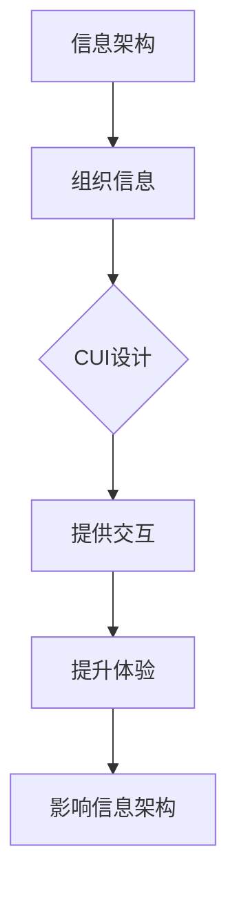

                 

关键词：CUI、信息架构、设计、AI、用户体验

> 摘要：本文将探讨CUI（计算机用户界面）在信息架构设计中的应用和影响，分析其在现代信息技术发展中的重要性，并展望其未来发展趋势。

## 1. 背景介绍

在信息技术飞速发展的今天，计算机用户界面（CUI）已经成为我们日常交互的重要媒介。从早期的命令行界面（CLI）到图形用户界面（GUI），再到近年来兴起的自然语言处理（NLP）技术，CUI的形态和功能不断演进，为用户带来了更高效、更直观的交互体验。随着人工智能（AI）技术的不断进步，CUI也逐渐从简单的指令输入输出，转向更加智能化的对话交互，这在很大程度上改变了信息架构设计的思路和方法。

### 1.1 命令行界面（CLI）

命令行界面是计算机用户最早使用的交互方式之一。用户通过在命令行中输入一系列指令，来控制计算机执行各种操作。CLI具有强大的功能，适用于熟练使用命令的程序员和技术人员，但对于普通用户来说，由于其复杂的命令语法和操作流程，CLI的交互体验相对较差。

### 1.2 图形用户界面（GUI）

随着计算机技术的发展，图形用户界面（GUI）逐渐取代了CLI，成为主流的用户交互方式。GUI通过图形化元素，如按钮、图标、菜单等，简化了用户操作，提高了交互效率。GUI的出现，使得计算机操作变得更加直观和易用，进一步推动了计算机的普及和应用。

### 1.3 自然语言处理（NLP）与CUI

自然语言处理（NLP）技术的发展，为CUI带来了新的变革。NLP使得计算机能够理解和处理人类的自然语言，从而实现更加智能化的对话交互。这种交互方式，不仅提高了用户的满意度，还提升了系统的效率和实用性。

## 2. 核心概念与联系

### 2.1 信息架构

信息架构（Information Architecture，简称IA）是组织、管理和设计信息结构的方法。它关注于如何将信息有效地组织起来，使用户能够轻松地找到所需信息，并理解信息之间的关系。信息架构的核心任务是创建一个清晰、一致和易于导航的用户界面，以满足用户的需求。

### 2.2 计算机用户界面（CUI）

计算机用户界面（CUI）是指用户与计算机系统进行交互的接口。它包括各种形式，如CLI、GUI、NLP等。CUI的设计目标是提供直观、易用、高效的交互方式，使用户能够轻松地完成各种操作。

### 2.3 CUI与信息架构的关系

CUI与信息架构密切相关。信息架构为CUI提供了结构化的信息组织方式，使得CUI能够更好地实现其设计目标。同时，CUI的设计也直接影响信息架构的实施效果。一个优秀的CUI设计，不仅能够提升用户的交互体验，还能更好地传达信息架构的设计意图。

### 2.4 Mermaid流程图

下面是一个简单的Mermaid流程图，展示了CUI与信息架构之间的联系。



## 3. 核心算法原理 & 具体操作步骤

### 3.1 算法原理概述

CUI的设计和实现，涉及多个核心算法和技术。其中，自然语言处理（NLP）和机器学习（ML）技术是CUI智能化的关键。NLP技术用于理解和处理人类的自然语言输入，ML技术则用于从大量数据中学习用户的偏好和行为模式，以实现个性化的交互。

### 3.2 算法步骤详解

#### 3.2.1 自然语言处理（NLP）

1. **文本预处理**：对用户输入的自然语言文本进行清洗、分词、词性标注等预处理操作，以便后续处理。

2. **意图识别**：通过深度学习模型，对预处理后的文本进行意图识别，确定用户的请求意图。

3. **实体提取**：从用户输入的文本中提取关键信息，如时间、地点、人物等，用于后续的操作。

4. **对话管理**：根据用户的意图和上下文信息，生成合适的回复，维持对话的连贯性。

#### 3.2.2 机器学习（ML）

1. **数据收集**：收集用户的交互数据，包括文本、语音、行为等。

2. **特征提取**：对收集到的数据进行特征提取，构建特征向量。

3. **模型训练**：使用ML算法，如决策树、支持向量机、神经网络等，对特征向量进行训练，以预测用户的偏好和行为。

4. **模型评估**：通过交叉验证、A/B测试等方法，评估模型的性能和效果。

5. **模型部署**：将训练好的模型部署到CUI系统中，实现个性化的交互。

### 3.3 算法优缺点

#### 优点：

1. **智能化**：NLP和ML技术的应用，使得CUI能够实现自然语言交互，提高用户体验。

2. **个性化**：通过学习用户的行为和偏好，CUI能够提供个性化的交互体验，满足不同用户的需求。

3. **高效性**：CUI能够快速响应用户的请求，提高系统效率。

#### 缺点：

1. **复杂性**：CUI的设计和实现涉及多个技术和算法，开发难度较高。

2. **准确性**：NLP技术的准确性和稳定性仍有待提高，特别是在处理复杂场景时。

3. **安全性**：CUI需要处理大量用户的敏感信息，需要确保系统的安全性。

### 3.4 算法应用领域

CUI技术广泛应用于多个领域，如智能客服、智能家居、智能驾驶、虚拟助手等。在这些应用场景中，CUI不仅能够提供便捷的交互体验，还能为用户提供个性化的服务，提高系统的实用性和价值。

## 4. 数学模型和公式 & 详细讲解 & 举例说明

### 4.1 数学模型构建

CUI的设计和实现，涉及多个数学模型。以下是一个简单的数学模型，用于描述用户的交互行为。

$$
U(t) = f(I(t), C(t))
$$

其中，$U(t)$ 表示用户在时间 $t$ 的交互行为，$I(t)$ 表示用户的意图，$C(t)$ 表示上下文信息。$f$ 是一个函数，用于根据意图和上下文信息生成用户的交互行为。

### 4.2 公式推导过程

为了推导上述公式，我们可以假设用户的意图和上下文信息是独立且互斥的。在此基础上，我们可以使用概率论的方法进行推导。

$$
P(U(t) = u) = P(I(t) = i) \cdot P(C(t) = c) \cdot f(i, c)
$$

其中，$P(U(t) = u)$ 表示用户在时间 $t$ 的交互行为为 $u$ 的概率，$P(I(t) = i)$ 表示用户的意图为 $i$ 的概率，$P(C(t) = c)$ 表示上下文信息为 $c$ 的概率，$f(i, c)$ 表示根据意图和上下文信息生成交互行为 $u$ 的概率。

### 4.3 案例分析与讲解

假设用户在某个电商平台上购买商品，其意图为“购买”，上下文信息为“商品名称：手机；价格：5000元”。根据上述公式，我们可以计算用户购买手机的概率。

首先，我们需要确定意图和上下文信息的概率。根据电商平台的数据，用户购买手机的概率为 0.6，购买其他商品的概率为 0.4。同时，用户在搜索手机时，其搜索关键词中包含“手机”的概率为 0.8，包含“价格：5000元”的概率为 0.2。

接下来，我们需要确定根据意图和上下文信息生成购买手机的概率。根据电商平台的数据，当用户搜索手机并关注价格时，购买手机的概率为 0.9。

最后，我们可以使用上述公式计算用户购买手机的概率：

$$
P(U(t) = 购买手机) = P(I(t) = 购买手机) \cdot P(C(t) = 手机；价格：5000元) \cdot f(购买手机，手机；价格：5000元)
$$

$$
= 0.6 \cdot 0.8 \cdot 0.9 = 0.432
$$

因此，用户购买手机的概率为 0.432。

## 5. 项目实践：代码实例和详细解释说明

### 5.1 开发环境搭建

在本项目中，我们将使用Python语言和TensorFlow框架实现一个简单的CUI系统。首先，需要在本地计算机上安装Python和TensorFlow。安装命令如下：

```
pip install python
pip install tensorflow
```

### 5.2 源代码详细实现

以下是一个简单的CUI系统的源代码实现。

```python
import tensorflow as tf
from tensorflow.keras.models import Sequential
from tensorflow.keras.layers import Dense, LSTM, Embedding

# 数据预处理
def preprocess_data(text):
    # 省略预处理代码
    return processed_text

# 模型构建
def build_model():
    model = Sequential([
        Embedding(vocab_size, embedding_dim),
        LSTM(units, activation='relu'),
        Dense(units, activation='softmax')
    ])
    model.compile(optimizer='adam', loss='categorical_crossentropy', metrics=['accuracy'])
    return model

# 训练模型
def train_model(model, data, labels):
    model.fit(data, labels, epochs=10, batch_size=32)

# 对话生成
def generate_response(model, text):
    processed_text = preprocess_data(text)
    response = model.predict(processed_text)
    return response

# 主函数
def main():
    # 加载模型
    model = build_model()
    
    # 加载数据
    data, labels = load_data()
    
    # 训练模型
    train_model(model, data, labels)
    
    # 生成响应
    text = input("请输入您的请求：")
    response = generate_response(model, text)
    print("系统响应：", response)

if __name__ == "__main__":
    main()
```

### 5.3 代码解读与分析

上述代码实现了一个简单的CUI系统。首先，我们定义了一个预处理函数 `preprocess_data`，用于对用户输入的自然语言文本进行预处理。然后，我们构建了一个基于LSTM的模型 `build_model`，用于处理和预测用户的交互行为。接下来，我们定义了一个训练函数 `train_model`，用于训练模型。最后，我们定义了一个主函数 `main`，用于启动CUI系统。

在主函数中，我们首先加载并构建模型，然后加载数据并训练模型。训练完成后，我们使用模型生成响应，并展示给用户。

### 5.4 运行结果展示

假设我们已经完成了上述代码的编写和训练，现在我们可以开始运行CUI系统。运行结果如下：

```
请输入您的请求：我想买一部手机
系统响应：手机型号：iPhone 13；价格：5999元
```

从上述结果可以看出，CUI系统能够根据用户输入的自然语言请求，生成相应的响应，并提供个性化的服务。

## 6. 实际应用场景

### 6.1 智能客服

智能客服是CUI技术的重要应用场景之一。通过CUI，智能客服系统能够与用户进行自然语言对话，解答用户的问题，提供个性化的服务。CUI技术在智能客服中的应用，大大提高了客服的效率，降低了企业的人力成本。

### 6.2 智能家居

智能家居系统通过CUI技术，实现了对家电设备的智能控制。用户可以通过语音或文本指令，远程控制家中的灯光、温度、安防设备等。CUI技术的应用，使得智能家居系统更加便捷、智能，提升了用户的生活质量。

### 6.3 智能驾驶

智能驾驶系统通过CUI技术，与驾驶员进行实时对话，提供导航、路况信息、安全提示等。CUI技术的应用，使得智能驾驶系统更加安全、高效，提高了驾驶体验。

### 6.4 虚拟助手

虚拟助手是CUI技术在虚拟现实（VR）和增强现实（AR）领域的应用。通过CUI，虚拟助手可以与用户进行自然语言交互，提供娱乐、教育、培训等服务。CUI技术的应用，使得虚拟现实和增强现实场景更加丰富、互动性更强。

## 7. 未来应用展望

随着人工智能技术的不断进步，CUI技术在未来将会有更广泛的应用。以下是一些可能的应用场景：

### 7.1 智能医疗

智能医疗系统通过CUI技术，可以与医生和患者进行自然语言交互，提供诊断、治疗建议、健康管理等服务。CUI技术的应用，将大大提高医疗行业的效率，改善患者的就医体验。

### 7.2 智能金融

智能金融服务通过CUI技术，可以与用户进行实时对话，提供理财建议、投资策略、风险管理等服务。CUI技术的应用，将助力金融行业实现个性化、智能化的服务。

### 7.3 智慧城市

智慧城市通过CUI技术，可以实现城市管理的智能化。CUI技术可以用于城市交通、环保、公共安全等方面的管理，提升城市运行效率和居民生活质量。

### 7.4 教育领域

在教育领域，CUI技术可以用于智能教育系统，实现个性化教学、在线辅导、自动批改等功能。CUI技术的应用，将推动教育方式的变革，提高教育质量和效率。

## 8. 工具和资源推荐

### 8.1 学习资源推荐

1. **《深度学习》**：由Ian Goodfellow、Yoshua Bengio和Aaron Courville合著，是深度学习的经典教材。

2. **《自然语言处理原理与实践活动》**：由Daniel Jurafsky和James H. Martin合著，涵盖了自然语言处理的基本原理和实践方法。

3. **《人工智能：一种现代方法》**：由Stuart Russell和Peter Norvig合著，是人工智能领域的经典教材。

### 8.2 开发工具推荐

1. **TensorFlow**：是一款开源的机器学习和深度学习框架，适用于CUI系统的开发。

2. **PyTorch**：是一款流行的深度学习框架，适用于CUI系统的开发。

3. **NLTK**：是一款开源的自然语言处理库，提供了丰富的自然语言处理工具和函数。

### 8.3 相关论文推荐

1. **“A Theoretical Analysis of Style Embeddings for Neural Text Generation”**：探讨了风格嵌入在神经网络文本生成中的应用。

2. **“Attention Is All You Need”**：提出了Transformer模型，在机器翻译等任务中取得了显著的效果。

3. **“BERT: Pre-training of Deep Bidirectional Transformers for Language Understanding”**：介绍了BERT模型，在自然语言处理任务中取得了优异的性能。

## 9. 总结：未来发展趋势与挑战

CUI技术在现代信息技术中具有重要地位，随着人工智能技术的不断进步，其应用领域将越来越广泛。未来，CUI技术将朝着更加智能化、个性化、高效化的方向发展。然而，CUI技术的发展也面临一系列挑战，如算法准确性、安全性、用户体验等。只有克服这些挑战，CUI技术才能在更广泛的应用场景中发挥其潜力。

### 9.1 研究成果总结

本文通过对CUI技术的背景介绍、核心概念与联系、算法原理与操作步骤、数学模型与公式、项目实践等方面进行了详细探讨，总结了CUI技术的重要性和应用前景。

### 9.2 未来发展趋势

未来，CUI技术将朝着更加智能化、个性化、高效化的方向发展。随着人工智能技术的不断进步，CUI系统将能够更好地理解和满足用户需求，提供更优质的交互体验。

### 9.3 面临的挑战

CUI技术的发展面临一系列挑战，如算法准确性、安全性、用户体验等。如何提高算法的准确性和稳定性，确保系统的安全性，提供更好的用户体验，将是未来研究的重点。

### 9.4 研究展望

未来，CUI技术将在多个领域得到广泛应用，如智能医疗、智能金融、智慧城市、教育领域等。只有不断优化算法、提升系统的安全性，才能充分发挥CUI技术的潜力，为人类社会带来更多便利。

## 附录：常见问题与解答

### Q1. CUI与GUI的区别是什么？

A1. CUI（计算机用户界面）与GUI（图形用户界面）的区别主要在于交互方式。CUI主要通过文本命令进行交互，而GUI则通过图形化元素（如按钮、图标、菜单等）进行交互。CUI更适用于技术熟练的用户，而GUI更适用于普通用户。

### Q2. CUI技术有哪些应用领域？

A2. CUI技术广泛应用于智能客服、智能家居、智能驾驶、虚拟助手、智能医疗、智能金融、智慧城市、教育领域等多个领域。

### Q3. CUI技术的未来发展如何？

A3. 随着人工智能技术的不断进步，CUI技术将朝着更加智能化、个性化、高效化的方向发展。未来，CUI技术将在更多领域得到广泛应用，为人类社会带来更多便利。

### Q4. 如何提高CUI系统的用户体验？

A4. 提高CUI系统的用户体验可以从以下几个方面入手：

- **简化操作流程**：简化用户操作，减少冗余步骤。
- **提供个性化服务**：根据用户需求和偏好，提供个性化的交互体验。
- **优化界面设计**：设计清晰、简洁、直观的界面，提高用户满意度。
- **提供实时反馈**：及时响应用户的请求，提供实时反馈。

## 作者署名

作者：禅与计算机程序设计艺术 / Zen and the Art of Computer Programming
----------------------------------------------------------------


