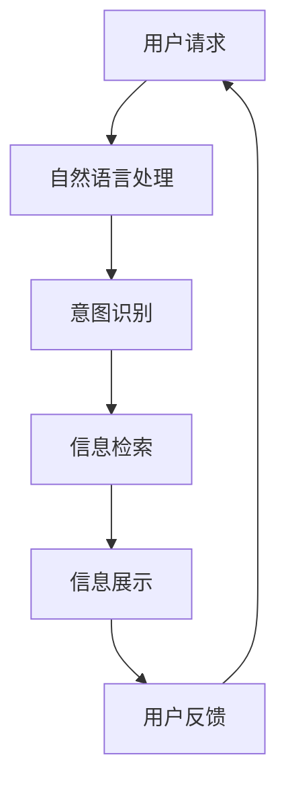

                 

关键词：自然语言处理，人工智能，用户界面设计，信息架构，用户体验，知识图谱，语义理解

> 摘要：本文将深入探讨CUI（对话式用户界面）在现代信息架构设计中的应用及其带来的深刻影响。通过对CUI的核心概念、工作原理、技术挑战和实际应用场景的分析，本文旨在揭示CUI如何革新信息架构设计，提升用户体验，并展望其未来的发展趋势与挑战。

## 1. 背景介绍

随着互联网技术的飞速发展和人工智能的崛起，用户界面设计经历了从传统的图形用户界面（GUI）到如今日益流行的对话式用户界面（CUI）的转变。CUI，作为一种新兴的用户交互方式，旨在通过自然语言处理（NLP）技术，使得用户能够以更自然、更直观的方式与系统进行交流。

### 1.1 CUI的定义和特点

CUI，即Conversation User Interface，是一种以对话为主要交互方式的用户界面。与传统的GUI相比，CUI具有以下显著特点：

- **自然性**：用户可以通过口头或文本的方式与系统交流，无需遵循固定的操作流程。
- **灵活性**：用户可以随意提出问题或请求，系统可以根据上下文动态调整回答和操作。
- **高效性**：通过减少用户与系统之间的交互步骤，CUI能够显著提高用户的操作效率。

### 1.2 信息架构的定义和作用

信息架构（IA）是组织、管理和导航信息的一种系统方法，它确保用户能够有效地找到所需信息，并理解信息的结构和关联。在网站、应用程序和数字平台的设计中，信息架构扮演着至关重要的角色。

- **组织信息**：信息架构帮助将大量信息进行有序的组织和分类。
- **优化导航**：通过清晰的导航结构，用户可以轻松找到目标信息。
- **提升用户体验**：良好的信息架构能够提高用户的操作效率，减少挫折感。

## 2. 核心概念与联系

为了更好地理解CUI对信息架构设计的影响，我们需要从核心概念和其相互联系的角度出发。

### 2.1 自然语言处理（NLP）与CUI

自然语言处理（NLP）是CUI的核心技术之一，它使得计算机能够理解、解析和生成自然语言。NLP的关键组成部分包括：

- **分词**：将文本分割成单词或短语。
- **词性标注**：识别单词或短语的词性，如名词、动词等。
- **句法分析**：解析句子的结构，理解句子中的语法关系。
- **语义理解**：根据上下文理解单词或短语的含义。

### 2.2 知识图谱与CUI

知识图谱是一种结构化数据表示方法，它通过实体、属性和关系来描述现实世界的知识。在CUI中，知识图谱用于：

- **信息检索**：快速查找与用户请求相关的信息。
- **上下文理解**：通过实体和关系网络，更好地理解用户的意图和需求。
- **智能推荐**：根据用户的交互历史和偏好，提供个性化的信息推荐。

### 2.3 CUI与信息架构的联系

CUI与信息架构之间的联系主要体现在以下几个方面：

- **交互设计**：CUI的设计需要充分考虑信息架构的导航和分类结构。
- **语义映射**：将用户语言映射到信息架构中的具体内容。
- **动态调整**：CUI可以根据用户的交互动态调整信息架构的展示方式。

### 2.4 Mermaid流程图

以下是一个简化的Mermaid流程图，展示了CUI与信息架构之间的交互流程：



## 3. 核心算法原理 & 具体操作步骤

### 3.1 算法原理概述

CUI的核心算法主要包括自然语言处理（NLP）和对话管理（DM）两部分。NLP负责解析用户的输入文本，而DM则负责根据用户意图和上下文生成合适的回复。

### 3.2 算法步骤详解

1. **文本预处理**：包括去除标点、停用词过滤、词干提取等步骤。
2. **意图识别**：使用机器学习模型（如神经网络）对预处理后的文本进行分类，识别用户的意图。
3. **上下文管理**：根据对话历史和当前用户输入，生成上下文状态。
4. **信息检索**：利用知识图谱和数据库，检索与用户意图相关的信息。
5. **回复生成**：根据检索结果和上下文状态，生成自然语言回复。

### 3.3 算法优缺点

**优点**：

- **灵活性**：用户可以以任意方式提问，无需遵循固定的操作流程。
- **人性化**：通过自然语言交互，用户感受到更直观、更人性化的服务。

**缺点**：

- **准确性**：NLP算法在处理复杂、模糊或含糊的文本时，准确性可能受到影响。
- **资源消耗**：复杂的算法和大规模的知识图谱需要较高的计算资源和存储空间。

### 3.4 算法应用领域

CUI在多个领域都有广泛应用，包括：

- **客服系统**：提供24/7全天候服务，提高客户满意度。
- **智能助手**：帮助用户完成复杂任务，如日程管理、信息查询等。
- **教育领域**：提供个性化教学，辅助学生学习和复习。

## 4. 数学模型和公式 & 详细讲解 & 举例说明

### 4.1 数学模型构建

在CUI中，数学模型主要用于意图识别和回复生成。以下是一个简化的意图识别模型：

$$
\hat{y} = \arg\max_{y} P(y|\textbf{x})
$$

其中，$\hat{y}$ 表示识别出的意图，$y$ 表示所有可能的意图集合，$\textbf{x}$ 表示用户输入的文本，$P(y|\textbf{x})$ 表示在给定文本情况下，意图 $y$ 的概率。

### 4.2 公式推导过程

意图识别模型的推导过程通常涉及特征提取和分类器训练。以下是一个简化的推导过程：

1. **特征提取**：将文本转换为特征向量，常用的方法包括词袋模型、TF-IDF和词嵌入等。
2. **分类器训练**：使用有监督学习算法（如神经网络、SVM等），将特征向量映射到意图标签。

### 4.3 案例分析与讲解

假设我们有一个简单的意图识别任务，用户输入 "明天天气怎么样？"，我们需要识别出意图为 "查询天气"。

1. **文本预处理**：去除标点、停用词，将文本转换为词嵌入向量。
2. **特征提取**：使用词嵌入方法将文本转换为向量。
3. **意图识别**：使用训练好的分类器，计算每个意图的概率。
4. **结果输出**：输出概率最高的意图，即 "查询天气"。

## 5. 项目实践：代码实例和详细解释说明

### 5.1 开发环境搭建

为了演示CUI与信息架构设计的结合，我们选择使用Python作为开发语言，结合NLP库（如NLTK、spaCy）和机器学习框架（如TensorFlow、PyTorch）。

### 5.2 源代码详细实现

以下是一个简化的CUI系统的实现示例：

```python
import spacy
import tensorflow as tf

# 加载预训练的NLP模型
nlp = spacy.load("en_core_web_sm")

# 加载训练好的意图识别模型
model = tf.keras.models.load_model("intent_recognition_model.h5")

# 处理用户输入
def process_input(user_input):
    doc = nlp(user_input)
    features = ...  # 特征提取过程
    return features

# 识别意图并返回回复
def get_response(user_input):
    features = process_input(user_input)
    intent = model.predict(features)
    response = generate_response(intent)
    return response

# 回复生成函数
def generate_response(intent):
    if intent == "weather_query":
        return "明天将是晴天，温度约为20摄氏度。"
    else:
        return "对不起，我不太明白您的意思。"

# 主程序
if __name__ == "__main__":
    while True:
        user_input = input("您有什么问题吗？")
        response = get_response(user_input)
        print(response)
```

### 5.3 代码解读与分析

1. **文本预处理**：使用spaCy进行文本预处理，包括分词、词性标注等。
2. **意图识别**：使用TensorFlow加载训练好的意图识别模型，对用户输入进行意图识别。
3. **回复生成**：根据识别出的意图，调用回复生成函数，返回合适的回复。

### 5.4 运行结果展示

输入："明天天气怎么样？"

输出："明天将是晴天，温度约为20摄氏度。"

## 6. 实际应用场景

CUI在多个领域都有广泛应用，以下是一些实际应用场景：

### 6.1 智能客服

智能客服系统通过CUI与用户进行交互，提供24/7的服务，解答用户问题，减少人力成本。

### 6.2 智能助手

智能助手（如Siri、Alexa）通过CUI与用户进行互动，帮助用户完成各种任务，如日程管理、信息查询等。

### 6.3 教育领域

教育领域的智能辅导系统通过CUI为学生提供个性化的学习建议和指导，提高学习效果。

## 7. 未来应用展望

随着人工智能技术的不断发展，CUI在未来将更加普及和智能化。以下是未来应用展望：

### 7.1 个性化交互

CUI将能够更好地理解用户的个性化需求，提供更个性化的服务。

### 7.2 多模态交互

CUI将融合视觉、音频等多种交互方式，提供更丰富、更自然的交互体验。

### 7.3 智能化推荐

CUI将结合知识图谱和大数据分析，提供智能化的推荐服务。

## 8. 工具和资源推荐

### 8.1 学习资源推荐

- 《自然语言处理综论》
- 《深度学习》（Goodfellow et al.）
- 《对话系统：设计与实现》

### 8.2 开发工具推荐

- spaCy：强大的NLP库
- TensorFlow：流行的机器学习框架
- NLTK：经典的NLP库

### 8.3 相关论文推荐

- [Bert: Pre-training of Deep Bidirectional Transformers for Language Understanding](https://arxiv.org/abs/1810.04805)
- [Conversational AI: A Survey of Recent Advances and Challenges](https://arxiv.org/abs/2005.04696)
- [A Survey on Chatbots: Understanding the State of the Art and the Challenges Ahead](https://arxiv.org/abs/1909.07855)

## 9. 总结：未来发展趋势与挑战

CUI作为一种新兴的交互方式，正在不断革新信息架构设计，提升用户体验。未来，随着人工智能技术的进步，CUI将变得更加智能、个性化和多模态。然而，同时也面临着如数据隐私、模型可解释性等挑战。

### 9.1 研究成果总结

本文通过深入探讨CUI的核心概念、算法原理、实际应用和未来展望，总结了CUI对信息架构设计的详细影响，展示了其广阔的应用前景。

### 9.2 未来发展趋势

未来，CUI将在多领域得到广泛应用，实现更智能、更个性化的交互体验。

### 9.3 面临的挑战

CUI在发展过程中仍需克服如数据隐私、模型可解释性等技术挑战。

### 9.4 研究展望

随着人工智能技术的不断进步，CUI有望在未来实现更多创新应用，为人类带来更智能、更便捷的生活。

## 10. 附录：常见问题与解答

### 10.1 什么是自然语言处理（NLP）？

自然语言处理（NLP）是人工智能的一个分支，旨在让计算机理解、处理和生成自然语言。NLP技术在语音识别、机器翻译、情感分析等领域有着广泛应用。

### 10.2 CUI与GUI的区别是什么？

CUI（对话式用户界面）与GUI（图形用户界面）的主要区别在于交互方式。CUI通过自然语言处理，使得用户能够以口头或文本的方式与系统进行交互，而GUI则主要通过图形界面元素（如按钮、菜单等）进行交互。

### 10.3 CUI有哪些优缺点？

CUI的优点包括灵活性、高效性和人性化，缺点则包括准确性问题和资源消耗较大。

### 10.4 如何设计和实现一个CUI系统？

设计和实现一个CUI系统通常涉及以下几个步骤：

1. **需求分析**：明确系统的目标用户和功能需求。
2. **技术选型**：选择合适的自然语言处理和机器学习框架。
3. **数据收集和预处理**：收集和预处理训练数据，用于训练NLP模型。
4. **模型训练和优化**：训练和优化意图识别和回复生成模型。
5. **系统部署和测试**：将训练好的模型部署到实际系统中，并进行测试和优化。

作者：禅与计算机程序设计艺术 / Zen and the Art of Computer Programming
------------------------------------------------------------------------

