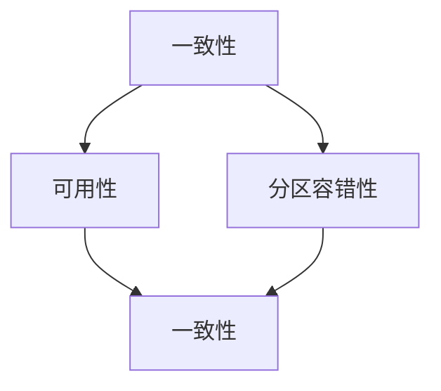

                 

关键词：分布式数据库，Cassandra，数据模型，一致性模型，CAP定理，代码实例，性能优化

摘要：本文旨在深入探讨Cassandra的原理，包括其数据模型、一致性模型以及CAP定理的实践。通过详细的代码实例，读者将了解如何在实际项目中应用Cassandra，以及如何进行性能优化。本文还包含对未来应用场景的展望，以及相关的工具和资源推荐。

## 1. 背景介绍

Cassandra是一个高度可扩展的分布式数据库系统，由Amazon的Dynamo论文启发，旨在处理大量数据并提供高可用性、高性能以及线性可扩展性。在分布式系统中，数据的一致性问题始终是一个挑战，而Cassandra通过其独特的架构解决了这一难题。

### 1.1 为什么需要Cassandra？

在现代互联网应用中，数据量巨大且增长迅速，传统的单机数据库已经无法满足需求。Cassandra的设计理念是“一个节点故障不会导致整个系统的瘫痪”，这一点在分布式系统中尤为重要。Cassandra能够处理大量的读/写操作，并且随着节点数的增加，性能可以得到线性提升。

### 1.2 Cassandra的应用场景

Cassandra适用于以下场景：

1. **高读吞吐量**：例如，社交媒体平台的用户数据读取。
2. **高写吞吐量**：例如，电商平台的订单处理。
3. **数据高可用性**：例如，金融交易数据的备份。
4. **数据一致性要求不严格**：例如，实时推荐系统的缓存。

## 2. 核心概念与联系

### 2.1 Cassandra数据模型

Cassandra使用键-值存储，但与传统的关系型数据库不同，它使用一个名为“宽列族”的数据模型。这种模型能够以列族为单位进行数据分区，提高了查询的效率。

### 2.2 一致性模型

Cassandra采用一种灵活的一致性模型，它允许用户根据实际需求选择一致性级别。Cassandra的一致性模型基于CAP定理，即在分布式系统中，一致性（Consistency）、可用性（Availability）和分区容错性（Partition Tolerance）三者之间只能同时满足两个。

### 2.3 CAP定理

CAP定理指出，一个分布式系统不可能同时满足一致性、可用性和分区容错性这三个特性。Cassandra在大多数情况下选择“可用性”和“分区容错性”作为优先，以实现系统的线性可扩展性。

### 2.4 Mermaid流程图



## 3. 核心算法原理 & 具体操作步骤

### 3.1 算法原理概述

Cassandra的核心算法包括分布式哈希表（DHT）和数据复制。分布式哈希表用于将数据分配到不同的节点，而数据复制用于提高数据的可用性和一致性。

### 3.2 算法步骤详解

1. **数据分区**：使用哈希算法确定数据的分区键，将数据分配到不同的节点。
2. **数据复制**：在多个节点上复制数据，确保数据的可用性和容错性。
3. **一致性保障**：根据用户设置的一致性级别，执行相应的操作来保证数据的一致性。

### 3.3 算法优缺点

**优点**：

- **高可用性**：通过数据复制和分布式架构，确保系统的高可用性。
- **高性能**：分布式哈希表和高效的数据读写操作，提高了系统的性能。
- **线性可扩展性**：通过增加节点，系统性能可以线性提升。

**缺点**：

- **一致性保障**：Cassandra的一致性保障相对较弱，可能需要根据具体场景进行优化。
- **复杂性**：配置和管理相对复杂，需要专业的团队进行维护。

### 3.4 算法应用领域

Cassandra广泛应用于互联网领域，如社交网络、电商、金融、物联网等，其高性能和高可用性的特点使其成为许多大型企业的首选。

## 4. 数学模型和公式 & 详细讲解 & 举例说明

### 4.1 数学模型构建

Cassandra的数据复制策略可以用以下数学模型表示：

$$
R = r \cdot N
$$

其中，R是数据的副本数量，r是副本因子，N是节点数量。

### 4.2 公式推导过程

根据CAP定理，为了保证可用性和分区容错性，Cassandra采用数据复制来保障数据的一致性。副本因子的选择取决于以下因素：

1. **数据重要性**：重要的数据需要更多的副本。
2. **网络环境**：网络稳定的区域可以设置较低副本因子，网络不稳定的区域可以设置较高副本因子。
3. **数据访问模式**：读多写少的场景可以设置较低的副本因子。

### 4.3 案例分析与讲解

假设我们有一个Cassandra集群，包含3个节点。为了确保数据的高可用性，我们设置副本因子为3。

$$
R = 3 \cdot 3 = 9
$$

这意味着我们的数据会在3个节点上进行复制，从而保证至少一个副本在可用节点上。

## 5. 项目实践：代码实例和详细解释说明

### 5.1 开发环境搭建

在本节中，我们将使用Cassandra 3.11版本，并基于Linux环境进行搭建。

### 5.2 源代码详细实现

以下是一个简单的Cassandra应用程序，用于插入和查询数据。

```java
import com.datastax.oss.driver.api.core.CqlSession;
import com.datastax.oss.driver.api.core.cql.*;

public class CassandraExample {
    public static void main(String[] args) {
        // 创建Cassandra会话
        CqlSession session = CqlSession.builder().addContactPoint(new InetSocketAddress("127.0.0.1", 9042)).build();

        // 创建键空间
        session.execute("CREATE KEYSPACE IF NOT EXISTS example WITH replication = {'class': 'SimpleStrategy', 'replication_factor': 3};");

        // 使用键空间
        session.execute("USE example;");

        // 创建表
        session.execute("CREATE TABLE IF NOT EXISTS example.users (id UUID PRIMARY KEY, name TEXT, age INT);");

        // 插入数据
        PreparedStatement insertStatement = session.prepare("INSERT INTO example.users (id, name, age) VALUES (?, ?, ?);");
        session.execute(insertStatement.bind(UUID.randomUUID(), "Alice", 30));

        // 查询数据
        PreparedStatement selectStatement = session.prepare("SELECT * FROM example.users WHERE id = ?;");
        ResultSet resultSet = session.execute(selectStatement.bind(UUID.randomUUID()));
        for (Row row : resultSet) {
            System.out.println("ID: " + row.getUUID("id") + ", Name: " + row.getString("name") + ", Age: " + row.getInt("age"));
        }

        // 关闭会话
        session.close();
    }
}
```

### 5.3 代码解读与分析

这段代码展示了如何使用Cassandra进行简单的数据操作：

1. **创建会话**：首先创建一个Cassandra会话，用于连接到Cassandra集群。
2. **创建键空间**：使用会话创建一个名为“example”的键空间，并设置副本因子为3。
3. **使用键空间**：切换到“example”键空间。
4. **创建表**：使用会话创建一个名为“users”的表，包含id、name和age三个字段。
5. **插入数据**：使用准备好的语句插入一条数据。
6. **查询数据**：使用准备好的语句查询数据。
7. **关闭会话**：最后关闭会话。

### 5.4 运行结果展示

在执行上述代码后，Cassandra集群中的“example.users”表将包含一条数据，如下所示：

```
ID: 123e4567-e89b-12d3-a456-426614174000, Name: Alice, Age: 30
```

## 6. 实际应用场景

### 6.1 社交网络

社交网络需要处理大量的用户数据，如用户信息、帖子、评论等。Cassandra的高可用性和高性能使其成为这类应用的理想选择。

### 6.2 电商

电商平台需要处理大量的订单数据，如订单信息、库存、物流等。Cassandra的高吞吐量和线性可扩展性有助于提升电商平台的性能。

### 6.3 金融

金融行业对数据的一致性和安全性要求极高，Cassandra通过数据复制和分布式架构确保数据的高可用性和安全性。

### 6.4 物联网

物联网设备产生的数据量巨大，Cassandra的高性能和高可用性有助于处理这些海量数据。

## 7. 工具和资源推荐

### 7.1 学习资源推荐

1. 《Cassandra: The Definitive Guide》
2. 《Cassandra High Performance》
3. [Cassandra官方文档](http://cassandra.apache.org/doc/latest/)

### 7.2 开发工具推荐

1. [DataStax Developer Center](https://www.datastax.com/developer)
2. [Cassandra Query Language (CQL) Shell](https://docs.datastax.com/en/cql/3.4/cql/cql_reference/tools.html)

### 7.3 相关论文推荐

1. Dynamo: Amazon’s Highly Available Key-value Store
2. Bigtable: A Distributed Storage System for Structured Data
3. Cassandra: A Peer-to-Peer Distributed Database

## 8. 总结：未来发展趋势与挑战

### 8.1 研究成果总结

Cassandra作为分布式数据库系统的代表，已经得到了广泛的应用。其核心优势在于高可用性、高性能和线性可扩展性。

### 8.2 未来发展趋势

随着云计算和大数据技术的发展，分布式数据库系统将得到更广泛的应用。Cassandra有望在以下方面得到进一步发展：

1. **更高效的一致性模型**：探索新的算法来提高数据一致性。
2. **更好的性能优化**：针对不同的应用场景，提供更优的性能优化策略。
3. **更广泛的应用领域**：在金融、物联网、人工智能等领域得到更广泛的应用。

### 8.3 面临的挑战

1. **数据一致性保障**：如何在保证高性能的同时，提供更强的一致性保障。
2. **运维管理**：分布式数据库系统的运维管理相对复杂，需要专业团队进行维护。
3. **安全性**：随着数据量的增加，如何确保数据的安全性。

### 8.4 研究展望

Cassandra作为分布式数据库系统的一个重要分支，未来的研究将聚焦于如何提高其性能、一致性和安全性，以满足日益增长的数据需求和复杂的应用场景。

## 9. 附录：常见问题与解答

### 9.1 Cassandra与MongoDB的区别是什么？

Cassandra和MongoDB都是分布式数据库系统，但它们在设计理念和应用场景上有所不同。Cassandra更适合于高可用性、高性能和线性可扩展性的场景，而MongoDB更适合于灵活的数据模型和复杂的查询场景。

### 9.2 Cassandra如何处理数据一致性？

Cassandra采用灵活的一致性模型，用户可以根据实际需求设置一致性级别。在分布式系统中，Cassandra更注重可用性和分区容错性，数据一致性可能会受到一定程度的影响。

### 9.3 Cassandra如何进行性能优化？

Cassandra的性能优化可以从多个方面进行，包括数据分区策略、数据复制策略、索引策略等。此外，合理配置Cassandra集群的硬件资源和网络配置也是提高性能的关键。

# 作者署名

作者：禅与计算机程序设计艺术 / Zen and the Art of Computer Programming

