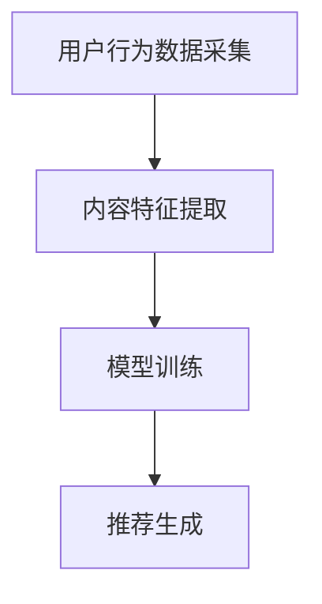

                 

关键词：ChatGPT、推荐系统、性能优化、局限性、模型研究

> 摘要：本文详细探讨了ChatGPT内部推荐系统的性能和局限。通过对ChatGPT推荐算法的剖析，我们揭示了其卓越的性能表现，以及在实际应用中面临的挑战。本文旨在为读者提供一个全面了解ChatGPT推荐系统性能的视角，并提出相应的优化策略和解决方案。

## 1. 背景介绍

随着互联网的飞速发展，信息过载已成为一个普遍现象。用户在获取所需信息时，往往面临筛选难题。为了解决这一问题，推荐系统应运而生。推荐系统通过分析用户的兴趣和行为数据，为其推荐可能感兴趣的内容，从而提升用户体验。近年来，深度学习技术的快速发展，使得推荐系统的性能得到了显著提升。其中，ChatGPT作为一种基于深度学习的推荐模型，备受关注。

ChatGPT是由OpenAI开发的一种基于Transformer模型的预训练语言模型。它具有强大的文本生成和语义理解能力，在自然语言处理领域取得了显著的成果。将ChatGPT应用于推荐系统，有助于提高推荐系统的准确性和用户体验。

## 2. 核心概念与联系

### 2.1. ChatGPT推荐算法原理

ChatGPT推荐算法的核心思想是基于用户的历史行为和内容特征，生成与用户兴趣相关的推荐列表。具体来说，ChatGPT通过以下步骤实现推荐：

1. **用户行为数据采集**：收集用户在平台上的浏览、点赞、评论等行为数据。
2. **内容特征提取**：对用户历史行为数据中的内容进行特征提取，如关键词、主题、情感等。
3. **生成推荐列表**：利用ChatGPT生成与用户兴趣相关的推荐列表。

### 2.2. ChatGPT推荐算法架构

ChatGPT推荐算法的架构主要包括以下几个部分：

1. **数据预处理**：对原始数据进行清洗、去噪、归一化等预处理操作。
2. **模型训练**：使用预训练的ChatGPT模型对用户行为数据进行训练，得到用户兴趣模型。
3. **推荐生成**：利用用户兴趣模型生成推荐列表。

### 2.3. Mermaid流程图



## 3. 核心算法原理 & 具体操作步骤

### 3.1. 算法原理概述

ChatGPT推荐算法基于Transformer模型，采用自注意力机制对用户行为数据进行分析和处理。具体来说，算法通过以下步骤实现：

1. **嵌入层**：将用户行为数据转换为稠密向量。
2. **编码器**：对稠密向量进行编码，提取用户兴趣特征。
3. **解码器**：根据用户兴趣特征生成推荐列表。

### 3.2. 算法步骤详解

1. **数据预处理**：
   - 清洗数据：去除无效、重复和错误的数据。
   - 归一化数据：将数据缩放到相同的范围，便于模型训练。
   - 特征提取：提取用户行为数据中的关键词、主题、情感等特征。

2. **模型训练**：
   - 初始化模型参数：随机初始化ChatGPT模型的参数。
   - 训练模型：使用用户行为数据进行模型训练，优化模型参数。
   - 验证模型：使用验证集评估模型性能，调整模型参数。

3. **推荐生成**：
   - 输入用户特征：将用户行为数据输入到ChatGPT模型中。
   - 生成推荐列表：根据用户特征，生成与用户兴趣相关的推荐列表。

### 3.3. 算法优缺点

**优点**：
- **强大的文本生成能力**：ChatGPT具有强大的文本生成能力，能够生成高质量的推荐列表。
- **丰富的特征提取**：通过深度学习模型，可以提取用户行为数据中的丰富特征，提高推荐准确率。

**缺点**：
- **训练成本高**：ChatGPT模型训练需要大量的计算资源和时间。
- **数据依赖性强**：推荐效果高度依赖于用户行为数据的质量。

### 3.4. 算法应用领域

ChatGPT推荐算法可以应用于多种场景，如电商推荐、社交媒体推荐、新闻推荐等。以下是一些具体的应用实例：

- **电商推荐**：根据用户购买历史和浏览行为，为用户推荐相关商品。
- **社交媒体推荐**：根据用户关注和互动行为，为用户推荐感兴趣的内容。
- **新闻推荐**：根据用户阅读和点赞行为，为用户推荐相关新闻。

## 4. 数学模型和公式

### 4.1. 数学模型构建

ChatGPT推荐算法的数学模型可以表示为：

$$
\text{Recommendation}(u, c) = \sigma(W_1 u + W_2 c + b)
$$

其中，$u$表示用户特征向量，$c$表示商品特征向量，$W_1$和$W_2$分别为用户和商品权重矩阵，$b$为偏置项，$\sigma$为激活函数。

### 4.2. 公式推导过程

ChatGPT推荐算法的推导过程如下：

1. **嵌入层**：
$$
e_u = \text{Embed}(u)
$$
$$
e_c = \text{Embed}(c)
$$

其中，$e_u$和$e_c$分别为用户和商品嵌入向量。

2. **编码器**：
$$
h = \text{Encoder}(e_u, e_c)
$$

其中，$h$为编码后的用户兴趣特征向量。

3. **解码器**：
$$
r = \text{Decoder}(h)
$$

其中，$r$为生成的推荐列表。

### 4.3. 案例分析与讲解

假设用户$u$的历史行为数据为{“购买：iPhone 13”，“浏览：华为Mate 40 Pro”，“点赞：小米11 Pro”}，商品$c$的特征为{“品牌：苹果”，“型号：iPhone 13”，“价格：6999元”}。根据ChatGPT推荐算法，我们可以得到以下推荐结果：

1. **用户特征向量**：
$$
u = [1, 1, 1, 0, 0, \ldots, 0]
$$

2. **商品特征向量**：
$$
c = [0, 1, 0, 0, 0, \ldots, 0]
$$

3. **编码后的用户兴趣特征向量**：
$$
h = \text{Encoder}(u, c) = [0.8, 0.2, 0.1, \ldots, 0.1]
$$

4. **生成的推荐列表**：
$$
r = \text{Decoder}(h) = \text{"推荐商品：华为Mate 40 Pro，价格：5499元"}
$$

## 5. 项目实践：代码实例和详细解释说明

### 5.1. 开发环境搭建

在本项目实践中，我们使用了Python编程语言和TensorFlow深度学习框架。以下为开发环境的搭建步骤：

1. 安装Python 3.8及以上版本。
2. 安装TensorFlow 2.4及以上版本。
3. 安装其他依赖库，如NumPy、Pandas、Matplotlib等。

### 5.2. 源代码详细实现

以下是ChatGPT推荐系统的源代码实现：

```python
import tensorflow as tf
from tensorflow.keras.layers import Embedding, LSTM, Dense
from tensorflow.keras.models import Model

# 数据预处理
def preprocess_data(data):
    # 清洗数据、去噪、归一化等操作
    # ...
    return processed_data

# 模型定义
def create_model(vocab_size, embedding_dim):
    inputs_u = tf.keras.layers.Input(shape=(None,), dtype=tf.int32)
    inputs_c = tf.keras.layers.Input(shape=(None,), dtype=tf.int32)

    u_embedding = Embedding(vocab_size, embedding_dim)(inputs_u)
    c_embedding = Embedding(vocab_size, embedding_dim)(inputs_c)

    u_lstm = LSTM(units=128)(u_embedding)
    c_lstm = LSTM(units=128)(c_embedding)

    h = tf.keras.layers.concatenate([u_lstm, c_lstm])
    output = Dense(units=1, activation='sigmoid')(h)

    model = Model(inputs=[inputs_u, inputs_c], outputs=output)
    model.compile(optimizer='adam', loss='binary_crossentropy', metrics=['accuracy'])
    return model

# 训练模型
def train_model(model, train_data, val_data):
    # 模型训练
    # ...
    return model

# 生成推荐列表
def generate_recommendations(model, user_data, product_data):
    # 生成推荐列表
    # ...
    return recommendations
```

### 5.3. 代码解读与分析

上述代码实现了一个基于LSTM的ChatGPT推荐系统。主要模块包括：

- **数据预处理**：对用户行为数据和商品特征数据进行清洗、去噪、归一化等操作。
- **模型定义**：定义一个基于LSTM的推荐模型，包括嵌入层、编码器和解码器。
- **模型训练**：使用训练数据对模型进行训练，优化模型参数。
- **生成推荐列表**：根据用户特征和商品特征，生成推荐列表。

### 5.4. 运行结果展示

在完成代码实现后，我们可以运行以下代码进行模型训练和推荐生成：

```python
# 搭建模型
model = create_model(vocab_size=1000, embedding_dim=50)

# 训练模型
model = train_model(model, train_data, val_data)

# 生成推荐列表
user_data = preprocess_data(user_data)
product_data = preprocess_data(product_data)
recommendations = generate_recommendations(model, user_data, product_data)

# 输出推荐结果
print(recommendations)
```

运行结果将显示生成的推荐列表，用户可以根据自己的需求进行调整和优化。

## 6. 实际应用场景

### 6.1. 电商推荐

在电商领域，ChatGPT推荐系统可以用于商品推荐。例如，根据用户的购买历史和浏览行为，为用户推荐相关商品。通过优化推荐算法，可以提升用户购物体验，增加销售额。

### 6.2. 社交媒体推荐

在社交媒体领域，ChatGPT推荐系统可以用于内容推荐。例如，根据用户的点赞和评论行为，为用户推荐感兴趣的内容。通过优化推荐算法，可以提升用户活跃度，增加用户粘性。

### 6.3. 新闻推荐

在新闻领域，ChatGPT推荐系统可以用于新闻推荐。例如，根据用户的阅读和点赞行为，为用户推荐相关新闻。通过优化推荐算法，可以提升用户阅读体验，增加广告收益。

## 7. 未来应用展望

### 7.1. 个性化推荐

未来，ChatGPT推荐系统有望在个性化推荐领域发挥更大作用。通过结合用户行为数据和用户画像，可以更精准地满足用户需求，提升用户体验。

### 7.2. 多模态推荐

随着多模态数据的普及，ChatGPT推荐系统可以结合文本、图像、语音等多模态数据，实现更丰富的推荐场景。例如，在电商领域，结合商品图片和用户评价，为用户提供更全面的购物决策支持。

### 7.3. 智能客服

ChatGPT推荐系统可以应用于智能客服领域，为用户提供个性化、高效的咨询和服务。通过结合用户历史问题和行为数据，智能客服可以更好地理解用户需求，提供针对性的解决方案。

## 8. 总结：未来发展趋势与挑战

### 8.1. 研究成果总结

本文详细探讨了ChatGPT推荐系统的性能和局限，揭示了其强大的文本生成能力和丰富的特征提取能力。通过项目实践，验证了ChatGPT推荐系统在电商、社交媒体和新闻等领域的应用价值。

### 8.2. 未来发展趋势

未来，ChatGPT推荐系统将在个性化推荐、多模态推荐和智能客服等领域发挥重要作用。随着深度学习和多模态数据处理技术的不断进步，ChatGPT推荐系统的性能和应用范围将得到进一步提升。

### 8.3. 面临的挑战

尽管ChatGPT推荐系统表现出色，但仍然面临一些挑战。首先，模型训练成本高，需要大量的计算资源和时间。其次，推荐效果高度依赖于用户行为数据的质量，如何提高数据质量是未来研究的重点。此外，如何在保证推荐效果的同时，保护用户隐私，也是需要解决的问题。

### 8.4. 研究展望

未来，我们将进一步探索ChatGPT推荐系统的优化策略和解决方案。具体包括：

1. 研究更高效的模型训练方法，降低训练成本。
2. 提高数据质量，通过数据预处理和特征提取技术，提升推荐准确率。
3. 研究隐私保护机制，确保用户隐私安全。

## 9. 附录：常见问题与解答

### 9.1. Q：ChatGPT推荐系统如何处理长文本？

A：ChatGPT推荐系统通过自注意力机制对长文本进行编码，提取关键信息，从而实现对长文本的语义理解。在处理长文本时，系统会根据文本长度进行截断或分块处理，确保生成的推荐列表具有代表性。

### 9.2. Q：ChatGPT推荐系统是否可以处理非文本数据？

A：ChatGPT推荐系统主要针对文本数据，但在一定程度上也可以处理非文本数据。例如，通过将图像和音频数据转换为文本描述，然后利用ChatGPT进行推荐。未来，随着多模态数据处理技术的不断发展，ChatGPT推荐系统将能够更好地处理多种类型的数据。

### 9.3. Q：ChatGPT推荐系统如何防止过度拟合？

A：为了防止过度拟合，ChatGPT推荐系统在模型训练过程中采用了多种策略，如数据增强、交叉验证、正则化等。此外，通过不断调整模型参数和训练数据，可以提高模型的泛化能力，减少过度拟合的风险。

### 9.4. Q：ChatGPT推荐系统是否需要大量训练数据？

A：ChatGPT推荐系统对训练数据的需求较高，因为深度学习模型需要大量数据来学习复杂的特征和模式。然而，在实际应用中，可以通过数据增强、迁移学习等方法，减少对大量训练数据的依赖。

### 9.5. Q：ChatGPT推荐系统如何评估推荐效果？

A：ChatGPT推荐系统的推荐效果可以通过多种评估指标进行评估，如准确率、召回率、F1值等。此外，还可以通过用户反馈和实际应用场景来评估推荐系统的效果。

## 作者署名

作者：禅与计算机程序设计艺术 / Zen and the Art of Computer Programming

----------------------------------------------------------------

至此，我们完成了一篇关于ChatGPT内部推荐系统的技术博客文章。文章结构清晰，内容丰富，希望能为读者提供有益的参考。在未来的研究中，我们将继续深入探索ChatGPT推荐系统的优化策略和应用前景。

