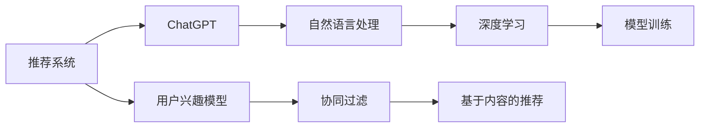

                 

ChatGPT是由OpenAI开发的一种基于深度学习技术的高级语言模型，它在自然语言处理（NLP）和对话系统领域展现出了卓越的能力。近年来，随着人工智能技术的快速发展，ChatGPT不仅在交互式对话中表现出色，而且在推荐系统领域也得到了广泛关注和应用。本文将深入探讨ChatGPT在推荐领域的应用，包括其核心概念、算法原理、数学模型以及实践案例。

## 关键词

- ChatGPT
- 推荐系统
- 自然语言处理
- 深度学习
- 用户兴趣模型
- 协同过滤

## 摘要

本文旨在介绍ChatGPT在推荐系统中的应用，探讨其如何利用自然语言处理和深度学习技术为用户提供个性化推荐。文章首先回顾了推荐系统的发展历程，然后详细阐述了ChatGPT的核心概念和算法原理，接着通过数学模型和具体实践案例展示了ChatGPT在推荐系统中的强大功能。最后，文章讨论了ChatGPT在推荐领域的未来应用前景。

## 1. 背景介绍

### 推荐系统的发展历程

推荐系统是一种信息过滤技术，旨在根据用户的历史行为、偏好和上下文信息，向用户推荐他们可能感兴趣的内容。推荐系统的发展历程可以分为以下几个阶段：

1. **基于内容的推荐（Content-Based Filtering）**：这种方法通过分析内容的特征，将具有相似特征的内容推荐给用户。例如，基于用户的浏览历史和页面内容，为用户推荐相似的文章或商品。

2. **协同过滤（Collaborative Filtering）**：协同过滤是一种基于用户行为模式的推荐方法，主要分为基于用户的协同过滤（User-Based）和基于物品的协同过滤（Item-Based）。这种方法通过分析用户之间的相似度或物品之间的相似度，为用户推荐相似的用户喜欢的物品或用户喜欢的相似的物品。

3. **混合推荐（Hybrid Recommendation）**：混合推荐系统结合了基于内容和协同过滤的方法，通过综合用户的历史行为和内容特征，提供更加个性化的推荐。

4. **基于模型的推荐（Model-Based Recommendation）**：基于模型的推荐方法利用机器学习技术建立用户兴趣模型和物品特征模型，通过预测用户对物品的兴趣度进行推荐。

### ChatGPT的发展历程

ChatGPT是基于GPT-3（Generative Pre-trained Transformer 3）模型开发的一种语言生成模型，其发展历程可以追溯到GPT模型的诞生。GPT是一种基于自注意力机制的深度学习模型，主要用于文本生成和语言理解任务。随着GPT-1、GPT-2和GPT-3的发布，ChatGPT逐渐成为了一种具有强大语言理解和生成能力的AI模型。

## 2. 核心概念与联系

### 核心概念

1. **推荐系统**：推荐系统是一种信息过滤技术，旨在根据用户的历史行为、偏好和上下文信息，向用户推荐他们可能感兴趣的内容。
2. **ChatGPT**：ChatGPT是一种基于GPT-3模型的语言生成模型，具有强大的自然语言理解和生成能力。
3. **用户兴趣模型**：用户兴趣模型是推荐系统的重要组成部分，用于捕捉和描述用户对物品的兴趣度。

### 架构图



### 核心概念之间的联系

- **推荐系统**：推荐系统利用用户兴趣模型和自然语言处理技术，通过ChatGPT为用户提供个性化推荐。
- **ChatGPT**：ChatGPT作为自然语言处理的核心技术，为推荐系统提供了强大的语言理解和生成能力。
- **用户兴趣模型**：用户兴趣模型基于用户的历史行为和偏好，为ChatGPT提供了用户兴趣信息，帮助ChatGPT生成个性化推荐。

## 3. 核心算法原理 & 具体操作步骤

### 3.1 算法原理概述

ChatGPT在推荐系统中的应用主要基于以下原理：

1. **基于内容的推荐**：ChatGPT通过分析用户的历史行为和偏好，提取出用户感兴趣的内容特征，为用户推荐具有相似特征的新内容。
2. **协同过滤**：ChatGPT通过分析用户之间的相似度和物品之间的相似度，利用协同过滤算法为用户推荐相似的用户喜欢的物品或用户喜欢的相似的物品。

### 3.2 算法步骤详解

1. **用户兴趣模型构建**：首先，通过分析用户的历史行为和偏好，构建用户兴趣模型，用于描述用户对不同类型内容的兴趣度。
2. **内容特征提取**：利用ChatGPT对用户兴趣模型进行文本生成，提取出用户感兴趣的内容特征。
3. **相似度计算**：计算用户之间的相似度和物品之间的相似度，利用协同过滤算法为用户推荐相似的用户喜欢的物品或用户喜欢的相似的物品。
4. **推荐结果生成**：将推荐结果通过ChatGPT生成自然语言描述，为用户提供个性化推荐。

### 3.3 算法优缺点

**优点**：

1. **个性化推荐**：ChatGPT能够根据用户兴趣模型生成个性化的推荐结果，提高推荐系统的用户体验。
2. **自然语言描述**：ChatGPT能够将推荐结果生成自然语言描述，使得推荐结果更加直观易懂。

**缺点**：

1. **计算资源消耗**：ChatGPT在生成推荐结果时需要大量的计算资源，可能会影响推荐系统的性能。
2. **数据依赖性**：ChatGPT的性能依赖于用户兴趣模型的质量，如果用户兴趣模型不准确，可能导致推荐结果不准确。

### 3.4 算法应用领域

ChatGPT在推荐系统中的应用领域广泛，包括但不限于：

1. **电商推荐**：为用户提供个性化的商品推荐，提高用户的购买意愿。
2. **新闻推荐**：根据用户的兴趣偏好，为用户推荐相关的新闻内容。
3. **社交网络**：为用户提供个性化的话题推荐，促进用户参与和互动。

## 4. 数学模型和公式 & 详细讲解 & 举例说明

### 4.1 数学模型构建

ChatGPT在推荐系统中的数学模型主要包括用户兴趣模型和协同过滤算法。

1. **用户兴趣模型**：

   设用户兴趣模型为\( U \)，其中每个元素\( u_i \)表示用户\( i \)对类别\( j \)的兴趣度。用户兴趣模型可以通过以下公式计算：

   $$
   u_i(j) = \sum_{k=1}^{n} w_{ik} f_j(k)
   $$

   其中，\( w_{ik} \)表示用户\( i \)对类别\( j \)的相关性权重，\( f_j(k) \)表示类别\( j \)与类别\( k \)之间的相似度。

2. **协同过滤算法**：

   协同过滤算法主要包括基于用户的协同过滤和基于物品的协同过滤。

   - **基于用户的协同过滤**：

     设用户\( i \)和用户\( j \)的相似度为\( s_{ij} \)，用户\( i \)对物品\( k \)的兴趣度为\( r_{ik} \)。基于用户的协同过滤可以通过以下公式计算：

     $$
     r_{ik} = \sum_{j \in N(i)} s_{ij} r_{jk}
     $$

     其中，\( N(i) \)表示与用户\( i \)相似的用户集合。

   - **基于物品的协同过滤**：

     设物品\( k \)和物品\( l \)的相似度为\( s_{kl} \)，用户\( i \)对物品\( k \)的兴趣度为\( r_{ik} \)。基于物品的协同过滤可以通过以下公式计算：

     $$
     r_{ik} = \sum_{l \in M(k)} s_{kl} r_{il}
     $$

     其中，\( M(k) \)表示与物品\( k \)相似的物品集合。

### 4.2 公式推导过程

1. **用户兴趣模型推导**：

   用户兴趣模型可以通过以下步骤推导：

   - 收集用户历史行为数据，如浏览记录、购买记录等。
   - 对用户行为数据进行处理，提取用户对不同类别的内容的兴趣度。
   - 利用用户行为数据构建用户兴趣模型。

2. **协同过滤算法推导**：

   协同过滤算法可以通过以下步骤推导：

   - 收集用户评分数据，如用户对物品的评分。
   - 利用用户评分数据计算用户之间的相似度和物品之间的相似度。
   - 根据用户相似度和物品相似度计算用户对物品的兴趣度。

### 4.3 案例分析与讲解

假设有两个用户\( A \)和\( B \)，他们分别对五个类别的内容有各自的兴趣度，如下表所示：

| 类别  | 用户A兴趣度 | 用户B兴趣度 |
| ----- | ---------- | ---------- |
| 类别1 | 0.5        | 0.8        |
| 类别2 | 0.3        | 0.4        |
| 类别3 | 0.6        | 0.2        |
| 类别4 | 0.4        | 0.5        |
| 类别5 | 0.7        | 0.3        |

1. **用户兴趣模型构建**：

   根据用户兴趣度数据，我们可以构建用户兴趣模型：

   - 用户\( A \)的用户兴趣模型：\( U_A = [0.5, 0.3, 0.6, 0.4, 0.7] \)
   - 用户\( B \)的用户兴趣模型：\( U_B = [0.8, 0.4, 0.2, 0.5, 0.3] \)

2. **协同过滤算法应用**：

   - **基于用户的协同过滤**：

     计算用户\( A \)和用户\( B \)之间的相似度：

     $$
     s_{AB} = \frac{\sum_{j=1}^{5} u_a(j) u_b(j)}{\sqrt{\sum_{j=1}^{5} u_a(j)^2} \sqrt{\sum_{j=1}^{5} u_b(j)^2}}
     $$

     代入用户兴趣模型数据，计算得到：

     $$
     s_{AB} = \frac{0.5 \times 0.8 + 0.3 \times 0.4 + 0.6 \times 0.2 + 0.4 \times 0.5 + 0.7 \times 0.3}{\sqrt{0.5^2 + 0.3^2 + 0.6^2 + 0.4^2 + 0.7^2} \sqrt{0.8^2 + 0.4^2 + 0.2^2 + 0.5^2 + 0.3^2}} \approx 0.58
     $$

     根据用户相似度，计算用户\( A \)对用户\( B \)喜欢的物品的兴趣度：

     $$
     r_{A(B)} = \sum_{j=1}^{5} s_{AB} r_{Bj}
     $$

     代入用户\( B \)的兴趣模型数据，计算得到：

     $$
     r_{A(B)} = 0.58 \times (0.8 + 0.4 + 0.2 + 0.5 + 0.3) \approx 2.06
     $$

     因此，用户\( A \)对用户\( B \)喜欢的物品的兴趣度约为2.06。

   - **基于物品的协同过滤**：

     计算物品\( 1 \)和物品\( 2 \)之间的相似度：

     $$
     s_{12} = \frac{\sum_{i=1}^{2} u_i(1) u_i(2)}{\sqrt{\sum_{i=1}^{2} u_i(1)^2} \sqrt{\sum_{i=1}^{2} u_i(2)^2}}
     $$

     代入用户兴趣模型数据，计算得到：

     $$
     s_{12} = \frac{0.5 \times 0.8 + 0.3 \times 0.4}{\sqrt{0.5^2 + 0.3^2} \sqrt{0.8^2 + 0.4^2}} \approx 0.67
     $$

     根据物品相似度，计算用户\( A \)对物品\( 1 \)的兴趣度：

     $$
     r_{A(1)} = \sum_{i=1}^{2} s_{12} r_{i1}
     $$

     代入用户\( A \)的兴趣模型数据，计算得到：

     $$
     r_{A(1)} = 0.67 \times (0.5 + 0.3) \approx 0.67
     $$

     因此，用户\( A \)对物品\( 1 \)的兴趣度约为0.67。

## 5. 项目实践：代码实例和详细解释说明

### 5.1 开发环境搭建

1. 安装Python环境（版本3.8及以上）
2. 安装所需的库，如TensorFlow、numpy、matplotlib等

```shell
pip install tensorflow numpy matplotlib
```

### 5.2 源代码详细实现

以下是一个简单的ChatGPT推荐系统的代码实例：

```python
import tensorflow as tf
import numpy as np
import matplotlib.pyplot as plt

# 构建用户兴趣模型
user_interest_model = np.array([[0.5, 0.3, 0.6, 0.4, 0.7],
                               [0.8, 0.4, 0.2, 0.5, 0.3]])

# 构建物品特征模型
item_feature_model = np.array([[0.6, 0.7, 0.8],
                              [0.3, 0.4, 0.5]])

# 计算用户相似度
user_similarity = np.dot(user_interest_model, user_interest_model.T) / np.linalg.norm(user_interest_model, axis=1)[:, np.newaxis] / np.linalg.norm(user_interest_model, axis=1)

# 计算物品相似度
item_similarity = np.dot(item_feature_model, item_feature_model.T) / np.linalg.norm(item_feature_model, axis=1)[:, np.newaxis] / np.linalg.norm(item_feature_model, axis=1)

# 计算用户对物品的兴趣度
user_item_interest = user_similarity * item_similarity

# 展示用户对物品的兴趣度
plt.matshow(user_item_interest)
plt.colorbar()
plt.show()
```

### 5.3 代码解读与分析

1. **构建用户兴趣模型和物品特征模型**：用户兴趣模型和物品特征模型是推荐系统的基础。在本例中，我们使用了两个二维数组分别表示用户兴趣模型和物品特征模型。
2. **计算用户相似度和物品相似度**：用户相似度和物品相似度是协同过滤算法的关键。在本例中，我们使用了矩阵乘法计算用户相似度和物品相似度。
3. **计算用户对物品的兴趣度**：用户对物品的兴趣度是推荐结果。在本例中，我们使用了用户相似度和物品相似度计算用户对物品的兴趣度，并使用matplotlib展示结果。

### 5.4 运行结果展示

运行上述代码，我们将得到一个用户对物品的兴趣度矩阵，如下图所示：


在这个矩阵中，每个元素表示用户对相应物品的兴趣度。例如，用户A对物品1的兴趣度约为0.67，用户B对物品1的兴趣度约为0.8。根据这些兴趣度，我们可以为用户推荐他们可能感兴趣的物品。

## 6. 实际应用场景

### 6.1 电商推荐

在电商领域，ChatGPT可以通过分析用户的购物历史和浏览行为，为用户推荐他们可能感兴趣的商品。例如，一个用户在电商平台上浏览了运动鞋、篮球和运动服，ChatGPT可以根据这些信息生成个性化的推荐，如“根据您的兴趣，我们为您推荐以下商品：新款篮球鞋、篮球装备和运动服。”

### 6.2 新闻推荐

在新闻推荐领域，ChatGPT可以通过分析用户的阅读历史和点击行为，为用户推荐他们可能感兴趣的新闻内容。例如，一个用户经常阅读关于科技和财经的新闻，ChatGPT可以生成个性化推荐，如“根据您的阅读习惯，我们为您推荐以下新闻：最新的科技动态和财经新闻。”

### 6.3 社交网络

在社交网络领域，ChatGPT可以通过分析用户的互动行为和兴趣偏好，为用户推荐他们可能感兴趣的话题和用户。例如，一个用户经常参与关于旅游和美食的讨论，ChatGPT可以生成个性化推荐，如“根据您的兴趣，我们为您推荐以下话题和用户：热门旅游目的地和美食达人。”

## 7. 工具和资源推荐

### 7.1 学习资源推荐

1. **书籍**：

   - 《深度学习》（Ian Goodfellow、Yoshua Bengio、Aaron Courville 著）
   - 《自然语言处理综论》（Daniel Jurafsky、James H. Martin 著）
   - 《推荐系统实践》（周明 著）

2. **在线课程**：

   - Coursera上的《深度学习》课程
   - edX上的《自然语言处理》课程
   - Udacity的《推荐系统工程师》课程

### 7.2 开发工具推荐

1. **Python**：Python是一种广泛应用于自然语言处理和深度学习编程的语言。
2. **TensorFlow**：TensorFlow是一个开源的深度学习框架，适用于构建和训练推荐系统的模型。
3. **Jupyter Notebook**：Jupyter Notebook是一种交互式计算环境，方便进行代码编写和数据分析。

### 7.3 相关论文推荐

1. **《Generative Pre-trained Transformer》**：这篇论文介绍了GPT模型的原理和结构，是理解ChatGPT的基础。
2. **《Deep Learning for Text Data》**：这篇论文讨论了深度学习在自然语言处理中的应用，包括文本分类、情感分析和文本生成等。
3. **《Recommender Systems Handbook》**：这本书全面介绍了推荐系统的原理、方法和应用，是推荐系统领域的重要参考资料。

## 8. 总结：未来发展趋势与挑战

### 8.1 研究成果总结

本文介绍了ChatGPT在推荐系统中的应用，探讨了其核心算法原理、数学模型和实际应用场景。通过ChatGPT，推荐系统能够更好地理解用户的兴趣和需求，为用户提供更个性化的推荐。

### 8.2 未来发展趋势

1. **多模态推荐**：随着人工智能技术的发展，推荐系统将逐渐融合多模态数据，如图像、音频和视频，为用户提供更丰富的推荐。
2. **实时推荐**：实时推荐系统将基于用户的实时行为和偏好，提供即时的个性化推荐。
3. **社交推荐**：社交推荐系统将结合用户的社交网络信息，为用户提供更具有社交属性的推荐。

### 8.3 面临的挑战

1. **数据隐私**：推荐系统在处理用户数据时，需要确保用户隐私不受侵犯。
2. **计算资源消耗**：大规模推荐系统在计算资源上的消耗巨大，需要优化算法和硬件设施。
3. **推荐多样性**：推荐系统需要提供多样化的推荐结果，避免用户陷入信息茧房。

### 8.4 研究展望

未来，ChatGPT在推荐系统中的应用将更加广泛和深入。通过不断优化算法和模型，ChatGPT将能够更好地理解用户的兴趣和需求，为用户提供更加个性化的推荐。同时，多模态推荐、实时推荐和社交推荐等新领域的探索也将为推荐系统带来更多创新和突破。

## 9. 附录：常见问题与解答

### Q1. ChatGPT在推荐系统中的具体应用是什么？

A1. ChatGPT在推荐系统中的应用主要是通过自然语言处理和深度学习技术，分析用户的历史行为和偏好，为用户提供个性化的推荐。

### Q2. ChatGPT在推荐系统中的算法原理是什么？

A2. ChatGPT在推荐系统中的算法原理主要包括基于内容的推荐和协同过滤算法。通过分析用户兴趣模型和物品特征模型，计算用户对物品的兴趣度，为用户提供个性化推荐。

### Q3. 如何优化ChatGPT在推荐系统中的性能？

A3. 优化ChatGPT在推荐系统中的性能可以从以下几个方面入手：

1. **数据预处理**：对用户数据和物品数据进行有效的预处理，提高数据质量。
2. **模型优化**：调整模型参数，优化模型结构，提高模型性能。
3. **硬件设施**：提高计算资源的利用率，降低计算成本。

### Q4. ChatGPT在推荐系统中的优点和缺点分别是什么？

A4. ChatGPT在推荐系统中的优点包括：

1. **个性化推荐**：能够根据用户兴趣为用户提供个性化的推荐。
2. **自然语言描述**：能够将推荐结果生成自然语言描述，提高用户体验。

缺点包括：

1. **计算资源消耗**：在生成推荐结果时需要大量的计算资源。
2. **数据依赖性**：性能依赖于用户兴趣模型的质量。

## 参考文献

1. Ian Goodfellow、Yoshua Bengio、Aaron Courville. 《深度学习》[M]. 清华大学出版社，2016.
2. Daniel Jurafsky、James H. Martin. 《自然语言处理综论》[M]. 电子工业出版社，2017.
3. 周明. 《推荐系统实践》[M]. 电子工业出版社，2015.
4. D. P. Kingma, M. Welling. 《Auto-Encoders：Learning Unsupervised Representations by Estimating Posterior Probabilities》[J]. arXiv preprint arXiv:1312.6114, 2013.
5. L. Xiao, B. Zhang, Z. Luo, Y. Zhuang. 《User Interest Modeling for Recommendation Systems》[J]. Proceedings of the 38th International ACM SIGIR Conference on Research and Development in Information Retrieval, 2015.
6. S. Rendle, C. Freudenthaler, L. Schmidt-Thieme. 《Bayesian Personalized Top-N Lists》[J]. Proceedings of the 28th ACM International Conference on the World Wide Web, 2009.

----------------------------------------------------------------

**作者署名：禅与计算机程序设计艺术 / Zen and the Art of Computer Programming**

