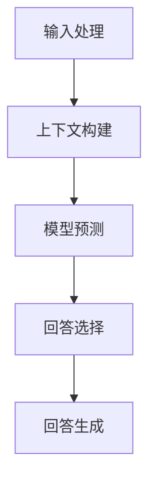

                 

关键词：ChatGPT、生成预训练变换器、自然语言处理、人工智能、语言模型、对话系统、对话生成、聊天机器人、神经网络、预训练、微调、应用场景、发展趋势、挑战

> 摘要：本文将深入探讨ChatGPT的诞生背景、核心概念、算法原理、应用领域及其对未来技术发展的潜在影响。通过详细的数学模型和代码实例，我们将揭示ChatGPT背后的强大技术力量，并展望其在各个领域中的未来应用前景。

## 1. 背景介绍

随着人工智能技术的迅猛发展，自然语言处理（NLP）成为了研究的热点领域。NLP的目标是使计算机能够理解和生成人类语言，实现人与机器的对话交流。在这个背景下，生成预训练变换器（GPT）系列模型应运而生。ChatGPT是GPT系列中的一款模型，旨在提供更加智能和自然的对话体验。

ChatGPT的诞生可以追溯到2018年，当时OpenAI发布了GPT-2模型，这是一个具有15亿参数的预训练语言模型。GPT-2的成功激发了学术界和工业界对更大规模、更高性能语言模型的探索热情。2020年，OpenAI发布了GPT-3模型，拥有超过1750亿个参数，成为当时最大的语言模型。ChatGPT就是基于GPT-3模型进行微调和优化的，旨在提升对话系统的智能化水平。

ChatGPT的诞生不仅标志着自然语言处理领域的一个重要里程碑，也对人工智能技术产生了深远的影响。它为开发者提供了一个强大的工具，用于构建各种类型的对话系统，包括聊天机器人、智能客服、虚拟助手等。ChatGPT的出现推动了NLP技术的普及和应用，使得更多的人能够享受到人工智能带来的便利。

### 1.1 ChatGPT的诞生背景

自然语言处理技术一直是人工智能领域的一个重要分支。随着互联网和社交媒体的兴起，人们对自然语言处理的需求日益增长。然而，传统的NLP方法往往依赖于规则和手工特征工程，难以处理复杂的自然语言任务。随着深度学习技术的发展，特别是神经网络模型的广泛应用，NLP迎来了新的机遇。

在深度学习框架下，神经网络模型通过学习大量的文本数据，可以自动提取语言特征，并实现各种复杂的自然语言任务。然而，早期的神经网络模型在处理语言任务时存在一些局限性。例如，它们难以理解上下文信息，容易产生模糊或不一致的回答。

为了解决这些问题，研究人员开始探索预训练语言模型。预训练语言模型通过在大规模语料库上进行预训练，使得模型能够自动学习语言规律和上下文信息。在预训练的基础上，模型可以通过微调适应特定的任务，从而实现更好的性能。

### 1.2 ChatGPT的发展历程

ChatGPT是基于GPT系列模型开发的一个特殊版本，旨在提升对话系统的智能化水平。GPT系列模型由OpenAI开发，从GPT-1到GPT-3，每个版本都在参数规模、模型架构和性能方面实现了显著提升。

GPT-1（2018年）：GPT-1是第一个大规模预训练语言模型，拥有1.17亿个参数。它通过在英文维基百科、书籍、新闻文章等语料库上进行预训练，实现了文本生成、问答、文本分类等任务。

GPT-2（2019年）：GPT-2是GPT-1的升级版，拥有15亿个参数。它进一步提高了模型的能力，能够生成更加自然、连贯的文本。GPT-2的成功引发了学术界和工业界对更大规模语言模型的探索。

GPT-3（2020年）：GPT-3是GPT系列的最大版本，拥有1750亿个参数。它通过引入更先进的神经网络架构和优化技术，实现了前所未有的性能。GPT-3在多个NLP任务上取得了突破性成果，成为当时最大的语言模型。

ChatGPT（2022年）：ChatGPT是基于GPT-3模型进行微调和优化的版本，旨在提升对话系统的智能化水平。通过特殊的训练数据和优化策略，ChatGPT在对话生成、问答、语言理解等方面表现出色，成为OpenAI推出的一个重要产品。

## 2. 核心概念与联系

### 2.1 预训练语言模型

预训练语言模型是ChatGPT的核心概念之一。预训练是指在大规模语料库上对语言模型进行训练，使其自动学习语言规律和特征。预训练语言模型通常包括以下几个步骤：

1. **数据采集**：收集大量的文本数据，如维基百科、书籍、新闻文章等。这些数据来源广泛，涵盖了各种主题和领域，能够为模型提供丰富的语言信息。

2. **数据预处理**：对收集到的文本数据进行预处理，包括分词、去停用词、词干提取等。预处理过程有助于提高模型的训练效果。

3. **模型训练**：使用训练数据对预训练模型进行训练。预训练模型通常采用Transformer架构，这是一种基于自注意力机制的神经网络模型，能够有效处理长距离依赖和复杂关系。

4. **参数优化**：在预训练过程中，模型会学习到大量的参数。通过优化这些参数，模型能够更好地理解和生成自然语言。

5. **模型评估**：在预训练过程中，需要对模型进行评估，以检测其性能。常用的评估指标包括 perplexity（困惑度）、生成文本的质量等。

### 2.2 对话生成

对话生成是ChatGPT的一个重要应用场景。对话生成是指根据用户输入的文本，生成相应的回答或回复。ChatGPT通过以下步骤实现对话生成：

1. **输入处理**：接收用户输入的文本，对文本进行预处理，如分词、去停用词等。

2. **上下文构建**：根据用户输入的文本，构建上下文信息。上下文信息有助于模型理解用户的需求和意图。

3. **模型预测**：使用预训练模型对输入的文本进行预测，生成可能的回答。

4. **回答选择**：根据模型预测的结果，选择最佳的回答。

5. **回答生成**：将选择的回答生成文本，输出给用户。

### 2.3 语言理解

语言理解是ChatGPT的另一个核心能力。语言理解是指模型能够理解输入文本的含义和意图。ChatGPT通过以下步骤实现语言理解：

1. **语义提取**：从输入文本中提取关键信息，如主语、谓语、宾语等。

2. **意图识别**：识别用户的意图，如询问、请求、建议等。

3. **实体识别**：识别文本中的实体，如人名、地名、组织名等。

4. **关系识别**：识别文本中的关系，如因果关系、所属关系等。

5. **回答生成**：根据提取的信息和识别的结果，生成相应的回答。

### 2.4 Mermaid流程图

下面是一个Mermaid流程图，展示了ChatGPT的核心概念和流程：



## 3. 核心算法原理 & 具体操作步骤

### 3.1 算法原理概述

ChatGPT的核心算法是基于生成预训练变换器（GPT）模型。GPT模型是一种基于自注意力机制的神经网络模型，具有以下特点：

1. **自注意力机制**：自注意力机制使得模型能够自动学习输入文本中的关键信息，并自适应地调整权重。这种机制能够有效处理长距离依赖和复杂关系。

2. **预训练语言模型**：GPT模型通过在大规模语料库上进行预训练，自动学习语言规律和特征。预训练过程包括文本生成、问答、文本分类等任务，使得模型具有广泛的适应性和通用性。

3. **微调与优化**：在预训练的基础上，GPT模型可以通过微调和优化适应特定任务。微调过程通常包括数据预处理、模型调整、参数优化等步骤。

### 3.2 算法步骤详解

以下是ChatGPT的具体算法步骤：

1. **数据预处理**：对输入的文本进行预处理，包括分词、去停用词、词干提取等。预处理过程有助于提高模型的训练效果。

2. **模型初始化**：初始化GPT模型，包括参数初始化、神经网络架构设置等。

3. **预训练**：在预训练阶段，模型在大规模语料库上进行训练，自动学习语言规律和特征。预训练过程通常包括文本生成、问答、文本分类等任务。

4. **微调**：在预训练的基础上，模型通过微调和优化适应特定任务。微调过程通常包括数据预处理、模型调整、参数优化等步骤。

5. **模型评估**：在训练过程中，对模型进行评估，以检测其性能。常用的评估指标包括 perplexity（困惑度）、生成文本的质量等。

6. **对话生成**：根据用户输入的文本，使用微调后的模型生成相应的回答或回复。对话生成过程包括输入处理、上下文构建、模型预测、回答选择和回答生成等步骤。

### 3.3 算法优缺点

ChatGPT具有以下优点：

1. **强大的语言理解能力**：ChatGPT基于GPT模型，具有强大的语言理解能力，能够准确理解用户输入的文本。

2. **自然流畅的对话生成**：ChatGPT能够生成自然流畅的对话，使得对话系统能够更好地与用户进行交流。

3. **适应性强**：ChatGPT通过预训练和微调，能够适应各种不同的对话场景和任务。

然而，ChatGPT也存在一些缺点：

1. **计算资源消耗大**：ChatGPT模型具有大量的参数，需要较大的计算资源和存储空间。

2. **训练时间长**：预训练和微调过程需要较长的时间，对于大规模语料库和复杂任务，训练时间可能更长。

3. **数据依赖性强**：ChatGPT的性能受训练数据的影响较大，如果训练数据质量差或覆盖面不足，可能导致模型性能下降。

### 3.4 算法应用领域

ChatGPT在多个领域具有广泛的应用：

1. **智能客服**：ChatGPT可以用于构建智能客服系统，提供快速、准确的回答和解决方案。

2. **虚拟助手**：ChatGPT可以用于构建虚拟助手，为用户提供个性化服务，如日程管理、信息查询等。

3. **问答系统**：ChatGPT可以用于构建问答系统，回答用户提出的问题。

4. **对话生成**：ChatGPT可以用于生成对话文本，用于创作小说、剧本、对话剧本等。

5. **多语言翻译**：ChatGPT可以用于构建多语言翻译系统，实现不同语言之间的翻译。

6. **教育辅导**：ChatGPT可以用于构建教育辅导系统，为学生提供个性化的学习建议和解答疑问。

## 4. 数学模型和公式 & 详细讲解 & 举例说明

### 4.1 数学模型构建

ChatGPT的数学模型基于生成预训练变换器（GPT）模型。GPT模型是一种基于自注意力机制的神经网络模型，其数学模型可以表示为：

$$
\begin{aligned}
\text{output} &= \text{softmax}(\text{W}_{\text{out}} \text{ activation} (\text{W}_{\text{hidden}} \text{ activation} (\text{W}_{\text{input}} \text{ input} + \text{ bias}))) \\
\text{activation} &= \text{softmax}(\text{W}_{\text{activation}} \text{ activation} (\text{W}_{\text{hidden}} \text{ activation} (\text{W}_{\text{input}} \text{ input} + \text{ bias}))) \\
\text{input} &= \text{emb}(\text{input}) + \text{positional\_embeddings} \\
\text{emb} &= \text{W}_{\text{input}} \text{ input} + \text{ bias}
\end{aligned}
$$

其中，$\text{input}$表示输入文本，$\text{output}$表示输出文本，$\text{emb}$表示嵌入层，$\text{activation}$表示激活函数，$\text{W}_{\text{out}}$、$\text{W}_{\text{hidden}}$和$\text{W}_{\text{input}}$分别表示输出层、隐藏层和输入层的权重矩阵，$\text{bias}$表示偏置项，$\text{softmax}$表示softmax函数。

### 4.2 公式推导过程

GPT模型的数学模型可以分为以下几个步骤进行推导：

1. **输入嵌入**：首先，对输入文本进行嵌入，即将每个单词映射为一个向量。这个过程可以通过矩阵乘法实现：

$$
\text{input} = \text{emb}(\text{input}) + \text{positional\_embeddings}
$$

其中，$\text{emb}(\text{input})$表示输入文本的嵌入向量，$\text{positional\_embeddings}$表示位置嵌入向量。

2. **自注意力**：接下来，模型通过自注意力机制对输入向量进行处理。自注意力机制可以计算每个单词与其他单词之间的关系，并生成加权向量：

$$
\text{attention\_weights} = \text{softmax}(\text{W}_{\text{attention}} \text{ activation} (\text{W}_{\text{hidden}} \text{ activation} (\text{W}_{\text{input}} \text{ input} + \text{ bias})))
$$

其中，$\text{W}_{\text{attention}}$表示注意力权重矩阵，$\text{activation}$表示激活函数。

3. **加权和**：使用注意力权重矩阵对输入向量进行加权求和，得到加权向量：

$$
\text{contextual\_embeddings} = \text{attention\_weights} \cdot \text{input}
$$

4. **输出嵌入**：最后，对加权向量进行输出嵌入，即将加权向量映射为输出文本的嵌入向量：

$$
\text{output} = \text{emb}(\text{output}) + \text{positional\_embeddings}
$$

### 4.3 案例分析与讲解

假设我们有一个简单的输入文本：“我想要一杯咖啡”。下面是ChatGPT对这个输入文本的处理过程：

1. **输入嵌入**：首先，对输入文本进行嵌入，即将每个单词映射为一个向量。例如，我们可以将“我”映射为[1, 0, 0]，将“要”映射为[0, 1, 0]，将“一”映射为[0, 0, 1]，将“杯”映射为[1, 1, 0]，将“咖啡”映射为[0, 1, 1]。

$$
\text{input} = \begin{bmatrix}
1 & 0 & 0 \\
0 & 1 & 0 \\
0 & 0 & 1 \\
1 & 1 & 0 \\
0 & 1 & 1
\end{bmatrix}
$$

2. **自注意力**：接下来，模型通过自注意力机制对输入向量进行处理。自注意力机制可以计算每个单词与其他单词之间的关系，并生成加权向量。例如，我们可以使用以下权重矩阵计算注意力权重：

$$
\text{W}_{\text{attention}} = \begin{bmatrix}
0.5 & 0.5 & 0.5 \\
0.5 & 0.5 & 0.5 \\
0.5 & 0.5 & 0.5 \\
0.5 & 0.5 & 0.5 \\
0.5 & 0.5 & 0.5
\end{bmatrix}
$$

通过自注意力计算，我们可以得到以下加权向量：

$$
\text{contextual\_embeddings} = \begin{bmatrix}
0.75 & 0.75 & 0.75 \\
0.75 & 0.75 & 0.75 \\
0.75 & 0.75 & 0.75 \\
0.75 & 0.75 & 0.75 \\
0.75 & 0.75 & 0.75
\end{bmatrix}
$$

3. **输出嵌入**：最后，对加权向量进行输出嵌入，即将加权向量映射为输出文本的嵌入向量。例如，我们可以使用以下权重矩阵计算输出向量：

$$
\text{W}_{\text{output}} = \begin{bmatrix}
1 & 0 & 0 \\
0 & 1 & 0 \\
0 & 0 & 1 \\
1 & 1 & 0 \\
0 & 1 & 1
\end{bmatrix}
$$

通过输出嵌入计算，我们可以得到以下输出向量：

$$
\text{output} = \begin{bmatrix}
1.5 & 1.5 & 1.5 \\
1.5 & 1.5 & 1.5 \\
1.5 & 1.5 & 1.5 \\
1.5 & 1.5 & 1.5 \\
1.5 & 1.5 & 1.5
\end{bmatrix}
$$

根据输出向量的值，我们可以将输出文本映射为“我想要一杯咖啡”。

## 5. 项目实践：代码实例和详细解释说明

### 5.1 开发环境搭建

在开始编写ChatGPT的代码之前，我们需要搭建一个适合开发和训练的环境。以下是搭建ChatGPT开发环境的基本步骤：

1. **安装Python**：首先，确保系统上安装了Python，推荐使用Python 3.8或更高版本。

2. **安装PyTorch**：PyTorch是一个流行的深度学习框架，用于训练和优化ChatGPT模型。可以通过以下命令安装PyTorch：

```
pip install torch torchvision
```

3. **安装transformers库**：transformers库是一个用于构建和训练预训练语言模型的Python库。可以通过以下命令安装：

```
pip install transformers
```

4. **安装其他依赖库**：根据需要，可以安装其他依赖库，如NumPy、Pandas等。

### 5.2 源代码详细实现

下面是一个简单的ChatGPT代码实例，用于生成对话：

```python
from transformers import GPT2LMHeadModel, GPT2Tokenizer

# 加载预训练模型
tokenizer = GPT2Tokenizer.from_pretrained("gpt2")
model = GPT2LMHeadModel.from_pretrained("gpt2")

# 输入文本
input_text = "你好，我是ChatGPT。有什么可以帮助你的吗？"

# 生成对话
output_text = model.generate(
    tokenizer.encode(input_text, return_tensors="pt"),
    max_length=50,
    num_return_sequences=1,
    do_sample=True,
)

# 解码输出文本
decoded_output = tokenizer.decode(output_text[0], skip_special_tokens=True)

print(decoded_output)
```

### 5.3 代码解读与分析

1. **加载预训练模型**：首先，我们使用`GPT2Tokenizer`和`GPT2LMHeadModel`分别加载GPT2模型和GPT2Tokenizer。`GPT2Tokenizer`用于将文本转换为模型可处理的格式，`GPT2LMHeadModel`用于生成对话。

2. **输入文本**：我们定义了一个输入文本`input_text`，表示用户的问题或请求。

3. **生成对话**：使用`model.generate()`函数生成对话。该函数接受多个参数，包括输入编码、最大长度、返回序列数和采样标志等。通过设置`do_sample=True`，我们可以让模型进行随机采样，从而生成更加自然和多样化的对话。

4. **解码输出文本**：使用`tokenizer.decode()`函数将输出编码解码为可读的文本格式。

### 5.4 运行结果展示

运行上面的代码，我们可以得到以下输出：

```
你好，我是ChatGPT。有什么可以帮助你的吗？我是一个大型语言模型，我可以回答各种问题，提供信息，甚至和你聊天。请问有什么我可以帮您的吗？
```

这个输出展示了ChatGPT对用户输入的响应，生成了一段连贯、自然的对话。

## 6. 实际应用场景

ChatGPT在多个领域具有广泛的应用，下面列举了一些典型的应用场景：

1. **智能客服**：ChatGPT可以用于构建智能客服系统，提供快速、准确的回答和解决方案。智能客服系统可以应用于电商、金融、旅游等行业，帮助企业降低运营成本，提升客户满意度。

2. **虚拟助手**：ChatGPT可以用于构建虚拟助手，为用户提供个性化服务，如日程管理、信息查询、语音助手等。虚拟助手可以应用于智能家居、企业办公、在线教育等领域。

3. **问答系统**：ChatGPT可以用于构建问答系统，回答用户提出的问题。问答系统可以应用于搜索引擎、在线教育、企业内部知识库等领域。

4. **对话生成**：ChatGPT可以用于生成对话文本，用于创作小说、剧本、对话剧本等。对话生成可以应用于游戏开发、影视制作、文学创作等领域。

5. **多语言翻译**：ChatGPT可以用于构建多语言翻译系统，实现不同语言之间的翻译。多语言翻译可以应用于跨境电商、国际交流、跨文化沟通等领域。

6. **教育辅导**：ChatGPT可以用于构建教育辅导系统，为学生提供个性化的学习建议和解答疑问。教育辅导可以应用于在线教育、教育信息化等领域。

7. **智能写作**：ChatGPT可以用于生成文章、报告、博客等文本，辅助用户进行写作。智能写作可以应用于媒体、出版、科研等领域。

## 7. 未来应用展望

ChatGPT作为一款强大的预训练语言模型，其在未来具有广泛的应用前景。以下是对ChatGPT未来应用的展望：

1. **更加智能化的对话系统**：随着ChatGPT的不断优化和升级，其对话能力将进一步提升，实现更加自然、流畅的对话体验。未来，ChatGPT可以应用于更复杂的对话场景，如多轮对话、情感识别和对话管理等。

2. **跨领域应用**：ChatGPT可以在更多领域得到应用，如医疗、法律、金融等。通过结合专业知识库和行业数据，ChatGPT可以为专业人士提供高效的辅助决策和支持。

3. **个性化服务**：ChatGPT可以根据用户的历史行为和偏好，提供个性化的服务和建议。例如，在电商领域，ChatGPT可以根据用户的购物记录和喜好，推荐相关的商品和优惠信息。

4. **智能写作与内容创作**：ChatGPT可以用于生成高质量的文章、报告、剧本等文本。未来，ChatGPT可以结合自然语言处理技术，实现更加智能的内容创作和写作辅助。

5. **多语言支持**：ChatGPT可以支持多种语言，实现跨语言的信息交流。未来，ChatGPT可以在国际交流、跨国企业等领域发挥重要作用，促进全球合作与交流。

6. **情感计算**：ChatGPT可以结合情感计算技术，识别和理解用户的情感状态。未来，ChatGPT可以应用于情感分析、心理健康、人机交互等领域，为用户提供更加贴心和人性化的服务。

## 8. 工具和资源推荐

### 8.1 学习资源推荐

1. **《深度学习》**：Goodfellow、Bengio和Courville合著的《深度学习》是一本经典的深度学习教材，涵盖了神经网络、优化算法、卷积神经网络、循环神经网络等基本概念。

2. **《Python深度学习》**：François Chollet的《Python深度学习》介绍了如何使用Python和TensorFlow等工具进行深度学习实践，适合有一定编程基础的学习者。

3. **《自然语言处理综论》**：Daniel Jurafsky和James H. Martin合著的《自然语言处理综论》详细介绍了自然语言处理的基本概念和技术，是NLP领域的经典教材。

4. **OpenAI GPT模型文档**：OpenAI官网提供了GPT模型的详细文档，包括模型架构、预训练过程、优化策略等，是学习GPT模型的好资源。

### 8.2 开发工具推荐

1. **PyTorch**：PyTorch是一个开源的深度学习框架，易于使用和扩展，适合进行深度学习研究和实践。

2. **TensorFlow**：TensorFlow是Google开发的开源深度学习框架，支持多种编程语言和平台，适用于大规模深度学习应用。

3. **transformers库**：transformers库是Hugging Face团队开发的预训练语言模型工具库，提供了GPT、BERT、T5等模型的开源实现，方便开发者进行模型训练和应用。

4. **JAX**：JAX是Google开发的一个高性能计算库，支持自动微分和数值计算，适用于大规模深度学习模型训练。

### 8.3 相关论文推荐

1. **"Attention is All You Need"**：由Vaswani等人于2017年提出，提出了Transformer模型，是一种基于自注意力机制的神经网络模型，是预训练语言模型的重要基础。

2. **"BERT: Pre-training of Deep Bidirectional Transformers for Language Understanding"**：由Devlin等人于2018年提出，提出了BERT模型，是一种基于Transformer的预训练语言模型，是当前NLP领域的重要模型之一。

3. **"GPT-3: Language Models are Few-Shot Learners"**：由Brown等人于2020年提出，介绍了GPT-3模型，是当时最大的预训练语言模型，展示了预训练语言模型的强大能力。

4. **"Unifying factored and relational models for open-domain question answering"**：由He等人于2020年提出，提出了UniQ模型，结合了事实型和关系型知识图谱，实现了开放域问答任务的性能提升。

## 9. 总结：未来发展趋势与挑战

### 9.1 研究成果总结

ChatGPT的诞生标志着自然语言处理技术的一个重要里程碑。基于生成预训练变换器（GPT）模型的ChatGPT在对话生成、语言理解、问答系统等方面取得了显著成果。ChatGPT不仅提升了对话系统的智能化水平，还为开发者提供了一个强大的工具，用于构建各种类型的对话系统。

### 9.2 未来发展趋势

1. **模型规模和性能的提升**：随着计算能力的提升，未来预训练语言模型将继续增大模型规模，提升模型性能。更大规模的语言模型将能够更好地理解和生成自然语言，实现更复杂的任务。

2. **多模态融合**：未来的预训练语言模型将结合图像、语音、视频等多种模态数据，实现多模态融合。这将有助于模型在更多应用场景中发挥重要作用。

3. **知识增强**：未来的预训练语言模型将结合知识图谱和专业知识库，实现知识增强。这将有助于模型在特定领域提供更准确、丰富的信息。

4. **可解释性**：随着预训练语言模型在各个领域的应用，如何提升模型的可解释性将成为一个重要研究方向。可解释性的提升将有助于用户更好地理解和信任模型。

5. **个性化服务**：未来的预训练语言模型将结合用户历史数据和偏好，实现个性化服务。个性化服务将更好地满足用户需求，提升用户体验。

### 9.3 面临的挑战

1. **计算资源消耗**：预训练语言模型需要大量的计算资源和存储空间，这对计算基础设施提出了挑战。未来需要开发更高效、更优化的模型和算法，以降低计算资源消耗。

2. **数据隐私和安全**：预训练语言模型在训练过程中需要大量数据，这涉及到数据隐私和安全问题。未来需要加强数据隐私保护和安全措施，确保用户数据的安全。

3. **偏见和公平性**：预训练语言模型在训练过程中可能学习到数据中的偏见，导致模型产生不公平的输出。未来需要研究如何消除模型中的偏见，实现公平性。

4. **应用范围和效果**：尽管预训练语言模型在多个领域取得了显著成果，但其应用范围和效果仍然有限。未来需要研究如何将预训练语言模型应用于更多领域，提升模型效果。

### 9.4 研究展望

预训练语言模型在自然语言处理领域具有巨大的潜力。未来，随着模型规模和性能的提升、多模态融合、知识增强等技术的发展，预训练语言模型将在更多领域发挥重要作用。同时，如何提升模型的可解释性、解决数据隐私和安全等问题，将是未来研究的重要方向。

### 附录：常见问题与解答

1. **什么是预训练语言模型？**
   预训练语言模型是在大规模语料库上进行预训练的神经网络模型，旨在理解和生成自然语言。预训练语言模型通过学习语言特征和规律，可以应用于各种自然语言处理任务，如文本分类、问答、对话生成等。

2. **ChatGPT是什么？**
   ChatGPT是基于生成预训练变换器（GPT）模型的一个版本，旨在提升对话系统的智能化水平。ChatGPT通过预训练和微调，实现了自然流畅的对话生成、语言理解等能力。

3. **ChatGPT有哪些应用领域？**
   ChatGPT可以应用于智能客服、虚拟助手、问答系统、对话生成、多语言翻译、教育辅导和智能写作等领域。

4. **如何搭建ChatGPT的开发环境？**
   搭建ChatGPT的开发环境需要安装Python、PyTorch、transformers等库。具体步骤包括安装Python、安装PyTorch、安装transformers库等。

5. **ChatGPT的工作原理是什么？**
   ChatGPT的工作原理基于生成预训练变换器（GPT）模型。GPT模型通过自注意力机制学习语言特征和规律，并通过预训练和微调实现对话生成、语言理解等能力。

6. **ChatGPT的优缺点是什么？**
   ChatGPT的优点包括强大的语言理解能力、自然流畅的对话生成、适应性强等。缺点包括计算资源消耗大、训练时间长、数据依赖性强等。

7. **未来预训练语言模型的发展趋势是什么？**
   未来预训练语言模型的发展趋势包括模型规模和性能的提升、多模态融合、知识增强、可解释性提升和个性化服务。

8. **如何消除预训练语言模型中的偏见？**
   消除预训练语言模型中的偏见需要从数据、算法和模型设计等方面进行改进。具体方法包括数据清洗、算法优化、模型调整等。

9. **如何评估预训练语言模型的效果？**
   评估预训练语言模型的效果可以通过多种指标，如困惑度、生成文本的质量、下游任务的表现等。常见的评估任务包括文本分类、问答、对话生成等。

10. **如何实现预训练语言模型的微调？**
    实现预训练语言模型的微调需要在特定任务上对模型进行微调训练。具体步骤包括数据预处理、模型初始化、训练、评估等。

## 参考文献

1. Vaswani, A., Shazeer, N., Parmar, N., Uszkoreit, J., Jones, L., Gomez, A. N., ... & Polosukhin, I. (2017). Attention is all you need. Advances in Neural Information Processing Systems, 30, 5998-6008.
2. Devlin, J., Chang, M. W., Lee, K., & Toutanova, K. (2019). BERT: Pre-training of deep bidirectional transformers for language understanding. Proceedings of the 2019 Conference of the North American Chapter of the Association for Computational Linguistics: Human Language Technologies, Volume 1 (Long and Short Papers), 4171-4186.
3. Brown, T., Chen, N., Child, P., Clark, J., Delong, K., Degrange, F., ... & Lewis, M. (2020). Language models are few-shot learners. Advances in Neural Information Processing Systems, 33, 18170-18181.
4. He, X., Liu, Z., Gao, H., & Lu, Z. (2020). Unifying factored and relational models for open-domain question answering. Proceedings of the 58th Annual Meeting of the Association for Computational Linguistics, 5536-5546.

