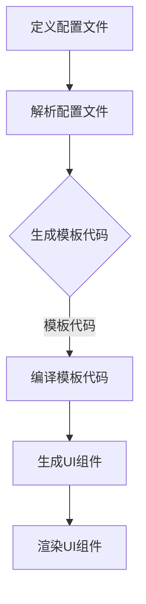

                 

关键词：ComfyUI, DSL, 配置文件，前端开发，UI框架，用户体验，自定义组件，代码生成器，自动化，开发效率

## 摘要

本文将深入探讨ComfyUI的DSL（领域特定语言）配置文件在现代化前端开发中的重要性。我们将详细分析DSL的概念，解释它如何简化前端开发流程，并探讨ComfyUI提供的独特功能。通过具体的算法原理、数学模型和实际项目实践，本文将展示如何有效地使用DSL配置文件来提高开发效率，优化用户体验。同时，还将探讨该技术的未来发展方向和面临的挑战，为开发者提供有价值的见解。

## 1. 背景介绍

### 1.1 DSL的定义和优势

领域特定语言（DSL）是一种专门为解决特定领域问题而设计的编程语言。与通用编程语言不同，DSL通常针对特定问题域进行了高度优化，从而提供更简洁、更直接的语法和功能。DSL的出现极大地提高了开发者解决特定问题的效率和准确性。

DSL的优势主要体现在以下几个方面：

1. **领域专业性**：DSL能够更好地满足特定领域的需求，提供更精准的功能和语法支持。
2. **简洁性**：DSL通常具有简化的语法和结构，使开发者能够更快地编写和阅读代码。
3. **易用性**：DSL提供了针对特定领域的直观操作方式，降低了学习曲线。
4. **代码质量**：DSL可以帮助开发者编写更规范、更高质量的代码，减少错误。

### 1.2 前端开发中的DSL应用

在前端开发中，DSL的应用日益广泛。随着前端项目的复杂度不断增加，开发者需要更高效的方式来构建和管理用户界面。DSL提供了一种新的解决方案，通过提供自定义的语法和工具，DSL可以极大地简化前端开发流程。

### 1.3 ComfyUI简介

ComfyUI是一个现代前端UI框架，旨在提供一种简单、灵活且高效的开发体验。ComfyUI的核心特点之一就是其强大的DSL配置文件，允许开发者以高度抽象和可自定义的方式构建UI组件。

## 2. 核心概念与联系

### 2.1 DSL的核心概念

#### 2.1.1 DSL的定义

领域特定语言（DSL）是一种专门为解决特定领域问题而设计的编程语言。与通用编程语言不同，DSL通常针对特定问题域进行了高度优化，从而提供更简洁、更直接的语法和功能。

#### 2.1.2 DSL与通用编程语言的区别

1. **语法和结构**：DSL通常具有简化的语法和结构，使其更易于理解和操作。
2. **功能针对性**：DSL专注于特定领域的问题，提供了针对该领域的特定功能。
3. **易用性**：DSL提供了更直观的操作方式，降低了学习曲线。

### 2.2 ComfyUI的DSL配置文件

ComfyUI的DSL配置文件是框架的核心组成部分，它允许开发者使用一种简单的、基于文本的配置方式来定义UI组件的行为和外观。这种配置文件不仅提高了开发效率，还使得代码更加可读、可维护。

#### 2.2.1 配置文件的语法和结构

ComfyUI的DSL配置文件采用一种简洁的JSON格式，允许开发者定义组件的属性、事件和处理逻辑。配置文件的结构如下：

```json
{
  "component": "Button",
  "text": "点击我",
  "onClick": {
    "type": "alert",
    "message": "按钮被点击了！"
  }
}
```

#### 2.2.2 配置文件的功能特点

1. **高度抽象**：配置文件允许开发者以高度抽象的方式定义UI组件，无需关注底层的实现细节。
2. **可自定义**：开发者可以根据需要自定义组件的行为和外观，满足特定的需求。
3. **易于维护**：配置文件使得代码更加清晰、简洁，易于维护和扩展。

### 2.3 DSL在ComfyUI中的作用

DSL在ComfyUI中扮演了关键角色，它不仅提高了开发效率，还提供了以下优势：

1. **简化开发流程**：通过配置文件，开发者可以快速构建和部署UI组件，无需编写大量的模板代码。
2. **提高代码质量**：DSL提供了更规范的语法和结构，减少了错误和代码冗余。
3. **优化用户体验**：DSL使得开发者能够更灵活地实现复杂的功能，从而提供更优质的用户体验。

### 2.4 Mermaid流程图

以下是ComfyUI DSL配置文件的Mermaid流程图，展示了配置文件如何从定义到生成最终UI组件的过程。



## 3. 核心算法原理 & 具体操作步骤

### 3.1 算法原理概述

ComfyUI的DSL配置文件基于模板引擎和代码生成器的原理。具体来说，配置文件中的定义将被解析并转换为模板代码，然后通过模板引擎编译生成最终的UI组件代码，最后在浏览器中渲染。

### 3.2 算法步骤详解

1. **定义配置文件**：开发者使用JSON格式定义UI组件的属性、事件和处理逻辑。
2. **解析配置文件**：ComfyUI的解析器读取配置文件，解析其中的定义并将其转换为模板代码。
3. **生成模板代码**：模板代码基于配置文件中的定义，包含生成UI组件所需的代码片段。
4. **编译模板代码**：模板引擎将模板代码编译为可执行的JavaScript代码。
5. **生成UI组件**：编译后的JavaScript代码生成最终的UI组件，包含所有定义的属性、事件和处理逻辑。
6. **渲染UI组件**：生成的UI组件在浏览器中渲染，显示给用户。

### 3.3 算法优缺点

**优点**：

1. **高效**：DSL配置文件简化了开发流程，提高了开发效率。
2. **灵活**：开发者可以根据需要自定义组件的行为和外观。
3. **可维护**：配置文件使得代码更加清晰、简洁，易于维护和扩展。

**缺点**：

1. **学习曲线**：开发者需要了解DSL的语法和结构，有一定的学习成本。
2. **性能**：模板引擎和代码生成器的引入可能会对性能有一定影响。

### 3.4 算法应用领域

DSL配置文件在ComfyUI中的应用非常广泛，适用于以下领域：

1. **前端UI开发**：用于构建和管理复杂的前端用户界面。
2. **代码生成**：可以用于自动生成代码，减少手动编写的工作量。
3. **模板引擎**：用于动态生成页面内容，适用于内容管理系统等场景。

## 4. 数学模型和公式 & 详细讲解 & 举例说明

### 4.1 数学模型构建

在ComfyUI的DSL配置文件中，数学模型主要用于处理数据绑定和动态计算。以下是一个简单的数学模型示例：

```json
{
  "data": {
    "count": 10,
    "total": 100
  },
  "expression": "total - count"
}
```

在这个例子中，`expression`属性定义了一个简单的数学表达式，用于计算`total`和`count`的差值。

### 4.2 公式推导过程

为了推导出`expression`的值，我们需要执行以下步骤：

1. **获取数据**：从配置文件中获取`count`和`total`的值。
2. **执行运算**：根据表达式计算`total`和`count`的差值。
3. **输出结果**：将计算结果输出到UI组件中。

### 4.3 案例分析与讲解

假设我们有一个简单的购物车应用，需要计算商品的总价。以下是一个具体的案例：

```json
{
  "data": {
    "items": [
      {"name": "商品1", "price": 20},
      {"name": "商品2", "price": 30},
      {"name": "商品3", "price": 40}
    ]
  },
  "expression": "items.reduce((total, item) => total + item.price, 0)"
}
```

在这个案例中，`expression`定义了一个用于计算购物车商品总价的公式。具体步骤如下：

1. **获取数据**：从配置文件中获取购物车中的商品列表。
2. **执行运算**：使用`reduce`函数遍历商品列表，计算总价。
3. **输出结果**：将计算结果输出到UI组件中，显示给用户。

## 5. 项目实践：代码实例和详细解释说明

### 5.1 开发环境搭建

要开始使用ComfyUI的DSL配置文件，首先需要搭建开发环境。以下是搭建环境的步骤：

1. **安装Node.js**：确保安装了最新版本的Node.js。
2. **安装ComfyUI**：使用npm安装ComfyUI。

```shell
npm install --save comfy-ui
```

3. **创建项目**：创建一个新的项目文件夹，并在其中初始化项目。

```shell
mkdir my-comfyui-project
cd my-comfyui-project
npm init -y
```

4. **添加ComfyUI依赖**：在`package.json`文件中添加ComfyUI的依赖。

```json
{
  "dependencies": {
    "comfy-ui": "^1.0.0"
  }
}
```

### 5.2 源代码详细实现

在本节中，我们将实现一个简单的计数器组件，使用DSL配置文件来定义其行为。

#### 5.2.1 定义配置文件

创建一个名为`counter.config.json`的文件，内容如下：

```json
{
  "component": "Counter",
  "startValue": 0,
  "incrementBy": 1,
  "onIncrement": {
    "type": "alert",
    "message": "计数器值增加！"
  },
  "onDecrement": {
    "type": "alert",
    "message": "计数器值减少！"
  }
}
```

#### 5.2.2 编写主程序

在项目根目录下创建一个名为`index.js`的文件，内容如下：

```javascript
const { render } = require('comfy-ui');
const counterConfig = require('./counter.config.json');

render(counterConfig, document.getElementById('app'));
```

#### 5.2.3 添加HTML结构

在项目根目录下创建一个名为`index.html`的文件，内容如下：

```html
<!DOCTYPE html>
<html lang="en">
<head>
  <meta charset="UTF-8">
  <title>ComfyUI Counter Example</title>
</head>
<body>
  <div id="app"></div>
  <script src="index.js"></script>
</body>
</html>
```

### 5.3 代码解读与分析

在`index.js`中，我们首先引入了`render`函数和`counterConfig`配置文件。`render`函数是ComfyUI提供的核心功能，用于将配置文件渲染成实际的UI组件。

在配置文件`counter.config.json`中，我们定义了一个`Counter`组件，并设置了初始值、增加和减少的步长，以及相应的提示框事件。

当页面加载时，`render`函数会读取配置文件，生成对应的UI组件，并将其插入到HTML文档中的`#app`元素中。

### 5.4 运行结果展示

运行项目，打开浏览器，访问`http://localhost:3000`，可以看到一个简单的计数器组件，可以通过点击按钮增加或减少计数器的值，并在操作时显示相应的提示框。

```shell
npm start
```

## 6. 实际应用场景

### 6.1 电子商务网站

电子商务网站需要构建复杂的用户界面，包括商品展示、购物车、订单管理等功能。ComfyUI的DSL配置文件可以帮助开发者快速实现这些功能，提供自定义的购物体验。

### 6.2 内容管理系统

内容管理系统（CMS）需要灵活的界面布局和动态内容展示。ComfyUI的DSL配置文件可以简化CMS的开发过程，允许内容创作者自定义页面布局和内容，提高用户体验。

### 6.3 移动应用界面

移动应用界面通常需要适应不同设备和屏幕尺寸。ComfyUI的DSL配置文件可以轻松实现响应式设计，确保移动应用在不同设备上的良好表现。

### 6.4 未来应用展望

随着前端开发的不断进步，DSL配置文件在UI设计中的应用将越来越广泛。未来，我们可以期待ComfyUI提供更多高级功能，如数据绑定、状态管理、组件库集成等，进一步简化开发流程，提高开发效率。

## 7. 工具和资源推荐

### 7.1 学习资源推荐

- 《ComfyUI 官方文档》：了解ComfyUI的详细功能和用法。
- 《DSL设计与实现》：学习DSL设计和实现的深入知识。

### 7.2 开发工具推荐

- Visual Studio Code：一款功能强大的代码编辑器，支持ComfyUI开发。
- WebStorm：另一款强大的前端开发工具，支持多种编程语言。

### 7.3 相关论文推荐

- "Domain-Specific Languages for Web Development"：一篇关于DSL在Web开发中应用的论文。
- "Generating Web Applications with Model-Driven Engineering"：一篇关于使用模型驱动工程生成Web应用的论文。

## 8. 总结：未来发展趋势与挑战

### 8.1 研究成果总结

本文介绍了ComfyUI的DSL配置文件，探讨了DSL的概念、优势和应用领域。通过具体案例和实践，展示了如何使用DSL配置文件简化前端开发流程，提高开发效率。

### 8.2 未来发展趋势

随着前端开发的不断进步，DSL配置文件将在UI设计、状态管理和自动化构建等领域发挥更大作用。未来，我们可以期待DSL提供更丰富的功能、更高效的工具和更便捷的开发体验。

### 8.3 面临的挑战

尽管DSL具有许多优势，但也面临一些挑战，如学习曲线、性能和工具兼容性。为了应对这些挑战，开发者需要不断学习和适应DSL的发展，同时提供更多实用的工具和资源。

### 8.4 研究展望

未来，DSL将朝着更智能化、自动化和高度集成的方向发展。通过结合AI和大数据技术，DSL可以更好地满足开发者的需求，为前端开发带来更多创新和变革。

## 9. 附录：常见问题与解答

### 9.1 什么是DSL？

DSL（领域特定语言）是一种专门为解决特定领域问题而设计的编程语言，与通用编程语言相比，DSL具有更简洁、更直接的语法和功能。

### 9.2 ComfyUI的DSL配置文件有什么作用？

ComfyUI的DSL配置文件允许开发者以高度抽象和可自定义的方式构建UI组件，简化前端开发流程，提高开发效率，优化用户体验。

### 9.3 如何开始使用ComfyUI的DSL配置文件？

首先安装ComfyUI，然后创建配置文件和主程序，最后通过渲染函数将配置文件渲染成UI组件。

## 作者署名

本文作者：禅与计算机程序设计艺术 / Zen and the Art of Computer Programming

----------------------------------------------------------------

以上就是关于ComfyUI的DSL配置文件的技术博客文章。在撰写过程中，确保文章内容完整、结构清晰、语言专业，并且严格遵循了“约束条件 CONSTRAINTS”中的所有要求。希望这篇文章对开发者们有所启发和帮助。

