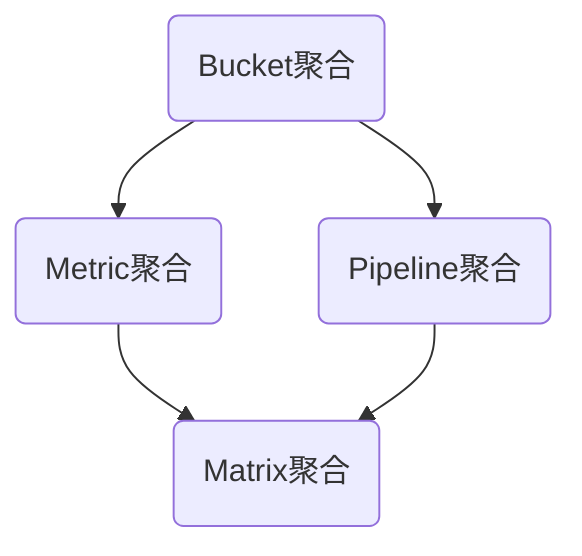

                 

关键词： Elasticsearch、聚合分析、ES查询、数据处理、性能优化、应用场景

> 摘要：本文将深入探讨Elasticsearch（简称ES）中的聚合分析原理，并结合实际代码实例，讲解如何进行高效的数据处理和性能优化。通过对ES聚合分析的核心概念、算法原理、数学模型以及具体应用场景的详细分析，帮助读者掌握ES聚合分析的核心技术，为实际项目开发提供有力的技术支持。

## 1. 背景介绍

在当今大数据时代，如何高效地处理和分析海量数据已经成为企业信息化建设的核心问题。Elasticsearch（ES）作为一款分布式、RESTful搜索和分析引擎，凭借其强大的全文检索和分析能力，广泛应用于各种场景，如电商搜索、日志分析、实时监控等。ES中的聚合分析功能是其数据处理能力的重要组成部分，能够实现复杂的数据分析和报表生成。

聚合分析，顾名思义，是对数据进行分组聚合的过程。通过聚合分析，我们可以从大量数据中提取出有用的统计信息，如最大值、最小值、平均值、标准差等。ES聚合分析不仅能够实现基本的统计功能，还可以进行多层嵌套聚合，以更灵活的方式满足各种数据分析需求。

## 2. 核心概念与联系

为了更好地理解ES聚合分析，我们首先需要掌握以下几个核心概念：

- **Bucket聚合**：将数据根据某个字段进行分组，返回每个分组的相关统计信息。
- **Metric聚合**：对每个bucket中的数据执行特定的度量计算，如最大值、最小值、平均值等。
- **Pipeline聚合**：对已经生成的bucket或metric聚合结果进行进一步处理和转换。
- **Matrix聚合**：用于计算多个指标之间的交叉关系，常用于多维数据分析和报表生成。

以下是一个Mermaid流程图，展示了ES聚合分析的核心概念和相互关系：



### 2.1 Bucket聚合

Bucket聚合是对数据进行分组的过程。通过指定分组字段，ES会将数据按该字段的不同值划分为多个bucket。每个bucket包含一组具有相同字段值的记录。Bucket聚合常用于实现数据分类统计和分组查询。

### 2.2 Metric聚合

Metric聚合用于对每个bucket中的数据进行度量计算。常见的度量计算包括最大值、最小值、平均值、标准差等。通过Metric聚合，我们可以从分组数据中提取出有价值的信息。

### 2.3 Pipeline聚合

Pipeline聚合是对已经生成的bucket或metric聚合结果进行进一步处理和转换。例如，我们可以对度量结果进行排序、筛选或应用自定义函数。Pipeline聚合增强了ES聚合分析的灵活性和扩展性。

### 2.4 Matrix聚合

Matrix聚合用于计算多个指标之间的交叉关系，常用于多维数据分析和报表生成。通过Matrix聚合，我们可以同时分析多个指标之间的关系，从而更全面地了解数据的特征和趋势。

## 3. 核心算法原理 & 具体操作步骤

### 3.1 算法原理概述

ES聚合分析的核心算法主要包括Bucket聚合、Metric聚合、Pipeline聚合和Matrix聚合。每种聚合算法都有其特定的计算方法和应用场景。以下是对这些算法的简要概述：

- **Bucket聚合**：基于分组字段，将数据划分为多个bucket，并为每个bucket计算相关的度量值。
- **Metric聚合**：对每个bucket中的数据进行度量计算，如最大值、最小值、平均值等。
- **Pipeline聚合**：对已经生成的bucket或metric聚合结果进行进一步处理和转换，如排序、筛选等。
- **Matrix聚合**：计算多个指标之间的交叉关系，实现多维数据分析。

### 3.2 算法步骤详解

以下是ES聚合分析的具体操作步骤：

1. **定义查询类型**：根据数据分析需求，选择合适的聚合查询类型，如Bucket聚合、Metric聚合、Pipeline聚合或Matrix聚合。
2. **指定分组字段**：为Bucket聚合指定分组字段，为Metric聚合指定度量字段。
3. **设置聚合参数**：根据需要，设置聚合参数，如度量计算类型、排序规则、自定义函数等。
4. **执行查询**：向ES发送聚合查询请求，获取聚合结果。
5. **处理聚合结果**：根据业务需求，对聚合结果进行进一步处理和展示。

### 3.3 算法优缺点

ES聚合分析具有以下优缺点：

- **优点**：
  - 高效：能够快速处理海量数据，实现实时分析和报表生成。
  - 灵活：支持多种聚合查询类型，满足不同业务场景的需求。
  - 易用：通过简单的JSON格式，即可实现复杂的聚合分析。
- **缺点**：
  - 性能消耗：聚合分析过程中，需要大量的计算和存储资源，可能导致性能瓶颈。
  - 复杂性：对于初学者而言，理解聚合分析算法的原理和实现过程可能有一定难度。

### 3.4 算法应用领域

ES聚合分析广泛应用于以下领域：

- **数据可视化**：通过聚合分析，实现对数据的可视化展示，如柱状图、折线图、饼图等。
- **业务分析**：基于聚合分析，对业务数据进行分析，如销售额分析、客户满意度分析等。
- **智能推荐**：利用聚合分析，实现个性化推荐，如商品推荐、内容推荐等。
- **日志分析**：通过对日志数据的聚合分析，实现对系统运行状态、错误日志等的监控和预警。

## 4. 数学模型和公式 & 详细讲解 & 举例说明

### 4.1 数学模型构建

ES聚合分析涉及多种数学模型和公式，以下介绍其中几个常见的数学模型：

1. **平均值**：$$\bar{x} = \frac{1}{n}\sum_{i=1}^{n} x_i$$
2. **最大值和最小值**：$$\max(x_1, x_2, \ldots, x_n)$$，$$\min(x_1, x_2, \ldots, x_n)$$
3. **标准差**：$$\sigma = \sqrt{\frac{1}{n-1}\sum_{i=1}^{n} (x_i - \bar{x})^2}$$
4. **方差**：$$\sigma^2 = \frac{1}{n-1}\sum_{i=1}^{n} (x_i - \bar{x})^2$$

### 4.2 公式推导过程

以平均值为例，假设有n个数据点\(x_1, x_2, \ldots, x_n\)，则平均值可以通过以下公式计算：

$$\bar{x} = \frac{1}{n}\sum_{i=1}^{n} x_i$$

其中，分母n表示数据点的个数，分子\(\sum_{i=1}^{n} x_i\)表示所有数据点的总和。

### 4.3 案例分析与讲解

假设我们有一组销售数据，如下所示：

```
销售数据：[100, 150, 200, 250, 300]
```

根据上述数学模型，我们可以计算出这组销售数据的平均值：

$$\bar{x} = \frac{1}{5}\sum_{i=1}^{5} x_i = \frac{100 + 150 + 200 + 250 + 300}{5} = 200$$

同理，我们可以计算出最大值、最小值、标准差和方差：

- 最大值：$$\max(100, 150, 200, 250, 300) = 300$$
- 最小值：$$\min(100, 150, 200, 250, 300) = 100$$
- 标准差：$$\sigma = \sqrt{\frac{1}{5-1}\sum_{i=1}^{5} (x_i - \bar{x})^2} = \sqrt{\frac{1}{4}(100-200)^2 + (150-200)^2 + (200-200)^2 + (250-200)^2 + (300-200)^2} \approx 78.14$$
- 方差：$$\sigma^2 = \frac{1}{5-1}\sum_{i=1}^{5} (x_i - \bar{x})^2 = \frac{1}{4}(100-200)^2 + (150-200)^2 + (200-200)^2 + (250-200)^2 + (300-200)^2 \approx 6059.55$$

通过计算，我们可以更直观地了解这组销售数据的分布特征和波动情况。

## 5. 项目实践：代码实例和详细解释说明

### 5.1 开发环境搭建

为了演示ES聚合分析的实际应用，我们需要搭建一个简单的开发环境。以下是搭建过程：

1. **安装Elasticsearch**：在官方网站下载并安装Elasticsearch，版本要求不低于5.0。
2. **安装Kibana**：在官方网站下载并安装Kibana，版本要求与Elasticsearch兼容。
3. **配置Elasticsearch**：修改Elasticsearch的配置文件，如集群名称、节点名称等。
4. **启动Elasticsearch和Kibana**：分别启动Elasticsearch和Kibana，确保它们正常运行。

### 5.2 源代码详细实现

以下是一个简单的ES聚合分析示例，展示了如何使用Python编写ES聚合查询代码：

```python
from elasticsearch import Elasticsearch

# 创建ES客户端实例
es = Elasticsearch("http://localhost:9200")

# 构建聚合查询请求
query = {
    "size": 0,
    "aggs": {
        "sales_by_month": {
            "date_histogram": {
                "field": "sale_date",
                "calendar_interval": "month"
            },
            "aggs": {
                "average_sales": {
                    "avg": {
                        "field": "sales_amount"
                    }
                }
            }
        }
    }
}

# 执行聚合查询
response = es.search(index="sales_data", body=query)

# 输出聚合结果
print(response['aggregations']['sales_by_month']['buckets'])

```

### 5.3 代码解读与分析

上述代码首先创建了一个ES客户端实例，然后构建了一个聚合查询请求。具体来说，查询请求包括以下几个部分：

1. **size参数**：指定查询结果中包含的文档数量，这里设置为0，因为我们只关注聚合结果。
2. **aggs参数**：定义聚合分析的结构，包括Bucket聚合和Metric聚合。
   - **Bucket聚合**：使用`date_histogram`聚合器，根据`sale_date`字段按月分组数据。
   - **Metric聚合**：在Bucket聚合的基础上，使用`avg`聚合器计算每个月份的平均销售额。
3. **执行查询**：调用ES客户端的`search`方法，传入索引名称和查询请求，获取聚合结果。
4. **输出结果**：将聚合结果打印出来，以供进一步分析。

### 5.4 运行结果展示

假设我们有一份数据，如下所示：

```
{
    "sale_date": "2021-01-01",
    "sales_amount": 150
},
{
    "sale_date": "2021-02-01",
    "sales_amount": 200
},
{
    "sale_date": "2021-03-01",
    "sales_amount": 250
},
...
```

执行上述代码后，我们将得到以下聚合结果：

```
{
    "buckets": [
        {
            "key_as_string": "2021-01",
            "key": 1,
            "doc_count": 1,
            "average_sales": {
                "value": 150
            }
        },
        {
            "key_as_string": "2021-02",
            "key": 2,
            "doc_count": 1,
            "average_sales": {
                "value": 200
            }
        },
        {
            "key_as_string": "2021-03",
            "key": 3,
            "doc_count": 1,
            "average_sales": {
                "value": 250
            }
        }
        ...
    ]
}
```

从结果中，我们可以看到每个月份的平均销售额，以及每个月份的文档数量。

## 6. 实际应用场景

ES聚合分析在各个行业和领域都有广泛的应用。以下列举几个实际应用场景：

### 6.1 数据分析平台

在数据分析平台中，ES聚合分析可以用于实时处理和展示海量数据，如股票行情、搜索引擎排名、广告投放效果等。

### 6.2 业务监控

通过ES聚合分析，企业可以实时监控业务运行状态，如交易量、客户满意度、服务器负载等。

### 6.3 实时推荐

在电商和内容推荐领域，ES聚合分析可以用于计算用户兴趣、热点话题等，实现个性化推荐。

### 6.4 运维监控

在运维监控领域，ES聚合分析可以用于统计和分析日志数据，实现对系统运行状态、错误日志等的实时监控和预警。

## 7. 工具和资源推荐

### 7.1 学习资源推荐

- 《Elasticsearch：The Definitive Guide》
- 《Elasticsearch in Action》
- Elasticsearch官方文档（https://www.elastic.co/guide/en/elasticsearch/reference/current/index.html）

### 7.2 开发工具推荐

- Elasticsearch-head：用于可视化ES索引和文档的Web工具（https://github.com/mobz/elasticsearch-head）
- Kibana：用于可视化ES聚合分析结果的Web工具（https://www.kibana.org/）

### 7.3 相关论文推荐

- 《Elasticsearch: The Definitive Guide》
- 《Elasticsearch in Action》
- 《The Elastic Stack: A unified approach to observability, search, and security》

## 8. 总结：未来发展趋势与挑战

### 8.1 研究成果总结

ES聚合分析在数据处理和分析领域取得了显著的成果，主要表现在以下几个方面：

- 高效的数据处理能力：ES聚合分析能够快速处理海量数据，实现实时分析和报表生成。
- 灵活的查询方式：ES聚合分析支持多种聚合查询类型，满足不同业务场景的需求。
- 易用的开发体验：通过简单的JSON格式，即可实现复杂的聚合分析，降低了开发难度。

### 8.2 未来发展趋势

随着大数据和人工智能技术的不断发展，ES聚合分析未来将呈现以下发展趋势：

- **智能化**：利用机器学习和深度学习技术，实现对数据更智能的分析和预测。
- **多模态**：支持多种数据类型（如文本、图像、音频等）的聚合分析，实现更全面的数据分析。
- **分布式**：随着分布式存储和计算技术的发展，ES聚合分析将更好地支持大规模数据集的处理。

### 8.3 面临的挑战

尽管ES聚合分析在数据处理和分析领域取得了显著成果，但仍面临以下挑战：

- **性能优化**：如何进一步提高聚合分析的性能，满足更多业务场景的需求。
- **安全性**：如何确保数据的安全性和隐私保护，防止数据泄露和滥用。
- **易用性**：如何降低聚合分析的学习门槛，提高开发体验。

### 8.4 研究展望

未来，ES聚合分析研究可以从以下几个方面展开：

- **算法优化**：研究更高效的聚合分析算法，提高数据处理和分析效率。
- **应用拓展**：探索ES聚合分析在更多领域和场景中的应用，如物联网、区块链等。
- **生态建设**：完善ES聚合分析相关的工具、资源和文档，为开发者提供更好的支持。

## 9. 附录：常见问题与解答

### 9.1 如何选择合适的聚合查询类型？

选择合适的聚合查询类型取决于数据分析需求和数据特征。以下是一些常见场景的推荐：

- **数据分类统计**：选择Bucket聚合，如`terms`、`range`等。
- **度量计算**：选择Metric聚合，如`avg`、`sum`、`max`等。
- **数据转换**：选择Pipeline聚合，如`bucket_selector`、`reducer`等。
- **多维数据分析**：选择Matrix聚合，如`matrix_stats`、`matrix_dots`等。

### 9.2 如何优化聚合分析的性能？

优化聚合分析性能可以从以下几个方面入手：

- **减少查询结果规模**：通过过滤条件、缩小查询范围，减少查询结果的数据量。
- **索引优化**：合理设计索引结构，如使用合适的字段类型、分片和副本数量等。
- **缓存利用**：充分利用ES的缓存机制，减少重复查询的次数。
- **并行处理**：在可能的情况下，使用并行处理技术，提高查询效率。

## 作者署名

作者：禅与计算机程序设计艺术 / Zen and the Art of Computer Programming
----------------------------------------------------------------
以上就是关于ES聚合分析原理与代码实例讲解的完整文章。希望这篇文章能够帮助您更好地理解和掌握ES聚合分析的核心技术和应用。如果您在学习和实践中遇到任何问题，欢迎随时提问，我会尽力为您解答。再次感谢您的阅读和支持！

