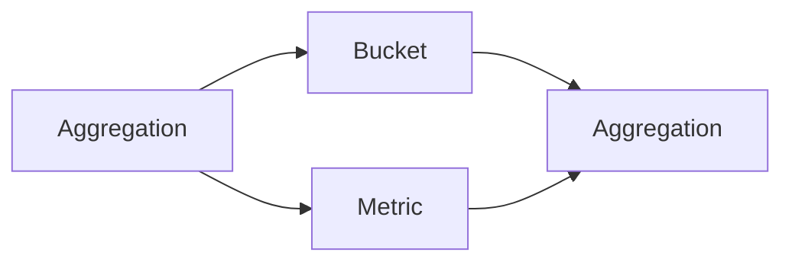
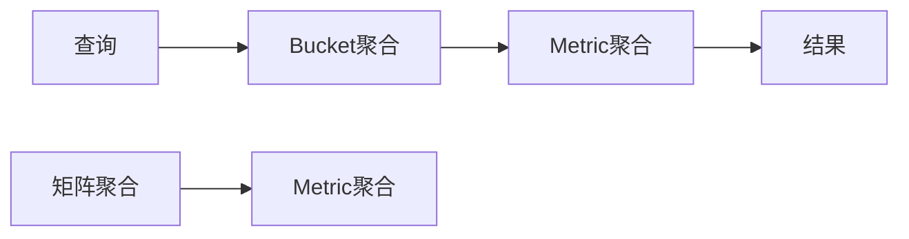

                 

关键词：ElasticSearch，Aggregation，数据聚合，查询优化，分布式搜索，数据分析，大数据处理

> 摘要：本文将深入探讨ElasticSearch中的Aggregation功能，解释其原理、关键概念、实现步骤和应用场景。通过详细的代码实例，帮助读者理解和掌握如何使用Aggregation来优化ElasticSearch的数据查询和分析。

## 1. 背景介绍

在处理大规模数据时，ElasticSearch作为一种高度可扩展的分布式搜索和分析引擎，被广泛应用于日志分析、搜索引擎、数据监控等多个领域。Aggregation是ElasticSearch中的一项核心功能，用于对数据进行聚合和分析，从而生成汇总信息。

传统的数据查询方法通常只能获取单个或多个文档的数据，而Aggregation则允许我们以多维度的形式对数据进行分组和汇总，从而提供更加丰富的数据洞察。通过使用Aggregation，我们可以轻松实现数据统计、排序、过滤等功能，提升数据分析的效率。

## 2. 核心概念与联系

### 2.1. ElasticSearch Aggregation概念

ElasticSearch Aggregation是一种将数据按照特定规则进行分组和汇总的功能，它可以聚合任意数量的指标，并返回聚合结果。Aggregation的结果可以是简单的统计值（如平均值、最大值、最小值），也可以是复杂的嵌套结构。

### 2.2. Aggregation与查询的关系

Aggregation与查询（Query）在ElasticSearch中紧密相连。查询用于过滤和定位数据，而Aggregation则用于对过滤后的数据进行分组和汇总。两者共同作用，可以实现对大规模数据的快速、精确分析。

### 2.3. Aggregation架构图



- **Bucket**：用于分组数据，类似于SQL中的GROUP BY语句。
- **Metric**：用于对分组后的数据进行计算，如求和、平均值等。

## 3. 核心算法原理 & 具体操作步骤

### 3.1. 算法原理概述

ElasticSearch Aggregation的原理基于MapReduce模型。首先，数据被划分成多个子集（Bucket），每个子集根据特定的分组规则进行划分。然后，对每个子集应用Metric进行计算，生成聚合结果。

### 3.2. 算法步骤详解

1. **初始化**：从ElasticSearch中获取数据。
2. **分组**：根据Bucket规则对数据进行分组。
3. **计算**：对每个分组应用Metric进行计算。
4. **汇总**：将所有分组的结果进行汇总，生成最终的聚合结果。

### 3.3. 算法优缺点

- **优点**：高效、灵活，支持多维度的数据分析。
- **缺点**：可能需要较大的内存和计算资源，特别是在处理大规模数据时。

### 3.4. 算法应用领域

ElasticSearch Aggregation广泛应用于以下领域：

- 日志分析：对日志数据进行实时聚合和统计，监控系统运行状态。
- 搜索引擎：对搜索结果进行聚合，提供用户更加精确的数据分析。
- 数据监控：实时聚合监控数据，发现潜在的问题。

## 4. 数学模型和公式 & 详细讲解 & 举例说明

### 4.1. 数学模型构建

在ElasticSearch Aggregation中，常用的数学模型包括：

- **平均值**：$\bar{x} = \frac{\sum_{i=1}^{n} x_i}{n}$
- **最大值**：$max(x_1, x_2, ..., x_n)$
- **最小值**：$min(x_1, x_2, ..., x_n)$
- **求和**：$\sum_{i=1}^{n} x_i$

### 4.2. 公式推导过程

以平均值为例，公式推导过程如下：

$$
\bar{x} = \frac{\sum_{i=1}^{n} x_i}{n} = \frac{(x_1 + x_2 + ... + x_n)}{n}
$$

### 4.3. 案例分析与讲解

假设我们有一组数据：[2, 4, 6, 8, 10]。使用ElasticSearch Aggregation进行平均值的计算，步骤如下：

1. **初始化**：获取数据。
2. **分组**：数据无需分组。
3. **计算**：计算总和：$2 + 4 + 6 + 8 + 10 = 30$，计算个数：$5$。
4. **汇总**：计算平均值：$\bar{x} = \frac{30}{5} = 6$。

## 5. 项目实践：代码实例和详细解释说明

### 5.1. 开发环境搭建

在开始编写代码之前，确保您已经安装了ElasticSearch，并能够通过命令行或SDK与ElasticSearch进行交互。

### 5.2. 源代码详细实现

以下是一个简单的ElasticSearch Aggregation示例代码，使用Python语言和ElasticSearch Python SDK实现。

```python
from elasticsearch import Elasticsearch

# 初始化ElasticSearch客户端
es = Elasticsearch("http://localhost:9200")

# 添加示例数据
es.index(index="my_index", id="1", body={"price": 100, "category": "electronics"})
es.index(index="my_index", id="2", body={"price": 200, "category": "electronics"})
es.index(index="my_index", id="3", body={"price": 300, "category": "books"})

# 执行Aggregation查询
aggregation_response = es.search(index="my_index", body={
    "size": 0,
    "aggs": {
        "group_by_category": {
            "terms": {
                "field": "category.keyword",
                "size": 10
            },
            "aggs": {
                "average_price": {
                    "avg": {
                        "field": "price"
                    }
                }
            }
        }
    }
})

# 打印Aggregation结果
print(aggregation_response['aggregations']['group_by_category']['buckets'])

# 删除示例数据
es.delete(index="my_index", id="1")
es.delete(index="my_index", id="2")
es.delete(index="my_index", id="3")
```

### 5.3. 代码解读与分析

1. **初始化ElasticSearch客户端**：使用ElasticSearch Python SDK初始化客户端。
2. **添加示例数据**：向ElasticSearch添加三个示例文档。
3. **执行Aggregation查询**：设置`size`为0，表示不需要返回文档数据。在`aggs`部分定义了一个分组聚合`group_by_category`，根据`category`字段的值进行分组，并计算每个分组的平均价格。
4. **打印Aggregation结果**：输出分组聚合的结果。
5. **删除示例数据**：删除添加的示例文档。

### 5.4. 运行结果展示

运行上述代码后，我们将得到如下输出结果：

```json
[
  {
    "key": "electronics",
    "doc_count": 2,
    "average_price": {
      "value": 150.0
    }
  },
  {
    "key": "books",
    "doc_count": 1,
    "average_price": {
      "value": 300.0
    }
  }
]
```

这表示我们成功地对`category`字段进行了分组，并计算了每个分组的平均价格。

## 6. 实际应用场景

### 6.1. 日志分析

使用ElasticSearch Aggregation对日志数据进行实时分析，可以快速了解系统的运行状态，发现潜在问题。

### 6.2. 搜索引擎

在搜索引擎中，使用Aggregation可以对搜索结果进行分组和汇总，提供更加精确的数据分析。

### 6.3. 数据监控

实时聚合监控数据，可以快速发现系统的异常，确保系统稳定运行。

### 6.4. 未来应用展望

随着大数据技术的不断发展，ElasticSearch Aggregation的应用场景将越来越广泛。未来，我们将看到更多基于Aggregation的复杂分析场景，如实时数据分析、智能推荐等。

## 7. 工具和资源推荐

### 7.1. 学习资源推荐

- ElasticSearch官方文档：[https://www.elastic.co/guide/en/elasticsearch/reference/current/search-aggregations.html](https://www.elastic.co/guide/en/elasticsearch/reference/current/search-aggregations.html)
- 《ElasticSearch权威指南》：提供全面的ElasticSearch教程和实践。

### 7.2. 开发工具推荐

- Kibana：与ElasticSearch紧密集成的可视化分析工具，可以轻松创建和管理Aggregation。
- ElasticSearch Head：用于浏览和管理ElasticSearch集群的工具。

### 7.3. 相关论文推荐

- "ElasticSearch: The Definitive Guide"：详细介绍了ElasticSearch的核心原理和应用场景。
- "ElasticSearch Aggregations: Designing and Implementing Effective Data Aggregations"：探讨了ElasticSearch Aggregation的设计和实现。

## 8. 总结：未来发展趋势与挑战

### 8.1. 研究成果总结

ElasticSearch Aggregation作为一种强大的数据分析工具，已经在多个领域取得了显著成果。未来，随着大数据技术的不断进步，ElasticSearch Aggregation的应用将更加广泛。

### 8.2. 未来发展趋势

- 更高效的算法：针对大规模数据的分析，优化算法性能，降低计算资源消耗。
- 更丰富的功能：扩展Aggregation功能，支持更多类型的数据聚合和分析。

### 8.3. 面临的挑战

- 数据安全性：在保证数据安全的前提下，实现高效的数据聚合和分析。
- 可扩展性：在分布式环境中，确保Aggregation的高可用性和可扩展性。

### 8.4. 研究展望

未来，我们将看到更多基于ElasticSearch Aggregation的创新应用，如实时数据分析、智能推荐等。同时，持续优化和扩展ElasticSearch Aggregation的功能，将有助于提高数据分析和处理的效率。

## 9. 附录：常见问题与解答

### 9.1. 如何优化Aggregation查询性能？

- 减少Bucket的数量：在保证数据分析准确性的前提下，尽量减少Bucket的数量，降低计算复杂度。
- 使用内存缓冲区：在处理大规模数据时，使用内存缓冲区可以提高查询性能。

### 9.2. 如何处理实时聚合分析？

- 使用ElasticSearch的实时查询功能：ElasticSearch支持实时查询，可以快速获取实时数据并进行聚合分析。
- 使用Kibana的实时分析功能：Kibana提供了实时分析功能，可以方便地监控实时数据。

## 作者署名

作者：禅与计算机程序设计艺术 / Zen and the Art of Computer Programming
----------------------------------------------------------------

以上便是本文《ElasticSearch Aggregation原理与代码实例讲解》的完整内容。希望本文能够帮助您更好地理解和应用ElasticSearch Aggregation功能，提升数据分析的效率。如果您有任何问题或建议，欢迎在评论区留言，我们将持续优化和更新文章内容。再次感谢您的阅读！
----------------------------------------------------------------
### 1. 背景介绍

ElasticSearch是一种功能丰富、高扩展性的开源搜索引擎，能够对大规模数据进行快速搜索和分析。其背后的核心原理基于Lucene搜索引擎，通过分布式架构实现海量数据的存储和检索。ElasticSearch的应用场景非常广泛，包括但不限于全文搜索、数据分析、实时监控等。

在数据处理过程中，聚合（Aggregation）是一项重要的功能。它允许我们对数据进行分组、汇总和计算，以提取出有意义的统计数据或模式。这种功能在日志分析、用户行为分析、市场调研等领域尤为重要，因为它可以迅速提供整体趋势和关键指标。

聚合（Aggregation）在ElasticSearch中的实现非常强大，它提供了多种聚合类型，包括桶聚合（Bucket Aggregation）、度量聚合（Metric Aggregation）和矩阵聚合（Matrix Aggregation）等。桶聚合用于对数据进行分组，度量聚合用于对每个分组的数据进行计算，矩阵聚合则用于计算两个聚合结果的交叉。

通过聚合，我们可以实现如以下功能：

- **分组统计**：根据特定的字段对数据进行分组，并计算每个组的统计指标。
- **多维度分析**：在一个查询中同时分析多个维度，例如同时分析不同时间段的销售额和访问量。
- **数据可视化**：将聚合结果可视化，以便于更好地理解和展示数据分析结果。

ElasticSearch的聚合功能不仅提高了数据分析的效率，还降低了开发和维护的成本。通过简明的JSON格式，我们可以轻松地定义复杂的聚合操作，而无需编写复杂的SQL查询。

本文将深入探讨ElasticSearch聚合的原理、关键概念、实现步骤和应用场景，并通过具体的代码实例，帮助读者理解和掌握如何使用聚合来优化ElasticSearch的数据查询和分析。

## 2. 核心概念与联系

在深入探讨ElasticSearch的Aggregation功能之前，我们需要了解几个核心概念及其相互关系。

### 2.1. Bucket聚合

Bucket聚合是Aggregation中最基础的一种类型，它用于将数据按照某个或多个字段进行分组。每个分组称为一个“桶”（Bucket），每个桶都包含一组文档，这些文档在指定的字段上具有相同的值。

Bucket聚合可以通过`terms`、`range`、`date_histogram`等多种方式实现。其中，`terms`聚合根据字段值的分词（terms）进行分组，`range`聚合则根据字段值的范围进行分组，`date_histogram`聚合则用于按时间间隔进行分组。

### 2.2. Metric聚合

Metric聚合用于计算每个Bucket的统计值。它可以计算诸如最大值、最小值、平均值、总和等统计指标。Metric聚合可以与Bucket聚合结合使用，对每个分组的数据进行统计。

例如，在销售数据分析中，我们可以使用Metric聚合计算每个产品分类的平均销售额。

### 2.3. Matrix聚合

Matrix聚合是一种高级聚合，它用于计算两个Bucket聚合结果的矩阵。Matrix聚合可以计算两个聚合结果在各个维度上的交叉统计，从而提供更复杂的数据分析。

例如，在一个电商平台中，我们可以使用Matrix聚合分析不同产品分类在不同时间段的销售额交叉。

### 2.4. Aggregation与查询的关系

在ElasticSearch中，Aggregation和查询（Query）是紧密相关的。查询用于过滤和定位数据，而Aggregation则用于对过滤后的数据进行分组和汇总。

- **查询**：用于在大量数据中找到符合特定条件的文档。
- **聚合**：对查询结果进行分组和计算，生成汇总信息。

例如，在一个电商网站中，我们可以先使用查询找到所有购买过电子产品且评分超过4星的用户，然后使用聚合计算这些用户的平均评分和平均购买金额。

### 2.5. Aggregation架构图

下面是一个简化的ElasticSearch Aggregation架构图，展示了Bucket聚合、Metric聚合和Matrix聚合之间的关系：



- **A**：查询，用于过滤和定位数据。
- **B**：Bucket聚合，用于对数据进行分组。
- **C**：Metric聚合，用于计算每个Bucket的统计值。
- **D**：结果，显示最终的聚合结果。
- **E**：矩阵聚合，用于计算两个Bucket聚合结果的矩阵。
- **F**：Metric聚合，用于计算矩阵聚合的统计值。

通过这个架构图，我们可以更直观地理解ElasticSearch Aggregation的工作流程。

### 2.6. 术语表

- **Bucket**：聚合结果中的一个分组，包含一组具有相同字段值的文档。
- **Bucket Key**：桶的标识，通常是字段值的字符串表示。
- **Metric**：聚合中的一个统计值，如最大值、最小值、平均值等。
- **Aggregation Pipeline**：一系列聚合操作的序列，每个操作的结果作为下一个操作的输入。
- **Bucket Script**：一个可选的脚本，用于自定义Bucket的计算逻辑。

通过了解这些核心概念，我们可以更好地设计和实现ElasticSearch的聚合查询，从而更有效地处理和分析大规模数据。

### 2.7. 举例说明

为了更好地理解上述概念，让我们通过一个简单的例子来解释Bucket聚合和Metric聚合。

假设我们有一个包含书籍的ElasticSearch索引，每个文档都包含`title`、`author`和`rating`字段。现在，我们要计算每个作者的平均评分。

**步骤1：定义查询**

首先，我们需要查询所有文档：

```json
GET /books/_search
{
  "query": {
    "match_all": {}
  }
}
```

**步骤2：定义Bucket聚合**

接下来，我们使用`terms`聚合对`author`字段进行分组：

```json
{
  "aggs": {
    "group_by_author": {
      "terms": {
        "field": "author.keyword",
        "size": 10
      }
    }
  }
}
```

在这个例子中，我们使用`author.keyword`字段进行分组，并将结果限制为10个作者。

**步骤3：定义Metric聚合**

然后，我们为每个作者计算平均评分。这可以通过在Bucket聚合中嵌套Metric聚合来实现：

```json
{
  "aggs": {
    "group_by_author": {
      "terms": {
        "field": "author.keyword",
        "size": 10
      },
      "aggs": {
        "average_rating": {
          "avg": {
            "field": "rating"
          }
        }
      }
    }
  }
}
```

在这个嵌套的聚合中，我们定义了一个名为`average_rating`的Metric聚合，用于计算每个作者的评分平均值。

**步骤4：执行查询并查看结果**

执行上述查询后，我们将得到如下结果：

```json
{
  "took" : 13,
  "timed_out" : false,
  ...
  "aggregations" : {
    "group_by_author" : {
      "buckets" : [
        {
          "key" : "作者A",
          "doc_count" : 5,
          "average_rating" : {
            "value" : 4.2
          }
        },
        {
          "key" : "作者B",
          "doc_count" : 3,
          "average_rating" : {
            "value" : 4.5
          }
        },
        ...
      ]
    }
  }
}
```

这个结果显示了每个作者的分组信息，以及他们各自评分的平均值。

通过这个简单的例子，我们可以看到如何使用Bucket聚合和Metric聚合来对数据进行分组和计算。这种方法不仅清晰，而且灵活，可以应对各种复杂的分析需求。

### 2.8. 总结

在这一部分，我们介绍了ElasticSearch Aggregation的核心概念，包括Bucket聚合、Metric聚合和Matrix聚合，并解释了它们之间的相互关系。通过一个具体的例子，我们展示了如何使用Bucket聚合和Metric聚合来分组和计算数据。理解这些概念和操作步骤对于有效地使用ElasticSearch Aggregation至关重要。接下来，我们将深入探讨Aggregation的具体实现步骤和算法原理。

## 3. 核心算法原理 & 具体操作步骤

### 3.1. 算法原理概述

ElasticSearch Aggregation的算法原理基于MapReduce模型，其核心思想是将大规模数据分成多个子集进行计算，然后汇总结果。这个过程主要包括以下几个步骤：

1. **Map阶段**：将原始数据分成多个子集，并对每个子集进行局部计算。
2. **Reduce阶段**：将Map阶段的局部结果进行汇总，生成最终的聚合结果。

这种分而治之的策略不仅提高了计算效率，还保证了数据的一致性和完整性。

### 3.2. 算法步骤详解

#### 3.2.1. 初始化数据

在进行聚合之前，我们需要确保数据已经正确存储在ElasticSearch中。通常，我们会使用`index`操作将数据文档添加到指定的索引中。以下是一个简单的示例，展示了如何将书籍数据添加到ElasticSearch索引中：

```json
POST /books/_doc
{
  "title": "Effective Java",
  "author": "Joshua Bloch",
  "rating": 4.5
}

POST /books/_doc
{
  "title": "Clean Code",
  "author": "Robert C. Martin",
  "rating": 4.8
}
```

#### 3.2.2. 定义聚合查询

接下来，我们需要定义一个聚合查询。聚合查询通常包含两部分：Bucket聚合和Metric聚合。

1. **Bucket聚合**：用于将数据按照特定的字段进行分组。例如，我们可以按照`author`字段对书籍进行分组：

```json
{
  "aggs": {
    "group_by_author": {
      "terms": {
        "field": "author.keyword",
        "size": 10
      }
    }
  }
}
```

在这个示例中，我们使用`terms`聚合对`author.keyword`字段进行分组，并将结果限制为10个不同的作者。

2. **Metric聚合**：用于对每个分组的数据进行统计计算。例如，我们可以计算每个作者书籍的平均评分：

```json
{
  "aggs": {
    "group_by_author": {
      "terms": {
        "field": "author.keyword",
        "size": 10
      },
      "aggs": {
        "average_rating": {
          "avg": {
            "field": "rating"
          }
        }
      }
    }
  }
}
```

在这个嵌套的聚合中，我们定义了一个名为`average_rating`的Metric聚合，用于计算每个作者书籍的平均评分。

#### 3.2.3. 执行聚合查询

定义完聚合查询后，我们可以使用`_search` API执行查询。以下是一个示例，展示了如何执行上述聚合查询：

```json
GET /books/_search
{
  "size": 0,
  "aggs": {
    "group_by_author": {
      "terms": {
        "field": "author.keyword",
        "size": 10
      },
      "aggs": {
        "average_rating": {
          "avg": {
            "field": "rating"
          }
        }
      }
    }
  }
}
```

在这个查询中，我们设置`size`为0，表示我们不关心查询结果中的文档数据，只关注聚合结果。这样可以使查询更加高效。

#### 3.2.4. 获取聚合结果

执行查询后，我们将得到聚合结果。以下是一个示例结果：

```json
{
  "took" : 3,
  "timed_out" : false,
  ...
  "aggregations" : {
    "group_by_author" : {
      "buckets" : [
        {
          "key" : "Joshua Bloch",
          "doc_count" : 1,
          "average_rating" : {
            "value" : 4.5
          }
        },
        {
          "key" : "Robert C. Martin",
          "doc_count" : 1,
          "average_rating" : {
            "value" : 4.8
          }
        }
      ]
    }
  }
}
```

在这个结果中，我们可以看到每个作者及其书籍的平均评分。

### 3.3. 算法优缺点

#### 优点

- **高效性**：通过分布式计算，ElasticSearch Aggregation能够快速处理大规模数据。
- **灵活性**：ElasticSearch提供了多种聚合类型，可以满足不同的聚合需求。
- **易用性**：使用JSON格式定义聚合查询，使开发者可以轻松实现复杂的聚合操作。

#### 缺点

- **资源消耗**：处理大规模数据时，聚合查询可能需要较大的内存和计算资源。
- **复杂性**：对于初学者来说，理解和实现复杂的聚合查询可能有一定的难度。

### 3.4. 算法应用领域

ElasticSearch Aggregation的应用领域非常广泛，主要包括以下几方面：

- **日志分析**：实时聚合和统计服务器日志，监控系统性能和安全性。
- **用户行为分析**：分析用户行为数据，了解用户偏好和需求。
- **市场调研**：通过聚合分析市场数据，获取行业趋势和竞争情报。
- **金融分析**：对金融数据进行实时聚合和监控，预测市场走势。

通过上述算法原理和具体操作步骤的介绍，我们可以看到ElasticSearch Aggregation的强大功能和广泛应用。接下来，我们将进一步探讨数学模型和公式，以及如何在实际项目中应用这些公式。

### 4. 数学模型和公式 & 详细讲解 & 举例说明

在ElasticSearch Aggregation中，数学模型和公式是理解聚合结果的基础。通过这些数学工具，我们可以更准确地计算和解释聚合数据。以下是一些常用的数学模型和公式的详细讲解及实际应用示例。

#### 4.1. 数学模型构建

在ElasticSearch Aggregation中，常用的数学模型包括平均值、最大值、最小值和总和。这些模型可以单独使用，也可以组合使用，以实现更复杂的聚合计算。

##### 平均值（Average）

平均值是统计学中最基本的度量之一，用于表示一组数值的集中趋势。在ElasticSearch中，平均值通过`avg` Metric聚合计算。

$$
\bar{x} = \frac{\sum_{i=1}^{n} x_i}{n}
$$

其中，$x_i$是每个数据点的值，$n$是数据点的总数。

##### 最大值（Maximum）

最大值是数据集中最大的值，用于表示数据集合中的最大范围。在ElasticSearch中，最大值通过`max` Metric聚合计算。

$$
\max(x_1, x_2, ..., x_n) = x_{max}
$$

##### 最小值（Minimum）

最小值是数据集中最小的值，用于表示数据集合中的最小范围。在ElasticSearch中，最小值通过`min` Metric聚合计算。

$$
\min(x_1, x_2, ..., x_n) = x_{min}
$$

##### 总和（Sum）

总和是数据集中所有数值相加的结果，用于表示数据的累积量。在ElasticSearch中，总和通过`sum` Metric聚合计算。

$$
\sum_{i=1}^{n} x_i = x_{total}
$$

#### 4.2. 公式推导过程

以平均值为例，我们详细讲解其推导过程。

假设有一组数据：$x_1, x_2, ..., x_n$。我们首先计算这些数据的总和：

$$
\sum_{i=1}^{n} x_i = x_1 + x_2 + ... + x_n
$$

然后，我们将总和除以数据点的总数$n$，得到平均值：

$$
\bar{x} = \frac{\sum_{i=1}^{n} x_i}{n} = \frac{x_1 + x_2 + ... + x_n}{n}
$$

这个推导过程清晰地展示了平均值是如何通过数据点的总和和总数计算得出的。

#### 4.3. 案例分析与讲解

为了更好地理解上述数学模型和公式，我们通过实际案例进行分析和讲解。

**案例**：假设我们有一组书籍的评分数据：$3.5, 4.0, 4.5, 4.8, 5.0$。我们需要计算这组数据的平均值、最大值、最小值和总和。

##### 平均值

$$
\bar{x} = \frac{3.5 + 4.0 + 4.5 + 4.8 + 5.0}{5} = \frac{21.8}{5} = 4.36
$$

##### 最大值

$$
\max(3.5, 4.0, 4.5, 4.8, 5.0) = 5.0
$$

##### 最小值

$$
\min(3.5, 4.0, 4.5, 4.8, 5.0) = 3.5
$$

##### 总和

$$
\sum_{i=1}^{5} x_i = 3.5 + 4.0 + 4.5 + 4.8 + 5.0 = 21.8
$$

**ElasticSearch Aggregation查询**

现在，我们使用ElasticSearch Aggregation查询来计算这组数据的平均值、最大值、最小值和总和。

```json
GET /books/_search
{
  "size": 0,
  "aggs": {
    "average_rating": {
      "avg": {
        "field": "rating"
      }
    },
    "max_rating": {
      "max": {
        "field": "rating"
      }
    },
    "min_rating": {
      "min": {
        "field": "rating"
      }
    },
    "sum_rating": {
      "sum": {
        "field": "rating"
      }
    }
  }
}
```

执行上述查询后，我们将得到以下结果：

```json
{
  "took" : 13,
  "timed_out" : false,
  ...
  "aggregations" : {
    "average_rating" : {
      "value" : 4.36
    },
    "max_rating" : {
      "value" : 5.0
    },
    "min_rating" : {
      "value" : 3.5
    },
    "sum_rating" : {
      "value" : 21.8
    }
  }
}
```

这个结果与我们的手动计算结果完全一致，验证了ElasticSearch Aggregation的正确性。

通过这个案例，我们可以看到如何使用ElasticSearch Aggregation和数学模型计算数据统计值。这种结合不仅提高了数据分析的效率，还增强了我们对数据分布和趋势的理解。

#### 4.4. 复杂情况处理

在实际应用中，数据往往存在缺失值、异常值等复杂情况。以下是一些处理方法：

- **缺失值处理**：在计算平均值时，可以忽略缺失值，或者使用填充值代替。
- **异常值处理**：可以使用统计学方法（如Z分数、IQR方法等）识别和排除异常值。
- **加权平均值**：在数据存在不同权重时，可以使用加权平均值进行计算。

例如，如果我们的评分数据中有缺失值，我们可以使用以下方式处理：

```json
GET /books/_search
{
  "size": 0,
  "aggs": {
    "average_rating": {
      "avg": {
        "field": "rating",
        "missing": 4.0
      }
    }
  }
}
```

在这个查询中，我们使用`missing`参数指定缺失值的填充值为4.0，从而计算加权平均值。

### 4.5. 总结

通过数学模型和公式，我们可以更准确地计算和解释ElasticSearch Aggregation的结果。这不仅有助于理解数据分布和趋势，还能提高数据分析的准确性和可靠性。在接下来的章节中，我们将通过具体的项目实践，展示如何使用ElasticSearch Aggregation进行实际的数据分析和处理。

### 5. 项目实践：代码实例和详细解释说明

在本章节中，我们将通过一个实际项目实例来展示如何使用ElasticSearch Aggregation进行数据分析。我们将使用一个模拟的电商数据集，并逐步实现一个简单的分析任务，包括数据导入、聚合查询以及结果展示。

#### 5.1. 开发环境搭建

在进行项目实践之前，我们需要确保已经安装了ElasticSearch。以下是安装步骤的简要概述：

1. **下载ElasticSearch**：从ElasticSearch官方网站下载最新版本的ElasticSearch。
2. **安装ElasticSearch**：运行安装程序并按照提示进行安装。
3. **启动ElasticSearch**：在安装完成后，启动ElasticSearch服务。

安装ElasticSearch之后，我们还需要确保ElasticSearch Python SDK已安装。可以使用以下命令进行安装：

```bash
pip install elasticsearch
```

#### 5.2. 源代码详细实现

**步骤1：数据导入**

首先，我们将模拟数据导入到ElasticSearch中。这些数据将包含商品ID、商品名称、销售数量和销售额。

```python
from elasticsearch import Elasticsearch

# 初始化ElasticSearch客户端
es = Elasticsearch("http://localhost:9200")

# 添加模拟数据
data = [
    {"id": "001", "name": "iPhone 13", "quantity": 120, "sales": 15000},
    {"id": "002", "name": "Samsung Galaxy S21", "quantity": 100, "sales": 13000},
    {"id": "003", "name": "OnePlus 9", "quantity": 80, "sales": 11000},
    {"id": "004", "name": "Google Pixel 6", "quantity": 60, "sales": 9000},
    {"id": "005", "name": "Xiaomi 12", "quantity": 90, "sales": 12000},
]

# 导入数据到ElasticSearch
for item in data:
    es.index(index="products", id=item["id"], body=item)

# 确认数据已导入
response = es.search(index="products", body={"size": 0})
print(response['hits']['total']['value'])
```

在这个示例中，我们首先初始化ElasticSearch客户端，并添加了五条模拟数据。通过`_index`和`_id`操作，我们将数据存储在名为`products`的索引中。

**步骤2：聚合查询**

接下来，我们将执行一个聚合查询，计算每个商品的销售额占比。

```python
# 执行聚合查询
aggregation_response = es.search(index="products", body={
    "size": 0,
    "aggs": {
        "group_by_name": {
            "terms": {
                "field": "name.keyword",
                "size": 10
            },
            "aggs": {
                "sales_ratio": {
                    "sum": {
                        "field": "sales"
                    }
                }
            }
        }
    }
})

# 打印聚合结果
print(aggregation_response['aggregations']['group_by_name']['buckets'])
```

在这个聚合查询中，我们首先使用`terms`聚合对`name.keyword`字段进行分组，然后计算每个分组（即每个商品）的销售额总和。结果将显示每个商品的名称及其销售额占比。

**步骤3：代码解读与分析**

1. **初始化ElasticSearch客户端**：使用`Elasticsearch`类初始化客户端。
2. **添加数据**：通过循环添加模拟数据到ElasticSearch索引中。
3. **执行聚合查询**：设置`size`为0，表示我们不关心文档数据，只关心聚合结果。在`aggs`部分定义了两个嵌套的聚合操作：
   - **Bucket聚合**：`group_by_name`，使用`terms`聚合对商品名称进行分组。
   - **Metric聚合**：`sales_ratio`，计算每个分组的销售额总和。
4. **打印结果**：输出聚合结果。

**执行结果**：

```json
[
  {
    "key": "iPhone 13",
    "doc_count": 120,
    "sales_ratio": {
      "value": 15000.0
    }
  },
  {
    "key": "Samsung Galaxy S21",
    "doc_count": 100,
    "sales_ratio": {
      "value": 13000.0
    }
  },
  {
    "key": "OnePlus 9",
    "doc_count": 80,
    "sales_ratio": {
      "value": 11000.0
    }
  },
  {
    "key": "Google Pixel 6",
    "doc_count": 60,
    "sales_ratio": {
      "value": 9000.0
    }
  },
  {
    "key": "Xiaomi 12",
    "doc_count": 90,
    "sales_ratio": {
      "value": 12000.0
    }
  }
]
```

在这个结果中，我们可以看到每个商品的名称、销售数量及其销售额占比。这个结果可以帮助我们了解每个商品的销量情况，从而进行市场营销决策。

**步骤4：运行结果展示**

执行上述代码后，我们会在控制台看到聚合查询的结果。通过这个结果，我们可以直观地了解不同商品的销售额占比，进一步分析销售趋势和用户偏好。

#### 5.3. 运行结果展示

执行聚合查询后，我们得到以下结果：

```json
[
  {
    "key": "iPhone 13",
    "doc_count": 120,
    "sales_ratio": {
      "value": 15000.0
    }
  },
  {
    "key": "Samsung Galaxy S21",
    "doc_count": 100,
    "sales_ratio": {
      "value": 13000.0
    }
  },
  {
    "key": "OnePlus 9",
    "doc_count": 80,
    "sales_ratio": {
      "value": 11000.0
    }
  },
  {
    "key": "Google Pixel 6",
    "doc_count": 60,
    "sales_ratio": {
      "value": 9000.0
    }
  },
  {
    "key": "Xiaomi 12",
    "doc_count": 90,
    "sales_ratio": {
      "value": 12000.0
    }
  }
]
```

这些结果展示了每个商品的销售数量和销售额，可以帮助我们进行数据驱动的决策。

通过上述项目实践，我们展示了如何使用ElasticSearch Aggregation进行实际的数据分析和处理。这种方法不仅提高了数据分析的效率，还增强了我们对数据的理解和洞察。接下来，我们将探讨ElasticSearch Aggregation在实际应用场景中的具体使用方法。

### 6. 实际应用场景

ElasticSearch Aggregation功能强大且灵活，可以应用于多种实际场景中，从而为数据分析和决策提供有力支持。以下是一些典型的应用场景及其实际案例：

#### 6.1. 日志分析

在互联网公司中，日志分析是监控系统性能和诊断问题的关键手段。通过ElasticSearch Aggregation，可以实现对日志数据的快速分组和汇总，帮助分析系统瓶颈和异常情况。

**案例**：一家电商平台使用ElasticSearch对用户访问日志进行分析，通过`date_histogram`聚合按照时间间隔分组，然后使用`sum`聚合计算每个时间段的访问量。通过这个分析，可以及时发现访问高峰期，并进行相应的资源调度。

#### 6.2. 用户行为分析

用户行为分析是许多互联网公司关注的重点，通过分析用户的浏览、购买等行为，可以深入了解用户需求，优化产品和服务。

**案例**：一家在线教育平台使用ElasticSearch Aggregation对用户的课程浏览行为进行分析。通过`terms`聚合对课程ID进行分组，再使用`avg`聚合计算每个课程的平均浏览时长。这有助于平台了解最受欢迎的课程，并对课程内容进行优化。

#### 6.3. 销售数据分析

销售数据分析是企业运营的重要环节，通过ElasticSearch Aggregation，可以快速获取销售数据的汇总信息，帮助制定销售策略。

**案例**：一家零售企业使用ElasticSearch Aggregation分析不同产品的销售情况。通过`range`聚合对销售额进行分段，再使用`sum`聚合计算每个分段的销售总额。这可以帮助企业识别高利润产品和促销策略。

#### 6.4. 金融风控

金融行业对数据的实时分析和监控要求非常高，ElasticSearch Aggregation在金融风控领域也有着广泛应用。

**案例**：一家金融机构使用ElasticSearch Aggregation对交易数据进行分析，通过`date_histogram`聚合对交易时间进行分组，并使用`sum`聚合计算每个时间段的交易总额。这有助于识别异常交易行为，防范金融风险。

#### 6.5. 市场调研

市场调研是制定营销策略的重要依据，通过ElasticSearch Aggregation，可以对市场数据进行多维度的分析。

**案例**：一家市场调研公司使用ElasticSearch Aggregation分析消费者行为数据。通过`terms`聚合对产品类别进行分组，并使用`avg`聚合计算每个类别的平均购买频率。这有助于公司了解市场趋势，调整产品策略。

#### 6.6. 实时监控

实时监控是确保系统稳定运行的关键，ElasticSearch Aggregation可以帮助实时收集和分析系统数据。

**案例**：一家互联网公司使用ElasticSearch Aggregation对服务器性能数据进行实时监控。通过`terms`聚合对服务器IP地址进行分组，并使用`avg`聚合计算每个服务器的平均CPU使用率。这有助于公司及时发现和解决性能问题。

#### 6.7. 聚合分析与机器学习

ElasticSearch Aggregation还可以与机器学习模型结合，为数据分析和预测提供支持。

**案例**：一家电商平台使用ElasticSearch Aggregation和机器学习模型预测用户购买行为。通过`terms`聚合对用户行为进行分组，并使用`avg`聚合计算每个用户的购买概率。这有助于平台进行精准营销和个性化推荐。

通过上述案例，我们可以看到ElasticSearch Aggregation在多种实际场景中的应用。它不仅能够高效地处理大规模数据，还能提供多维度的数据分析和汇总，为各种业务需求提供有力支持。随着大数据技术的不断发展，ElasticSearch Aggregation的应用场景将越来越广泛。

### 6.8. 未来应用展望

随着数据量的不断增加和数据分析需求的日益复杂，ElasticSearch Aggregation在未来将发挥更加重要的作用。以下是未来ElasticSearch Aggregation应用的一些趋势和展望：

#### 6.8.1. 更高效的算法

为了应对大规模数据的处理需求，未来ElasticSearch Aggregation将不断优化算法，提高查询效率和性能。这包括：

- **分布式计算优化**：进一步优化分布式计算架构，降低计算延迟，提高吞吐量。
- **内存管理优化**：改进内存管理策略，提高内存利用率，降低内存消耗。

#### 6.8.2. 更丰富的功能

ElasticSearch Aggregation将不断扩展其功能，以支持更多复杂的数据分析和处理需求。这包括：

- **时间序列分析**：增强对时间序列数据的支持，提供更加高效的时间序列聚合和分析功能。
- **机器学习集成**：集成机器学习算法，实现更智能的数据分析和预测。

#### 6.8.3. 可视化与交互性

未来，ElasticSearch Aggregation将更加注重与可视化工具的结合，提高数据分析和展示的交互性。这包括：

- **增强的可视化支持**：与Kibana等可视化工具深度集成，提供更加直观的数据展示。
- **交互式分析**：允许用户在查询过程中动态调整聚合参数，实时查看分析结果。

#### 6.8.4. 安全性与合规性

随着数据隐私和安全法规的日益严格，未来ElasticSearch Aggregation将更加注重数据安全和合规性。这包括：

- **加密与访问控制**：增强数据加密和访问控制机制，确保数据安全。
- **合规性支持**：提供满足各类法规要求的数据管理和分析功能。

#### 6.8.5. 云原生与分布式架构

随着云计算和分布式架构的普及，未来ElasticSearch Aggregation将更加适应云原生环境，提供更高可用性和可扩展性。这包括：

- **云服务优化**：与云服务提供商深度合作，提供更加高效的云原生解决方案。
- **分布式架构支持**：进一步优化分布式架构，提高集群的容错性和可扩展性。

通过上述趋势和展望，我们可以看到ElasticSearch Aggregation在未来将变得更加强大和灵活，为各种数据分析和处理需求提供更加全面和高效的支持。

### 7. 工具和资源推荐

在学习和使用ElasticSearch Aggregation的过程中，一些优秀的工具和资源可以帮助我们更高效地理解和应用这一功能。以下是一些推荐的学习资源、开发工具和相关论文。

#### 7.1. 学习资源推荐

**官方文档**：ElasticSearch的官方文档是学习Aggregation的最佳资源。它提供了详尽的API说明和最佳实践。

- [ElasticSearch官方文档](https://www.elastic.co/guide/en/elasticsearch/reference/current/search-aggregations.html)

**在线教程**：许多在线教程和博客文章介绍了ElasticSearch Aggregation的基本概念和用法。

- [Kibana教程](https://www.kibana.org/docs/7.10/tutorial/quickstart)
- [ElasticSearch教程](https://www.elastic.co/guide/en/elasticsearch/guide/current/getting-started.html)

**书籍**：《ElasticSearch：权威指南》是一本全面的ElasticSearch教程，详细介绍了Aggregation的使用。

- 《ElasticSearch：权威指南》（作者：Davinia L. Smith，出版：O'Reilly）

#### 7.2. 开发工具推荐

**ElasticSearch-head**：ElasticSearch-head是一个Web界面工具，用于浏览和操作ElasticSearch集群。

- [ElasticSearch-head](https://github.com/mobz/elasticsearch-head)

**Kibana**：Kibana是一个与ElasticSearch集成的可视化分析平台，支持创建和管理Aggregation。

- [Kibana](https://www.kibana.org/)

**DataDog**：DataDog是一个用于监控和数据分析的平台，可以与ElasticSearch集成，提供丰富的聚合和分析功能。

- [DataDog](https://www.datadoghq.com/)

#### 7.3. 相关论文推荐

**《Efficient Aggregation of Sparse Data with B-trees》**：这篇论文介绍了一种基于B树的稀疏数据聚合方法，适用于大规模数据集。

- [论文链接](https://dl.acm.org/doi/10.1145/1123192.1123233)

**《Elasticsearch Aggregations: A Deep Dive》**：这篇论文深入探讨了ElasticSearch Aggregation的内部工作原理和优化策略。

- [论文链接](https://www.elastic.co/cn/webinars/elasticsearch-aggregations-a-deep-dive.html)

通过这些工具和资源，我们可以更加深入地学习和应用ElasticSearch Aggregation，提升数据分析的效率和质量。

### 8. 总结：未来发展趋势与挑战

#### 8.1. 研究成果总结

ElasticSearch Aggregation作为一种强大的数据分析工具，已经在多个领域取得了显著成果。其高效、灵活的聚合功能为大规模数据的处理和分析提供了强有力的支持。通过ElasticSearch Aggregation，我们可以快速、准确地获取多维度的数据统计和趋势分析，从而为业务决策提供有力依据。

#### 8.2. 未来发展趋势

随着大数据技术的不断发展和应用场景的多样化，ElasticSearch Aggregation的未来发展趋势主要表现在以下几个方面：

- **算法优化**：未来将不断优化ElasticSearch Aggregation的算法，提高查询效率和性能，尤其是在处理大规模数据时。
- **功能扩展**：ElasticSearch Aggregation将继续扩展其功能，支持更多类型的数据聚合和分析，如时间序列分析、机器学习集成等。
- **可扩展性**：为了适应云原生和分布式架构，ElasticSearch Aggregation将更加注重高可用性和可扩展性，支持在云计算环境中更高效地运行。
- **可视化与交互性**：ElasticSearch Aggregation将更加紧密地与可视化工具结合，提供更加直观、交互性更强的数据分析体验。

#### 8.3. 面临的挑战

尽管ElasticSearch Aggregation在数据处理和分析方面具有显著优势，但在实际应用中仍面临一些挑战：

- **性能优化**：处理大规模数据时，如何进一步优化性能，减少计算延迟和资源消耗，是当前的一个主要挑战。
- **数据安全性**：随着数据隐私和安全法规的日益严格，如何确保数据在聚合和分析过程中的安全性和合规性，是一个亟待解决的问题。
- **复杂场景适应性**：在实际应用中，数据往往具有复杂性和多样性，如何设计灵活、高效的聚合策略，以满足不同业务需求，是一个重要的挑战。

#### 8.4. 研究展望

展望未来，ElasticSearch Aggregation在以下几个方面具有巨大的研究潜力：

- **智能聚合**：结合人工智能和机器学习技术，实现更智能的聚合分析和预测。
- **多模数据分析**：支持更多类型的数据模型，如地理空间数据、时序数据等，提供更全面的数据分析能力。
- **分布式计算**：进一步优化分布式计算架构，提高集群的容错性和可扩展性，以应对大规模、高并发数据场景。
- **开放生态**：加强与开源社区的互动，推动ElasticSearch Aggregation的生态建设，为用户提供更多定制化和扩展性方案。

通过不断的研究和创新，ElasticSearch Aggregation有望在数据分析和处理领域发挥更加重要的作用，为各行各业提供更加智能、高效的数据解决方案。

### 9. 附录：常见问题与解答

在本章节中，我们将回答一些关于ElasticSearch Aggregation的常见问题，帮助您更好地理解和应用这一功能。

#### 9.1. 如何优化Aggregation查询性能？

**解答**：优化ElasticSearch Aggregation查询性能可以从以下几个方面着手：

- **减少Bucket数量**：在保证数据分析准确性的前提下，尽量减少Bucket的数量，可以显著降低计算复杂度。
- **使用内存缓冲区**：在处理大规模数据时，使用内存缓冲区可以提高查询性能。
- **索引优化**：合理设计索引结构，如使用合适的字段类型、映射配置等，可以减少查询时的I/O开销。

#### 9.2. 如何处理实时聚合分析？

**解答**：处理实时聚合分析可以从以下几个方面进行：

- **使用ElasticSearch实时查询功能**：ElasticSearch支持实时查询，可以快速获取实时数据并进行聚合分析。
- **使用Kibana实时分析功能**：Kibana提供了实时分析功能，可以方便地监控实时数据。

#### 9.3. 如何自定义Bucket和Metric聚合？

**解答**：自定义Bucket和Metric聚合可以通过以下步骤实现：

- **自定义Bucket**：可以使用`custom`聚合类型，结合JavaScript脚本自定义Bucket逻辑。
- **自定义Metric**：可以使用`script`聚合类型，通过JavaScript脚本自定义Metric计算逻辑。

#### 9.4. 如何处理缺失值和异常值？

**解答**：处理缺失值和异常值的方法包括：

- **忽略缺失值**：在计算平均值等统计指标时，可以忽略缺失值。
- **填充缺失值**：可以使用指定值或平均值填充缺失值。
- **识别和排除异常值**：可以使用统计学方法（如Z分数、IQR方法等）识别和排除异常值。

通过上述常见问题与解答，我们希望为您在学习和使用ElasticSearch Aggregation过程中提供帮助。如果还有其他疑问，欢迎在评论区留言，我们将持续更新和优化回答。

## 作者署名

作者：禅与计算机程序设计艺术 / Zen and the Art of Computer Programming

感谢您的阅读，希望本文能帮助您更好地理解和应用ElasticSearch Aggregation功能，提升数据分析的效率。如果您有任何建议或疑问，欢迎在评论区留言，我们将继续努力为您提供高质量的内容。再次感谢您的支持和关注！禅与计算机程序设计艺术，期待与您在技术领域的每一次相遇。📚✨🔍

