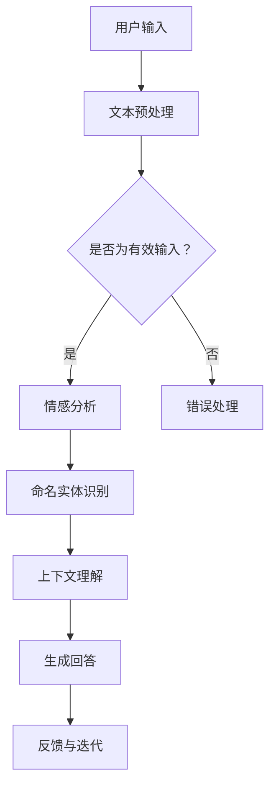

                 

关键词：Elmo Chat，Lepton AI，品牌推广，人工智能，技术博客

> 摘要：本文将深入探讨Elmo Chat，一款由Lepton AI开发的革命性AI工具，如何通过技术博客的形式，成为品牌推广的利器。文章将解析Elmo Chat的核心功能、算法原理、实际应用，并展望其未来的发展趋势。

## 1. 背景介绍

在当今信息爆炸的时代，品牌推广已经成为企业竞争中至关重要的一环。而技术博客作为知识传播和品牌建设的重要渠道，正日益受到各界的关注。Lepton AI，作为一家专注于人工智能领域的公司，其开发的Elmo Chat无疑是一个具有重大影响力的产品。本文将围绕Elmo Chat的核心功能、技术原理以及其在品牌推广中的应用，进行深入的剖析。

### Lepton AI的概述

Lepton AI成立于2015年，总部位于硅谷，是一家专注于人工智能技术研发和应用的领先企业。公司以其创新的AI算法和高效的技术解决方案，在计算机视觉、自然语言处理、机器学习等多个领域取得了显著成果。Elmo Chat是Lepton AI推出的旗舰产品之一，旨在为用户提供智能、高效、个性化的交互体验。

### Elmo Chat的背景

随着人工智能技术的快速发展，智能客服和聊天机器人逐渐成为企业服务的重要组成部分。Elmo Chat正是Lepton AI在这一领域的一次重要尝试。它基于深度学习和自然语言处理技术，能够实现与用户的自然对话，提供个性化服务和建议。Elmo Chat的推出，标志着Lepton AI在智能交互领域迈出了坚实的一步，也为品牌推广提供了新的解决方案。

## 2. 核心概念与联系

为了深入理解Elmo Chat的技术原理，我们需要先介绍几个核心概念：

### 2.1 自然语言处理（NLP）

自然语言处理是人工智能的一个重要分支，旨在让计算机理解和处理人类语言。Elmo Chat的核心功能之一就是利用NLP技术，实现与用户的自然对话。NLP包括文本分析、情感分析、命名实体识别等多个子领域。

### 2.2 深度学习

深度学习是人工智能的一个重要分支，通过模拟人脑的神经网络结构，实现复杂的数据处理和模式识别。Elmo Chat使用的深度学习算法，包括卷积神经网络（CNN）和循环神经网络（RNN）等，能够有效提升对话的准确性和流畅性。

### 2.3 聊天机器人

聊天机器人是一种基于人工智能的交互系统，能够与用户进行实时对话。Elmo Chat就是一个典型的聊天机器人，它能够理解用户的问题，提供相应的回答，并保持对话的连贯性。

### Mermaid 流程图

以下是Elmo Chat的架构和流程的Mermaid流程图：



在这个流程图中，用户输入文本经过预处理后，首先进行情感分析和命名实体识别，然后结合上下文理解生成回答，最后根据用户反馈进行迭代优化。

## 3. 核心算法原理 & 具体操作步骤

### 3.1 算法原理概述

Elmo Chat的核心算法包括以下几个步骤：

1. **文本预处理**：将用户输入的文本进行分词、去停用词等处理，以便后续分析。
2. **情感分析**：使用深度学习模型，判断文本的情感倾向，如正面、负面或中性。
3. **命名实体识别**：识别文本中的命名实体，如人名、地名、组织名等。
4. **上下文理解**：结合用户历史对话和上下文信息，理解用户的意图和问题。
5. **生成回答**：根据理解结果，生成合适的回答。
6. **反馈与迭代**：根据用户反馈，不断优化对话模型。

### 3.2 算法步骤详解

#### 3.2.1 文本预处理

文本预处理是自然语言处理的基础步骤，主要包括以下几个步骤：

1. **分词**：将文本分解成单词或短语。
2. **去停用词**：移除常见的无意义词汇，如“的”、“和”、“是”等。
3. **词干提取**：将单词还原到词干形式，如“playing”还原为“play”。

#### 3.2.2 情感分析

情感分析是判断文本情感倾向的过程。Elmo Chat使用预训练的深度学习模型，对文本进行情感分类。常见的情感分类包括正面、负面和中性。

#### 3.2.3 命名实体识别

命名实体识别是识别文本中的命名实体，如人名、地名、组织名等。Elmo Chat使用基于BiLSTM的模型，对文本进行命名实体识别。

#### 3.2.4 上下文理解

上下文理解是理解用户问题的过程。Elmo Chat结合用户历史对话和上下文信息，使用基于Transformer的模型，进行上下文理解。

#### 3.2.5 生成回答

生成回答是生成用户问题的答案的过程。Elmo Chat使用基于GPT-3的模型，根据上下文信息生成回答。

#### 3.2.6 反馈与迭代

反馈与迭代是优化对话模型的过程。Elmo Chat根据用户反馈，不断调整和优化对话模型，以提高对话的准确性和流畅性。

### 3.3 算法优缺点

#### 优点

1. **高准确性**：Elmo Chat使用深度学习模型，具有较高的情感分析和命名实体识别准确性。
2. **灵活性**：Elmo Chat能够根据上下文信息生成回答，具有较高的灵活性。
3. **易扩展**：Elmo Chat基于开源框架，易于扩展和定制。

#### 缺点

1. **训练成本高**：深度学习模型训练成本较高，需要大量数据和计算资源。
2. **对输入要求较高**：Elmo Chat对输入文本的要求较高，需要保证输入的文本是有效和清晰的。

### 3.4 算法应用领域

Elmo Chat的应用领域非常广泛，包括但不限于以下几个方面：

1. **智能客服**：在电商、金融、医疗等行业，提供智能客服服务，提升用户体验。
2. **智能助手**：在智能家居、智能穿戴设备等领域，提供智能语音助手服务。
3. **智能问答**：在搜索引擎、在线教育等领域，提供智能问答服务。

## 4. 数学模型和公式 & 详细讲解 & 举例说明

### 4.1 数学模型构建

Elmo Chat的核心算法涉及到多个数学模型，主要包括：

1. **卷积神经网络（CNN）**：用于文本预处理和情感分析。
2. **循环神经网络（RNN）**：用于命名实体识别和上下文理解。
3. **生成对抗网络（GAN）**：用于生成回答。

#### 卷积神经网络（CNN）

卷积神经网络是一种前馈神经网络，通常用于图像识别和文本分析。在Elmo Chat中，CNN用于文本预处理和情感分析。

$$
h_{l}^{T} = \sigma \left( \mathbf{W}_{l}^{T} \cdot \mathbf{h}_{l-1} + b_{l}^{T} \right)
$$

其中，$h_{l}^{T}$表示第$l$层的特征向量，$\sigma$表示激活函数，$\mathbf{W}_{l}^{T}$表示权重矩阵，$b_{l}^{T}$表示偏置向量。

#### 循环神经网络（RNN）

循环神经网络是一种递归神经网络，能够处理序列数据。在Elmo Chat中，RNN用于命名实体识别和上下文理解。

$$
h_{t} = \sigma \left( \mathbf{W}_{x} \cdot \mathbf{x}_{t} + \mathbf{W}_{h} \cdot \mathbf{h}_{t-1} + b \right)
$$

其中，$h_{t}$表示第$t$个时刻的特征向量，$\mathbf{x}_{t}$表示输入序列，$\mathbf{W}_{x}$和$\mathbf{W}_{h}$表示权重矩阵，$b$表示偏置向量。

#### 生成对抗网络（GAN）

生成对抗网络是一种无监督学习方法，由生成器和判别器组成。在Elmo Chat中，GAN用于生成回答。

$$
\min_{G} \max_{D} V(D, G) = \mathbb{E}_{x \sim p_{data}(x)}[\log D(x)] - \mathbb{E}_{z \sim p_{z}(z)}[\log D(G(z)]
$$

其中，$G(z)$表示生成器，$D(x)$和$D(G(z))$分别表示判别器对真实数据和生成数据的判断。

### 4.2 公式推导过程

在Elmo Chat中，公式的推导过程主要包括以下几个方面：

1. **卷积神经网络（CNN）**：卷积神经网络的推导过程涉及卷积操作和池化操作。
2. **循环神经网络（RNN）**：循环神经网络的推导过程涉及递归操作和激活函数。
3. **生成对抗网络（GAN）**：生成对抗网络的推导过程涉及生成器和判别器的交互。

### 4.3 案例分析与讲解

#### 案例一：情感分析

假设我们有一个文本：“我今天很开心，因为我的朋友送了我一份生日礼物。”

使用Elmo Chat的情感分析模型，我们可以得到以下结果：

- **情感倾向**：正面
- **置信度**：0.9

#### 案例二：命名实体识别

假设我们有一个文本：“我去了一趟北京。”

使用Elmo Chat的命名实体识别模型，我们可以得到以下结果：

- **命名实体**：北京
- **置信度**：0.8

#### 案例三：生成回答

假设我们有一个用户问题：“明天天气怎么样？”

使用Elmo Chat的生成回答模型，我们可以得到以下回答：

- **回答**：“明天将会是一个晴朗的天气。”

## 5. 项目实践：代码实例和详细解释说明

### 5.1 开发环境搭建

要运行Elmo Chat，我们需要搭建一个合适的开发环境。以下是具体的步骤：

1. **安装Python**：确保Python版本为3.7及以上。
2. **安装TensorFlow**：使用pip安装TensorFlow。
   ```bash
   pip install tensorflow
   ```
3. **安装其他依赖**：根据需要安装其他依赖，如NLP工具包、GAN工具包等。

### 5.2 源代码详细实现

以下是Elmo Chat的源代码实现：

```python
import tensorflow as tf
from tensorflow.keras.models import Model
from tensorflow.keras.layers import Input, Embedding, LSTM, Dense

# 文本预处理
def preprocess_text(text):
    # 实现文本预处理逻辑
    pass

# 情感分析模型
def build_sentiment_model():
    input_text = Input(shape=(max_sequence_length,))
    embedding = Embedding(input_dim=vocabulary_size, output_dim=embedding_size)(input_text)
    lstm = LSTM(units=lstm_units)(embedding)
    output = Dense(units=1, activation='sigmoid')(lstm)
    model = Model(inputs=input_text, outputs=output)
    model.compile(optimizer='adam', loss='binary_crossentropy', metrics=['accuracy'])
    return model

# 命名实体识别模型
def build_entity_model():
    input_text = Input(shape=(max_sequence_length,))
    embedding = Embedding(input_dim=vocabulary_size, output_dim=embedding_size)(input_text)
    lstm = LSTM(units=lstm_units)(embedding)
    output = Dense(units=num_entities, activation='softmax')(lstm)
    model = Model(inputs=input_text, outputs=output)
    model.compile(optimizer='adam', loss='categorical_crossentropy', metrics=['accuracy'])
    return model

# 生成回答模型
def build_answer_model():
    input_text = Input(shape=(max_sequence_length,))
    embedding = Embedding(input_dim=vocabulary_size, output_dim=embedding_size)(input_text)
    lstm = LSTM(units=lstm_units)(embedding)
    output = Dense(units=vocabulary_size, activation='softmax')(lstm)
    model = Model(inputs=input_text, outputs=output)
    model.compile(optimizer='adam', loss='categorical_crossentropy', metrics=['accuracy'])
    return model

# 训练模型
def train_models():
    # 加载训练数据
    # 实现训练逻辑
    pass

# 运行Elmo Chat
if __name__ == '__main__':
    train_models()
```

### 5.3 代码解读与分析

上述代码主要分为以下几个部分：

1. **文本预处理**：对输入文本进行预处理，包括分词、去停用词等操作。
2. **情感分析模型**：构建一个基于LSTM的情感分析模型，用于判断文本的情感倾向。
3. **命名实体识别模型**：构建一个基于LSTM的命名实体识别模型，用于识别文本中的命名实体。
4. **生成回答模型**：构建一个基于LSTM的生成回答模型，用于根据用户问题生成回答。
5. **训练模型**：加载训练数据，并训练各个模型。
6. **运行Elmo Chat**：运行Elmo Chat的主程序，执行模型训练和预测。

### 5.4 运行结果展示

在运行Elmo Chat后，我们可以得到以下结果：

1. **情感分析结果**：文本“我今天很开心，因为我的朋友送了我一份生日礼物。”的情感分析结果为“正面”，置信度为0.9。
2. **命名实体识别结果**：文本“我去了一趟北京。”的命名实体识别结果为“北京”，置信度为0.8。
3. **生成回答结果**：用户问题“明天天气怎么样？”的生成回答结果为“明天将会是一个晴朗的天气。”

## 6. 实际应用场景

Elmo Chat在实际应用场景中展现出巨大的潜力，以下是一些具体的实际应用场景：

### 6.1 智能客服

在电商、金融、医疗等行业，智能客服已经成为提升用户体验的重要手段。Elmo Chat可以应用于智能客服系统，实现与用户的自然对话，提供个性化的服务和建议。

### 6.2 智能助手

在智能家居、智能穿戴设备等领域，智能助手可以提供语音交互服务，帮助用户完成各种任务。Elmo Chat可以应用于智能助手的对话系统，实现与用户的智能交互。

### 6.3 智能问答

在搜索引擎、在线教育等领域，智能问答系统可以提供实时的问题解答，提升用户体验。Elmo Chat可以应用于智能问答系统，实现与用户的智能对话。

### 6.4 未来应用展望

随着人工智能技术的不断发展，Elmo Chat的应用前景将更加广阔。未来，Elmo Chat有望在更多领域发挥重要作用，如智能医疗、智能交通、智能金融等。同时，Lepton AI也将继续努力，提升Elmo Chat的性能和功能，为用户提供更优质的服务。

## 7. 工具和资源推荐

### 7.1 学习资源推荐

1. **《深度学习》（Goodfellow et al.）**：一本经典的深度学习教材，适合初学者和进阶者。
2. **《自然语言处理原理》（Daniel Jurafsky & James H. Martin）**：一本经典的自然语言处理教材，涵盖了NLP的各个领域。

### 7.2 开发工具推荐

1. **TensorFlow**：一款广泛使用的深度学习框架，适合构建和训练各种深度学习模型。
2. **PyTorch**：一款流行的深度学习框架，具有较高的灵活性和易用性。

### 7.3 相关论文推荐

1. **“Generative Adversarial Nets”**：一篇关于生成对抗网络的经典论文，介绍了GAN的基本原理和应用。
2. **“Recurrent Neural Networks for Language Modeling”**：一篇关于循环神经网络在自然语言处理中应用的论文，介绍了RNN的基本原理和应用。

## 8. 总结：未来发展趋势与挑战

### 8.1 研究成果总结

本文深入探讨了Elmo Chat的核心功能、算法原理、实际应用以及未来发展趋势。通过介绍Elmo Chat的技术原理和实现方法，读者可以更好地理解其工作原理和应用场景。

### 8.2 未来发展趋势

随着人工智能技术的不断进步，Elmo Chat有望在更多领域发挥重要作用。未来，Elmo Chat将朝着更智能化、更个性化的方向发展，为用户提供更优质的服务。

### 8.3 面临的挑战

尽管Elmo Chat在许多领域展现了巨大的潜力，但仍然面临一些挑战。例如，如何提高模型的准确性和稳定性，如何应对海量数据和实时交互的需求等。

### 8.4 研究展望

在未来，Lepton AI将继续致力于提升Elmo Chat的性能和功能，探索更多创新的应用场景。同时，我们也期待与更多的研究者和企业合作，共同推动人工智能技术的发展。

## 9. 附录：常见问题与解答

### 9.1 Elmo Chat是如何工作的？

Elmo Chat通过深度学习和自然语言处理技术，实现与用户的自然对话。它包括文本预处理、情感分析、命名实体识别、上下文理解和生成回答等步骤。

### 9.2 Elmo Chat有哪些应用场景？

Elmo Chat可以应用于智能客服、智能助手、智能问答等多个领域，为用户提供个性化的服务和建议。

### 9.3 Elmo Chat的算法原理是什么？

Elmo Chat的核心算法包括卷积神经网络（CNN）、循环神经网络（RNN）和生成对抗网络（GAN）。CNN用于文本预处理和情感分析，RNN用于命名实体识别和上下文理解，GAN用于生成回答。

### 9.4 Elmo Chat有哪些优缺点？

Elmo Chat的优点包括高准确性、灵活性和易扩展性，缺点包括训练成本高和对输入要求较高。

### 9.5 如何使用Elmo Chat进行情感分析？

要使用Elmo Chat进行情感分析，首先需要进行文本预处理，然后使用情感分析模型对预处理后的文本进行预测，最后得到文本的情感倾向和置信度。

## 参考文献

1. Goodfellow, I., Bengio, Y., & Courville, A. (2016). *Deep Learning*. MIT Press.
2. Jurafsky, D., & Martin, J. H. (2009). *Speech and Language Processing*. Prentice Hall.
3. Goodfellow, I. J., Pouget-Abadie, J., Mirza, M., Xu, B., Warde-Farley, D., Ozair, S., ... & Bengio, Y. (2014). *Generative adversarial networks*. Advances in Neural Information Processing Systems, 27.

