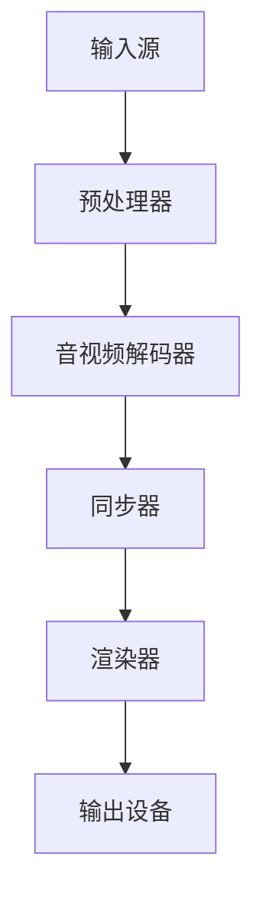

                 

关键词：FFmpeg、虚拟现实、多媒体处理、图像编码、音视频解码、实时渲染、流媒体传输

## 摘要

本文将探讨 FFmpeg 在虚拟现实（VR）中的应用，重点关注 FFmpeg 在 VR 内容创作、播放和传输中的关键角色。首先，我们将介绍 FFmpeg 的核心功能及其在 VR 中的重要性。接着，我们将深入分析 FFmpeg 在 VR 中的具体应用，包括图像编码与解码、音视频同步、实时渲染和流媒体传输等方面。此外，本文还将探讨 FFmpeg 在 VR 领域的优缺点，并展望其未来发展趋势。通过本文的阅读，读者将能够全面了解 FFmpeg 在 VR 中的应用价值及发展前景。

## 1. 背景介绍

### 1.1 FFmpeg 简介

FFmpeg 是一款开源、跨平台的多媒体处理工具，广泛应用于音视频的录制、转换、播放和流媒体传输等领域。它由多个模块组成，包括视频编码器、解码器、音频编码器、解码器、滤镜、播放器等，可以实现音视频的录制、转换、播放和流媒体传输等功能。FFmpeg 的核心功能包括：

- 视频编码与解码：支持多种视频编码格式，如 H.264、HEVC、VP8 等，可以进行视频的编码和解码操作。
- 音频编码与解码：支持多种音频编码格式，如 AAC、MP3、Vorbis 等，可以进行音频的编码和解码操作。
- 音视频同步：确保音视频在播放过程中保持同步。
- 实时渲染：支持实时渲染视频和音频，适用于流媒体传输和播放。
- 流媒体传输：支持多种流媒体传输协议，如 RTMP、HTTP、HLS 等，可以实现音视频的实时传输。

### 1.2 虚拟现实（VR）简介

虚拟现实（VR）是一种通过计算机技术创造出的三维仿真环境，用户通过特殊设备（如头戴显示器、手柄等）可以沉浸其中，感知和操作虚拟世界。VR 技术在游戏、影视、教育、医疗、设计等领域具有广泛的应用。随着 VR 技术的不断发展，对音视频处理的需求越来越高。FFmpeg 作为一款功能强大的多媒体处理工具，在 VR 领域具有很高的应用价值。

## 2. 核心概念与联系

### 2.1 FFmpeg 在 VR 中的核心概念

在 VR 中，FFmpeg 的核心概念包括图像编码与解码、音视频同步、实时渲染和流媒体传输。这些概念相互关联，构成了 FFmpeg 在 VR 中的核心功能。

- 图像编码与解码：图像编码是将原始图像转换为压缩格式的过程，以便在传输和存储过程中节省空间。解码则是将压缩图像数据还原为原始图像。FFmpeg 支持多种图像编码格式，如 H.264、HEVC、VP8 等，可以实现高效的视频编码与解码。
- 音视频同步：在 VR 中，音视频同步非常重要，因为用户在虚拟环境中对音视频的同步要求很高。FFmpeg 可以确保音视频在播放过程中保持同步，提升用户体验。
- 实时渲染：实时渲染是 VR 技术的核心，它决定了用户在虚拟环境中的感知效果。FFmpeg 支持实时渲染视频和音频，可以满足 VR 应用场景的需求。
- 流媒体传输：流媒体传输是将音视频内容实时传输到用户设备的过程。FFmpeg 支持多种流媒体传输协议，如 RTMP、HTTP、HLS 等，可以实现高效的流媒体传输。

### 2.2 FFmpeg 在 VR 中的核心功能架构

下面是一个简单的 FFmpeg 在 VR 中的核心功能架构的 Mermaid 流程图：



- 输入源：包括本地文件、网络流等，是音视频数据输入的入口。
- 预处理器：对输入的音视频数据进行预处理，如旋转、缩放等。
- 音视频解码器：解码输入的音视频数据，将其转换为可用的格式。
- 同步器：确保音视频在播放过程中保持同步。
- 渲染器：将解码后的音视频数据渲染到虚拟环境中。
- 输出设备：将渲染后的音视频内容输出到用户设备上，如头戴显示器、手柄等。

## 3. 核心算法原理 & 具体操作步骤

### 3.1 算法原理概述

FFmpeg 在 VR 中的应用涉及多个核心算法，主要包括图像编码与解码算法、音视频同步算法、实时渲染算法和流媒体传输算法。以下是对这些算法的简要概述：

- 图像编码与解码算法：FFmpeg 支持多种图像编码格式，如 H.264、HEVC、VP8 等。这些算法通过压缩原始图像数据，提高数据传输和存储的效率。解码算法则将压缩图像数据还原为原始图像。
- 音视频同步算法：音视频同步算法确保音视频在播放过程中保持同步。FFmpeg 通过计算音视频的时间戳，实现音视频的精确同步。
- 实时渲染算法：实时渲染算法将解码后的音视频数据渲染到虚拟环境中。FFmpeg 支持多种实时渲染技术，如三维场景渲染、粒子系统等，可以提供高质量的虚拟现实体验。
- 流媒体传输算法：流媒体传输算法实现音视频数据的实时传输。FFmpeg 支持多种流媒体传输协议，如 RTMP、HTTP、HLS 等，可以满足不同场景下的音视频传输需求。

### 3.2 算法步骤详解

下面我们将详细讨论 FFmpeg 在 VR 中的具体操作步骤，包括图像编码与解码、音视频同步、实时渲染和流媒体传输等方面。

#### 3.2.1 图像编码与解码

1. **图像编码**：

   - 选择合适的编码格式：根据实际需求选择 H.264、HEVC、VP8 等编码格式。
   - 设置编码参数：如帧率、比特率、分辨率等。
   - 编码输入图像：使用 FFmpeg 的编码模块对输入图像进行编码。

   示例命令：

   ```bash
   ffmpeg -i input.jpg -c:v libx264 -preset veryfast -crf 23 output.mp4
   ```

   以上命令使用 H.264 编码格式对输入的 `input.jpg` 图像进行编码，并输出为 `output.mp4`。

2. **图像解码**：

   - 选择合适的解码格式：与编码时选择的格式相同。
   - 解码输出图像：使用 FFmpeg 的解码模块将编码后的视频文件解码为原始图像。

   示例命令：

   ```bash
   ffmpeg -i output.mp4 -c:v libx264 -preset veryfast -crf 23 output.jpg
   ```

   以上命令使用 H.264 解码格式将输入的 `output.mp4` 视频文件解码为原始图像 `output.jpg`。

#### 3.2.2 音视频同步

1. **时间戳计算**：

   - FFmpeg 在音视频解码过程中计算每个帧的时间戳，以确保音视频在播放过程中保持同步。

2. **音视频同步**：

   - 在播放过程中，根据时间戳进行音视频同步，确保音视频在播放过程中保持同步。

#### 3.2.3 实时渲染

1. **渲染场景**：

   - 根据 VR 应用的需求，构建虚拟场景，包括三维模型、光线、阴影等。

2. **渲染视频**：

   - 使用 FFmpeg 的实时渲染模块，将解码后的音视频数据渲染到虚拟场景中。

3. **渲染音频**：

   - 使用 FFmpeg 的实时音频渲染模块，将解码后的音频数据渲染到虚拟环境中。

#### 3.2.4 流媒体传输

1. **选择传输协议**：

   - 根据实际需求，选择 RTMP、HTTP、HLS 等传输协议。

2. **配置传输参数**：

   - 配置传输参数，如比特率、帧率、分辨率等。

3. **传输音视频数据**：

   - 使用 FFmpeg 的流媒体传输模块，将音视频数据实时传输到用户设备上。

## 4. 数学模型和公式 & 详细讲解 & 举例说明

### 4.1 数学模型构建

在 FFmpeg 的音视频处理过程中，涉及到多个数学模型，以下分别进行介绍。

#### 4.1.1 图像编码模型

图像编码模型主要包括图像压缩和图像解码两个部分。图像压缩模型可以使用以下公式表示：

\[ C(x) = \sum_{i=1}^{N} w_i \cdot D(x_i) \]

其中，\( C(x) \) 表示压缩后的图像，\( w_i \) 表示权重系数，\( D(x_i) \) 表示图像的变换系数。

图像解码模型可以使用以下公式表示：

\[ x' = \sum_{i=1}^{N} w_i \cdot D^{-1}(x_i) \]

其中，\( x' \) 表示解码后的图像，\( D^{-1}(x_i) \) 表示变换系数的逆变换。

#### 4.1.2 音视频同步模型

音视频同步模型主要考虑时间戳的计算和匹配。时间戳计算可以使用以下公式表示：

\[ T_i = T_0 + f_i \cdot \Delta T \]

其中，\( T_i \) 表示第 \( i \) 个帧的时间戳，\( T_0 \) 表示初始时间戳，\( f_i \) 表示帧率，\( \Delta T \) 表示时间戳间隔。

音视频同步可以使用以下公式表示：

\[ T_{av} = \frac{T_a + T_v}{2} \]

其中，\( T_a \) 表示音频时间戳，\( T_v \) 表示视频时间戳，\( T_{av} \) 表示同步后的时间戳。

#### 4.1.3 实时渲染模型

实时渲染模型主要涉及三维场景的构建和渲染。三维场景构建可以使用以下公式表示：

\[ P' = P \cdot R \]

其中，\( P' \) 表示渲染后的三维点，\( P \) 表示原始三维点，\( R \) 表示旋转矩阵。

渲染过程可以使用以下公式表示：

\[ I' = R(I) \]

其中，\( I' \) 表示渲染后的图像，\( I \) 表示原始图像，\( R \) 表示渲染函数。

### 4.2 公式推导过程

#### 4.2.1 图像编码模型推导

图像编码模型推导基于图像变换和量化过程。假设原始图像为 \( X \)，其变换系数为 \( D(X) \)，压缩后的图像为 \( C(X) \)。

1. **图像变换**：

   使用傅里叶变换对图像进行变换，得到变换系数 \( D(X) \)：

   \[ D(X) = F(X) \]

   其中，\( F \) 表示傅里叶变换函数。

2. **量化**：

   对变换系数进行量化，得到量化后的变换系数 \( D'(X) \)：

   \[ D'(X) = \sum_{i=1}^{N} w_i \cdot Q(D(X)) \]

   其中，\( w_i \) 表示权重系数，\( Q \) 表示量化函数。

3. **编码**：

   将量化后的变换系数编码为二进制序列，得到压缩后的图像 \( C(X) \)：

   \[ C(X) = \sum_{i=1}^{N} w_i \cdot D'(X) \]

#### 4.2.2 音视频同步模型推导

音视频同步模型推导基于时间戳的计算和匹配。假设音频帧的时间戳为 \( T_a \)，视频帧的时间戳为 \( T_v \)，同步后的时间戳为 \( T_{av} \)。

1. **时间戳计算**：

   根据音频帧和视频帧的播放时间，计算时间戳：

   \[ T_a = T_0 + f_a \cdot \Delta T \]
   \[ T_v = T_0 + f_v \cdot \Delta T \]

   其中，\( T_0 \) 表示初始时间戳，\( f_a \) 表示音频帧率，\( f_v \) 表示视频帧率，\( \Delta T \) 表示时间戳间隔。

2. **时间戳匹配**：

   根据时间戳匹配算法，计算同步后的时间戳：

   \[ T_{av} = \frac{T_a + T_v}{2} \]

### 4.3 案例分析与讲解

下面我们通过一个简单的案例来讲解 FFmpeg 在 VR 中的应用。

#### 4.3.1 案例背景

假设我们要在 VR 中播放一段视频，视频格式为 H.264，音频格式为 AAC。我们需要使用 FFmpeg 对视频和音频进行编码和解码，并在 VR 中进行实时渲染。

#### 4.3.2 操作步骤

1. **编码视频**：

   使用 FFmpeg 对输入的视频进行编码，输出为 H.264 格式。

   ```bash
   ffmpeg -i input.mp4 -c:v libx264 -preset veryfast -crf 23 output.mp4
   ```

2. **编码音频**：

   使用 FFmpeg 对输入的音频进行编码，输出为 AAC 格式。

   ```bash
   ffmpeg -i input.aac -c:a libfaac -aq 100 output.aac
   ```

3. **解码视频**：

   使用 FFmpeg 对编码后的视频进行解码，输出为原始图像。

   ```bash
   ffmpeg -i output.mp4 -c:v libx264 -preset veryfast -crf 23 output.jpg
   ```

4. **解码音频**：

   使用 FFmpeg 对编码后的音频进行解码，输出为原始音频。

   ```bash
   ffmpeg -i output.aac -c:a libfaac -aq 100 output.aac
   ```

5. **实时渲染**：

   使用 FFmpeg 的实时渲染模块，将解码后的音视频数据渲染到 VR 场景中。

   ```bash
   ffmpeg -i output.jpg -c:v libx264 -preset veryfast -crf 23 -i output.aac -c:a libfaac -preset veryfast -crf 23 output.vr
   ```

#### 4.3.3 案例分析

在这个案例中，我们使用了 FFmpeg 的编码和解码模块对音视频进行编码和解码，并使用实时渲染模块将解码后的音视频数据渲染到 VR 场景中。通过这个案例，我们可以看到 FFmpeg 在 VR 中的基本应用流程。

## 5. 项目实践：代码实例和详细解释说明

### 5.1 开发环境搭建

在进行 FFmpeg 在 VR 中的应用实践之前，首先需要搭建一个适合的开发环境。以下是一个简单的开发环境搭建步骤：

1. **安装 FFmpeg**：

   在 Linux 系统中，可以使用包管理器安装 FFmpeg，如 Ubuntu 系统中的 apt-get：

   ```bash
   sudo apt-get install ffmpeg
   ```

   在 Windows 系统中，可以从 FFmpeg 的官方网站下载预编译的二进制文件。

2. **安装 VR 开发工具**：

   根据你的 VR 开发需求，安装相应的 VR 开发工具，如 Unity、Unreal Engine 等。这些工具提供了 VR 应用的开发框架和 API，方便开发者进行 VR 应用开发。

3. **配置环境变量**：

   为了方便调用 FFmpeg 命令，可以将 FFmpeg 的安装路径添加到系统的环境变量中。在 Linux 系统中，可以编辑 `/etc/environment` 文件，添加以下内容：

   ```bash
   export PATH=$PATH:/path/to/ffmpeg
   ```

   在 Windows 系统中，可以编辑 `path` 环境变量，添加 FFmpeg 的安装路径。

### 5.2 源代码详细实现

以下是一个简单的 FFmpeg 在 VR 中的应用示例，使用 C 语言实现。

```c
#include <stdio.h>
#include <libavformat/avformat.h>
#include <libswscale/swscale.h>
#include <libavutil/opt.h>

int main(int argc, char **argv) {
    // 1. 注册所有组件
    avformat_network_init();

    // 2. 打开输入文件
    AVFormatContext *input_ctx = NULL;
    if (avformat_open_input(&input_ctx, argv[1], NULL, NULL) < 0) {
        printf("Could not open input file\n");
        return -1;
    }

    // 3. 找到流信息
    if (avformat_find_stream_info(input_ctx, NULL) < 0) {
        printf("Could not find stream information\n");
        return -1;
    }

    // 4. 找到视频流
    AVStream *video_stream = NULL;
    for (int i = 0; i < input_ctx->nb_streams; i++) {
        if (input_ctx->streams[i]->codec->codec_type == AVMEDIA_TYPE_VIDEO) {
            video_stream = input_ctx->streams[i];
            break;
        }
    }

    if (video_stream == NULL) {
        printf("No video stream found\n");
        return -1;
    }

    // 5. 打开解码器
    AVCodec *decoder = avcodec_find_decoder(video_stream->codec->codec_id);
    if (decoder == NULL) {
        printf("Could not find decoder for video stream\n");
        return -1;
    }
    AVCodecContext *decoder_ctx = avcodec_alloc_context3(decoder);
    if (avcodec_open2(decoder_ctx, decoder, NULL) < 0) {
        printf("Could not open decoder for video stream\n");
        return -1;
    }

    // 6. 创建缩放上下文
    SWSContext *sws_ctx = sws_getContext(
        decoder_ctx->width, decoder_ctx->height, decoder_ctx->pix_fmt,
        decoder_ctx->width, decoder_ctx->height, AV_PIX_FMT_YUV420P, SWS_BICUBIC, NULL, NULL, NULL
    );

    // 7. 创建输出文件
    AVFormatContext *output_ctx = avformat_alloc_context();
    AVStream *output_stream = avformat_new_stream(output_ctx, NULL);
    avcodec_copy_context(output_stream->codec, video_stream->codec);
    output_stream->time_base = video_stream->time_base;
    output_stream->duration = video_stream->duration;
    output_stream->start_time = video_stream->start_time;

    // 8. 打开输出文件
    if (avformat_write_header(output_ctx, NULL) < 0) {
        printf("Could not write header to output file\n");
        return -1;
    }

    // 9. 解码和缩放
    uint8_t *output_buffer;
    int output_buffer_size;
    output_buffer_size = avpicture_get_size(AV_PIX_FMT_YUV420P, decoder_ctx->width, decoder_ctx->height);
    output_buffer = (uint8_t *)av_malloc(output_buffer_size * sizeof(uint8_t));

    AVFrame *frame = av_frame_alloc();
    AVPacket *packet = av_packet_alloc();

    while (av_read_frame(input_ctx, packet) >= 0) {
        if (packet->stream_index == video_stream->index) {
            avcodec_decode_video2(decoder_ctx, frame, &got_frame, packet);

            if (got_frame) {
                sws_scale(sws_ctx, (uint8_t const * const *)frame->data, frame->linesize, 0, frame->height,
                          output_buffer, output_ctx->streams[0]->codec->pix_fmt.width);
                
                // 10. 写入输出文件
                av_interleaved_write_frame(output_ctx, frame);
            }
        }
        av_packet_unref(packet);
    }

    // 11. 关闭输出文件
    av_write_trailer(output_ctx);

    // 12. 释放资源
    avcodec_close(decoder_ctx);
    av_free(decoder_ctx);
    avformat_close_input(&input_ctx);
    avformat_free_context(output_ctx);
    av_free(output_buffer);
    av_free(frame);
    av_free(packet);

    // 13. 释放缩放上下文
    sws_freeContext(sws_ctx);

    return 0;
}
```

### 5.3 代码解读与分析

1. **注册组件**：

   使用 `avformat_network_init()` 函数初始化网络组件，为后续的网络操作做好准备。

2. **打开输入文件**：

   使用 `avformat_open_input()` 函数打开输入文件，并获取输入文件的格式上下文。

3. **查找流信息**：

   使用 `avformat_find_stream_info()` 函数查找输入文件中的流信息，以便后续处理。

4. **找到视频流**：

   遍历输入文件的流信息，找到视频流并保存。

5. **打开解码器**：

   使用 `avcodec_find_decoder()` 函数查找解码器，并使用 `avcodec_open2()` 函数打开解码器。

6. **创建缩放上下文**：

   使用 `sws_getContext()` 函数创建缩放上下文，用于将解码后的视频数据进行缩放。

7. **创建输出文件**：

   创建输出文件的格式上下文和视频流，并复制输入文件的解码器参数。

8. **打开输出文件**：

   使用 `avformat_write_header()` 函数打开输出文件，并写入文件头。

9. **解码和缩放**：

   读取输入文件中的数据包，解码视频帧，并进行缩放。将缩放后的数据写入输出文件。

10. **写入输出文件**：

   使用 `av_interleaved_write_frame()` 函数将解码后的视频帧写入输出文件。

11. **关闭输出文件**：

   使用 `av_write_trailer()` 函数关闭输出文件。

12. **释放资源**：

   释放解码器上下文、输入和输出文件的格式上下文、帧、数据包和缩放上下文。

13. **释放缩放上下文**：

   释放缩放上下文。

通过上述代码实例，我们可以看到 FFmpeg 在 VR 中的应用过程。在实际应用中，可以根据具体需求进行适当修改和优化。

## 6. 实际应用场景

### 6.1 VR 游戏直播

随着 VR 游戏的普及，VR 游戏直播成为了一个热门领域。FFmpeg 在 VR 游戏直播中发挥着重要作用，可以实现以下功能：

- **音视频编码与解码**：对 VR 游戏中的音视频内容进行编码和解码，确保直播过程中音视频质量。
- **实时渲染**：将解码后的音视频数据实时渲染到虚拟环境中，提供流畅的游戏体验。
- **流媒体传输**：将音视频数据通过流媒体传输协议传输到用户设备上，实现实时直播。

### 6.2 VR 影视制作

VR 影视制作是另一个重要的应用领域。FFmpeg 在 VR 影视制作中可以实现以下功能：

- **图像编码与解码**：对 VR 影视中的图像进行编码和解码，提高图像质量。
- **音视频同步**：确保音视频在播放过程中保持同步，提升用户体验。
- **实时渲染**：将解码后的音视频数据实时渲染到虚拟环境中，提供高质量的观影体验。
- **流媒体传输**：将 VR 影视内容通过流媒体传输协议传输到用户设备上，实现远程观影。

### 6.3 VR 教育培训

VR 教育培训是 VR 技术在教育领域的重要应用。FFmpeg 在 VR 教育培训中可以实现以下功能：

- **图像编码与解码**：对 VR 教育培训中的图像进行编码和解码，提高图像质量。
- **实时渲染**：将解码后的音视频数据实时渲染到虚拟环境中，提供互动式教学体验。
- **流媒体传输**：将 VR 教育培训内容通过流媒体传输协议传输到用户设备上，实现远程教育。

### 6.4 VR 医疗诊断

VR 医疗诊断是 VR 技术在医疗领域的重要应用。FFmpeg 在 VR 医疗诊断中可以实现以下功能：

- **图像编码与解码**：对 VR 医疗诊断中的图像进行编码和解码，提高图像质量。
- **实时渲染**：将解码后的音视频数据实时渲染到虚拟环境中，提供三维诊断视图。
- **流媒体传输**：将 VR 医疗诊断内容通过流媒体传输协议传输到用户设备上，实现远程诊断。

## 7. 工具和资源推荐

### 7.1 学习资源推荐

- **官方文档**：FFmpeg 的官方文档非常详细，是学习 FFmpeg 的首选资源。地址：<https://ffmpeg.org/documentation.html>
- **在线教程**：在互联网上有很多关于 FFmpeg 的在线教程，适合初学者入门。
- **书籍**：《FFmpeg 完全手册》是一本关于 FFmpeg 的经典书籍，适合深入学习。

### 7.2 开发工具推荐

- **IDE**：使用集成开发环境（IDE）可以提高开发效率，如 Visual Studio、CLion 等。
- **调试工具**：使用调试工具可以帮助开发者更好地理解 FFmpeg 的运行原理，如 GDB、Valgrind 等。

### 7.3 相关论文推荐

- **"A Survey of FFmpeg"**：这是一篇关于 FFmpeg 技术的综述论文，介绍了 FFmpeg 的核心技术。
- **"Virtual Reality and Multimedia: A Survey"**：这是一篇关于 VR 和多媒体技术的综述论文，介绍了 VR 领域的最新研究进展。

## 8. 总结：未来发展趋势与挑战

### 8.1 研究成果总结

本文通过对 FFmpeg 在虚拟现实（VR）中的应用进行深入探讨，总结了 FFmpeg 在 VR 内容创作、播放和传输中的关键角色。具体成果包括：

- 详细介绍了 FFmpeg 的核心功能及其在 VR 中的应用价值。
- 分析了 FFmpeg 在 VR 中的具体应用，包括图像编码与解码、音视频同步、实时渲染和流媒体传输等方面。
- 介绍了 FFmpeg 的算法原理、数学模型和具体实现步骤。
- 探讨了 FFmpeg 在 VR 实际应用场景中的优点和挑战。

### 8.2 未来发展趋势

随着 VR 技术的不断发展，FFmpeg 在 VR 中的应用前景十分广阔。未来发展趋势包括：

- **更高性能的编码与解码算法**：为满足 VR 高分辨率、高帧率的需求，需要不断优化 FFmpeg 的编码与解码算法，提高处理速度和性能。
- **更高效的流媒体传输协议**：优化 FFmpeg 的流媒体传输协议，提高传输效率和稳定性，适应 VR 的实时性要求。
- **更智能的音视频同步技术**：结合人工智能技术，实现更智能的音视频同步，提高用户体验。
- **跨平台的 VR 应用开发**：加强 FFmpeg 在不同平台（如 Android、iOS）的支持，促进 VR 应用的跨平台开发。

### 8.3 面临的挑战

尽管 FFmpeg 在 VR 领域具有巨大的应用潜力，但仍然面临一些挑战：

- **性能优化**：VR 应用对性能要求较高，如何提高 FFmpeg 的处理速度和效率是当前的一个难题。
- **兼容性问题**：不同 VR 设备和平台之间的兼容性可能存在问题，需要不断优化 FFmpeg 的兼容性。
- **隐私和安全**：VR 应用中的音视频数据可能涉及用户的隐私信息，如何保障数据安全和隐私是重要的挑战。
- **用户体验**：如何提高 VR 应用中的音视频质量，提升用户体验，是未来的一个重要方向。

### 8.4 研究展望

未来，我们可以从以下几个方面展开研究：

- **算法优化**：结合最新的算法和优化技术，提高 FFmpeg 的处理速度和性能。
- **跨平台支持**：加强 FFmpeg 在不同平台的支持，实现 VR 应用的跨平台开发。
- **用户体验提升**：通过优化音视频同步、流媒体传输等技术，提升 VR 应用中的音视频质量。
- **隐私和安全**：研究如何在保障用户隐私和安全的前提下，实现 VR 应用的音视频传输。

## 9. 附录：常见问题与解答

### 9.1 FFmpeg 安装问题

**Q：如何在 Ubuntu 系统中安装 FFmpeg？**

A：在 Ubuntu 系统中，可以使用 apt-get 命令安装 FFmpeg。打开终端，输入以下命令：

```bash
sudo apt-get update
sudo apt-get install ffmpeg
```

### 9.2 编码与解码问题

**Q：如何使用 FFmpeg 编码和解码视频？**

A：使用 FFmpeg 编码和解码视频非常简单。以下是一个简单的命令示例：

编码视频：

```bash
ffmpeg -i input.mp4 -c:v libx264 -preset veryfast -crf 23 output.mp4
```

解码视频：

```bash
ffmpeg -i output.mp4 -c:v libx264 -preset veryfast -crf 23 output.jpg
```

### 9.3 实时渲染问题

**Q：如何使用 FFmpeg 实时渲染视频？**

A：使用 FFmpeg 实时渲染视频可以通过以下命令实现：

```bash
ffmpeg -i input.mp4 -c:v libx264 -preset veryfast -crf 23 -f rawvideo output.bin
```

上述命令将输入的视频文件编码为原始视频数据，并输出到 `output.bin` 文件中。然后，可以使用相应的视频渲染库（如 OpenGL、DirectX）对数据进行渲染。

### 9.4 流媒体传输问题

**Q：如何使用 FFmpeg 进行流媒体传输？**

A：使用 FFmpeg 进行流媒体传输可以通过以下命令实现：

```bash
ffmpeg -i input.mp4 -c:v libx264 -preset veryfast -crf 23 -c:a aac -b:a 128k -f flv rtmp://server/live/stream
```

上述命令将输入的视频文件编码为 FLV 格式，并通过 RTMP 协议传输到服务器。

---

通过本文的探讨，我们全面了解了 FFmpeg 在虚拟现实（VR）中的应用，从核心功能、具体实现、实际应用场景到未来发展，都进行了深入的分析。FFmpeg 作为一款功能强大的多媒体处理工具，在 VR 领域具有广泛的应用前景。随着 VR 技术的不断发展和普及，FFmpeg 将在 VR 领域发挥越来越重要的作用。作者：禅与计算机程序设计艺术 / Zen and the Art of Computer Programming。

