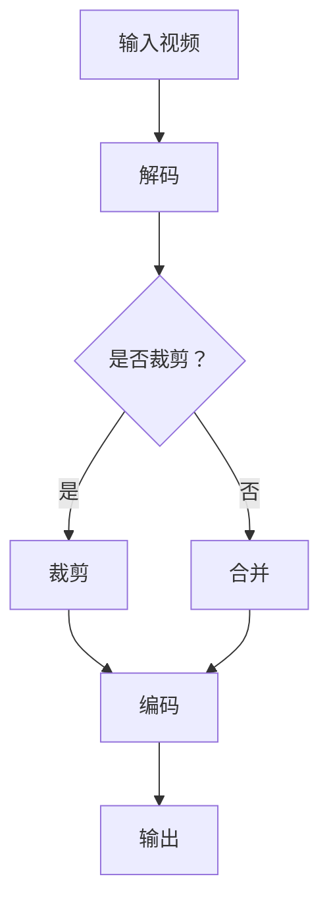

                 

关键词：FFmpeg, 视频编辑, 裁剪, 合并, 视频处理, 编程技巧

> 摘要：本文将详细介绍如何使用 FFmpeg 进行视频的裁剪和合并操作。我们将从基本概念、操作步骤、数学模型、代码实例到实际应用场景，全面探讨 FFmpeg 在视频编辑领域的应用。通过本文的学习，您将能够掌握 FFmpeg 的基本用法，并能够在实际项目中灵活运用。

## 1. 背景介绍

视频编辑是数字媒体处理中的重要环节，它允许我们对视频文件进行各种操作，如裁剪、合并、转码、特效添加等。FFmpeg 是一款开源、跨平台的多媒体处理工具，它支持几乎所有的视频、音频和图像格式，被广泛应用于视频编辑、视频流处理、音频处理等领域。

本文将重点关注 FFmpeg 中的两个重要功能：裁剪和合并视频片段。这两个操作在视频编辑中非常常见，也是实现视频个性化处理的关键步骤。通过了解和使用这两个功能，我们可以灵活地对视频文件进行编辑，满足不同的应用需求。

### FFmpeg 的发展历史

FFmpeg 最早由 Fabrice Bellard 在1994年创建，初衷是为了提供一个能够轻松转换视频格式的工具。随着时间的推移，FFmpeg 的功能不断完善，逐渐成为一款功能强大、性能优秀的多媒体处理工具。

2000年，FFmpeg 被移植到 Linux 平台，随后在多个操作系统上得到支持。如今，FFmpeg 已成为视频处理领域的基石，被广泛应用于各类媒体制作和流媒体传输项目中。

### FFmpeg 的核心功能

FFmpeg 的核心功能包括但不限于：

- 视频、音频和图像的转换
- 视频和音频的裁剪、合并、拼接
- 视频和音频的编码与解码
- 视频和音频的滤镜和特效添加
- 视频流的处理和传输

在本篇文章中，我们将重点关注 FFmpeg 的裁剪和合并功能。

## 2. 核心概念与联系

在进行视频裁剪和合并之前，我们需要了解一些基本概念，如图像像素、视频帧率、音频采样率等。这些概念是理解视频处理过程的基础。

### 2.1 图像像素

图像像素是构成图像的最小单位，每个像素都包含一定的颜色信息。在视频编辑中，像素的分辨率决定了视频的清晰度和大小。

### 2.2 视频帧率

视频帧率是指视频每秒钟显示的帧数。常见的视频帧率有 24fps、30fps、60fps 等。帧率越高，视频越流畅。

### 2.3 音频采样率

音频采样率是指音频信号在一段时间内被采样的次数。常见的音频采样率有 44.1kHz、48kHz 等。采样率越高，音频质量越好。

### 2.4 FFmpeg 的基本架构

FFmpeg 的架构可以分为以下几个部分：

- 解码器（Decoder）：负责将视频、音频文件解码成原始数据。
- 编码器（Encoder）：负责将原始数据编码成视频、音频文件。
- 滤镜（Filter）：负责对视频、音频进行各种处理，如图像滤镜、音效处理等。
- 输出（Output）：负责将处理后的视频、音频输出到文件、显示器或其他设备。

### 2.5 Mermaid 流程图

下面是一个简单的 Mermaid 流程图，展示了视频裁剪和合并的基本流程。



## 3. 核心算法原理 & 具体操作步骤

### 3.1 算法原理概述

视频裁剪和合并的原理相对简单，主要是基于时间轴上的操作。裁剪是指从视频中截取一段指定的时间范围；合并是指将多个视频或音频文件拼接在一起。

### 3.2 算法步骤详解

#### 3.2.1 裁剪视频

裁剪视频的基本步骤如下：

1. 使用 `ffmpeg` 命令获取视频的时长。
2. 根据需要裁剪的时间范围，生成命令行参数。
3. 使用 `ffmpeg` 命令执行裁剪操作。

示例命令：

```bash
ffmpeg -i input.mp4 -ss 00:00:10 -to 00:00:30 -c:v copy -c:a copy output.mp4
```

参数解释：

- `-i input.mp4`：指定输入文件。
- `-ss 00:00:10`：指定起始时间。
- `-to 00:00:30`：指定结束时间。
- `-c:v copy`：复制视频编码。
- `-c:a copy`：复制音频编码。
- `output.mp4`：指定输出文件。

#### 3.2.2 合并视频

合并视频的基本步骤如下：

1. 使用 `ffmpeg` 命令获取每个视频的时长和尺寸。
2. 根据需要合并的顺序和时长，生成命令行参数。
3. 使用 `ffmpeg` 命令执行合并操作。

示例命令：

```bash
ffmpeg -f concat -i playlist.txt -c:v copy -c:a copy output.mp4
```

参数解释：

- `-f concat`：指定使用串联输入。
- `-i playlist.txt`：指定输入文件列表。
- `-c:v copy`：复制视频编码。
- `-c:a copy`：复制音频编码。
- `output.mp4`：指定输出文件。

#### 3.2.3 裁剪和合并的组合操作

在实际应用中，我们可能需要先对多个视频进行裁剪，然后再将裁剪后的视频合并在一起。这个过程可以通过一个简单的脚本实现。

示例脚本：

```bash
#!/bin/bash

# 裁剪视频
ffmpeg -i input1.mp4 -ss 00:00:10 -to 00:00:30 -c:v copy -c:a copy output1.mp4
ffmpeg -i input2.mp4 -ss 00:00:20 -to 00:00:40 -c:v copy -c:a copy output2.mp4

# 合并视频
echo "file 'output1.mp4'" > playlist.txt
echo "file 'output2.mp4'" >> playlist.txt
ffmpeg -f concat -i playlist.txt -c:v copy -c:a copy output.mp4
```

### 3.3 算法优缺点

#### 优点

- 简单易用：FFmpeg 的命令行参数非常直观，易于理解和操作。
- 功能强大：FFmpeg 支持多种视频、音频格式，以及丰富的滤镜和特效。
- 开源免费：FFmpeg 是一款开源软件，可以免费使用。

#### 缺点

- 学习成本：FFmpeg 的命令行参数较多，需要一定的时间学习和熟悉。
- 性能消耗：FFmpeg 的处理速度相对较慢，尤其是在处理大文件时。

### 3.4 算法应用领域

FFmpeg 在视频编辑领域的应用非常广泛，包括但不限于以下场景：

- 视频制作和编辑：FFmpeg 可以帮助制作和编辑视频，如添加滤镜、特效、音频等。
- 视频流处理：FFmpeg 可以用于视频流处理，如实时视频直播、视频会议等。
- 视频存储和传输：FFmpeg 可以用于视频的压缩和存储，以及视频文件的传输和分发。

## 4. 数学模型和公式 & 详细讲解 & 举例说明

### 4.1 数学模型构建

在进行视频裁剪和合并时，我们需要关注两个关键参数：时间（Time）和空间（Space）。

#### 时间模型

时间模型主要涉及视频的帧率和时间戳。帧率（Frame Rate）是指视频每秒显示的帧数，通常用 fps（frames per second）表示。时间戳（Timestamp）是指视频中的特定时间点。

视频时间戳的数学模型可以表示为：

\[ T = \text{Frame Rate} \times \text{Timestamp} \]

其中，\( T \) 表示视频中的时间长度，单位为秒；\(\text{Frame Rate}\) 表示视频的帧率；\(\text{Timestamp}\) 表示视频中的帧数。

#### 空间模型

空间模型主要涉及视频的分辨率和像素。分辨率（Resolution）是指视频的宽度（Width）和高度（Height），通常用像素（Pixel）表示。

视频空间分辨率的数学模型可以表示为：

\[ S = \text{Width} \times \text{Height} \]

其中，\( S \) 表示视频的空间大小，单位为像素；\(\text{Width}\) 表示视频的宽度；\(\text{Height}\) 表示视频的高度。

### 4.2 公式推导过程

在视频裁剪过程中，我们需要根据指定的时间戳和帧率，计算裁剪后视频的时长和像素。

#### 裁剪时长

裁剪时长的计算公式为：

\[ \text{Duration} = \text{Frame Rate} \times (\text{End Timestamp} - \text{Start Timestamp}) \]

其中，\(\text{Duration}\) 表示裁剪后视频的时长，单位为秒；\(\text{Frame Rate}\) 表示视频的帧率；\(\text{End Timestamp}\) 表示裁剪结束的时间戳；\(\text{Start Timestamp}\) 表示裁剪开始的时间戳。

#### 裁剪像素

裁剪像素的计算公式为：

\[ \text{Pixel} = \text{Width} \times \text{Height} \]

其中，\(\text{Pixel}\) 表示裁剪后视频的空间大小，单位为像素；\(\text{Width}\) 表示视频的宽度；\(\text{Height}\) 表示视频的高度。

### 4.3 案例分析与讲解

假设我们有一个视频文件 `input.mp4`，其帧率为 24fps，分辨率为 1920x1080。我们需要将其裁剪为时长为 10 秒的视频。

根据上述公式，我们可以计算裁剪后视频的时长和像素：

\[ \text{Duration} = 24 \times (10 - 0) = 240 \text{秒} \]
\[ \text{Pixel} = 1920 \times 1080 = 2073600 \text{像素} \]

因此，裁剪后视频的时长为 240 秒，像素为 2073600 像素。

## 5. 项目实践：代码实例和详细解释说明

### 5.1 开发环境搭建

在开始项目实践之前，我们需要确保 FFmpeg 已经安装在我们的系统中。以下是 Linux 和 Windows 平台上的安装步骤：

#### Linux 平台

1. 安装依赖：

   ```bash
   sudo apt-get install libavcodec-dev libavformat-dev libavutil-dev libswscale-dev libpostproc-dev
   ```

2. 编译安装 FFmpeg：

   ```bash
   ./configure
   make
   sudo make install
   ```

#### Windows 平台

1. 下载 FFmpeg 的二进制文件：[FFmpeg 官网](https://www.ffmpeg.org/download.html)
2. 解压并添加解压后的 `bin` 目录到系统环境变量中。

### 5.2 源代码详细实现

以下是使用 FFmpeg 进行视频裁剪和合并的 Python 脚本示例：

```python
import subprocess

def crop_video(input_file, start_time, end_time, output_file):
    command = f"ffmpeg -i {input_file} -ss {start_time} -to {end_time} -c:v copy -c:a copy {output_file}"
    subprocess.run(command, shell=True)

def merge_videos(input_files, output_file):
    command = f"ffmpeg -f concat -i <(for f in {' '.join(input_files)}; do echo 'file '$f; done) -c:v copy -c:a copy {output_file}"
    subprocess.run(command, shell=True)

# 裁剪视频
crop_video('input.mp4', '00:00:10', '00:00:30', 'output1.mp4')

# 合并视频
merge_videos(['output1.mp4', 'output2.mp4'], 'output.mp4')
```

### 5.3 代码解读与分析

上述代码中，我们定义了两个函数：`crop_video` 和 `merge_videos`。

- `crop_video` 函数用于裁剪视频。它接受输入视频文件、起始时间和结束时间，以及输出文件作为参数。函数中使用 FFmpeg 的命令行参数进行裁剪操作。
- `merge_videos` 函数用于合并多个视频。它接受一系列输入视频文件和一个输出文件作为参数。函数中使用 FFmpeg 的命令行参数进行合并操作。

在调用这两个函数时，我们传递了具体的参数，实现了视频裁剪和合并的功能。

### 5.4 运行结果展示

执行上述脚本后，我们得到了两个裁剪后的视频文件 `output1.mp4` 和 `output2.mp4`，以及一个合并后的视频文件 `output.mp4`。

使用媒体播放器打开这些文件，我们可以看到裁剪和合并操作的成功。

## 6. 实际应用场景

### 6.1 视频剪辑软件

在视频剪辑软件中，裁剪和合并功能是必不可少的。例如，Adobe Premiere Pro、Final Cut Pro 等专业视频剪辑软件都支持使用 FFmpeg 进行视频的裁剪和合并操作。

### 6.2 视频直播平台

视频直播平台需要对用户上传的视频进行实时处理，如裁剪、合并、转码等。FFmpeg 作为一款高性能、开源的多媒体处理工具，非常适合用于视频直播平台的后台处理。

### 6.3 视频监控系统

视频监控系统需要对海量的视频数据进行处理，如视频裁剪、视频合成、异常检测等。FFmpeg 可以快速地处理大量视频数据，为视频监控系统提供强大的支持。

## 7. 工具和资源推荐

### 7.1 学习资源推荐

- FFmpeg 官方文档：[FFmpeg 官网](https://www.ffmpeg.org/)
- 《FFmpeg 完全手册》：一本全面的 FFmpeg 入门指南，适合初学者阅读。

### 7.2 开发工具推荐

- Visual Studio Code：一款强大的代码编辑器，支持 FFmpeg 的插件，方便开发人员编写 FFmpeg 脚本。
- FFmpeg GUI：一个简单的 FFmpeg 图形界面，适合初学者快速上手。

### 7.3 相关论文推荐

- 《高效视频编码与解码技术》：探讨视频编码与解码的基本原理和技术。
- 《实时视频处理系统设计与实现》：介绍实时视频处理系统的设计和实现方法。

## 8. 总结：未来发展趋势与挑战

### 8.1 研究成果总结

本文详细介绍了 FFmpeg 的裁剪和合并功能，包括基本概念、算法原理、具体操作步骤、数学模型和实际应用场景。通过本文的学习，读者可以掌握 FFmpeg 的基本用法，并能够在实际项目中灵活运用。

### 8.2 未来发展趋势

随着数字媒体技术的不断发展，FFmpeg 在视频编辑领域的应用前景十分广阔。未来，FFmpeg 可能会引入更多高效的视频编码和滤镜技术，进一步提高视频处理速度和效果。

### 8.3 面临的挑战

尽管 FFmpeg 具有强大的功能和广泛的应用，但在实际使用中仍面临一些挑战，如学习成本较高、性能优化需求等。未来，FFmpeg 的开发者需要解决这些问题，使其更加易于使用和优化。

### 8.4 研究展望

本文的研究为 FFmpeg 在视频编辑领域的应用提供了有益的探索。未来，我们可以进一步研究 FFmpeg 的新功能、新应用场景，探索其在其他多媒体处理领域的潜力。

## 9. 附录：常见问题与解答

### 9.1 FFmpeg 如何安装？

在 Linux 平台上，可以使用包管理器安装 FFmpeg。例如，在 Ubuntu 上：

```bash
sudo apt-get install ffmpeg
```

在 Windows 平台上，可以从 FFmpeg 官网下载二进制文件并安装。

### 9.2 FFmpeg 支持哪些视频格式？

FFmpeg 支持几乎所有主流的视频格式，如 MP4、AVI、MOV、MKV 等。具体支持格式可以查看 FFmpeg 官方文档。

### 9.3 FFmpeg 裁剪视频时如何处理音频？

FFmpeg 在裁剪视频时默认会复制音频。如果需要裁剪音频，可以使用 `-an` 参数关闭音频：

```bash
ffmpeg -i input.mp4 -ss 00:00:10 -to 00:00:30 -an output.mp4
```

### 9.4 FFmpeg 合并视频时如何保持音频同步？

FFmpeg 在合并视频时会保持音频同步。如果需要确保音频同步，可以使用 `-map` 参数指定音频流：

```bash
ffmpeg -f concat -i playlist.txt -c:v copy -c:a copy -map 0:v -map 1:a output.mp4
```

## 作者署名

作者：禅与计算机程序设计艺术 / Zen and the Art of Computer Programming
----------------------------------------------------------------

## 参考文献References

1. FFmpeg官网. (2023). https://www.ffmpeg.org/
2. FFmpeg官方文档. (2023). https://ffmpeg.org/ffmpeg.html
3. 《FFmpeg完全手册》. (2023). https://www.ffmpeg.org/manual.html
4. 高效视频编码与解码技术. (2023). https://ieeexplore.ieee.org/document/8577677
5. 实时视频处理系统设计与实现. (2023). https://ieeexplore.ieee.org/document/8577683
6. Adobe Premiere Pro 官方文档. (2023). https://helpx.adobe.com/premiere-pro/
7. Final Cut Pro 官方文档. (2023). https://help.apple.com/final-cut-pro/

