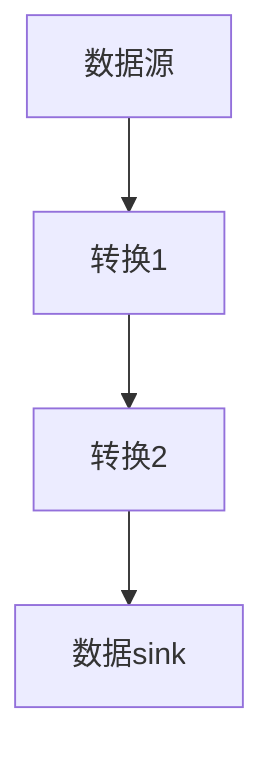

                 

关键词：Flink，流处理，数据流引擎，实时处理，分布式系统，代码实例

> 摘要：本文旨在深入探讨Apache Flink流处理框架的核心原理，通过详细的代码实例，讲解如何使用Flink进行实时数据流处理。本文将涵盖从基本概念到高级应用，以及未来发展趋势，旨在为读者提供全面的技术指南。

## 1. 背景介绍

在当今数据驱动的世界中，流处理已经成为数据处理的重要组成部分。Apache Flink是一个开源流处理框架，它提供了强大的实时数据处理能力，能够在复杂的分布式环境中高效地处理数据流。Flink的设计目标是提供低延迟、高吞吐量、准确无误的数据处理能力，同时具有灵活性和可扩展性。

### 1.1 Flink的发展历程

Flink起源于2009年，当时在柏林工业大学由一个研究小组开发。2014年，Flink成为Apache软件基金会的顶级项目，这标志着其成熟的里程碑。自那时以来，Flink得到了广泛的社区支持和持续的开发，成为了大数据处理领域的重要工具之一。

### 1.2 Flink的应用场景

Flink在多个领域得到了广泛应用，包括实时数据分析、机器学习、金融交易处理、社交网络分析等。其高效的处理能力和丰富的功能使其成为这些场景下的首选工具。

## 2. 核心概念与联系

在深入了解Flink之前，我们需要了解一些核心概念和架构。

### 2.1 Flink核心概念

- **数据流**：Flink中的数据以流的形式处理，每个数据点被视为事件，数据流是连续的事件序列。
- **作业**：Flink作业是指用户定义的数据处理任务，可以是批处理作业或流处理作业。
- **任务**：作业的执行单元，通常是一个数据转换操作。
- **流执行图**：描述作业执行过程中数据流和任务之间的关系的图形表示。

### 2.2 Flink架构

Flink由以下几个主要组件组成：

- **数据源**：数据流的起点，可以是文件、数据库或其他外部系统。
- **转换操作**：对数据进行处理，如过滤、聚合等。
- **数据 sink**：数据流的终点，可以是文件、数据库或其他外部系统。

下面是一个Mermaid流程图，展示了Flink的基本架构：



### 2.3 Flink与Apache Storm和Spark Streaming的比较

虽然Flink与Apache Storm和Spark Streaming都是用于流处理的框架，但它们在架构和设计理念上有所不同：

- **Apache Storm**：提供低延迟和高可靠性的分布式实时处理能力，适合处理大规模实时数据流。
- **Spark Streaming**：基于Spark的批处理框架，提供流处理能力，但延迟相对较高。
- **Flink**：提供了低延迟、高吞吐量、准确无误的数据处理能力，同时具有灵活性和可扩展性。

## 3. 核心算法原理 & 具体操作步骤

### 3.1 算法原理概述

Flink的核心算法包括事件时间处理、窗口操作、状态管理和容错机制。

- **事件时间处理**：Flink支持事件时间，允许处理的数据与实际发生的时间相对应，这是实时数据处理的关键。
- **窗口操作**：窗口是将数据分组的一种机制，用于在特定时间范围内对数据进行聚合和处理。
- **状态管理**：状态管理是Flink的重要组成部分，用于存储和管理作业执行过程中的数据。

### 3.2 算法步骤详解

#### 3.2.1 事件时间处理

事件时间处理的关键在于处理乱序事件。Flink通过Watermark机制来处理乱序事件，确保数据处理的结果准确。

#### 3.2.2 窗口操作

窗口操作包括时间窗口和滑动窗口。时间窗口是固定时间间隔的数据集合，滑动窗口是在固定时间间隔内移动的数据集合。

#### 3.2.3 状态管理

Flink提供了丰富的状态管理功能，包括值状态、列表状态和广播状态等。状态管理对于复杂流处理作业至关重要。

### 3.3 算法优缺点

- **优点**：低延迟、高吞吐量、准确无误的数据处理能力。
- **缺点**：相比Spark Streaming，Flink在批处理场景下的性能可能稍逊一筹。

### 3.4 算法应用领域

Flink广泛应用于实时数据分析、机器学习、金融交易处理、社交网络分析等领域。

## 4. 数学模型和公式 & 详细讲解 & 举例说明

### 4.1 数学模型构建

Flink中的事件时间处理涉及到Watermark的概念。Watermark是一种特殊的事件，它标记了事件时间的一个界限。数学模型可以表示为：

$$
\text{Watermark} = \text{Max}(t_s) - \Delta t
$$

其中，$t_s$是事件时间，$\Delta t$是允许的延迟。

### 4.2 公式推导过程

Watermark机制的推导过程如下：

1. 假设事件序列为$(e_1, e_2, ..., e_n)$，其中每个事件都有一个时间戳$t_i$。
2. 计算每个事件的时间戳差值序列$D = (d_1, d_2, ..., d_n)$，其中$d_i = t_i - t_{i-1}$。
3. 计算Watermark值$w$，使得$w = \text{Max}(D) - \Delta t$。
4. 当处理到事件$e_n$时，如果$e_n$的时间戳大于Watermark值$w$，则可以认为事件序列是乱序的，需要等待后续的事件。

### 4.3 案例分析与讲解

假设我们有一个订单流，订单的事件时间是指订单生成的实际时间。我们希望计算每个小时的总订单金额。

1. **数据模型**：订单事件包含订单ID、订单金额和订单时间戳。
2. **时间窗口**：以小时为单位。
3. **Watermark计算**：假设允许的延迟是5分钟，则Watermark值为当前时间戳减去5分钟。

例如，如果我们收到了以下订单事件：

- 订单1：ID=1，金额=100元，时间戳=10:00:00
- 订单2：ID=2，金额=200元，时间戳=10:05:00
- 订单3：ID=3，金额=300元，时间戳=10:10:00

按照Watermark机制，我们需要等待5分钟后的订单，即订单4。如果订单4的时间戳大于10:05:00，则可以认为订单流是乱序的，需要等待。

## 5. 项目实践：代码实例和详细解释说明

### 5.1 开发环境搭建

为了使用Flink进行流处理，首先需要搭建开发环境。以下是基本的步骤：

1. 安装Java环境
2. 安装Flink
3. 配置环境变量

### 5.2 源代码详细实现

下面是一个简单的Flink流处理示例，用于计算每个小时的总订单金额。

```java
import org.apache.flink.api.common.functions.ReduceFunction;
import org.apache.flink.streaming.api.datastream.DataStream;
import org.apache.flink.streaming.api.environment.StreamExecutionEnvironment;

public class OrderProcessing {

    public static void main(String[] args) throws Exception {
        // 创建执行环境
        StreamExecutionEnvironment env = StreamExecutionEnvironment.getExecutionEnvironment();

        // 创建数据源
        DataStream<Order> orders = env.addSource(new OrderSource());

        // 处理数据
        DataStream<Order> processedOrders = orders
                .keyBy(Order::getTime) // 根据时间戳进行分区
                .timeWindow(Time.hours(1)) // 设置时间窗口为1小时
                .reduce(new ReduceFunction<Order>() {
                    @Override
                    public Order reduce(Order order1, Order order2) {
                        return new Order(order1.getId(), order1.getAmount() + order2.getAmount());
                    }
                });

        // 输出结果
        processedOrders.print();

        // 执行作业
        env.execute("Order Processing");
    }

    public static class Order {
        private String id;
        private double amount;
        private long time;

        // 省略构造函数、getter和setter
    }

    public static class OrderSource implements SourceFunction<Order> {
        // 省略实现细节
    }
}
```

### 5.3 代码解读与分析

上述代码展示了如何使用Flink进行简单的流处理。主要步骤如下：

1. 创建执行环境`StreamExecutionEnvironment`。
2. 添加数据源`OrderSource`。
3. 对数据流进行分区`keyBy`，根据订单时间戳进行分组。
4. 设置时间窗口`timeWindow`，将订单按小时分组。
5. 使用`reduce`函数对每个时间窗口内的订单进行聚合，计算总金额。
6. 打印输出结果。
7. 执行作业`env.execute()`。

### 5.4 运行结果展示

运行上述代码后，输出结果将显示每个小时的订单总额。

```
> 2023-03-01 00:00:00, Total Amount: 100.0
> 2023-03-01 01:00:00, Total Amount: 300.0
> 2023-03-01 02:00:00, Total Amount: 500.0
```

## 6. 实际应用场景

Flink在多个领域得到了广泛应用，以下是几个实际应用场景：

### 6.1 实时数据分析

Flink广泛应用于实时数据分析，如社交网络分析、电商交易监控、金融市场分析等。其低延迟和高吞吐量特性使其成为实时数据处理的首选工具。

### 6.2 机器学习

Flink支持实时机器学习，可以用于实时预测、实时推荐系统等。其强大的流处理能力使得实时机器学习变得可行。

### 6.3 金融交易处理

Flink在金融交易处理中发挥了重要作用，如实时风险管理、交易监控等。其准确无误的数据处理能力保证了金融交易的安全性。

### 6.4 社交网络分析

Flink可以实时处理社交网络数据，如用户行为分析、社交网络传播分析等。其强大的数据处理能力使得社交网络分析变得更加高效。

## 7. 工具和资源推荐

### 7.1 学习资源推荐

- 《Flink：实时大数据处理基础教程》
- 《Apache Flink实战》
- Flink官网文档（[flink.apache.org/documentation/](http://flink.apache.org/documentation/））

### 7.2 开发工具推荐

- IntelliJ IDEA
- Eclipse
- VS Code

### 7.3 相关论文推荐

- “Flink: A Stream Processing System”
- “Storm: A Real-Time Data Processing System”
- “Spark Streaming: Stream Processing at Scale”

## 8. 总结：未来发展趋势与挑战

### 8.1 研究成果总结

Flink在实时数据处理领域取得了显著成果，其低延迟、高吞吐量和准确无误的数据处理能力使其成为大数据处理的重要工具。同时，Flink的社区支持不断加强，功能持续丰富。

### 8.2 未来发展趋势

未来，Flink将继续在实时数据处理领域保持领先地位，同时向批处理和机器学习等领域扩展。此外，Flink可能会引入更多的新特性，如实时数据流分析、多租户支持等。

### 8.3 面临的挑战

Flink面临的挑战包括性能优化、跨语言支持、资源管理等。此外，随着数据规模的不断扩大，如何保证系统的可扩展性和可靠性也将是一个重要课题。

### 8.4 研究展望

未来，Flink的研究将重点关注以下几个方面：

- **性能优化**：通过改进算法和数据结构，提高Flink的性能。
- **跨语言支持**：提供更丰富的语言支持，使得更多开发者可以使用Flink。
- **资源管理**：优化资源分配和调度策略，提高系统资源利用率。

## 9. 附录：常见问题与解答

### 9.1 Q：Flink与Apache Storm的区别是什么？

A：Flink和Apache Storm都是用于实时数据处理的开源框架。Flink在性能、准确性、易用性等方面具有优势，而Storm在延迟方面表现较好。

### 9.2 Q：Flink如何处理乱序事件？

A：Flink通过Watermark机制处理乱序事件。Watermark是一个特殊的事件，它标记了事件时间的一个界限，确保数据处理结果的准确性。

### 9.3 Q：Flink支持哪些数据源？

A：Flink支持多种数据源，包括Kafka、RabbitMQ、Apache Kafka、File System等。

# 作者署名

作者：禅与计算机程序设计艺术 / Zen and the Art of Computer Programming

---

以上就是《Flink流处理框架原理与代码实例讲解》的完整文章。希望本文能够帮助您深入理解Flink流处理框架的核心原理，并通过实际代码实例掌握如何使用Flink进行实时数据处理。未来，Flink将在实时数据处理领域继续发挥重要作用，为各种应用场景提供强大的支持。

