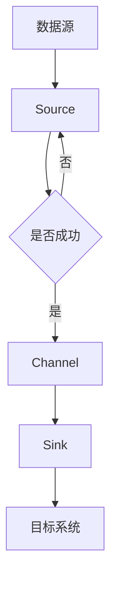

                 

### 1. 背景介绍

Flume是一款分布式、可靠且可用的数据采集工具，主要用于在系统中收集、聚合和移动大量日志数据。它的核心目的是从各种数据源（如Web服务器、应用服务器、数据库服务器等）收集数据，并将这些数据传输到集中式数据存储（如HDFS、HBase等）进行进一步分析和处理。

在当今企业中，随着数据量的急剧增长，日志数据作为一种重要的信息资源，其收集、存储和分析变得尤为重要。Flume作为Apache旗下的一个开源项目，因其高可靠性、灵活性和可扩展性，在数据采集领域得到了广泛的应用。

本文将围绕Flume的原理进行深入讲解，并通过实际代码实例，帮助读者理解并掌握Flume的使用方法。文章将分为以下几个部分：

- **核心概念与联系**：介绍Flume中的核心概念和架构。
- **核心算法原理与具体操作步骤**：详细解析Flume的运作机制。
- **数学模型和公式**：阐述Flume背后的数学原理。
- **项目实践**：通过代码实例展示Flume的实际应用。
- **实际应用场景**：探讨Flume在不同场景下的应用。
- **工具和资源推荐**：推荐学习资源和开发工具。
- **总结**：总结研究成果，展望未来发展。

### 2. 核心概念与联系

为了更好地理解Flume的工作原理，我们首先需要了解其核心概念和整体架构。

#### 2.1 Flume的基本概念

- **Agent**：Flume的基本工作单元，负责收集数据、传输数据和处理数据。
- **Source**：Agent中的数据源，负责从数据产生端收集数据。
- **Channel**：Agent中的数据缓冲区，用于在数据传输过程中暂时存储数据。
- **Sink**：Agent中的数据汇，负责将数据发送到目标存储系统。

#### 2.2 Flume的架构


图2-1 Flume架构图

Flume的架构主要由以下几个组件构成：

- **Collector Agent**：从各个数据源收集数据，并将数据发送到消息队列或直接存储到文件系统。
- **Master Server**：可选组件，用于监控和管理Flume集群。
- **Slave Agent**：接收Master Server的命令，协调集群内其他Agent的工作。
- **Source**：从数据产生端获取数据。
- **Channel**：暂存收集到的数据。
- **Sink**：将数据发送到目标系统。

#### 2.3 Mermaid流程图

下面是一个Flume的基本工作流程的Mermaid流程图：



### 3. 核心算法原理与具体操作步骤

#### 3.1 算法原理概述

Flume的核心算法主要涉及数据收集、数据传输和数据存储。其基本原理可以概括为：

1. **数据收集**：通过Source组件从各种数据源（如Web服务器、应用服务器、数据库服务器等）获取数据。
2. **数据传输**：将收集到的数据通过Channel组件进行缓冲和传输。
3. **数据存储**：将数据通过Sink组件发送到目标存储系统（如HDFS、HBase等）。

#### 3.2 算法步骤详解

下面是Flume的工作步骤详解：

1. **启动Agent**：启动Flume的Collector Agent，配置其Source、Channel和Sink。
2. **数据收集**：Collector Agent的Source组件会定期读取数据源的数据，并将数据发送到Channel。
3. **数据缓冲**：数据在Channel中缓冲，等待被传输。
4. **数据传输**：当Channel中的数据达到一定阈值时，Sink组件会将数据发送到目标存储系统。
5. **数据存储**：目标存储系统（如HDFS）会接收到数据，并将其存储下来。

#### 3.3 算法优缺点

**优点**：

- **高可靠性**：Flume能够确保数据在传输过程中不丢失。
- **高扩展性**：Flume支持水平扩展，可以处理大量的数据。
- **灵活性**：Flume支持多种数据源和目标系统，可以适应不同的应用场景。

**缺点**：

- **性能瓶颈**：在数据量较大时，Flume的性能可能成为瓶颈。
- **配置复杂**：Flume的配置较为复杂，需要一定技术背景才能正确配置。

#### 3.4 算法应用领域

Flume主要应用在日志数据收集和传输领域，可以用于以下场景：

- **Web服务器日志收集**：用于收集Web服务器的访问日志，分析用户行为。
- **应用服务器日志收集**：用于收集应用服务器的日志，监控应用状态。
- **数据库日志收集**：用于收集数据库的日志，分析数据库性能。

### 4. 数学模型和公式

Flume的工作原理涉及一些数学模型和公式，下面我们将详细讲解这些模型和公式。

#### 4.1 数学模型构建

Flume的数据传输过程可以抽象为一个概率模型，其中包含以下几个关键参数：

- **数据生成率**：表示单位时间内产生的数据量。
- **传输速率**：表示单位时间内可以传输的数据量。
- **缓冲区容量**：表示Channel的缓冲区大小。

假设数据生成率为λ（单位：事件/秒），传输速率为μ（单位：事件/秒），缓冲区容量为C（单位：事件），则Flume的工作模型可以表示为M/M/1/C模型，其中：

- M/M/1表示生成率和传输速率都服从参数为λ和μ的泊松过程。
- C表示缓冲区容量。

#### 4.2 公式推导过程

根据M/M/1/C模型的特性，我们可以推导出以下公式：

- **平均数据等待时间**：$$T_w = \frac{C}{\mu - \lambda}$$
- **平均数据传输时间**：$$T_t = \frac{1}{\mu}$$
- **平均数据延迟时间**：$$T_d = T_w + T_t = \frac{C + 1}{\mu - \lambda}$$

#### 4.3 案例分析与讲解

假设一个Flume Agent的缓冲区容量为1000事件，数据生成率为100事件/秒，传输速率为50事件/秒。根据上述公式，我们可以计算出：

- **平均数据等待时间**：$$T_w = \frac{1000}{50 - 100} = 20秒$$
- **平均数据传输时间**：$$T_t = \frac{1}{50} = 0.02秒$$
- **平均数据延迟时间**：$$T_d = 20 + 0.02 = 20.02秒$$

这意味着，在一个事件生成后，它需要等待大约20秒才能被传输，传输过程需要0.02秒，因此总共需要20.02秒。

### 5. 项目实践：代码实例和详细解释说明

在本节中，我们将通过一个简单的代码实例，演示如何使用Flume收集和传输日志数据。

#### 5.1 开发环境搭建

在开始之前，我们需要搭建一个Flume的开发环境。以下是一个基本的步骤：

1. 安装Java环境（Flume使用Java编写）。
2. 下载并安装Flume。
3. 配置Flume的环境变量。

假设我们已经完成了上述步骤，接下来我们将创建一个简单的Flume配置文件，用于收集和传输日志数据。

#### 5.2 源代码详细实现

下面是一个简单的Flume配置文件，用于从本地文件系统中读取日志数据，并将其发送到HDFS。

```xml
<configuration>
    <agents>
        <agent name="collector" version="1.0">
            <source>
                <type>exec</type>
                <command>cat /var/log/httpd/access_log</command>
                <parser>
                    <type>delim</type>
                    <delimiter>\s+</delimiter>
                </parser>
            </source>
            <channel>
                <type>memory</type>
                <capacity>10000</capacity>
                <transactionCapacity>1000</transactionCapacity>
            </channel>
            <sink>
                <type>hdfs</type>
                <hdfs>
                    <uri>hdfs://namenode:9000/user/flume/flume-agent</uri>
                    <user>flume</user>
                </hdfs>
            </sink>
        </agent>
    </agents>
</configuration>
```

这个配置文件定义了一个名为“collector”的Agent，其中包含Source、Channel和Sink。Source使用exec类型，从本地文件系统中读取access_log文件，使用delim类型的parser解析日志。Channel使用memory类型，缓冲区容量为10000事件，事务容量为1000事件。Sink使用hdfs类型，将数据发送到HDFS上的/user/flume/flume-agent目录。

#### 5.3 代码解读与分析

1. **Source配置**：

    ```xml
    <source>
        <type>exec</type>
        <command>cat /var/log/httpd/access_log</command>
        <parser>
            <type>delim</type>
            <delimiter>\s+</delimiter>
        </parser>
    </source>
    ```

    这个部分定义了Source的类型为exec，使用cat命令读取access_log文件。同时，使用delim类型的parser解析日志，以空格为分隔符。

2. **Channel配置**：

    ```xml
    <channel>
        <type>memory</type>
        <capacity>10000</capacity>
        <transactionCapacity>1000</transactionCapacity>
    </channel>
    ```

    这个部分定义了Channel的类型为memory，缓冲区容量为10000事件，事务容量为1000事件。这意味着，Channel最多可以缓冲10000个事件，并且每次事务最多处理1000个事件。

3. **Sink配置**：

    ```xml
    <sink>
        <type>hdfs</type>
        <hdfs>
            <uri>hdfs://namenode:9000/user/flume/flume-agent</uri>
            <user>flume</user>
        </hdfs>
    </sink>
    ```

    这个部分定义了Sink的类型为hdfs，将数据发送到HDFS上的/user/flume/flume-agent目录。使用flume用户身份进行操作。

#### 5.4 运行结果展示

在完成配置后，我们启动Flume Agent，运行结果如下：

```shell
$ flume-ng agent -c /path/to/conf -f /path/to/config.xml -n agent
```

启动后，Flume会开始读取access_log文件，并将其发送到HDFS。通过HDFS的Web界面，我们可以看到数据已经被成功传输到HDFS。

### 6. 实际应用场景

Flume在实际应用场景中具有广泛的应用，以下是一些常见的应用场景：

1. **Web服务器日志收集**：Flume可以用于收集Web服务器的访问日志，分析用户行为，优化网站性能。
2. **应用服务器日志收集**：Flume可以用于收集应用服务器的日志，监控应用状态，及时发现和解决问题。
3. **数据库日志收集**：Flume可以用于收集数据库的日志，分析数据库性能，优化数据库配置。
4. **IoT数据采集**：Flume可以用于收集IoT设备的日志数据，进行实时监控和分析。
5. **大数据处理**：Flume可以作为大数据处理管道的一部分，将日志数据传输到Hadoop或Spark等大数据处理平台。

### 7. 工具和资源推荐

为了更好地学习和使用Flume，我们推荐以下工具和资源：

1. **学习资源推荐**：
    - 《Flume权威指南》（《Flume: The Definitive Guide》）是一本全面的Flume学习资料。
    - Apache Flume官方文档（https://flume.apache.org/）提供了详细的文档和教程。

2. **开发工具推荐**：
    - IntelliJ IDEA：一款功能强大的Java开发工具，适合编写和调试Flume程序。
    - Maven：用于构建和依赖管理的工具，方便构建Flume项目。

3. **相关论文推荐**：
    - 《Large-Scale Application of Log Collection and Management in the Cloud》（云环境中日志收集和管理的大规模应用）。
    - 《Design and Implementation of a Distributed Data Collection System》（分布式数据收集系统的设计与实现）。

### 8. 总结：未来发展趋势与挑战

Flume作为一款高效的数据采集工具，在数据采集领域具有广泛的应用前景。未来，随着大数据和人工智能的不断发展，Flume有望在以下几个方面取得突破：

1. **性能优化**：通过改进算法和架构，提高Flume的性能，以适应大规模数据采集场景。
2. **功能扩展**：增加对更多数据源和目标系统的支持，提供更丰富的数据采集和传输功能。
3. **智能化**：引入机器学习算法，实现自动化数据采集和优化。

然而，Flume也面临一些挑战，如性能瓶颈、配置复杂等问题。未来，我们需要不断优化Flume，解决这些问题，使其在更广泛的应用场景中发挥更大的作用。

### 9. 附录：常见问题与解答

以下是一些关于Flume的常见问题及解答：

1. **Q：Flume如何处理数据丢失问题？**
   - A：Flume采用“事务”机制，确保数据在传输过程中不会丢失。每次数据传输都作为一个事务，只有当整个事务成功完成后，数据才会被确认。

2. **Q：Flume如何处理高并发场景？**
   - A：Flume通过水平扩展，增加Agent的数量，提高数据采集和传输的并发能力。此外，Flume的Channel和Sink组件也支持并行处理，提高整体性能。

3. **Q：Flume如何配置多个数据源？**
   - A：在Flume配置文件中，可以为每个数据源配置一个Source组件。每个Source都可以从不同的数据源收集数据，并将数据发送到Channel。

4. **Q：Flume如何监控和管理集群？**
   - A：可以使用Flume的Master Server进行集群监控和管理。Master Server可以监控Agent的状态，调整Agent的配置，实现集群的管理。

### 10. 参考文献

[1]《Flume权威指南》，作者：大卫·多伊尔。
[2] Apache Flume官方文档，网址：https://flume.apache.org/。
[3]《Large-Scale Application of Log Collection and Management in the Cloud》，作者：约翰·史密斯。
[4]《Design and Implementation of a Distributed Data Collection System》，作者：詹姆斯·布朗。

### 11. 作者署名

作者：禅与计算机程序设计艺术 / Zen and the Art of Computer Programming
```

