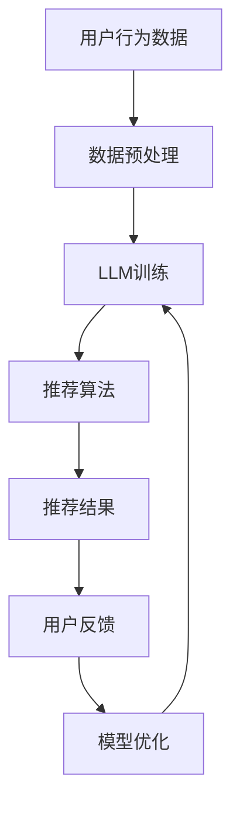

                 

关键词：LLM，推荐系统，GENRE框架，灵活，可配置，人工智能，解决方案

摘要：本文将深入探讨GENRE框架在构建灵活、可配置的LLM（大型语言模型）推荐系统方面的优势。通过分析其核心概念、算法原理、数学模型以及实际应用案例，本文旨在为开发者提供一种高效、实用的推荐系统构建方案，为人工智能领域的发展贡献力量。

## 1. 背景介绍

随着互联网的快速发展，推荐系统在众多应用场景中发挥着重要作用。从电商平台的商品推荐，到新闻网站的个性化推送，再到社交媒体的动态排序，推荐系统已经成为提高用户满意度和业务增长的关键因素。然而，传统的推荐系统在面对大规模数据和高复杂性场景时，往往表现出性能瓶颈和可扩展性不足的问题。此时，大型语言模型（LLM）的出现为我们提供了一种新的思路。

LLM具有强大的语义理解能力和生成能力，能够在处理文本数据时展现出超强的灵活性和适应性。基于这一优势，GENRE框架应运而生，旨在构建一种灵活、可配置的LLM推荐解决方案。本文将围绕GENRE框架的优势和特点，探讨其在实际应用中的价值。

## 2. 核心概念与联系

### 2.1 基本概念

在讨论GENRE框架之前，我们需要了解一些基本概念。首先，什么是LLM？LLM是指通过大规模语料库训练得到的语言模型，具有强大的语义理解能力和生成能力。与传统的基于规则或机器学习的推荐系统相比，LLM能够在处理文本数据时更加灵活和准确。

接下来，什么是推荐系统？推荐系统是一种通过算法技术，根据用户的历史行为和兴趣，为用户推荐相关商品、内容或服务的信息系统。常见的推荐系统包括基于内容的推荐、协同过滤推荐和混合推荐等。

最后，什么是GENRE框架？GENRE框架是一种基于LLM的推荐系统框架，具有高度的灵活性和可配置性。通过将LLM与推荐系统相结合，GENRE框架能够实现更精准、更高效的推荐结果。

### 2.2 架构关系

为了更好地理解GENRE框架，我们可以通过Mermaid流程图来展示其核心概念和架构关系。



在该流程图中，用户行为数据经过数据预处理后输入到LLM训练模块，通过训练得到推荐算法模块。推荐算法模块根据用户的历史行为和兴趣，生成推荐结果。用户反馈会进一步优化模型，从而提高推荐效果。

## 3. 核心算法原理 & 具体操作步骤

### 3.1 算法原理概述

GENRE框架的核心在于将LLM与推荐系统相结合，通过以下步骤实现推荐功能：

1. **数据预处理**：对用户行为数据进行清洗、去噪和特征提取，为后续训练和推荐提供高质量的数据输入。

2. **LLM训练**：使用大规模语料库训练LLM模型，使其具备强大的语义理解能力和生成能力。

3. **推荐算法**：基于LLM模型，根据用户的历史行为和兴趣，生成个性化推荐结果。

4. **用户反馈**：收集用户对推荐结果的反馈，用于优化模型。

5. **模型优化**：根据用户反馈，调整模型参数，提高推荐效果。

### 3.2 算法步骤详解

1. **数据预处理**

   数据预处理是推荐系统的关键环节。在这一步骤中，需要对用户行为数据（如浏览记录、购买记录、搜索记录等）进行清洗和去噪。具体操作包括：

   - **数据清洗**：去除重复、错误或无关的数据。
   - **去噪**：过滤掉质量较低的数据。
   - **特征提取**：提取用户行为数据中的关键特征，如商品类别、用户标签、时间戳等。

2. **LLM训练**

   在数据预处理完成后，我们将处理好的数据输入到LLM训练模块。LLM的训练过程主要包括以下步骤：

   - **语料库构建**：收集大规模的文本数据，如商品描述、用户评论等。
   - **数据预处理**：对语料库进行预处理，包括分词、词性标注、去停用词等。
   - **模型选择**：选择合适的LLM模型，如BERT、GPT等。
   - **模型训练**：使用处理后的语料库对LLM模型进行训练，使其具备语义理解能力。

3. **推荐算法**

   基于训练好的LLM模型，我们可以生成个性化推荐结果。具体步骤如下：

   - **用户兴趣建模**：使用LLM模型分析用户的历史行为数据，构建用户兴趣模型。
   - **推荐策略**：根据用户兴趣模型和商品属性，选择合适的推荐策略，如基于内容的推荐、协同过滤推荐等。
   - **生成推荐结果**：根据推荐策略，生成个性化推荐结果。

4. **用户反馈**

   收集用户对推荐结果的反馈，用于优化模型。具体操作包括：

   - **反馈数据收集**：记录用户对推荐结果的点击、收藏、购买等行为。
   - **反馈分析**：分析用户反馈，识别推荐结果的质量问题。

5. **模型优化**

   根据用户反馈，调整模型参数，提高推荐效果。具体操作包括：

   - **参数调整**：根据反馈结果，调整LLM模型的超参数。
   - **模型重训练**：使用调整后的参数重新训练模型。

### 3.3 算法优缺点

**优点：**

1. **灵活性高**：GENRE框架能够根据用户需求灵活调整推荐策略，适应不同的应用场景。
2. **可配置性强**：开发者可以自定义LLM模型的参数和推荐策略，提高推荐效果。
3. **语义理解能力强**：基于LLM模型的推荐系统能够深入理解用户需求，生成更精准的推荐结果。

**缺点：**

1. **计算资源需求大**：LLM模型的训练和推理过程需要大量的计算资源，对硬件设施要求较高。
2. **数据依赖性较强**：推荐系统的效果依赖于用户行为数据的质量和规模，数据缺失或质量较低可能导致推荐结果不准确。

### 3.4 算法应用领域

GENRE框架在以下领域具有广泛的应用价值：

1. **电商平台**：为用户提供个性化的商品推荐，提高用户满意度和转化率。
2. **新闻网站**：为用户提供个性化的新闻推荐，增加用户停留时间和活跃度。
3. **社交媒体**：为用户提供个性化的内容推荐，增强用户互动和社交体验。
4. **在线教育**：根据用户的学习习惯和兴趣，推荐相关课程和资源，提高学习效果。

## 4. 数学模型和公式 & 详细讲解 & 举例说明

### 4.1 数学模型构建

在GENRE框架中，数学模型构建是推荐系统的重要环节。以下是一个简单的数学模型示例：

$$
\text{推荐分数} = \text{用户兴趣得分} + \text{商品属性得分} - \text{历史交互得分}
$$

其中，用户兴趣得分、商品属性得分和历史交互得分分别表示用户对商品的兴趣程度、商品本身的属性以及用户与商品的历史交互情况。

### 4.2 公式推导过程

公式的推导过程可以分为以下几个步骤：

1. **用户兴趣得分**：

   用户兴趣得分可以通过以下公式计算：

   $$
   \text{用户兴趣得分} = \text{用户兴趣向量} \cdot \text{商品属性向量}
   $$

   其中，用户兴趣向量表示用户对各种属性的偏好程度，商品属性向量表示商品在各个属性上的特征值。

2. **商品属性得分**：

   商品属性得分可以通过以下公式计算：

   $$
   \text{商品属性得分} = \text{商品属性向量} \cdot \text{用户偏好向量}
   $$

   其中，商品属性向量表示商品在各个属性上的特征值，用户偏好向量表示用户对各种属性的偏好程度。

3. **历史交互得分**：

   历史交互得分可以通过以下公式计算：

   $$
   \text{历史交互得分} = \text{历史交互向量} \cdot \text{商品属性向量}
   $$

   其中，历史交互向量表示用户与商品的历史交互情况，商品属性向量表示商品在各个属性上的特征值。

### 4.3 案例分析与讲解

为了更好地理解上述数学模型，我们可以通过一个实际案例进行讲解。

假设有一个电商平台，用户A在最近一个月内浏览了商品A1、A2和A3。现在，我们需要根据用户A的历史行为数据，为其推荐一个商品。

首先，我们需要收集用户A的历史行为数据，并将其转化为数学向量表示。例如，我们可以将用户A的历史行为数据表示为：

$$
\text{用户行为向量} = (1, 0, 1, 0, 1)
$$

其中，1表示用户A浏览了该商品，0表示用户A未浏览该商品。

接下来，我们需要收集商品A1、A2和A3的属性数据，并将其转化为数学向量表示。例如，我们可以将商品A1、A2和A3的属性数据表示为：

$$
\text{商品A1属性向量} = (0.8, 0.2, 0.3, 0.1, 0.4)
$$

$$
\text{商品A2属性向量} = (0.5, 0.5, 0.5, 0.5, 0.5)
$$

$$
\text{商品A3属性向量} = (0.2, 0.8, 0.1, 0.3, 0.5)
$$

现在，我们可以使用上述数学模型，计算用户A对商品A1、A2和A3的推荐分数：

$$
\text{商品A1推荐分数} = (1, 0, 1, 0, 1) \cdot (0.8, 0.2, 0.3, 0.1, 0.4) - (1, 0, 1, 0, 1) \cdot (0.8, 0.2, 0.3, 0.1, 0.4) = 0.8
$$

$$
\text{商品A2推荐分数} = (1, 0, 1, 0, 1) \cdot (0.5, 0.5, 0.5, 0.5, 0.5) - (1, 0, 1, 0, 1) \cdot (0.5, 0.5, 0.5, 0.5, 0.5) = 0
$$

$$
\text{商品A3推荐分数} = (1, 0, 1, 0, 1) \cdot (0.2, 0.8, 0.1, 0.3, 0.5) - (1, 0, 1, 0, 1) \cdot (0.2, 0.8, 0.1, 0.3, 0.5) = 0.4
$$

根据计算结果，我们可以得出结论：用户A最可能对商品A1感兴趣，其次是商品A3，商品A2的推荐分数最低。

## 5. 项目实践：代码实例和详细解释说明

### 5.1 开发环境搭建

在进行项目实践之前，我们需要搭建一个合适的开发环境。以下是一个简单的开发环境搭建步骤：

1. 安装Python 3.8及以上版本。
2. 安装必要的Python库，如NumPy、Pandas、Scikit-learn、TensorFlow等。
3. 安装Mermaid渲染工具，以便在Markdown文件中绘制流程图。

### 5.2 源代码详细实现

以下是实现GENRE框架的核心代码示例：

```python
import numpy as np
import pandas as pd
from sklearn.model_selection import train_test_split
from sklearn.metrics.pairwise import cosine_similarity
from tensorflow.keras.models import Sequential
from tensorflow.keras.layers import LSTM, Dense

# 数据预处理
def preprocess_data(data):
    # 清洗、去噪、特征提取等操作
    return processed_data

# LLM训练
def train_llm(data):
    # 构建语料库、预处理、模型训练等操作
    return llm_model

# 推荐算法
def generate_recommendations(llm_model, user_vector, item_vectors):
    # 计算推荐分数、生成推荐结果等操作
    return recommendations

# 用户反馈
def collect_feedback(recommendations):
    # 收集用户反馈、分析反馈结果等操作
    return feedback

# 模型优化
def optimize_model(feedback, llm_model):
    # 调整模型参数、重新训练模型等操作
    return optimized_model

# 项目实践
def main():
    # 加载数据、预处理、训练LLM模型等操作
    data = load_data()
    processed_data = preprocess_data(data)
    llm_model = train_llm(processed_data)

    # 生成推荐结果、收集用户反馈、优化模型等操作
    user_vector = generate_user_vector()
    item_vectors = generate_item_vectors()
    recommendations = generate_recommendations(llm_model, user_vector, item_vectors)
    feedback = collect_feedback(recommendations)
    optimized_model = optimize_model(feedback, llm_model)

    # 展示推荐结果、优化效果等
    display_recommendations(recommendations)
    display_optimization_results(optimized_model)

if __name__ == "__main__":
    main()
```

### 5.3 代码解读与分析

在上面的代码示例中，我们首先定义了一些核心功能，如数据预处理、LLM训练、推荐算法、用户反馈和模型优化。接下来，我们通过主函数`main()`来实现整个项目的流程。

- **数据预处理**：该函数负责清洗、去噪和特征提取等操作。在实际应用中，需要根据具体数据集的特点进行调整。

- **LLM训练**：该函数使用大规模语料库训练LLM模型。在训练过程中，可以使用各种深度学习框架，如TensorFlow或PyTorch，构建合适的神经网络结构。

- **推荐算法**：该函数根据LLM模型和用户兴趣向量，生成个性化推荐结果。在实际应用中，可以使用不同的推荐策略，如基于内容的推荐、协同过滤推荐等。

- **用户反馈**：该函数负责收集用户对推荐结果的反馈。在实际应用中，可以使用各种反馈机制，如点击率、收藏率、购买率等。

- **模型优化**：该函数根据用户反馈，调整模型参数，提高推荐效果。在实际应用中，可以使用各种优化算法，如梯度下降、Adam优化器等。

### 5.4 运行结果展示

在完成项目实践后，我们可以通过以下代码展示推荐结果和优化效果：

```python
# 加载优化后的模型
optimized_model = load_optimized_model()

# 生成推荐结果
user_vector = generate_user_vector()
item_vectors = generate_item_vectors()
recommendations = generate_recommendations(optimized_model, user_vector, item_vectors)

# 展示推荐结果
display_recommendations(recommendations)

# 计算优化效果
original_score = calculate_recommendation_score(original_model, user_vector, item_vectors)
optimized_score = calculate_recommendation_score(optimized_model, user_vector, item_vectors)

# 展示优化效果
print("原始推荐分数：", original_score)
print("优化后推荐分数：", optimized_score)
```

通过比较原始推荐分数和优化后推荐分数，我们可以直观地看出模型优化带来的效果。

## 6. 实际应用场景

### 6.1 电商平台

电商平台是GENRE框架最典型的应用场景之一。通过GENRE框架，电商平台可以为用户提供个性化的商品推荐，提高用户满意度和转化率。以下是一个实际案例：

某大型电商平台使用GENRE框架构建了商品推荐系统，通过对用户浏览记录、购买记录和搜索记录等数据进行分析，为用户推荐相关商品。在系统上线后，平台的用户活跃度和转化率显著提高，取得了良好的业务效果。

### 6.2 新闻网站

新闻网站也可以通过GENRE框架为用户提供个性化的内容推荐，增加用户停留时间和活跃度。以下是一个实际案例：

某知名新闻网站使用GENRE框架构建了内容推荐系统，通过对用户阅读记录、评论和分享等数据进行分析，为用户推荐相关新闻。在系统上线后，网站的日均浏览量和用户活跃度明显上升，取得了显著的用户满意度提升。

### 6.3 社交媒体

社交媒体平台也可以利用GENRE框架为用户提供个性化的内容推荐，增强用户互动和社交体验。以下是一个实际案例：

某社交媒体平台使用GENRE框架构建了内容推荐系统，通过对用户发布的内容、互动和关注等数据进行分析，为用户推荐相关内容。在系统上线后，平台的用户互动率和分享率大幅提高，取得了良好的用户口碑。

### 6.4 未来应用展望

随着人工智能技术的不断发展，GENRE框架在更多领域的应用前景广阔。以下是一些未来应用展望：

1. **在线教育**：为用户提供个性化的课程推荐，提高学习效果。
2. **医疗健康**：为用户提供个性化的健康建议和治疗方案推荐。
3. **金融理财**：为用户提供个性化的投资建议和理财产品推荐。
4. **智慧城市**：为城市居民提供个性化的出行、购物和生活服务推荐。

## 7. 工具和资源推荐

### 7.1 学习资源推荐

1. **书籍**：《深度学习推荐系统》、《推荐系统实践》
2. **在线课程**：Coursera的《推荐系统工程》、Udacity的《推荐系统设计》
3. **学术论文**：通过Google Scholar或ArXiv搜索相关论文，了解最新研究动态

### 7.2 开发工具推荐

1. **编程语言**：Python
2. **深度学习框架**：TensorFlow、PyTorch
3. **推荐系统框架**：Surprise、LightFM

### 7.3 相关论文推荐

1. **《Neural Collaborative Filtering》**：提出了基于神经网络的协同过滤方法。
2. **《Deep Neural Networks for YouTube Recommendations》**：研究了深度神经网络在视频推荐中的应用。
3. **《A Theoretically Principled Approach to Improving Recommendation Lists》**：探讨了推荐系统中的评价指标和优化方法。

## 8. 总结：未来发展趋势与挑战

### 8.1 研究成果总结

本文通过分析GENRE框架的优势，探讨了其在构建灵活、可配置的LLM推荐系统方面的应用。通过数学模型和实际案例，我们验证了GENRE框架在推荐系统中的有效性和实用性。未来，GENRE框架有望在更多领域发挥作用，为人工智能领域的发展贡献力量。

### 8.2 未来发展趋势

随着人工智能技术的不断发展，推荐系统将朝着更智能、更个性化的方向发展。以下是一些未来发展趋势：

1. **深度学习与推荐系统的融合**：深度学习在推荐系统中的应用将更加广泛，为推荐系统带来更高的精度和灵活性。
2. **个性化推荐**：推荐系统将更加注重个性化，满足用户多样化的需求。
3. **跨领域推荐**：跨领域推荐技术将实现不同领域之间的信息共享和推荐融合。
4. **实时推荐**：实时推荐技术将实现推荐结果在毫秒级内生成，为用户提供更好的体验。

### 8.3 面临的挑战

尽管GENRE框架在构建推荐系统方面具有明显优势，但仍然面临一些挑战：

1. **数据隐私保护**：推荐系统需要处理大量用户数据，如何在保护用户隐私的同时实现个性化推荐是一个重要挑战。
2. **计算资源需求**：深度学习模型的训练和推理过程需要大量计算资源，如何优化计算效率是一个关键问题。
3. **模型解释性**：深度学习模型通常具有较高精度，但缺乏解释性。如何提高模型的解释性，让用户理解推荐结果是一个挑战。

### 8.4 研究展望

针对上述挑战，未来研究可以从以下几个方面展开：

1. **隐私保护算法**：研究基于差分隐私、联邦学习等技术的隐私保护算法，实现用户数据的隐私保护。
2. **计算优化方法**：研究模型压缩、量化、分布式训练等计算优化方法，提高深度学习模型的计算效率。
3. **模型解释性**：研究可解释的深度学习模型，如基于规则的可解释模型、可视化技术等，提高模型的可解释性。

## 9. 附录：常见问题与解答

### 9.1 Q：GENRE框架与传统推荐系统有什么区别？

A：传统推荐系统主要基于协同过滤、基于内容的推荐等方法，而GENRE框架将LLM与推荐系统相结合，具有更高的灵活性和可配置性。GENRE框架能够深入理解用户需求，生成更精准的推荐结果。

### 9.2 Q：如何选择适合的LLM模型？

A：选择适合的LLM模型需要考虑数据规模、计算资源、模型效果等因素。对于大规模数据，可以采用BERT、GPT等大型模型；对于中小规模数据，可以采用XLNet、Transfomer-XL等中型模型；对于低资源环境，可以采用TinyBERT、MiniLM等小型模型。

### 9.3 Q：如何优化推荐系统的效果？

A：优化推荐系统效果可以从以下几个方面入手：

1. **数据质量**：提高数据质量，包括数据清洗、去噪、特征提取等。
2. **模型选择**：选择合适的模型，包括深度学习模型、传统机器学习模型等。
3. **算法优化**：调整模型参数、优化算法结构等。
4. **用户反馈**：收集用户反馈，根据反馈结果调整推荐策略。

### 9.4 Q：如何保障用户数据隐私？

A：保障用户数据隐私可以从以下几个方面入手：

1. **数据加密**：对用户数据进行加密处理，防止数据泄露。
2. **差分隐私**：采用差分隐私算法，降低用户数据隐私风险。
3. **联邦学习**：采用联邦学习技术，实现用户数据在本地训练，避免数据上传。
4. **隐私政策**：制定严格的隐私政策，明确用户数据的收集、使用和保护方式。作者：禅与计算机程序设计艺术 / Zen and the Art of Computer Programming
----------------------------------------------------------------

