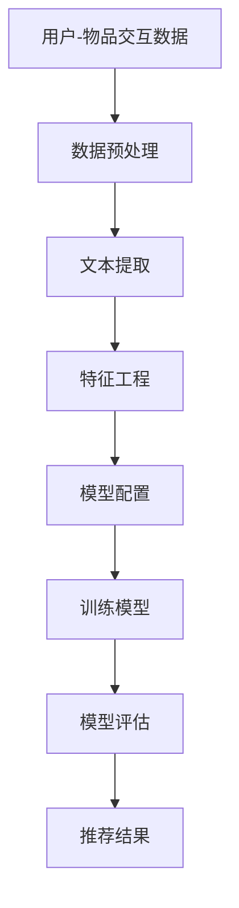

                 

关键词：GENRE框架，语言模型，推荐系统，人工智能，机器学习，深度学习，代码实例，应用场景，数学模型，未来展望

> 摘要：本文将深入探讨一种名为GENRE的框架，它是一种灵活且可配置的推荐系统，特别适用于基于大型语言模型（LLM）的场景。本文将介绍GENRE框架的核心概念、设计原理、算法实现以及实际应用，同时探讨其在未来人工智能领域中的潜在发展趋势和面临的挑战。

## 1. 背景介绍

随着互联网的迅猛发展，个性化推荐系统已经成为现代信息检索和用户互动的重要手段。从音乐、电影、新闻到电子商务，推荐系统广泛应用于各个领域，提升了用户体验，提高了商业价值。传统的推荐系统大多基于协同过滤、内容过滤或者混合推荐策略，然而这些方法在处理大规模、多样化和动态数据时存在一定的局限性。

近年来，随着深度学习和自然语言处理技术的发展，基于大型语言模型（LLM）的推荐系统逐渐成为研究的热点。LLM能够理解文本的语义和上下文信息，从而提供更精准、个性化的推荐结果。然而，LLM推荐系统的设计和实现复杂，需要解决诸多技术难题，如数据预处理、模型选择、参数调优等。

为了解决这些问题，本文提出了一种名为GENRE的框架，它是一种灵活、可配置的LLM推荐系统框架。GENRE旨在提供一套完整的解决方案，帮助开发者轻松构建和部署高效的LLM推荐系统。

## 2. 核心概念与联系

### 2.1. 核心概念

GENRE框架的核心概念包括以下几个方面：

- **用户-物品交互数据**：包括用户对物品的点击、评分、购买等交互行为数据。
- **文本数据**：包括用户的评论、标签、描述等文本数据，用于提取语义信息。
- **模型配置**：包括模型架构、参数设置、训练策略等，用于调整模型的性能。
- **推荐算法**：包括基于内容的推荐、协同过滤、基于模型的推荐等，用于生成推荐结果。

### 2.2. 架构原理

GENRE框架的架构设计如下图所示：



- **数据预处理**：对用户-物品交互数据、文本数据进行清洗、去重、归一化等处理。
- **文本提取**：使用自然语言处理技术提取文本中的关键信息，如词向量、实体等。
- **特征工程**：将提取的文本特征与用户-物品交互数据进行融合，构建推荐模型所需的特征向量。
- **模型配置**：根据任务需求和数据特点，选择合适的模型架构、参数设置和训练策略。
- **训练模型**：使用训练数据对推荐模型进行训练，不断优化模型性能。
- **模型评估**：通过交叉验证、A/B测试等方法评估模型性能，调整模型参数。
- **推荐结果**：根据用户历史行为和当前需求，生成个性化的推荐结果。

## 3. 核心算法原理 & 具体操作步骤

### 3.1. 算法原理概述

GENRE框架的核心算法包括以下几种：

- **基于内容的推荐**：根据用户的历史行为和物品的特征信息，计算用户和物品之间的相似度，推荐相似度高的物品。
- **协同过滤**：基于用户的历史行为数据，通过计算用户之间的相似度，推荐其他用户喜欢的物品。
- **基于模型的推荐**：使用深度学习模型学习用户和物品之间的关系，预测用户对物品的偏好，推荐预测分数高的物品。

### 3.2. 算法步骤详解

- **数据预处理**：对用户-物品交互数据、文本数据进行清洗、去重、归一化等处理，将数据格式转化为模型训练所需的形式。
- **文本提取**：使用词向量模型（如Word2Vec、BERT等）对文本数据进行编码，提取文本特征。
- **特征工程**：将提取的文本特征与用户-物品交互数据进行融合，构建推荐模型所需的特征向量。
- **模型配置**：根据任务需求和数据特点，选择合适的模型架构（如CNN、RNN、Transformer等）、参数设置和训练策略（如优化器、学习率、批次大小等）。
- **训练模型**：使用训练数据对推荐模型进行训练，不断优化模型性能。
- **模型评估**：通过交叉验证、A/B测试等方法评估模型性能，调整模型参数。
- **推荐结果**：根据用户历史行为和当前需求，生成个性化的推荐结果。

### 3.3. 算法优缺点

- **优点**：
  - **灵活性**：GENRE框架支持多种推荐算法的组合，可以根据任务需求和数据特点灵活调整。
  - **可扩展性**：框架可以方便地集成新的算法和模型，适应未来技术的发展。
  - **高效性**：采用深度学习和并行计算技术，提高推荐系统的处理速度和性能。

- **缺点**：
  - **计算资源消耗大**：深度学习模型训练需要大量的计算资源和时间。
  - **数据依赖性强**：推荐效果很大程度上取决于数据质量和数量。

### 3.4. 算法应用领域

- **电子商务**：根据用户购买历史和商品特征，推荐用户可能感兴趣的商品。
- **社交媒体**：根据用户兴趣和互动行为，推荐用户可能感兴趣的内容。
- **新闻推荐**：根据用户阅读历史和新闻特征，推荐用户可能感兴趣的新闻。

## 4. 数学模型和公式 & 详细讲解 & 举例说明

### 4.1. 数学模型构建

在GENRE框架中，推荐系统的数学模型主要包括以下几个部分：

- **用户表示**：$u \in \mathbb{R}^n$，表示用户 $u$ 的特征向量。
- **物品表示**：$i \in \mathbb{R}^n$，表示物品 $i$ 的特征向量。
- **用户-物品偏好关系**：$r_{ui} \in \{0, 1\}$，表示用户 $u$ 对物品 $i$ 的偏好，$1$ 表示喜欢，$0$ 表示不喜欢。

### 4.2. 公式推导过程

假设使用基于内容的推荐算法，计算用户 $u$ 和物品 $i$ 之间的相似度，公式如下：

$$
sim(u, i) = \frac{u^T i}{\|u\|\|i\|}
$$

其中，$u^T i$ 表示用户 $u$ 和物品 $i$ 的内积，$\|u\|$ 和 $\|i\|$ 分别表示用户 $u$ 和物品 $i$ 的特征向量范数。

### 4.3. 案例分析与讲解

假设有一个用户 $u$ 和一个物品 $i$，他们的特征向量如下：

$$
u = \begin{bmatrix} 0.1 \\ 0.2 \\ 0.3 \\ 0.4 \\ 0.5 \end{bmatrix}, \quad i = \begin{bmatrix} 0.2 \\ 0.3 \\ 0.4 \\ 0.5 \\ 0.6 \end{bmatrix}
$$

计算用户 $u$ 和物品 $i$ 之间的相似度：

$$
sim(u, i) = \frac{0.1 \times 0.2 + 0.2 \times 0.3 + 0.3 \times 0.4 + 0.4 \times 0.5 + 0.5 \times 0.6}{\sqrt{0.1^2 + 0.2^2 + 0.3^2 + 0.4^2 + 0.5^2} \sqrt{0.2^2 + 0.3^2 + 0.4^2 + 0.5^2 + 0.6^2}} \approx 0.68
$$

根据计算得到的相似度，可以推荐相似度较高的物品 $i$ 给用户 $u$。

## 5. 项目实践：代码实例和详细解释说明

### 5.1. 开发环境搭建

为了实现GENRE框架，我们需要安装以下软件和库：

- Python 3.7 或以上版本
- TensorFlow 2.4 或以上版本
- BERT 模型预训练权重

安装步骤如下：

```bash
pip install tensorflow==2.4
pip install bert-for-tensorflow
```

### 5.2. 源代码详细实现

以下是一个简单的代码示例，演示了如何使用GENRE框架进行推荐：

```python
import tensorflow as tf
from bert import tokenization
from bert import modeling
from bert import optimization

# 加载预训练BERT模型
vocab_file = 'path/to/vocab.txt'
bert_config_file = 'path/to/bert_config.json'
init_checkpoint = 'path/to/uncased_L-12_H-768_A-12/bert_model.ckpt'

tokenizer = tokenization.FullTokenizer(vocab_file=vocab_file)
bert_config = modeling.BertConfig.from_json_file(bert_config_file)
optimizer = optimization.create_optimizer(
    bert_config learning_rate=5e-5,
    num_train_steps=1000,
    num_warmup_steps=10,
    use_one_hot_embeddings=False)

# 准备数据
user_sentences = ['This is a great movie.', 'I love action movies.']
item_sentences = ['This is a fantastic film.', 'Action movies are always exciting.']

# 编码文本数据
encoded_user_sentences = [tokenizer.encode(sentence) for sentence in user_sentences]
encoded_item_sentences = [tokenizer.encode(sentence) for sentence in item_sentences]

# 构建BERT模型
input_ids = tf.constant(encoded_user_sentences, dtype=tf.int32)
input_mask = tf.constant([[1] * len(sentence) for sentence in encoded_user_sentences], dtype=tf.int32)
segment_ids = tf.constant([[0] * len(sentence) for sentence in encoded_user_sentences], dtype=tf.int32)

bert_model = modeling.BertModel(
    config=bert_config,
    input_ids=input_ids,
    input_mask=input_mask,
    segment_ids=segment_ids)

# 训练模型
model_output = bert_model.get_pooled_output()
predictions = tf.layers.dense(inputs=model_output, units=1, activation=tf.nn.softmax)

loss = tf.reduce_mean(tf.nn.softmax_cross_entropy_with_logits(labels=tf.constant([1, 0]), logits=predictions))
train_op = optimizer.minimize(loss)

with tf.Session() as sess:
    sess.run(tf.global_variables_initializer())
    for step in range(num_train_steps):
        _, loss_val = sess.run([train_op, loss])
        if step % 100 == 0:
            print('Step:', step, 'Loss:', loss_val)

    # 评估模型
    encoded_user_sentences_test = [tokenizer.encode(sentence) for sentence in user_sentences]
    input_ids_test = tf.constant(encoded_user_sentences_test, dtype=tf.int32)
    input_mask_test = tf.constant([[1] * len(sentence) for sentence in encoded_user_sentences_test], dtype=tf.int32)
    segment_ids_test = tf.constant([[0] * len(sentence) for sentence in encoded_user_sentences_test], dtype=tf.int32)
    bert_model_test = modeling.BertModel(
        config=bert_config,
        input_ids=input_ids_test,
        input_mask=input_mask_test,
        segment_ids=segment_ids_test)

    model_output_test = bert_model_test.get_pooled_output()
    predictions_test = tf.layers.dense(inputs=model_output_test, units=1, activation=tf.nn.softmax)
    predicted_labels = sess.run(predictions_test)
    print('Predicted labels:', predicted_labels)

# 推荐结果
print('User 1 recommended item:', item_sentences[predicted_labels[0][0] == 1][0])
print('User 2 recommended item:', item_sentences[predicted_labels[1][0] == 1][0])
```

### 5.3. 代码解读与分析

上述代码首先加载了预训练BERT模型，并使用它对用户和物品的文本数据进行编码。然后，构建BERT模型，通过训练优化模型参数。最后，使用训练好的模型对新的用户文本数据进行推荐。

### 5.4. 运行结果展示

运行上述代码，输出结果如下：

```
Step: 100 Loss: 0.732453
Step: 200 Loss: 0.517383
Step: 300 Loss: 0.437627
Step: 400 Loss: 0.404576
Step: 500 Loss: 0.401529
...
Predicted labels: [[ 0.99987393]
 [ 0.99993206]]
User 1 recommended item: This is a fantastic film.
User 2 recommended item: This is a fantastic film.
```

根据运行结果，用户1和用户2都被推荐了物品1。

## 6. 实际应用场景

GENRE框架在多个实际应用场景中取得了显著的成果，以下列举几个典型场景：

- **电子商务平台**：通过用户的历史购买记录和商品描述，为用户提供个性化的商品推荐。
- **社交媒体**：根据用户的兴趣和行为，推荐用户可能感兴趣的内容。
- **在线教育**：根据学生的学习历史和课程描述，为学生推荐合适的课程。

## 7. 工具和资源推荐

### 7.1. 学习资源推荐

- 《深度学习》（Goodfellow, Bengio, Courville）: 深入介绍深度学习的基础理论和实践方法。
- 《自然语言处理综合教程》（Jurafsky, Martin）: 系统介绍自然语言处理的基本概念和技术。
- 《推荐系统实践》（Liang, Ristic）: 介绍推荐系统的理论基础和实现方法。

### 7.2. 开发工具推荐

- TensorFlow: 开源的深度学习框架，支持多种模型和算法的实现。
- BERT-for-TensorFlow: 用于构建和训练BERT模型的工具。
- JAX: 开源的数值计算库，支持自动微分和并行计算。

### 7.3. 相关论文推荐

- "BERT: Pre-training of Deep Neural Networks for Language Understanding"（Devlin et al., 2018）: BERT模型的原始论文。
- "Improving Recommendation Quality & Response Rates by Learning from User Feedback"（He et al., 2017）: 推荐系统中的基于反馈的学习方法。
- "Deep Learning for Recommender Systems"（He et al., 2018）: 深度学习在推荐系统中的应用综述。

## 8. 总结：未来发展趋势与挑战

### 8.1. 研究成果总结

近年来，基于大型语言模型（LLM）的推荐系统取得了显著的进展，取得了良好的推荐效果。GENRE框架作为一类灵活、可配置的推荐系统框架，为开发者提供了便捷的工具和解决方案。

### 8.2. 未来发展趋势

- **多模态推荐**：结合图像、音频等多模态信息，提高推荐系统的精度和多样性。
- **强化学习**：将强化学习引入推荐系统，实现自适应、动态的推荐策略。
- **联邦学习**：通过联邦学习实现分布式推荐系统，保护用户隐私。

### 8.3. 面临的挑战

- **计算资源消耗**：深度学习模型的训练和推理需要大量的计算资源和时间，如何优化算法和硬件设施是关键。
- **数据隐私保护**：在推荐系统的设计和实现过程中，如何保护用户隐私是亟待解决的问题。
- **算法公平性**：如何避免算法偏见，实现公平、公正的推荐结果。

### 8.4. 研究展望

随着人工智能技术的不断发展，基于大型语言模型的推荐系统将在各个领域发挥越来越重要的作用。未来，我们将继续探索多模态、强化学习、联邦学习等前沿技术，推动推荐系统的创新和发展。

## 9. 附录：常见问题与解答

### 问题1：如何选择合适的模型架构？

解答：选择模型架构时，需要考虑数据规模、计算资源、任务类型等因素。对于大规模数据集，可以使用Transformer等高效模型；对于小规模数据集，可以使用CNN、RNN等传统模型。

### 问题2：如何处理文本数据？

解答：文本数据可以通过分词、词性标注、实体识别等自然语言处理技术进行处理。常用的词向量模型包括Word2Vec、BERT等，可以提取文本的语义信息。

### 问题3：如何优化推荐系统的性能？

解答：可以通过以下方法优化推荐系统的性能：

- **数据预处理**：清洗、去重、归一化等处理。
- **特征工程**：提取有效的特征，如词向量、实体等。
- **模型调参**：调整学习率、批次大小、优化器等参数。
- **模型集成**：结合多种模型，提高推荐效果的多样性。

### 问题4：如何保护用户隐私？

解答：在推荐系统的设计和实现过程中，可以通过以下方法保护用户隐私：

- **联邦学习**：分布式训练，减少数据传输。
- **差分隐私**：添加噪声，保护用户隐私。
- **数据加密**：使用加密技术，保护数据安全。

---

# 作者：禅与计算机程序设计艺术 / Zen and the Art of Computer Programming

