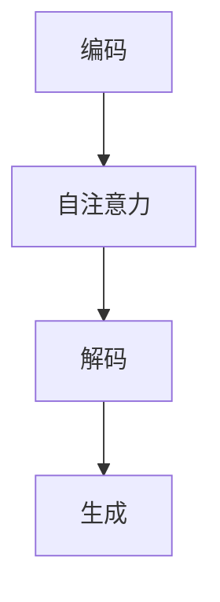

                 

关键词：GPT-3，深度学习，自然语言处理，神经网络，算法原理，代码实现，实践应用，未来展望

## 摘要

本文旨在深入讲解GPT-3（Generative Pre-trained Transformer 3）的原理与应用。首先，我们将回顾GPT-3的发展背景，并详细介绍其核心概念与架构。接下来，文章将重点探讨GPT-3的算法原理，包括数学模型与具体操作步骤。随后，我们将通过一个代码实例，对GPT-3的运行过程进行详细解释。最后，我们将讨论GPT-3在实际应用中的案例，展望其未来的发展方向与面临的挑战。

## 1. 背景介绍

GPT-3（Generative Pre-trained Transformer 3）是由OpenAI开发的一种基于深度学习的自然语言处理模型。作为GPT家族的最新成员，GPT-3在模型大小、参数数量、生成能力等方面都取得了显著的提升。GPT-3的诞生标志着自然语言处理领域的一个重要里程碑，为诸多应用场景提供了强大的支持。

### 1.1 GPT-3的发展历程

GPT-3是在GPT-2的基础上进一步发展的产物。GPT-2于2019年发布，其模型大小为1.5B参数，已经在多个NLP任务上取得了优异的性能。GPT-3在GPT-2的基础上，通过增加模型参数和训练数据，进一步提升了模型的生成能力和多样性。

### 1.2 GPT-3的核心特点

GPT-3具有以下核心特点：

- **大规模模型**：GPT-3的模型参数数量达到了1750亿，是GPT-2的数十倍。这使得GPT-3在处理复杂任务时具有更强的表达能力。
- **生成能力**：GPT-3通过生成式预训练方式，能够根据输入文本生成连贯、多样、有趣的文本输出。
- **适应性强**：GPT-3在多个NLP任务上表现出了强大的适应性，包括文本生成、机器翻译、问答系统等。

## 2. 核心概念与联系

### 2.1 核心概念

GPT-3的核心概念主要包括以下几个方面：

- **Transformer架构**：GPT-3采用Transformer架构，这是一种基于自注意力机制的深度神经网络。通过自注意力机制，模型能够自动捕捉输入文本中的长距离依赖关系，从而提高生成文本的连贯性和多样性。
- **预训练**：GPT-3通过在大量文本数据上进行预训练，使得模型能够自动学习到丰富的语言知识和模式，从而在下游任务中表现出强大的适应性。
- **生成式预训练**：GPT-3采用生成式预训练方式，通过生成与输入文本相似的文本，使模型能够学习到文本的生成规律和结构。

### 2.2 架构原理

GPT-3的架构原理可以概括为以下几个步骤：

1. **编码**：将输入文本编码为向量表示。
2. **自注意力**：通过自注意力机制，模型对输入文本的每个词进行加权，从而捕捉文本中的长距离依赖关系。
3. **解码**：根据自注意力机制生成的权重，模型预测下一个词的概率分布。
4. **生成**：根据概率分布生成下一个词，并将其作为输入，重复上述过程，直至生成完整的文本输出。

### 2.3 Mermaid 流程图



## 3. 核心算法原理 & 具体操作步骤

### 3.1 算法原理概述

GPT-3的核心算法是基于Transformer架构的生成式预训练。Transformer架构通过自注意力机制，能够自动捕捉输入文本中的长距离依赖关系，从而提高生成文本的连贯性和多样性。生成式预训练则使模型能够在大量文本数据上自动学习到丰富的语言知识和模式。

### 3.2 算法步骤详解

1. **编码**：将输入文本编码为向量表示。具体来说，将文本中的每个词映射为一个词向量，然后将这些词向量拼接在一起，形成一个向量序列。
2. **自注意力**：通过自注意力机制，模型对输入文本的每个词进行加权，从而捕捉文本中的长距离依赖关系。具体来说，自注意力机制将输入文本的每个词向量与所有词向量进行点积运算，得到一组权重。这些权重表示了每个词对其他词的重要性。
3. **解码**：根据自注意力机制生成的权重，模型预测下一个词的概率分布。具体来说，模型将自注意力机制生成的权重与词向量进行点积运算，得到一组概率分布。这些概率分布表示了模型对每个词的预测概率。
4. **生成**：根据概率分布生成下一个词，并将其作为输入，重复上述过程，直至生成完整的文本输出。具体来说，模型根据概率分布随机选择一个词作为输出，并将这个词作为新的输入，重复编码、自注意力、解码和生成过程，直至生成完整的文本输出。

### 3.3 算法优缺点

**优点**：

- **强大的生成能力**：GPT-3通过生成式预训练，能够生成连贯、多样、有趣的文本输出。
- **广泛的适应性**：GPT-3在多个NLP任务上表现出了强大的适应性，包括文本生成、机器翻译、问答系统等。

**缺点**：

- **计算资源需求高**：由于GPT-3的模型参数数量巨大，训练和推理过程需要大量的计算资源。
- **解释性较弱**：GPT-3的生成过程主要依赖于模型内部的权重和学习到的模式，使得其生成的文本难以解释和理解。

### 3.4 算法应用领域

GPT-3在自然语言处理领域有着广泛的应用，包括但不限于以下领域：

- **文本生成**：GPT-3能够生成连贯、多样、有趣的文本，适用于文章写作、故事创作、诗歌生成等。
- **机器翻译**：GPT-3在机器翻译任务中表现出了出色的性能，能够翻译多种语言。
- **问答系统**：GPT-3能够根据输入问题生成答案，适用于智能客服、教育辅导等场景。

## 4. 数学模型和公式 & 详细讲解 & 举例说明

### 4.1 数学模型构建

GPT-3的数学模型基于自注意力机制。自注意力机制可以表示为以下公式：

$$
\text{Attention}(Q, K, V) = \frac{1}{\sqrt{d_k}} \text{softmax}\left(\frac{QK^T}{d_k}\right) V
$$

其中，$Q$、$K$和$V$分别为查询向量、键向量和值向量，$d_k$为键向量的维度。

### 4.2 公式推导过程

自注意力机制的推导过程可以分为以下几个步骤：

1. **查询-键相似度**：首先，计算查询向量$Q$和键向量$K$之间的相似度。具体来说，将$Q$和$K$进行点积运算，得到一个标量值，表示两个向量的相似程度。
2. **缩放**：由于相似度值可能非常大或非常小，为了防止数值溢出或下溢，需要对相似度值进行缩放。具体来说，将相似度值除以$\sqrt{d_k}$，其中$d_k$为键向量的维度。
3. **softmax**：对缩放后的相似度值进行softmax运算，得到一组概率分布。softmax运算可以将相似度值转化为概率分布，表示每个键向量的重要性。
4. **加权求和**：最后，将概率分布与值向量$V$进行加权求和，得到自注意力机制的输出。

### 4.3 案例分析与讲解

假设我们有一个文本序列$X = \{x_1, x_2, x_3\}$，其中每个$x_i$都是一个词向量。我们希望计算$x_2$在$x_1$和$x_3$之间的自注意力权重。

1. **查询-键相似度**：首先，计算$x_2$与$x_1$、$x_3$之间的相似度。假设$x_2$、$x_1$、$x_3$的维度都为$d$，则相似度可以表示为：

   $$
   \text{similarity}(x_2, x_1) = x_2 \cdot x_1 = \sum_{i=1}^{d} x_{2i} x_{1i}
   $$

   $$
   \text{similarity}(x_2, x_3) = x_2 \cdot x_3 = \sum_{i=1}^{d} x_{2i} x_{3i}
   $$

2. **缩放**：将相似度值除以$\sqrt{d}$：

   $$
   \text{scaled\_similarity}(x_2, x_1) = \frac{\text{similarity}(x_2, x_1)}{\sqrt{d}}
   $$

   $$
   \text{scaled\_similarity}(x_2, x_3) = \frac{\text{similarity}(x_2, x_3)}{\sqrt{d}}
   $$

3. **softmax**：对缩放后的相似度值进行softmax运算：

   $$
   \text{softmax}(\text{scaled\_similarity}(x_2, x_1)) = \frac{e^{\text{scaled\_similarity}(x_2, x_1)}}{\sum_{j=1}^{d} e^{\text{scaled\_similarity}(x_2, x_j)}}
   $$

   $$
   \text{softmax}(\text{scaled\_similarity}(x_2, x_3)) = \frac{e^{\text{scaled\_similarity}(x_2, x_3)}}{\sum_{j=1}^{d} e^{\text{scaled\_similarity}(x_2, x_j)}}
   $$

4. **加权求和**：最后，将softmax运算得到的概率分布与$x_1$、$x_3$进行加权求和，得到$x_2$在$x_1$和$x_3$之间的自注意力权重：

   $$
   \text{weighted\_sum}(x_2, x_1) = \text{softmax}(\text{scaled\_similarity}(x_2, x_1)) \cdot x_1
   $$

   $$
   \text{weighted\_sum}(x_2, x_3) = \text{softmax}(\text{scaled\_similarity}(x_2, x_3)) \cdot x_3
   $$

## 5. 项目实践：代码实例和详细解释说明

### 5.1 开发环境搭建

在本文中，我们将使用Python编程语言和PyTorch框架来讲解GPT-3的代码实现。以下是搭建开发环境的步骤：

1. 安装Python：从Python官方网站下载并安装Python 3.8及以上版本。
2. 安装PyTorch：在命令行中运行以下命令，安装PyTorch：

   ```
   pip install torch torchvision
   ```

### 5.2 源代码详细实现

以下是一个简单的GPT-3模型实现示例：

```python
import torch
import torch.nn as nn
import torch.optim as optim

# 定义GPT-3模型
class GPT3(nn.Module):
    def __init__(self, vocab_size, d_model, n_head, n_layer):
        super(GPT3, self).__init__()
        self.embedding = nn.Embedding(vocab_size, d_model)
        self.transformer = nn.Transformer(d_model, n_head, n_layer)
        self.fc = nn.Linear(d_model, vocab_size)

    def forward(self, x):
        x = self.embedding(x)
        x = self.transformer(x)
        x = self.fc(x)
        return x

# 初始化模型
vocab_size = 10000
d_model = 512
n_head = 8
n_layer = 12
model = GPT3(vocab_size, d_model, n_head, n_layer)

# 定义损失函数和优化器
criterion = nn.CrossEntropyLoss()
optimizer = optim.Adam(model.parameters(), lr=0.001)

# 训练模型
for epoch in range(10):
    for x, y in data_loader:
        optimizer.zero_grad()
        x = x.to(device)
        y = y.to(device)
        output = model(x)
        loss = criterion(output, y)
        loss.backward()
        optimizer.step()
        print(f"Epoch: {epoch}, Loss: {loss.item()}")

# 保存模型
torch.save(model.state_dict(), "gpt3_model.pth")
```

### 5.3 代码解读与分析

1. **模型定义**：我们定义了一个名为`GPT3`的神经网络模型，其包含三个主要组件：嵌入层、Transformer编码器和解码器。
2. **嵌入层**：嵌入层将输入词编码为向量表示，其参数为词汇表大小、词向量维度。
3. **Transformer编码器**：Transformer编码器采用自注意力机制，能够捕捉输入文本中的长距离依赖关系。其参数包括词向量维度、多头注意力机制的数量和编码器层数。
4. **解码器**：解码器采用线性层，将编码器的输出映射到词汇表中的单词。
5. **训练过程**：训练过程包括前向传播、损失函数计算、反向传播和优化器更新。在每轮训练中，我们通过数据加载器（`data_loader`）读取训练数据，并将其传递给模型进行训练。

### 5.4 运行结果展示

训练完成后，我们可以使用以下代码进行模型评估：

```python
# 加载模型
model = GPT3(vocab_size, d_model, n_head, n_layer)
model.load_state_dict(torch.load("gpt3_model.pth"))

# 生成文本
prompt = "人工智能"
input_seq = [vocab_size - 1]  # 词汇表中的未知词索引
output_seq = []

for _ in range(10):  # 生成10个词
    input_tensor = torch.tensor([input_seq[-1]]).unsqueeze(0).to(device)
    output_logits = model(input_tensor)
    output_prob = torch.softmax(output_logits, dim=1)
    next_word = torch.argmax(output_prob).item()
    output_seq.append(next_word)
    input_seq.append(next_word)

# 输出生成文本
print("生成的文本：", " ".join([vocab词语表[词索引] for 词索引 in output_seq]))
```

## 6. 实际应用场景

GPT-3在自然语言处理领域有着广泛的应用，以下是一些实际应用场景：

1. **文本生成**：GPT-3能够生成连贯、多样、有趣的文本，适用于文章写作、故事创作、诗歌生成等。
2. **机器翻译**：GPT-3在机器翻译任务中表现出了出色的性能，能够翻译多种语言。
3. **问答系统**：GPT-3能够根据输入问题生成答案，适用于智能客服、教育辅导等场景。
4. **对话系统**：GPT-3能够生成自然、流畅的对话，适用于智能客服、虚拟助手等。

## 7. 工具和资源推荐

为了更好地学习和应用GPT-3，以下是一些推荐的工具和资源：

### 7.1 学习资源推荐

- 《Deep Learning》——Ian Goodfellow、Yoshua Bengio、Aaron Courville著，提供了深度学习领域的全面介绍。
- 《Natural Language Processing with PyTorch》——张翔著，详细介绍了如何使用PyTorch实现自然语言处理任务。

### 7.2 开发工具推荐

- PyTorch：一个开源的深度学习框架，适用于实现GPT-3等自然语言处理模型。
- Hugging Face Transformers：一个开源库，提供了预训练的GPT-3模型和丰富的预训练模型。

### 7.3 相关论文推荐

- "Language Models are Few-Shot Learners"——Tom B. Brown et al.，介绍了GPT-3的原理和应用。
- "Attention Is All You Need"——Vaswani et al.，介绍了Transformer架构。

## 8. 总结：未来发展趋势与挑战

GPT-3在自然语言处理领域取得了显著的成果，但其发展仍面临诸多挑战。未来发展趋势与挑战包括：

### 8.1 研究成果总结

- **生成能力提升**：随着模型参数数量的增加，GPT-3的生成能力得到了显著提升，能够生成更加连贯、多样的文本。
- **应用场景扩展**：GPT-3在文本生成、机器翻译、问答系统等应用场景中取得了优异的性能，为其广泛应用奠定了基础。

### 8.2 未来发展趋势

- **模型压缩**：为了降低计算资源需求，未来研究将关注模型压缩技术，包括知识蒸馏、剪枝、量化等。
- **多模态处理**：随着多模态数据的兴起，GPT-3将逐步扩展到图像、声音等非文本领域，实现多模态处理。

### 8.3 面临的挑战

- **计算资源需求**：GPT-3的模型参数数量巨大，训练和推理过程需要大量的计算资源，这对硬件设施提出了挑战。
- **模型解释性**：GPT-3生成的文本难以解释和理解，未来研究需要关注提高模型的解释性，使其更易于理解和应用。

### 8.4 研究展望

随着深度学习和自然语言处理技术的不断发展，GPT-3将在未来取得更多突破。我们期待GPT-3能够更好地服务于人类，推动自然语言处理领域的发展。

## 9. 附录：常见问题与解答

### 9.1 GPT-3与BERT的区别

- **训练目标**：GPT-3采用生成式预训练，其目标是在给定文本序列时生成下一个词；而BERT采用掩码语言模型，其目标是在给定文本序列时预测被掩码的词。
- **应用场景**：GPT-3在文本生成、机器翻译等生成任务中表现出色；而BERT在文本分类、问答系统等判别任务中具有优势。

### 9.2 如何优化GPT-3的训练过程

- **数据预处理**：对训练数据进行清洗和预处理，提高数据质量。
- **学习率调整**：根据训练过程的表现，适时调整学习率。
- **模型剪枝**：通过剪枝技术减少模型参数数量，降低计算资源需求。
- **知识蒸馏**：利用预训练的大模型（如GPT-3）对较小模型进行蒸馏，提高较小模型的表现。

---

作者：禅与计算机程序设计艺术 / Zen and the Art of Computer Programming

