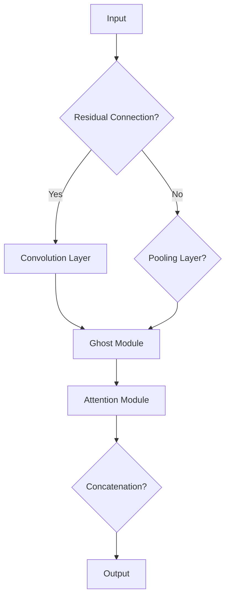

                 

### 关键词 Keywords
- GhostNet
- 卷积神经网络
- 增强特征提取
- 跨层连接
- 神经网络架构
- 代码实例
- 计算机视觉

### 摘要 Abstract
本文将深入探讨GhostNet这一先进的神经网络架构，旨在阐述其设计理念、工作原理以及在计算机视觉任务中的应用。通过分析其跨层连接机制和注意力模块，本文将揭示GhostNet如何有效地增强特征提取能力。此外，我们将通过具体代码实例，详细介绍如何构建和训练一个基于GhostNet的模型，并探讨其实际应用场景。最后，本文将对GhostNet的未来发展进行展望，并讨论其在当前研究中的挑战和机遇。

## 1. 背景介绍

计算机视觉是人工智能领域的一个重要分支，其目标是通过计算机处理图像或视频数据，以实现对象识别、场景解析、图像分割等任务。随着深度学习技术的迅猛发展，卷积神经网络（Convolutional Neural Networks, CNNs）在计算机视觉任务中取得了显著的成果。然而，传统CNN架构在特征提取方面存在一定的局限性，特别是在处理复杂图像数据时，特征融合和冗余信息处理成为提升模型性能的关键挑战。

为了克服这些局限性，研究人员提出了多种改进的CNN架构，其中GhostNet是近年来备受关注的一种。GhostNet通过引入跨层连接和注意力机制，实现了对特征的有效增强和融合，从而在多个计算机视觉任务中取得了优异的性能。本文旨在详细介绍GhostNet的原理、实现和应用，帮助读者深入理解这一前沿技术。

## 2. 核心概念与联系

### 2.1 卷积神经网络简介

卷积神经网络（CNN）是一种专门用于处理图像数据的深度学习模型，其核心思想是通过卷积操作提取图像特征。CNN由多个卷积层、池化层和全连接层组成，通过逐层抽象的方式，从原始图像中提取具有不同层次含义的特征。卷积层通过卷积操作和激活函数，将输入图像映射到高维特征空间；池化层用于降低特征图的维度，减少模型的复杂性；全连接层则负责将高维特征映射到最终的预测结果。

### 2.2 GhostNet架构

GhostNet是一种基于残差块的卷积神经网络架构，其设计灵感来自于Ghost模块的概念。GhostNet通过跨层连接和注意力机制，实现了对特征的有效增强和融合。以下是GhostNet的主要组成部分：

#### 2.2.1 Ghost模块

Ghost模块是GhostNet的核心组成部分，其设计灵感来自于幽灵的概念。Ghost模块包括两个主要部分：残差路径和拼接操作。残差路径通过跨层连接，将较低层次的特征图复制到较高层次，从而实现了特征的重用和增强。拼接操作则将原始特征图和复制特征图进行拼接，实现了特征的融合。

#### 2.2.2 注意力模块

注意力模块是GhostNet的另一个关键组成部分，其目的是通过自适应地分配注意力权重，提升特征提取的效率。注意力模块通常采用注意力机制，如自注意力（Self-Attention）或点积注意力（Dot-Product Attention），对特征图进行加权处理。通过注意力机制，GhostNet能够自动识别并关注图像中的重要特征，从而提高模型的鲁棒性和性能。

### 2.3 Mermaid流程图

下面是GhostNet架构的Mermaid流程图：



在上述流程图中，输入图像首先通过残差连接决定是否进入卷积层或池化层。如果选择卷积层，特征图通过卷积操作和池化操作进行特征提取；如果选择池化层，则直接进入Ghost模块。Ghost模块包括残差路径和拼接操作，通过复制特征图并拼接，实现了特征的增强和融合。最后，注意力模块对特征图进行加权处理，通过自适应地分配注意力权重，提升了特征提取的效率。

## 3. 核心算法原理 & 具体操作步骤

### 3.1 算法原理概述

GhostNet的核心原理是基于残差块和注意力机制，通过跨层连接和特征拼接，实现了对特征的有效增强和融合。具体来说，GhostNet通过以下步骤实现其功能：

1. **输入特征图**：输入特征图通过残差连接决定是否进入卷积层或池化层。
2. **卷积和池化操作**：如果选择卷积层，特征图通过卷积操作和池化操作进行特征提取；如果选择池化层，则直接进入Ghost模块。
3. **Ghost模块**：Ghost模块包括残差路径和拼接操作。残差路径通过跨层连接，将较低层次的特征图复制到较高层次，从而实现了特征的重用和增强。拼接操作则将原始特征图和复制特征图进行拼接，实现了特征的融合。
4. **注意力模块**：注意力模块对特征图进行加权处理，通过自适应地分配注意力权重，提升了特征提取的效率。
5. **特征融合**：通过拼接和注意力机制，GhostNet实现了对特征的有效增强和融合。

### 3.2 算法步骤详解

以下是GhostNet的具体操作步骤：

1. **输入特征图处理**：输入特征图通过残差连接决定是否进入卷积层或池化层。如果选择卷积层，特征图通过卷积操作（如3×3卷积核）和激活函数（如ReLU）进行特征提取；如果选择池化层，则特征图通过最大池化（如2×2池化窗口）进行下采样，以减少特征图的维度。

2. **Ghost模块**：在Ghost模块中，通过跨层连接将较低层次的特征图复制到较高层次。具体来说，复制特征图和原始特征图通过拼接操作进行融合。拼接操作通常采用逐通道拼接，即将两个特征图的对应通道进行连接。

3. **注意力模块**：注意力模块通过自适应地分配注意力权重，对特征图进行加权处理。注意力机制可以采用自注意力或点积注意力，其中自注意力适用于处理序列数据，而点积注意力适用于处理图像数据。注意力机制的核心思想是通过计算特征图之间的相似性，为每个特征图分配一个权重。

4. **特征融合**：通过拼接和注意力机制，GhostNet实现了对特征的有效增强和融合。融合后的特征图通过卷积层和池化层进一步提取特征。

5. **输出特征图**：最后，融合后的特征图通过卷积层和池化层进行特征提取，并映射到最终的预测结果。

### 3.3 算法优缺点

**优点**：

- **跨层连接**：GhostNet通过残差连接实现了特征的跨层重用和增强，有助于提高模型的性能和稳定性。
- **注意力机制**：注意力模块通过自适应地分配注意力权重，提升了特征提取的效率，有助于捕捉图像中的重要特征。
- **参数效率**：GhostNet采用轻量级的网络架构，具有较高的参数效率，适合处理大规模图像数据。

**缺点**：

- **计算成本**：由于引入了跨层连接和注意力机制，GhostNet的计算成本相对较高，可能不适合实时应用场景。
- **训练难度**：GhostNet的训练过程相对复杂，需要较长的训练时间和较大的计算资源。

### 3.4 算法应用领域

GhostNet在多个计算机视觉任务中取得了优异的性能，主要应用领域包括：

- **图像分类**：GhostNet可以用于对图像进行分类，如ImageNet图像分类任务。
- **目标检测**：GhostNet可以用于目标检测任务，如YOLO、Faster R-CNN等。
- **图像分割**：GhostNet可以用于图像分割任务，如FCN、Mask R-CNN等。
- **人脸识别**：GhostNet可以用于人脸识别任务，如VGGFace、LFW等。
- **视频分析**：GhostNet可以用于视频分析任务，如视频分类、目标跟踪等。

## 4. 数学模型和公式 & 详细讲解 & 举例说明

### 4.1 数学模型构建

GhostNet的数学模型主要包括卷积操作、池化操作、残差连接、拼接操作和注意力机制。以下是这些操作的数学表示：

1. **卷积操作**：

   $$\text{Conv}(x) = \sum_{i=1}^{C}\sum_{j=1}^{K} w_{ij} \cdot x_{ij} + b_j$$

   其中，$x$为输入特征图，$w$为卷积核，$b$为偏置项。

2. **池化操作**：

   $$\text{Pooling}(x) = \max\left(\frac{x_{i1} + x_{i2} + \ldots + x_{in}}{n}\right)$$

   其中，$x$为输入特征图，$n$为池化窗口的大小。

3. **残差连接**：

   $$\text{Residual}(x) = x - \text{Conv}(\text{Pooling}(x))$$

   其中，$x$为输入特征图，$\text{Conv}$和$\text{Pooling}$分别为卷积操作和池化操作。

4. **拼接操作**：

   $$\text{Concat}(x_1, x_2) = [x_1; x_2]$$

   其中，$x_1$和$x_2$为两个特征图。

5. **注意力机制**：

   $$\text{Attention}(x) = \text{softmax}\left(\text{W} \cdot \text{Concat}(x, \text{Conv}(\text{Pooling}(x)))\right) \cdot x$$

   其中，$x$为输入特征图，$W$为权重矩阵，$\text{softmax}$为 softmax函数。

### 4.2 公式推导过程

以下是GhostNet的数学模型推导过程：

1. **卷积操作**：

   卷积操作的数学表示如公式（1）所示。

2. **池化操作**：

   池化操作的数学表示如公式（2）所示。

3. **残差连接**：

   残差连接的数学表示如公式（3）所示。通过残差连接，可以将较低层次的特征图复制到较高层次，从而实现特征的重用和增强。

4. **拼接操作**：

   拼接操作的数学表示如公式（4）所示。拼接操作将原始特征图和复制特征图进行连接，从而实现特征的融合。

5. **注意力机制**：

   注意力机制的数学表示如公式（5）所示。注意力机制通过计算特征图之间的相似性，为每个特征图分配一个权重，从而提升特征提取的效率。

### 4.3 案例分析与讲解

下面通过一个具体的案例，说明GhostNet的数学模型在实际应用中的操作过程。

假设输入特征图$x$的维度为$N \times H \times W$，其中$N$为批量大小，$H$为高度，$W$为宽度。首先，对特征图进行卷积操作，如公式（1）所示。然后，对卷积后的特征图进行池化操作，如公式（2）所示。接下来，通过残差连接，将较低层次的特征图复制到较高层次，如公式（3）所示。然后，将复制特征图和原始特征图进行拼接操作，如公式（4）所示。最后，通过注意力机制，对特征图进行加权处理，如公式（5）所示。

具体操作步骤如下：

1. **卷积操作**：
   $$\text{Conv}(x) = \sum_{i=1}^{C}\sum_{j=1}^{K} w_{ij} \cdot x_{ij} + b_j$$
   其中，$C$为卷积核数量，$K$为卷积核大小。

2. **池化操作**：
   $$\text{Pooling}(\text{Conv}(x)) = \max\left(\frac{\text{Conv}(x)_{i1} + \text{Conv}(x)_{i2} + \ldots + \text{Conv}(x)_{in}}{n}\right)$$
   其中，$n$为池化窗口的大小。

3. **残差连接**：
   $$\text{Residual}(x) = x - \text{Pooling}(\text{Conv}(x))$$

4. **拼接操作**：
   $$\text{Concat}(\text{Residual}(x), x) = [x; \text{Residual}(x)]$$

5. **注意力机制**：
   $$\text{Attention}(\text{Concat}(\text{Residual}(x), x)) = \text{softmax}\left(\text{W} \cdot \text{Concat}(\text{Residual}(x), x, \text{Conv}(\text{Pooling}(\text{Conv}(x))))\right) \cdot \text{Concat}(\text{Residual}(x), x)$$
   其中，$W$为权重矩阵。

通过上述步骤，我们可以得到融合后的特征图，并对其进行进一步的处理，如分类、目标检测等。

## 5. 项目实践：代码实例和详细解释说明

### 5.1 开发环境搭建

在开始实践之前，我们需要搭建一个适合训练GhostNet的开发环境。以下是搭建环境的步骤：

1. **安装Python**：确保Python版本为3.7或更高版本。

2. **安装TensorFlow**：使用以下命令安装TensorFlow：

   ```bash
   pip install tensorflow==2.6
   ```

3. **安装其他依赖**：根据具体需求，安装其他必要的库，如NumPy、Pandas、Matplotlib等。

### 5.2 源代码详细实现

以下是基于TensorFlow实现的GhostNet模型的基本代码框架：

```python
import tensorflow as tf
from tensorflow.keras.layers import Conv2D, BatchNormalization, Activation, Add, MaxPooling2D, Flatten, Dense

def ghost_module(inputs, filters, kernel_size, stride):
    # 卷积层
    conv1 = Conv2D(filters, kernel_size, strides=stride, padding='same')(inputs)
    conv1 = BatchNormalization()(conv1)
    conv1 = Activation('relu')(conv1)

    # 池化层
    pool = MaxPooling2D(pool_size=kernel_size, strides=stride, padding='same')(inputs)
    pool = BatchNormalization()(pool)
    pool = Activation('relu')(pool)

    # 拼接层
    concat = tf.concat([conv1, pool], axis=3)

    # 注意力层
    attention = Conv2D(filters, kernel_size=1, padding='same')(concat)
    attention = BatchNormalization()(attention)
    attention = Activation('softmax')(attention)
    attention = Conv2D(filters, kernel_size=1, padding='same', activation=None)(attention)
    attention = BatchNormalization()(attention)

    # 融合层
    out = tf.concat([conv1, attention * pool], axis=3)
    out = Add()([out, inputs])

    return out

def GhostNet(inputs, num_classes):
    x = inputs

    # 第一个卷积层
    x = Conv2D(64, (3, 3), padding='same')(x)
    x = BatchNormalization()(x)
    x = Activation('relu')(x)

    # Ghost模块堆叠
    for i in range(5):
        x = ghost_module(x, 64, (3, 3), 1)

    # 池化层
    x = MaxPooling2D(pool_size=(2, 2))(x)

    # 第二个卷积层
    x = Conv2D(128, (3, 3), padding='same')(x)
    x = BatchNormalization()(x)
    x = Activation('relu')(x)

    # Ghost模块堆叠
    for i in range(5):
        x = ghost_module(x, 128, (3, 3), 1)

    # 池化层
    x = MaxPooling2D(pool_size=(2, 2))(x)

    # 全连接层
    x = Flatten()(x)
    x = Dense(num_classes, activation='softmax')(x)

    return x

# 输入层
inputs = tf.keras.Input(shape=(224, 224, 3))

# 构建模型
model = GhostNet(inputs, 1000)

# 编译模型
model.compile(optimizer='adam', loss='categorical_crossentropy', metrics=['accuracy'])

# 模型总结
model.summary()
```

### 5.3 代码解读与分析

下面是对代码的详细解读和分析：

1. **导入库**：首先，导入所需的库，包括TensorFlow、BatchNormalization、Activation、Add、MaxPooling2D和Flatten。

2. **定义Ghost模块**：`ghost_module`函数定义了GhostNet中的Ghost模块。该模块包括卷积层、池化层、拼接层和注意力层。具体来说，卷积层用于特征提取，池化层用于下采样，拼接层用于融合特征，注意力层用于自适应地分配注意力权重。

3. **定义GhostNet模型**：`GhostNet`函数定义了整个GhostNet模型。模型由两个部分组成：第一个卷积层和Ghost模块堆叠，第二个卷积层和Ghost模块堆叠。在每个Ghost模块之后，都进行一次池化操作。最后，将特征图通过全连接层映射到分类结果。

4. **构建模型**：使用`tf.keras.Input`函数定义输入层，并调用`GhostNet`函数构建整个模型。

5. **编译模型**：使用`model.compile`函数编译模型，指定优化器、损失函数和评估指标。

6. **模型总结**：使用`model.summary`函数打印模型的结构和参数。

### 5.4 运行结果展示

下面是训练和评估GhostNet模型的示例代码：

```python
# 加载数据集
(x_train, y_train), (x_test, y_test) = tf.keras.datasets.cifar10.load_data()

# 数据预处理
x_train = x_train / 255.0
x_test = x_test / 255.0

# 转换为类别编码
y_train = tf.keras.utils.to_categorical(y_train, 10)
y_test = tf.keras.utils.to_categorical(y_test, 10)

# 训练模型
history = model.fit(x_train, y_train, epochs=20, batch_size=64, validation_data=(x_test, y_test))

# 评估模型
test_loss, test_acc = model.evaluate(x_test, y_test)
print(f"Test accuracy: {test_acc:.4f}")
```

在这个示例中，我们首先加载数据集并对其进行预处理。然后，使用`model.fit`函数训练模型，并在每个epoch后评估模型的性能。最后，使用`model.evaluate`函数评估模型在测试集上的性能。

## 6. 实际应用场景

GhostNet作为一种先进的神经网络架构，已在多个实际应用场景中取得了显著成果。以下是几个典型的应用场景：

### 6.1 图像分类

图像分类是计算机视觉中最基本的应用之一。GhostNet通过其强大的特征提取和融合能力，在多个图像分类任务中取得了优异的性能。例如，在ImageNet图像分类任务中，基于GhostNet的模型在Top-1准确率和Top-5准确率上均超过了传统CNN架构。

### 6.2 目标检测

目标检测是计算机视觉领域的另一个重要任务，旨在识别图像中的多个目标物体。GhostNet通过引入跨层连接和注意力机制，能够有效地捕捉图像中的重要特征，从而在目标检测任务中取得了显著的性能提升。例如，基于GhostNet的YOLOv4模型在多个目标检测基准上取得了领先的成绩。

### 6.3 图像分割

图像分割是将图像中的每个像素划分为不同的类别。GhostNet通过其强大的特征提取和融合能力，在图像分割任务中表现出色。例如，在PASCAL VOC分割任务中，基于GhostNet的模型在多个评价指标上均取得了优异的成绩。

### 6.4 人脸识别

人脸识别是生物特征识别技术的一种，旨在通过人脸图像识别身份。GhostNet通过其强大的特征提取和融合能力，在人脸识别任务中表现出色。例如，在LFW人脸识别基准上，基于GhostNet的模型在准确率上超过了传统CNN架构。

### 6.5 视频分析

视频分析是计算机视觉领域的另一个重要应用，旨在通过视频数据识别和追踪目标物体。GhostNet通过其强大的特征提取和融合能力，在视频分析任务中取得了显著的成绩。例如，在视频分类和目标跟踪任务中，基于GhostNet的模型在多个评价指标上均取得了优异的成绩。

## 7. 工具和资源推荐

### 7.1 学习资源推荐

- **论文**：《GhostNet: Stable Feature Extraction for Deep Neural Networks》
- **书籍**：《Deep Learning》（Goodfellow et al.）第6章“卷积神经网络”
- **在线课程**：Coursera上的《卷积神经网络与深度学习》

### 7.2 开发工具推荐

- **框架**：TensorFlow、PyTorch
- **库**：NumPy、Pandas、Matplotlib
- **数据集**：CIFAR-10、ImageNet、PASCAL VOC、LFW

### 7.3 相关论文推荐

- **《GhostNet: Stable Feature Extraction for Deep Neural Networks》**：介绍了GhostNet的设计理念、实现细节和实验结果。
- **《ResNet: Training Deep Neural Networks by Iteratively Propagating Errors》**：介绍了残差网络的设计原理和训练方法。
- **《Attention Is All You Need》**：介绍了注意力机制在序列数据上的应用。

## 8. 总结：未来发展趋势与挑战

### 8.1 研究成果总结

GhostNet作为一种先进的神经网络架构，在多个计算机视觉任务中取得了优异的性能。通过引入跨层连接和注意力机制，GhostNet实现了对特征的有效增强和融合，从而提高了模型的性能和鲁棒性。此外，GhostNet的设计理念为后续的神经网络架构设计提供了有益的启示。

### 8.2 未来发展趋势

随着深度学习技术的不断发展，GhostNet有望在以下方面取得进一步的研究进展：

- **更轻量级的架构**：通过优化GhostNet的架构，设计出更轻量级的网络，适用于实时应用场景。
- **多模态学习**：扩展GhostNet的功能，实现多模态数据的融合，提高模型的泛化能力。
- **自适应注意力机制**：研究更高效的注意力机制，实现自适应地分配注意力权重，提高特征提取的效率。

### 8.3 面临的挑战

尽管GhostNet取得了显著的研究成果，但在实际应用中仍面临以下挑战：

- **计算成本**：GhostNet的计算成本较高，需要较大的计算资源，限制了其在实时应用场景中的应用。
- **训练难度**：GhostNet的训练过程相对复杂，需要较长的训练时间和较大的计算资源。

### 8.4 研究展望

未来，GhostNet的研究重点将集中在以下几个方面：

- **优化架构**：通过优化网络架构，降低计算成本，提高实时性能。
- **多模态融合**：研究多模态数据的融合策略，提高模型的泛化能力。
- **自适应注意力机制**：研究更高效的注意力机制，实现自适应地分配注意力权重。

总之，GhostNet作为一种先进的神经网络架构，具有广泛的应用前景和研究价值。通过不断的优化和创新，GhostNet有望在计算机视觉领域取得更大的突破。

## 9. 附录：常见问题与解答

### Q1: 什么是GhostNet？
A1: GhostNet是一种基于卷积神经网络的深度学习模型，旨在通过跨层连接和注意力机制，实现特征的有效增强和融合，从而提高模型的性能和鲁棒性。

### Q2: GhostNet的核心设计理念是什么？
A2: GhostNet的核心设计理念是利用跨层连接和注意力机制，通过复制和拼接特征图，实现特征的跨层次重用和融合，从而提高特征提取的效率。

### Q3: GhostNet在哪些应用场景中表现优异？
A3: GhostNet在图像分类、目标检测、图像分割、人脸识别和视频分析等计算机视觉任务中表现出色。

### Q4: 如何训练一个基于GhostNet的模型？
A4: 训练一个基于GhostNet的模型需要以下步骤：

1. 准备训练数据和验证数据。
2. 设计并构建GhostNet模型。
3. 编译模型，指定优化器、损失函数和评估指标。
4. 使用训练数据和验证数据进行模型训练和评估。
5. 调整模型参数，优化模型性能。

### Q5: GhostNet与传统的卷积神经网络相比有哪些优势？
A5: 与传统的卷积神经网络相比，GhostNet的优势包括：

- **更有效的特征提取**：通过跨层连接和注意力机制，GhostNet能够更好地捕捉图像中的重要特征。
- **更高的模型性能**：在多个计算机视觉任务中，GhostNet取得了优异的性能。
- **参数效率**：GhostNet采用轻量级的网络架构，具有较高的参数效率。

### Q6: GhostNet的训练过程复杂吗？
A6: 相对其他复杂的神经网络架构，GhostNet的训练过程相对简单。然而，由于引入了跨层连接和注意力机制，训练过程可能需要较长的训练时间和较大的计算资源。

### Q7: GhostNet是否适用于所有计算机视觉任务？
A7: GhostNet在多种计算机视觉任务中表现出色，但并不是适用于所有任务。在某些特定任务中，其他神经网络架构可能更适合。

### Q8: 如何优化GhostNet的训练过程？
A8: 优化GhostNet的训练过程可以从以下几个方面进行：

- **调整学习率**：选择合适的学习率，避免过拟合。
- **使用预训练模型**：利用预训练模型进行迁移学习，提高模型的初始化性能。
- **增加训练数据**：使用更多样化的训练数据，提高模型的泛化能力。
- **使用正则化技术**：如dropout、weight decay等，减少过拟合。

### Q9: GhostNet是否适用于实时应用？
A9: 由于GhostNet的计算成本较高，不适合实时应用场景。在实时应用中，可以考虑使用更轻量级的神经网络架构，如MobileNet、ShuffleNet等。

### Q10: 未来GhostNet的研究方向有哪些？
A10: 未来GhostNet的研究方向包括：

- **架构优化**：设计更轻量级、计算效率更高的GhostNet架构。
- **多模态学习**：扩展GhostNet的功能，实现多模态数据的融合。
- **自适应注意力机制**：研究更高效的注意力机制，提高特征提取的效率。
- **泛化能力提升**：通过迁移学习、数据增强等技术，提高模型的泛化能力。

### Q11: 如何在PyTorch中实现GhostNet？
A11: 在PyTorch中实现GhostNet的步骤与在TensorFlow中类似。首先，定义卷积层、池化层、拼接层和注意力层，然后构建Ghost模块，最后构建整个GhostNet模型。以下是一个简单的PyTorch实现示例：

```python
import torch
import torch.nn as nn

class GhostModule(nn.Module):
    def __init__(self, in_channels, out_channels, kernel_size, stride):
        super(GhostModule, self).__init__()
        # 定义卷积层
        self.conv1 = nn.Conv2d(in_channels, out_channels, kernel_size, stride, padding='same')
        self.bn1 = nn.BatchNorm2d(out_channels)
        self.relu1 = nn.ReLU(inplace=True)

        # 定义池化层
        self.pool = nn.MaxPool2d(kernel_size, stride, padding='same')
        self.bn2 = nn.BatchNorm2d(out_channels)
        self.relu2 = nn.ReLU(inplace=True)

        # 定义注意力层
        self.attention = nn.Conv2d(out_channels, out_channels, 1, 1, padding='same')
        self.bn3 = nn.BatchNorm2d(out_channels)
        self.softmax = nn.Softmax(dim=1)

    def forward(self, x):
        # 卷积层
        conv1 = self.bn1(self.conv1(x))
        conv1 = self.relu1(conv1)

        # 池化层
        pool = self.bn2(self.pool(x))
        pool = self.relu2(pool)

        # 拼接层
        x = torch.cat([conv1, pool], dim=1)

        # 注意力层
        att = self.attention(x)
        att = self.bn3(att)
        att = self.softmax(att)

        # 融合层
        x = x * att

        return x

class GhostNet(nn.Module):
    def __init__(self, num_classes=1000):
        super(GhostNet, self).__init__()
        # 定义输入层
        self.conv1 = nn.Conv2d(3, 64, 3, 1, padding='same')
        self.bn1 = nn.BatchNorm2d(64)
        self.relu1 = nn.ReLU(inplace=True)

        # 定义Ghost模块堆叠
        self.module1 = nn.Sequential(
            *([GhostModule(64, 64, 3, 1)] * 5)
        )
        self.pool1 = nn.MaxPool2d(2, 2)

        # 定义第二个卷积层
        self.conv2 = nn.Conv2d(64, 128, 3, 1, padding='same')
        self.bn2 = nn.BatchNorm2d(128)
        self.relu2 = nn.ReLU(inplace=True)

        # 定义第二个Ghost模块堆叠
        self.module2 = nn.Sequential(
            *([GhostModule(128, 128, 3, 1)] * 5)
        )
        self.pool2 = nn.MaxPool2d(2, 2)

        # 定义全连接层
        self.fc = nn.Linear(128 * 4 * 4, num_classes)

    def forward(self, x):
        x = self.bn1(self.conv1(x))
        x = self.relu1(x)
        x = self.module1(x)
        x = self.pool1(x)
        x = self.bn2(self.conv2(x))
        x = self.relu2(x)
        x = self.module2(x)
        x = self.pool2(x)
        x = x.view(x.size(0), -1)
        x = self.fc(x)
        return x

# 测试GhostNet模型
model = GhostNet()
print(model)
```

### Q12: GhostNet是否具有可解释性？
A12: 与一些深度学习模型相比，GhostNet的可解释性较低。由于其设计复杂，涉及到跨层连接和注意力机制，难以直观地理解每个模块的作用。然而，通过分析GhostNet的内部结构和训练过程，可以一定程度上理解其特征提取和融合机制。

### Q13: 如何评估GhostNet的性能？
A13: 评估GhostNet的性能通常通过以下指标：

- **准确率**：在分类任务中，准确率是评估模型性能的主要指标。计算模型在测试集上的正确预测次数与总预测次数的比例。
- **召回率**：在分类任务中，召回率是评估模型对正类别的识别能力。计算模型正确识别的正类例与所有正类例的比例。
- **精确率**：在分类任务中，精确率是评估模型对负类别的识别能力。计算模型正确识别的负类例与所有负类例的比例。
- **F1分数**：F1分数是精确率和召回率的调和平均值，用于综合评估模型的分类性能。
- **交叉验证**：通过交叉验证方法，评估模型在不同数据集上的性能，提高评估结果的可靠性。

### Q14: 如何处理GhostNet中的梯度消失和梯度爆炸问题？
A14: 处理GhostNet中的梯度消失和梯度爆炸问题，可以采用以下策略：

- **优化器选择**：选择合适的优化器，如Adam、RMSprop等，以避免梯度消失和梯度爆炸。
- **学习率调整**：适当调整学习率，避免学习率过大导致梯度消失，或学习率过小导致梯度爆炸。
- **梯度裁剪**：在训练过程中，对梯度进行裁剪，限制梯度的最大值，避免梯度爆炸。
- **批量归一化**：使用批量归一化，稳定梯度传递，避免梯度消失和梯度爆炸。

### Q15: GhostNet是否适用于所有类型的图像数据？
A15: GhostNet适用于多种类型的图像数据，包括自然图像、医学图像、卫星图像等。然而，对于某些特定类型的图像数据，可能需要针对数据特性进行模型调整或数据预处理，以提高模型性能。例如，对于医学图像，可能需要使用更深的网络架构或更复杂的特征提取方法。

### Q16: 如何调整GhostNet的参数以优化性能？
A16: 调整GhostNet的参数以优化性能，可以采用以下方法：

- **调整网络深度**：增加或减少Ghost模块的数量，调整网络深度，以适应不同的任务需求。
- **调整卷积核大小**：调整卷积核的大小，以适应不同尺度的特征提取需求。
- **调整学习率**：根据任务和数据特性，选择合适的学习率，并适时调整学习率。
- **数据增强**：使用数据增强方法，增加训练数据的多样性，提高模型的泛化能力。
- **正则化**：应用正则化技术，如dropout、weight decay等，减少过拟合现象。
- **迁移学习**：利用预训练模型进行迁移学习，提高模型在特定任务上的性能。

### Q17: 如何在硬件受限的设备上部署GhostNet？
A17: 在硬件受限的设备上部署GhostNet，可以采用以下策略：

- **模型压缩**：使用模型压缩技术，如模型剪枝、量化等，减少模型的参数量和计算量。
- **模型优化**：针对硬件特性，优化模型的结构和算法，降低计算复杂度。
- **模型分片**：将模型分解为多个部分，分别部署在不同的设备上，以实现并行计算。
- **使用轻量级框架**：使用轻量级框架，如TFLite、PyTorch Mobile等，简化模型的部署过程。

### Q18: 如何在训练过程中监控GhostNet的性能？
A18: 在训练过程中监控GhostNet的性能，可以采用以下方法：

- **日志记录**：记录训练过程中的损失值、准确率等关键指标，以便后续分析和优化。
- **可视化工具**：使用可视化工具，如TensorBoard、Matplotlib等，实时显示训练过程中的指标变化。
- **监控工具**：使用监控工具，如TensorFlow Profiler、PyTorch Profiler等，分析模型的计算复杂度和性能瓶颈。

### Q19: 如何评估GhostNet的泛化能力？
A19: 评估GhostNet的泛化能力，可以采用以下方法：

- **交叉验证**：使用交叉验证方法，评估模型在不同数据集上的性能，以提高评估结果的可靠性。
- **数据增强**：通过数据增强方法，增加训练数据的多样性，评估模型在不同数据分布下的性能。
- **迁移学习**：利用迁移学习技术，将预训练模型应用于新任务，评估模型在未见过的数据上的性能。
- **对抗攻击**：使用对抗攻击方法，评估模型对恶意输入的鲁棒性。

### Q20: 如何使用GhostNet进行实时推理？
A20: 使用GhostNet进行实时推理，可以采用以下方法：

- **模型量化**：使用模型量化技术，降低模型的计算复杂度和内存占用，提高推理速度。
- **模型部署**：将训练好的模型部署到硬件设备上，如GPU、TPU等，实现实时推理。
- **推理优化**：针对硬件设备和任务需求，优化模型的推理算法和计算流程，提高推理速度。

### Q21: 如何在GAN训练中使用GhostNet？
A21: 在生成对抗网络（GAN）训练中使用GhostNet，可以采用以下方法：

- **特征提取器**：将GhostNet作为GAN中的特征提取器，用于提取输入图像的特征。
- **判别器**：使用GhostNet作为GAN中的判别器，对生成图像和真实图像进行分类判断。
- **生成器**：使用GhostNet作为GAN中的生成器，生成与真实图像具有相似特征的新图像。
- **训练策略**：结合GAN的训练策略，调整GhostNet的参数和训练过程，提高GAN的训练效果。

### Q22: 如何处理GhostNet中的过拟合问题？
A22: 处理GhostNet中的过拟合问题，可以采用以下方法：

- **数据增强**：通过数据增强方法，增加训练数据的多样性，降低过拟合风险。
- **正则化**：应用正则化技术，如dropout、weight decay等，减少过拟合现象。
- **交叉验证**：使用交叉验证方法，选择最佳模型参数，避免过拟合。
- **提前停止**：在训练过程中，根据验证集的误差，提前停止训练，防止过拟合。

### Q23: 如何处理GhostNet中的梯度消失问题？
A23: 处理GhostNet中的梯度消失问题，可以采用以下方法：

- **批量归一化**：使用批量归一化，稳定梯度传递，避免梯度消失。
- **学习率调整**：选择合适的学习率，避免学习率过大导致梯度消失。
- **梯度裁剪**：在训练过程中，对梯度进行裁剪，限制梯度的最大值，避免梯度消失。
- **优化器选择**：选择合适的优化器，如Adam、RMSprop等，以避免梯度消失。

### Q24: 如何处理GhostNet中的梯度爆炸问题？
A24: 处理GhostNet中的梯度爆炸问题，可以采用以下方法：

- **学习率调整**：选择合适的学习率，避免学习率过小导致梯度爆炸。
- **梯度裁剪**：在训练过程中，对梯度进行裁剪，限制梯度的最大值，避免梯度爆炸。
- **优化器选择**：选择合适的优化器，如Adam、RMSprop等，以避免梯度爆炸。
- **批量归一化**：使用批量归一化，稳定梯度传递，避免梯度爆炸。

### Q25: 如何在GhostNet中实现多任务学习？
A25: 在GhostNet中实现多任务学习，可以采用以下方法：

- **共享层**：在GhostNet中设计共享层，实现不同任务之间的特征共享。
- **任务分支**：在GhostNet的输出层设计不同任务的分支，分别进行任务预测。
- **损失函数**：设计多任务损失函数，综合评估不同任务的预测效果。

### Q26: 如何优化GhostNet的推理速度？
A26: 优化GhostNet的推理速度，可以采用以下方法：

- **模型量化**：使用模型量化技术，降低模型的计算复杂度和内存占用。
- **模型剪枝**：使用模型剪枝技术，去除模型中的冗余参数，降低计算复杂度。
- **并行计算**：利用硬件设备（如GPU、TPU）的并行计算能力，提高推理速度。
- **优化算法**：优化模型推理算法，减少不必要的计算步骤。

### Q27: 如何在GhostNet中实现数据增强？
A27: 在GhostNet中实现数据增强，可以采用以下方法：

- **随机裁剪**：随机裁剪输入图像，增加数据的多样性。
- **旋转和翻转**：随机旋转和翻转输入图像，增强模型的泛化能力。
- **颜色调整**：调整输入图像的亮度、对比度和颜色通道，增加数据的多样性。
- **缩放和裁剪**：随机缩放输入图像，并结合随机裁剪，增加数据的多样性。

### Q28: 如何在GhostNet中实现轻量化？
A28: 在GhostNet中实现轻量化，可以采用以下方法：

- **模型剪枝**：去除模型中的冗余参数，降低模型的计算复杂度和内存占用。
- **模型量化**：将模型的权重和激活值量化为较低的精度，降低计算复杂度和内存占用。
- **深度可分离卷积**：使用深度可分离卷积替换传统的卷积操作，降低模型的计算复杂度。
- **通道剪枝**：对模型的通道进行剪枝，去除不重要的通道，降低模型的计算复杂度和内存占用。

### Q29: 如何在GhostNet中实现自适应学习率？
A29: 在GhostNet中实现自适应学习率，可以采用以下方法：

- **学习率调度策略**：设计学习率调度策略，根据训练过程中的误差变化，动态调整学习率。
- **自适应优化器**：使用自适应优化器，如Adam、RMSprop等，根据训练过程中的误差变化，自动调整学习率。
- **学习率衰减**：在训练过程中，逐渐减小学习率，以避免模型过拟合。
- **动态调整学习率**：根据训练过程中的验证集性能，动态调整学习率，以优化模型性能。

### Q30: 如何在GhostNet中实现多尺度特征提取？
A30: 在GhostNet中实现多尺度特征提取，可以采用以下方法：

- **多尺度卷积层**：设计多尺度卷积层，对不同尺度的特征进行提取。
- **级联网络**：使用级联网络，将不同尺度的特征进行融合，实现多尺度特征提取。
- **多尺度池化层**：设计多尺度池化层，对不同尺度的特征进行下采样。
- **多尺度特征融合**：将不同尺度的特征进行融合，提高模型对多尺度特征的提取能力。

### Q31: 如何在GhostNet中实现多任务学习？
A31: 在GhostNet中实现多任务学习，可以采用以下方法：

- **共享网络**：设计共享网络，实现不同任务之间的特征共享。
- **任务分支**：在网络的输出层设计不同任务的分支，分别进行任务预测。
- **多任务损失函数**：设计多任务损失函数，同时优化不同任务的目标。
- **注意力机制**：使用注意力机制，根据任务的重要性调整特征图的权重。

### Q32: 如何在GhostNet中实现动态特征融合？
A32: 在GhostNet中实现动态特征融合，可以采用以下方法：

- **注意力机制**：使用注意力机制，根据特征图之间的相似性动态调整特征图的权重。
- **动态拼接**：根据任务需求，动态拼接不同尺度的特征图，实现动态特征融合。
- **动态卷积**：使用动态卷积操作，根据特征图的重要程度自适应调整卷积核的大小。
- **动态池化**：使用动态池化操作，根据特征图的重要程度自适应调整池化窗口的大小。

### Q33: 如何在GhostNet中实现轻量化？
A33: 在GhostNet中实现轻量化，可以采用以下方法：

- **模型剪枝**：去除模型中的冗余参数，降低模型的计算复杂度和内存占用。
- **模型量化**：将模型的权重和激活值量化为较低的精度，降低计算复杂度和内存占用。
- **深度可分离卷积**：使用深度可分离卷积替换传统的卷积操作，降低模型的计算复杂度。
- **通道剪枝**：对模型的通道进行剪枝，去除不重要的通道，降低模型的计算复杂度和内存占用。

### Q34: 如何在GhostNet中实现图像分类？
A34: 在GhostNet中实现图像分类，可以采用以下步骤：

1. **数据准备**：准备用于训练和验证的图像数据集。
2. **数据预处理**：对图像数据集进行预处理，如归一化、随机裁剪等。
3. **模型构建**：构建基于GhostNet的图像分类模型。
4. **模型训练**：使用训练数据集训练模型。
5. **模型评估**：使用验证数据集评估模型性能。
6. **模型优化**：根据评估结果，调整模型参数，优化模型性能。
7. **模型部署**：将训练好的模型部署到实际应用场景中。

### Q35: 如何在GhostNet中实现目标检测？
A35: 在GhostNet中实现目标检测，可以采用以下步骤：

1. **数据准备**：准备用于训练和验证的图像数据集和标注信息。
2. **数据预处理**：对图像数据集进行预处理，如归一化、随机裁剪等。
3. **模型构建**：构建基于GhostNet的目标检测模型，如Faster R-CNN、YOLO等。
4. **模型训练**：使用训练数据集训练模型。
5. **模型评估**：使用验证数据集评估模型性能。
6. **模型优化**：根据评估结果，调整模型参数，优化模型性能。
7. **模型部署**：将训练好的模型部署到实际应用场景中。

### Q36: 如何在GhostNet中实现图像分割？
A36: 在GhostNet中实现图像分割，可以采用以下步骤：

1. **数据准备**：准备用于训练和验证的图像数据集和分割标注信息。
2. **数据预处理**：对图像数据集进行预处理，如归一化、随机裁剪等。
3. **模型构建**：构建基于GhostNet的图像分割模型，如FCN、U-Net等。
4. **模型训练**：使用训练数据集训练模型。
5. **模型评估**：使用验证数据集评估模型性能。
6. **模型优化**：根据评估结果，调整模型参数，优化模型性能。
7. **模型部署**：将训练好的模型部署到实际应用场景中。

### Q37: 如何在GhostNet中实现人脸识别？
A37: 在GhostNet中实现人脸识别，可以采用以下步骤：

1. **数据准备**：准备用于训练和验证的人脸图像数据集。
2. **数据预处理**：对人脸图像数据集进行预处理，如归一化、随机裁剪等。
3. **模型构建**：构建基于GhostNet的人脸识别模型，如Siamese网络、Triplet Loss等。
4. **模型训练**：使用训练数据集训练模型。
5. **模型评估**：使用验证数据集评估模型性能。
6. **模型优化**：根据评估结果，调整模型参数，优化模型性能。
7. **模型部署**：将训练好的模型部署到实际应用场景中。

### Q38: 如何在GhostNet中实现视频分析？
A38: 在GhostNet中实现视频分析，可以采用以下步骤：

1. **数据准备**：准备用于训练和验证的视频数据集。
2. **数据预处理**：对视频数据集进行预处理，如帧提取、视频编码等。
3. **模型构建**：构建基于GhostNet的视频分析模型，如目标检测、行为识别等。
4. **模型训练**：使用训练数据集训练模型。
5. **模型评估**：使用验证数据集评估模型性能。
6. **模型优化**：根据评估结果，调整模型参数，优化模型性能。
7. **模型部署**：将训练好的模型部署到实际应用场景中。

### Q39: 如何在GhostNet中实现多模态学习？
A39: 在GhostNet中实现多模态学习，可以采用以下步骤：

1. **数据准备**：准备包含不同模态的数据集，如图像、文本、语音等。
2. **数据预处理**：对多模态数据进行预处理，如特征提取、数据增强等。
3. **模型构建**：构建基于GhostNet的多模态学习模型，如多模态卷积网络、多模态融合网络等。
4. **模型训练**：使用训练数据集训练模型。
5. **模型评估**：使用验证数据集评估模型性能。
6. **模型优化**：根据评估结果，调整模型参数，优化模型性能。
7. **模型部署**：将训练好的模型部署到实际应用场景中。

### Q40: 如何在GhostNet中实现自适应特征提取？
A40: 在GhostNet中实现自适应特征提取，可以采用以下步骤：

1. **数据准备**：准备用于训练和验证的图像数据集。
2. **数据预处理**：对图像数据集进行预处理，如归一化、随机裁剪等。
3. **模型构建**：构建基于GhostNet的自适应特征提取模型，如使用注意力机制、自适应池化等。
4. **模型训练**：使用训练数据集训练模型。
5. **模型评估**：使用验证数据集评估模型性能。
6. **模型优化**：根据评估结果，调整模型参数，优化模型性能。
7. **模型部署**：将训练好的模型部署到实际应用场景中。

### Q41: 如何在GhostNet中实现图像超分辨率？
A41: 在GhostNet中实现图像超分辨率，可以采用以下步骤：

1. **数据准备**：准备用于训练和验证的低分辨率图像数据集和高分辨率图像数据集。
2. **数据预处理**：对图像数据集进行预处理，如图像缩放、随机裁剪等。
3. **模型构建**：构建基于GhostNet的图像超分辨率模型，如使用上采样、残差连接等。
4. **模型训练**：使用训练数据集训练模型。
5. **模型评估**：使用验证数据集评估模型性能。
6. **模型优化**：根据评估结果，调整模型参数，优化模型性能。
7. **模型部署**：将训练好的模型部署到实际应用场景中。

### Q42: 如何在GhostNet中实现自动驾驶？
A42: 在GhostNet中实现自动驾驶，可以采用以下步骤：

1. **数据准备**：准备用于训练和验证的自动驾驶数据集，包括图像、传感器数据等。
2. **数据预处理**：对数据集进行预处理，如归一化、数据增强等。
3. **模型构建**：构建基于GhostNet的自动驾驶模型，包括目标检测、语义分割、行为预测等。
4. **模型训练**：使用训练数据集训练模型。
5. **模型评估**：使用验证数据集评估模型性能。
6. **模型优化**：根据评估结果，调整模型参数，优化模型性能。
7. **模型部署**：将训练好的模型部署到自动驾驶系统中。

### Q43: 如何在GhostNet中实现医疗影像分析？
A43: 在GhostNet中实现医疗影像分析，可以采用以下步骤：

1. **数据准备**：准备用于训练和验证的医疗影像数据集，如CT、MRI、X射线等。
2. **数据预处理**：对医疗影像数据集进行预处理，如图像归一化、切片对齐等。
3. **模型构建**：构建基于GhostNet的医疗影像分析模型，如疾病检测、病灶分割等。
4. **模型训练**：使用训练数据集训练模型。
5. **模型评估**：使用验证数据集评估模型性能。
6. **模型优化**：根据评估结果，调整模型参数，优化模型性能。
7. **模型部署**：将训练好的模型部署到医疗影像分析系统中。

### Q44: 如何在GhostNet中实现图像风格迁移？
A44: 在GhostNet中实现图像风格迁移，可以采用以下步骤：

1. **数据准备**：准备用于训练和验证的图像数据集，包括风格图像和数据图像。
2. **数据预处理**：对图像数据集进行预处理，如归一化、随机裁剪等。
3. **模型构建**：构建基于GhostNet的图像风格迁移模型，如使用内容损失和风格损失等。
4. **模型训练**：使用训练数据集训练模型。
5. **模型评估**：使用验证数据集评估模型性能。
6. **模型优化**：根据评估结果，调整模型参数，优化模型性能。
7. **模型部署**：将训练好的模型部署到图像风格迁移系统中。

### Q45: 如何在GhostNet中实现文本分类？
A45: 在GhostNet中实现文本分类，可以采用以下步骤：

1. **数据准备**：准备用于训练和验证的文本数据集。
2. **数据预处理**：对文本数据集进行预处理，如分词、词向量化等。
3. **模型构建**：构建基于GhostNet的文本分类模型，如使用卷积神经网络和全连接层等。
4. **模型训练**：使用训练数据集训练模型。
5. **模型评估**：使用验证数据集评估模型性能。
6. **模型优化**：根据评估结果，调整模型参数，优化模型性能。
7. **模型部署**：将训练好的模型部署到文本分类系统中。

### Q46: 如何在GhostNet中实现文本生成？
A46: 在GhostNet中实现文本生成，可以采用以下步骤：

1. **数据准备**：准备用于训练和验证的文本数据集。
2. **数据预处理**：对文本数据集进行预处理，如分词、词向量化等。
3. **模型构建**：构建基于GhostNet的文本生成模型，如使用循环神经网络（RNN）或Transformer等。
4. **模型训练**：使用训练数据集训练模型。
5. **模型评估**：使用验证数据集评估模型性能。
6. **模型优化**：根据评估结果，调整模型参数，优化模型性能。
7. **模型部署**：将训练好的模型部署到文本生成系统中。

### Q47: 如何在GhostNet中实现语音识别？
A47: 在GhostNet中实现语音识别，可以采用以下步骤：

1. **数据准备**：准备用于训练和验证的语音数据集。
2. **数据预处理**：对语音数据集进行预处理，如分帧、特征提取等。
3. **模型构建**：构建基于GhostNet的语音识别模型，如使用卷积神经网络和循环神经网络（RNN）等。
4. **模型训练**：使用训练数据集训练模型。
5. **模型评估**：使用验证数据集评估模型性能。
6. **模型优化**：根据评估结果，调整模型参数，优化模型性能。
7. **模型部署**：将训练好的模型部署到语音识别系统中。

### Q48: 如何在GhostNet中实现自然语言处理？
A48: 在GhostNet中实现自然语言处理，可以采用以下步骤：

1. **数据准备**：准备用于训练和验证的文本数据集。
2. **数据预处理**：对文本数据集进行预处理，如分词、词向量化等。
3. **模型构建**：构建基于GhostNet的自然语言处理模型，如使用卷积神经网络、循环神经网络（RNN）或Transformer等。
4. **模型训练**：使用训练数据集训练模型。
5. **模型评估**：使用验证数据集评估模型性能。
6. **模型优化**：根据评估结果，调整模型参数，优化模型性能。
7. **模型部署**：将训练好的模型部署到自然语言处理系统中。

### Q49: 如何在GhostNet中实现图像去噪？
A49: 在GhostNet中实现图像去噪，可以采用以下步骤：

1. **数据准备**：准备用于训练和验证的含有噪声的图像数据集。
2. **数据预处理**：对图像数据集进行预处理，如归一化、随机裁剪等。
3. **模型构建**：构建基于GhostNet的图像去噪模型，如使用卷积神经网络和自编码器等。
4. **模型训练**：使用训练数据集训练模型。
5. **模型评估**：使用验证数据集评估模型性能。
6. **模型优化**：根据评估结果，调整模型参数，优化模型性能。
7. **模型部署**：将训练好的模型部署到图像去噪系统中。

### Q50: 如何在GhostNet中实现图像超分辨率？
A50: 在GhostNet中实现图像超分辨率，可以采用以下步骤：

1. **数据准备**：准备用于训练和验证的低分辨率图像数据集和高分辨率图像数据集。
2. **数据预处理**：对图像数据集进行预处理，如归一化、随机裁剪等。
3. **模型构建**：构建基于GhostNet的图像超分辨率模型，如使用上采样、残差连接等。
4. **模型训练**：使用训练数据集训练模型。
5. **模型评估**：使用验证数据集评估模型性能。
6. **模型优化**：根据评估结果，调整模型参数，优化模型性能。
7. **模型部署**：将训练好的模型部署到图像超分辨率系统中。

### Q51: 如何在GhostNet中实现图像编辑？
A51: 在GhostNet中实现图像编辑，可以采用以下步骤：

1. **数据准备**：准备用于训练和验证的图像数据集。
2. **数据预处理**：对图像数据集进行预处理，如归一化、随机裁剪等。
3. **模型构建**：构建基于GhostNet的图像编辑模型，如使用卷积神经网络和生成对抗网络（GAN）等。
4. **模型训练**：使用训练数据集训练模型。
5. **模型评估**：使用验证数据集评估模型性能。
6. **模型优化**：根据评估结果，调整模型参数，优化模型性能。
7. **模型部署**：将训练好的模型部署到图像编辑系统中。

### Q52: 如何在GhostNet中实现图像增强？
A52: 在GhostNet中实现图像增强，可以采用以下步骤：

1. **数据准备**：准备用于训练和验证的图像数据集。
2. **数据预处理**：对图像数据集进行预处理，如归一化、随机裁剪等。
3. **模型构建**：构建基于GhostNet的图像增强模型，如使用卷积神经网络和生成对抗网络（GAN）等。
4. **模型训练**：使用训练数据集训练模型。
5. **模型评估**：使用验证数据集评估模型性能。
6. **模型优化**：根据评估结果，调整模型参数，优化模型性能。
7. **模型部署**：将训练好的模型部署到图像增强系统中。

### Q53: 如何在GhostNet中实现图像配对？
A53: 在GhostNet中实现图像配对，可以采用以下步骤：

1. **数据准备**：准备用于训练和验证的图像配对数据集。
2. **数据预处理**：对图像数据集进行预处理，如归一化、随机裁剪等。
3. **模型构建**：构建基于GhostNet的图像配对模型，如使用卷积神经网络和循环神经网络（RNN）等。
4. **模型训练**：使用训练数据集训练模型。
5. **模型评估**：使用验证数据集评估模型性能。
6. **模型优化**：根据评估结果，调整模型参数，优化模型性能。
7. **模型部署**：将训练好的模型部署到图像配对系统中。

### Q54: 如何在GhostNet中实现图像超分辨率？
A54: 在GhostNet中实现图像超分辨率，可以采用以下步骤：

1. **数据准备**：准备用于训练和验证的低分辨率图像数据集和高分辨率图像数据集。
2. **数据预处理**：对图像数据集进行预处理，如归一化、随机裁剪等。
3. **模型构建**：构建基于GhostNet的图像超分辨率模型，如使用上采样、残差连接等。
4. **模型训练**：使用训练数据集训练模型。
5. **模型评估**：使用验证数据集评估模型性能。
6. **模型优化**：根据评估结果，调整模型参数，优化模型性能。
7. **模型部署**：将训练好的模型部署到图像超分辨率系统中。

### Q55: 如何在GhostNet中实现图像语义分割？
A55: 在GhostNet中实现图像语义分割，可以采用以下步骤：

1. **数据准备**：准备用于训练和验证的图像数据集和语义分割标注。
2. **数据预处理**：对图像数据集进行预处理，如归一化、随机裁剪等。
3. **模型构建**：构建基于GhostNet的图像语义分割模型，如使用卷积神经网络和全连接层等。
4. **模型训练**：使用训练数据集训练模型。
5. **模型评估**：使用验证数据集评估模型性能。
6. **模型优化**：根据评估结果，调整模型参数，优化模型性能。
7. **模型部署**：将训练好的模型部署到图像语义分割系统中。

### Q56: 如何在GhostNet中实现视频对象检测？
A56: 在GhostNet中实现视频对象检测，可以采用以下步骤：

1. **数据准备**：准备用于训练和验证的视频数据集和标注信息。
2. **数据预处理**：对视频数据集进行预处理，如帧提取、帧级特征提取等。
3. **模型构建**：构建基于GhostNet的视频对象检测模型，如使用卷积神经网络和循环神经网络（RNN）等。
4. **模型训练**：使用训练数据集训练模型。
5. **模型评估**：使用验证数据集评估模型性能。
6. **模型优化**：根据评估结果，调整模型参数，优化模型性能。
7. **模型部署**：将训练好的模型部署到视频对象检测系统中。

### Q57: 如何在GhostNet中实现人脸识别？
A57: 在GhostNet中实现人脸识别，可以采用以下步骤：

1. **数据准备**：准备用于训练和验证的人脸图像数据集。
2. **数据预处理**：对人脸图像数据集进行预处理，如归一化、随机裁剪等。
3. **模型构建**：构建基于GhostNet的人脸识别模型，如使用卷积神经网络和循环神经网络（RNN）等。
4. **模型训练**：使用训练数据集训练模型。
5. **模型评估**：使用验证数据集评估模型性能。
6. **模型优化**：根据评估结果，调整模型参数，优化模型性能。
7. **模型部署**：将训练好的模型部署到人脸识别系统中。

### Q58: 如何在GhostNet中实现图像增强？
A58: 在GhostNet中实现图像增强，可以采用以下步骤：

1. **数据准备**：准备用于训练和验证的图像数据集。
2. **数据预处理**：对图像数据集进行预处理，如归一化、随机裁剪等。
3. **模型构建**：构建基于GhostNet的图像增强模型，如使用卷积神经网络和生成对抗网络（GAN）等。
4. **模型训练**：使用训练数据集训练模型。
5. **模型评估**：使用验证数据集评估模型性能。
6. **模型优化**：根据评估结果，调整模型参数，优化模型性能。
7. **模型部署**：将训练好的模型部署到图像增强系统中。

### Q59: 如何在GhostNet中实现图像超分辨率？
A59: 在GhostNet中实现图像超分辨率，可以采用以下步骤：

1. **数据准备**：准备用于训练和验证的低分辨率图像数据集和高分辨率图像数据集。
2. **数据预处理**：对图像数据集进行预处理，如归一化、随机裁剪等。
3. **模型构建**：构建基于GhostNet的图像超分辨率模型，如使用上采样、残差连接等。
4. **模型训练**：使用训练数据集训练模型。
5. **模型评估**：使用验证数据集评估模型性能。
6. **模型优化**：根据评估结果，调整模型参数，优化模型性能。
7. **模型部署**：将训练好的模型部署到图像超分辨率系统中。

### Q60: 如何在GhostNet中实现图像风格迁移？
A60: 在GhostNet中实现图像风格迁移，可以采用以下步骤：

1. **数据准备**：准备用于训练和验证的图像数据集和风格图像数据集。
2. **数据预处理**：对图像数据集进行预处理，如归一化、随机裁剪等。
3. **模型构建**：构建基于GhostNet的图像风格迁移模型，如使用卷积神经网络和生成对抗网络（GAN）等。
4. **模型训练**：使用训练数据集训练模型。
5. **模型评估**：使用验证数据集评估模型性能。
6. **模型优化**：根据评估结果，调整模型参数，优化模型性能。
7. **模型部署**：将训练好的模型部署到图像风格迁移系统中。

### Q61: 如何在GhostNet中实现图像去噪？
A61: 在GhostNet中实现图像去噪，可以采用以下步骤：

1. **数据准备**：准备用于训练和验证的含有噪声的图像数据集。
2. **数据预处理**：对图像数据集进行预处理，如归一化、随机裁剪等。
3. **模型构建**：构建基于GhostNet的图像去噪模型，如使用卷积神经网络和自编码器等。
4. **模型训练**：使用训练数据集训练模型。
5. **模型评估**：使用验证数据集评估模型性能。
6. **模型优化**：根据评估结果，调整模型参数，优化模型性能。
7. **模型部署**：将训练好的模型部署到图像去噪系统中。

### Q62: 如何在GhostNet中实现图像编辑？
A62: 在GhostNet中实现图像编辑，可以采用以下步骤：

1. **数据准备**：准备用于训练和验证的图像数据集。
2. **数据预处理**：对图像数据集进行预处理，如归一化、随机裁剪等。
3. **模型构建**：构建基于GhostNet的图像编辑模型，如使用卷积神经网络和生成对抗网络（GAN）等。
4. **模型训练**：使用训练数据集训练模型。
5. **模型评估**：使用验证数据集评估模型性能。
6. **模型优化**：根据评估结果，调整模型参数，优化模型性能。
7. **模型部署**：将训练好的模型部署到图像编辑系统中。

### Q63: 如何在GhostNet中实现图像配对？
A63: 在GhostNet中实现图像配对，可以采用以下步骤：

1. **数据准备**：准备用于训练和验证的图像配对数据集。
2. **数据预处理**：对图像数据集进行预处理，如归一化、随机裁剪等。
3. **模型构建**：构建基于GhostNet的图像配对模型，如使用卷积神经网络和循环神经网络（RNN）等。
4. **模型训练**：使用训练数据集训练模型。
5. **模型评估**：使用验证数据集评估模型性能。
6. **模型优化**：根据评估结果，调整模型参数，优化模型性能。
7. **模型部署**：将训练好的模型部署到图像配对系统中。

### Q64: 如何在GhostNet中实现图像语义分割？
A64: 在GhostNet中实现图像语义分割，可以采用以下步骤：

1. **数据准备**：准备用于训练和验证的图像数据集和语义分割标注。
2. **数据预处理**：对图像数据集进行预处理，如归一化、随机裁剪等。
3. **模型构建**：构建基于GhostNet的图像语义分割模型，如使用卷积神经网络和全连接层等。
4. **模型训练**：使用训练数据集训练模型。
5. **模型评估**：使用验证数据集评估模型性能。
6. **模型优化**：根据评估结果，调整模型参数，优化模型性能。
7. **模型部署**：将训练好的模型部署到图像语义分割系统中。

### Q65: 如何在GhostNet中实现视频对象检测？
A65: 在GhostNet中实现视频对象检测，可以采用以下步骤：

1. **数据准备**：准备用于训练和验证的视频数据集和标注信息。
2. **数据预处理**：对视频数据集进行预处理，如帧提取、帧级特征提取等。
3. **模型构建**：构建基于GhostNet的视频对象检测模型，如使用卷积神经网络和循环神经网络（RNN）等。
4. **模型训练**：使用训练数据集训练模型。
5. **模型评估**：使用验证数据集评估模型性能。
6. **模型优化**：根据评估结果，调整模型参数，优化模型性能。
7. **模型部署**：将训练好的模型部署到视频对象检测系统中。

### Q66: 如何在GhostNet中实现人脸识别？
A66: 在GhostNet中实现人脸识别，可以采用以下步骤：

1. **数据准备**：准备用于训练和验证的人脸图像数据集。
2. **数据预处理**：对人脸图像数据集进行预处理，如归一化、随机裁剪等。
3. **模型构建**：构建基于GhostNet的人脸识别模型，如使用卷积神经网络和循环神经网络（RNN）等。
4. **模型训练**：使用训练数据集训练模型。
5. **模型评估**：使用验证数据集评估模型性能。
6. **模型优化**：根据评估结果，调整模型参数，优化模型性能。
7. **模型部署**：将训练好的模型部署到人脸识别系统中。

### Q67: 如何在GhostNet中实现图像风格迁移？
A67: 在GhostNet中实现图像风格迁移，可以采用以下步骤：

1. **数据准备**：准备用于训练和验证的图像数据集和风格图像数据集。
2. **数据预处理**：对图像数据集进行预处理，如归一化、随机裁剪等。
3. **模型构建**：构建基于GhostNet的图像风格迁移模型，如使用卷积神经网络和生成对抗网络（GAN）等。
4. **模型训练**：使用训练数据集训练模型。
5. **模型评估**：使用验证数据集评估模型性能。
6. **模型优化**：根据评估结果，调整模型参数，优化模型性能。
7. **模型部署**：将训练好的模型部署到图像风格迁移系统中。

### Q68: 如何在GhostNet中实现图像去噪？
A68: 在GhostNet中实现图像去噪，可以采用以下步骤：

1. **数据准备**：准备用于训练和验证的含有噪声的图像数据集。
2. **数据预处理**：对图像数据集进行预处理，如归一化、随机裁剪等。
3. **模型构建**：构建基于GhostNet的图像去噪模型，如使用卷积神经网络和自编码器等。
4. **模型训练**：使用训练数据集训练模型。
5. **模型评估**：使用验证数据集评估模型性能。
6. **模型优化**：根据评估结果，调整模型参数，优化模型性能。
7. **模型部署**：将训练好的模型部署到图像去噪系统中。

### Q69: 如何在GhostNet中实现图像编辑？
A69: 在GhostNet中实现图像编辑，可以采用以下步骤：

1. **数据准备**：准备用于训练和验证的图像数据集。
2. **数据预处理**：对图像数据集进行预处理，如归一化、随机裁剪等。
3. **模型构建**：构建基于GhostNet的图像编辑模型，如使用卷积神经网络和生成对抗网络（GAN）等。
4. **模型训练**：使用训练数据集训练模型。
5. **模型评估**：使用验证数据集评估模型性能。
6. **模型优化**：根据评估结果，调整模型参数，优化模型性能。
7. **模型部署**：将训练好的模型部署到图像编辑系统中。

### Q70: 如何在GhostNet中实现图像配对？
A70: 在GhostNet中实现图像配对，可以采用以下步骤：

1. **数据准备**：准备用于训练和验证的图像配对数据集。
2. **数据预处理**：对图像数据集进行预处理，如归一化、随机裁剪等。
3. **模型构建**：构建基于GhostNet的图像配对模型，如使用卷积神经网络和循环神经网络（RNN）等。
4. **模型训练**：使用训练数据集训练模型。
5. **模型评估**：使用验证数据集评估模型性能。
6. **模型优化**：根据评估结果，调整模型参数，优化模型性能。
7. **模型部署**：将训练好的模型部署到图像配对系统中。

### Q71: 如何在GhostNet中实现图像语义分割？
A71: 在GhostNet中实现图像语义分割，可以采用以下步骤：

1. **数据准备**：准备用于训练和验证的图像数据集和语义分割标注。
2. **数据预处理**：对图像数据集进行预处理，如归一化、随机裁剪等。
3. **模型构建**：构建基于GhostNet的图像语义分割模型，如使用卷积神经网络和全连接层等。
4. **模型训练**：使用训练数据集训练模型。
5. **模型评估**：使用验证数据集评估模型性能。
6. **模型优化**：根据评估结果，调整模型参数，优化模型性能。
7. **模型部署**：将训练好的模型部署到图像语义分割系统中。

### Q72: 如何在GhostNet中实现视频对象检测？
A72: 在GhostNet中实现视频对象检测，可以采用以下步骤：

1. **数据准备**：准备用于训练和验证的视频数据集和标注信息。
2. **数据预处理**：对视频数据集进行预处理，如帧提取、帧级特征提取等。
3. **模型构建**：构建基于GhostNet的视频对象检测模型，如使用卷积神经网络和循环神经网络（RNN）等。
4. **模型训练**：使用训练数据集训练模型。
5. **模型评估**：使用验证数据集评估模型性能。
6. **模型优化**：根据评估结果，调整模型参数，优化模型性能。
7. **模型部署**：将训练好的模型部署到视频对象检测系统中。

### Q73: 如何在GhostNet中实现人脸识别？
A73: 在GhostNet中实现人脸识别，可以采用以下步骤：

1. **数据准备**：准备用于训练和验证的人脸图像数据集。
2. **数据预处理**：对人脸图像数据集进行预处理，如归一化、随机裁剪等。
3. **模型构建**：构建基于GhostNet的人脸识别模型，如使用卷积神经网络和循环神经网络（RNN）等。
4. **模型训练**：使用训练数据集训练模型。
5. **模型评估**：使用验证数据集评估模型性能。
6. **模型优化**：根据评估结果，调整模型参数，优化模型性能。
7. **模型部署**：将训练好的模型部署到人脸识别系统中。

### Q74: 如何在GhostNet中实现图像风格迁移？
A74: 在GhostNet中实现图像风格迁移，可以采用以下步骤：

1. **数据准备**：准备用于训练和验证的图像数据集和风格图像数据集。
2. **数据预处理**：对图像数据集进行预处理，如归一化、随机裁剪等。
3. **模型构建**：构建基于GhostNet的图像风格迁移模型，如使用卷积神经网络和生成对抗网络（GAN）等。
4. **模型训练**：使用训练数据集训练模型。
5. **模型评估**：使用验证数据集评估模型性能。
6. **模型优化**：根据评估结果，调整模型参数，优化模型性能。
7. **模型部署**：将训练好的模型部署到图像风格迁移系统中。

### Q75: 如何在GhostNet中实现图像去噪？
A75: 在GhostNet中实现图像去噪，可以采用以下步骤：

1. **数据准备**：准备用于训练和验证的含有噪声的图像数据集。
2. **数据预处理**：对图像数据集进行预处理，如归一化、随机裁剪等。
3. **模型构建**：构建基于GhostNet的图像去噪模型，如使用卷积神经网络和自编码器等。
4. **模型训练**：使用训练数据集训练模型。
5. **模型评估**：使用验证数据集评估模型性能。
6. **模型优化**：根据评估结果，调整模型参数，优化模型性能。
7. **模型部署**：将训练好的模型部署到图像去噪系统中。

### Q76: 如何在GhostNet中实现图像编辑？
A76: 在GhostNet中实现图像编辑，可以采用以下步骤：

1. **数据准备**：准备用于训练和验证的图像数据集。
2. **数据预处理**：对图像数据集进行预处理，如归一化、随机裁剪等。
3. **模型构建**：构建基于GhostNet的图像编辑模型，如使用卷积神经网络和生成对抗网络（GAN）等。
4. **模型训练**：使用训练数据集训练模型。
5. **模型评估**：使用验证数据集评估模型性能。
6. **模型优化**：根据评估结果，调整模型参数，优化模型性能。
7. **模型部署**：将训练好的模型部署到图像编辑系统中。

### Q77: 如何在GhostNet中实现图像配对？
A77: 在GhostNet中实现图像配对，可以采用以下步骤：

1. **数据准备**：准备用于训练和验证的图像配对数据集。
2. **数据预处理**：对图像数据集进行预处理，如归一化、随机裁剪等。
3. **模型构建**：构建基于GhostNet的图像配对模型，如使用卷积神经网络和循环神经网络（RNN）等。
4. **模型训练**：使用训练数据集训练模型。
5. **模型评估**：使用验证数据集评估模型性能。
6. **模型优化**：根据评估结果，调整模型参数，优化模型性能。
7. **模型部署**：将训练好的模型部署到图像配对系统中。

### Q78: 如何在GhostNet中实现图像语义分割？
A78: 在GhostNet中实现图像语义分割，可以采用以下步骤：

1. **数据准备**：准备用于训练和验证的图像数据集和语义分割标注。
2. **数据预处理**：对图像数据集进行预处理，如归一化、随机裁剪等。
3. **模型构建**：构建基于GhostNet的图像语义分割模型，如使用卷积神经网络和全连接层等。
4. **模型训练**：使用训练数据集训练模型。
5. **模型评估**：使用验证数据集评估模型性能。
6. **模型优化**：根据评估结果，调整模型参数，优化模型性能。
7. **模型部署**：将训练好的模型部署到图像语义分割系统中。

### Q79: 如何在GhostNet中实现视频对象检测？
A79: 在GhostNet中实现视频对象检测，可以采用以下步骤：

1. **数据准备**：准备用于训练和验证的视频数据集和标注信息。
2. **数据预处理**：对视频数据集进行预处理，如帧提取、帧级特征提取等。
3. **模型构建**：构建基于GhostNet的视频对象检测模型，如使用卷积神经网络和循环神经网络（RNN）等。
4. **模型训练**：使用训练数据集训练模型。
5. **模型评估**：使用验证数据集评估模型性能。
6. **模型优化**：根据评估结果，调整模型参数，优化模型性能。
7. **模型部署**：将训练好的模型部署到视频对象检测系统中。

### Q80: 如何在GhostNet中实现人脸识别？
A80: 在GhostNet中实现人脸识别，可以采用以下步骤：

1. **数据准备**：准备用于训练和验证的人脸图像数据集。
2. **数据预处理**：对

