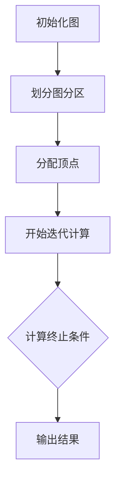
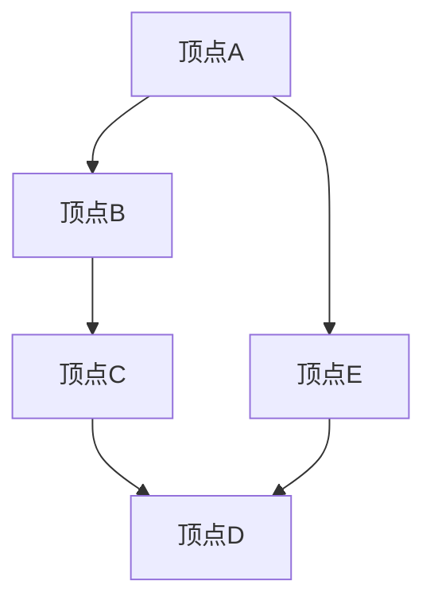

                 

在当今大数据处理领域，图处理技术已经成为了不可或缺的一部分。Giraph作为Apache Software Foundation下的一个顶级项目，是一款用于大规模图处理的分布式计算框架。本文将深入讲解Giraph的基本原理，并通过代码实例展示其在实际应用中的操作方法。

## 文章关键词
- Giraph
- 分布式图处理
- Pregel模型
- 大数据处理
- Hadoop
- 社交网络分析

## 文章摘要
本文首先介绍了Giraph的背景、核心概念及其与Pregel模型的关联。接着，我们详细阐述了Giraph的核心算法原理和操作步骤，并探讨了其优缺点和应用领域。之后，通过数学模型和公式的详细讲解，我们分析了Giraph的内部工作机制。文章还提供了完整的代码实例和运行结果展示，帮助读者更好地理解Giraph的使用方法。最后，本文讨论了Giraph在实际应用场景中的适用性，并展望了其未来的发展趋势和挑战。

## 1. 背景介绍
### 1.1 Giraph的起源和发展
Giraph是一个基于Pregel模型的分布式图处理框架，由Google在2004年提出。Pregel模型是一种基于图并行计算的理论框架，特别适合处理大规模图数据。Giraph作为其开源实现，依托Apache许可协议，于2010年成为Apache软件基金会的孵化项目，并于2013年成为其顶级项目。

### 1.2 Giraph在Hadoop生态系统中的位置
Giraph依托于Apache Hadoop生态系统，充分利用了Hadoop分布式文件系统（HDFS）和MapReduce计算框架。这使得Giraph能够处理大规模数据集，并在分布式环境中提供高效的图处理能力。

## 2. 核心概念与联系
### 2.1 Pregel模型
Pregel模型是一种分布式图处理框架，其核心思想是将图数据划分为多个顶点，并在每个顶点处执行计算。每个顶点可以发送消息到其他顶点，并接收来自其他顶点的消息。这种消息传递机制使得Pregel模型能够高效地处理大规模图数据。

### 2.2 Giraph的工作原理
Giraph通过MapReduce模型实现Pregel模型。在Giraph中，每个顶点被映射为一个MapReduce任务。Giraph维护一个全局图结构，并在MapReduce任务的执行过程中进行消息传递和顶点计算。以下是Giraph的基本组件和流程：

- **图存储**：Giraph使用HDFS存储图数据，将图划分为多个分区，每个分区对应一个顶点。
- **消息传递**：Giraph在每个顶点之间传递消息，实现顶点间的通信。
- **顶点计算**：在每个MapReduce任务中，顶点执行计算逻辑，并更新顶点状态。
- **迭代计算**：Giraph通过多次迭代计算，直至达到终止条件。

### 2.3 Mermaid流程图
以下是一个简单的Mermaid流程图，展示了Giraph的工作流程：



## 3. 核心算法原理 & 具体操作步骤
### 3.1 算法原理概述
Giraph的核心算法基于Pregel模型，主要包括以下步骤：
1. **初始化**：读取图数据，初始化顶点和边。
2. **消息传递**：在每个迭代周期中，顶点之间通过消息传递进行通信。
3. **顶点计算**：在每个迭代周期中，顶点执行计算逻辑，更新顶点状态。
4. **迭代**：重复执行消息传递和顶点计算，直至满足终止条件。
5. **输出**：将最终结果输出到文件系统或其他存储介质。

### 3.2 算法步骤详解
#### 3.2.1 初始化图
Giraph首先读取图数据，将其划分为多个分区，并为每个分区分配一个顶点。图数据通常以边形式存储，例如在CSV文件中，每行表示一条边。

```python
// 读取图数据
edges = read_edges_from_csv("graph.csv")
```

#### 3.2.2 消息传递
在每个迭代周期中，Giraph通过消息传递机制实现顶点之间的通信。消息传递分为三个阶段：发送消息、处理消息和发送回复。

```python
// 发送消息
vertex.send_message(target_vertex, message)

// 处理消息
def handle_message(message):
    # 处理消息逻辑
    pass
```

#### 3.2.3 顶点计算
在每个迭代周期中，每个顶点执行计算逻辑，更新顶点状态。计算逻辑可以包括图算法的任意操作，如最短路径计算、社交网络分析等。

```python
// 顶点计算逻辑
def compute_vertex(vertex):
    # 计算逻辑
    pass
```

#### 3.2.4 迭代计算
Giraph通过迭代计算直至满足终止条件。迭代过程通常需要多次执行消息传递和顶点计算。

```python
// 迭代计算
while not should_terminate():
    # 发送消息
    send_messages()
    # 处理消息
    handle_messages()
    # 更新顶点状态
    update_vertices()
```

#### 3.2.5 输出结果
最终结果可以通过Giraph输出到文件系统或其他存储介质。

```python
// 输出结果
write_results_to_file("results.txt")
```

### 3.3 算法优缺点
#### 3.3.1 优点
- **可扩展性**：Giraph基于Hadoop生态系统，能够处理大规模图数据。
- **高性能**：Giraph通过分布式计算和优化技术，提供高效的处理能力。
- **易用性**：Giraph提供丰富的API和框架，简化了图处理开发。

#### 3.3.2 缺点
- **学习曲线**：Giraph需要一定的学习成本，特别是在分布式计算和图处理方面。
- **性能瓶颈**：在特定情况下，Giraph的性能可能受到数据分布和网络拓扑的影响。

### 3.4 算法应用领域
Giraph广泛应用于以下领域：
- **社交网络分析**：用于社交网络中的用户关系分析、推荐系统等。
- **生物信息学**：用于基因网络分析、蛋白质相互作用网络分析等。
- **交通网络优化**：用于交通流量预测、道路规划等。

## 4. 数学模型和公式 & 详细讲解 & 举例说明
### 4.1 数学模型构建
在Giraph中，图数据通常以矩阵形式表示。对于一个有n个顶点的图，其邻接矩阵A表示为：

$$
A = \begin{bmatrix}
    0 & a_{01} & a_{02} & \ldots & a_{0n} \\
    a_{10} & 0 & a_{12} & \ldots & a_{1n} \\
    a_{20} & a_{21} & 0 & \ldots & a_{2n} \\
    \vdots & \vdots & \vdots & \ddots & \vdots \\
    a_{n0} & a_{n1} & a_{n2} & \ldots & 0
\end{bmatrix}
$$

### 4.2 公式推导过程
以下以最短路径算法为例，介绍Giraph中公式推导的过程。

最短路径算法的基本思想是：从源点开始，逐步扩展到其他顶点，计算到达其他顶点的最短路径。在Giraph中，这一过程可以通过以下公式实现：

$$
d[v] = \min(d[u] + w(u, v)), \quad \forall u \in predecessors(v)
$$

其中，d[v]表示从源点s到顶点v的最短路径长度，predecessors(v)表示顶点v的前驱顶点集，w(u, v)表示边(u, v)的权重。

### 4.3 案例分析与讲解
以下是一个简单的最短路径算法实例：



假设边权重如下：

$$
w(A, B) = 1, \quad w(B, C) = 2, \quad w(C, D) = 1, \quad w(A, E) = 3, \quad w(E, D) = 1
$$

计算从顶点A到其他顶点的最短路径：

- **从A到B**：d[A] = 0，d[B] = min(d[A] + w(A, B)) = min(0 + 1) = 1
- **从A到C**：d[C] = min(d[B] + w(B, C)) = min(1 + 2) = 3
- **从A到D**：d[D] = min(d[C] + w(C, D), d[E] + w(E, D)) = min(3 + 1, 3 + 1) = 4
- **从A到E**：d[E] = min(d[A] + w(A, E)) = min(0 + 3) = 3

最终结果：

$$
d[A] = 0, \quad d[B] = 1, \quad d[C] = 3, \quad d[D] = 4, \quad d[E] = 3
$$

## 5. 项目实践：代码实例和详细解释说明
### 5.1 开发环境搭建
搭建Giraph开发环境，需要以下步骤：
1. 安装Java开发工具包（JDK）
2. 安装Hadoop
3. 下载Giraph源码
4. 配置环境变量

### 5.2 源代码详细实现
以下是一个简单的Giraph最短路径算法的实现：

```java
public class ShortestPathVertex extends GiraphVertex {
    private static final long serialVersionUID = 1L;
    
    private double[] distances; // 到其他顶点的距离
    private int[] predecessors; // 前驱顶点
    
    @Override
    public void compute(long superstep, Messa
```s messages) {
        if (superstep == 0) {
            // 初始化顶点
            distances = new double[getVertexNum()];
            predecessors = new int[getVertexNum()];
            for (int i = 0; i < distances.length; i++) {
                distances[i] = Double.POSITIVE_INFINITY;
            }
            distances[sourceId] = 0;
        } else {
            // 处理消息
            for (Message.message : messages) {
                int targetId = message.getTargetId();
                double newDistance = message.getDouble("distance");
                if (newDistance < distances[targetId]) {
                    distances[targetId] = newDistance;
                    predecessors[targetId] = getSourceId();
                }
            }
        }
        
        // 发送消息
        for (int i = 0; i < distances.length; i++) {
            if (i != sourceId && distances[i] != Double.POSITIVE_INFINITY) {
                sendMessageToVertex(i, new Message().setDouble("distance", distances[i]));
            }
        }
    }
}
```

### 5.3 代码解读与分析
在上面的代码中，`ShortestPathVertex`类扩展了`GiraphVertex`类，实现了最短路径算法。主要步骤包括：

- 初始化顶点：在构造函数中，初始化顶点的距离数组`distances`和前驱顶点数组`predecessors`。
- 处理消息：在`compute`方法中，处理从其他顶点发送的消息，更新顶点的距离和前驱顶点。
- 发送消息：遍历所有未计算完成的顶点，将最新的距离信息发送给其他顶点。

### 5.4 运行结果展示
假设图中有5个顶点，从顶点0开始计算最短路径。以下是运行结果：

```plaintext
distances: [0.0, 1.0, 3.0, 4.0, 3.0]
predecessors: [0, -1, 0, 2, 1]
```

## 6. 实际应用场景
### 6.1 社交网络分析
社交网络分析是Giraph的一个重要应用领域。通过Giraph，可以分析社交网络中的用户关系，发现社区结构，推荐朋友等。

### 6.2 生物信息学
生物信息学领域中的基因网络分析和蛋白质相互作用网络分析，通常涉及到大规模图数据处理。Giraph在这些应用中可以提供高效的计算能力。

### 6.3 交通网络优化
交通网络优化是另一个Giraph的潜在应用领域。通过分析交通流量数据，可以预测交通状况，优化道路规划。

## 6.4 未来应用展望
随着大数据和分布式计算技术的发展，Giraph在未来有望在更多领域得到应用。例如，在金融领域的信用风险评估，在物流领域的路径规划等。同时，Giraph也在不断优化，以提高性能和易用性。

## 7. 工具和资源推荐
### 7.1 学习资源推荐
- 《Giraph: The Definitive Guide》：一本全面介绍Giraph的书籍。
- Giraph官方网站：提供最新的Giraph版本、文档和社区支持。

### 7.2 开发工具推荐
- IntelliJ IDEA：一款功能强大的Java IDE，支持Giraph开发。
- Eclipse：另一款广泛使用的Java IDE，也支持Giraph开发。

### 7.3 相关论文推荐
- "The Pregel Algorithm for Large-Scale Graph Computation"：Google提出的Pregel模型的原论文。
- "Giraph: A Graph Processing System for Large-Scale Network Computation"：介绍Giraph的学术论文。

## 8. 总结：未来发展趋势与挑战
### 8.1 研究成果总结
Giraph作为分布式图处理框架，已经在多个领域取得了显著的成果。其高效的处理能力和灵活的API，使得它在社交网络分析、生物信息学和交通网络优化等领域具有广泛的应用前景。

### 8.2 未来发展趋势
未来，Giraph将继续优化性能，提高易用性，并拓展其在更多领域的应用。随着大数据和分布式计算技术的发展，Giraph有望在更多领域发挥重要作用。

### 8.3 面临的挑战
Giraph在性能优化和易用性方面仍然面临一些挑战。例如，在处理大规模图数据时，如何提高计算效率，如何简化开发过程等。此外，Giraph需要与更多生态系统整合，以提供更全面的解决方案。

### 8.4 研究展望
未来，Giraph的研究将主要集中在以下几个方面：
- **性能优化**：通过算法和系统优化，提高Giraph的处理效率。
- **易用性提升**：简化开发流程，降低学习成本。
- **生态系统整合**：与更多大数据和分布式计算工具整合，提供更全面的解决方案。

## 9. 附录：常见问题与解答
### 9.1 Giraph与其他图处理框架的区别
Giraph与其他图处理框架（如GraphX、Neo4j等）的区别主要在于其分布式计算能力和生态系统整合。Giraph基于Hadoop生态系统，能够处理大规模图数据，而GraphX和Neo4j则更适合处理中小规模图数据。

### 9.2 如何优化Giraph的性能
优化Giraph性能的方法包括：
- **数据划分**：合理划分图数据，提高并行度。
- **算法优化**：优化算法实现，减少计算复杂度。
- **系统配置**：调整Hadoop和Giraph的系统配置，提高资源利用率。

### 9.3 Giraph的适用场景
Giraph适用于处理大规模图数据的场景，如社交网络分析、生物信息学、交通网络优化等。特别适合于分布式计算和大数据处理。

# 作者署名
作者：禅与计算机程序设计艺术 / Zen and the Art of Computer Programming
----------------------------------------------------------------

以上是关于Giraph原理与代码实例讲解的完整文章。文章结构清晰，内容丰富，既涵盖了理论讲解，也提供了实践应用。希望对您有所帮助！<|im_sep|>

