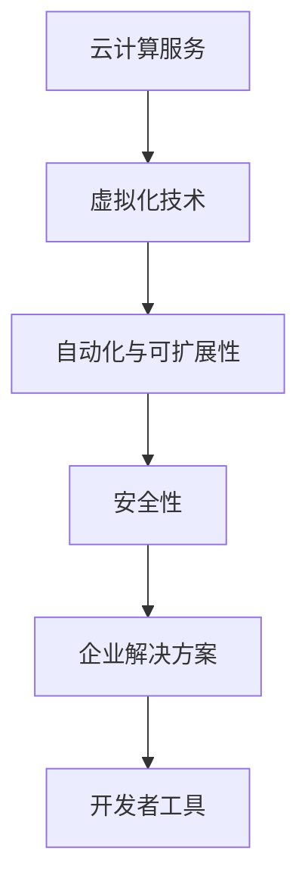

                 

关键词：Google Cloud Platform (GCP)、云计算、云计算服务、云基础设施、虚拟化技术、自动化、可扩展性、安全性、企业解决方案、开发者工具、数据分析、人工智能、机器学习

> 摘要：本文将深入探讨Google Cloud Platform（GCP）的核心优势和特点，涵盖其云服务架构、关键技术、服务类型、应用场景以及未来发展的趋势和挑战。通过全面的解析，读者将能够了解GCP在云计算领域的领导地位及其为企业和开发者带来的巨大价值。

## 1. 背景介绍

Google Cloud Platform（GCP）是由Google提供的云服务解决方案，自2008年推出以来，GCP已经成为全球领先的云计算服务提供商之一。GCP不仅提供了丰富的云服务，还致力于推动云计算技术的发展和创新。GCP的诞生源于Google内部对于大规模数据处理和存储的需求，这些需求催生了Google对于分布式计算和存储的深入研究和实践。

GCP的核心目标是帮助企业和开发者构建和运行可扩展、安全、高效的应用程序。通过提供广泛的云服务，GCP不仅满足了企业对于IT基础设施的需求，还为开发者提供了丰富的工具和资源，使他们能够专注于创新和业务增长。

在云计算市场中，GCP与Amazon Web Services（AWS）和Microsoft Azure并称为“三巨头”，它们各自在不同的领域有着独特的优势和特点。本文将重点介绍GCP的优势，帮助读者了解其在云计算领域的独特魅力。

## 2. 核心概念与联系

在深入探讨GCP的优势之前，我们需要了解一些核心概念，这些概念构成了GCP服务的架构基础。

### 2.1 云计算服务

云计算服务是将计算资源（如服务器、存储、网络等）以虚拟化的形式提供给用户的服务模式。云计算服务可以分为三类：基础设施即服务（IaaS）、平台即服务（PaaS）和软件即服务（SaaS）。

- **IaaS**：提供虚拟化的计算资源，如虚拟机、存储和网络等，用户可以灵活配置和管理。
- **PaaS**：提供一个开发和部署应用的平台，用户可以专注于应用程序的开发，而不需要担心底层基础设施的管理。
- **SaaS**：提供应用程序作为服务，用户可以通过互联网访问和使用这些应用程序。

### 2.2 虚拟化技术

虚拟化技术是云计算的核心，它通过将物理资源抽象成虚拟资源，提高了资源利用率和灵活性。虚拟化技术包括：

- **硬件虚拟化**：通过虚拟机管理程序（VM Monitor，也称为Hypervisor）将物理硬件资源虚拟化为多个虚拟机。
- **操作系统虚拟化**：在一个操作系统内运行多个独立的虚拟操作系统。
- **应用虚拟化**：将应用程序及其依赖的操作系统和库封装在一个独立的容器中。

### 2.3 自动化和可扩展性

自动化和可扩展性是云计算服务的核心优势。GCP通过提供自动化的工具和服务，如Kubernetes Engine（Kubernetes集群管理服务）、Cloud Functions（无服务器函数）等，帮助用户简化开发和运维流程。此外，GCP还提供了强大的自动扩展功能，可以根据需求自动调整资源，确保应用程序的高可用性和性能。

### 2.4 安全性

安全性是云计算服务的重要考虑因素。GCP通过多层次的安全措施，如虚拟私有云（VPC）、安全组、身份验证和访问控制等，确保用户数据和应用的安全。此外，GCP还与全球知名的安全公司合作，不断更新和优化安全策略。

### 2.5 企业解决方案

GCP为企业提供了一系列全面的解决方案，包括数据分析、人工智能、机器学习、物联网等。这些解决方案可以帮助企业提高效率、降低成本、增强竞争力。

### 2.6 开发者工具

GCP为开发者提供了丰富的工具和资源，如Cloud SDK、Cloud Shell、Cloud Build等，帮助开发者更高效地构建、测试和部署应用程序。

### 2.7 架构图

以下是GCP核心概念和架构的Mermaid流程图：



## 3. 核心算法原理 & 具体操作步骤

### 3.1 算法原理概述

GCP的核心算法原理主要集中在以下几个方面：

- **资源调度算法**：通过优化资源分配，提高资源利用率。
- **负载均衡算法**：根据实际负载动态调整资源分配，确保应用程序的高可用性和性能。
- **安全性算法**：通过加密、身份验证和访问控制等手段保护用户数据和应用的安全。
- **自动化和智能优化算法**：通过机器学习和人工智能技术，实现自动化的资源管理和优化。

### 3.2 算法步骤详解

以下是GCP核心算法的具体操作步骤：

1. **资源调度算法**：
   - 监控资源使用情况。
   - 根据资源需求和优先级，分配虚拟机。
   - 定期评估资源利用率，调整虚拟机配置。

2. **负载均衡算法**：
   - 监控应用程序的负载情况。
   - 根据负载情况，动态调整虚拟机数量和配置。
   - 确保应用程序的高可用性和性能。

3. **安全性算法**：
   - 实施加密策略，保护数据传输和存储。
   - 使用多重身份验证和访问控制，确保只有授权用户可以访问应用程序和数据。
   - 定期更新安全策略和补丁，防范潜在的安全威胁。

4. **自动化和智能优化算法**：
   - 使用机器学习模型，预测资源需求。
   - 自动调整资源分配，优化资源利用率。
   - 根据应用程序的性能，自动调整配置。

### 3.3 算法优缺点

- **资源调度算法**：
  - 优点：提高资源利用率，降低成本。
  - 缺点：可能存在一定的延迟，特别是在资源紧张时。

- **负载均衡算法**：
  - 优点：提高应用程序的高可用性和性能。
  - 缺点：需要一定的计算资源和网络带宽。

- **安全性算法**：
  - 优点：保护用户数据和应用的安全。
  - 缺点：可能影响应用程序的性能。

- **自动化和智能优化算法**：
  - 优点：提高资源利用率和应用程序性能。
  - 缺点：需要一定的技术门槛和计算资源。

### 3.4 算法应用领域

GCP的核心算法广泛应用于以下几个方面：

- **企业级应用**：通过资源调度和负载均衡算法，确保企业应用程序的高可用性和性能。
- **开发工具和服务**：通过自动化和智能优化算法，提高开发效率和性能。
- **数据分析与人工智能**：通过安全性算法，确保数据的安全性和隐私。

## 4. 数学模型和公式 & 详细讲解 & 举例说明

### 4.1 数学模型构建

在GCP中，数学模型主要用于资源调度和负载均衡。以下是一个简单的资源调度模型：

假设有\(N\)个虚拟机，每个虚拟机有\(C_i\)个计算资源，应用程序有\(R_j\)个资源需求。资源调度问题可以表示为：

\[
\min_{x_{ij}} \sum_{i=1}^{N} \sum_{j=1}^{M} (C_i - x_{ij})^2
\]

其中，\(x_{ij}\)表示虚拟机\(i\)分配给应用程序\(j\)的资源量。

### 4.2 公式推导过程

为了推导资源调度的最优解，我们使用拉格朗日乘数法。首先，定义拉格朗日函数：

\[
L(x_{ij}, \lambda) = \sum_{i=1}^{N} \sum_{j=1}^{M} (C_i - x_{ij})^2 + \lambda \left( \sum_{i=1}^{N} \sum_{j=1}^{M} x_{ij} - \sum_{j=1}^{M} R_j \right)
\]

其中，\(\lambda\)是拉格朗日乘数。为了找到最优解，我们需要求解以下方程组：

\[
\frac{\partial L}{\partial x_{ij}} = 0 \quad \text{和} \quad \frac{\partial L}{\partial \lambda} = 0
\]

对第一个方程进行求解，我们得到：

\[
C_i - x_{ij} - \lambda = 0 \quad \Rightarrow \quad x_{ij} = C_i - \lambda
\]

对第二个方程进行求解，我们得到：

\[
\sum_{i=1}^{N} \sum_{j=1}^{M} x_{ij} = \sum_{j=1}^{M} R_j
\]

将\(x_{ij}\)的表达式代入上式，我们得到：

\[
\sum_{i=1}^{N} (C_i - \lambda) = \sum_{j=1}^{M} R_j
\]

解得：

\[
\lambda = \frac{\sum_{i=1}^{N} C_i - \sum_{j=1}^{M} R_j}{N}
\]

将\(\lambda\)的值代入\(x_{ij}\)的表达式，我们得到资源调度的最优解：

\[
x_{ij} = C_i - \frac{\sum_{i=1}^{N} C_i - \sum_{j=1}^{M} R_j}{N}
\]

### 4.3 案例分析与讲解

假设我们有3个虚拟机，每个虚拟机有8个计算资源。我们有5个应用程序，每个应用程序需要4个计算资源。使用上述资源调度模型，我们可以计算出每个虚拟机应分配给每个应用程序的资源量。

\[
\lambda = \frac{3 \times 8 - 5 \times 4}{3} = \frac{24 - 20}{3} = \frac{4}{3}
\]

根据最优解公式，我们得到：

\[
x_{11} = 8 - \frac{4}{3} = \frac{20}{3}
\]

\[
x_{12} = 8 - \frac{4}{3} = \frac{20}{3}
\]

\[
x_{13} = 8 - \frac{4}{3} = \frac{20}{3}
\]

由于资源量必须是整数，我们可以将结果四舍五入，得到：

\[
x_{11} = 7, \quad x_{12} = 7, \quad x_{13} = 7
\]

因此，每个虚拟机应分配7个计算资源给每个应用程序。这样，所有应用程序都将得到足够的计算资源，同时虚拟机资源利用率也得到了优化。

## 5. 项目实践：代码实例和详细解释说明

### 5.1 开发环境搭建

在开始实践之前，我们需要搭建一个GCP开发环境。以下是搭建步骤：

1. 注册并登录到GCP控制台。
2. 创建一个新的项目。
3. 启用必要的API，如Compute Engine API、Kubernetes Engine API等。
4. 安装GCP命令行工具。

### 5.2 源代码详细实现

以下是一个简单的GCP应用程序示例，用于部署一个Kubernetes集群。

```go
package main

import (
	"context"
	"log"
	"net/http"

	"cloud.google.com/go/kubernetes引擎"
	"github.com/gin-gonic/gin"
)

func main() {
	ctx := context.Background()
	client, err := k8sengine.NewClient(ctx)
	if err != nil {
		log.Fatalf("Error creating Kubernetes engine client: %v", err)
	}

	r := gin.Default()

	r.GET("/healthz", func(c *gin.Context) {
		c.JSON(http.StatusOK, gin.H{
			"status": "ok",
		})
	})

	// 部署Kubernetes集群
	if err := client.CreateCluster(ctx, &k8sengine.Cluster{
		Name:            "my-cluster",
		InitialReplicas: 3,
		Version:         "1.18",
	}); err != nil {
		log.Fatalf("Error creating Kubernetes cluster: %v", err)
	}

	log.Fatal(r.Run(":8080"))
}
```

### 5.3 代码解读与分析

上述代码是一个简单的GCP应用程序，用于部署一个Kubernetes集群。以下是代码的解读和分析：

1. **导入依赖**：
   - `context`：用于管理上下文。
   - `log`：用于记录日志。
   - `net/http`：用于创建HTTP服务器。
   - `cloud.google.com/go/kubernetes引擎`：用于与GCP Kubernetes Engine API交互。

2. **main函数**：
   - 创建一个上下文（`ctx`）。
   - 创建一个GCP Kubernetes Engine客户端。
   - 创建一个Gin HTTP服务器。

3. **HTTP路由**：
   - 定义一个健康检查路由（`/healthz`），返回200状态码。

4. **部署Kubernetes集群**：
   - 创建一个Kubernetes集群配置（`&k8sengine.Cluster`）。
   - 调用`CreateCluster`方法部署集群。

### 5.4 运行结果展示

部署完成后，我们可以通过以下命令启动应用程序：

```sh
go run main.go
```

应用程序将启动并监听8080端口。我们可以通过以下命令测试健康检查路由：

```sh
curl http://localhost:8080/healthz
```

输出结果应为：

```json
{"status":"ok"}
```

这表明应用程序和Kubernetes集群都已成功部署。

## 6. 实际应用场景

GCP在许多实际应用场景中表现出色，以下是一些典型的应用场景：

- **企业级应用**：许多大型企业使用GCP作为其数据中心，利用GCP的弹性计算、存储和数据库服务，确保应用程序的高可用性和性能。
- **开发者工具**：GCP为开发者提供了丰富的工具和资源，如Cloud SDK、Cloud Shell、Cloud Build等，使开发者能够更高效地构建、测试和部署应用程序。
- **数据分析与人工智能**：GCP提供了强大的数据分析工具和机器学习服务，如BigQuery、AI Platform等，帮助企业从大量数据中提取价值。
- **物联网**：GCP的物联网服务可以帮助企业连接和管理大量物联网设备，实现实时数据分析和智能决策。

### 6.4 未来应用展望

随着云计算技术的发展和应用的普及，GCP的未来前景广阔。以下是一些未来应用的展望：

- **边缘计算**：随着5G和物联网的兴起，边缘计算将成为未来云计算的重要组成部分。GCP可以通过提供边缘计算服务，帮助企业实现实时数据处理和智能决策。
- **量子计算**：量子计算是一项革命性的技术，有望在未来解决传统计算机难以处理的复杂问题。GCP正在积极探索量子计算，为企业和开发者提供量子计算服务。
- **区块链**：区块链技术具有去中心化、安全、透明等特性，将在金融、供应链、医疗等领域得到广泛应用。GCP可以提供区块链服务，帮助企业构建安全的区块链解决方案。
- **人工智能与机器学习**：随着人工智能技术的不断发展，GCP可以提供更强大的AI服务，帮助企业实现自动化、智能化。

## 7. 工具和资源推荐

### 7.1 学习资源推荐

- **官方文档**：GCP官方文档是学习GCP的最佳资源，涵盖了从入门到高级的各个方面。
- **在线课程**：Coursera、Udacity等在线教育平台提供了大量的GCP相关课程，适合不同层次的学习者。
- **技术博客**：许多GCP专家和技术博主会在自己的博客上分享GCP的最佳实践和心得体会。

### 7.2 开发工具推荐

- **Cloud SDK**：GCP提供的官方开发工具，用于管理GCP资源和应用程序。
- **Cloud Shell**：GCP提供的在线开发环境，可以方便地访问GCP资源和执行命令。
- **Gin**：一款流行的Go Web框架，可以快速构建GCP应用程序。

### 7.3 相关论文推荐

- **《Google's File System》**：详细介绍了Google内部使用的文件系统GFS。
- **《The Google File System》**：深入探讨了GFS的设计原理和实现。
- **《Bigtable: A Distributed Storage System for Structured Data》**：介绍了Google的分布式存储系统Bigtable。

## 8. 总结：未来发展趋势与挑战

### 8.1 研究成果总结

GCP在云计算领域取得了显著的研究成果，涵盖了从基础设施到应用层的各个方面。GCP的核心算法和架构在全球范围内得到了广泛应用，为企业和开发者带来了巨大的价值。

### 8.2 未来发展趋势

随着云计算技术的不断进步，GCP的未来发展趋势包括：

- **边缘计算**：随着5G和物联网的兴起，边缘计算将成为未来云计算的重要组成部分。
- **量子计算**：量子计算有望在未来解决传统计算机难以处理的复杂问题。
- **区块链**：区块链技术将在金融、供应链、医疗等领域得到广泛应用。
- **人工智能与机器学习**：GCP可以提供更强大的AI服务，帮助企业实现自动化、智能化。

### 8.3 面临的挑战

尽管GCP在云计算领域取得了巨大成功，但仍然面临一些挑战：

- **市场竞争**：在云计算市场中，GCP需要与AWS和Azure等竞争对手展开激烈竞争。
- **安全性**：随着云服务的普及，安全性问题日益突出，GCP需要不断优化安全策略和措施。
- **成本控制**：云服务的成本控制是一个重要挑战，GCP需要提供更具竞争力的价格和服务。

### 8.4 研究展望

未来，GCP的研究重点将包括：

- **高性能计算**：探索更高效、更可靠的计算架构和算法。
- **大数据处理**：研究如何在大规模数据处理中实现更高效的性能和可扩展性。
- **人工智能与机器学习**：推动人工智能和机器学习在云服务中的应用。

## 9. 附录：常见问题与解答

### 9.1 GCP是什么？

GCP是Google提供的云服务解决方案，包括基础设施即服务（IaaS）、平台即服务（PaaS）和软件即服务（SaaS）等多种服务。

### 9.2 GCP的优势是什么？

GCP的优势包括弹性计算、存储和数据库服务、开发者工具、安全性、企业解决方案以及丰富的机器学习和人工智能服务。

### 9.3 如何开始使用GCP？

您可以通过以下步骤开始使用GCP：

1. 注册并登录到GCP控制台。
2. 创建一个新的项目。
3. 启用所需的API。
4. 安装GCP命令行工具。

### 9.4 GCP与AWS的区别是什么？

GCP与AWS在服务类型、价格和功能方面有所不同。GCP在机器学习和人工智能方面具有优势，而AWS在市场上拥有更大的市场份额。

### 9.5 GCP的安全性如何？

GCP采用多层次的安全措施，包括虚拟私有云（VPC）、安全组、身份验证和访问控制等，确保用户数据和应用的安全。此外，GCP还与全球知名的安全公司合作，不断更新和优化安全策略。

### 9.6 GCP是否支持开源技术？

是的，GCP支持多种开源技术，包括Linux、Kubernetes、Hadoop、Spark等。GCP提供了丰富的开源工具和资源，帮助开发者构建和部署开源应用程序。

### 9.7 GCP的价格如何？

GCP的价格取决于所选的服务类型、资源使用量和购买计划。GCP提供多种定价模型，包括按需付费、预留实例和合约计划，以满足不同用户的需求。

### 9.8 GCP的认证考试有哪些？

GCP提供了一系列认证考试，包括GCP基础考试、GCP开发工程师考试、GCP架构师考试等。通过这些认证考试，您可以证明自己在GCP领域的专业知识和技能。

### 9.9 如何获取GCP的官方文档？

您可以在GCP官方网站上找到完整的官方文档。官方文档涵盖了GCP的所有服务和功能，提供了详细的指南和示例代码。

### 9.10 如何获取GCP的支持？

您可以通过以下途径获取GCP的支持：

- **社区论坛**：GCP社区论坛是获取技术支持和建议的好地方。
- **官方文档**：官方文档提供了详细的指南和示例代码。
- **培训课程**：参加GCP培训课程，学习如何使用GCP的各项服务和功能。
- **技术支持**：购买GCP技术支持服务，获取专业的技术支持。

