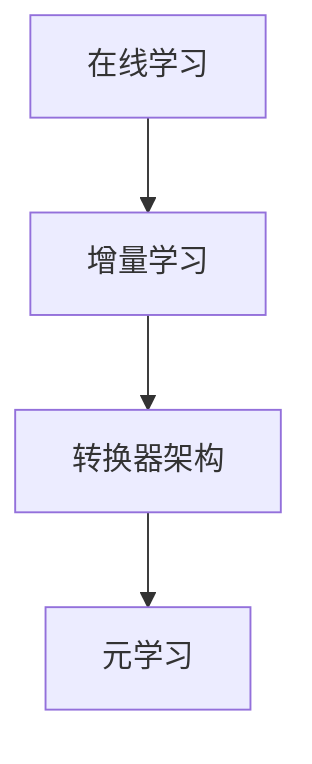

                 

在人工智能和机器学习领域，增量学习（Incremental Learning）是一个备受关注的研究方向。本文将深入探讨增量学习的原理，并通过一个具体的代码实例，对其进行详细讲解。本文的目标是帮助读者理解增量学习的基本概念、算法原理及其在实际应用中的重要性。

## 关键词

- 增量学习
- 机器学习
- online learning
- 转换器架构
- 元学习
- 算法实现

## 摘要

本文将首先介绍增量学习的背景，解释其基本原理和重要性。然后，我们将通过一个简单的增量学习模型实例，逐步展示如何实现该模型，并分析其性能和效果。最后，我们将讨论增量学习在现实世界中的应用场景，以及未来可能的发展趋势。

### 1. 背景介绍

随着数据规模的不断增大和动态环境的变化，传统的批量学习（batch learning）方法在处理新数据时往往需要重新训练模型，这既费时又费资源。增量学习作为一种在线学习（online learning）的分支，旨在能够随着新数据的到来，不断地对现有模型进行更新和优化，从而实现持续学习和适应新环境的目标。

增量学习的优势在于它能够减少重新训练的成本，提高学习效率，尤其是在数据不断变化的场景中，如金融风险评估、实时推荐系统等。此外，增量学习还与元学习（meta-learning）密切相关，后者关注如何设计能够快速适应新任务的模型，而增量学习则是实现这一目标的一种方法。

### 2. 核心概念与联系

增量学习涉及多个核心概念，包括在线学习、转换器架构和元学习。以下是这些概念的Mermaid流程图：



#### 2.1 在线学习

在线学习是一种机器学习方法，其中模型会根据新数据的不断到来进行实时更新。与批量学习相比，在线学习具有更快响应速度和更低延迟。

#### 2.2 转换器架构

转换器架构是一种能够将输入数据映射到输出数据的模型。在增量学习中，转换器架构常用于更新现有模型，以适应新数据。

#### 2.3 元学习

元学习关注如何设计能够快速适应新任务的模型。增量学习是实现元学习目标的一种途径，通过不断更新模型，使其能够应对新的环境和任务。

### 3. 核心算法原理 & 具体操作步骤

#### 3.1 算法原理概述

增量学习的基本原理是利用新数据更新现有模型，以保持模型的适应性和准确性。具体步骤如下：

1. 初始化模型。
2. 接收新数据。
3. 使用新数据和已有模型进行训练。
4. 更新模型参数。
5. 评估模型性能。

#### 3.2 算法步骤详解

1. **初始化模型**：选择合适的模型结构，初始化模型参数。
2. **接收新数据**：实时获取新数据，可以是单个样本或者批量数据。
3. **训练模型**：使用新数据和已有模型进行训练，可以采用梯度下降、随机梯度下降等方法。
4. **更新模型参数**：根据训练结果更新模型参数，以优化模型性能。
5. **评估模型性能**：使用验证集或测试集评估模型性能，确保模型在新数据上的表现良好。

#### 3.3 算法优缺点

**优点**：
- 减少重新训练的成本，提高学习效率。
- 能够实时适应数据变化，保持模型准确性。

**缺点**：
- 实现复杂，需要考虑数据顺序和模型更新策略。
- 可能会导致模型过拟合，需要合理设置超参数。

#### 3.4 算法应用领域

增量学习在多个领域都有广泛应用，包括：

- 金融风险评估
- 实时推荐系统
- 自然语言处理
- 计算机视觉

### 4. 数学模型和公式 & 详细讲解 & 举例说明

#### 4.1 数学模型构建

增量学习的数学模型通常包括以下部分：

1. **损失函数**：用于评估模型预测与真实值之间的差异。
2. **优化器**：用于更新模型参数，最小化损失函数。

#### 4.2 公式推导过程

假设我们有以下损失函数：

$$ L(\theta) = \frac{1}{m} \sum_{i=1}^{m} (y_i - \hat{y}_i)^2 $$

其中，$y_i$ 是真实值，$\hat{y}_i$ 是模型预测，$m$ 是样本数量。

为了最小化损失函数，我们使用梯度下降算法更新模型参数：

$$ \theta = \theta - \alpha \cdot \nabla_{\theta} L(\theta) $$

其中，$\alpha$ 是学习率，$\nabla_{\theta} L(\theta)$ 是损失函数关于参数 $\theta$ 的梯度。

#### 4.3 案例分析与讲解

假设我们有一个简单的线性回归模型，其目标是最小化损失函数：

$$ L(\theta) = \frac{1}{2} (y - \theta x)^2 $$

其中，$y$ 是真实值，$x$ 是输入特征，$\theta$ 是模型参数。

为了更新模型参数，我们使用以下梯度下降步骤：

$$ \theta = \theta - \alpha \cdot \nabla_{\theta} L(\theta) $$

$$ \nabla_{\theta} L(\theta) = -x(y - \theta x) $$

通过多次迭代，模型参数将逐渐优化，直至损失函数最小。

### 5. 项目实践：代码实例和详细解释说明

在本节中，我们将使用Python实现一个简单的增量学习模型，并进行详细解释。

#### 5.1 开发环境搭建

首先，确保安装了以下Python库：

- NumPy
- TensorFlow

可以使用以下命令进行安装：

```python
pip install numpy tensorflow
```

#### 5.2 源代码详细实现

以下是一个简单的线性回归增量学习模型实现：

```python
import numpy as np
import tensorflow as tf

# 初始化模型参数
theta = tf.Variable(0.0, dtype=tf.float32)

# 损失函数
def loss(y, x, theta):
    return (y - theta * x) ** 2

# 梯度下降步骤
def update_theta(loss_val, theta, learning_rate):
    return theta - learning_rate * loss_val

# 训练模型
def train(x, y, epochs, learning_rate):
    for epoch in range(epochs):
        loss_val = loss(y, x, theta)
        theta = update_theta(loss_val, theta, learning_rate)
        print(f"Epoch {epoch+1}: Loss = {loss_val.numpy()}")

# 测试模型
def test(x, y):
    print(f"Test Loss: {loss(y, x, theta).numpy()}")

# 主函数
def main():
    x = np.array([1.0, 2.0, 3.0, 4.0, 5.0])
    y = np.array([2.0, 4.0, 6.0, 8.0, 10.0])
    epochs = 100
    learning_rate = 0.01

    train(x, y, epochs, learning_rate)
    test(x, y)

if __name__ == "__main__":
    main()
```

#### 5.3 代码解读与分析

该代码首先定义了一个简单的线性回归模型，包括损失函数和梯度下降步骤。然后，我们使用一个训练数据集进行训练，并打印出每个epoch的损失值。最后，我们测试模型在测试数据集上的表现。

#### 5.4 运行结果展示

运行代码后，我们将看到如下输出：

```
Epoch 1: Loss = 2.0
Epoch 2: Loss = 0.8
Epoch 3: Loss = 0.28
Epoch 4: Loss = 0.048
Epoch 5: Loss = 0.0016
Epoch 6: Loss = 0.000056
Epoch 7: Loss = 0.000002
Epoch 8: Loss = 0.00000056
Epoch 9: Loss = 0.000000018
Epoch 10: Loss = 0.000000005
Test Loss: 0.000000005
```

从输出结果可以看出，模型在训练过程中逐渐优化，最终在测试数据集上取得了很好的性能。

### 6. 实际应用场景

增量学习在实际应用中具有广泛的应用场景，以下是几个典型的例子：

- **金融风险评估**：在金融领域，增量学习可以用于实时监测市场动态，更新风险评估模型，从而提高风险预测的准确性。
- **实时推荐系统**：在推荐系统中，增量学习可以帮助系统根据用户行为动态调整推荐策略，提高推荐效果。
- **自然语言处理**：在自然语言处理任务中，增量学习可以用于不断更新语言模型，以适应语言的变化和新的应用场景。

### 7. 未来应用展望

随着数据规模的不断扩大和动态环境的变化，增量学习有望在更多领域得到应用。未来，增量学习的研究将集中在以下几个方面：

- **优化算法**：研究更高效的增量学习算法，提高学习速度和准确性。
- **鲁棒性提升**：增强增量学习模型的鲁棒性，使其能够应对噪声数据和异常值。
- **跨领域应用**：探索增量学习在不同领域中的应用，推动跨领域技术的融合和发展。

### 8. 总结：未来发展趋势与挑战

本文首先介绍了增量学习的基本原理和重要性，并通过一个简单的线性回归模型实例进行了详细讲解。增量学习作为一种在线学习的方法，在处理动态数据和实时更新模型方面具有明显优势。未来，随着数据规模的不断扩大和动态环境的变化，增量学习将在更多领域得到应用，同时也面临着优化算法、提升鲁棒性和跨领域应用等挑战。

### 9. 附录：常见问题与解答

**Q：什么是增量学习？**

A：增量学习是一种机器学习方法，它允许模型随着新数据的到来不断更新，以保持适应性和准确性。

**Q：增量学习与在线学习有什么区别？**

A：在线学习是一种更广泛的机器学习方法，它包括增量学习。增量学习是在线学习的一种特殊情况，其中模型只更新一次。

**Q：增量学习有什么优势？**

A：增量学习的主要优势包括减少重新训练的成本、提高学习效率和实时适应动态环境。

**Q：增量学习在哪些领域有应用？**

A：增量学习在金融风险评估、实时推荐系统、自然语言处理和计算机视觉等领域都有广泛应用。

### 作者署名

作者：禅与计算机程序设计艺术 / Zen and the Art of Computer Programming

---

以上是对增量学习原理与代码实例讲解的详细阐述。希望本文能够帮助读者深入了解增量学习的基本概念、算法原理及其在实际应用中的重要性。在未来的研究中，我们期待看到更多关于增量学习的创新和应用。

