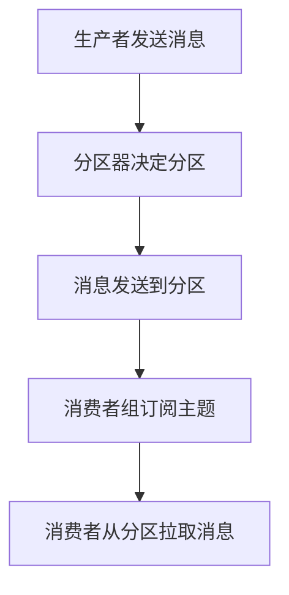

                 

 Kafka是一种分布式流处理平台，广泛用于处理实时数据流。本文将深入探讨Kafka生产者消费者API的原理，并提供代码实例以帮助读者更好地理解。

## 1. 背景介绍

Kafka是一个开源的分布式流处理平台，由LinkedIn公司开发，目前由Apache软件基金会管理。它最初是为了解决LinkedIn的大规模数据处理需求而创建的，后来逐渐成为了大数据领域的重要组件之一。Kafka主要用于处理实时数据流，支持发布-订阅消息传递模式，提供高吞吐量、可扩展性和持久性。

在Kafka中，有两个核心组件：生产者（Producers）和消费者（Consumers）。生产者负责生成和发送消息，而消费者负责接收和消费消息。这两个组件通过Kafka的分布式主题（Topics）进行通信。

## 2. 核心概念与联系

### 2.1. 生产者

生产者是Kafka系统中的消息生成者。它的主要职责是将数据转换为消息，并将这些消息发送到Kafka集群中的主题上。生产者可以是任何应用程序或服务，例如Web服务器、应用程序服务器或消息代理。

生产者API主要包括以下几个关键概念：

- **主题（Topic）**：主题是一个分类消息的逻辑容器。每个主题可以有多个分区（Partitions），分区是消息存储的基本单位。
- **分区器（Partitioner）**：分区器决定了消息应该被发送到哪个分区。默认情况下，Kafka使用散列分区器，将消息的键（Key）进行散列，然后选择散列值对应的分区。
- **应答模式（Acknowledgements）**：应答模式决定了生产者在发送消息后需要等待多少确认。有三种模式：0（不需要确认）、1（单服务器确认）和-1（所有服务器确认）。

### 2.2. 消费者

消费者是Kafka系统中的消息接收者。它们从主题的分区中读取消息，并执行相应的业务逻辑。消费者可以是任何应用程序或服务，例如数据处理器或数据分析工具。

消费者API主要包括以下几个关键概念：

- **消费者组（Consumer Group）**：消费者组是一组协同工作的消费者。每个消费者组都有自己的ID，并且组内的消费者会订阅同一个主题的不同分区。
- **偏移量（Offsets）**：偏移量是消息在分区中的唯一标识。消费者通过偏移量来跟踪它们消费到的位置。
- **拉取模式（Fetch Mode）**：拉取模式决定了消费者如何从服务器拉取消息。有两种模式：自动拉取和手动拉取。

### 2.3. 主题和分区

主题是一个分类消息的逻辑容器，它类似于数据库中的表。每个主题可以有多个分区，分区是消息存储的基本单位。分区提供水平扩展的能力，使得Kafka可以处理大量数据。

主题和分区之间的联系如下：

- 每个主题都有一个唯一的名称。
- 每个主题可以有多个分区，分区数量可以动态调整。
- 分区内的消息是有序的，但不同分区之间的消息是无序的。
- 分区可以跨多个服务器分布，以提高系统的吞吐量和可用性。

### 2.4. Mermaid流程图



## 3. 核心算法原理 & 具体操作步骤

### 3.1. 算法原理概述

Kafka的生产者和消费者API遵循以下原理：

- 生产者将消息发送到主题的分区。
- 分区器决定消息应该被发送到哪个分区。
- 消息在分区中被持久化并按照顺序存储。
- 消费者从主题的分区中拉取消息并执行业务逻辑。

### 3.2. 算法步骤详解

#### 生产者

1. 创建Kafka生产者实例。
2. 将消息转换为Kafka消息格式。
3. 设置分区器，默认为散列分区器。
4. 发送消息到Kafka集群。
5. 设置应答模式，确保消息被正确发送。

#### 消费者

1. 创建Kafka消费者实例。
2. 设置消费者组ID。
3. 订阅主题的分区。
4. 从分区中拉取消息。
5. 处理并执行业务逻辑。
6. 提交偏移量，以便跟踪消费位置。

### 3.3. 算法优缺点

**优点：**

- 高吞吐量：Kafka可以处理大量消息，支持高并发。
- 可扩展性：通过分区可以水平扩展系统。
- 持久性：消息被持久化存储，保证数据不丢失。

**缺点：**

- 无内置的分布式锁：需要手动实现。
- 实时性：对于一些实时性要求极高的应用，可能需要额外的优化。

### 3.4. 算法应用领域

Kafka广泛应用于以下领域：

- 实时数据处理：处理大规模实时数据流。
- 日志收集：收集和存储应用程序日志。
- 消息传递：实现应用程序之间的消息传递。
- 实时分析：实时分析和处理数据。

## 4. 数学模型和公式 & 详细讲解 & 举例说明

### 4.1. 数学模型构建

Kafka的生产者和消费者模型可以用以下数学模型表示：

- 生产者：生成消息并计算消息的分区。
- 消费者：从分区中拉取消息并处理。

### 4.2. 公式推导过程

假设生产者生成了n个消息，每个消息有一个键k，主题有m个分区。我们可以用以下公式表示：

- 分区数p = floor(k % m)

### 4.3. 案例分析与讲解

假设有一个包含10个分区的主题，生产者生成了20个消息，其中10个消息的键为1到10，另外10个消息的键为11到20。根据分区公式，我们可以计算出每个消息应该被发送到哪个分区。

例如，消息键为1的消息应该被发送到分区0，消息键为10的消息应该被发送到分区9。

## 5. 项目实践：代码实例和详细解释说明

### 5.1. 开发环境搭建

要运行Kafka生产者和消费者示例，需要安装Kafka服务器和相应的客户端库。可以参考Kafka官方文档进行安装。

### 5.2. 源代码详细实现

以下是Kafka生产者和消费者的示例代码：

#### 生产者

```python
from kafka import KafkaProducer

producer = KafkaProducer(bootstrap_servers=['localhost:9092'])

for i in range(10):
    message = f'Message {i}'
    producer.send('my-topic', value=message.encode('utf-8'))

producer.flush()
```

#### 消费者

```python
from kafka import KafkaConsumer

consumer = KafkaConsumer('my-topic', bootstrap_servers=['localhost:9092'])

for message in consumer:
    print(f'Message: {message.value.decode("utf-8")}')
```

### 5.3. 代码解读与分析

上述代码展示了如何使用Python中的kafka库创建Kafka生产者和消费者。生产者将消息发送到指定主题的分区，消费者从分区中拉取消息并打印。

### 5.4. 运行结果展示

运行生产者代码后，将生成10个消息并将其发送到Kafka集群。运行消费者代码后，将接收并打印这些消息。

## 6. 实际应用场景

Kafka在生产环境中具有广泛的应用场景：

- 实时数据处理：用于处理大规模实时数据流，例如网站点击流、交易数据和传感器数据。
- 日志收集：用于收集和存储应用程序日志，便于监控和分析。
- 消息传递：用于实现分布式系统中不同模块之间的消息传递。
- 实时分析：用于实时分析和处理数据，提供实时业务洞察。

## 7. 工具和资源推荐

### 7.1. 学习资源推荐

- [Kafka官方文档](https://kafka.apache.org/documentation/)
- [Kafka实战](https://www.manning.com/books/kafka-in-action)

### 7.2. 开发工具推荐

- [Kafka Manager](https://www.kafka-manager.com/)
- [Kafka Tools](https://github.com/edenhill/kafka-tools)

### 7.3. 相关论文推荐

- ["Kafka: A Distributed Streaming Platform"](https://www.usenix.org/system/files/conference/jdd14/jdd14-paper-zaharia.pdf)

## 8. 总结：未来发展趋势与挑战

Kafka作为分布式流处理平台，在实时数据处理领域具有广泛的应用前景。未来，Kafka将朝着更高效、更易用和更安全的方向发展。同时，面临的挑战包括分布式系统的复杂性、数据安全性和可靠性等。

## 9. 附录：常见问题与解答

### 9.1. Kafka的生产者和消费者有什么区别？

生产者是负责生成和发送消息的组件，而消费者是负责接收和消费消息的组件。生产者将消息发送到Kafka集群，消费者从集群中拉取并处理消息。

### 9.2. 如何确保Kafka消息的可靠性？

Kafka提供了多种可靠性保证机制，包括应答模式、持久性和副本机制。通过选择合适的应答模式和配置副本数量，可以确保消息的可靠传输和存储。

### 9.3. 如何优化Kafka的性能？

可以通过增加分区数量、使用高性能服务器和优化网络配置来提高Kafka的性能。此外，合理配置生产者和消费者的缓冲区和拉取模式也可以提高系统的性能。

作者：禅与计算机程序设计艺术 / Zen and the Art of Computer Programming
----------------------------------------------------------------

以上就是关于Kafka生产者消费者API原理与代码实例讲解的详细文章。通过本文的介绍，读者应该能够对Kafka的核心概念、原理和应用有了更深入的理解。希望这篇文章能帮助您更好地掌握Kafka的使用方法和技巧。如果您有任何问题或建议，欢迎在评论区留言。谢谢！

