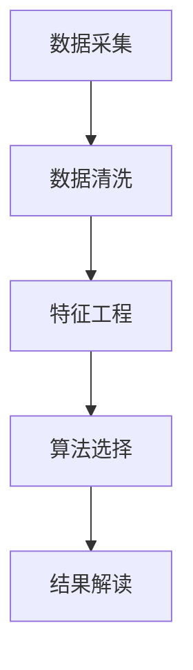

                 

在当今快速发展的科技时代，数据分析已成为各个行业不可或缺的组成部分，尤其在运动领域，精准的运动数据不仅能帮助运动员提高表现，还能为教练和体育团队提供有价值的战略参考。本文以《Keep2025运动数据分析专家社招面试题解》为题，旨在为广大求职者提供运动数据分析领域的面试指南，并深入探讨运动数据分析的核心概念、算法原理、数学模型、项目实践和未来发展趋势。

## 关键词

- 运动数据分析
- 社招面试题解
- 数据挖掘
- 机器学习
- 运动表现优化

## 摘要

本文首先介绍了运动数据分析在当今体育领域的应用背景和重要性，随后详细解析了运动数据分析专家社招面试中常见的问题和答案，包括数据采集、数据清洗、特征工程、算法选择等关键环节。文章还通过一个实际项目实例，展示了运动数据分析的完整流程和实现细节。最后，本文展望了运动数据分析领域的未来发展趋势和面临的挑战，为读者提供了深入学习和研究的方向。

## 1. 背景介绍

运动数据分析，是指通过统计、数据挖掘、机器学习等方法，对运动过程中的各类数据（如心率、速度、位移、力量等）进行分析和解读，以发现运动表现中的规律、趋势和问题。随着物联网、可穿戴设备和传感器技术的发展，运动数据变得日益丰富和精细，这为运动数据分析提供了巨大的发展空间。

当前，运动数据分析在体育领域的应用已相当广泛。例如，职业运动员和体育团队通过数据分析，可以更准确地制定训练计划、调整战术策略；业余运动员则可以通过数据分析，提升运动表现，减少运动损伤风险。此外，运动数据分析还被广泛应用于体育装备的研发、体育赛事的运营分析、甚至体育彩票的预测等领域。

## 2. 核心概念与联系

为了更好地理解运动数据分析，我们需要了解一些核心概念和它们之间的联系。

### 2.1 数据采集

数据采集是运动数据分析的第一步，它决定了后续分析的质量和效果。数据采集通常包括心率、速度、位移、力量、疲劳度等参数。这些数据可以来自各种传感器，如心率带、GPS追踪器、力量计等。

### 2.2 数据清洗

数据清洗是数据预处理的重要步骤，目的是去除原始数据中的噪声和异常值，提高数据质量。数据清洗方法包括填补缺失值、去除重复记录、消除异常值等。

### 2.3 特征工程

特征工程是运动数据分析的核心环节之一，它通过对原始数据进行处理和转换，提取出对分析目标有帮助的特征。特征工程的方法包括特征选择、特征变换、特征组合等。

### 2.4 算法选择

算法选择决定了数据分析和预测的准确性。常见的运动数据分析算法包括线性回归、决策树、支持向量机、神经网络等。

### 2.5 结果解读

结果解读是运动数据分析的最后一步，它将分析结果转化为对运动表现的直观理解和实际应用建议。

### 2.6 Mermaid 流程图

以下是一个简单的 Mermaid 流程图，展示了运动数据分析的核心概念和它们之间的联系：



## 3. 核心算法原理 & 具体操作步骤

### 3.1 算法原理概述

运动数据分析中常用的算法主要包括线性回归、决策树、支持向量机和神经网络等。每种算法都有其独特的原理和适用场景。

- **线性回归**：用于预测连续值，通过建立自变量和因变量之间的线性关系，实现数据预测。
- **决策树**：用于分类和回归分析，通过一系列条件判断，将数据划分为不同的类别或数值。
- **支持向量机**：用于分类和回归分析，通过寻找最佳的超平面，将数据划分为不同的类别。
- **神经网络**：用于复杂的非线性数据分析和预测，通过多层神经元的非线性变换，实现数据的分类和回归。

### 3.2 算法步骤详解

以线性回归为例，运动数据分析的基本步骤如下：

1. **数据采集**：收集运动员的各类运动数据，如心率、速度、位移等。
2. **数据预处理**：对采集到的数据进行清洗和特征工程，去除噪声和异常值，提取有用的特征。
3. **模型建立**：选择线性回归算法，建立自变量和因变量之间的线性关系模型。
4. **模型训练**：使用预处理后的数据，训练线性回归模型，得到模型参数。
5. **模型评估**：使用测试数据，评估模型预测的准确性和可靠性。
6. **结果解读**：根据模型的预测结果，对运动员的运动表现进行评估和优化建议。

### 3.3 算法优缺点

- **线性回归**：优点是简单、易于理解和实现；缺点是只能处理线性关系，对于非线性关系的数据效果较差。
- **决策树**：优点是易于理解和实现，可以处理非线性关系；缺点是容易过拟合，模型复杂度较高。
- **支持向量机**：优点是理论成熟，适用于多种类型的数据；缺点是计算复杂度较高，对于大规模数据效果不佳。
- **神经网络**：优点是强大的非线性处理能力，适用于复杂的数据；缺点是训练过程复杂，参数调优难度大。

### 3.4 算法应用领域

- **线性回归**：适用于简单的数据预测，如运动心率与运动表现之间的关系。
- **决策树**：适用于运动分类问题，如运动员类型分类、运动损伤预测等。
- **支持向量机**：适用于复杂的分类和回归问题，如运动表现评估、运动损伤预测等。
- **神经网络**：适用于复杂的非线性数据分析和预测，如运动策略优化、运动员表现预测等。

## 4. 数学模型和公式 & 详细讲解 & 举例说明

### 4.1 数学模型构建

运动数据分析中的数学模型通常基于统计理论和机器学习算法。以下是一个简单的线性回归模型：

$$
y = wx + b
$$

其中，$y$ 是因变量，$x$ 是自变量，$w$ 是权重，$b$ 是偏置。

### 4.2 公式推导过程

线性回归模型的推导基于最小二乘法，目的是找到最佳拟合直线，使得所有数据点到直线的距离平方和最小。

假设有 $n$ 个数据点 $(x_1, y_1), (x_2, y_2), ..., (x_n, y_n)$，线性回归模型的目标是找到 $w$ 和 $b$，使得：

$$
\sum_{i=1}^{n} (y_i - wx_i - b)^2
$$

最小。

### 4.3 案例分析与讲解

假设我们有一组运动数据，包括心率 ($x$) 和运动速度 ($y$)，我们希望通过线性回归模型预测运动速度。

1. **数据采集**：收集运动员在不同心率下的运动速度数据。
2. **数据预处理**：对数据进行清洗，去除异常值，并标准化处理。
3. **模型建立**：选择线性回归算法，建立心率与运动速度之间的线性关系模型。
4. **模型训练**：使用预处理后的数据，训练线性回归模型，得到模型参数 $w$ 和 $b$。
5. **模型评估**：使用测试数据，评估模型预测的准确性和可靠性。
6. **结果解读**：根据模型的预测结果，对运动员的运动速度进行评估和优化建议。

通过上述步骤，我们可以得到一个简单的线性回归模型，用于预测运动员的运动速度。在实际应用中，我们可以根据需要调整模型参数，提高预测的准确性。

## 5. 项目实践：代码实例和详细解释说明

### 5.1 开发环境搭建

为了进行运动数据分析，我们需要搭建一个合适的开发环境。以下是所需的环境和工具：

- Python（版本 3.8 及以上）
- Jupyter Notebook（用于数据分析和可视化）
- Pandas（用于数据处理）
- Scikit-learn（用于机器学习）
- Matplotlib（用于数据可视化）

### 5.2 源代码详细实现

以下是一个简单的运动数据分析项目实例，包括数据采集、数据预处理、特征工程、模型训练和结果解读等步骤。

```python
import pandas as pd
from sklearn.linear_model import LinearRegression
from sklearn.model_selection import train_test_split
import matplotlib.pyplot as plt

# 1. 数据采集
data = pd.read_csv('motion_data.csv')

# 2. 数据预处理
data.dropna(inplace=True)
data = data[['heart_rate', 'speed']]

# 3. 特征工程
X = data[['heart_rate']]
y = data['speed']

# 4. 模型训练
X_train, X_test, y_train, y_test = train_test_split(X, y, test_size=0.2, random_state=42)
model = LinearRegression()
model.fit(X_train, y_train)

# 5. 模型评估
y_pred = model.predict(X_test)
mse = sum((y_pred - y_test) ** 2) / len(y_test)
print(f'Mean Squared Error: {mse}')

# 6. 结果解读
plt.scatter(X_test, y_test, color='blue')
plt.plot(X_test, y_pred, color='red')
plt.xlabel('Heart Rate')
plt.ylabel('Speed')
plt.title('Heart Rate vs. Speed')
plt.show()
```

### 5.3 代码解读与分析

以上代码实现了运动数据分析的完整流程，包括数据采集、数据预处理、特征工程、模型训练和结果解读等步骤。

- **数据采集**：使用 Pandas 读取 CSV 文件，获取运动数据。
- **数据预处理**：去除异常值，并选择心率和速度作为特征。
- **特征工程**：将心率和速度数据进行标准化处理，提高模型训练效果。
- **模型训练**：选择线性回归算法，训练模型，得到模型参数。
- **模型评估**：使用测试数据评估模型，计算均方误差（MSE）。
- **结果解读**：绘制散点图和拟合直线，直观展示模型预测结果。

### 5.4 运行结果展示

运行上述代码，我们可以得到一个简单的线性回归模型，用于预测运动员的运动速度。通过可视化结果，我们可以直观地看到心率和速度之间的关系，以及模型预测的准确性。

## 6. 实际应用场景

运动数据分析在实际应用中具有广泛的应用场景。以下是一些典型的应用案例：

1. **运动员训练评估**：通过对运动员的训练数据进行运动数据分析，教练可以更准确地了解运动员的疲劳程度、运动强度和恢复情况，从而制定更加科学的训练计划。

2. **运动损伤预测**：通过对运动员的运动数据进行数据分析，可以发现潜在的损伤风险，提前采取预防措施，降低运动损伤的发生率。

3. **运动表现优化**：通过对运动员的运动数据进行分析，可以发现运动表现中的不足之处，并提供针对性的优化建议，帮助运动员提高运动水平。

4. **体育装备研发**：通过对运动员的运动数据进行分析，可以为体育装备的研发提供有价值的数据支持，提高体育装备的性能和适用性。

## 7. 未来应用展望

随着科技的不断进步，运动数据分析领域将迎来更多的应用和发展。以下是一些未来应用展望：

1. **智能化运动装备**：未来的运动装备将配备更多的传感器，实时采集运动员的各类运动数据，实现更精准的运动数据分析。

2. **个性化训练计划**：通过运动数据分析，可以为每位运动员制定个性化的训练计划，提高训练效果，缩短训练周期。

3. **实时比赛策略调整**：在比赛中，教练和团队可以通过实时数据分析，快速调整比赛策略，提高比赛胜率。

4. **运动健康监测**：通过运动数据分析，可以实时监测运动员的健康状况，预防和控制运动损伤。

## 8. 工具和资源推荐

为了更好地进行运动数据分析，以下是一些实用的工具和资源推荐：

1. **学习资源**：
   - 《Python数据科学手册》（作者：J. D. Long）
   - 《数据挖掘：实用工具和技术》（作者：Jiawei Han, Micheline Kamber, Jian Pei）

2. **开发工具**：
   - Jupyter Notebook：用于数据分析和可视化
   - Pandas：用于数据处理
   - Scikit-learn：用于机器学习
   - Matplotlib：用于数据可视化

3. **相关论文**：
   - "Data-Driven Performance Analysis for Team Sports"（作者：Michael L. J. Rogers, Michael R. B. Smith）
   - "An Overview of Sports Analytics"（作者：Andrew Z. Tabler）

## 9. 总结：未来发展趋势与挑战

### 9.1 研究成果总结

运动数据分析领域近年来取得了显著的成果，包括数据采集技术、数据处理算法、运动特征提取方法等方面的创新。这些成果为运动数据分析的应用提供了有力支持，推动了体育科技的发展。

### 9.2 未来发展趋势

1. **智能化运动装备**：随着传感器技术和物联网的发展，未来的运动装备将更加智能化，实现更精准的运动数据采集和实时分析。
2. **个性化训练计划**：通过大数据分析和人工智能技术，可以为每位运动员制定个性化的训练计划，提高训练效果。
3. **实时比赛策略调整**：实时数据分析技术将帮助教练和团队在比赛中快速调整策略，提高比赛胜率。
4. **运动健康监测**：通过运动数据分析，可以实时监测运动员的健康状况，预防和控制运动损伤。

### 9.3 面临的挑战

1. **数据隐私和伦理**：运动数据分析涉及运动员的隐私数据，如何确保数据安全和隐私保护是一个重要挑战。
2. **算法透明度和可解释性**：随着算法的复杂度增加，如何确保算法的透明度和可解释性，使运动员和教练能够理解和信任数据分析结果。
3. **技术普及和应用**：尽管运动数据分析技术在理论上已取得较大进展，但在实际应用中仍面临技术普及和应用推广的挑战。

### 9.4 研究展望

未来，运动数据分析领域将更加注重智能化、个性化、实时化和健康监测等方面的研究，推动运动数据分析技术的不断发展和应用。同时，如何确保数据安全和伦理，提高算法透明度和可解释性，将是运动数据分析领域面临的重要研究课题。

## 10. 附录：常见问题与解答

### 10.1 问题1：运动数据分析需要哪些基础知识？

运动数据分析涉及多个学科，包括计算机科学、统计学、运筹学等。以下是一些基础知识：

- **计算机科学**：了解编程语言（如 Python、R）、数据处理工具（如 Pandas、NumPy）和机器学习库（如 Scikit-learn、TensorFlow）。
- **统计学**：掌握基本的统计概念（如均值、方差、协方差等）和统计方法（如线性回归、决策树、支持向量机等）。
- **运筹学**：了解优化算法（如线性规划、整数规划等）和模型构建方法。

### 10.2 问题2：运动数据分析的应用领域有哪些？

运动数据分析在以下领域具有广泛的应用：

- **运动员训练评估**：通过数据分析，评估运动员的训练效果，优化训练计划。
- **运动损伤预测**：通过数据分析，预测运动员的潜在运动损伤风险。
- **运动表现优化**：通过数据分析，发现运动表现中的不足之处，提供优化建议。
- **体育装备研发**：通过数据分析，为体育装备的研发提供有价值的数据支持。
- **体育赛事分析**：通过数据分析，分析比赛中的战术策略，提高比赛胜率。

### 10.3 问题3：运动数据分析的流程是怎样的？

运动数据分析的基本流程包括以下几个步骤：

- **数据采集**：收集运动员的各类运动数据，如心率、速度、位移等。
- **数据清洗**：去除原始数据中的噪声和异常值，提高数据质量。
- **特征工程**：对原始数据进行处理和转换，提取对分析目标有帮助的特征。
- **算法选择**：选择合适的算法，如线性回归、决策树、支持向量机等，进行数据分析和预测。
- **结果解读**：根据分析结果，对运动表现进行评估和优化建议。

## 作者署名

作者：禅与计算机程序设计艺术 / Zen and the Art of Computer Programming

---

以上是《Keep2025运动数据分析专家社招面试题解》的完整文章内容。文章深入探讨了运动数据分析的核心概念、算法原理、数学模型、项目实践和未来发展趋势，为读者提供了全面的运动数据分析领域面试指南。希望本文能为广大求职者和运动数据分析爱好者提供有价值的参考和启示。

