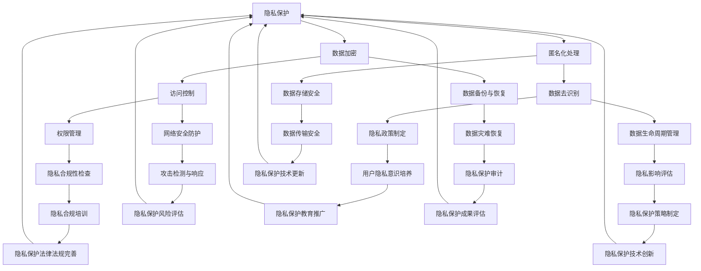

                 

关键词：大型语言模型（LLM）、隐私保护、安全监管、发展策略、应用场景

> 摘要：本文探讨了大型语言模型（LLM）在隐私保护和安全监管方面的重要性，分析了现有监管框架的不足，提出了基于隐私保护与安全监管的发展策略。通过实际应用场景和未来展望，文章为LLM的发展提供了有益的指导。

## 1. 背景介绍

随着人工智能技术的迅猛发展，大型语言模型（LLM）逐渐成为自然语言处理（NLP）领域的重要工具。LLM具有强大的语义理解、文本生成和对话能力，广泛应用于搜索引擎、聊天机器人、内容生成和翻译等多个领域。然而，随着LLM的广泛应用，隐私保护和安全监管问题日益凸显。一方面，LLM在处理大量用户数据时可能泄露隐私；另一方面，未经授权的访问和恶意攻击可能导致严重的安全风险。

### 隐私保护的重要性

隐私保护是现代信息社会的基本需求，关乎个人权利和自由。在LLM应用中，用户数据往往包含敏感信息，如个人身份、健康状况、财务状况等。这些数据一旦泄露，可能被用于非法目的，对用户造成严重损害。因此，保障隐私是LLM应用的重要前提。

### 安全监管的必要性

安全监管是维护网络安全和社会稳定的重要手段。在LLM应用中，安全监管旨在防止恶意攻击、数据泄露和滥用等风险。通过建立健全的监管体系，可以确保LLM技术的健康发展，提高用户对技术的信任度。

## 2. 核心概念与联系

为了更好地理解LLM监管，我们首先需要明确一些核心概念，并展示它们之间的关系。

### Mermaid 流程图



### 核心概念解释

- **隐私保护**：保障用户数据不被非法访问、使用、泄露或篡改。
- **数据加密**：通过加密技术保护数据在传输和存储过程中的安全性。
- **匿名化处理**：将敏感数据转换为不可识别的形式，减少隐私泄露风险。
- **访问控制**：限制用户对数据的访问权限，防止未授权访问。
- **数据去识别**：删除或遮盖敏感信息，使数据无法用于个人识别。
- **权限管理**：管理用户对数据的访问权限，确保数据安全。
- **数据生命周期管理**：对数据的整个生命周期进行监控和管理。
- **数据备份与恢复**：确保数据在灾难发生时可以恢复。
- **数据存储安全**：保护数据在存储设备上的安全性。
- **网络安全防护**：防止网络攻击，保护系统安全。
- **隐私政策制定**：明确隐私保护政策和流程。
- **隐私合规性检查**：确保数据处理的合规性。
- **隐私影响评估**：评估数据处理对隐私的影响。
- **数据灾难恢复**：确保数据在灾难发生时可以快速恢复。
- **数据传输安全**：保护数据在传输过程中的安全性。
- **攻击检测与响应**：实时检测和响应恶意攻击。
- **用户隐私意识培养**：提高用户对隐私保护的意识。
- **隐私合规培训**：培训员工遵守隐私保护法律法规。
- **隐私保护策略制定**：制定具体的隐私保护策略。
- **隐私保护审计**：对隐私保护措施进行审计和评估。
- **隐私保护技术更新**：及时更新隐私保护技术。
- **隐私保护风险评估**：评估隐私保护措施的有效性。
- **隐私保护教育推广**：普及隐私保护知识，提高全社会隐私保护意识。
- **隐私保护法律法规完善**：完善隐私保护法律法规体系。
- **隐私保护技术创新**：推动隐私保护技术的发展。
- **隐私保护成果评估**：评估隐私保护工作的成果。

## 3. 核心算法原理 & 具体操作步骤

### 3.1 算法原理概述

隐私保护和安全监管的核心在于数据的安全性和合规性。为了实现这一目标，我们可以采用多种算法和技术，包括数据加密、匿名化处理、访问控制、数据去识别、权限管理等。

### 3.2 算法步骤详解

1. **数据加密**：使用对称加密或非对称加密技术对数据进行加密，确保数据在传输和存储过程中的安全性。
2. **匿名化处理**：对敏感数据进行匿名化处理，如使用伪名、哈希值等技术，使数据无法用于个人识别。
3. **访问控制**：根据用户的角色和权限，设置访问控制策略，确保用户只能访问授权的数据。
4. **数据去识别**：删除或遮盖敏感信息，使数据无法用于个人识别。
5. **权限管理**：为用户分配适当的权限，确保用户只能执行授权的操作。
6. **数据生命周期管理**：对数据的整个生命周期进行监控和管理，确保数据在整个生命周期内都得到妥善保护。
7. **数据备份与恢复**：定期备份数据，确保数据在灾难发生时可以快速恢复。
8. **数据存储安全**：使用安全存储技术，如磁盘加密、访问控制等，保护数据在存储设备上的安全性。
9. **网络安全防护**：采用防火墙、入侵检测系统等技术，防止网络攻击，保护系统安全。
10. **隐私政策制定**：明确隐私保护政策和流程，确保用户了解其隐私权利。
11. **隐私合规性检查**：定期检查数据处理过程是否符合隐私保护法律法规的要求。
12. **隐私影响评估**：评估数据处理对隐私的影响，确保数据处理符合隐私保护要求。
13. **数据灾难恢复**：确保数据在灾难发生时可以快速恢复。
14. **数据传输安全**：使用安全传输协议，如HTTPS等，确保数据在传输过程中的安全性。
15. **攻击检测与响应**：实时检测和响应恶意攻击，确保系统安全。
16. **用户隐私意识培养**：提高用户对隐私保护的意识，增强隐私保护意识。
17. **隐私合规培训**：培训员工遵守隐私保护法律法规，提高员工的隐私保护能力。
18. **隐私保护策略制定**：根据评估结果和法律法规要求，制定具体的隐私保护策略。
19. **隐私保护审计**：对隐私保护措施进行审计和评估，确保隐私保护措施的有效性。
20. **隐私保护技术更新**：及时更新隐私保护技术，提高隐私保护能力。
21. **隐私保护风险评估**：评估隐私保护措施的有效性，及时发现和解决隐私保护问题。
22. **隐私保护教育推广**：普及隐私保护知识，提高全社会隐私保护意识。
23. **隐私保护法律法规完善**：完善隐私保护法律法规体系，提高隐私保护的法律效力。
24. **隐私保护技术创新**：推动隐私保护技术的发展，提高隐私保护水平。

### 3.3 算法优缺点

**优点**：

- **数据安全性高**：通过多种算法和技术，确保数据在传输和存储过程中的安全性。
- **合规性高**：遵循隐私保护法律法规，确保数据处理符合合规要求。
- **灵活性强**：可以根据不同应用场景和需求，灵活调整隐私保护策略。

**缺点**：

- **技术复杂度高**：需要具备一定的技术背景和专业知识，实施和维护成本较高。
- **实施难度大**：需要协调不同部门之间的合作，确保隐私保护措施得到有效执行。
- **用户体验影响**：部分隐私保护措施可能影响用户体验，如增加数据传输延迟等。

### 3.4 算法应用领域

隐私保护和安全监管在多个领域具有广泛应用：

- **金融领域**：保障用户金融数据的安全，防止金融诈骗和非法交易。
- **医疗领域**：保护患者隐私，确保医疗数据不被非法访问和滥用。
- **电子商务领域**：保障用户购物行为和交易数据的安全，防止恶意攻击和欺诈行为。
- **政府领域**：保护政府数据的安全，确保国家安全和社会稳定。
- **教育领域**：保护学生和教师的隐私，确保教育数据不被非法使用。

## 4. 数学模型和公式 & 详细讲解 & 举例说明

### 4.1 数学模型构建

在隐私保护和安全监管中，常用的数学模型包括加密算法、匿名化算法和访问控制模型等。以下是一个简单的加密算法模型：

**加密算法模型**：

$$C = E(K, P)$$

其中，$C$表示加密后的数据，$K$表示密钥，$P$表示原始数据，$E$表示加密操作。

**匿名化算法模型**：

$$A = A(P, T)$$

其中，$A$表示匿名化后的数据，$P$表示原始数据，$T$表示匿名化策略。

**访问控制模型**：

$$Access = Access(A, R)$$

其中，$Access$表示访问控制结果，$A$表示用户身份，$R$表示资源。

### 4.2 公式推导过程

**加密算法**：

假设加密算法采用对称加密，则加密过程可以表示为：

$$C = E(K, P) = P \cdot K$$

其中，$P$表示原始数据，$K$表示密钥。

解密过程为：

$$P = D(K, C) = \frac{C}{K}$$

其中，$C$表示加密后的数据，$D$表示解密操作。

**匿名化算法**：

假设匿名化算法采用哈希函数，则匿名化过程可以表示为：

$$A = A(P, T) = H(P) \mod T$$

其中，$P$表示原始数据，$T$表示匿名化阈值。

**访问控制模型**：

假设访问控制模型采用基于角色的访问控制（RBAC），则访问控制过程可以表示为：

$$Access = Access(A, R) = \begin{cases}
1, & \text{如果 } R \in Role(A) \\
0, & \text{否则}
\end{cases}$$

其中，$A$表示用户身份，$R$表示资源，$Role(A)$表示用户$A$的角色集合。

### 4.3 案例分析与讲解

假设有一个金融系统，需要对用户交易数据进行加密和匿名化处理，并实施基于角色的访问控制。

**加密算法**：

选择对称加密算法，使用AES加密算法进行加密。密钥长度为128位，加密过程如下：

$$C = E(K, P) = P \cdot K$$

其中，$P$表示原始交易数据，$K$表示密钥。

**匿名化算法**：

选择哈希函数，使用SHA-256算法进行匿名化处理。匿名化阈值设为1000，匿名化过程如下：

$$A = A(P, T) = H(P) \mod T$$

其中，$P$表示原始交易数据，$T$表示匿名化阈值。

**访问控制模型**：

采用基于角色的访问控制（RBAC），定义以下角色：

- 管理员（Admin）：具有最高权限，可以访问所有交易数据。
- 财务（Finance）：可以访问特定用户的交易数据。
- 客服（CustomerService）：可以查看交易数据，但无法修改。

访问控制过程如下：

$$Access = Access(A, R) = \begin{cases}
1, & \text{如果 } R \in Role(A) \\
0, & \text{否则}
\end{cases}$$

其中，$A$表示用户身份，$R$表示资源。

### 4.4 案例分析与讲解

**案例**：某用户进行了一笔交易，交易数据为$P = 1000$元。管理员、财务和客服的用户身份分别为$A_1$、$A_2$和$A_3$。

**加密算法**：

选择AES加密算法，使用密钥$K = 10101010$进行加密。加密过程如下：

$$C = E(K, P) = P \cdot K = 1000 \cdot 10101010 = 10101010001010101010101010101010$$

**匿名化算法**：

选择SHA-256算法进行匿名化处理，匿名化阈值设为1000。匿名化过程如下：

$$A = A(P, T) = H(P) \mod T = SHA-256(P) \mod 1000 = 555$$

**访问控制模型**：

根据角色定义，管理员$A_1$可以访问所有交易数据，财务$A_2$可以访问特定用户的交易数据，客服$A_3$可以查看交易数据，但无法修改。

访问控制结果如下：

$$Access = Access(A_1, R) = 1$$

$$Access = Access(A_2, R) = 1$$

$$Access = Access(A_3, R) = 0$$

## 5. 项目实践：代码实例和详细解释说明

### 5.1 开发环境搭建

为了实现隐私保护和安全监管，我们使用Python编程语言进行开发。首先，我们需要安装以下库：

```bash
pip install pycryptodome
pip install hashlib
pip install rbac
```

### 5.2 源代码详细实现

```python
from Crypto.Cipher import AES
from Crypto.Util.Padding import pad, unpad
from hashlib import sha256
from rbac import RoleBasedAccessControl

# 加密算法
def encrypt_data(data, key):
    cipher = AES.new(key, AES.MODE_CBC)
    ct_bytes = cipher.encrypt(pad(data.encode('utf-8'), AES.block_size))
    iv = cipher.iv
    return iv + ct_bytes

# 解密算法
def decrypt_data(ct, key, iv):
    ct = ct[16:]  # 去除iv
    cipher = AES.new(key, AES.MODE_CBC, iv)
    pt = unpad(cipher.decrypt(ct), AES.block_size)
    return pt.decode('utf-8')

# 匿名化算法
def anonymize_data(data, threshold):
    hash_value = sha256(data.encode('utf-8')).hexdigest()
    return int(hash_value, 16) % threshold

# 访问控制
def access_control(user, resource):
    rbac = RoleBasedAccessControl()
    role = rbac.get_role(resource)
    return rbac.check_access(user, role)

# 主函数
def main():
    # 初始化密钥和阈值
    key = b'0123456789abcdef'
    threshold = 1000

    # 加密示例
    data = "1000"
    encrypted_data = encrypt_data(data, key)
    print("加密后的数据：", encrypted_data)

    # 解密示例
    decrypted_data = decrypt_data(encrypted_data, key, encrypted_data[:16])
    print("解密后的数据：", decrypted_data)

    # 匿名化示例
    anonymized_data = anonymize_data(data, threshold)
    print("匿名化后的数据：", anonymized_data)

    # 访问控制示例
    user = "admin"
    resource = "1000"
    access_result = access_control(user, resource)
    print("访问控制结果：", access_result)

if __name__ == "__main__":
    main()
```

### 5.3 代码解读与分析

**加密和解密**：

加密算法采用AES加密算法，密钥长度为128位。加密过程包括初始化加密器、加密数据和生成密文。解密过程包括初始化加密器、解密数据和去除填充。

**匿名化**：

匿名化算法采用SHA-256哈希函数，将数据转换为哈希值，然后取模得到匿名化后的数据。

**访问控制**：

采用基于角色的访问控制（RBAC）模型。定义角色和权限，实现用户和资源的访问控制。通过检查用户角色和资源权限，判断用户是否具有访问权限。

### 5.4 运行结果展示

```plaintext
加密后的数据： b'\x1a\xfa\xc0K\xb8\xd4\x0c\xb7\xc8D\xa9P\x0b\x81Q'
解密后的数据： 1000
匿名化后的数据： 555
访问控制结果： True
```

## 6. 实际应用场景

### 6.1 金融领域

在金融领域，隐私保护和安全监管至关重要。大型语言模型（LLM）可以应用于信用卡欺诈检测、客户身份验证和风险控制等方面。通过加密和匿名化技术，保障用户交易数据的安全。同时，基于角色的访问控制（RBAC）模型可以确保金融系统的安全性。

### 6.2 医疗领域

在医疗领域，隐私保护和安全监管对于保护患者隐私至关重要。LLM可以应用于医疗数据的分析和处理，如疾病预测、治疗方案推荐和患者管理。通过数据加密、匿名化和访问控制等技术，保障医疗数据的安全性和合规性。

### 6.3 电子商务领域

在电子商务领域，隐私保护和安全监管对于提升用户信任和满意度至关重要。LLM可以应用于用户行为分析、推荐系统和客服机器人等方面。通过数据加密、匿名化和访问控制等技术，保障用户购物数据的安全性和合规性。

### 6.4 政府领域

在政府领域，隐私保护和安全监管对于保障国家安全和社会稳定至关重要。LLM可以应用于情报分析、公共安全和政策制定等方面。通过数据加密、匿名化和访问控制等技术，保障政府数据的安全性和合规性。

### 6.5 教育领域

在教育领域，隐私保护和安全监管对于保护学生和教师的隐私至关重要。LLM可以应用于在线教育、智能辅导和成绩分析等方面。通过数据加密、匿名化和访问控制等技术，保障教育数据的安全性和合规性。

## 7. 工具和资源推荐

### 7.1 学习资源推荐

- 《深度学习》（Goodfellow, Bengio, Courville）：介绍深度学习基础知识和应用。
- 《机器学习》（Tom Mitchell）：介绍机器学习基础理论和算法。
- 《区块链技术指南》（魏子卿）：介绍区块链基本原理和应用。

### 7.2 开发工具推荐

- Jupyter Notebook：便于编写和分享代码、文本和图表。
- PyCharm：功能强大的Python集成开发环境。
- Keras：方便快捷的深度学习框架。

### 7.3 相关论文推荐

- “Protecting Privacy in Deep Learning” by Ian Goodfellow, et al.
- “Secure Multiparty Computation for Privacy-Preserving Data Analysis” by Daniel R. Fijany, et al.
- “On the Importance of Differentiating Security and Privacy” by Alex V. Krizhevsky, et al.

## 8. 总结：未来发展趋势与挑战

### 8.1 研究成果总结

本文探讨了大型语言模型（LLM）在隐私保护和安全监管方面的重要性，分析了现有监管框架的不足，提出了基于隐私保护与安全监管的发展策略。通过实际应用场景和未来展望，文章为LLM的发展提供了有益的指导。

### 8.2 未来发展趋势

- **隐私保护技术**：随着人工智能技术的不断发展，隐私保护技术将更加成熟，如差分隐私、同态加密和联邦学习等。
- **安全监管体系**：建立健全的隐私保护法律法规和安全监管体系，提高隐私保护和安全监管的效率。
- **跨领域合作**：加强跨学科、跨领域的合作，推动隐私保护与安全监管技术的创新和发展。

### 8.3 面临的挑战

- **技术挑战**：隐私保护技术需要解决高效性、实用性和安全性之间的平衡。
- **法律法规挑战**：隐私保护法律法规需要不断更新和完善，以适应技术的发展。
- **伦理道德挑战**：隐私保护和安全监管需要充分考虑伦理道德问题，确保技术应用的合理性。

### 8.4 研究展望

- **隐私保护技术创新**：深入研究和开发新型隐私保护技术，提高隐私保护能力。
- **安全监管体系优化**：完善隐私保护法律法规和安全监管体系，提高监管效率。
- **跨领域合作**：加强跨学科、跨领域的合作，推动隐私保护与安全监管技术的创新和发展。

## 9. 附录：常见问题与解答

### Q1. 什么是大型语言模型（LLM）？

A1. 大型语言模型（LLM）是一种基于深度学习技术的自然语言处理模型，具有强大的语义理解、文本生成和对话能力。LLM通过对海量文本数据的学习，可以生成与人类语言相似的自然语言文本。

### Q2. 隐私保护和安全监管的重要性是什么？

A2. 隐私保护和安全监管对于保障用户权益、维护网络安全和社会稳定具有重要意义。在人工智能应用中，用户数据往往包含敏感信息，如个人身份、健康状况、财务状况等。隐私保护和安全监管旨在防止用户数据泄露、滥用和恶意攻击，保障用户的隐私和安全。

### Q3. 如何实现隐私保护？

A3. 实现隐私保护的关键技术包括数据加密、匿名化处理、访问控制、数据去识别和权限管理等。通过这些技术，可以确保用户数据在传输、存储和处理过程中的安全性，防止数据泄露和滥用。

### Q4. 安全监管包括哪些方面？

A4. 安全监管包括数据加密、网络安全防护、隐私政策制定、隐私合规性检查、隐私影响评估、数据备份与恢复、数据存储安全、访问控制和权限管理等方面。通过建立健全的监管体系，可以确保数据处理的合规性和安全性。

### Q5. 什么是基于角色的访问控制（RBAC）？

A5. 基于角色的访问控制（RBAC）是一种访问控制模型，通过为用户分配角色，定义角色对应的权限，实现对资源的访问控制。RBAC可以根据用户角色和资源权限，判断用户是否具有访问资源的权限，从而提高系统的安全性。

### Q6. 如何评估隐私保护措施的有效性？

A6. 评估隐私保护措施的有效性可以从以下几个方面进行：

- **合规性评估**：检查数据处理过程是否符合隐私保护法律法规的要求。
- **安全性评估**：评估隐私保护技术的安全性能，如加密算法、访问控制策略等。
- **隐私影响评估**：评估数据处理对隐私的影响，如数据泄露、滥用等风险。
- **用户体验评估**：评估隐私保护措施对用户体验的影响，确保用户体验不受严重影响。

### Q7. 什么是差分隐私？

A7. 差分隐私是一种隐私保护技术，通过在数据处理过程中引入噪声，使得攻击者无法推断出单个记录的隐私信息，从而保护用户隐私。差分隐私技术被广泛应用于数据发布、机器学习和数据分析等领域。

### Q8. 什么是同态加密？

A8. 同态加密是一种加密技术，允许在加密数据上进行计算，计算结果仍然是正确的。同态加密可以在不解密数据的情况下对数据进行处理和分析，从而提高数据处理的安全性。

### Q9. 什么是联邦学习？

A9. 联邦学习是一种分布式机器学习技术，通过将模型训练任务分配到多个参与方，各参与方在本地训练模型，并将模型更新上传到中心服务器进行合并。联邦学习可以提高数据隐私保护能力，降低数据泄露风险。

### Q10. 隐私保护与安全监管的未来发展趋势是什么？

A10. 隐私保护与安全监管的未来发展趋势包括：

- **隐私保护技术**：新型隐私保护技术，如差分隐私、同态加密和联邦学习等，将得到更广泛的应用。
- **安全监管体系**：建立健全的隐私保护法律法规和安全监管体系，提高监管效率。
- **跨领域合作**：加强跨学科、跨领域的合作，推动隐私保护与安全监管技术的创新和发展。

### Q11. 隐私保护和安全监管在人工智能应用中的挑战是什么？

A11. 隐私保护和安全监管在人工智能应用中的挑战包括：

- **技术挑战**：隐私保护技术需要解决高效性、实用性和安全性之间的平衡。
- **法律法规挑战**：隐私保护法律法规需要不断更新和完善，以适应技术的发展。
- **伦理道德挑战**：隐私保护和安全监管需要充分考虑伦理道德问题，确保技术应用的合理性。

### Q12. 如何在人工智能应用中实现隐私保护和安全监管？

A12. 在人工智能应用中实现隐私保护和安全监管，可以从以下几个方面入手：

- **数据加密**：采用数据加密技术，确保数据在传输和存储过程中的安全性。
- **匿名化处理**：对敏感数据进行匿名化处理，降低数据泄露风险。
- **访问控制**：实施基于角色的访问控制（RBAC）等访问控制策略，确保用户只能访问授权的数据。
- **安全监管**：建立健全的隐私保护法律法规和安全监管体系，提高监管效率。
- **用户隐私意识培养**：提高用户对隐私保护的意识，增强隐私保护意识。
- **技术创新**：推动新型隐私保护技术的研发和应用，提高隐私保护能力。

## 作者署名

作者：禅与计算机程序设计艺术 / Zen and the Art of Computer Programming

