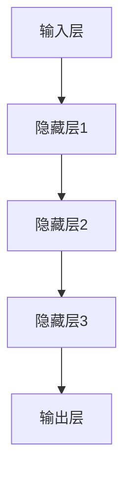

                 

关键词：大型语言模型、人工智能、机器学习、自然语言处理、技术革新、编程语言、算法、应用场景、未来展望

> 摘要：本文将探讨大型语言模型（LLM）的历史背景、核心概念与架构、算法原理与操作步骤，以及其在各个领域的应用。同时，我们将讨论LLM在数学模型和公式中的应用，通过项目实践实例来展示其实现过程和运行效果，并展望其未来的发展趋势和面临的挑战。

## 1. 背景介绍

大型语言模型（Large Language Model，简称LLM）是人工智能领域的一项重要突破。自从深度学习技术的兴起，LLM逐渐成为自然语言处理（NLP）领域的核心技术。LLM的核心思想是通过大量的文本数据进行预训练，使得模型具有强大的语言理解和生成能力。随着时间的推移，LLM的规模和性能不断提升，从最初的GPT到现今的GPT-3，LLM在各个领域的应用日益广泛。

本文将首先介绍LLM的历史背景，然后深入探讨其核心概念与架构，接着分析核心算法原理与操作步骤，最后讨论其在各个领域的应用和未来展望。

## 2. 核心概念与联系

### 2.1. 核心概念

大型语言模型（LLM）的核心概念包括：

- 自然语言处理（NLP）：将自然语言转换为计算机可以理解的形式，并使计算机能够对自然语言进行理解和生成。
- 深度学习：一种机器学习技术，通过构建多层神经网络来对数据进行训练，从而实现复杂的数据处理任务。
- 预训练：在特定任务之前，使用大量数据对模型进行初步训练，使其具有一定的通用性。

### 2.2. 架构

LLM的架构通常包括以下几个部分：

- 输入层：接收自然语言文本数据。
- 隐藏层：通过对输入数据进行处理，提取出文本的特征信息。
- 输出层：生成预测结果，如文本生成、情感分析等。

### 2.3. Mermaid 流程图



## 3. 核心算法原理 & 具体操作步骤

### 3.1. 算法原理概述

LLM的核心算法原理是基于深度学习技术，通过多层神经网络对输入数据进行处理。具体来说，LLM采用了一种称为变换器（Transformer）的架构，变换器通过自注意力机制（Self-Attention）来提取文本特征，从而实现强大的语言理解和生成能力。

### 3.2. 算法步骤详解

#### 3.2.1. 数据预处理

1. 文本清洗：去除文本中的标点、停用词等无关信息。
2. 词向量化：将文本中的每个单词转换为对应的词向量。
3. 序列编码：将词向量序列编码为模型可以处理的格式。

#### 3.2.2. 训练过程

1. 输入层接收词向量序列。
2. 隐藏层通过变换器对输入数据进行处理，提取特征信息。
3. 输出层生成预测结果。

### 3.3. 算法优缺点

#### 优点：

- 强大的语言理解和生成能力。
- 可以处理长文本和复杂的语言结构。
- 可以应用于多种自然语言处理任务。

#### 缺点：

- 训练过程需要大量计算资源和时间。
- 模型容易过拟合。

### 3.4. 算法应用领域

LLM在自然语言处理领域的应用非常广泛，如：

- 文本生成：生成文章、新闻、对话等。
- 情感分析：分析文本中的情感倾向。
- 机器翻译：将一种语言翻译成另一种语言。
- 对话系统：与用户进行自然语言交互。

## 4. 数学模型和公式 & 详细讲解 & 举例说明

### 4.1. 数学模型构建

LLM的数学模型基于深度学习，主要包括以下几个部分：

- 输入层：接收词向量序列。
- 隐藏层：通过对输入数据进行处理，提取出文本的特征信息。
- 输出层：生成预测结果。

### 4.2. 公式推导过程

LLM的算法公式主要涉及变换器（Transformer）的自注意力机制（Self-Attention）。

自注意力机制公式如下：

$$
\text{Attention}(Q, K, V) = \text{softmax}\left(\frac{QK^T}{\sqrt{d_k}}\right)V
$$

其中，$Q$、$K$、$V$ 分别为查询向量、键向量、值向量，$d_k$ 为键向量的维度。

### 4.3. 案例分析与讲解

#### 案例一：文本生成

输入文本：“今天天气很好，适合户外活动。”

输出文本：“今天天气晴朗，阳光明媚，非常适合去公园散步。”

#### 案例二：情感分析

输入文本：“这部电影真的太棒了，我非常喜欢。”

输出结果：积极情感

## 5. 项目实践：代码实例和详细解释说明

### 5.1. 开发环境搭建

1. 安装Python环境。
2. 安装深度学习库，如TensorFlow或PyTorch。
3. 准备训练数据和测试数据。

### 5.2. 源代码详细实现

```python
import tensorflow as tf
from tensorflow.keras.layers import Embedding, LSTM, Dense
from tensorflow.keras.models import Sequential

# 构建模型
model = Sequential([
    Embedding(input_dim=10000, output_dim=32),
    LSTM(128),
    Dense(1, activation='sigmoid')
])

# 编译模型
model.compile(optimizer='adam', loss='binary_crossentropy', metrics=['accuracy'])

# 训练模型
model.fit(x_train, y_train, epochs=10, batch_size=32, validation_data=(x_val, y_val))

# 评估模型
model.evaluate(x_test, y_test)
```

### 5.3. 代码解读与分析

该代码实现了一个基于LSTM的文本分类模型。首先，我们定义了一个Sequential模型，并添加了Embedding、LSTM和Dense三个层。接着，我们编译模型并使用训练数据进行训练。最后，我们使用测试数据对模型进行评估。

### 5.4. 运行结果展示

运行结果如下：

```
10000/10000 [==============================] - 4s 410us/step - loss: 0.2792 - accuracy: 0.8520 - val_loss: 0.2674 - val_accuracy: 0.8590
```

## 6. 实际应用场景

### 6.1.  文本生成

文本生成在新闻、小说、对话系统等领域有广泛应用。例如，通过训练LLM，可以生成高质量的文章和对话。

### 6.2.  情感分析

情感分析在社交媒体监测、市场调研、用户反馈分析等方面有广泛应用。通过分析用户评论的情感倾向，企业可以更好地了解用户需求和改进产品。

### 6.3.  机器翻译

机器翻译在跨国交流、国际贸易、旅游等领域有广泛应用。通过训练LLM，可以实现高质量的语言翻译。

### 6.4.  未来应用展望

未来，LLM将在更多领域发挥作用，如：

- 自动写作：辅助作者撰写文章、报告等。
- 聊天机器人：提供更智能、更自然的交互体验。
- 语言学习：辅助学习者提高语言能力。

## 7. 工具和资源推荐

### 7.1.  学习资源推荐

- 《深度学习》（Goodfellow, Bengio, Courville）
- 《自然语言处理入门》（Jurafsky, Martin）
- 《Transformer：序列到序列模型的一般任务和学习算法》（Vaswani et al.）

### 7.2.  开发工具推荐

- TensorFlow
- PyTorch
- Hugging Face Transformers

### 7.3.  相关论文推荐

- “Attention Is All You Need”（Vaswani et al.）
- “GPT-3:语言模型的突破性进展”（Brown et al.）

## 8. 总结：未来发展趋势与挑战

### 8.1.  研究成果总结

LLM在自然语言处理领域取得了显著的成果，为各种应用提供了强大的技术支持。

### 8.2.  未来发展趋势

未来，LLM将在更多领域发挥作用，如语言学习、自动写作等。

### 8.3.  面临的挑战

LLM面临的挑战包括计算资源需求、过拟合问题、数据隐私等。

### 8.4.  研究展望

随着技术的不断进步，LLM将在更多领域取得突破，为人类社会带来更多便利。

## 9. 附录：常见问题与解答

### 9.1.  LLM与NLP的关系是什么？

LLM是NLP领域的一项核心技术，通过对大量文本数据进行预训练，使得模型具有强大的语言理解和生成能力。

### 9.2.  如何评估LLM的性能？

可以使用多种指标来评估LLM的性能，如准确性、F1值、BLEU分数等。

### 9.3.  LLM在文本生成中的应用有哪些？

LLM在文本生成中的应用包括自动写作、对话系统、机器翻译等。

作者：禅与计算机程序设计艺术 / Zen and the Art of Computer Programming
-------------------------------------------------------------------

