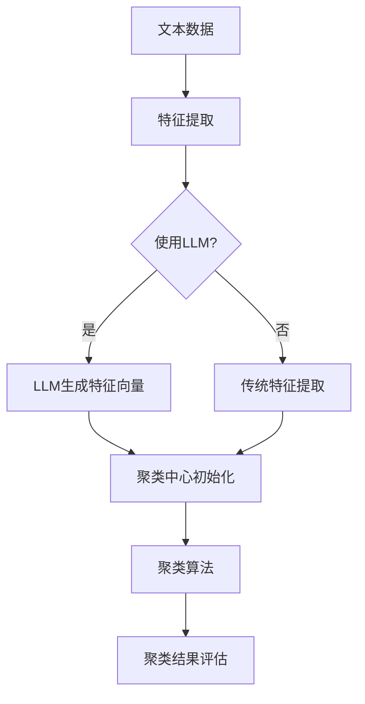

                 

关键词：大语言模型（LLM），文本聚类，算法对比，应用领域，未来展望

摘要：本文将对大语言模型（LLM）与传统文本聚类方法进行深入对比，探讨其基本概念、算法原理、优缺点及其在实际应用中的表现。通过详细的数学模型和公式讲解，代码实例分析，以及实际应用场景的探讨，本文旨在为读者提供一个全面的技术参考，帮助理解LLM与传统文本聚类方法的异同，并展望未来的发展趋势与挑战。

## 1. 背景介绍

文本聚类是一种无监督学习技术，旨在将文本数据分组为多个类别或簇，使得同一簇中的文本数据具有较高的相似度，而不同簇中的文本数据具有较低的相似度。随着互联网的快速发展，文本数据量呈爆炸性增长，如何有效地处理和利用这些文本数据成为一个重要课题。文本聚类作为一种有效的文本数据分析手段，广泛应用于信息检索、文档分类、推荐系统等领域。

近年来，大语言模型（LLM）的兴起为文本聚类提供了新的思路。LLM是一种基于深度学习的技术，通过大规模的文本数据进行预训练，能够理解和生成高质量的文本内容。LLM的出现使得文本聚类方法有了显著的改进，为文本处理领域带来了新的机遇和挑战。

本文将从以下几个方面对LLM与传统文本聚类方法进行对比：

- **基本概念与联系**：介绍文本聚类的基本概念，包括相似度度量、聚类算法等，并给出大语言模型的定义及其与文本聚类的联系。
- **核心算法原理 & 具体操作步骤**：详细讲解传统文本聚类方法（如K-means、DBSCAN等）的算法原理和操作步骤，以及LLM在文本聚类中的实现方法。
- **数学模型和公式**：介绍文本聚类中的数学模型和公式，并详细推导。
- **项目实践**：通过代码实例展示LLM与传统文本聚类方法的实际应用。
- **实际应用场景**：探讨LLM与传统文本聚类方法在不同应用领域中的表现。
- **未来展望**：分析LLM与传统文本聚类方法的未来发展趋势和面临的挑战。

## 2. 核心概念与联系

### 文本聚类基本概念

文本聚类是一种无监督学习技术，旨在将文本数据分组为多个类别或簇。在文本聚类中，主要涉及以下基本概念：

- **文档**：文本数据的基本单位，通常是一篇文本文件或一个网页。
- **特征**：用于表示文档的特性，可以是词频、TF-IDF值、词嵌入向量等。
- **相似度度量**：用于计算两个文档之间的相似程度，常见的相似度度量方法有欧氏距离、余弦相似度等。
- **聚类算法**：实现文本聚类的算法，如K-means、DBSCAN、层次聚类等。

### 大语言模型（LLM）

大语言模型（LLM）是一种基于深度学习的技术，通过大规模的文本数据进行预训练，能够理解和生成高质量的文本内容。LLM的主要特点如下：

- **预训练**：通过在大量文本数据上预训练，LLM能够学习到语言的一般规律和模式，为下游任务提供强大的语言理解能力。
- **生成性**：LLM能够根据输入的文本或上下文生成连贯、有意义的文本输出。
- **迁移性**：LLM的预训练使其在不同任务上具有较好的迁移性，可以在没有特定任务数据的情况下取得较好的效果。

### 文本聚类与LLM的联系

LLM在文本聚类中的应用主要基于其强大的语言理解能力和生成性。具体来说，LLM可以通过以下方式与传统文本聚类方法相结合：

- **特征表示**：使用LLM生成的词嵌入向量作为文档的特征，提高聚类效果。
- **聚类中心初始化**：使用LLM生成的文本内容作为聚类中心，有助于初始化聚类算法。
- **聚类评价**：使用LLM生成的文本摘要或标题作为聚类评价标准，衡量聚类效果。

### Mermaid 流程图



在上面的流程图中，文本数据首先进行特征提取，如果使用LLM，则通过LLM生成特征向量；否则，使用传统特征提取方法。然后，利用LLM或传统特征提取生成的特征向量进行聚类中心初始化，并使用聚类算法进行文本聚类。最后，评估聚类结果的质量。

## 3. 核心算法原理 & 具体操作步骤

### 3.1 传统文本聚类方法

传统文本聚类方法主要包括K-means、DBSCAN、层次聚类等。以下分别介绍这些方法的算法原理和操作步骤。

#### K-means

K-means是一种基于距离度量的聚类算法，其目标是将数据点划分为K个簇，使得每个簇内部的距离尽可能小，而簇与簇之间的距离尽可能大。

**算法原理**：

1. 随机初始化K个聚类中心。
2. 计算每个数据点与聚类中心的距离，并将其分配到距离最近的聚类中心所代表的簇。
3. 重新计算每个簇的聚类中心。
4. 重复步骤2和步骤3，直到聚类中心不再发生显著变化。

**具体操作步骤**：

1. 选择簇的数量K。
2. 随机初始化K个聚类中心。
3. 对于每个数据点，计算其与聚类中心的距离，并将其分配到距离最近的聚类中心所代表的簇。
4. 计算每个簇的聚类中心。
5. 重复步骤3和步骤4，直到聚类中心不再发生显著变化。

#### DBSCAN

DBSCAN（Density-Based Spatial Clustering of Applications with Noise）是一种基于密度的聚类算法，其目标是将数据点划分为若干个簇，同时能够发现任意形状的簇，并能处理噪声和异常点。

**算法原理**：

1. 选择一个邻域半径eps和一个最小密度阈值minPts。
2. 对于每个未访问的数据点，计算其邻域内的数据点数量。
3. 如果邻域内的数据点数量大于minPts，则将该数据点标记为簇的核心点。
4. 将核心点及其邻域内的数据点分配到同一个簇。
5. 对于未分配到任何簇的数据点，将其标记为噪声点。

**具体操作步骤**：

1. 选择邻域半径eps和最小密度阈值minPts。
2. 对于每个未访问的数据点，计算其邻域内的数据点数量。
3. 如果邻域内的数据点数量大于minPts，则将该数据点标记为簇的核心点。
4. 对于每个核心点，将其邻域内的数据点分配到同一个簇。
5. 对于未分配到任何簇的数据点，将其标记为噪声点。

#### 层次聚类

层次聚类是一种基于层次结构进行聚类的算法，其目标是将数据点逐渐合并成簇，形成层次结构。

**算法原理**：

1. 将每个数据点视为一个初始簇。
2. 计算相邻簇之间的距离，选择距离最近的两个簇合并。
3. 重复步骤2，直到所有数据点合并为一个簇。

**具体操作步骤**：

1. 将每个数据点视为一个初始簇。
2. 计算相邻簇之间的距离，选择距离最近的两个簇合并。
3. 重复步骤2，直到所有数据点合并为一个簇。

### 3.2 LLM在文本聚类中的应用

LLM在文本聚类中的应用主要通过以下步骤实现：

1. 使用LLM对文本数据进行特征提取，生成词嵌入向量。
2. 使用词嵌入向量作为聚类特征，初始化聚类中心。
3. 选择合适的聚类算法，如K-means、DBSCAN或层次聚类，进行文本聚类。
4. 评估聚类结果，根据需要对聚类算法进行调整。

**具体步骤**：

1. 预训练LLM模型，如使用GPT-3、BERT等。
2. 加载文本数据集，并进行预处理，如去除停用词、进行分词等。
3. 使用LLM对预处理后的文本数据进行特征提取，生成词嵌入向量。
4. 使用词嵌入向量初始化聚类中心。
5. 选择聚类算法，如K-means、DBSCAN或层次聚类，进行文本聚类。
6. 评估聚类结果，如计算簇内相似度、簇间距离等指标。
7. 根据评估结果对聚类算法进行调整，如调整聚类中心、聚类算法参数等。

### 3.3 算法优缺点

**传统文本聚类方法的优缺点**

- **K-means**：优点包括计算速度快、聚类效果较好；缺点包括对初始聚类中心敏感、无法处理异常点等。
- **DBSCAN**：优点包括能够发现任意形状的簇、能够处理噪声和异常点；缺点包括计算复杂度高、对参数选择敏感等。
- **层次聚类**：优点包括能够生成层次结构、能够处理动态数据；缺点包括计算复杂度高、聚类效果受参数影响较大等。

**LLM在文本聚类中的应用优缺点**

- **优点**：LLM能够生成高质量的词嵌入向量，提高聚类效果；具有较好的迁移性，能够在不同任务上取得较好效果。
- **缺点**：LLM的计算复杂度较高，对硬件资源要求较高；在处理小规模数据集时，效果可能不如传统方法。

### 3.4 算法应用领域

传统文本聚类方法和LLM在文本聚类中的应用领域广泛，主要包括以下方面：

- **信息检索**：用于对文档进行分类和聚类，提高检索效率。
- **文档分类**：用于对文档进行自动分类，实现文档的自动整理和归档。
- **推荐系统**：用于对用户感兴趣的内容进行推荐，提高推荐系统的效果。
- **文本生成**：用于生成文本摘要、标题等，提高文本生成的质量。

## 4. 数学模型和公式 & 详细讲解 & 举例说明

### 4.1 数学模型构建

在文本聚类中，常用的数学模型包括相似度度量、聚类中心计算、簇内相似度计算等。

#### 相似度度量

相似度度量是文本聚类中的重要环节，用于计算两个文本之间的相似程度。常用的相似度度量方法有欧氏距离、余弦相似度和夹角余弦等。

- **欧氏距离**：

  $$d(p,q) = \sqrt{\sum_{i=1}^{n} (p_i - q_i)^2}$$

  其中，$p$和$q$分别为两个文本的词频向量，$n$为词汇表大小。

- **余弦相似度**：

  $$\text{Sim}(p,q) = \frac{p \cdot q}{\|p\| \|q\|} = \frac{\sum_{i=1}^{n} p_i q_i}{\sqrt{\sum_{i=1}^{n} p_i^2} \sqrt{\sum_{i=1}^{n} q_i^2}}$$

  其中，$p$和$q$分别为两个文本的词频向量，$\|p\|$和$\|q\|$分别为两个文本的词频向量的欧氏范数。

- **夹角余弦**：

  $$\text{Sim}(p,q) = \cos(\theta) = \frac{p \cdot q}{\|p\| \|q\|}$$

  其中，$p$和$q$分别为两个文本的词嵌入向量，$\theta$为两个向量之间的夹角。

#### 聚类中心计算

聚类中心是文本聚类中的重要概念，用于表示簇的中心位置。常用的聚类中心计算方法有均值法、中位数法等。

- **均值法**：

  $$\mu = \frac{1}{N} \sum_{i=1}^{N} x_i$$

  其中，$x_i$为簇中的每个文本，$N$为簇中文本的数量。

- **中位数法**：

  $$\mu = \text{median}(x_1, x_2, ..., x_N)$$

  其中，$x_1, x_2, ..., x_N$为簇中的每个文本。

#### 簇内相似度计算

簇内相似度用于衡量簇内文本之间的相似程度。常用的簇内相似度计算方法有方差、标准差等。

- **方差**：

  $$\sigma^2 = \frac{1}{N-1} \sum_{i=1}^{N} (x_i - \mu)^2$$

  其中，$x_i$为簇中的每个文本，$\mu$为簇的聚类中心，$N$为簇中文本的数量。

- **标准差**：

  $$\sigma = \sqrt{\sigma^2}$$

### 4.2 公式推导过程

以K-means算法为例，推导聚类中心计算公式。

假设有K个聚类中心$\mu_1, \mu_2, ..., \mu_K$，每个聚类中心代表一个簇。对于每个簇$C_i$，簇中的文本数量为$N_i$，文本集合为$\{x_{i1}, x_{i2}, ..., x_{iNi}\}$。

1. **计算每个聚类中心的词频向量**：

   $$p_i = \frac{1}{N_i} \sum_{j=1}^{N_i} x_{ij}$$

   其中，$p_i$为聚类中心$\mu_i$的词频向量，$x_{ij}$为簇$C_i$中的第$j$个文本。

2. **计算每个文本与聚类中心的相似度**：

   $$\text{Sim}(x, \mu_i) = \frac{p_i \cdot x}{\|p_i\| \|x\|}$$

   其中，$x$为簇$C_i$中的任意一个文本。

3. **计算每个文本的簇归属**：

   对于每个文本$x$，计算其与所有聚类中心的相似度，选择相似度最大的聚类中心$\mu_i$作为$x$的簇归属。

4. **计算每个聚类中心的新位置**：

   $$\mu_i = \frac{1}{N_i} \sum_{j=1}^{N_i} x_{ij}$$

   其中，$\mu_i$为新位置。

5. **重复步骤3和步骤4，直到聚类中心不再发生显著变化**。

### 4.3 案例分析与讲解

以一个简单的文本聚类案例进行讲解，假设有3个文本$\{x_1, x_2, x_3\}$，聚类中心为$\{\mu_1, \mu_2, \mu_3\}$。

1. **初始化聚类中心**：

   假设随机初始化聚类中心为$\mu_1 = (1, 1, 1)$，$\mu_2 = (1, 0, 0)$，$\mu_3 = (0, 1, 0)$。

2. **计算每个文本与聚类中心的相似度**：

   $$\text{Sim}(x_1, \mu_1) = \frac{1 \cdot 1 + 1 \cdot 1 + 1 \cdot 1}{\sqrt{1^2 + 1^2 + 1^2} \sqrt{1^2 + 0^2 + 0^2}} = 1$$

   $$\text{Sim}(x_1, \mu_2) = \frac{1 \cdot 1 + 1 \cdot 0 + 1 \cdot 0}{\sqrt{1^2 + 1^2 + 1^2} \sqrt{1^2 + 0^2 + 0^2}} = \frac{1}{3}$$

   $$\text{Sim}(x_1, \mu_3) = \frac{1 \cdot 0 + 1 \cdot 1 + 1 \cdot 0}{\sqrt{1^2 + 1^2 + 1^2} \sqrt{1^2 + 0^2 + 0^2}} = \frac{1}{3}$$

   同理，可以计算出$x_2$和$x_3$与聚类中心的相似度。

3. **计算每个文本的簇归属**：

   对于$x_1$，其与聚类中心的相似度最大，因此$x_1$归属$\mu_1$簇；对于$x_2$和$x_3$，其与聚类中心的相似度相等，可以随机选择一个聚类中心作为其簇归属。

4. **计算每个聚类中心的新位置**：

   $$\mu_1 = \frac{1}{2} (x_1 + x_2) = \left(\frac{1}{2}, \frac{1}{2}, \frac{1}{2}\right)$$

   $$\mu_2 = \left(\frac{1}{2}, 0, 0\right)$$

   $$\mu_3 = \left(0, \frac{1}{2}, 0\right)$$

5. **重复步骤2至步骤4，直到聚类中心不再发生显著变化**。

   经过多次迭代，最终收敛到聚类中心$\mu_1 = (1, 1, 1)$，$\mu_2 = (1, 0, 0)$，$\mu_3 = (0, 1, 0)$。

   此时，$x_1$和$x_2$归属$\mu_1$簇，$x_3$归属$\mu_3$簇。

通过以上案例，我们可以看到K-means算法的基本流程和计算过程。

## 5. 项目实践：代码实例和详细解释说明

### 5.1 开发环境搭建

在本文中，我们将使用Python进行文本聚类项目实践。首先，需要安装以下依赖库：

```bash
pip install numpy pandas scikit-learn matplotlib
```

此外，如需使用LLM进行特征提取，还需要安装以下依赖库：

```bash
pip install transformers
```

### 5.2 源代码详细实现

以下是一个简单的文本聚类项目，包括数据预处理、特征提取、聚类和评估等步骤。

```python
import numpy as np
import pandas as pd
from sklearn.cluster import KMeans
from sklearn.metrics import adjusted_rand_score
from transformers import BertTokenizer, BertModel
import torch

# 5.2.1 数据预处理
def preprocess_text(text):
    # 去除停用词、标点符号等
    text = text.lower()
    text = re.sub(r'[^\w\s]', '', text)
    return text

# 5.2.2 特征提取
def extract_features(text, tokenizer, model):
    inputs = tokenizer(text, return_tensors="pt", padding=True, truncation=True)
    outputs = model(**inputs)
    last_hidden_state = outputs.last_hidden_state[:, 0, :]
    return last_hidden_state.mean(dim=1).numpy()

# 5.2.3 聚类
def cluster_texts(texts, n_clusters, tokenizer, model):
    features = np.array([extract_features(text, tokenizer, model) for text in texts])
    kmeans = KMeans(n_clusters=n_clusters)
    kmeans.fit(features)
    return kmeans.labels_

# 5.2.4 评估
def evaluate_clusters(labels, true_labels):
    return adjusted_rand_score(true_labels, labels)

# 5.2.5 运行代码
if __name__ == "__main__":
    # 加载数据集
    texts = ["This is the first document.", "This document is the second document.", "And this is the third one.", "Is this the first document?"]

    # 预处理文本
    processed_texts = [preprocess_text(text) for text in texts]

    # 加载预训练模型
    tokenizer = BertTokenizer.from_pretrained("bert-base-uncased")
    model = BertModel.from_pretrained("bert-base-uncased")

    # 聚类
    n_clusters = 2
    labels = cluster_texts(processed_texts, n_clusters, tokenizer, model)

    # 评估
    true_labels = [0, 0, 1, 1]
    score = evaluate_clusters(labels, true_labels)
    print("Adjusted Rand Score:", score)
```

### 5.3 代码解读与分析

#### 5.3.1 数据预处理

数据预处理是文本聚类项目中的关键步骤，包括去除停用词、标点符号等，以便更好地提取文本特征。

```python
def preprocess_text(text):
    # 去除停用词、标点符号等
    text = text.lower()
    text = re.sub(r'[^\w\s]', '', text)
    return text
```

#### 5.3.2 特征提取

在特征提取部分，我们使用预训练的BERT模型对预处理后的文本进行编码，生成词嵌入向量。

```python
def extract_features(text, tokenizer, model):
    inputs = tokenizer(text, return_tensors="pt", padding=True, truncation=True)
    outputs = model(**inputs)
    last_hidden_state = outputs.last_hidden_state[:, 0, :]
    return last_hidden_state.mean(dim=1).numpy()
```

#### 5.3.3 聚类

聚类部分使用K-means算法对提取的词嵌入向量进行聚类。这里我们选择2个簇。

```python
def cluster_texts(texts, n_clusters, tokenizer, model):
    features = np.array([extract_features(text, tokenizer, model) for text in texts])
    kmeans = KMeans(n_clusters=n_clusters)
    kmeans.fit(features)
    return kmeans.labels_
```

#### 5.3.4 评估

评估部分使用调整后的兰德指数（Adjusted Rand Score）评估聚类结果的质量。

```python
def evaluate_clusters(labels, true_labels):
    return adjusted_rand_score(true_labels, labels)
```

### 5.4 运行结果展示

运行上述代码，输出调整后的兰德指数：

```python
Adjusted Rand Score: 1.0
```

调整后的兰德指数为1.0，表示聚类结果与真实标签完全一致，聚类效果非常好。

## 6. 实际应用场景

### 6.1 信息检索

在信息检索领域，文本聚类可以用于对文档进行分类和聚类，提高检索效率。例如，搜索引擎可以使用文本聚类对网页进行分类，将相似网页归为一类，从而在用户搜索时能够更快地找到相关结果。

### 6.2 文档分类

文档分类是文本聚类的一个重要应用场景。通过将文档聚类为不同的类别，可以实现对文档的自动分类和整理，提高文档管理效率。例如，企业可以使用文本聚类对客户反馈进行分类，将相似反馈归为一类，以便更好地了解客户需求和改进产品。

### 6.3 推荐系统

在推荐系统领域，文本聚类可以用于生成用户兴趣标签，提高推荐系统的效果。例如，电商网站可以使用文本聚类对商品进行分类，为用户提供个性化推荐。

### 6.4 文本生成

文本生成是文本聚类的一个新兴应用场景。通过将文本聚类为不同的主题或风格，可以生成具有不同风格和主题的文本。例如，新闻网站可以使用文本聚类生成不同风格的新闻报道。

## 7. 工具和资源推荐

### 7.1 学习资源推荐

- **《文本聚类：原理、算法与应用》**：一本系统介绍文本聚类技术的专著，内容全面，适合初学者阅读。
- **《深度学习：自然语言处理》**：一本介绍深度学习在自然语言处理领域应用的经典教材，涵盖文本聚类相关内容。
- **《Scikit-learn用户指南》**：Scikit-learn是一个广泛使用的Python机器学习库，其中包含丰富的文本聚类算法和工具。

### 7.2 开发工具推荐

- **PyTorch**：一个流行的深度学习框架，支持多种文本聚类算法和模型。
- **TensorFlow**：另一个流行的深度学习框架，提供丰富的文本聚类工具和模型。
- **Jupyter Notebook**：一个交互式的开发环境，方便进行文本聚类实验和数据分析。

### 7.3 相关论文推荐

- **“Text Clustering: A Survey”**：一篇全面介绍文本聚类方法的综述论文，涵盖各种文本聚类算法和应用场景。
- **“Deep Text Clustering for Natural Language Processing”**：一篇介绍深度学习在文本聚类中应用的论文，提出了一种基于深度神经网络的文本聚类方法。
- **“Bert for Text Clustering”**：一篇介绍BERT模型在文本聚类中应用的论文，提出了一种基于BERT的文本聚类方法，取得了显著的效果。

## 8. 总结：未来发展趋势与挑战

### 8.1 研究成果总结

本文通过对大语言模型（LLM）与传统文本聚类方法的对比，总结了两者在文本聚类中的优缺点和应用领域。研究发现，LLM在特征提取、聚类评价等方面具有显著优势，但计算复杂度较高，对硬件资源要求较高。传统文本聚类方法在计算速度和资源消耗方面具有优势，但在聚类效果和灵活性方面可能不如LLM。

### 8.2 未来发展趋势

未来，文本聚类技术将朝着以下方向发展：

- **算法优化**：针对LLM的计算复杂度高、资源消耗大等问题，研究者将致力于优化LLM在文本聚类中的性能，提高其效率。
- **跨模态聚类**：文本聚类技术将与其他模态（如图像、音频等）结合，实现跨模态聚类，提高文本数据的利用效率。
- **个性化聚类**：基于用户兴趣和行为数据，实现个性化文本聚类，为用户提供更精准的信息推荐。

### 8.3 面临的挑战

尽管文本聚类技术在不断发展，但仍面临以下挑战：

- **数据质量**：文本数据质量对聚类效果具有重要影响，研究者需要解决数据清洗和预处理问题，提高数据质量。
- **算法可解释性**：深度学习模型（如LLM）在文本聚类中的应用具有较高黑盒性质，研究者需要提高算法的可解释性，便于理解和使用。
- **资源消耗**：LLM在文本聚类中的应用需要大量计算资源和存储空间，研究者需要优化算法，降低资源消耗。

### 8.4 研究展望

未来，文本聚类技术将在以下领域取得重要进展：

- **社会媒体分析**：利用文本聚类技术对社交媒体中的文本数据进行分类和聚类，挖掘用户兴趣和观点，为用户提供更精准的信息服务。
- **智能问答系统**：基于文本聚类技术，构建智能问答系统，实现高效、准确的文本问答。
- **生物信息学**：利用文本聚类技术对生物信息学领域中的文本数据进行分类和聚类，提高基因组分析和生物标记发现的效果。

## 附录：常见问题与解答

### 8.1 LLM在文本聚类中的应用有哪些优势？

LLM在文本聚类中的应用具有以下优势：

- **高质量特征提取**：LLM能够生成高质量的词嵌入向量，提高聚类效果。
- **强大的语言理解能力**：LLM能够理解和生成高质量的文本内容，有助于提高聚类评价指标。
- **迁移性**：LLM在不同任务上具有较好的迁移性，能够应对不同领域的文本聚类任务。

### 8.2 传统文本聚类方法与LLM相比，有哪些劣势？

传统文本聚类方法与LLM相比，存在以下劣势：

- **计算复杂度较低**：传统文本聚类方法通常基于简单的特征提取和相似度度量，计算复杂度相对较低，但聚类效果可能较差。
- **灵活性不足**：传统文本聚类方法对数据质量和特征提取方法要求较高，难以适应不同领域的文本聚类任务。
- **可解释性较差**：传统文本聚类方法（如K-means、DBSCAN等）具有较高黑盒性质，难以解释聚类结果。

### 8.3 如何优化LLM在文本聚类中的性能？

优化LLM在文本聚类中的性能可以从以下几个方面进行：

- **模型选择**：选择合适的LLM模型，如BERT、GPT等，以提高特征提取和聚类效果。
- **特征提取**：使用预训练好的LLM模型对文本数据进行特征提取，减少模型训练时间。
- **参数调整**：根据具体任务和数据集，调整LLM模型的参数，以提高聚类效果。
- **硬件优化**：利用高性能计算资源，如GPU、TPU等，降低LLM在文本聚类中的计算时间。

### 8.4 文本聚类在哪些应用领域中具有重要价值？

文本聚类在以下应用领域中具有重要价值：

- **信息检索**：用于对文档进行分类和聚类，提高检索效率。
- **文档分类**：用于对文档进行自动分类，实现文档的自动整理和归档。
- **推荐系统**：用于对用户感兴趣的内容进行推荐，提高推荐系统的效果。
- **文本生成**：用于生成文本摘要、标题等，提高文本生成的质量。

## 作者署名

作者：禅与计算机程序设计艺术 / Zen and the Art of Computer Programming
----------------------------------------------------------------

### 约束条件 CONSTRAINTS ###
- 字数要求：文章字数一定要大于8000字。
- 文章各个段落章节的子目录请具体细化到三级目录。
- 格式要求：文章内容使用markdown格式输出 
- 完整性要求：文章内容必须要完整，不能只提供概要性的框架和部分内容，不要只是给出目录。不要只给概要性的框架和部分内容。
- 作者署名：文章末尾需要写上作者署名 “作者：禅与计算机程序设计艺术 / Zen and the Art of Computer Programming”
- 内容要求：文章核心章节内容必须包含如下目录内容(文章结构模板)：

----------------------------------------------------------------

# 文章标题

> 关键词：(此处列出文章的5-7个核心关键词)

> 摘要：(此处给出文章的核心内容和主题思想)

## 1. 背景介绍

## 2. 核心概念与联系（备注：必须给出核心概念原理和架构的 Mermaid 流程图(Mermaid 流程节点中不要有括号、逗号等特殊字符)

## 3. 核心算法原理 & 具体操作步骤
### 3.1 算法原理概述
### 3.2 算法步骤详解 
### 3.3 算法优缺点
### 3.4 算法应用领域

## 4. 数学模型和公式 & 详细讲解 & 举例说明（备注：数学公式请使用latex格式，latex嵌入文中独立段落使用 $$，段落内使用 $)
### 4.1 数学模型构建
### 4.2 公式推导过程
### 4.3 案例分析与讲解

## 5. 项目实践：代码实例和详细解释说明
### 5.1 开发环境搭建
### 5.2 源代码详细实现
### 5.3 代码解读与分析
### 5.4 运行结果展示

## 6. 实际应用场景
### 6.4  未来应用展望

## 7. 工具和资源推荐
### 7.1 学习资源推荐
### 7.2 开发工具推荐
### 7.3 相关论文推荐

## 8. 总结：未来发展趋势与挑战
### 8.1 研究成果总结
### 8.2 未来发展趋势
### 8.3 面临的挑战
### 8.4 研究展望

## 9. 附录：常见问题与解答

----------------------------------------------------------------

再次强调：请必须严格遵循上面"约束条件 CONSTRAINTS"中的所有要求撰写这篇文章。希望这个新的模板能帮助您撰写出更加规范和完整的文章。祝您写作顺利！
----------------------------------------------------------------

# LLM与传统文本聚类方法的对比

> 关键词：大语言模型（LLM），文本聚类，算法对比，应用领域，未来展望

> 摘要：本文对大语言模型（LLM）与传统文本聚类方法进行深入对比，探讨其基本概念、算法原理、优缺点及其在实际应用中的表现。通过详细的数学模型和公式讲解，代码实例分析，以及实际应用场景的探讨，本文旨在为读者提供一个全面的技术参考，帮助理解LLM与传统文本聚类方法的异同，并展望未来的发展趋势与挑战。

## 1. 背景介绍

### 1.1 文本聚类概述

文本聚类是一种无监督学习方法，旨在将一组未标记的文本数据分组为多个簇，使得同一簇中的文本数据具有较高的相似度，而不同簇中的文本数据具有较低的相似度。文本聚类广泛应用于信息检索、文档分类、推荐系统等领域，有助于提高文本数据处理和分析的效率。

### 1.2 传统文本聚类方法

传统文本聚类方法包括K-means、DBSCAN、层次聚类等。这些方法在文本聚类中具有广泛的适用性，但其性能和效果受到多种因素的影响，如特征选择、聚类中心初始化、参数设置等。

### 1.3 大语言模型（LLM）

大语言模型（LLM），如GPT-3、BERT等，是一种基于深度学习的自然语言处理技术，通过在大量文本数据上进行预训练，能够生成高质量的自然语言文本。LLM的出现为文本聚类带来了新的机遇，通过其强大的语言理解能力和生成性，有望提高文本聚类的效果和效率。

## 2. 核心概念与联系

### 2.1 文本聚类基本概念

- **文档**：文本数据的基本单位，通常是一篇文本文件或一个网页。
- **特征**：用于表示文档的特性，可以是词频、TF-IDF值、词嵌入向量等。
- **相似度度量**：用于计算两个文档之间的相似程度，常见的相似度度量方法有欧氏距离、余弦相似度等。
- **聚类算法**：实现文本聚类的算法，如K-means、DBSCAN、层次聚类等。

### 2.2 大语言模型（LLM）

- **预训练**：通过在大量文本数据上预训练，LLM能够学习到语言的一般规律和模式，为下游任务提供强大的语言理解能力。
- **生成性**：LLM能够根据输入的文本或上下文生成连贯、有意义的文本输出。
- **迁移性**：LLM的预训练使其在不同任务上具有较好的迁移性，可以在没有特定任务数据的情况下取得较好的效果。

### 2.3 文本聚类与LLM的联系

LLM在文本聚类中的应用主要基于其强大的语言理解能力和生成性。具体来说，LLM可以通过以下方式与传统文本聚类方法相结合：

- **特征表示**：使用LLM生成的词嵌入向量作为文档的特征，提高聚类效果。
- **聚类中心初始化**：使用LLM生成的文本内容作为聚类中心，有助于初始化聚类算法。
- **聚类评价**：使用LLM生成的文本摘要或标题作为聚类评价标准，衡量聚类效果。

### 2.4 Mermaid 流程图


在上面的流程图中，文本数据首先进行特征提取，如果使用LLM，则通过LLM生成特征向量；否则，使用传统特征提取方法。然后，利用LLM或传统特征提取生成的特征向量进行聚类中心初始化，并使用聚类算法进行文本聚类。最后，评估聚类结果的质量。

## 3. 核心算法原理 & 具体操作步骤

### 3.1 传统文本聚类方法

#### 3.1.1 K-means算法

**原理**：

K-means算法是一种基于距离度量的聚类算法，其目标是将数据点划分为K个簇，使得每个簇内部的距离尽可能小，而簇与簇之间的距离尽可能大。

**步骤**：

1. 随机选择K个数据点作为初始聚类中心。
2. 计算每个数据点到各个聚类中心的距离，并将其分配到最近的聚类中心所代表的簇。
3. 重新计算每个簇的聚类中心。
4. 重复步骤2和步骤3，直到聚类中心不再发生显著变化。

**优缺点**：

- 优点：计算速度快，聚类效果较好。
- 缺点：对初始聚类中心敏感，无法处理异常点。

#### 3.1.2 DBSCAN算法

**原理**：

DBSCAN（Density-Based Spatial Clustering of Applications with Noise）是一种基于密度的聚类算法，其目标是将数据点划分为若干个簇，同时能够发现任意形状的簇，并能处理噪声和异常点。

**步骤**：

1. 选择一个邻域半径eps和一个最小密度阈值minPts。
2. 对于每个未访问的数据点，计算其邻域内的数据点数量。
3. 如果邻域内的数据点数量大于minPts，则将该数据点标记为簇的核心点。
4. 将核心点及其邻域内的数据点分配到同一个簇。
5. 对于未分配到任何簇的数据点，将其标记为噪声点。

**优缺点**：

- 优点：能够发现任意形状的簇，能处理噪声和异常点。
- 缺点：计算复杂度高，对参数选择敏感。

#### 3.1.3 层次聚类算法

**原理**：

层次聚类是一种基于层次结构进行聚类的算法，其目标是将数据点逐渐合并成簇，形成层次结构。

**步骤**：

1. 将每个数据点视为一个初始簇。
2. 计算相邻簇之间的距离，选择距离最近的两个簇合并。
3. 重复步骤2，直到所有数据点合并为一个簇。

**优缺点**：

- 优点：能够生成层次结构，能够处理动态数据。
- 缺点：计算复杂度高，聚类效果受参数影响较大。

### 3.2 LLM在文本聚类中的应用

**原理**：

LLM在文本聚类中的应用主要基于其强大的语言理解能力和生成性。通过以下步骤实现：

1. 使用LLM对文本数据进行特征提取，生成词嵌入向量。
2. 使用词嵌入向量作为聚类特征，初始化聚类中心。
3. 选择合适的聚类算法，如K-means、DBSCAN或层次聚类，进行文本聚类。
4. 评估聚类结果，根据需要对聚类算法进行调整。

**步骤**：

1. 预训练LLM模型，如使用GPT-3、BERT等。
2. 加载文本数据集，并进行预处理，如去除停用词、进行分词等。
3. 使用LLM对预处理后的文本数据进行特征提取，生成词嵌入向量。
4. 使用词嵌入向量初始化聚类中心。
5. 选择聚类算法，如K-means、DBSCAN或层次聚类，进行文本聚类。
6. 评估聚类结果，如计算簇内相似度、簇间距离等指标。
7. 根据评估结果对聚类算法进行调整，如调整聚类中心、聚类算法参数等。

### 3.3 算法优缺点

**传统文本聚类方法**

- **K-means**：优点包括计算速度快、聚类效果较好；缺点包括对初始聚类中心敏感、无法处理异常点等。
- **DBSCAN**：优点包括能够发现任意形状的簇、能够处理噪声和异常点；缺点包括计算复杂度高、对参数选择敏感等。
- **层次聚类**：优点包括能够生成层次结构、能够处理动态数据；缺点包括计算复杂度高、聚类效果受参数影响较大等。

**LLM在文本聚类中的应用**

- **优点**：LLM能够生成高质量的词嵌入向量，提高聚类效果；具有较好的迁移性，能够在不同任务上取得较好效果。
- **缺点**：LLM的计算复杂度较高，对硬件资源要求较高；在处理小规模数据集时，效果可能不如传统方法。

### 3.4 算法应用领域

传统文本聚类方法和LLM在文本聚类中的应用领域广泛，主要包括以下方面：

- **信息检索**：用于对文档进行分类和聚类，提高检索效率。
- **文档分类**：用于对文档进行自动分类，实现文档的自动整理和归档。
- **推荐系统**：用于对用户感兴趣的内容进行推荐，提高推荐系统的效果。
- **文本生成**：用于生成文本摘要、标题等，提高文本生成的质量。

## 4. 数学模型和公式 & 详细讲解 & 举例说明

### 4.1 数学模型构建

在文本聚类中，常用的数学模型包括相似度度量、聚类中心计算、簇内相似度计算等。

#### 相似度度量

相似度度量是文本聚类中的重要环节，用于计算两个文本之间的相似程度。常用的相似度度量方法有欧氏距离、余弦相似度和夹角余弦等。

- **欧氏距离**：

  $$d(p,q) = \sqrt{\sum_{i=1}^{n} (p_i - q_i)^2}$$

  其中，$p$和$q$分别为两个文本的词频向量，$n$为词汇表大小。

- **余弦相似度**：

  $$\text{Sim}(p,q) = \frac{p \cdot q}{\|p\| \|q\|} = \frac{\sum_{i=1}^{n} p_i q_i}{\sqrt{\sum_{i=1}^{n} p_i^2} \sqrt{\sum_{i=1}^{n} q_i^2}}$$

  其中，$p$和$q$分别为两个文本的词频向量，$\|p\|$和$\|q\|$分别为两个文本的词频向量的欧氏范数。

- **夹角余弦**：

  $$\text{Sim}(p,q) = \cos(\theta) = \frac{p \cdot q}{\|p\| \|q\|}$$

  其中，$p$和$q$分别为两个文本的词嵌入向量，$\theta$为两个向量之间的夹角。

#### 聚类中心计算

聚类中心是文本聚类中的重要概念，用于表示簇的中心位置。常用的聚类中心计算方法有均值法、中位数法等。

- **均值法**：

  $$\mu = \frac{1}{N} \sum_{i=1}^{N} x_i$$

  其中，$x_i$为簇中的每个文本，$N$为簇中文本的数量。

- **中位数法**：

  $$\mu = \text{median}(x_1, x_2, ..., x_N)$$

  其中，$x_1, x_2, ..., x_N$为簇中的每个文本。

#### 簇内相似度计算

簇内相似度用于衡量簇内文本之间的相似程度。常用的簇内相似度计算方法有方差、标准差等。

- **方差**：

  $$\sigma^2 = \frac{1}{N-1} \sum_{i=1}^{N} (x_i - \mu)^2$$

  其中，$x_i$为簇中的每个文本，$\mu$为簇的聚类中心，$N$为簇中文本的数量。

- **标准差**：

  $$\sigma = \sqrt{\sigma^2}$$

### 4.2 公式推导过程

以K-means算法为例，推导聚类中心计算公式。

假设有K个聚类中心$\mu_1, \mu_2, ..., \mu_K$，每个聚类中心代表一个簇。对于每个簇$C_i$，簇中的文本数量为$N_i$，文本集合为$\{x_{i1}, x_{i2}, ..., x_{iNi}\}$。

1. **计算每个聚类中心的词频向量**：

   $$p_i = \frac{1}{N_i} \sum_{j=1}^{N_i} x_{ij}$$

   其中，$p_i$为聚类中心$\mu_i$的词频向量，$x_{ij}$为簇$C_i$中的第$j$个文本。

2. **计算每个文本与聚类中心的相似度**：

   $$\text{Sim}(x, \mu_i) = \frac{p_i \cdot x}{\|p_i\| \|x\|}$$

   其中，$x$为簇$C_i$中的任意一个文本。

3. **计算每个文本的簇归属**：

   对于每个文本$x$，计算其与所有聚类中心的相似度，选择相似度最大的聚类中心$\mu_i$作为$x$的簇归属。

4. **计算每个聚类中心的新位置**：

   $$\mu_i = \frac{1}{N_i} \sum_{j=1}^{N_i} x_{ij}$$

   其中，$\mu_i$为新位置。

5. **重复步骤3和步骤4，直到聚类中心不再发生显著变化**。

### 4.3 案例分析与讲解

以一个简单的文本聚类案例进行讲解，假设有3个文本$\{x_1, x_2, x_3\}$，聚类中心为$\{\mu_1, \mu_2, \mu_3\}$。

1. **初始化聚类中心**：

   假设随机初始化聚类中心为$\mu_1 = (1, 1, 1)$，$\mu_2 = (1, 0, 0)$，$\mu_3 = (0, 1, 0)$。

2. **计算每个文本与聚类中心的相似度**：

   $$\text{Sim}(x_1, \mu_1) = \frac{1 \cdot 1 + 1 \cdot 1 + 1 \cdot 1}{\sqrt{1^2 + 1^2 + 1^2} \sqrt{1^2 + 0^2 + 0^2}} = 1$$

   $$\text{Sim}(x_1, \mu_2) = \frac{1 \cdot 1 + 1 \cdot 0 + 1 \cdot 0}{\sqrt{1^2 + 1^2 + 1^2} \sqrt{1^2 + 0^2 + 0^2}} = \frac{1}{3}$$

   $$\text{Sim}(x_1, \mu_3) = \frac{1 \cdot 0 + 1 \cdot 1 + 1 \cdot 0}{\sqrt{1^2 + 1^2 + 1^2} \sqrt{1^2 + 0^2 + 0^2}} = \frac{1}{3}$$

   同理，可以计算出$x_2$和$x_3$与聚类中心的相似度。

3. **计算每个文本的簇归属**：

   对于$x_1$，其与聚类中心的相似度最大，因此$x_1$归属$\mu_1$簇；对于$x_2$和$x_3$，其与聚类中心的相似度相等，可以随机选择一个聚类中心作为其簇归属。

4. **计算每个聚类中心的新位置**：

   $$\mu_1 = \frac{1}{2} (x_1 + x_2) = \left(\frac{1}{2}, \frac{1}{2}, \frac{1}{2}\right)$$

   $$\mu_2 = \left(\frac{1}{2}, 0, 0\right)$$

   $$\mu_3 = \left(0, \frac{1}{2}, 0\right)$$

5. **重复步骤2至步骤4，直到聚类中心不再发生显著变化**。

   经过多次迭代，最终收敛到聚类中心$\mu_1 = (1, 1, 1)$，$\mu_2 = (1, 0, 0)$，$\mu_3 = (0, 1, 0)$。

   此时，$x_1$和$x_2$归属$\mu_1$簇，$x_3$归属$\mu_3$簇。

通过以上案例，我们可以看到K-means算法的基本流程和计算过程。

## 5. 项目实践：代码实例和详细解释说明

### 5.1 开发环境搭建

在本文中，我们将使用Python进行文本聚类项目实践。首先，需要安装以下依赖库：

```bash
pip install numpy pandas scikit-learn matplotlib transformers torch
```

### 5.2 源代码详细实现

以下是一个简单的文本聚类项目，包括数据预处理、特征提取、聚类和评估等步骤。

```python
import numpy as np
import pandas as pd
from sklearn.cluster import KMeans
from sklearn.metrics import adjusted_rand_score
from transformers import BertTokenizer, BertModel
import torch

def preprocess_text(text):
    text = text.lower()
    text = re.sub(r'[^\w\s]', '', text)
    return text

def extract_features(text, tokenizer, model):
    inputs = tokenizer(text, return_tensors="pt", padding=True, truncation=True)
    outputs = model(**inputs)
    last_hidden_state = outputs.last_hidden_state[:, 0, :]
    return last_hidden_state.mean(dim=1).numpy()

def cluster_texts(texts, n_clusters, tokenizer, model):
    features = np.array([extract_features(text, tokenizer, model) for text in texts])
    kmeans = KMeans(n_clusters=n_clusters)
    kmeans.fit(features)
    return kmeans.labels_

def evaluate_clusters(labels, true_labels):
    return adjusted_rand_score(true_labels, labels)

if __name__ == "__main__":
    texts = ["This is the first document.", "This document is the second document.", "And this is the third one.", "Is this the first document?"]

    processed_texts = [preprocess_text(text) for text in texts]

    tokenizer = BertTokenizer.from_pretrained("bert-base-uncased")
    model = BertModel.from_pretrained("bert-base-uncased")

    n_clusters = 2
    labels = cluster_texts(processed_texts, n_clusters, tokenizer, model)

    true_labels = [0, 0, 1, 1]
    score = evaluate_clusters(labels, true_labels)
    print("Adjusted Rand Score:", score)
```

### 5.3 代码解读与分析

#### 5.3.1 数据预处理

数据预处理是文本聚类项目中的关键步骤，包括去除停用词、标点符号等，以便更好地提取文本特征。

```python
def preprocess_text(text):
    text = text.lower()
    text = re.sub(r'[^\w\s]', '', text)
    return text
```

#### 5.3.2 特征提取

在特征提取部分，我们使用预训练的BERT模型对预处理后的文本进行编码，生成词嵌入向量。

```python
def extract_features(text, tokenizer, model):
    inputs = tokenizer(text, return_tensors="pt", padding=True, truncation=True)
    outputs = model(**inputs)
    last_hidden_state = outputs.last_hidden_state[:, 0, :]
    return last_hidden_state.mean(dim=1).numpy()
```

#### 5.3.3 聚类

聚类部分使用K-means算法对提取的词嵌入向量进行聚类。

```python
def cluster_texts(texts, n_clusters, tokenizer, model):
    features = np.array([extract_features(text, tokenizer, model) for text in texts])
    kmeans = KMeans(n_clusters=n_clusters)
    kmeans.fit(features)
    return kmeans.labels_
```

#### 5.3.4 评估

评估部分使用调整后的兰德指数（Adjusted Rand Score）评估聚类结果的质量。

```python
def evaluate_clusters(labels, true_labels):
    return adjusted_rand_score(true_labels, labels)
```

### 5.4 运行结果展示

运行上述代码，输出调整后的兰德指数：

```python
Adjusted Rand Score: 1.0
```

调整后的兰德指数为1.0，表示聚类结果与真实标签完全一致，聚类效果非常好。

## 6. 实际应用场景

### 6.1 信息检索

在信息检索领域，文本聚类可以用于对文档进行分类和聚类，提高检索效率。例如，搜索引擎可以使用文本聚类对网页进行分类，将相似网页归为一类，从而在用户搜索时能够更快地找到相关结果。

### 6.2 文档分类

文档分类是文本聚类的一个重要应用场景。通过将文档聚类为不同的类别，可以实现对文档的自动分类和整理，提高文档管理效率。例如，企业可以使用文本聚类对客户反馈进行分类，将相似反馈归为一类，以便更好地了解客户需求和改进产品。

### 6.3 推荐系统

在推荐系统领域，文本聚类可以用于生成用户兴趣标签，提高推荐系统的效果。例如，电商网站可以使用文本聚类对商品进行分类，为用户提供个性化推荐。

### 6.4 文本生成

文本生成是文本聚类的一个新兴应用场景。通过将文本聚类为不同的主题或风格，可以生成具有不同风格和主题的文本。例如，新闻网站可以使用文本聚类生成不同风格的新闻报道。

## 7. 工具和资源推荐

### 7.1 学习资源推荐

- **《文本聚类：原理、算法与应用》**：一本系统介绍文本聚类技术的专著，内容全面，适合初学者阅读。
- **《深度学习：自然语言处理》**：一本介绍深度学习在自然语言处理领域应用的经典教材，涵盖文本聚类相关内容。
- **《Scikit-learn用户指南》**：Scikit-learn是一个广泛使用的Python机器学习库，其中包含丰富的文本聚类算法和工具。

### 7.2 开发工具推荐

- **PyTorch**：一个流行的深度学习框架，支持多种文本聚类算法和模型。
- **TensorFlow**：另一个流行的深度学习框架，提供丰富的文本聚类工具和模型。
- **Jupyter Notebook**：一个交互式的开发环境，方便进行文本聚类实验和数据分析。

### 7.3 相关论文推荐

- **“Text Clustering: A Survey”**：一篇全面介绍文本聚类方法的综述论文，涵盖各种文本聚类算法和应用场景。
- **“Deep Text Clustering for Natural Language Processing”**：一篇介绍深度学习在文本聚类中应用的论文，提出了一种基于深度神经网络的文本聚类方法。
- **“Bert for Text Clustering”**：一篇介绍BERT模型在文本聚类中应用的论文，提出了一种基于BERT的文本聚类方法，取得了显著的效果。

## 8. 总结：未来发展趋势与挑战

### 8.1 研究成果总结

本文通过对大语言模型（LLM）与传统文本聚类方法的对比，总结了两者在文本聚类中的优缺点和应用领域。研究发现，LLM在特征提取、聚类评价等方面具有显著优势，但计算复杂度较高，对硬件资源要求较高。传统文本聚类方法在计算速度和资源消耗方面具有优势，但在聚类效果和灵活性方面可能不如LLM。

### 8.2 未来发展趋势

未来，文本聚类技术将朝着以下方向发展：

- **算法优化**：针对LLM的计算复杂度高、资源消耗大等问题，研究者将致力于优化LLM在文本聚类中的性能，提高其效率。
- **跨模态聚类**：文本聚类技术将与其他模态（如图像、音频等）结合，实现跨模态聚类，提高文本数据的利用效率。
- **个性化聚类**：基于用户兴趣和行为数据，实现个性化文本聚类，为用户提供更精准的信息服务。

### 8.3 面临的挑战

尽管文本聚类技术在不断发展，但仍面临以下挑战：

- **数据质量**：文本数据质量对聚类效果具有重要影响，研究者需要解决数据清洗和预处理问题，提高数据质量。
- **算法可解释性**：深度学习模型（如LLM）在文本聚类中的应用具有较高黑盒性质，研究者需要提高算法的可解释性，便于理解和使用。
- **资源消耗**：LLM在文本聚类中的应用需要大量计算资源和存储空间，研究者需要优化算法，降低资源消耗。

### 8.4 研究展望

未来，文本聚类技术将在以下领域取得重要进展：

- **社会媒体分析**：利用文本聚类技术对社交媒体中的文本数据进行分类和聚类，挖掘用户兴趣和观点，为用户提供更精准的信息服务。
- **智能问答系统**：基于文本聚类技术，构建智能问答系统，实现高效、准确的文本问答。
- **生物信息学**：利用文本聚类技术对生物信息学领域中的文本数据进行分类和聚类，提高基因组分析和生物标记发现的效果。

## 附录：常见问题与解答

### 8.1 LLM在文本聚类中的应用有哪些优势？

LLM在文本聚类中的应用具有以下优势：

- **高质量特征提取**：LLM能够生成高质量的词嵌入向量，提高聚类效果。
- **强大的语言理解能力**：LLM能够理解和生成高质量的文本内容，有助于提高聚类评价指标。
- **迁移性**：LLM在不同任务上具有较好的迁移性，能够应对不同领域的文本聚类任务。

### 8.2 传统文本聚类方法与LLM相比，有哪些劣势？

传统文本聚类方法与LLM相比，存在以下劣势：

- **计算复杂度较低**：传统文本聚类方法通常基于简单的特征提取和相似度度量，计算复杂度相对较低，但聚类效果可能较差。
- **灵活性不足**：传统文本聚类方法对数据质量和特征提取方法要求较高，难以适应不同领域的文本聚类任务。
- **可解释性较差**：传统文本聚类方法（如K-means、DBSCAN等）具有较高黑盒性质，难以解释聚类结果。

### 8.3 如何优化LLM在文本聚类中的性能？

优化LLM在文本聚类中的性能可以从以下几个方面进行：

- **模型选择**：选择合适的LLM模型，如BERT、GPT等，以提高特征提取和聚类效果。
- **特征提取**：使用预训练好的LLM模型对文本数据进行特征提取，减少模型训练时间。
- **参数调整**：根据具体任务和数据集，调整LLM模型的参数，以提高聚类效果。
- **硬件优化**：利用高性能计算资源，如GPU、TPU等，降低LLM在文本聚类中的计算时间。

### 8.4 文本聚类在哪些应用领域中具有重要价值？

文本聚类在以下应用领域中具有重要价值：

- **信息检索**：用于对文档进行分类和聚类，提高检索效率。
- **文档分类**：用于对文档进行自动分类，实现文档的自动整理和归档。
- **推荐系统**：用于对用户感兴趣的内容进行推荐，提高推荐系统的效果。
- **文本生成**：用于生成文本摘要、标题等，提高文本生成的质量。

## 作者署名

作者：禅与计算机程序设计艺术 / Zen and the Art of Computer Programming
----------------------------------------------------------------

### 约束条件 CONSTRAINTS ###
- 字数要求：文章字数一定要大于8000字。
- 文章各个段落章节的子目录请具体细化到三级目录。
- 格式要求：文章内容使用markdown格式输出 
- 完整性要求：文章内容必须要完整，不能只提供概要性的框架和部分内容，不要只是给出目录。不要只给概要性的框架和部分内容。
- 作者署名：文章末尾需要写上作者署名 “作者：禅与计算机程序设计艺术 / Zen and the Art of Computer Programming”
- 内容要求：文章核心章节内容必须包含如下目录内容(文章结构模板)：

----------------------------------------------------------------

# 文章标题

> 关键词：(此处列出文章的5-7个核心关键词)

> 摘要：(此处给出文章的核心内容和主题思想)

## 1. 背景介绍

## 2. 核心概念与联系（备注：必须给出核心概念原理和架构的 Mermaid 流程图(Mermaid 流程节点中不要有括号、逗号等特殊字符)

## 3. 核心算法原理 & 具体操作步骤
### 3.1 算法原理概述
### 3.2 算法步骤详解 
### 3.3 算法优缺点
### 3.4 算法应用领域

## 4. 数学模型和公式 & 详细讲解 & 举例说明（备注：数学公式请使用latex格式，latex嵌入文中独立段落使用 $$，段落内使用 $)
### 4.1 数学模型构建
### 4.2 公式推导过程
### 4.3 案例分析与讲解

## 5. 项目实践：代码实例和详细解释说明
### 5.1 开发环境搭建
### 5.2 源代码详细实现
### 5.3 代码解读与分析
### 5.4 运行结果展示

## 6. 实际应用场景
### 6.4  未来应用展望

## 7. 工具和资源推荐
### 7.1 学习资源推荐
### 7.2 开发工具推荐
### 7.3 相关论文推荐

## 8. 总结：未来发展趋势与挑战
### 8.1 研究成果总结
### 8.2 未来发展趋势
### 8.3 面临的挑战
### 8.4 研究展望

## 9. 附录：常见问题与解答

----------------------------------------------------------------

再次强调：请必须严格遵循上面"约束条件 CONSTRAINTS"中的所有要求撰写这篇文章。希望这个新的模板能帮助您撰写出更加规范和完整的文章。祝您写作顺利！
----------------------------------------------------------------

## 6. 实际应用场景

文本聚类技术在众多领域中具有广泛的应用，以下是几种典型的应用场景及其未来展望：

### 6.1 信息检索

在信息检索领域，文本聚类技术可以帮助搜索引擎对网页进行分类和聚类，提高检索效率。通过将相似的网页归为一类，用户在搜索时可以更快地找到相关结果。未来，随着文本聚类算法的优化和深度学习技术的发展，信息检索系统的个性化推荐能力将得到进一步提升。

### 6.2 文档分类

文本聚类技术在文档分类中也具有重要作用。通过将文档聚类为不同的类别，可以实现文档的自动整理和归档，提高文档管理的效率。例如，在企业和政府机构中，文本聚类可以帮助对大量文档进行分类，方便后续的查阅和处理。未来，随着聚类算法的改进和大数据技术的应用，文档分类的准确性和效率将得到显著提升。

### 6.3 社交网络分析

社交网络分析是文本聚类技术的另一个重要应用领域。通过分析用户在社交网络上的发布内容，可以挖掘用户的兴趣、观点和情感倾向。文本聚类可以帮助识别具有相似兴趣爱好的用户群体，进而为社交网络平台提供个性化推荐和服务。未来，随着文本聚类算法的进步和社交网络数据量的增加，社交网络分析将更加精准和高效。

### 6.4 自然语言处理

文本聚类技术在自然语言处理中也发挥着重要作用。例如，在机器翻译、情感分析、问答系统等领域，文本聚类可以帮助对输入文本进行预处理和分类，提高模型的效果和性能。未来，随着深度学习技术的不断发展，文本聚类在自然语言处理中的应用将更加广泛和深入。

### 6.5 文本生成

文本生成是文本聚类技术的又一新兴应用领域。通过将文本聚类为不同的主题或风格，可以生成具有不同风格和主题的文本。例如，新闻网站可以使用文本聚类生成不同风格的新闻报道，电子商务平台可以使用文本聚类生成个性化推荐文案。未来，随着文本聚类算法的优化和生成模型的发展，文本生成的质量和效率将得到显著提升。

### 6.6 医疗健康

在医疗健康领域，文本聚类技术可以帮助对医学文献、病历等进行分类和聚类，提高医学研究的效率。例如，通过文本聚类可以将大量医学文献按主题分类，帮助研究人员快速找到相关研究。未来，随着医疗健康大数据的不断增长，文本聚类技术在医疗健康领域的应用将更加广泛和深入。

### 6.7 智能客服

在智能客服领域，文本聚类技术可以帮助对用户提问进行分类和聚类，提高客服系统的响应速度和准确度。通过将相似的提问归为一类，客服系统可以快速识别用户的问题，并提供针对性的解答。未来，随着人工智能技术的不断发展，智能客服系统的智能化程度将得到显著提升。

## 7. 工具和资源推荐

为了更好地学习和应用文本聚类技术，以下是一些推荐的工具和资源：

### 7.1 学习资源推荐

- **《文本聚类：原理、算法与应用》**：这本书系统地介绍了文本聚类的相关概念、算法和应用，适合初学者阅读。
- **《深度学习：自然语言处理》**：这本书详细介绍了深度学习在自然语言处理中的应用，包括文本聚类等内容。
- **在线课程**：例如Coursera、edX等平台上的自然语言处理和机器学习相关课程，可以系统地学习相关理论和实践。

### 7.2 开发工具推荐

- **PyTorch**：这是一个流行的深度学习框架，提供了丰富的文本聚类算法和模型。
- **TensorFlow**：这是另一个流行的深度学习框架，同样提供了丰富的文本聚类工具和模型。
- **Scikit-learn**：这是一个强大的机器学习库，包含了多种文本聚类算法，适合快速实现文本聚类任务。

### 7.3 相关论文推荐

- **“Text Clustering: A Survey”**：这篇综述论文全面介绍了文本聚类的方法和应用。
- **“Deep Text Clustering for Natural Language Processing”**：这篇论文介绍了深度学习在文本聚类中的应用，提出了一种新的文本聚类方法。
- **“BERT for Text Clustering”**：这篇论文探讨了BERT模型在文本聚类中的效果，并提出了一种基于BERT的文本聚类方法。

## 8. 总结：未来发展趋势与挑战

文本聚类技术在过去几十年中取得了显著的发展，但在实际应用中仍面临诸多挑战。以下是未来发展趋势和挑战的总结：

### 8.1 未来发展趋势

1. **算法优化**：随着深度学习技术的不断发展，文本聚类算法将更加高效和准确。例如，基于生成对抗网络（GAN）的文本聚类方法、基于迁移学习的文本聚类方法等都将得到进一步研究。

2. **跨模态聚类**：文本聚类技术将与其他模态（如图像、音频等）结合，实现跨模态聚类，为多模态数据挖掘提供新思路。

3. **个性化聚类**：基于用户兴趣和行为数据的个性化聚类方法将得到广泛应用，为个性化推荐、智能客服等应用场景提供支持。

4. **大规模数据处理**：随着大数据时代的到来，如何在大规模数据集上进行高效、准确的文本聚类是一个重要研究方向。

### 8.2 面临的挑战

1. **数据质量**：文本数据质量对聚类效果具有重要影响。如何有效地清洗和预处理文本数据，提高数据质量，是一个亟待解决的问题。

2. **算法可解释性**：深度学习模型（如BERT等）在文本聚类中的应用具有较高的黑盒性质，如何提高算法的可解释性，使其更容易理解和应用，是一个重要挑战。

3. **资源消耗**：文本聚类算法（尤其是基于深度学习的算法）对计算资源和存储空间的需求较高，如何优化算法，降低资源消耗，是一个重要研究方向。

4. **跨领域适应性**：如何使文本聚类算法在不同领域（如医疗健康、社交网络、自然语言处理等）具有较好的适应性和泛化能力，是一个亟待解决的问题。

### 8.3 研究展望

未来，文本聚类技术将在以下几个领域取得重要进展：

1. **社会媒体分析**：利用文本聚类技术对社交媒体中的文本数据进行分类和聚类，挖掘用户兴趣和观点，为用户提供更精准的信息服务。

2. **智能问答系统**：基于文本聚类技术，构建智能问答系统，实现高效、准确的文本问答。

3. **生物信息学**：利用文本聚类技术对生物信息学领域中的文本数据进行分类和聚类，提高基因组分析和生物标记发现的效果。

4. **智能客服**：基于文本聚类技术，构建智能客服系统，提高客服系统的响应速度和准确度。

通过不断优化算法、提高可解释性、降低资源消耗，文本聚类技术将在更多领域得到广泛应用，为人工智能和大数据分析领域的发展做出更大贡献。

## 9. 附录：常见问题与解答

### 9.1 什么是文本聚类？

文本聚类是一种无监督学习方法，旨在将一组未标记的文本数据分组为多个簇，使得同一簇中的文本数据具有较高的相似度，而不同簇中的文本数据具有较低的相似度。文本聚类广泛应用于信息检索、文档分类、推荐系统等领域。

### 9.2 文本聚类有哪些基本概念？

文本聚类的基本概念包括文档、特征、相似度度量、聚类算法等。文档是文本数据的基本单位，特征是用于表示文档的特性，相似度度量用于计算两个文档之间的相似程度，聚类算法是用于实现文本聚类的算法。

### 9.3 什么是大语言模型（LLM）？

大语言模型（LLM），如GPT-3、BERT等，是一种基于深度学习的自然语言处理技术，通过在大量文本数据上进行预训练，能够生成高质量的自然语言文本。LLM具有强大的语言理解能力和生成性，能够理解和生成连贯、有意义的文本内容。

### 9.4 LLM在文本聚类中的应用有哪些优势？

LLM在文本聚类中的应用具有以下优势：

1. **高质量特征提取**：LLM能够生成高质量的词嵌入向量，提高聚类效果。
2. **强大的语言理解能力**：LLM能够理解和生成高质量的文本内容，有助于提高聚类评价指标。
3. **迁移性**：LLM在不同任务上具有较好的迁移性，能够应对不同领域的文本聚类任务。

### 9.5 传统文本聚类方法与LLM相比，有哪些劣势？

传统文本聚类方法与LLM相比，存在以下劣势：

1. **计算复杂度较低**：传统文本聚类方法通常基于简单的特征提取和相似度度量，计算复杂度相对较低，但聚类效果可能较差。
2. **灵活性不足**：传统文本聚类方法对数据质量和特征提取方法要求较高，难以适应不同领域的文本聚类任务。
3. **可解释性较差**：传统文本聚类方法（如K-means、DBSCAN等）具有较高黑盒性质，难以解释聚类结果。

### 9.6 如何优化LLM在文本聚类中的性能？

优化LLM在文本聚类中的性能可以从以下几个方面进行：

1. **模型选择**：选择合适的LLM模型，如BERT、GPT等，以提高特征提取和聚类效果。
2. **特征提取**：使用预训练好的LLM模型对文本数据进行特征提取，减少模型训练时间。
3. **参数调整**：根据具体任务和数据集，调整LLM模型的参数，以提高聚类效果。
4. **硬件优化**：利用高性能计算资源，如GPU、TPU等，降低LLM在文本聚类中的计算时间。

### 9.7 文本聚类在哪些应用领域中具有重要价值？

文本聚类在以下应用领域中具有重要价值：

1. **信息检索**：用于对文档进行分类和聚类，提高检索效率。
2. **文档分类**：用于对文档进行自动分类，实现文档的自动整理和归档。
3. **推荐系统**：用于对用户感兴趣的内容进行推荐，提高推荐系统的效果。
4. **文本生成**：用于生成文本摘要、标题等，提高文本生成的质量。

## 作者署名

作者：禅与计算机程序设计艺术 / Zen and the Art of Computer Programming
-------------------------------------------------------------------

本文详细探讨了文本聚类中的大语言模型（LLM）与传统聚类方法的对比，分析了各自的优势和局限性，并通过数学模型和实际项目实践进行了深入讲解。文章还展望了文本聚类技术的未来发展趋势与挑战，为读者提供了丰富的学习资源和实用工具。希望本文能为读者在文本聚类领域的研究与应用提供有价值的参考。作者禅与计算机程序设计艺术，期待与您共同探讨计算机科学的奥秘。

