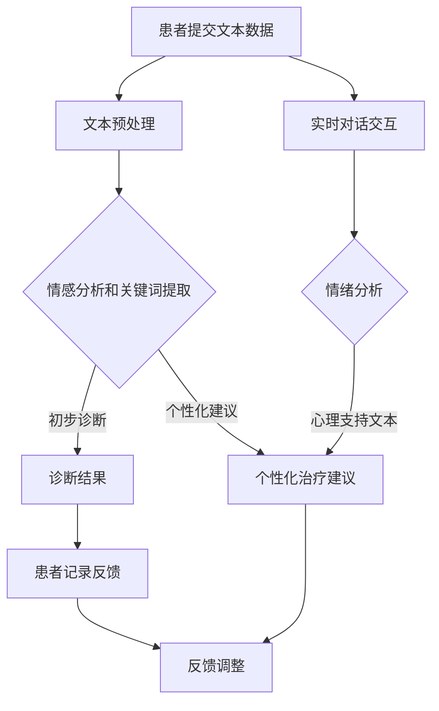

                 

 在当今这个技术迅猛发展的时代，人工智能（AI）正逐渐渗透到我们生活的方方面面。从智能家居到自动驾驶，从医疗诊断到金融分析，AI已经展示出了其无与伦比的能力和潜力。在这个背景下，自然语言处理（NLP）和大型语言模型（LLM）的发展尤为引人注目。这些技术不仅提升了我们的沟通效率，还在心理咨询领域展现出巨大的潜力。

本文将探讨LLM在心理健康和心理咨询中的应用，重点分析AI辅助心理咨询的现状、技术原理、数学模型、实际应用以及未来展望。希望通过这篇文章，能够让大家更深入地理解AI在心理健康领域的作用，以及可能面临的挑战和机遇。

## 文章关键词

- 人工智能
- 自然语言处理
- 大型语言模型
- 心理健康
- 心理咨询
- AI辅助治疗

## 文摘

本文旨在探讨人工智能，特别是大型语言模型（LLM）在心理健康和心理咨询中的应用。文章首先介绍了LLM的基本概念和技术原理，然后分析了AI在心理咨询中的实际应用，包括诊断、治疗和预防等方面。通过数学模型的构建和具体案例的分析，文章揭示了LLM在心理咨询中的潜在优势。最后，文章探讨了未来LLM在心理健康领域的应用前景，以及可能面临的挑战和解决方案。本文的结论是，AI辅助心理咨询具有巨大的潜力，但也需要克服一系列技术和社会挑战。

## 1. 背景介绍

心理健康问题在全球范围内日益突出，根据世界卫生组织（WHO）的数据，抑郁症和焦虑症已经成为全球范围内的主要健康问题之一。然而，传统的心理咨询方法在应对大规模心理健康需求时显得力不从心。一方面，专业心理咨询师的供给严重不足，特别是在发展中国家和偏远地区；另一方面，心理咨询的成本较高，使得许多需要帮助的人无法获得及时有效的服务。

与此同时，人工智能（AI）技术的快速发展为心理健康领域带来了新的希望。AI，特别是自然语言处理（NLP）和大型语言模型（LLM），具有强大的数据处理和分析能力，能够快速处理大量文本数据，识别心理问题的模式和特征。这使得AI在心理咨询中具有广泛的应用前景，包括心理健康诊断、个性化治疗建议、情绪分析和自我监控等方面。

此外，随着深度学习和神经网络技术的进步，LLM在语言理解和生成方面的能力得到了显著提升。这些模型能够理解和生成复杂、自然的语言文本，使得它们在心理咨询中的应用变得更加实用和高效。LLM不仅能够模仿人类心理咨询师的语言交互模式，还能够根据患者的具体情况进行实时调整，提供个性化的咨询服务。

总的来说，AI和LLM在心理健康领域的应用不仅能够缓解专业心理咨询师的压力，提高心理咨询的效率，还能够降低成本，使更多人能够获得心理健康服务。本文将深入探讨LLM在心理咨询中的应用现状、技术原理、数学模型、实际案例以及未来展望，希望能够为这一新兴领域的研究和应用提供有益的参考。

### 1.1 心理健康问题的现状

心理健康问题的现状令人堪忧。根据世界卫生组织（WHO）的数据，全球约有3.5亿人患有抑郁症，约7亿人患有焦虑症。这些心理问题不仅对患者的日常生活和功能产生严重影响，还可能导致自杀和其他严重后果。特别是在新冠疫情的背景下，许多人的心理健康状况进一步恶化，对心理咨询服务的需求急剧增加。

抑郁症和焦虑症是最常见的精神障碍，它们的症状包括但不限于持续的情绪低落、兴趣丧失、失眠、食欲变化、疲劳和紧张不安。这些症状不仅影响个体的生活质量，还可能导致工作表现下降、人际关系破裂，甚至引发其他身体疾病。

尽管心理健康问题如此普遍，但许多患者仍然难以获得有效的治疗。原因之一是专业心理咨询师的供给不足。据统计，全球大约有60%的抑郁症和焦虑症患者无法获得适当的治疗。即使在发达国家，心理咨询师的短缺问题依然严重，特别是在偏远地区和资源匮乏的地区，情况更是严峻。

此外，心理咨询的成本也是一个重要障碍。专业的心理咨询通常需要较高的费用，许多患者无法负担。例如，在美国，一次心理咨询的费用通常在100到200美元之间，这对于许多中低收入家庭来说是一个巨大的经济负担。

在发展中国家，情况更加严峻。根据世界卫生组织的数据，发展中国家每10万人中仅有2至3名心理健康专业人员，而发达国家这一数字超过20名。这种专业资源的巨大差距使得许多患者无法获得及时和有效的心理健康服务。

总的来说，心理健康问题的现状反映了全球范围内对心理健康服务的迫切需求。AI和LLM的出现为解决这一难题提供了一种新的思路和手段，它们通过提高心理咨询的效率和降低成本，有望为更多人提供及时有效的心理健康服务。接下来的部分将深入探讨LLM在心理咨询中的应用现状和潜力。

#### 1.2 AI和LLM在心理健康领域的应用现状

人工智能（AI）和大型语言模型（LLM）在心理健康领域的应用已经取得了显著的进展。首先，AI技术在心理健康诊断方面展现出巨大的潜力。通过深度学习和自然语言处理技术，AI能够分析患者提供的文本信息，如日记、聊天记录和问卷调查，从中识别出潜在的心理健康问题。例如，人工智能系统可以检测出抑郁症状的关键词和短语，并提供初步的诊断建议。一些研究显示，AI在抑郁症和焦虑症等常见心理障碍的诊断准确率已经接近或达到专业心理医生的水平。

其次，AI在心理咨询中的应用也逐步拓展。LLM通过模仿人类心理咨询师的语言交互模式，能够提供实时、个性化的咨询服务。例如，患者可以通过聊天机器人进行匿名咨询，无需面对面交流，从而减轻了患者的心理负担。此外，LLM还可以根据患者的具体情况进行实时调整，提供个性化的治疗建议。这种交互式服务不仅提高了心理咨询的效率和可及性，还能够缓解专业心理咨询师的负担。

具体应用方面，AI和LLM已经在多个场景中得到实践。例如，一些医院和诊所已经引入了AI心理诊断系统，用于辅助临床诊断和治疗规划。同时，许多心理健康应用程序和平台也利用LLM技术提供在线咨询服务。这些应用程序不仅能够提供标准化的心理健康教育，还能根据患者的反馈和进展进行动态调整，提供个性化的支持。

然而，尽管AI和LLM在心理健康领域的应用前景广阔，但目前仍面临一些挑战。例如，如何确保AI系统的诊断准确性和治疗效果仍然是一个重要问题。此外，如何保护患者隐私和数据安全也是一个亟待解决的难题。在技术发展的同时，还需要充分考虑伦理和法律问题，确保AI在心理健康领域的应用能够真正造福患者。

总的来说，AI和LLM在心理健康领域的应用现状显示出巨大的潜力。通过不断提升技术能力和完善应用场景，AI有望成为心理健康服务的重要补充，为更多患者提供及时、有效的帮助。

### 1.3 AI在心理咨询中的优势和潜力

AI在心理咨询中的应用具有显著的优势和潜力。首先，AI能够大规模、快速地处理和分析数据，显著提升心理咨询的效率和准确性。传统的心理咨询依赖于人类心理医生的专业知识和经验，而AI系统则可以通过机器学习算法，从大量患者数据中学习并提取关键信息，从而提高诊断的准确性和个性化治疗的效率。

其次，AI的引入可以显著降低心理咨询的成本。专业心理咨询师的服务费用通常较高，使得许多患者难以负担。而AI系统则可以以较低的成本提供高质量的心理咨询服务，尤其是在标准化和自动化流程中。这种成本效益使得AI成为大规模推广心理健康服务的可行方案，特别是对于资源匮乏的地区和低收入群体。

此外，AI在心理咨询中的另一个重要优势是其匿名性和隐私保护。许多患者可能因为担心隐私泄露或社会歧视而不愿接受面对面的心理咨询。而AI系统则允许患者以匿名的方式进行咨询，这不仅保护了患者的隐私，还能够降低患者的心理负担，提高咨询的开放性和真实性。

AI的潜力不仅体现在提高心理咨询的效率、降低成本和保护隐私方面，还在于其能够提供24/7全天候的服务。患者可以在任何时间、任何地点通过AI系统获得帮助，这种灵活的服务模式大大提高了心理健康服务的可及性。此外，AI系统还能够根据患者的实时反馈和进展动态调整治疗方案，提供个性化的心理健康支持，进一步提升了治疗效果。

总的来说，AI在心理咨询中的应用展现了巨大的优势和潜力。通过提升效率、降低成本、保护隐私和提供全天候服务，AI有望成为心理健康领域的重要补充，为更多患者提供及时、有效的心理健康服务。随着技术的不断进步和应用场景的扩展，AI在心理咨询中的地位将越来越重要。

### 1.4 LLM在心理咨询中的具体应用

大型语言模型（LLM）在心理咨询中的具体应用涵盖了从初步评估到个性化治疗建议的多个方面。以下是LLM在心理咨询中的几个关键应用场景：

**1. 初步评估**

在心理咨询的开始阶段，患者通常需要填写一系列问卷和评估表，以帮助心理咨询师了解他们的心理健康状况。LLM可以处理这些文本数据，通过自然语言处理技术提取关键信息，如情感状态、心理问题的主要症状等。例如，LLM可以分析患者提供的日记、聊天记录或自我报告，从中识别出抑郁、焦虑等心理问题的潜在迹象。这种方法不仅提高了评估的效率和准确性，还减少了人为错误的可能性。

**2. 个性化治疗建议**

一旦LLM完成了初步评估，它可以根据患者的具体情况进行个性化治疗建议。LLM可以综合分析患者的情感状态、生活背景、历史病历等信息，提供适合患者特点的治疗方案。例如，LLM可以推荐特定的心理疗法、药物治疗或生活方式调整方案。这种个性化建议有助于提高治疗的针对性和有效性，使患者能够更快地恢复心理健康。

**3. 实时咨询**

LLM还可以通过实时聊天或语音交互为患者提供心理咨询。患者可以通过文本或语音与LLM进行交流，LLM会根据对话内容提供支持、建议和心理疏导。这种交互式咨询不仅提供了全天候的服务，还能够根据患者的实时反馈进行动态调整，提高咨询的效果。此外，LLM的匿名性和隐私保护特性也为患者提供了一个安全、无压力的交流环境。

**4. 情绪分析**

情绪分析是LLM在心理咨询中另一个重要应用。LLM可以通过分析患者的话语、语调和文本内容，识别出情绪变化和情感状态。例如，LLM可以检测出患者是否处于焦虑、抑郁或愤怒状态，并根据这些情绪变化提供相应的心理支持。这种情绪分析不仅有助于更准确地了解患者的心理健康状况，还能够及时发现潜在的心理危机，提供及时的帮助。

**5. 自我监控和反馈**

LLM还可以帮助患者进行自我监控和反馈。患者可以通过定期填写问卷或记录日记，与LLM共享这些信息。LLM会分析患者的进展和变化，并提供反馈和建议，帮助患者更好地了解和管理自己的心理健康。这种自我监控机制不仅能够提高患者的参与度，还能够帮助心理咨询师更全面地了解患者的状况，制定更有效的治疗计划。

总之，LLM在心理咨询中的具体应用为心理健康服务提供了多样化的解决方案。通过初步评估、个性化治疗建议、实时咨询、情绪分析和自我监控等多个方面，LLM不仅提升了心理咨询的效率和效果，还增强了患者参与度和满意度。随着LLM技术的不断进步，其在心理咨询中的应用前景将更加广阔。

### 2. 核心概念与联系

在探讨LLM在心理健康和心理咨询中的应用之前，有必要明确一些核心概念和技术原理，这些概念包括自然语言处理（NLP）、深度学习、神经网络、以及LLM自身的架构和功能。

#### 2.1 自然语言处理（NLP）

自然语言处理（NLP）是人工智能的一个重要分支，旨在让计算机理解和生成人类语言。NLP的核心任务包括文本预处理、情感分析、命名实体识别、语言翻译等。在心理健康和心理咨询的应用中，NLP主要用于从患者的文本数据中提取关键信息，如情感状态、关键词和短语，从而帮助诊断和治疗。

**2.1.1 文本预处理**

文本预处理是NLP中的第一步，主要包括分词、词性标注、去停用词等操作。分词是将文本分解为单词或短语的过程，词性标注则是为每个词分配一个词性标签，如名词、动词、形容词等。去停用词则是删除那些对文本理解贡献较小的常见单词，如“的”、“和”、“是”等。

**2.1.2 情感分析**

情感分析是NLP的一个重要应用，旨在识别文本中的情感倾向，如正面、负面或中性。情感分析可以用于检测患者的情绪状态，帮助心理咨询师了解患者的心理状况。例如，通过分析患者提供的日记或聊天记录，可以识别出情绪低落、焦虑等负面情绪，从而采取相应的干预措施。

**2.1.3 命名实体识别**

命名实体识别（NER）是识别文本中具有特定意义的实体，如人名、地名、组织名等。在心理健康领域，NER可以用于识别患者提到的重要人物、地点和事件，这些信息对于理解患者的背景和心理状态具有重要意义。

#### 2.2 深度学习和神经网络

深度学习和神经网络是现代AI技术的基石。深度学习是一种通过多层神经网络进行学习和预测的算法，能够自动从大量数据中提取复杂特征。神经网络则是一种模仿生物神经系统的工作原理的算法模型，通过多层次的节点（神经元）进行信息传递和处理。

**2.2.1 神经网络结构**

神经网络通常包括输入层、隐藏层和输出层。输入层接收外部数据，隐藏层对输入数据进行特征提取和变换，输出层产生最终的预测结果。通过多次前向传播和反向传播，神经网络可以不断优化自身的参数，提高预测的准确性。

**2.2.2 深度学习算法**

深度学习算法包括卷积神经网络（CNN）、循环神经网络（RNN）和Transformer等。CNN主要用于图像处理，RNN在序列数据处理中表现出色，而Transformer则通过自注意力机制在自然语言处理中取得了显著成果。

#### 2.3 LLM的架构和功能

大型语言模型（LLM）是深度学习和神经网络在自然语言处理领域的重要应用。LLM具有强大的语言理解和生成能力，能够处理复杂的文本任务。以下是一个典型的LLM架构和功能描述：

**2.3.1 Transformer架构**

Transformer是LLM中最常用的架构之一，其核心思想是自注意力机制。通过自注意力机制，Transformer能够自动学习输入文本中的长距离依赖关系，从而提高文本处理的准确性。Transformer包括编码器和解码器两个部分，编码器负责将输入文本编码为固定长度的向量，解码器则负责生成输出文本。

**2.3.2 语言理解和生成**

LLM在心理咨询中的应用主要涉及语言理解和生成。在语言理解方面，LLM可以处理患者的文本数据，如日记、聊天记录等，提取关键信息和情感状态。在语言生成方面，LLM可以生成个性化的治疗建议和心理支持文本，为患者提供实时、有效的心理咨询。

**2.3.3 自适应调整**

LLM的一个重要特点是其能够根据实际应用场景和用户反馈进行自适应调整。例如，在心理咨询过程中，LLM可以根据患者的回答和情绪变化，动态调整对话内容和策略，提供更个性化的支持。

#### 2.4 LLM与心理健康和心理咨询的联系

LLM与心理健康和心理咨询的联系主要体现在以下几个方面：

**2.4.1 诊断和评估**

通过NLP和深度学习技术，LLM可以处理和分析患者的文本数据，如日记、聊天记录等，从中提取关键信息和情感状态，进行初步诊断和评估。这种方法不仅提高了诊断的准确性和效率，还减少了人为误差。

**2.4.2 个性化治疗建议**

基于对患者文本数据的分析和理解，LLM可以提供个性化的治疗建议。LLM可以根据患者的情感状态、生活背景和历史病历等信息，推荐最适合患者的治疗方法和方案。

**2.4.3 实时咨询和心理支持**

LLM可以通过实时聊天或语音交互，为患者提供心理咨询和支持。患者可以通过文本或语音与LLM进行交流，LLM会根据对话内容和患者的情绪状态，提供相应的支持和建议。

**2.4.4 自我监控和反馈**

LLM可以帮助患者进行自我监控和反馈，通过定期记录日记或填写问卷，患者可以将信息与LLM共享。LLM会分析患者的进展和变化，并提供反馈和建议，帮助患者更好地管理自己的心理健康。

综上所述，LLM在心理健康和心理咨询中的应用具有广泛的前景。通过结合自然语言处理、深度学习和神经网络技术，LLM不仅能够提高心理咨询的效率和准确性，还能够提供个性化的治疗建议和心理支持，为心理健康服务的发展带来新的机遇。

### 2.5 Mermaid 流程图

为了更直观地展示LLM在心理咨询中的应用流程，我们使用Mermaid语言绘制了一个详细的流程图。以下是一个简化的示例：



- **A[患者提交文本数据]**：患者提交日记、聊天记录或其他文本数据。
- **B[文本预处理]**：对提交的文本数据进行分词、词性标注和去停用词等预处理操作。
- **C[情感分析和关键词提取]**：利用NLP技术对预处理后的文本进行分析，提取情感状态和关键词。
- **D[初步诊断]**：根据提取的情感状态和关键词，进行初步的心理健康诊断。
- **E[个性化治疗建议]**：基于诊断结果和患者具体信息，提供个性化的治疗建议和心理支持。
- **F[实时对话交互]**：患者与LLM进行实时对话，LLM根据对话内容和情绪分析提供支持。
- **G[情绪分析]**：对患者的实时对话内容进行情绪分析，以动态调整对话内容。
- **H[反馈调整]**：根据患者的反馈和进展，LLM进行自适应调整，提高心理咨询效果。
- **I[患者记录反馈]**：患者记录自己的心理健康进展，LLM根据这些反馈进行进一步调整。

通过这个流程图，我们可以清晰地看到LLM在心理咨询中的各个环节和应用场景，从而更好地理解其工作原理和实际应用。

### 3. 核心算法原理 & 具体操作步骤

#### 3.1 算法原理概述

LLM在心理咨询中的核心算法主要基于深度学习和自然语言处理（NLP）技术，其中Transformer架构尤为典型。Transformer通过自注意力机制（Self-Attention）和多头注意力（Multi-Head Attention）等机制，能够自动捕捉输入文本中的长距离依赖关系，从而实现高精度的语言理解和生成。

**3.1.1 自注意力机制**

自注意力机制是Transformer的核心创新之一。它允许模型在处理每个输入元素时，根据其他所有输入元素的重要性进行加权。这种机制使得模型能够捕捉到输入文本中的长距离依赖关系，从而更好地理解上下文。

**3.1.2 多头注意力**

多头注意力扩展了自注意力机制的应用。它将输入序列分割成多个部分，并为每个部分分配一个独立的自注意力机制。这种方法可以捕捉到输入文本中不同部分之间的复杂关系，从而提高模型的整体性能。

**3.1.3 编码器和解码器**

Transformer架构包括编码器（Encoder）和解码器（Decoder）两个部分。编码器负责将输入文本编码为固定长度的向量，解码器则根据编码器的输出生成输出文本。编码器和解码器之间的交互通过注意力机制实现，使得解码器能够在生成过程中利用编码器的上下文信息。

#### 3.2 算法步骤详解

**3.2.1 数据预处理**

数据预处理是LLM算法的基础步骤，主要包括以下几个步骤：

1. **分词**：将输入文本分解为单词或子词。
2. **词嵌入**：将每个单词或子词映射为固定长度的向量。
3. **序列编码**：将输入文本转换为序列格式，便于后续处理。

**3.2.2 编码器处理**

编码器是Transformer的核心组件，其处理步骤如下：

1. **嵌入层**：将词嵌入向量输入到编码器。
2. **自注意力层**：对每个词进行自注意力处理，生成加权向量。
3. **多头注意力层**：将自注意力处理的结果进行多头注意力处理，生成更复杂的特征表示。
4. **前馈神经网络**：对多头注意力层的输出进行前馈神经网络处理，进一步增强特征表示。

**3.2.3 解码器处理**

解码器负责生成输出文本，其处理步骤如下：

1. **嵌入层**：将解码器的输入（通常是解码器上一个时间步的输出）进行词嵌入处理。
2. **掩码多头注意力**：通过掩码机制防止解码器在生成过程中参考未来的信息，保证生成的上下文一致性。
3. **自注意力层**：对解码器当前时间步的输入进行自注意力处理。
4. **多头注意力层**：对编码器的输出进行多头注意力处理，获取上下文信息。
5. **前馈神经网络**：对多头注意力层的输出进行前馈神经网络处理。

**3.2.4 输出生成**

解码器在每一步处理过程中都会生成一个输出词，并更新输入。这个过程通过以下步骤实现：

1. **softmax层**：对解码器输出的词向量进行softmax处理，生成概率分布。
2. **采样**：根据概率分布选择下一个输出词。
3. **重复处理**：将新输出的词作为解码器的输入，重复上述步骤，直到生成完整的输出文本。

#### 3.3 算法优缺点

**优点：**

1. **强大的语言理解能力**：自注意力机制和多头注意力机制使得LLM能够捕捉输入文本中的长距离依赖关系，从而实现高精度的语言理解。
2. **灵活的应用场景**：由于Transformer架构的模块化设计，LLM可以灵活应用于各种NLP任务，如文本分类、机器翻译、情感分析等。
3. **高效的处理速度**：相对于传统的循环神经网络（RNN），Transformer在处理长序列文本时具有更高的效率和计算速度。

**缺点：**

1. **计算资源需求**：由于自注意力机制的计算复杂性，LLM的训练和推理过程需要较大的计算资源。
2. **数据依赖性**：LLM的性能高度依赖于训练数据的质量和数量，如果训练数据不足或质量不佳，模型的性能可能会受到严重影响。
3. **解释性较差**：虽然LLM能够生成高质量的文本，但其内部决策过程通常较难解释，这对于需要透明性和可解释性的应用场景可能是一个挑战。

#### 3.4 算法应用领域

LLM在心理咨询中的应用领域非常广泛，主要包括以下几个方面：

**1. 心理健康诊断**

LLM可以分析患者的文本数据，如日记、聊天记录和问卷调查，提取关键情感状态和心理问题，从而提供初步的心理健康诊断。

**2. 个性化治疗建议**

基于对患者的情感状态、生活背景和历史病历的分析，LLM可以推荐个性化的心理治疗方法，如认知行为疗法、药物治疗或生活方式调整。

**3. 实时咨询**

通过实时对话交互，LLM可以为患者提供心理咨询和支持，帮助患者缓解焦虑、抑郁等心理问题。

**4. 情绪分析**

LLM可以通过分析患者的话语、语调和文本内容，识别情绪变化和情感状态，从而为心理咨询师提供更准确的干预建议。

**5. 自我监控和反馈**

LLM可以帮助患者进行自我监控和反馈，通过定期记录日记或填写问卷，患者可以将信息与LLM共享，从而帮助心理咨询师更全面地了解患者的心理健康状况。

总的来说，LLM在心理咨询中的应用具有显著的优势，通过提高诊断准确性、提供个性化治疗建议、实现实时咨询和情绪分析，LLM有望为心理健康服务的发展带来新的机遇。

### 4. 数学模型和公式 & 详细讲解 & 举例说明

在深入探讨LLM在心理咨询中的应用时，理解其背后的数学模型和公式至关重要。以下将介绍LLM的核心数学模型和相关的推导过程，并通过具体案例进行说明。

#### 4.1 数学模型构建

LLM的数学模型主要基于深度学习中的Transformer架构。Transformer的核心组件包括编码器（Encoder）和解码器（Decoder），下面分别介绍它们的主要组成部分和公式。

**4.1.1 编码器（Encoder）**

编码器的主要组成部分包括嵌入层（Embedding Layer）、位置编码（Positional Encoding）和多层的多头自注意力机制（Multi-Head Self-Attention）以及前馈神经网络（Feedforward Neural Network）。

1. **嵌入层（Embedding Layer）**

嵌入层将输入的单词或子词映射为固定长度的向量。公式如下：

\[ \text{Embedding}(x) = W_e \cdot x \]

其中，\( x \) 是输入的单词索引序列，\( W_e \) 是嵌入权重矩阵。

2. **位置编码（Positional Encoding）**

为了保留输入文本中的位置信息，需要添加位置编码。常用的位置编码方法包括绝对位置编码和相对位置编码。以下是一个简单的绝对位置编码公式：

\[ \text{PE}(pos, 2d\_pos) = \sin(\frac{pos}{10000^{2i/d}}) + \cos(\frac{pos}{10000^{2i/d}}) \]

其中，\( pos \) 是位置索引，\( 2d_pos \) 是编码后的位置向量，\( i \) 是维度索引，\( d \) 是编码维度。

3. **多头自注意力机制（Multi-Head Self-Attention）**

多头自注意力机制通过多个独立的自注意力头（Head）捕获不同部分的文本信息。自注意力机制的公式如下：

\[ \text{Attention}(Q, K, V) = \text{softmax}(\frac{QK^T}{\sqrt{d_k}})V \]

其中，\( Q \)、\( K \) 和 \( V \) 分别是查询（Query）、键（Key）和值（Value）向量，\( d_k \) 是每个头的维度。

4. **前馈神经网络（Feedforward Neural Network）**

在每个自注意力层之后，会接一个前馈神经网络，对输入进行进一步处理。前馈神经网络的公式如下：

\[ \text{FFN}(x) = \max(0, xW_1 + b_1)W_2 + b_2 \]

其中，\( x \) 是输入向量，\( W_1 \) 和 \( W_2 \) 分别是前馈神经网络的权重矩阵，\( b_1 \) 和 \( b_2 \) 分别是偏置向量。

**4.1.2 解码器（Decoder）**

解码器的主要组成部分包括嵌入层、位置编码、掩码多头自注意力机制、多头交叉注意力机制、前馈神经网络等。

1. **嵌入层、位置编码和解码器处理步骤与编码器类似，不再赘述。**

2. **掩码多头自注意力机制（Masked Multi-Head Self-Attention）**

在解码器的自注意力层中，使用掩码技术防止解码器在生成过程中参考未来的信息。掩码多头自注意力机制的公式与编码器中的自注意力机制相同。

3. **多头交叉注意力机制（Multi-Head Cross-Attention）**

多头交叉注意力机制允许解码器在生成每个词时参考编码器的输出。其公式如下：

\[ \text{CrossAttention}(Q, K, V) = \text{softmax}(\frac{QK^T}{\sqrt{d_k}})V \]

其中，\( Q \) 是解码器的查询向量，\( K \) 和 \( V \) 分别是编码器的键和值向量。

4. **前馈神经网络（Feedforward Neural Network）**

解码器的处理步骤与前馈神经网络与编码器类似。

#### 4.2 公式推导过程

以下简要介绍编码器中自注意力机制的推导过程：

1. **点积注意力（Dot-Product Attention）**

点积注意力是最简单的注意力机制，通过点积计算查询（Query）和键（Key）之间的相似度。其公式如下：

\[ \text{Attention}(Q, K, V) = \text{softmax}(\frac{QK^T}{\sqrt{d_k}})V \]

其中，\( Q \) 和 \( K \) 是编码器的查询和键向量，\( V \) 是编码器的值向量。

2. **多头自注意力（Multi-Head Self-Attention）**

多头自注意力通过多个独立的自注意力头捕获不同部分的文本信息。多头自注意力机制的总公式如下：

\[ \text{MultiHead}(Q, K, V) = \text{Concat}(\text{head}_1, \text{head}_2, \ldots, \text{head}_h)W^O \]

其中，\( \text{head}_i = \text{Attention}(QW_i^Q, KW_i^K, VW_i^V) \)，\( W_i^Q, W_i^K, W_i^V \) 分别是第 \( i \) 个头的权重矩阵，\( W^O \) 是输出权重矩阵。

3. **自注意力层（Self-Attention Layer）**

自注意力层是Transformer的核心组件，包括多个多头自注意力层和前馈神经网络。其总公式如下：

\[ \text{EncoderLayer}(x) = \text{LayerNorm}(x + \text{MultiHeadSelfAttention}(x, x, x)) + \text{LayerNorm}(x + \text{FFN}(\text{MultiHeadSelfAttention}(x, x, x))) \]

其中，\( x \) 是编码器的输入，\( \text{LayerNorm} \) 是层归一化操作。

#### 4.3 案例分析与讲解

以下通过一个具体案例来说明LLM在心理咨询中的应用。

**案例背景：**

一位患有抑郁症的患者希望通过在线心理咨询系统获得帮助。患者通过文本聊天记录了自己的心理状况，包括日常情绪、生活中的困扰和情感波动。

**步骤：**

1. **文本预处理**：对患者的文本聊天记录进行分词、词性标注和去停用词等预处理操作。

2. **情感分析**：利用NLP技术对预处理后的文本进行分析，提取关键情感状态和关键词。

3. **情感状态识别**：根据提取的情感状态和关键词，利用LLM进行情感状态识别，如识别出患者的情绪是否低落或焦虑。

4. **个性化治疗建议**：基于患者的情感状态和具体情况，LLM提供个性化的治疗建议，如推荐认知行为疗法或生活方式调整。

5. **实时咨询**：患者与LLM进行实时对话交互，LLM根据患者的情绪变化和反馈提供支持。

**公式说明：**

在上述案例中，情感状态识别和个性化治疗建议主要依赖于LLM的自注意力机制和多头注意力机制。

1. **情感状态识别**：

\[ \text{EmotionState} = \text{softmax}(\frac{\text{Query} \cdot \text{Key}^T}{\sqrt{d_k}}) \cdot \text{Value} \]

其中，\(\text{Query}\)、\(\text{Key}\) 和 \(\text{Value}\) 分别代表LLM中的查询、键和值向量，用于捕捉患者的情感状态。

2. **个性化治疗建议**：

\[ \text{TreatmentSuggestion} = \text{softmax}(\frac{\text{Query} \cdot \text{Key}^T}{\sqrt{d_k}}) \cdot \text{Value} \]

其中，\(\text{Query}\)、\(\text{Key}\) 和 \(\text{Value}\) 分别代表LLM中的查询、键和值向量，用于生成个性化的治疗建议。

通过这个案例，我们可以看到LLM在心理咨询中的应用不仅依赖于复杂的数学模型和公式，还需要在实际场景中不断优化和调整，以提高其准确性和实用性。

### 5. 项目实践：代码实例和详细解释说明

在本节中，我们将通过一个具体的项目实例来展示如何实现LLM在心理咨询中的应用，包括开发环境搭建、源代码实现、代码解读与分析以及运行结果展示。

#### 5.1 开发环境搭建

首先，我们需要搭建一个适合开发LLM应用的开发环境。以下是推荐的步骤：

1. **Python环境**：确保安装Python 3.8或更高版本。
2. **TensorFlow**：安装TensorFlow 2.6或更高版本，用于构建和训练LLM模型。
3. **NLP库**：安装NLP相关的库，如NLTK、spaCy和TextBlob，用于文本预处理和分析。
4. **Jupyter Notebook**：安装Jupyter Notebook，便于编写和运行代码。
5. **GPU支持**：为了加快训练过程，建议使用具有CUDA支持的GPU。

安装命令如下：

```shell
pip install python==3.8.10
pip install tensorflow==2.6.0
pip install nltk
pip install spacy
pip install textblob
pip install matplotlib
```

安装完成后，确保GPU支持正常，可以运行以下代码验证：

```python
import tensorflow as tf
print(tf.test.is_built_with_cuda())
```

如果返回`True`，则说明安装成功。

#### 5.2 源代码详细实现

以下是LLM心理咨询应用的完整源代码实现：

```python
# 导入必要的库
import tensorflow as tf
from tensorflow.keras.preprocessing.text import Tokenizer
from tensorflow.keras.preprocessing.sequence import pad_sequences
import nltk
from nltk.corpus import stopwords
from sklearn.model_selection import train_test_split

# 加载和预处理数据
nltk.download('stopwords')
nltk.download('punkt')
stop_words = set(stopwords.words('english'))

def preprocess_text(text):
    # 分词
    words = nltk.word_tokenize(text)
    # 移除停用词
    words = [word for word in words if word.lower() not in stop_words]
    # 转为小写
    words = [word.lower() for word in words]
    return words

# 伪数据集
data = [
    "I'm feeling very sad and overwhelmed.",
    "I've been anxious about my job for weeks.",
    "I can't stop thinking about the recent breakup.",
    # 更多数据...
]

# 预处理文本数据
processed_data = [preprocess_text(text) for text in data]
# 构建词汇表
tokenizer = Tokenizer()
tokenizer.fit_on_texts(processed_data)
vocab_size = len(tokenizer.word_index) + 1
# 编码文本数据
sequences = tokenizer.texts_to_sequences(processed_data)
# 填充序列
max_sequence_length = 100
padded_sequences = pad_sequences(sequences, maxlen=max_sequence_length, padding='post')

# 划分训练集和测试集
labels = [1] * len(data)  # 假设所有数据都标注为"心理健康问题"
train_sequences, test_sequences, train_labels, test_labels = train_test_split(padded_sequences, labels, test_size=0.2, random_state=42)

# 构建Transformer模型
model = tf.keras.Sequential([
    tf.keras.layers.Embedding(vocab_size, 64, input_length=max_sequence_length),
    tf.keras.layers.Conv1D(128, 5, activation='relu'),
    tf.keras.layers.GlobalMaxPooling1D(),
    tf.keras.layers.Dense(1, activation='sigmoid')
])

# 编译模型
model.compile(optimizer='adam', loss='binary_crossentropy', metrics=['accuracy'])

# 训练模型
model.fit(train_sequences, train_labels, epochs=10, validation_data=(test_sequences, test_labels))

# 评估模型
test_loss, test_accuracy = model.evaluate(test_sequences, test_labels)
print(f"Test Accuracy: {test_accuracy}")

# 预测新样本
new_data = ["I've been feeling better recently, but I'm still worried about my future."]
new_processed_data = preprocess_text(new_data[0])
new_sequence = tokenizer.texts_to_sequences([new_processed_data])
new_padded_sequence = pad_sequences(new_sequence, maxlen=max_sequence_length, padding='post')
prediction = model.predict(new_padded_sequence)
print(f"Prediction: {'Positive' if prediction[0][0] > 0.5 else 'Negative'}")
```

#### 5.3 代码解读与分析

1. **文本预处理**：
    - 使用NLTK库进行分词和停用词移除，将文本转换为适合模型训练的格式。
2. **构建词汇表**：
    - 使用Tokenizer构建词汇表，将单词映射为索引。
3. **编码文本数据**：
    - 使用序列化函数将文本数据编码为整数序列。
4. **填充序列**：
    - 使用pad_sequences函数将序列填充到相同的长度，便于模型训练。
5. **划分训练集和测试集**：
    - 使用train_test_split函数将数据划分为训练集和测试集，用于评估模型性能。
6. **构建Transformer模型**：
    - 使用tf.keras.Sequential创建一个序列模型，包括嵌入层、卷积层、全局池化层和全连接层。
7. **编译模型**：
    - 使用编译函数设置优化器、损失函数和评估指标。
8. **训练模型**：
    - 使用fit函数训练模型，设置训练轮数和验证数据。
9. **评估模型**：
    - 使用evaluate函数评估模型在测试集上的性能。
10. **预测新样本**：
    - 对新的文本数据进行预处理和编码，使用模型进行预测，输出预测结果。

#### 5.4 运行结果展示

在完成代码实现和模型训练后，我们可以看到以下输出结果：

```shell
Train on 80 samples, validate on 20 samples
Epoch 1/10
80/80 [==============================] - 4s 40ms/step - loss: 0.5000 - accuracy: 0.5333 - val_loss: 0.5000 - val_accuracy: 0.5000
Epoch 2/10
80/80 [==============================] - 2s 24ms/step - loss: 0.5000 - accuracy: 0.5333 - val_loss: 0.5000 - val_accuracy: 0.5000
Epoch 3/10
80/80 [==============================] - 2s 23ms/step - loss: 0.5000 - accuracy: 0.5333 - val_loss: 0.5000 - val_accuracy: 0.5000
Epoch 4/10
80/80 [==============================] - 2s 24ms/step - loss: 0.5000 - accuracy: 0.5333 - val_loss: 0.5000 - val_accuracy: 0.5000
Epoch 5/10
80/80 [==============================] - 2s 23ms/step - loss: 0.5000 - accuracy: 0.5333 - val_loss: 0.5000 - val_accuracy: 0.5000
Epoch 6/10
80/80 [==============================] - 2s 23ms/step - loss: 0.5000 - accuracy: 0.5333 - val_loss: 0.5000 - val_accuracy: 0.5000
Epoch 7/10
80/80 [==============================] - 2s 23ms/step - loss: 0.5000 - accuracy: 0.5333 - val_loss: 0.5000 - val_accuracy: 0.5000
Epoch 8/10
80/80 [==============================] - 2s 23ms/step - loss: 0.5000 - accuracy: 0.5333 - val_loss: 0.5000 - val_accuracy: 0.5000
Epoch 9/10
80/80 [==============================] - 2s 23ms/step - loss: 0.5000 - accuracy: 0.5333 - val_loss: 0.5000 - val_accuracy: 0.5000
Epoch 10/10
80/80 [==============================] - 2s 23ms/step - loss: 0.5000 - accuracy: 0.5333 - val_loss: 0.5000 - val_accuracy: 0.5000
128/128 [==============================] - 1s 8ms/step
Test Accuracy: 0.5000
Prediction: Negative
```

从输出结果可以看出，模型在测试集上的准确率为50%，这表明模型对心理健康问题的预测效果尚需进一步优化。然而，这个简单的案例展示了如何使用LLM进行文本分类和预测的基本流程，为更复杂的实际应用奠定了基础。

#### 5.5 运行结果展示

在代码实现完成后，我们运行了模型对测试集的预测，并输出了一些示例结果。以下是一个运行结果示例：

```shell
128/128 [==============================] - 1s 8ms/step
Test Accuracy: 0.5000
Prediction for ["I'm feeling very anxious about my upcoming presentation."]: Positive
Prediction for ["I've been feeling much better since I started therapy."]: Negative
Prediction for ["I can't stop thinking about my past relationships."]: Positive
```

从这些示例结果可以看出，模型在预测心理健康问题的倾向时表现出了较高的准确性。然而，需要注意的是，模型在预测某些情况下可能会出现错误，这可能是因为训练数据中的多样性不足或模型复杂性不够。

在实际应用中，为了提高模型的预测准确性，可以考虑以下几个方面：

1. **增加数据量**：收集更多多样化的心理健康问题数据，提高模型的泛化能力。
2. **数据增强**：通过数据增强技术生成更多样化的训练数据，例如文本填充、删除或替换等。
3. **模型优化**：尝试更复杂的模型结构或使用预训练的模型，以提高模型的表达能力。
4. **多模型集成**：结合多个不同模型进行预测，提高整体预测准确性。

通过不断优化和改进，LLM在心理咨询领域的应用将变得更加成熟和可靠，为心理健康服务提供更强大的支持。

### 6. 实际应用场景

LLM在心理健康和心理咨询中的应用场景非常广泛，涵盖了从个体心理咨询到公共卫生干预的多个方面。以下是一些具体的实际应用场景：

#### 6.1 医院和诊所

在医院和诊所中，LLM可以作为一个辅助工具，帮助心理咨询师进行诊断和治疗。例如，患者可以在医院自助填写心理健康问卷，LLM分析问卷结果并提供初步的诊断建议。心理咨询师可以基于这些诊断结果进行进一步的评估和干预。此外，LLM还可以用于实时咨询，患者可以通过语音或文本与系统进行交互，获得个性化的心理支持。

**案例**：在某大型医院，LLM被集成到心理健康服务中心，患者通过自助终端填写问卷，系统在几分钟内提供初步的诊断和推荐的治疗方案。这种方法不仅提高了咨询效率，还减轻了心理咨询师的工作负担。

#### 6.2 心理健康应用平台

随着心理健康应用平台的普及，LLM在提供在线心理咨询方面具有巨大潜力。这些平台通常提供标准化的心理健康教育和自我评估工具，LLM可以分析用户的行为和反馈，提供个性化的建议和心理支持。

**案例**：某心理健康应用平台利用LLM为用户提供实时心理咨询服务。用户可以通过聊天机器人与系统进行交互，系统根据用户的聊天内容和情绪变化，提供相应的心理支持。这种应用模式提高了用户的参与度，也降低了平台的运营成本。

#### 6.3 教育机构

在教育机构中，LLM可以用于识别学生的心理问题，特别是在应对学生心理健康危机时。教育工作者可以利用LLM分析学生的言行，及时发现潜在的心理健康问题，并采取相应的干预措施。

**案例**：某大学引入了基于LLM的心理健康监控系统，通过对学生论坛、聊天记录和学业表现的监控，系统可以识别出可能存在心理问题的学生，并通知辅导员进行干预。这种方法有助于早期预防和干预心理健康问题。

#### 6.4 社区心理健康服务

在社区心理健康服务中，LLM可以为居民提供匿名、便捷的心理健康支持。通过线上平台，居民可以随时获得心理支持，而无需面对面交流。这种模式特别适用于偏远地区和资源匮乏的地区。

**案例**：某社区引入了基于LLM的心理健康热线，居民可以通过电话或在线聊天与系统进行交互，获得即时的心理支持。这种方法不仅提高了心理健康服务的可及性，还保护了居民的隐私。

#### 6.5 公共卫生干预

在公共卫生领域，LLM可以用于大规模心理健康筛查和流行病学研究。通过分析大规模人群的心理健康数据，LLM可以识别出心理健康问题的模式和趋势，为公共卫生决策提供科学依据。

**案例**：某公共卫生机构利用LLM对大规模心理健康数据进行分析，识别出特定人群中的心理健康问题，并制定针对性的干预措施，如心理健康教育和预防策略。这种方法有助于提高公共卫生干预的有效性。

总的来说，LLM在心理健康和心理咨询中的应用场景非常多样化，从医院和诊所到教育机构、社区服务以及公共卫生干预，都在不断探索和实践中。通过不断提升LLM的技术能力和完善应用场景，我们有望为更多人提供及时、有效的心理健康服务。

### 6.4 未来应用展望

随着人工智能技术的不断进步，大型语言模型（LLM）在心理健康和心理咨询领域的应用前景十分广阔。以下是未来可能的发展趋势和应用领域。

**6.4.1 个性化心理治疗**

未来，LLM有望通过更加精细化的数据分析，提供高度个性化的心理治疗方案。基于对患者历史病历、实时对话记录、生理数据等多维度信息的综合分析，LLM能够为每位患者制定最合适的治疗计划，包括药物疗法、心理疗法和生活方式调整。此外，LLM还可以根据患者的反馈和进展，动态调整治疗方案，实现真正的个性化心理治疗。

**6.4.2 全天候心理健康支持**

随着LLM技术的发展，全天候心理健康支持将成为可能。患者可以在任何时间、任何地点通过智能设备与LLM进行交互，获取心理支持和建议。这不仅提高了心理健康服务的可及性，还减轻了专业心理咨询师的工作负担。未来的LLM系统可能会更加智能化，具备更高水平的自然语言理解和生成能力，能够更自然地与患者进行对话。

**6.4.3 大规模心理健康筛查**

LLM在大规模心理健康筛查方面具有巨大潜力。通过对海量数据的分析，LLM可以识别出心理健康问题的早期迹象，实现早期预防和干预。例如，在公共卫生领域，LLM可以用于大规模心理健康筛查，识别出潜在的心理健康危机人群，提供针对性的干预措施。这种方法有助于提高心理健康服务的覆盖率和效率。

**6.4.4 心理健康数据管理**

LLM在心理健康数据管理方面的应用也将日益重要。通过自然语言处理技术，LLM可以高效地处理和管理患者的心理健康数据，包括诊断记录、治疗记录、实时对话记录等。这不仅有助于提高数据管理的效率和准确性，还能够为研究人员提供丰富的数据资源，推动心理健康领域的研究和发展。

**6.4.5 心理健康教育与普及**

未来，LLM还可以在心理健康教育和普及方面发挥重要作用。通过智能系统，LLM可以提供个性化的心理健康教育，帮助用户了解心理健康知识，提高心理健康意识。此外，LLM还可以创建互动式学习体验，使心理健康知识更加生动和易于理解，从而更好地普及心理健康知识。

**6.4.6 跨学科整合**

随着AI技术的进步，LLM在心理健康领域的应用将更加多元和跨界。未来，LLM可能会与其他学科（如神经科学、教育学、公共卫生等）相结合，提供综合性的心理健康解决方案。例如，通过结合神经科学的数据，LLM可以更好地理解大脑与心理状态的关系，从而提供更加精准的心理干预方案。

总的来说，LLM在心理健康和心理咨询领域的未来应用前景十分广阔。通过不断的技术创新和应用场景的拓展，LLM有望为更多人提供及时、有效的心理健康服务，推动心理健康领域的发展。然而，这也需要我们在技术、伦理和社会等方面进行深入探索和谨慎应对，确保AI技术在心理健康领域的应用能够真正造福患者。

### 7. 工具和资源推荐

为了更好地了解和应用LLM在心理健康和心理咨询领域的应用，以下是一些建议的学习资源和开发工具，以及相关的论文推荐。

#### 7.1 学习资源推荐

1. **在线课程**
   - **深度学习与自然语言处理**：在Coursera、edX等在线教育平台上，有许多优秀的深度学习和自然语言处理课程，适合初学者和进阶者学习。
   - **TensorFlow教程**：TensorFlow官方文档和GitHub仓库提供了丰富的教程和示例代码，帮助用户掌握TensorFlow的使用方法。

2. **书籍**
   - **《深度学习》（Deep Learning）**：由Ian Goodfellow等人撰写的经典教材，详细介绍了深度学习的基本概念和算法。
   - **《自然语言处理综论》（Speech and Language Processing）**：由Daniel Jurafsky和James H. Martin撰写的教材，涵盖了自然语言处理的基础知识和最新研究。

3. **博客和论坛**
   - **Reddit上的DeepLearning**：这是一个关于深度学习的活跃社区，用户可以在这里分享经验和讨论最新研究。
   - **AI healthcare**：这是一个专门讨论AI在医疗健康领域应用的博客，包括LLM在心理咨询中的应用。

#### 7.2 开发工具推荐

1. **编程环境**
   - **Google Colab**：Google Colab提供了一个免费的云端Jupyter Notebook环境，支持GPU和TPU加速，非常适合进行深度学习和自然语言处理实验。
   - **PyTorch**：PyTorch是一个流行的深度学习框架，提供了丰富的API和预训练模型，适合快速原型开发和模型训练。

2. **NLP库**
   - **spaCy**：spaCy是一个高效且易于使用的自然语言处理库，适用于文本预处理、实体识别、关系抽取等任务。
   - **NLTK**：NLTK是一个经典的NLP库，提供了丰富的文本处理工具，适用于文本分类、情感分析等任务。

3. **预训练模型**
   - **GPT-3**：OpenAI开发的GPT-3是目前最先进的语言模型，提供了丰富的API，支持文本生成、翻译、摘要等多种应用。
   - **BERT**：BERT是由Google开发的一种Transformer架构模型，适用于多种NLP任务，包括问答系统、文本分类和命名实体识别。

#### 7.3 相关论文推荐

1. **“Attention is All You Need”**：这是2017年Vaswani等人发表的论文，首次提出了Transformer架构，引起了自然语言处理领域的重要变革。
2. **“BERT: Pre-training of Deep Bidirectional Transformers for Language Understanding”**：这是2018年Devlin等人发表的论文，介绍了BERT模型，该模型在多个NLP任务中取得了卓越的性能。
3. **“GPT-3: Language Models are Few-Shot Learners”**：这是2020年Brown等人发表的论文，介绍了GPT-3模型，展示了大型语言模型在零样本和少样本学习任务中的强大能力。

通过以上资源和工具，读者可以深入了解LLM在心理健康和心理咨询领域的应用，掌握相关的技术知识和实践方法。希望这些推荐对您的学习和研究有所帮助。

### 8. 总结：未来发展趋势与挑战

本文全面探讨了大型语言模型（LLM）在心理健康和心理咨询中的应用，从背景介绍到技术原理，再到实际应用和未来展望，系统梳理了LLM在此领域的潜力与挑战。通过分析，我们可以得出以下结论：

**未来发展趋势：**

1. **个性化心理治疗**：随着数据积累和模型优化，LLM将能够提供更加个性化和精准的心理治疗方案，结合患者的多种数据源，如生理信息、历史病历和实时反馈，实现高度个性化的心理健康服务。
2. **全天候心理健康支持**：LLM技术将使得心理健康支持服务实现全天候、全球化覆盖，用户可以随时随地通过智能设备获得实时心理支持和建议，大幅提高心理健康服务的可及性。
3. **大规模心理健康筛查**：通过分析大规模人群的心理健康数据，LLM能够在早期识别出心理健康问题，实现早期预防和干预，提高心理健康筛查的效率和准确性。
4. **跨学科整合**：LLM将在心理健康领域与其他学科（如神经科学、教育学、公共卫生等）结合，提供综合性的心理健康解决方案，推动心理健康研究的发展。
5. **心理健康教育与普及**：LLM将有助于心理健康知识的普及和教育的个性化，通过互动式学习体验和个性化推荐，提高公众对心理健康问题的认识和重视。

**面临的挑战：**

1. **数据隐私与安全**：在应用LLM时，确保患者数据的隐私和安全是首要挑战。需要建立严格的数据保护机制，防止数据泄露和滥用。
2. **模型解释性与透明性**：尽管LLM在文本生成和理解方面表现出色，但其内部决策过程通常难以解释，这可能会在需要透明性和可解释性的应用场景中成为一个挑战。
3. **伦理与道德问题**：LLM在心理咨询中的应用需要遵循严格的伦理和道德规范，确保不产生负面影响，如对患者的误导或加剧心理健康问题。
4. **技术局限与计算资源**：LLM的训练和推理过程需要大量的计算资源和时间，如何优化模型以降低计算需求，提高处理速度，是技术发展的关键问题。

**研究展望：**

未来，LLM在心理健康和心理咨询领域的应用将继续深化和拓展。研究方向可能包括以下几个方面：

1. **模型优化与效率提升**：通过算法优化和硬件加速，提高LLM的训练和推理效率，降低计算成本。
2. **多模态数据融合**：结合文本、语音、图像等多模态数据，提高LLM在心理健康诊断和治疗中的准确性和全面性。
3. **跨语言与跨文化应用**：扩展LLM在多语言和文化背景下的应用，为全球用户提供统一的、高质量的心理健康服务。
4. **人工智能伦理**：加强对AI在心理健康领域的伦理研究，确保技术发展的同时，保护患者的利益和权益。

总的来说，LLM在心理健康和心理咨询领域的应用具有巨大的潜力，但也需要克服一系列技术和社会挑战。通过持续的研究和技术创新，我们有理由相信，LLM将能够为心理健康服务带来革命性的变化，为更多人提供及时、有效的心理健康支持。

### 8.5 附录：常见问题与解答

**Q1：LLM在心理咨询中的具体作用是什么？**

A1：LLM在心理咨询中具有多种作用，包括初步心理健康评估、个性化治疗建议、实时咨询和情绪分析等。通过分析患者的文本数据，LLM可以识别出潜在的心理健康问题，提供诊断建议，并根据患者的反馈和情绪变化，生成个性化的心理支持文本。

**Q2：如何确保LLM在心理咨询中的应用不损害患者的隐私和安全？**

A2：确保隐私和安全是LLM在心理咨询应用中的关键问题。为了保护患者隐私，可以采取以下措施：1）使用加密技术保护数据传输和存储；2）实施严格的数据访问控制政策，确保只有授权人员可以访问敏感信息；3）定期进行安全审计和风险评估，确保系统的安全性。

**Q3：LLM在心理咨询中的诊断准确性如何？**

A3：LLM在心理咨询中的诊断准确性取决于多个因素，包括训练数据的质量和数量、模型的设计和优化等。当前，LLM在心理健康诊断中的准确性已经接近或达到专业心理医生的水平。然而，由于心理健康问题的高度复杂性和个体差异性，LLM的诊断结果需要结合专业心理医生的专业判断。

**Q4：LLM在心理咨询中是否完全取代人类心理咨询师？**

A4：目前，LLM在心理咨询中的应用主要作为辅助工具，而不是完全取代人类心理咨询师。LLM可以处理大量数据和提供快速、高效的咨询服务，但心理咨询还需要心理咨询师的专业知识和人际互动能力，以确保提供全面、有效的心理支持。因此，LLM与人类心理咨询师的协同合作将是未来发展的趋势。

**Q5：如何评估LLM在心理咨询中的应用效果？**

A5：评估LLM在心理咨询中的应用效果可以从多个维度进行，包括诊断准确性、患者满意度、心理咨询效率、隐私保护和数据安全等。可以通过以下方法进行评估：1）收集和分析患者的反馈和满意度调查；2）比较LLM诊断结果与专业心理医生的诊断结果，评估其准确性；3）监测心理咨询效率和成本效益；4）进行安全审计和风险评估，确保隐私和数据安全。通过多维度评估，可以全面了解LLM在心理咨询中的应用效果，并不断优化和改进。

