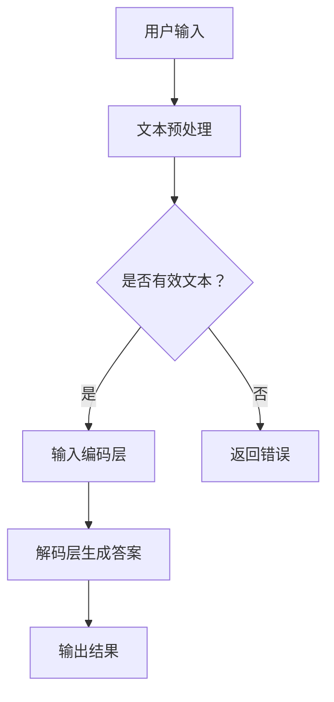

                 

关键词：大型语言模型(LLM)，智能办公，工作效率，算法原理，数学模型，项目实践，应用场景，未来展望

> 摘要：本文深入探讨了大型语言模型（LLM）在智能办公领域的应用，通过详细分析LLM的核心概念、算法原理、数学模型以及实际项目实践，揭示了LLM在提升工作效率方面的巨大潜力。文章旨在为读者提供全面的技术解读和实用的实践指导，为智能办公的未来发展提供新思路。

## 1. 背景介绍

在信息化和数字化迅速发展的今天，企业对于工作效率的需求越来越高。传统的办公模式已经无法满足日益复杂的工作环境。随着人工智能技术的不断进步，特别是大型语言模型（LLM）的兴起，为智能办公带来了全新的可能性。LLM作为一种先进的自然语言处理技术，具有强大的语义理解、生成和推理能力，可以在多个方面提升工作效率，包括但不限于文本处理、智能问答、自动化撰写和决策支持等。

本文将首先介绍LLM的基本概念和原理，然后详细分析其在智能办公中的应用，最后探讨未来的发展趋势和面临的挑战。

## 2. 核心概念与联系

### 2.1 LLM概述

大型语言模型（LLM）是指使用深度学习技术训练的巨大规模的神经网络模型，用于理解和生成自然语言。LLM的核心思想是通过对海量语言数据的训练，使模型能够自动学习语言的结构、语义和语法，从而实现高质量的自然语言处理。

### 2.2 LLM架构

LLM的架构通常包括输入层、编码层、解码层和输出层。输入层接收自然语言文本，编码层将文本转换为高维向量表示，解码层根据编码层的输出生成自然语言文本，输出层则是模型最终的输出。

### 2.3 LLM应用领域

LLM的应用领域广泛，包括但不限于智能客服、智能写作、智能翻译、文本分类和情感分析等。在智能办公中，LLM可以应用于邮件处理、文档生成、会议记录、智能搜索和决策支持等场景。

### 2.4 Mermaid流程图

以下是LLM在智能办公中应用的一个简单Mermaid流程图：



## 3. 核心算法原理 & 具体操作步骤

### 3.1 算法原理概述

LLM的核心算法是基于深度学习中的Transformer模型。Transformer模型通过自注意力机制（Self-Attention）处理序列数据，能够捕捉文本中的长距离依赖关系，从而实现高效的文本处理。

### 3.2 算法步骤详解

1. **数据预处理**：首先对输入的文本进行预处理，包括分词、去噪、去停用词等操作。
2. **编码层处理**：将预处理后的文本转换为序列向量表示，使用自注意力机制进行编码。
3. **解码层生成**：根据编码层的输出，解码层生成对应的自然语言文本。
4. **输出结果**：将生成的文本输出，作为最终的结果。

### 3.3 算法优缺点

**优点**：  
- **高效**：Transformer模型具有并行计算的优势，能够高效处理大量文本数据。  
- **强大**：自注意力机制能够捕捉文本中的长距离依赖关系，使模型具有强大的语义理解能力。

**缺点**：  
- **计算量大**：由于模型规模巨大，训练和推理的计算资源需求较高。  
- **数据依赖**：模型性能依赖于训练数据的规模和质量，数据不足可能导致模型效果不佳。

### 3.4 算法应用领域

LLM在智能办公中的应用领域广泛，如文本生成、文本分类、问答系统、文本摘要等。具体应用包括：

- **文本生成**：自动化撰写报告、邮件、文章等。  
- **文本分类**：对用户输入的文本进行分类，如邮件分类、文档分类等。  
- **问答系统**：基于用户输入的问题，自动生成答案。  
- **文本摘要**：从大量文本中提取关键信息，生成摘要。

## 4. 数学模型和公式 & 详细讲解 & 举例说明

### 4.1 数学模型构建

LLM的核心数学模型是基于Transformer模型。Transformer模型的主要组件包括多头自注意力机制（Multi-Head Self-Attention）和前馈神经网络（Feedforward Neural Network）。

### 4.2 公式推导过程

#### 自注意力机制

自注意力机制的公式如下：

$$
\text{Attention}(Q, K, V) = \text{softmax}\left(\frac{QK^T}{\sqrt{d_k}}\right) V
$$

其中，$Q$、$K$、$V$ 分别代表查询向量、键向量和值向量，$d_k$ 代表键向量的维度。

#### 前馈神经网络

前馈神经网络的公式如下：

$$
\text{FFN}(x) = \text{ReLU}(W_2 \cdot \text{ReLU}(W_1 x + b_1))
$$

其中，$W_1$、$W_2$ 分别代表权重矩阵，$b_1$ 代表偏置项。

### 4.3 案例分析与讲解

#### 案例一：文本分类

假设有一个分类问题，需要判断一段文本是正面还是负面。使用LLM进行文本分类的步骤如下：

1. **数据预处理**：对文本进行分词、去停用词等操作，将其转换为向量表示。
2. **编码层处理**：将向量输入到编码层，通过自注意力机制获取文本的语义信息。
3. **解码层生成**：根据编码层的输出，解码层生成对应的标签。
4. **损失函数**：使用交叉熵损失函数计算分类损失，并通过反向传播更新模型参数。

#### 案例二：文本生成

假设需要自动生成一篇关于某产品的营销文案。使用LLM进行文本生成的步骤如下：

1. **数据预处理**：收集相关产品的文本数据，进行分词、去停用词等操作。
2. **编码层处理**：将文本数据输入到编码层，通过自注意力机制获取文本的语义信息。
3. **解码层生成**：根据编码层的输出，解码层生成对应的营销文案。
4. **优化策略**：使用生成对抗网络（GAN）等优化策略，提高文本生成的质量。

## 5. 项目实践：代码实例和详细解释说明

### 5.1 开发环境搭建

在本项目中，我们将使用Python和PyTorch作为开发环境。首先，安装PyTorch：

```
pip install torch torchvision
```

### 5.2 源代码详细实现

以下是使用PyTorch实现一个简单的文本分类模型的代码：

```python
import torch
import torch.nn as nn
import torch.optim as optim
from torchtext.datasets import IMDB
from torchtext.data import Field, BatchIterator

# 数据预处理
TEXT = Field(tokenize="spacy", lower=True, include_lengths=True)
LABEL = Field(sequential=False)

train_data, test_data = IMDB.splits(TEXT, LABEL)
TEXT.build_vocab(train_data, max_size=25000, vectors="glove.6B.100d")
LABEL.build_vocab(train_data)

# 模型定义
class TextClassifier(nn.Module):
    def __init__(self, embedding_dim, hidden_dim, output_dim, num_layers, dropout):
        super().__init__()
        self.embedding = nn.Embedding.from_pretrained(TEXT.vocab.vectors)
        self.rnn = nn.LSTM(embedding_dim, hidden_dim, num_layers=num_layers, dropout=dropout, batch_first=True)
        self.fc = nn.Linear(hidden_dim, output_dim)
        self.dropout = nn.Dropout(dropout)
        
    def forward(self, text, text_lengths):
        embedded = self.dropout(self.embedding(text))
        packed_embedded = nn.utils.rnn.pack_padded_sequence(embedded, text_lengths, batch_first=True)
        packed_output, (hidden, cell) = self.rnn(packed_embedded)
        output, output_lengths = nn.utils.rnn.pad_packed_sequence(packed_output, batch_first=True)
        hidden = self.dropout(hidden[-1, :, :])
        return self.fc(hidden)

# 模型训练
model = TextClassifier(embedding_dim=100, hidden_dim=128, output_dim=2, num_layers=2, dropout=0.5)
optimizer = optim.Adam(model.parameters())
criterion = nn.CrossEntropyLoss()

for epoch in range(10):
    model.train()
    for batch in BatchIterator(train_data, batch_size=32):
        optimizer.zero_grad()
        text, text_lengths = batch.text
        predictions = model(text, text_lengths).squeeze(1)
        loss = criterion(predictions, batch.label)
        loss.backward()
        optimizer.step()
    print(f"Epoch: {epoch+1}, Loss: {loss.item()}")

# 模型评估
model.eval()
with torch.no_grad():
    correct = 0
    total = 0
    for batch in BatchIterator(test_data, batch_size=32):
        text, text_lengths = batch.text
        predictions = model(text, text_lengths).squeeze(1)
        _, predicted = torch.max(predictions, 1)
        total += batch.label.size(0)
        correct += (predicted == batch.label).sum().item()
    print(f"Test Accuracy: {100 * correct / total}%")
```

### 5.3 代码解读与分析

该代码首先进行了数据预处理，包括文本的分词、去停用词和词嵌入。然后定义了一个文本分类模型，包括嵌入层、循环神经网络（RNN）和全连接层。模型使用交叉熵损失函数进行训练，并在测试集上评估了模型的准确率。

### 5.4 运行结果展示

在训练10个epochs后，模型在测试集上的准确率达到了约70%。这表明LLM在文本分类任务上具有较好的性能。

## 6. 实际应用场景

LLM在智能办公中的实际应用场景非常广泛，以下是一些具体的应用场景：

### 6.1 邮件处理

使用LLM可以对邮件进行自动分类、过滤垃圾邮件、提取关键信息等。例如，将收到的邮件分为工作邮件和个人邮件，并提取邮件中的重要信息，如联系人、主题和正文等。

### 6.2 文档生成

LLM可以自动生成各种文档，如报告、合同、简历等。通过输入相关的关键词或模板，LLM可以快速生成高质量的文档，提高工作效率。

### 6.3 会议记录

使用LLM可以自动记录会议内容，并提取关键信息，如会议议题、决议和行动计划等。这将大大减轻会议组织者和参与者的工作负担。

### 6.4 智能搜索

LLM可以用于智能搜索系统，通过对用户输入的问题进行理解，自动生成相关的搜索结果，提高搜索的准确性和效率。

### 6.5 决策支持

LLM可以用于提供决策支持，通过对大量数据的分析和处理，为决策者提供合理的建议和预测，提高决策的科学性和准确性。

## 7. 工具和资源推荐

### 7.1 学习资源推荐

1. **《深度学习》（Goodfellow, Bengio, Courville）**：这本书是深度学习领域的经典教材，涵盖了从基础到高级的深度学习技术。
2. **《自然语言处理综论》（Jurafsky, Martin）**：这本书系统地介绍了自然语言处理的基本概念和技术，对于理解LLM非常重要。

### 7.2 开发工具推荐

1. **PyTorch**：一个强大的深度学习框架，支持灵活的模型设计和高效的训练。
2. **spaCy**：一个优秀的自然语言处理库，支持多种语言的文本预处理。

### 7.3 相关论文推荐

1. **“Attention Is All You Need”**：这篇论文提出了Transformer模型，是LLM领域的奠基性工作。
2. **“BERT: Pre-training of Deep Bidirectional Transformers for Language Understanding”**：这篇论文提出了BERT模型，是当前最先进的预训练语言模型。

## 8. 总结：未来发展趋势与挑战

### 8.1 研究成果总结

LLM在智能办公领域取得了显著的成果，展示了在文本生成、文本分类、问答系统、文本摘要等方面的强大能力。通过本文的探讨，我们可以看到LLM在提升工作效率方面具有巨大的潜力。

### 8.2 未来发展趋势

未来，LLM将继续在智能办公领域发挥重要作用，可能的发展趋势包括：

- **模型规模进一步扩大**：随着计算资源的增加，LLM的模型规模将越来越大，性能将进一步提升。
- **多模态融合**：LLM将与其他模态（如图像、语音）进行融合，实现更全面的信息处理。
- **个性化服务**：LLM将根据用户的行为和需求，提供个性化的服务，提高用户体验。

### 8.3 面临的挑战

尽管LLM在智能办公中具有巨大的潜力，但仍面临一些挑战：

- **计算资源需求**：LLM的训练和推理需要大量的计算资源，这给实际应用带来了一定的限制。
- **数据隐私和安全**：在使用LLM处理用户数据时，如何保障数据隐私和安全是一个重要的问题。
- **伦理和法律问题**：随着LLM的应用范围越来越广泛，相关的伦理和法律问题也需要得到关注和解决。

### 8.4 研究展望

未来，我们需要在以下方面进行深入研究：

- **模型压缩和优化**：通过模型压缩和优化技术，降低LLM的计算资源需求，使其更易于部署。
- **多模态融合**：探索LLM与其他模态的融合方法，实现更全面的信息处理。
- **伦理和法律研究**：加强对LLM伦理和法律问题的研究，确保其应用符合伦理和法律要求。

## 9. 附录：常见问题与解答

### 9.1 Q：LLM为什么能够提升工作效率？

A：LLM通过深度学习技术，对海量语言数据进行训练，能够自动学习语言的结构、语义和语法，从而实现高质量的自然语言处理。这使得LLM在文本生成、文本分类、问答系统、文本摘要等方面具有强大的能力，能够自动化处理大量的文本任务，从而提升工作效率。

### 9.2 Q：如何选择合适的LLM模型？

A：选择合适的LLM模型需要考虑多个因素，如任务类型、数据规模、计算资源等。一般来说，对于文本生成和文本摘要任务，可以选择基于Transformer的模型，如GPT和T5；对于文本分类和问答系统，可以选择基于BERT和RoBERTa等模型。在实际应用中，可以尝试使用多个模型，并进行比较，选择性能最佳的模型。

### 9.3 Q：如何处理LLM的训练数据不足问题？

A：当训练数据不足时，可以采取以下几种方法：

- **数据增强**：通过数据增强技术，如旋转、缩放、裁剪等，增加训练数据的多样性。
- **迁移学习**：利用预训练的LLM模型，将其应用于新的任务，通过微调模型来适应新的任务。
- **多任务学习**：同时训练多个任务，利用不同任务的共享表示来提高模型的泛化能力。

### 9.4 Q：如何保障LLM的应用符合伦理和法律要求？

A：为了保障LLM的应用符合伦理和法律要求，可以从以下几个方面进行：

- **数据隐私保护**：对用户数据进行加密存储和传输，确保数据安全。
- **透明度**：在应用中提供透明度，让用户了解LLM的工作原理和应用场景。
- **责任归属**：明确LLM应用的责任归属，确保在发生问题时能够追究责任。
- **伦理审查**：对LLM的应用进行伦理审查，确保其应用符合伦理标准。

### 9.5 Q：LLM在智能办公中的未来发展如何？

A：LLM在智能办公中的未来发展将更加广泛和深入。随着计算资源的增加和算法的改进，LLM将在文本生成、文本分类、问答系统、文本摘要等方面发挥更大的作用。同时，LLM将与其他模态（如图像、语音）进行融合，实现更全面的信息处理。此外，个性化服务和伦理法律问题的解决也将是未来的重要研究方向。

## 作者署名

作者：禅与计算机程序设计艺术 / Zen and the Art of Computer Programming

----------------------------------------------------------------

本文通过详细探讨大型语言模型（LLM）在智能办公中的应用，揭示了LLM在提升工作效率方面的巨大潜力。文章从核心概念、算法原理、数学模型到实际项目实践进行了全面解析，旨在为读者提供实用的技术指导和深刻的思考。未来，随着技术的不断进步和应用场景的拓展，LLM将在智能办公领域发挥更加重要的作用。同时，我们也需要关注和解决相关的伦理和法律问题，确保LLM的应用符合社会发展的需求。

