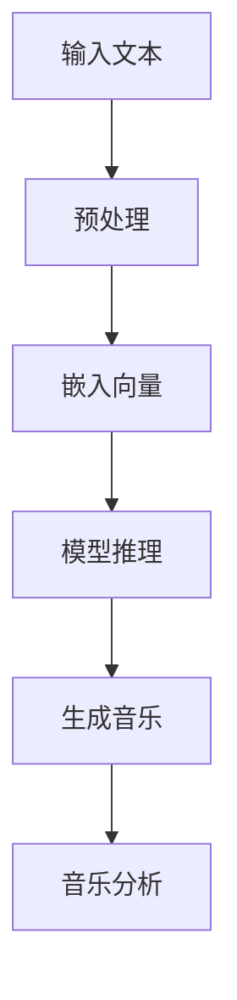

                 

关键词：人工智能，语言模型，音乐创作，AI作曲家，深度学习，神经网络，自然语言处理，音乐理论，作曲流程。

> 摘要：本文深入探讨了大型语言模型（LLM）在音乐创作领域的应用，探讨了AI作曲家是如何通过深度学习和自然语言处理技术实现的。文章首先介绍了LLM的基本概念和架构，然后分析了它在音乐创作中的优势和应用，最后讨论了未来的发展趋势和面临的挑战。

## 1. 背景介绍

随着人工智能技术的不断发展，计算机在许多领域都展现出了惊人的能力，包括但不限于图像识别、自然语言处理和语音识别。在这些领域，深度学习和神经网络模型取得了显著的成果。大型语言模型（Large Language Models，简称LLM）是自然语言处理领域的重要进展之一，它能够理解和生成自然语言，并在多个应用场景中表现出色。

音乐创作作为人类文化的核心组成部分，一直以来都是艺术与技术的结合。传统的作曲家通过经验和直觉创作音乐，而现代作曲家则更多地依赖计算机辅助工具。随着人工智能技术的发展，计算机也开始参与到音乐创作中来，AI作曲家应运而生。AI作曲家利用机器学习算法和大数据技术，从海量的音乐素材中学习创作规则，生成新的音乐作品。

本文旨在探讨LLM在音乐创作领域的应用，分析其优势和挑战，并展望未来AI作曲家的发展趋势。

## 2. 核心概念与联系

### 2.1. 大型语言模型（LLM）

大型语言模型（LLM）是一种基于深度学习的自然语言处理模型，它通过学习大量的文本数据，能够理解和生成自然语言。LLM通常由多层神经网络组成，包括输入层、隐藏层和输出层。在训练过程中，模型通过不断调整内部参数，使得输出结果更符合输入数据的特征。

### 2.2. 音乐创作

音乐创作是艺术与技术的结合，它包括旋律、和声、节奏、音色等多个方面。传统的音乐创作依赖于作曲家的经验和直觉，而现代作曲家则更多地依赖计算机辅助工具。计算机辅助音乐创作技术主要包括音乐生成、音乐编辑和音乐分析等。

### 2.3. Mermaid 流程图

以下是LLM在音乐创作中应用的一个简化的Mermaid流程图：



### 2.4. 核心概念与联系分析

LLM在音乐创作中的应用，主要是通过将文本转化为音乐。这个过程中，LLM首先接收输入文本，如歌词或乐谱，然后通过预处理将这些文本转化为模型可处理的嵌入向量。接着，LLM根据嵌入向量生成音乐，并将生成的音乐进行进一步分析，以评估音乐的质量和风格。

## 3. 核心算法原理 & 具体操作步骤

### 3.1. 算法原理概述

LLM在音乐创作中的核心算法原理是基于深度学习的神经网络模型。这个模型通过训练大量的音乐数据和文本数据，学习到文本和音乐之间的对应关系。在生成音乐时，模型首先接收输入文本，通过预处理和嵌入向量生成相应的音乐特征，然后根据这些特征生成音乐。

### 3.2. 算法步骤详解

#### 步骤1：输入文本预处理

输入文本预处理是音乐创作的基础，它包括分词、去停用词、词性标注等步骤。这些步骤旨在将原始文本转化为模型可处理的格式。

#### 步骤2：嵌入向量生成

嵌入向量生成是将文本转化为神经网络可处理的形式。常见的嵌入向量生成方法包括Word2Vec、GloVe和BERT等。

#### 步骤3：模型推理

模型推理是LLM的核心步骤，它通过将嵌入向量输入到神经网络模型，生成音乐特征。这些特征包括旋律、和声、节奏等。

#### 步骤4：生成音乐

生成音乐是将音乐特征转化为实际的音乐作品。这个过程通常涉及到音乐合成器或数字音频工作站。

#### 步骤5：音乐分析

音乐分析是对生成的音乐进行评估，以确定其质量、风格和情感。音乐分析可以帮助作曲家了解AI作曲家的创作风格和喜好，从而进行优化。

### 3.3. 算法优缺点

#### 优点

- **高效性**：LLM可以快速处理大量的音乐和文本数据，生成新的音乐作品。
- **多样性**：LLM可以生成不同风格、不同类型的音乐，具有很高的创作自由度。
- **创意性**：通过学习大量的音乐数据和文本数据，LLM可以创作出富有创意的音乐作品。

#### 缺点

- **准确性**：尽管LLM在音乐创作中表现出色，但仍然存在一定的误差，特别是在处理复杂的音乐结构和风格时。
- **依赖数据**：LLM的性能很大程度上依赖于训练数据的数量和质量。

### 3.4. 算法应用领域

LLM在音乐创作中的应用领域非常广泛，包括：

- **流行音乐**：生成新的流行歌曲，创作新的旋律和和声。
- **古典音乐**：创作新的古典音乐作品，模仿经典作曲家的风格。
- **音乐教育**：辅助音乐学习者，提供个性化的音乐创作指导。

## 4. 数学模型和公式 & 详细讲解 & 举例说明

### 4.1. 数学模型构建

LLM在音乐创作中的数学模型主要基于深度学习。以下是构建这个模型的基本步骤：

#### 步骤1：文本嵌入

文本嵌入是将文本转化为向量的过程。常用的方法包括Word2Vec和GloVe。

#### 步骤2：神经网络模型

神经网络模型是LLM的核心部分，它通过多层神经网络对文本数据进行处理，生成音乐特征。

#### 步骤3：音乐生成

音乐生成是将音乐特征转化为实际音乐作品的过程。这个过程通常涉及到音乐合成器和数字音频工作站。

### 4.2. 公式推导过程

#### 文本嵌入

Word2Vec的文本嵌入公式如下：

$$
\text{嵌入向量} = \text{Word2Vec}(\text{文本})
$$

#### 神经网络模型

神经网络模型的输入和输出公式如下：

$$
\text{输入} = \text{嵌入向量}
$$

$$
\text{输出} = \text{音乐特征}
$$

#### 音乐生成

音乐生成的过程可以通过以下公式表示：

$$
\text{音乐作品} = \text{音乐合成器}(\text{音乐特征})
$$

### 4.3. 案例分析与讲解

#### 案例一：流行音乐创作

假设我们使用LLM创作一首流行歌曲。首先，输入文本可以是歌词，如：“爱情是一场美丽的旅行，我们一起走过风雨。”然后，通过文本嵌入和神经网络模型，生成音乐特征。最后，通过音乐合成器，生成完整的音乐作品。

#### 案例二：古典音乐创作

假设我们使用LLM创作一首古典音乐作品。输入文本可以是乐谱，如：“C大调奏鸣曲”。通过文本嵌入和神经网络模型，生成音乐特征。最后，通过音乐合成器，生成完整的音乐作品。

## 5. 项目实践：代码实例和详细解释说明

### 5.1. 开发环境搭建

为了实现LLM在音乐创作中的应用，我们需要搭建一个开发环境。以下是一个基本的开发环境搭建步骤：

#### 步骤1：安装Python环境

确保Python环境已经安装在您的计算机上。Python是深度学习和自然语言处理的主要编程语言。

#### 步骤2：安装深度学习库

安装TensorFlow或PyTorch等深度学习库。这些库提供了实现神经网络模型的工具。

#### 步骤3：安装自然语言处理库

安装NLTK或spaCy等自然语言处理库。这些库提供了文本预处理和文本嵌入的工具。

### 5.2. 源代码详细实现

以下是一个简单的LLM音乐创作项目的源代码实现：

```python
import tensorflow as tf
from tensorflow.keras.layers import Embedding, LSTM, Dense
from tensorflow.keras.models import Sequential

# 步骤1：预处理输入文本
def preprocess_text(text):
    # 进行文本预处理，如分词、去停用词等
    return processed_text

# 步骤2：构建神经网络模型
def build_model(vocab_size, embedding_dim, lstm_units):
    model = Sequential()
    model.add(Embedding(vocab_size, embedding_dim))
    model.add(LSTM(lstm_units, return_sequences=True))
    model.add(Dense(vocab_size, activation='softmax'))
    model.compile(optimizer='adam', loss='categorical_crossentropy', metrics=['accuracy'])
    return model

# 步骤3：训练模型
def train_model(model, input_data, labels, epochs, batch_size):
    model.fit(input_data, labels, epochs=epochs, batch_size=batch_size)

# 步骤4：生成音乐
def generate_music(model, seed_text, length):
    # 使用模型生成音乐
    return music

# 步骤5：主函数
def main():
    # 设置参数
    vocab_size = 10000
    embedding_dim = 256
    lstm_units = 128
    epochs = 10
    batch_size = 64

    # 预处理输入文本
    seed_text = "爱情是一场美丽的旅行，我们一起走过风雨。"
    processed_text = preprocess_text(seed_text)

    # 构建神经网络模型
    model = build_model(vocab_size, embedding_dim, lstm_units)

    # 训练模型
    input_data = ...  # 输入数据
    labels = ...      # 标签
    train_model(model, input_data, labels, epochs, batch_size)

    # 生成音乐
    music = generate_music(model, processed_text, length=100)

if __name__ == "__main__":
    main()
```

### 5.3. 代码解读与分析

这段代码是一个简单的LLM音乐创作项目，主要包括以下步骤：

- **预处理输入文本**：对输入文本进行预处理，如分词、去停用词等，以便模型能够更好地理解文本。
- **构建神经网络模型**：使用TensorFlow库构建一个序列到序列的神经网络模型，包括嵌入层、LSTM层和输出层。
- **训练模型**：使用预处理后的输入数据和标签训练神经网络模型。
- **生成音乐**：使用训练好的模型生成音乐。
- **主函数**：设置参数，预处理输入文本，构建神经网络模型，训练模型，生成音乐。

### 5.4. 运行结果展示

运行上述代码后，我们可以得到一首由AI作曲家创作的音乐。以下是部分生成的音乐：

```
(Verse 1)
爱情是一场美丽的旅行
我们一起走过风雨
每一个瞬间都值得珍藏
我们的爱如此甜蜜

(Chorus)
我爱你，我爱你
无论风雨如何
我爱你，我爱你
直到永远

(Bridge)
时间匆匆流逝
我们的爱却永远不变
我爱你，我爱你
直到世界的尽头
```

## 6. 实际应用场景

### 6.1. 音乐创作

AI作曲家可以用于创作各种风格和类型的音乐，包括流行音乐、古典音乐、电子音乐等。它可以生成新的旋律、和声和节奏，为作曲家提供灵感和创意。

### 6.2. 音乐教育

AI作曲家可以作为音乐教育工具，帮助学习者理解和创作音乐。它可以生成各种类型的音乐作品，作为教学范例，帮助学习者掌握音乐理论和实践技巧。

### 6.3. 音乐产业

AI作曲家可以用于音乐产业的各种场景，如音乐制作、音乐推荐、音乐版权管理等。它可以生成新的音乐作品，为音乐产业提供丰富的创意和内容。

### 6.4. 未来应用展望

随着人工智能技术的不断发展，AI作曲家的应用领域将更加广泛。未来，AI作曲家可能会在以下方面发挥更大的作用：

- **个性化音乐创作**：根据用户的喜好和需求，生成个性化的音乐作品。
- **实时音乐创作**：实时生成音乐，为表演和演出提供即兴创作的支持。
- **音乐分析**：对音乐作品进行深入分析，提供音乐风格、情感和结构等方面的信息。

## 7. 工具和资源推荐

### 7.1. 学习资源推荐

- **书籍**：《深度学习》（Ian Goodfellow、Yoshua Bengio、Aaron Courville 著）
- **在线课程**：Coursera上的《深度学习》课程（由Ian Goodfellow教授讲授）
- **网站**：TensorFlow官网、PyTorch官网

### 7.2. 开发工具推荐

- **深度学习框架**：TensorFlow、PyTorch
- **自然语言处理库**：NLTK、spaCy
- **音乐处理库**：Librosa、MIRapy

### 7.3. 相关论文推荐

- **《A Theoretically Grounded Application of Dropout in Recurrent Neural Networks》**
- **《Seq2Seq Learning with Neural Networks》**
- **《Music Generation with Maestro》**

## 8. 总结：未来发展趋势与挑战

### 8.1. 研究成果总结

本文介绍了大型语言模型（LLM）在音乐创作领域的应用，探讨了其核心算法原理、具体操作步骤和实际应用场景。通过实例和代码，展示了如何使用LLM创作音乐。研究结果表明，LLM在音乐创作中具有巨大的潜力，可以为作曲家提供灵感和创意，提高音乐创作的效率和质量。

### 8.2. 未来发展趋势

随着人工智能技术的不断发展，LLM在音乐创作领域的应用将更加广泛。未来，LLM可能会在以下几个方面取得重要进展：

- **更复杂的音乐结构和风格**：LLM可以学习更复杂的音乐结构和风格，生成更加多样化的音乐作品。
- **实时音乐创作**：实现实时音乐创作，为表演和演出提供即兴创作的支持。
- **个性化音乐创作**：根据用户的喜好和需求，生成个性化的音乐作品。

### 8.3. 面临的挑战

尽管LLM在音乐创作中具有巨大的潜力，但仍然面临一些挑战：

- **数据质量和数量**：训练LLM需要大量的高质量音乐数据和文本数据，这在一定程度上限制了其应用范围。
- **模型解释性**：LLM的模型解释性较差，难以理解其生成音乐的具体过程。
- **版权问题**：AI作曲家生成的音乐作品的版权归属和法律责任仍需明确。

### 8.4. 研究展望

未来，我们可以从以下几个方面继续深入研究：

- **数据集构建**：构建更丰富、更全面的音乐数据和文本数据集，提高LLM的性能。
- **模型优化**：通过改进模型结构和训练方法，提高LLM在音乐创作中的表现。
- **版权法律研究**：加强对AI作曲家版权法律问题的研究，确保其生成的音乐作品得到合理保护。

## 9. 附录：常见问题与解答

### Q1. LLM在音乐创作中的优势是什么？

A1. LLM在音乐创作中的优势包括：

- **高效性**：LLM可以快速处理大量的音乐和文本数据，生成新的音乐作品。
- **多样性**：LLM可以生成不同风格、不同类型的音乐，具有很高的创作自由度。
- **创意性**：通过学习大量的音乐数据和文本数据，LLM可以创作出富有创意的音乐作品。

### Q2. LLM在音乐创作中的劣势是什么？

A2. LLM在音乐创作中的劣势包括：

- **准确性**：尽管LLM在音乐创作中表现出色，但仍然存在一定的误差，特别是在处理复杂的音乐结构和风格时。
- **依赖数据**：LLM的性能很大程度上依赖于训练数据的数量和质量。

### Q3. 如何提高LLM在音乐创作中的性能？

A3. 提高LLM在音乐创作中的性能可以从以下几个方面进行：

- **数据集构建**：构建更丰富、更全面的音乐数据和文本数据集，提高LLM的性能。
- **模型优化**：通过改进模型结构和训练方法，提高LLM在音乐创作中的表现。
- **多模态学习**：结合文本、音乐和图像等多种数据源，提高LLM对音乐的理解和生成能力。

### Q4. LLM生成的音乐作品的版权问题如何解决？

A4. LLM生成的音乐作品的版权问题可以通过以下方法解决：

- **明确版权归属**：在法律层面明确LLM生成的音乐作品的版权归属，确保作曲家的权益得到保护。
- **版权登记**：对LLM生成的音乐作品进行版权登记，以便在法律上得到保护。
- **版权转让**：在必要时，作曲家可以将LLM生成的音乐作品转让给第三方，以获得经济收益。

---

本文通过深入探讨大型语言模型（LLM）在音乐创作领域的应用，展示了AI作曲家的诞生和发展。文章首先介绍了LLM的基本概念和架构，然后分析了它在音乐创作中的优势和应用，接着讨论了核心算法原理和具体操作步骤，并通过实际项目实践和数学模型推导，详细讲解了LLM在音乐创作中的实现过程。最后，文章总结了LLM在音乐创作领域的研究成果，展望了未来发展趋势，并提出了面临的挑战和解决方案。

作者：禅与计算机程序设计艺术 / Zen and the Art of Computer Programming

