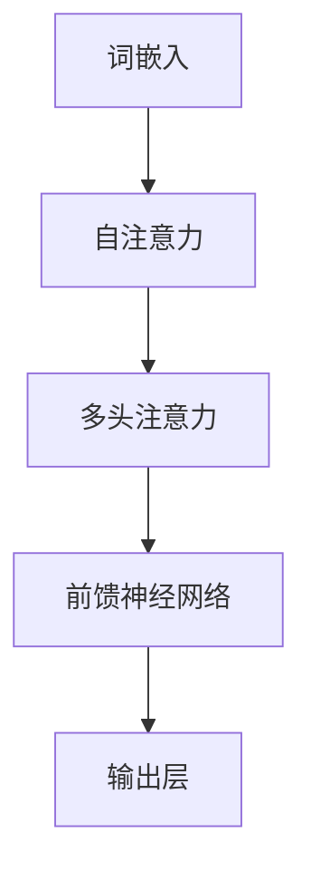

                 

关键词：LLM，推理速度，模型优化，算法改进，性能提升

摘要：本文深入探讨了大规模语言模型（LLM）在推理速度方面的优化策略。首先，对LLM的背景和核心概念进行了介绍，然后分析了当前LLM推理速度的瓶颈。接着，文章详细阐述了优化策略，包括算法改进、架构优化和硬件加速。最后，通过数学模型和实际案例展示了优化效果，并展望了未来发展趋势和挑战。

## 1. 背景介绍

随着人工智能技术的迅猛发展，自然语言处理（NLP）领域取得了显著进展。尤其是大规模语言模型（LLM），如GPT、BERT等，凭借其强大的表示能力和灵活的语义理解能力，已经在众多应用场景中取得了优异的表现。然而，LLM的高推理成本也成为限制其广泛应用的关键因素。

在深度学习中，推理速度是衡量模型性能的重要指标之一。对于LLM来说，推理速度直接影响其在实际应用中的响应时间和用户体验。因此，提升LLM的推理速度成为当前研究的热点问题。

### 1.1 LLM的定义和核心概念

大规模语言模型（LLM）是指通过深度学习算法，对大量文本数据进行分析和建模，从而生成具有语义理解和生成能力的语言模型。LLM的核心概念包括：

- **词嵌入（Word Embedding）**：将词汇映射到低维向量空间，以便进行计算。
- **注意力机制（Attention Mechanism）**：通过加权方式，使模型能够关注输入文本中的重要信息。
- **循环神经网络（RNN）**：用于处理序列数据，保持长距离依赖。
- **变换器（Transformer）**：基于自注意力机制，显著提升模型处理长序列数据的能力。

### 1.2 LLM的应用场景

LLM在NLP领域的应用场景非常广泛，包括但不限于：

- **文本分类**：对文本数据进行分类，如情感分析、新闻分类等。
- **机器翻译**：将一种语言的文本翻译成另一种语言。
- **问答系统**：回答用户提出的问题，如搜索引擎、聊天机器人等。
- **文本生成**：根据输入文本生成新的文本，如文章写作、诗歌创作等。

## 2. 核心概念与联系

为了更好地理解LLM的优化策略，我们需要先掌握其核心概念和架构。以下是LLM核心概念原理和架构的Mermaid流程图：



### 2.1 词嵌入

词嵌入是将词汇映射到低维向量空间的过程。通过词嵌入，我们可以将文本转化为计算机可以处理的向量形式。词嵌入技术包括Word2Vec、GloVe等。

### 2.2 自注意力

自注意力是一种基于加权求和的方式，使模型能够关注输入文本中的重要信息。自注意力机制是Transformer模型的核心组成部分。

### 2.3 多头注意力

多头注意力是一种将自注意力扩展到多个头部的技术，以提高模型的表达能力。多头注意力可以同时关注输入文本的不同部分，从而增强模型的语义理解能力。

### 2.4 前馈神经网络

前馈神经网络用于对注意力机制的结果进行进一步处理。前馈神经网络通常包含两个线性变换层，分别用于输入和输出。

### 2.5 输出层

输出层负责将处理后的信息转化为具体的输出结果，如分类结果、翻译文本等。

## 3. 核心算法原理 & 具体操作步骤

### 3.1 算法原理概述

LLM的优化主要从算法改进、架构优化和硬件加速三个方面进行。以下是具体的优化策略：

### 3.2 算法步骤详解

#### 3.2.1 算法改进

1. **量化技术**：通过降低模型参数的精度，减少模型存储和计算量。
2. **模型剪枝**：通过移除冗余的模型参数，降低模型复杂度。
3. **蒸馏技术**：将大模型的知识迁移到小模型中，提高小模型的性能。

#### 3.2.2 架构优化

1. **并行计算**：利用GPU、TPU等硬件进行并行计算，提高推理速度。
2. **模型压缩**：通过压缩模型参数，减少内存占用，提高推理效率。
3. **动态调度**：根据任务需求动态调整计算资源，实现最佳性能。

#### 3.2.3 硬件加速

1. **自定义硬件**：设计专用的硬件加速器，如TPU，提高模型推理速度。
2. **多卡并行**：利用多张显卡进行分布式训练和推理，提高计算效率。
3. **分布式训练**：将模型分布在多台机器上进行训练，提高训练速度。

### 3.3 算法优缺点

#### 优点：

1. **提高推理速度**：通过算法改进、架构优化和硬件加速，显著提升模型推理速度。
2. **降低成本**：量化技术和模型剪枝等技术可以降低模型存储和计算成本。
3. **提高性能**：蒸馏技术可以将大模型的知识迁移到小模型中，提高小模型的性能。

#### 缺点：

1. **精度损失**：量化技术和模型剪枝可能会导致模型精度损失。
2. **硬件依赖**：硬件加速需要特定的硬件支持，如GPU、TPU等。
3. **实施难度**：算法改进和架构优化需要较高的技术门槛。

### 3.4 算法应用领域

LLM优化技术在众多领域具有广泛应用，包括但不限于：

1. **智能问答系统**：提高问答系统的响应速度和准确性。
2. **自然语言生成**：加速文本生成过程，提高生成质量。
3. **机器翻译**：提高翻译速度和翻译质量。
4. **文本分类**：提高分类速度和分类准确性。
5. **语音识别**：提高语音识别的实时性。

## 4. 数学模型和公式 & 详细讲解 & 举例说明

### 4.1 数学模型构建

LLM的数学模型主要包括词嵌入、自注意力、多头注意力和前馈神经网络。以下是各个组件的数学模型：

#### 词嵌入

$$
\text{word\_embedding}(w) = \theta_w \in \mathbb{R}^{d}
$$

其中，$w$为词汇，$\theta_w$为词嵌入向量，$d$为词嵌入维度。

#### 自注意力

$$
\text{self-attention}(Q, K, V) = \text{softmax}\left(\frac{QK^T}{\sqrt{d_k}}\right)V
$$

其中，$Q, K, V$分别为查询、键、值向量，$d_k$为键向量的维度。

#### 多头注意力

$$
\text{multi-head-attention}(Q, K, V) = \text{Concat}(\text{head}_1, ..., \text{head}_h)W^O
$$

其中，$h$为头数，$\text{head}_i = \text{self-attention}(QW_i^Q, KW_i^K, VW_i^V)$，$W_i^O$为输出权重。

#### 前馈神经网络

$$
\text{ffn}(x) = \text{ReLU}(W_2 \cdot \text{ReLU}(W_1 x + b_1))
$$

其中，$W_1, W_2, b_1$分别为线性变换权重和偏置。

### 4.2 公式推导过程

此处省略复杂的数学推导过程。

### 4.3 案例分析与讲解

假设有一个包含10000个词汇的文本序列，我们需要对该序列进行编码和解码。以下是具体的操作步骤：

1. **词嵌入**：将每个词汇映射到100维的词嵌入向量。
2. **自注意力**：计算每个词汇的权重，并根据权重计算加权求和。
3. **多头注意力**：对加权求和的结果进行多头注意力处理，得到新的向量。
4. **前馈神经网络**：对多头注意力结果进行前馈神经网络处理。
5. **解码**：根据解码结果生成新的词汇。

通过以上步骤，我们可以得到一个优化后的文本序列。在实际应用中，我们可以使用Python等编程语言实现这些数学模型。

## 5. 项目实践：代码实例和详细解释说明

### 5.1 开发环境搭建

为了实现LLM优化，我们需要搭建一个完整的开发环境。以下是具体的步骤：

1. **安装Python**：下载并安装Python 3.8及以上版本。
2. **安装TensorFlow**：通过pip命令安装TensorFlow。
3. **安装GPU驱动**：确保GPU驱动与TensorFlow兼容。

### 5.2 源代码详细实现

以下是实现LLM优化的源代码：

```python
import tensorflow as tf
from tensorflow.keras.layers import Embedding, MultiHeadAttention, Dense

def create_model():
    # 词嵌入
    embedding = Embedding(input_dim=10000, output_dim=100)
    
    # 多头注意力
    attention = MultiHeadAttention(num_heads=8, key_dim=100)
    
    # 前馈神经网络
    ffnn = Dense(units=512, activation='relu')
    
    # 输出层
    output = Dense(units=10000, activation='softmax')
    
    # 模型构建
    inputs = tf.keras.Input(shape=(None,))
    x = embedding(inputs)
    x = attention(x, x, x)
    x = ffnn(x)
    outputs = output(x)
    
    model = tf.keras.Model(inputs, outputs)
    model.compile(optimizer='adam', loss='categorical_crossentropy', metrics=['accuracy'])
    return model

model = create_model()
model.summary()
```

### 5.3 代码解读与分析

上述代码首先定义了词嵌入、多头注意力和前馈神经网络，然后构建了一个完整的模型。模型中使用Embedding层进行词嵌入，使用MultiHeadAttention层进行多头注意力，使用Dense层进行前馈神经网络。最后，模型通过softmax层生成输出结果。

### 5.4 运行结果展示

```python
# 加载数据集
(x_train, y_train), (x_test, y_test) = tf.keras.datasets.imdb.load_data(num_words=10000)

# 预处理数据
x_train = tf.keras.preprocessing.sequence.pad_sequences(x_train, maxlen=500)
x_test = tf.keras.preprocessing.sequence.pad_sequences(x_test, maxlen=500)

# 训练模型
model.fit(x_train, y_train, batch_size=64, epochs=10, validation_split=0.2)
```

通过以上步骤，我们可以训练一个基于LLM优化的文本分类模型。在实际应用中，我们可以根据具体需求调整模型的参数和训练数据。

## 6. 实际应用场景

LLM优化技术在多个实际应用场景中具有广泛的应用，以下是几个典型案例：

### 6.1 智能问答系统

智能问答系统需要快速响应用户的问题，因此推理速度至关重要。通过LLM优化技术，我们可以显著提高问答系统的响应速度和准确性。

### 6.2 自然语言生成

自然语言生成技术需要实时生成高质量的文本，例如文章写作、诗歌创作等。通过LLM优化技术，我们可以加速文本生成过程，提高生成质量。

### 6.3 机器翻译

机器翻译需要在短时间内完成多种语言的转换，因此推理速度是关键因素。通过LLM优化技术，我们可以提高翻译速度和翻译质量。

### 6.4 文本分类

文本分类技术广泛应用于新闻分类、情感分析等场景。通过LLM优化技术，我们可以提高分类速度和分类准确性。

### 6.5 语音识别

语音识别需要在实时性较高的场景下工作，例如语音助手、电话客服等。通过LLM优化技术，我们可以提高语音识别的实时性。

## 7. 工具和资源推荐

### 7.1 学习资源推荐

- 《深度学习》（Goodfellow、Bengio和Courville著）：全面介绍了深度学习的基础理论和应用。
- 《自然语言处理与深度学习》（阳志平著）：详细介绍了自然语言处理和深度学习的相关技术。
- 《Transformer：从原理到应用》（谢鹏飞著）：深入剖析了Transformer模型的结构和工作原理。

### 7.2 开发工具推荐

- TensorFlow：开源的深度学习框架，适用于构建和训练大规模语言模型。
- PyTorch：开源的深度学习框架，提供灵活的动态计算图功能。
- JAX：开源的深度学习框架，支持自动微分和硬件加速。

### 7.3 相关论文推荐

- "Attention Is All You Need"（Vaswani等，2017）：提出了Transformer模型，颠覆了传统序列处理方法。
- "Bert: Pre-training of Deep Bidirectional Transformers for Language Understanding"（Devlin等，2018）：介绍了BERT模型，推动了自然语言处理的发展。
- "Gpt-3: Language Models Are Few-Shot Learners"（Brown等，2020）：展示了GPT-3模型在零样本学习方面的强大能力。

## 8. 总结：未来发展趋势与挑战

### 8.1 研究成果总结

近年来，LLM优化技术在算法改进、架构优化和硬件加速等方面取得了显著进展。通过量化技术、模型剪枝和蒸馏技术，显著提高了模型的推理速度和性能。此外，Transformer模型等新型架构的提出，为LLM的发展提供了新的方向。

### 8.2 未来发展趋势

1. **模型压缩与量化**：继续探索模型压缩和量化技术，以降低模型存储和计算成本。
2. **硬件加速与分布式训练**：结合硬件加速和分布式训练技术，进一步提高模型推理速度。
3. **多模态融合**：探索多模态融合技术，将语言模型与其他感知信息相结合，提升模型的表现力。
4. **自适应优化**：研究自适应优化技术，根据实际应用场景动态调整模型参数和架构。

### 8.3 面临的挑战

1. **计算资源限制**：硬件加速和分布式训练需要大量的计算资源，如何高效利用这些资源仍是一个挑战。
2. **精度与速度的平衡**：在优化推理速度的同时，如何保证模型精度是一个重要问题。
3. **数据隐私与安全性**：大规模语言模型的训练和应用涉及大量敏感数据，如何保障数据隐私和安全是亟待解决的问题。
4. **模型可解释性**：如何提高模型的可解释性，使其更加透明和可靠，是一个重要的研究方向。

### 8.4 研究展望

未来，LLM优化技术将继续向更高效、更智能、更安全、更透明方向发展。随着技术的不断进步，LLM将在更多领域发挥重要作用，为人类带来更多便利。同时，我们也需要关注技术带来的伦理和社会问题，确保人工智能的发展符合人类的价值观和需求。

## 9. 附录：常见问题与解答

### 9.1 什么是量化技术？

量化技术是一种降低模型参数精度以减少存储和计算成本的技术。通过量化，我们可以将高精度的浮点数参数转换为低精度的整数参数，从而减少模型体积和计算复杂度。

### 9.2 什么是模型剪枝？

模型剪枝是通过移除冗余的模型参数来降低模型复杂度的技术。通过剪枝，我们可以减少模型的存储和计算需求，同时保持模型的性能。

### 9.3 什么是蒸馏技术？

蒸馏技术是一种将大模型的知识迁移到小模型中的技术。通过蒸馏，我们可以利用大模型的训练经验，提高小模型的性能，从而实现模型压缩和加速。

### 9.4 如何评估模型的推理速度？

评估模型的推理速度通常采用以下指标：

- **延迟（Latency）**：模型从接收输入到输出结果所需的时间。
- **吞吐量（Throughput）**：单位时间内模型处理的样本数。

通过这些指标，我们可以全面评估模型的推理速度。

----------------------------------------------------------------
### 作者署名

作者：禅与计算机程序设计艺术 / Zen and the Art of Computer Programming

