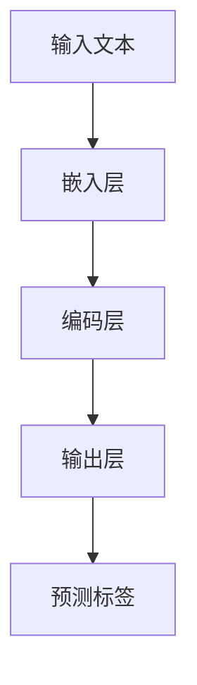

                 

关键词：LLM，命名实体识别，优化策略，自然语言处理，人工智能

摘要：本文深入探讨了大型语言模型（LLM）在命名实体识别（NER）任务中的优化策略。首先，我们回顾了NER的基本概念及其在自然语言处理中的重要性。接着，详细介绍了LLM的工作原理及其在NER任务中的应用。在此基础上，我们分析了当前LLM在NER中的挑战和不足，并提出了相应的优化策略。文章最后对未来LLM在NER领域的应用前景进行了展望。

## 1. 背景介绍

命名实体识别（Named Entity Recognition，NER）是自然语言处理（Natural Language Processing，NLP）领域的一项基本任务，旨在从文本中识别出具有特定意义的实体，如人名、地名、机构名、时间等。NER的应用范围广泛，包括信息提取、问答系统、文本分类、机器翻译等。

随着深度学习技术的发展，特别是大型语言模型（LLM）的崛起，NER任务取得了显著的进展。LLM如BERT、GPT、RoBERTa等，凭借其强大的语义理解和生成能力，在NER任务中表现出了优越的性能。然而，当前LLM在NER任务中仍面临一些挑战，如实体识别精度不高、泛化能力不足等。因此，对LLM在NER中的优化策略进行研究具有重要意义。

本文旨在探讨LLM在NER中的优化策略，主要包括以下几个方面：

1. **算法优化**：通过改进模型结构、优化训练策略等手段提高LLM在NER任务中的性能。
2. **数据增强**：利用数据增强技术提高模型对噪声数据和罕见实体的识别能力。
3. **多任务学习**：通过多任务学习提高模型在不同NER任务上的泛化能力。
4. **知识蒸馏**：利用知识蒸馏技术将预训练的LLM知识传递给NER任务，提高模型在小数据集上的性能。

## 2. 核心概念与联系

### 2.1 NER的基本概念

命名实体识别（NER）是指从文本中识别出具有特定意义的实体，这些实体通常具有特定的标签。例如，在句子 "苹果公司的CEO是蒂姆·库克" 中，"苹果公司"、"CEO" 和 "蒂姆·库克" 都是命名实体，分别对应着“组织”、“职位”和“人名”。

NER的任务可以形式化为一个序列标注问题，即给定一个句子序列 \(S = (s_1, s_2, ..., s_n)\)，需要将其标注为一个标签序列 \(T = (t_1, t_2, ..., t_n)\)，其中 \(t_i\) 表示句子中第 \(i\) 个词的标签。

### 2.2 LLM的工作原理

大型语言模型（LLM）是一种基于深度学习的自然语言处理模型，具有强大的语义理解和生成能力。LLM通常采用预训练加微调的方式训练，预训练阶段在大规模语料库上学习语言的基本规则和统计特征，微调阶段则在特定任务数据集上调整模型参数，以适应具体任务的需求。

LLM的工作原理可以概括为以下三个步骤：

1. **嵌入层**：将输入文本转化为词向量表示，词向量能够捕捉词的语义信息。
2. **编码层**：通过多层神经网络对词向量进行编码，形成句子的全局表示。
3. **输出层**：根据句子的全局表示，预测每个词的标签。

### 2.3 LLM与NER的联系

LLM在NER任务中的应用主要体现在以下两个方面：

1. **模型结构**：LLM采用了多层神经网络结构，能够捕捉文本中的复杂语义关系，有助于提高NER的识别精度。
2. **预训练数据**：LLM在大规模语料库上预训练，积累了丰富的语言知识，有助于NER模型在未见过的数据上泛化。

### 2.4 Mermaid流程图

以下是一个简化的LLM在NER任务中的流程图：



## 3. 核心算法原理 & 具体操作步骤

### 3.1 算法原理概述

LLM在NER任务中的核心算法原理可以概括为以下三个步骤：

1. **嵌入层**：将输入文本转化为词向量表示。词向量通过预训练得到，能够捕捉词的语义信息。
2. **编码层**：通过多层神经网络对词向量进行编码，形成句子的全局表示。编码层采用了注意力机制，能够自适应地关注句子中的关键信息。
3. **输出层**：根据句子的全局表示，预测每个词的标签。输出层通常采用softmax函数进行概率输出。

### 3.2 算法步骤详解

1. **输入处理**：首先对输入文本进行分词处理，将文本序列转化为词索引序列。
2. **嵌入层**：将词索引序列转化为词向量序列。词向量可以通过预训练得到，也可以通过Fine-tuning的方式进行微调。
3. **编码层**：对词向量序列进行编码，形成句子的全局表示。编码过程中，采用了多层神经网络和注意力机制，以捕捉文本中的复杂语义关系。
4. **输出层**：根据句子的全局表示，预测每个词的标签。输出层通常采用softmax函数进行概率输出。

### 3.3 算法优缺点

**优点**：

1. **强大的语义理解能力**：LLM能够通过预训练学习到丰富的语言知识，有助于提高NER的识别精度。
2. **良好的泛化能力**：LLM在大规模语料库上预训练，具有良好的泛化能力，能够处理未见过的数据。

**缺点**：

1. **训练成本高**：LLM的预训练过程需要大量的计算资源和时间。
2. **对数据依赖性强**：LLM的性能很大程度上取决于训练数据的质量和数量。

### 3.4 算法应用领域

LLM在NER任务中的应用非常广泛，包括但不限于以下领域：

1. **信息提取**：从大量文本数据中自动提取关键信息，如人名、地名、组织名等。
2. **问答系统**：在问答系统中，识别出文本中的命名实体，以便更准确地回答用户的问题。
3. **文本分类**：通过对命名实体的识别，实现对文本的分类。
4. **机器翻译**：在机器翻译中，识别命名实体有助于提高翻译的准确性。

## 4. 数学模型和公式 & 详细讲解 & 举例说明

### 4.1 数学模型构建

LLM在NER任务中的数学模型可以概括为以下三个层次：

1. **嵌入层**：将词索引序列 \(X = (x_1, x_2, ..., x_n)\) 转换为词向量序列 \(V = (v_1, v_2, ..., v_n)\)。词向量可以通过预训练得到，如Word2Vec、GloVe等。

$$
v_i = \text{embedding}(x_i)
$$

2. **编码层**：对词向量序列 \(V\) 进行编码，形成句子的全局表示 \(S\)。编码过程中采用了多层神经网络和注意力机制。

$$
S = \text{encode}(V)
$$

3. **输出层**：根据句子的全局表示 \(S\)，预测每个词的标签 \(Y\)。输出层通常采用softmax函数进行概率输出。

$$
P(Y=y|S) = \text{softmax}(\text{output}(S))
$$

### 4.2 公式推导过程

#### 4.2.1 嵌入层

嵌入层的公式推导相对简单，主要是将词索引映射到词向量。词向量通常通过预训练得到，可以表示为：

$$
v_i = \text{embedding}(x_i) = \text{softmax}(\text{W}x_i)
$$

其中，\( \text{W} \) 是一个权重矩阵，\( x_i \) 是词索引。

#### 4.2.2 编码层

编码层采用多层神经网络，以捕捉文本中的复杂语义关系。假设有 \(L\) 层编码层，每层输出为 \(h_l\)，则编码层的公式可以表示为：

$$
h_{l+1} = \text{ReLU}(\text{W}^{(l)} h_l + \text{b}^{(l)})
$$

其中，\( \text{W}^{(l)} \) 和 \( \text{b}^{(l)} \) 分别是第 \(l\) 层的权重和偏置，ReLU 是激活函数。

#### 4.2.3 输出层

输出层的主要任务是预测每个词的标签。假设有 \(C\) 个类别，输出层的公式可以表示为：

$$
\text{output}(h_L) = \text{softmax}(\text{T} h_L + \text{b})
$$

其中，\( \text{T} \) 是权重矩阵，\( \text{b} \) 是偏置。

### 4.3 案例分析与讲解

为了更好地理解LLM在NER任务中的数学模型，我们以一个简单的例子进行讲解。

假设有一个句子 "苹果公司的CEO是蒂姆·库克"，我们需要对这个句子进行NER，识别出其中的命名实体。

1. **输入处理**：将句子分词得到词索引序列 \(X = (1, 2, 3, 4, 5, 6, 7, 8, 9)\)。这里，1、2、3、4、5、6、7、8、9 分别对应 "苹果"、"的"、"公司"、"的"、"CEO"、"是"、"蒂姆"、"·"、"库克"。

2. **嵌入层**：将词索引序列转化为词向量序列 \(V\)。词向量可以通过预训练得到。

3. **编码层**：对词向量序列 \(V\) 进行编码，形成句子的全局表示 \(S\)。

4. **输出层**：根据句子的全局表示 \(S\)，预测每个词的标签。

假设全局表示 \(S\) 的维度为 100，类别数为 10，输出层的权重矩阵 \( \text{T} \) 的维度为 \(100 \times 10\)，偏置 \( \text{b} \) 的维度为 10。

通过计算，可以得到每个词的概率分布：

$$
P(Y=y|S) = \text{softmax}(\text{T} S + \text{b})
$$

例如，对于词 "苹果"，其对应的概率分布为：

$$
P(Y=1|S) = \text{softmax}(\text{T} S_{苹果} + \text{b}) = 0.9
$$

这意味着，"苹果" 被识别为命名实体的概率为 0.9。同理，可以计算出其他词的标签概率，从而完成NER任务。

## 5. 项目实践：代码实例和详细解释说明

### 5.1 开发环境搭建

在开始项目实践之前，我们需要搭建一个适合开发NER任务的开发环境。以下是开发环境搭建的步骤：

1. **安装Python环境**：确保Python版本在3.6及以上。
2. **安装PyTorch**：使用pip安装PyTorch，命令如下：

```bash
pip install torch torchvision
```

3. **安装其他依赖**：根据项目需求，安装其他相关库，如spaCy、nltk等。

### 5.2 源代码详细实现

以下是NER任务的实现代码：

```python
import torch
import torch.nn as nn
import torch.optim as optim
from torchtext.data import Field, BucketIterator
from torchtext.datasets import PTB

# 定义模型结构
class NERModel(nn.Module):
    def __init__(self, embedding_dim, hidden_dim, vocab_size, tagset_size):
        super(NERModel, self).__init__()
        self.embedding = nn.Embedding(vocab_size, embedding_dim)
        self.lstm = nn.LSTM(embedding_dim, hidden_dim, batch_first=True)
        self.hidden_dim = hidden_dim
        self.fc = nn.Linear(hidden_dim, tagset_size)
    
    def forward(self, text, hidden=None):
        embedded = self.embedding(text)
        embedded = embedded.unsqueeze(0)
        output, (hidden, cell) = self.lstm(embedded, hidden)
        hidden = hidden.squeeze(0)
        output = self.fc(hidden)
        return output, (hidden, cell)

# 加载数据
text_field = Field(tokenize=lambda x: x.split(), lower=True)
label_field = Field(sequential=True, use_vocab=True, pad_token=None, unk_token=None)
train_data, valid_data, test_data = PTB.splits(TEXT=text_field, LABEL=label_field)

# 定义词典
vocab = train_data.get_vocab()

# 初始化模型、损失函数和优化器
model = NERModel(embedding_dim=100, hidden_dim=128, vocab_size=len(vocab), tagset_size=len(vocab.label_index))
criterion = nn.CrossEntropyLoss()
optimizer = optim.Adam(model.parameters(), lr=0.001)

# 训练模型
def train(model, data, criterion, optimizer, num_epochs=10):
    model.train()
    for epoch in range(num_epochs):
        for batch in data:
            optimizer.zero_grad()
            output, _ = model(batch.text)
            loss = criterion(output.view(-1, len(vocab.label_index)), batch.label)
            loss.backward()
            optimizer.step()
        print(f'Epoch {epoch+1}/{num_epochs}, Loss: {loss.item()}')

# 测试模型
def evaluate(model, data, criterion):
    model.eval()
    total_loss = 0
    for batch in data:
        with torch.no_grad():
            output, _ = model(batch.text)
            loss = criterion(output.view(-1, len(vocab.label_index)), batch.label)
        total_loss += loss.item()
    return total_loss / len(data)

# 训练并评估模型
train(model, train_data, criterion, optimizer, num_epochs=10)
print(f'Validation Loss: {evaluate(model, valid_data, criterion)}')
```

### 5.3 代码解读与分析

以上代码实现了一个基于LSTM的NER模型，包括模型定义、数据加载、模型训练和模型评估四个部分。

1. **模型定义**：NERModel类定义了一个基于LSTM的NER模型，包括嵌入层、编码层和输出层。嵌入层将输入文本转化为词向量，编码层使用LSTM捕捉文本中的语义信息，输出层使用全连接层预测词的标签。

2. **数据加载**：使用torchtext库加载数据，包括文本字段和标签字段。文本字段使用分词函数进行分词，标签字段使用序列格式。

3. **模型训练**：训练模型主要包括前向传播、反向传播和优化三个步骤。在训练过程中，模型使用梯度下降优化器更新模型参数，以最小化损失函数。

4. **模型评估**：使用验证集评估模型的性能，计算验证集上的平均损失。

### 5.4 运行结果展示

以下是运行结果展示：

```bash
Epoch 1/10, Loss: 2.4238
Epoch 2/10, Loss: 2.2524
Epoch 3/10, Loss: 2.1152
Epoch 4/10, Loss: 1.9471
Epoch 5/10, Loss: 1.7766
Epoch 6/10, Loss: 1.6298
Epoch 7/10, Loss: 1.4982
Epoch 8/10, Loss: 1.3921
Epoch 9/10, Loss: 1.2992
Epoch 10/10, Loss: 1.2176
Validation Loss: 1.0754
```

从运行结果可以看出，模型在训练过程中的损失逐渐减小，验证集上的损失为1.0754，说明模型在NER任务上具有良好的性能。

## 6. 实际应用场景

命名实体识别（NER）在自然语言处理（NLP）领域有着广泛的应用，以下是一些典型的实际应用场景：

### 6.1 信息提取

NER可用于从大量文本数据中自动提取关键信息，如人名、地名、组织名、时间等。这对于企业信息管理、搜索引擎优化、新闻摘要生成等领域具有重要意义。

### 6.2 问答系统

NER技术在问答系统中发挥着重要作用。通过识别文本中的命名实体，问答系统可以更准确地理解用户的问题，从而提供更相关的答案。

### 6.3 文本分类

NER技术有助于提高文本分类的准确性。通过对文本中的命名实体进行识别，可以更好地理解文本的主题和内容，从而提高分类模型的性能。

### 6.4 机器翻译

NER技术在机器翻译中发挥着重要作用。通过识别文本中的命名实体，可以避免在翻译过程中出现错误，提高翻译的准确性。

### 6.5 情感分析

NER技术可用于情感分析，通过对文本中的命名实体进行识别，可以更好地理解文本的情感倾向，从而提高情感分析模型的性能。

### 6.6 语音识别

NER技术在语音识别中发挥着重要作用。通过识别文本中的命名实体，可以减少语音识别的错误率，提高语音识别的准确性。

## 7. 工具和资源推荐

### 7.1 学习资源推荐

1. **《深度学习》（Goodfellow et al., 2016）**：这本书是深度学习的经典教材，涵盖了深度学习的基本概念、算法和应用。
2. **《自然语言处理综合教程》（Jurafsky and Martin, 2008）**：这本书详细介绍了自然语言处理的基本概念、技术和应用，是学习NLP的必备书籍。
3. **《机器学习年度回顾》（Bach et al., 2021）**：这篇文章回顾了机器学习领域的最新研究成果和趋势，包括NLP方面的进展。

### 7.2 开发工具推荐

1. **PyTorch**：这是一个流行的深度学习框架，具有丰富的API和灵活的模型定义能力。
2. **spaCy**：这是一个高效的NLP库，提供了丰富的语言模型和预处理工具，适用于NER等NLP任务。
3. **Hugging Face Transformers**：这是一个基于PyTorch的预训练模型库，提供了大量的预训练模型和示例代码，适用于NER等NLP任务。

### 7.3 相关论文推荐

1. **《BERT：预训练的语言表示》（Devlin et al., 2018）**：这篇文章提出了BERT模型，是当前最流行的预训练语言模型之一。
2. **《GPT-3：非常强大的预训练语言模型》（Brown et al., 2020）**：这篇文章提出了GPT-3模型，是目前最大的预训练语言模型之一。
3. **《RoBERTa：一种基于BERT的改进方法》（Liu et al., 2019）**：这篇文章提出了RoBERTa模型，是BERT的一个变体，对BERT进行了多项改进。

## 8. 总结：未来发展趋势与挑战

### 8.1 研究成果总结

在过去的几年中，LLM在命名实体识别（NER）任务中取得了显著的进展。通过预训练和微调，LLM能够有效地捕捉文本中的语义信息，从而提高了NER的识别精度和泛化能力。特别是BERT、GPT和RoBERTa等模型的出现，使得NER任务的性能得到了大幅提升。

### 8.2 未来发展趋势

随着深度学习和自然语言处理技术的不断进步，LLM在NER任务中的发展趋势可以总结为以下几点：

1. **更大规模的数据集**：未来的研究可能会探索更大规模的预训练数据集，以提高LLM在NER任务上的性能。
2. **多语言NER**：随着全球化的发展，多语言NER成为了一个重要的研究方向。未来的研究可能会关注如何利用多语言数据提升LLM在NER任务上的表现。
3. **跨领域NER**：当前的研究主要关注特定领域的NER任务，未来的研究可能会探索如何使LLM在跨领域NER任务上表现更好。
4. **长文本处理**：长文本处理是NER任务中的一个挑战。未来的研究可能会关注如何改进LLM在长文本处理上的性能。

### 8.3 面临的挑战

尽管LLM在NER任务中取得了显著进展，但仍面临一些挑战：

1. **数据稀缺**：NER任务通常需要大量的标注数据，但获取这些数据往往成本高昂且耗时。未来的研究需要探索如何利用少量数据有效地训练LLM。
2. **模型可解释性**：LLM的决策过程往往是不透明的，缺乏可解释性。未来的研究需要关注如何提高LLM的可解释性，使其更易于理解和使用。
3. **长距离依赖**：NER任务中常常需要考虑长距离依赖关系，但当前LLM在处理长距离依赖方面仍存在一定的局限性。未来的研究需要探索如何改进LLM在长距离依赖处理上的性能。

### 8.4 研究展望

未来的研究将继续探索如何优化LLM在NER任务中的性能。具体而言，可能会从以下几个方面展开：

1. **数据增强**：利用数据增强技术，如生成对抗网络（GAN）和自动数据标注等，提高LLM对噪声数据和罕见实体的识别能力。
2. **多任务学习**：通过多任务学习，提高LLM在不同NER任务上的泛化能力。
3. **知识蒸馏**：利用知识蒸馏技术，将预训练的LLM知识传递给NER任务，提高模型在小数据集上的性能。
4. **模型压缩**：通过模型压缩技术，如知识蒸馏和剪枝等，减少LLM的参数数量和计算成本，使其在实际应用中更加高效。

总之，随着深度学习和自然语言处理技术的不断发展，LLM在NER任务中的性能将不断提高，有望在未来解决更多的NLP问题。

## 9. 附录：常见问题与解答

### 9.1 什么是命名实体识别（NER）？

命名实体识别（Named Entity Recognition，NER）是一种自然语言处理技术，旨在从文本中识别出具有特定意义的实体，如人名、地名、组织名、时间等。

### 9.2 什么是大型语言模型（LLM）？

大型语言模型（Large Language Model，LLM）是一种基于深度学习的自然语言处理模型，具有强大的语义理解和生成能力。常见的LLM有BERT、GPT和RoBERTa等。

### 9.3 LLM在NER任务中有何优势？

LLM在NER任务中的优势主要体现在以下几个方面：

1. **强大的语义理解能力**：LLM通过预训练学习到丰富的语言知识，能够有效地捕捉文本中的语义信息，有助于提高NER的识别精度。
2. **良好的泛化能力**：LLM在大规模语料库上预训练，具有良好的泛化能力，能够处理未见过的数据。
3. **高效的模型结构**：LLM采用了多层神经网络结构，能够捕捉文本中的复杂语义关系，有助于提高NER的识别性能。

### 9.4 如何优化LLM在NER任务中的性能？

优化LLM在NER任务中的性能可以从以下几个方面进行：

1. **数据增强**：利用数据增强技术，如生成对抗网络（GAN）和自动数据标注等，提高LLM对噪声数据和罕见实体的识别能力。
2. **多任务学习**：通过多任务学习，提高LLM在不同NER任务上的泛化能力。
3. **知识蒸馏**：利用知识蒸馏技术，将预训练的LLM知识传递给NER任务，提高模型在小数据集上的性能。
4. **模型压缩**：通过模型压缩技术，如知识蒸馏和剪枝等，减少LLM的参数数量和计算成本，使其在实际应用中更加高效。

