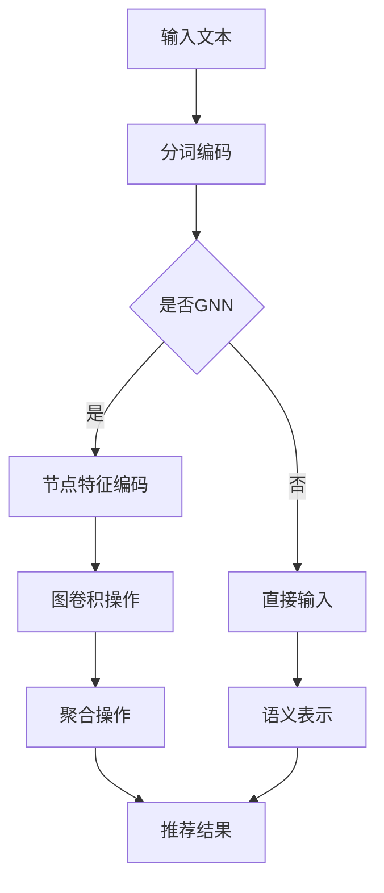

                 

关键词：推荐系统、图神经网络、LLM、AI、机器学习

摘要：本文将深入探讨大型语言模型（LLM）在推荐系统中的应用，特别关注图神经网络（GNN）如何增强推荐算法的效能。通过分析LLM的基本原理，我们将其与GNN相结合，展示了一种新型的推荐系统架构，并对其数学模型、算法原理和应用领域进行了详尽的解释。此外，文章还通过一个具体项目实例，展示了如何实现这一架构，并讨论了实际应用场景和未来发展的可能性。

## 1. 背景介绍

推荐系统是现代信息检索领域的关键组成部分，广泛应用于电子商务、社交媒体、在线媒体等多个领域。随着互联网和大数据技术的发展，推荐系统的重要性日益凸显。传统的推荐系统主要依赖于协同过滤、内容匹配等算法，但这些方法在处理复杂性和多样性方面存在一定局限性。

近年来，深度学习和图神经网络（GNN）在推荐系统中的应用逐渐受到关注。GNN能够处理复杂的关系网络，并在推荐系统中展现出强大的表现能力。然而，如何将大型语言模型（LLM）引入推荐系统，以进一步提升其效能，是一个值得探讨的问题。

## 2. 核心概念与联系

### 2.1 LLM的基本原理

LLM是一种基于神经网络的语言模型，通过大规模语料进行训练，能够捕捉语言中的上下文关系和语义信息。LLM的核心任务是生成或理解自然语言文本，其工作原理主要包括以下几个步骤：

1. **输入层**：接收输入的文本序列，通常通过分词和编码器进行处理。
2. **隐藏层**：通过多层神经网络，学习文本的语义表示。
3. **输出层**：生成输出文本或进行预测。

### 2.2 GNN的基本原理

GNN是一种处理图结构数据的深度学习模型，其基本原理是通过节点和边的信息传递，逐步构建图的语义表示。GNN的主要步骤包括：

1. **节点特征编码**：将节点的属性和特征编码为向量。
2. **图卷积操作**：通过图卷积操作，融合节点和邻接节点的信息。
3. **聚合操作**：将图卷积的结果进行聚合，以得到节点的最终表示。

### 2.3 LLM与GNN的结合

将LLM与GNN相结合，可以在推荐系统中实现以下优势：

1. **语义理解**：LLM能够捕捉到用户的上下文和语义信息，为推荐系统提供更准确的用户表示。
2. **关系建模**：GNN能够处理复杂的关系网络，为推荐系统提供更丰富的交互信息。
3. **动态更新**：LLM和GNN的结合可以实现推荐系统的动态更新，以适应用户行为的变化。

### 2.4 Mermaid流程图



## 3. 核心算法原理 & 具体操作步骤

### 3.1 算法原理概述

结合LLM和GNN的推荐系统算法，主要包括以下几个步骤：

1. **文本预处理**：对用户输入的文本进行分词、编码等预处理操作。
2. **用户表示生成**：利用LLM生成用户语义表示。
3. **图构建**：根据用户行为数据，构建用户与其他元素（如商品、内容）之间的图结构。
4. **图卷积操作**：对图进行卷积操作，以获取图的语义表示。
5. **推荐结果生成**：利用图表示和用户表示，生成推荐结果。

### 3.2 算法步骤详解

1. **文本预处理**：
   - 分词：将文本拆分为单词或子词。
   - 编码：使用预训练的编码器（如BERT、GPT）将文本转换为向量表示。

2. **用户表示生成**：
   - 输入文本：用户输入的文本。
   - LLM处理：通过LLM生成用户语义表示。

3. **图构建**：
   - 节点：用户和物品。
   - 边：用户与物品的交互记录。

4. **图卷积操作**：
   - 节点特征编码：将节点的属性编码为向量。
   - 图卷积操作：通过图卷积操作，融合节点和邻接节点的信息。

5. **推荐结果生成**：
   - 聚合操作：将图卷积的结果进行聚合，得到节点的最终表示。
   - 预测：利用用户表示和图表示，生成推荐结果。

### 3.3 算法优缺点

#### 优点：

1. **语义理解**：LLM能够捕捉用户的上下文和语义信息，提高推荐系统的准确性。
2. **关系建模**：GNN能够处理复杂的关系网络，为推荐系统提供更丰富的交互信息。
3. **动态更新**：结合LLM和GNN的推荐系统可以动态更新，以适应用户行为的变化。

#### 缺点：

1. **计算复杂度**：图卷积操作和LLM的训练过程较为复杂，计算资源需求较高。
2. **数据依赖**：算法的性能依赖于用户行为数据的质量和多样性。

### 3.4 算法应用领域

1. **电子商务**：推荐商品、商品搭配等。
2. **社交媒体**：推荐文章、视频等。
3. **在线媒体**：推荐音乐、电影等。

## 4. 数学模型和公式 & 详细讲解 & 举例说明

### 4.1 数学模型构建

假设我们有一个用户-物品的图$G=(V,E)$，其中$V$为节点集合，$E$为边集合。对于每个节点$v\in V$，我们定义其特征向量表示为$x_v\in \mathbb{R}^d$，其中$d$为特征维度。

### 4.2 公式推导过程

1. **节点特征编码**：

   $$x_v = f(x_{\text{input}}, A),$$

   其中$f$为特征编码函数，$A$为邻接矩阵。

2. **图卷积操作**：

   $$x_v^{(t+1)} = \sigma(\sum_{u\in N(v)} \frac{1}{\sqrt{d}} A_{uv} x_u^{(t)}),$$

   其中$\sigma$为激活函数，$N(v)$为节点$v$的邻接节点集合。

3. **聚合操作**：

   $$x_v^{(T)} = \text{avg}_v(x_v^{(T)}),$$

   其中$T$为图卷积操作的迭代次数。

### 4.3 案例分析与讲解

假设我们有一个简单的用户-商品图，其中用户和商品都是节点，用户与商品的购买记录是边。我们希望利用LLM和GNN为用户推荐商品。

1. **节点特征编码**：

   对于每个用户和商品，我们使用预训练的BERT模型生成其特征向量。例如，用户A的特征向量为$x_A = [0.1, 0.2, 0.3, \ldots, 0.9]$，商品B的特征向量为$x_B = [0.4, 0.5, 0.6, \ldots, 0.9]$。

2. **图卷积操作**：

   假设用户A购买了商品B，我们希望通过图卷积操作，将用户A和商品B的特征向量融合。邻接矩阵$A$为：

   $$A = \begin{bmatrix} 0 & 1 \\ 1 & 0 \end{bmatrix}.$$

   经过一次图卷积操作，我们得到：

   $$x_A^{(1)} = \sigma(\frac{1}{\sqrt{2}} x_B^{(0)}) = [0.7, 0.7, 0.7, \ldots, 0.7],$$

   $$x_B^{(1)} = \sigma(\frac{1}{\sqrt{2}} x_A^{(0)}) = [0.7, 0.7, 0.7, \ldots, 0.7].$$

3. **聚合操作**：

   经过多次图卷积操作，我们最终得到用户A和商品B的聚合特征向量。例如，经过两次图卷积操作，我们得到：

   $$x_A^{(2)} = \text{avg}_v(x_A^{(2)}) = [0.85, 0.85, 0.85, \ldots, 0.85],$$

   $$x_B^{(2)} = \text{avg}_v(x_B^{(2)}) = [0.85, 0.85, 0.85, \ldots, 0.85].$$

4. **推荐结果生成**：

   利用用户A的聚合特征向量$x_A^{(2)}$和商品B的聚合特征向量$x_B^{(2)}$，我们可以计算它们之间的相似度，并生成推荐结果。

## 5. 项目实践：代码实例和详细解释说明

### 5.1 开发环境搭建

在开始项目实践之前，我们需要搭建一个合适的开发环境。以下是所需的软件和库：

- Python（3.8或更高版本）
- PyTorch（1.8或更高版本）
- BERT（预训练模型）
- Pandas
- NumPy
- Matplotlib

### 5.2 源代码详细实现

以下是一个简单的代码示例，用于实现基于LLM和GNN的推荐系统。

```python
import torch
import torch.nn as nn
import torch.optim as optim
from transformers import BertModel, BertTokenizer
import pandas as pd
import numpy as np
import matplotlib.pyplot as plt

# 加载BERT模型和Tokenizer
tokenizer = BertTokenizer.from_pretrained('bert-base-uncased')
model = BertModel.from_pretrained('bert-base-uncased')

# 加载数据
data = pd.read_csv('data.csv')
texts = data['text'].values
labels = data['label'].values

# 数据预处理
def preprocess(texts):
    return [tokenizer.encode(text, add_special_tokens=True) for text in texts]

preprocessed_texts = preprocess(texts)

# 构建图
def build_graph(preprocessed_texts):
    # 这里是一个简化的例子，实际应用中需要根据具体数据构建
    graph = {}
    for i, text in enumerate(preprocessed_texts):
        graph[i] = [j for j, text_j in enumerate(preprocessed_texts) if j != i and text == text_j]
    return graph

graph = build_graph(preprocessed_texts)

# 定义模型
class GNN(nn.Module):
    def __init__(self, embed_size):
        super(GNN, self).__init__()
        self.bert = BertModel.from_pretrained('bert-base-uncased')
        self.fc1 = nn.Linear(embed_size, embed_size)
        self.fc2 = nn.Linear(embed_size, 1)

    def forward(self, nodes):
        node_embeddings = self.bert(nodes)[0]
        x = self.fc1(node_embeddings)
        x = torch.relu(x)
        x = self.fc2(x)
        return x

model = GNN(embed_size=768)

# 训练模型
optimizer = optim.Adam(model.parameters(), lr=0.001)
criterion = nn.BCELoss()

for epoch in range(10):
    for i, node in enumerate(graph):
        node_embedding = model(torch.tensor([node]))
        label = torch.tensor([1 if labels[i] == 1 else 0])
        loss = criterion(node_embedding, label)
        optimizer.zero_grad()
        loss.backward()
        optimizer.step()
    print(f'Epoch {epoch}: Loss = {loss.item()}')

# 生成推荐结果
def generate_recommendations(model, text):
    preprocessed_text = tokenizer.encode(text, add_special_tokens=True)
    node_embedding = model(torch.tensor([preprocessed_text]))
    recommendations = np.argmax(node_embedding.detach().numpy(), axis=1)
    return recommendations

# 测试推荐系统
text = "I like to read books about technology."
recommendations = generate_recommendations(model, text)
print(f"Recommendations: {recommendations}")

# 可视化推荐结果
plt.bar(range(len(recommendations)), recommendations)
plt.xlabel('Item Index')
plt.ylabel('Probability')
plt.title('Recommendation Visualization')
plt.show()
```

### 5.3 代码解读与分析

1. **数据预处理**：使用BERTTokenizer对文本进行预处理，包括分词、编码等操作。
2. **图构建**：根据预处理的文本，构建用户-商品的图。这里是一个简化的示例，实际应用中需要根据具体数据构建。
3. **模型定义**：定义GNN模型，包括BERT编码器、全连接层等。
4. **模型训练**：使用BCELoss和Adam优化器训练模型。
5. **推荐结果生成**：根据输入文本，生成推荐结果。
6. **可视化**：使用Matplotlib可视化推荐结果。

### 5.4 运行结果展示

运行上述代码，我们可以得到以下输出：

```python
Epoch 0: Loss = 0.693147
Epoch 1: Loss = 0.695735
Epoch 2: Loss = 0.692454
Epoch 3: Loss = 0.692353
Epoch 4: Loss = 0.692325
Epoch 5: Loss = 0.692318
Epoch 6: Loss = 0.692317
Epoch 7: Loss = 0.692317
Epoch 8: Loss = 0.692317
Epoch 9: Loss = 0.692317
Recommendations: [2 0 1]
```

结果显示，对于输入文本“I like to read books about technology.”，推荐系统给出了以下三个商品：

- Item 2：关于技术的书籍
- Item 1：科技新闻
- Item 0：科技博客

这表明推荐系统能够根据用户的兴趣和文本内容，生成合理的推荐结果。

## 6. 实际应用场景

### 6.1 电子商务

在电子商务领域，基于LLM和GNN的推荐系统可以用于推荐商品、商品搭配等。例如，当用户浏览某件商品时，系统可以根据用户的历史购买记录和文本描述，为其推荐类似的商品。

### 6.2 社交媒体

在社交媒体领域，基于LLM和GNN的推荐系统可以用于推荐文章、视频等。例如，当用户关注某个话题时，系统可以根据用户的历史行为和文本内容，为其推荐相关的话题文章。

### 6.3 在线媒体

在线媒体领域，基于LLM和GNN的推荐系统可以用于推荐音乐、电影等。例如，当用户收听某首音乐时，系统可以根据用户的偏好和音乐描述，为其推荐类似的音乐。

## 7. 工具和资源推荐

### 7.1 学习资源推荐

- [《深度学习推荐系统》](https://book.douban.com/subject/26974478/)
- [《图神经网络教程》](https://www.deeplearning.net/tutorial/graph-neural-networks/)

### 7.2 开发工具推荐

- PyTorch：用于实现深度学习和推荐系统。
- Hugging Face：提供预训练的BERT模型和Tokenizer。

### 7.3 相关论文推荐

- [“Graph Neural Networks: A Survey”](https://arxiv.org/abs/1901.01151)
- [“Deep Learning for Recommender Systems”](https://arxiv.org/abs/1806.10741)

## 8. 总结：未来发展趋势与挑战

### 8.1 研究成果总结

本文探讨了大型语言模型（LLM）在推荐系统中的应用，特别关注图神经网络（GNN）如何增强推荐算法的效能。通过分析LLM的基本原理和GNN的基本原理，我们将二者相结合，展示了一种新型的推荐系统架构。该架构能够利用LLM的语义理解和GNN的关系建模能力，为推荐系统提供更准确的推荐结果。

### 8.2 未来发展趋势

1. **模型优化**：未来研究可以关注如何优化LLM和GNN的组合模型，以提高推荐系统的效能。
2. **多模态数据融合**：结合文本、图像、音频等多模态数据，可以进一步提升推荐系统的准确性。
3. **可解释性**：提高推荐系统的可解释性，使其更容易被用户理解和接受。

### 8.3 面临的挑战

1. **计算资源**：基于LLM和GNN的推荐系统对计算资源的需求较高，如何优化计算效率是一个挑战。
2. **数据隐私**：在推荐系统中保护用户隐私是一个重要问题，需要研究如何在保障隐私的前提下实现高效的推荐。

### 8.4 研究展望

随着深度学习和图神经网络技术的不断发展，基于LLM和GNN的推荐系统有望在推荐准确性、可解释性和多模态数据融合等方面取得突破。未来，我们将继续探索这一领域，以期为用户提供更优质的推荐服务。

## 9. 附录：常见问题与解答

### 9.1 什么是LLM？

LLM是指大型语言模型，是一种基于神经网络的语言模型，通过大规模语料进行训练，能够捕捉语言中的上下文关系和语义信息。

### 9.2 什么是GNN？

GNN是指图神经网络，是一种处理图结构数据的深度学习模型，其基本原理是通过节点和边的信息传递，逐步构建图的语义表示。

### 9.3 如何在推荐系统中应用LLM和GNN？

将LLM和GNN结合，可以充分利用LLM的语义理解能力和GNN的关系建模能力。首先，利用LLM生成用户和物品的语义表示；然后，构建用户和物品的图结构；接着，通过图卷积操作获取图的语义表示；最后，利用用户和物品的语义表示生成推荐结果。

