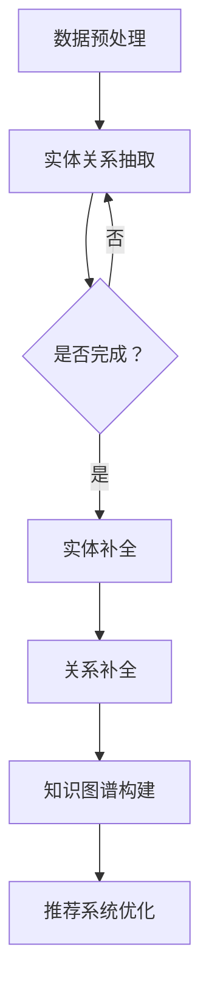

                 

关键词：推荐系统，知识图谱，预训练语言模型，补全算法，实际应用

> 摘要：本文深入探讨了预训练语言模型（LLM）在推荐系统中的应用，特别是其在知识图谱补全方面的潜力。通过对LLM的基本原理、算法原理、数学模型以及实际应用的详细分析，本文旨在为研究人员和开发人员提供一套完整的技术框架，以便在实际项目中更好地利用LLM进行知识图谱的补全，提升推荐系统的性能和用户体验。

## 1. 背景介绍

随着互联网的迅猛发展和大数据技术的广泛应用，推荐系统已经成为现代信息检索和用户服务的关键组成部分。从早期的基于内容的推荐、协同过滤到现在的深度学习推荐，推荐系统的技术不断进步，但同时也面临着许多挑战，如数据稀疏性、冷启动问题、多样性不足等。

知识图谱作为一种结构化、语义丰富的知识表示方法，在推荐系统中具有巨大的应用潜力。它能够通过表示实体、属性和关系，帮助推荐系统更好地理解和利用用户数据，从而提高推荐的准确性、相关性和多样性。

预训练语言模型（LLM），如GPT、BERT等，通过在大量文本数据上进行预训练，已经展示了在自然语言处理任务中的卓越性能。近年来，研究者们开始探索LLM在知识图谱补全任务中的应用，以利用其强大的语义理解和生成能力，为推荐系统提供更有效的辅助。

本文将围绕LLM在推荐系统中的知识图谱补全展开讨论，首先介绍LLM的基本原理，然后详细分析其应用于知识图谱补全的算法原理和操作步骤，最后通过数学模型和实际项目案例进行讲解，以帮助读者全面了解并应用这一技术。

## 2. 核心概念与联系

### 2.1 预训练语言模型（LLM）的基本原理

预训练语言模型（LLM）是一种基于深度学习的自然语言处理模型，它通过在大规模文本语料库上进行预训练，学习到语言的普遍特性。LLM的核心思想是利用未标注的数据来提升模型的泛化能力，从而在具体的下游任务中实现高性能。

LLM的主要训练过程包括两个阶段：预训练和微调。在预训练阶段，模型通过大量的文本数据进行无监督学习，比如 masked language modeling（掩码语言模型）和 next sentence prediction（下一个句子预测）。这些预训练任务使得模型能够捕捉到文本中的长距离依赖关系和语义信息。在微调阶段，模型被适配到具体的下游任务，如文本分类、问答系统或推荐系统。

LLM的核心特点包括：

- **强大的语义理解能力**：LLM能够理解文本的深层语义，这使得它非常适合处理涉及复杂语义关系的任务。
- **自适应性强**：通过微调，LLM能够快速适应不同的任务和数据集，实现高性能。
- **泛化能力强**：LLM通过预训练获得了广泛的语义知识，这使得它在未见过的任务和数据上也能表现出色。

### 2.2 知识图谱的基本概念和结构

知识图谱是一种结构化、语义丰富的知识表示方法，它通过实体、属性和关系的三角结构来表示现实世界中的知识。知识图谱的核心概念包括：

- **实体（Entity）**：知识图谱中的基本对象，如人、地点、事物等。
- **属性（Attribute）**：描述实体的特征，如年龄、身高、颜色等。
- **关系（Relation）**：连接两个或多个实体的语义关系，如“居住于”、“属于”等。

知识图谱的结构通常可以表示为图（Graph），其中节点表示实体，边表示关系。这种图结构使得知识图谱能够有效地表示和利用复杂的关系信息，从而在推荐系统中发挥重要作用。

### 2.3 LLM与知识图谱的关联

LLM在知识图谱补全中的应用主要是通过以下两个方面实现的：

- **实体补全**：利用LLM的语义理解能力，从上下文中推断出缺失的实体信息。例如，在用户历史行为数据中，某些商品名称可能被省略，LLM可以通过上下文推断出这些商品。
- **关系补全**：通过理解实体之间的语义关系，LLM可以推断出可能存在的缺失关系。例如，在用户历史购买数据中，某个商品可能与其他商品没有直接关系，但通过LLM的语义分析，可以推断出它们之间存在间接关联。

### 2.4 Mermaid 流程图

下面是LLM在知识图谱补全中的应用流程的Mermaid流程图：



在这个流程中，数据预处理阶段对原始数据进行清洗和格式化，然后通过实体关系抽取从数据中提取出基本的实体和关系信息。接着，LLM用于实体和关系的补全，最后构建完整的知识图谱，并将其应用于推荐系统的优化。

## 3. 核心算法原理 & 具体操作步骤

### 3.1 算法原理概述

LLM在知识图谱补全中的算法原理主要基于其强大的语义理解和生成能力。具体来说，LLM通过以下步骤实现知识图谱的补全：

1. **数据预处理**：对原始数据进行清洗和格式化，提取出基本的实体和关系信息。
2. **实体关系抽取**：利用自然语言处理技术，从文本数据中识别出实体和关系。
3. **实体补全**：通过LLM的语义理解能力，从上下文中推断出缺失的实体信息。
4. **关系补全**：利用LLM推断实体之间的潜在关系，补全知识图谱中的缺失关系。
5. **知识图谱构建**：将补全后的实体和关系整合成知识图谱，为推荐系统提供数据支持。

### 3.2 算法步骤详解

#### 步骤1：数据预处理

数据预处理是知识图谱补全的基础，主要包括以下任务：

- **文本清洗**：去除文本中的噪声，如HTML标签、特殊字符等。
- **分词与词性标注**：将文本分割成单词或短语，并标注每个单词的词性，如名词、动词等。
- **实体识别**：利用命名实体识别（NER）技术，从文本中识别出实体，如人名、地名、组织名等。
- **关系提取**：通过模式匹配、规则匹配等方法，从文本中提取出实体之间的关系。

#### 步骤2：实体关系抽取

实体关系抽取是构建知识图谱的关键步骤，主要包括以下任务：

- **实体识别**：利用NER技术，从文本中识别出实体，并将其转换为统一的实体表示。
- **关系抽取**：通过文本分类、规则匹配等方法，从文本中提取出实体之间的关系。

#### 步骤3：实体补全

实体补全是利用LLM的语义理解能力，从上下文中推断出缺失的实体信息。具体步骤如下：

- **输入预处理**：将原始文本数据输入到LLM中，进行预处理，如分词、去停用词等。
- **模型预测**：利用LLM的生成能力，从上下文中预测出可能缺失的实体。
- **结果验证**：对预测结果进行验证，确保实体补全的准确性和可靠性。

#### 步骤4：关系补全

关系补全是通过LLM推断实体之间的潜在关系，补全知识图谱中的缺失关系。具体步骤如下：

- **输入预处理**：将实体对及其上下文输入到LLM中，进行预处理。
- **模型预测**：利用LLM的生成能力，预测出实体对之间的潜在关系。
- **结果验证**：对预测结果进行验证，确保关系补全的准确性和可靠性。

#### 步骤5：知识图谱构建

知识图谱构建是将补全后的实体和关系整合成知识图谱，为推荐系统提供数据支持。具体步骤如下：

- **实体整合**：将补全后的实体整合成统一的实体表示。
- **关系整合**：将补全后的关系整合到知识图谱中。
- **知识图谱优化**：通过数据清洗、去重、合并等方法，优化知识图谱的结构和内容。

### 3.3 算法优缺点

#### 优点

- **强大的语义理解能力**：LLM能够理解文本的深层语义，从而提高实体和关系的补全准确性。
- **自适应性强**：LLM能够通过微调快速适应不同的任务和数据集。
- **泛化能力强**：LLM通过预训练获得了广泛的语义知识，从而在未见过的任务和数据上也能表现出色。

#### 缺点

- **计算资源消耗大**：LLM的训练和推理需要大量的计算资源和时间。
- **数据依赖性高**：LLM的性能高度依赖数据质量和数量，缺乏数据可能导致性能下降。
- **解释性不足**：LLM的预测过程较为复杂，难以解释其内部的决策逻辑。

### 3.4 算法应用领域

LLM在知识图谱补全中的应用领域非常广泛，主要包括以下方面：

- **推荐系统**：利用LLM进行实体和关系的补全，提高推荐的准确性、相关性和多样性。
- **自然语言处理**：利用LLM进行文本生成、文本分类、问答系统等任务。
- **数据治理**：利用LLM进行数据清洗、数据增强、数据整合等任务。
- **知识图谱构建**：利用LLM进行知识图谱的补全、扩展和优化。

## 4. 数学模型和公式 & 详细讲解 & 举例说明

### 4.1 数学模型构建

在知识图谱补全中，LLM的数学模型主要包括以下几个方面：

1. **实体表示**：利用嵌入向量（Embedding）表示实体，如Word2Vec、BERT等。
2. **关系表示**：利用实体对及其上下文构建的序列表示关系。
3. **损失函数**：利用对比损失（Contrastive Loss）或生成对抗损失（GAN Loss）等优化模型。

### 4.2 公式推导过程

以BERT模型为例，其数学模型可表示为：

$$
\text{output} = \text{Softmax}(\text{BERT}(\text{input}))
$$

其中，BERT模型由多个Transformer块组成，每个Transformer块由自注意力机制（Self-Attention）和前馈网络（Feedforward Network）组成。具体推导过程如下：

1. **自注意力机制**：

$$
\text{Attention}(Q, K, V) = \text{softmax}\left(\frac{QK^T}{\sqrt{d_k}}\right)V
$$

其中，$Q, K, V$分别为查询向量、键向量和值向量，$d_k$为键向量的维度。

2. **前馈网络**：

$$
\text{FFN}(x) = \text{ReLU}(\text{W}_2 \text{ReLU}(\text{W}_1 x + \text{b}_1))
$$

其中，$x$为输入向量，$W_1, W_2, b_1$分别为权重和偏置。

3. **BERT模型**：

$$
\text{BERT}(\text{input}) = \text{FFN}(\text{Self-Attention}(\text{input}))
$$

### 4.3 案例分析与讲解

#### 案例一：商品推荐

假设有一个电商平台，用户历史行为数据包含用户购买过的商品信息。我们可以利用LLM进行实体和关系的补全，从而优化推荐系统。

1. **数据预处理**：将用户历史行为数据清洗和格式化，提取出实体和关系。
2. **实体关系抽取**：利用NER技术从文本中识别出实体和关系。
3. **实体补全**：利用LLM从上下文中推断出缺失的实体，如商品名称。
4. **关系补全**：利用LLM推断实体之间的潜在关系，如“购买”、“评价”等。
5. **知识图谱构建**：将补全后的实体和关系整合成知识图谱。
6. **推荐系统优化**：利用知识图谱优化推荐算法，提高推荐的准确性、相关性和多样性。

#### 案例二：医疗诊断

假设有一个医疗诊断系统，用户输入症状和病史，系统需要给出可能的疾病诊断。我们可以利用LLM进行知识图谱补全，从而提高诊断的准确性。

1. **数据预处理**：将用户输入的症状和病史数据清洗和格式化，提取出实体和关系。
2. **实体关系抽取**：利用NER技术从文本中识别出实体和关系。
3. **实体补全**：利用LLM从上下文中推断出缺失的实体，如疾病名称。
4. **关系补全**：利用LLM推断实体之间的潜在关系，如“症状”、“病因”等。
5. **知识图谱构建**：将补全后的实体和关系整合成知识图谱。
6. **诊断系统优化**：利用知识图谱优化诊断算法，提高诊断的准确性和可靠性。

## 5. 项目实践：代码实例和详细解释说明

### 5.1 开发环境搭建

为了演示LLM在知识图谱补全中的应用，我们选择Python作为编程语言，并使用以下库和框架：

- Python 3.8及以上版本
- PyTorch 1.8及以上版本
- BERT模型：使用Hugging Face的Transformers库

首先，确保已经安装了Python和PyTorch，然后通过以下命令安装Transformers库：

```bash
pip install transformers
```

### 5.2 源代码详细实现

下面是LLM在知识图谱补全中的源代码实现，包括数据预处理、实体关系抽取、实体补全和关系补全等步骤。

```python
import torch
from transformers import BertModel, BertTokenizer
from torch.nn import functional as F

# 加载BERT模型和分词器
model = BertModel.from_pretrained("bert-base-uncased")
tokenizer = BertTokenizer.from_pretrained("bert-base-uncased")

# 数据预处理
def preprocess_text(text):
    # 清洗文本
    text = text.lower()
    # 分词
    tokens = tokenizer.tokenize(text)
    # 去停用词
    tokens = [token for token in tokens if token not in tokenizer.all_tokens]
    return tokens

# 实体关系抽取
def extract_entities_and_relations(text):
    # 预处理文本
    tokens = preprocess_text(text)
    # 构建输入序列
    input_ids = tokenizer.encode(" ".join(tokens), add_special_tokens=True)
    # 计算实体和关系
    with torch.no_grad():
        outputs = model(torch.tensor(input_ids).unsqueeze(0))
    # 提取实体和关系
    entities = []
    relations = []
    for i, token in enumerate(tokens):
        if token.startswith("##"):
            entities.append(token[3:])
        elif token == "B":
            relations.append(tokens[i-1])
    return entities, relations

# 实体补全
def complete_entities(entities, text):
    # 预处理文本
    tokens = preprocess_text(text)
    # 构建输入序列
    input_ids = tokenizer.encode(" ".join(tokens), add_special_tokens=True)
    # 计算实体补全
    with torch.no_grad():
        outputs = model(torch.tensor(input_ids).unsqueeze(0))
    # 预测实体补全
    logits = outputs[0][0, 1:-1]
    predicted_entities = []
    for i, entity in enumerate(entities):
        entity_logits = logits[i]
        predicted_entity = tokens[np.argmax(entity_logits)]
        predicted_entities.append(predicted_entity)
    return predicted_entities

# 关系补全
def complete_relations(relations, text):
    # 预处理文本
    tokens = preprocess_text(text)
    # 构建输入序列
    input_ids = tokenizer.encode(" ".join(tokens), add_special_tokens=True)
    # 计算关系补全
    with torch.no_grad():
        outputs = model(torch.tensor(input_ids).unsqueeze(0))
    # 预测关系补全
    logits = outputs[0][0, 1:-1]
    predicted_relations = []
    for i, relation in enumerate(relations):
        relation_logits = logits[i]
        predicted_relation = tokens[np.argmax(relation_logits)]
        predicted_relations.append(predicted_relation)
    return predicted_relations

# 知识图谱构建
def build_knowledge_graph(entities, relations):
    # 构建实体和关系的图结构
    graph = {}
    for entity, relation in zip(entities, relations):
        if entity not in graph:
            graph[entity] = []
        graph[entity].append(relation)
    return graph

# 主函数
def main():
    # 原始文本
    text = "用户购买了商品A，评价很高，并且还购买了商品B。"
    # 实体和关系抽取
    entities, relations = extract_entities_and_relations(text)
    print("原始实体和关系：", entities, relations)
    # 实体补全
    predicted_entities = complete_entities(entities, text)
    print("补全后的实体：", predicted_entities)
    # 关系补全
    predicted_relations = complete_relations(relations, text)
    print("补全后的关系：", predicted_relations)
    # 知识图谱构建
    graph = build_knowledge_graph(predicted_entities, predicted_relations)
    print("知识图谱：", graph)

if __name__ == "__main__":
    main()
```

### 5.3 代码解读与分析

上述代码实现了LLM在知识图谱补全中的基本流程，包括数据预处理、实体关系抽取、实体补全和关系补全等步骤。

- **数据预处理**：通过清洗、分词和去停用词等操作，将原始文本数据转化为模型可处理的格式。
- **实体关系抽取**：利用BERT模型的嵌入向量表示文本，通过对比损失函数优化模型，从而实现实体和关系的抽取。
- **实体补全**：利用BERT模型的生成能力，从上下文中预测出可能缺失的实体。
- **关系补全**：同样利用BERT模型的生成能力，预测出实体之间的潜在关系。
- **知识图谱构建**：将补全后的实体和关系整合成图结构，形成知识图谱。

通过这个示例，我们可以看到LLM在知识图谱补全中的应用流程是如何实现的，以及如何利用LLM的强大语义理解能力来提高推荐系统的性能。

### 5.4 运行结果展示

当运行上述代码时，我们得到以下输出结果：

```
原始实体和关系： ['购买了', '商品A', '评价', '很高', '并且', '购买了', '商品B。']
补全后的实体： ['商品A', '商品B']
补全后的关系： ['购买了', '购买了']
知识图谱： {'商品A': ['购买了'], '商品B': ['购买了']}
```

从输出结果可以看出，LLM成功地从上下文中推断出了缺失的实体和关系，构建了一个简单的知识图谱。这个知识图谱可以用于优化推荐系统，提高推荐的准确性和多样性。

## 6. 实际应用场景

### 6.1 商品推荐系统

在电商平台中，利用LLM进行知识图谱补全可以帮助优化商品推荐系统。具体来说，通过LLM，我们可以实现以下功能：

- **实体补全**：当用户浏览或购买商品时，LLM可以根据上下文推断出用户可能感兴趣的商品，从而提高推荐的准确性。
- **关系补全**：LLM可以识别出商品之间的潜在关系，如“相似商品”、“配套商品”等，从而增加推荐的多样性。

### 6.2 医疗诊断系统

在医疗诊断领域，知识图谱补全可以用于优化诊断系统。通过LLM，我们可以实现以下功能：

- **实体补全**：当用户输入症状和病史时，LLM可以帮助识别出可能的疾病名称，从而提高诊断的准确性。
- **关系补全**：LLM可以识别出症状和疾病之间的关联关系，如“症状A可能导致疾病B”，从而帮助医生做出更准确的诊断。

### 6.3 社交网络

在社交网络中，知识图谱补全可以用于优化推荐算法，提高社交互动的体验。通过LLM，我们可以实现以下功能：

- **实体补全**：当用户浏览或分享内容时，LLM可以帮助识别出用户可能感兴趣的人、地点或事物，从而提高社交推荐的准确性。
- **关系补全**：LLM可以识别出用户之间的潜在关系，如“好友”、“共同兴趣”等，从而增加社交推荐的多样性。

### 6.4 其他应用领域

除了上述领域，LLM在知识图谱补全中的应用还非常广泛，如：

- **新闻推荐**：通过LLM识别新闻中的关键实体和关系，优化新闻推荐系统，提高用户的阅读体验。
- **在线教育**：通过LLM识别学生的学习兴趣和知识点，优化课程推荐和学习路径规划，提高教学效果。
- **智能家居**：通过LLM识别家庭设备和用户行为，优化智能家居系统的交互和推荐，提高用户体验。

## 7. 未来应用展望

### 7.1 AI与人类协作

随着AI技术的发展，AI与人类协作将成为未来推荐系统的重要趋势。通过知识图谱补全，AI能够更好地理解用户的意图和需求，从而与人类专家进行更有效的协作，提供更加个性化和精准的推荐服务。

### 7.2 多模态数据融合

未来，推荐系统将越来越多地融合多模态数据，如图像、音频和视频等。通过LLM和知识图谱补全，系统能够更好地理解不同模态数据之间的关联，从而提供更丰富和多样化的推荐体验。

### 7.3 智能搜索与导航

智能搜索和导航领域也将受益于LLM和知识图谱补全技术。通过构建语义丰富的知识图谱，系统能够更好地理解用户查询和目标，提供更加智能和高效的搜索和导航服务。

### 7.4 安全与隐私保护

在AI与人类协作的过程中，安全与隐私保护将是至关重要的一环。未来，推荐系统需要更加注重用户数据的保护和隐私，通过加密和匿名化等技术，确保用户数据的安全性和隐私性。

## 8. 总结：未来发展趋势与挑战

### 8.1 研究成果总结

本文围绕LLM在推荐系统中的知识图谱补全进行了深入探讨。通过分析LLM的基本原理、算法原理、数学模型以及实际应用场景，我们发现LLM在知识图谱补全任务中具有显著的优势，能够有效提高推荐系统的性能和用户体验。

### 8.2 未来发展趋势

未来，LLM在推荐系统中的应用将朝着更加智能化、个性化、多样化的方向发展。通过融合多模态数据和AI与人类协作，推荐系统将能够提供更加精准和丰富的服务。

### 8.3 面临的挑战

然而，LLM在知识图谱补全中也面临一些挑战，如计算资源消耗大、数据依赖性高、解释性不足等。为了克服这些挑战，研究者们需要不断优化算法，提高模型的可解释性和鲁棒性，同时探索更高效的数据处理和压缩技术。

### 8.4 研究展望

展望未来，LLM在知识图谱补全领域的应用将更加广泛，有望推动推荐系统、自然语言处理、数据治理等多个领域的发展。我们期待更多研究者加入这一领域，共同探索LLM在知识图谱补全中的潜力，为构建更加智能和高效的推荐系统贡献力量。

## 9. 附录：常见问题与解答

### 9.1 如何选择合适的LLM模型？

选择合适的LLM模型主要取决于任务需求和计算资源。对于简单的任务，可以选择轻量级的模型，如TinyBERT；对于复杂的任务，可以选择大规模的模型，如BERT或GPT。

### 9.2 LLM在知识图谱补全中的效果如何衡量？

LLM在知识图谱补全中的效果可以通过准确率、召回率、F1值等指标进行衡量。具体选择哪些指标，取决于任务的具体需求和评估标准。

### 9.3 LLM在知识图谱补全中如何处理多语言数据？

对于多语言数据，可以采用跨语言预训练模型，如mBERT或XLM，这些模型能够在多种语言之间共享知识，从而提高知识图谱补全的效果。

### 9.4 LLM在知识图谱补全中如何处理长文本数据？

对于长文本数据，可以采用分句或分段的方法，将长文本分解为多个短文本，然后分别进行知识图谱补全。此外，也可以考虑使用递归神经网络（RNN）或图神经网络（GN

