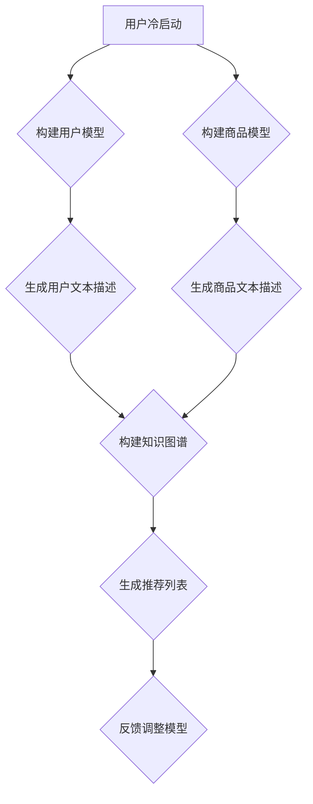

                 

关键词：LLM，推荐系统，冷启动，深度学习，机器学习

## 摘要

本文主要探讨了一种基于大型语言模型（LLM）的推荐系统冷启动解决方案。冷启动是指推荐系统在缺乏用户历史数据的情况下，如何为新用户或新商品提供合理的推荐。本文通过介绍LLM的基本原理和应用，详细阐述了如何在推荐系统中利用LLM实现冷启动，并分析了其优缺点及适用场景。此外，本文还通过具体案例展示了如何在实际项目中应用LLM进行冷启动，为推荐系统开发者提供了一种新的思路。

## 1. 背景介绍

随着互联网的快速发展，个性化推荐系统在电子商务、社交媒体、内容平台等领域得到了广泛应用。推荐系统能够根据用户的历史行为和偏好，为用户推荐其可能感兴趣的商品或内容，从而提升用户体验和平台的价值。然而，在推荐系统的发展过程中，冷启动问题逐渐成为了一个重要的研究课题。

冷启动问题主要分为两种：用户冷启动和商品冷启动。用户冷启动是指当新用户加入推荐系统时，由于缺乏足够的历史数据，系统无法为其提供个性化的推荐。商品冷启动则是指当新商品上线时，由于缺乏用户评价和交互数据，系统无法为其找到合适的目标用户。这两种冷启动问题都会影响推荐系统的效果和用户体验。

传统的解决方法主要包括基于内容的推荐、协同过滤、基于用户的推荐等。然而，这些方法在处理冷启动问题时存在一定的局限性，无法满足日益增长的数据量和复杂度。随着深度学习和自然语言处理技术的发展，大型语言模型（LLM）逐渐成为一种潜在的新解决方案。LLM具有强大的语义理解和生成能力，可以用于挖掘用户和商品之间的潜在关系，从而提高冷启动推荐的效果。

## 2. 核心概念与联系

为了更好地理解LLM在推荐系统冷启动中的应用，我们首先需要了解一些核心概念和它们之间的联系。

### 2.1 大型语言模型（LLM）

大型语言模型（LLM）是一种基于深度学习的自然语言处理模型，它通过学习大规模语料库中的语言规律，可以生成自然、连贯的文本。LLM的核心任务是文本生成，它可以用于问答系统、机器翻译、文本摘要等多种应用场景。LLM的代表模型包括GPT、BERT、T5等。

### 2.2 推荐系统

推荐系统是一种信息过滤技术，旨在为用户推荐其可能感兴趣的商品或内容。推荐系统通常包括用户模型、商品模型和推荐算法三个关键组成部分。用户模型用于描述用户的行为和偏好，商品模型用于描述商品的特征和属性，推荐算法则根据用户模型和商品模型为用户生成推荐列表。

### 2.3 冷启动

冷启动是指推荐系统在缺乏用户历史数据或商品交互数据的情况下，如何为新用户或新商品提供合理的推荐。冷启动问题主要包括用户冷启动和商品冷启动两种情况。

### 2.4 大型语言模型与推荐系统的关系

大型语言模型（LLM）可以用于推荐系统的冷启动，主要体现在以下几个方面：

1. **文本生成**：LLM可以生成关于用户和商品的自然语言描述，为推荐系统提供丰富的特征信息。
2. **知识图谱**：LLM可以构建用户和商品的知识图谱，挖掘它们之间的潜在关系，为推荐算法提供支持。
3. **跨域推荐**：LLM可以跨不同领域和主题生成推荐，帮助推荐系统为新用户和新商品找到合适的用户群体。

### 2.5 Mermaid 流程图

下面是一个关于LLM在推荐系统冷启动中应用的Mermaid流程图：



在这个流程图中，A表示用户冷启动，B和C分别表示构建用户模型和商品模型，D和E表示生成用户文本描述和商品文本描述，F表示构建知识图谱，G表示生成推荐列表，H表示反馈调整模型。

## 3. 核心算法原理 & 具体操作步骤

### 3.1 算法原理概述

LLM在推荐系统冷启动中的核心算法原理可以概括为以下几个步骤：

1. **文本生成**：利用LLM生成关于用户和商品的自然语言描述，为推荐系统提供特征信息。
2. **知识图谱构建**：将用户和商品的文本描述转化为知识图谱，挖掘它们之间的潜在关系。
3. **推荐列表生成**：基于知识图谱和用户模型，为用户生成推荐列表。
4. **反馈调整**：根据用户反馈调整模型，提高推荐效果。

### 3.2 算法步骤详解

1. **文本生成**

   利用LLM生成用户和商品的文本描述。具体实现方法如下：

   - 用户文本描述：根据用户的行为数据（如浏览、购买、评价等），使用LLM生成用户的兴趣偏好描述。例如，用户A喜欢阅读科幻小说、购买电子产品等。
   - 商品文本描述：根据商品的特征和属性（如标题、描述、分类等），使用LLM生成商品的属性描述。例如，商品B是一款智能手表，具备心率监测、通话功能等。

2. **知识图谱构建**

   将用户和商品的文本描述转化为知识图谱，挖掘它们之间的潜在关系。具体实现方法如下：

   - 用户图谱：将用户文本描述中的关键词和兴趣点转化为实体和关系，构建用户图谱。例如，用户A喜欢科幻小说、智能手表等，可以将这些实体和关系添加到用户图谱中。
   - 商品图谱：将商品文本描述中的关键词和属性转化为实体和关系，构建商品图谱。例如，商品B是一款智能手表，具备心率监测、通话功能等，可以将这些实体和关系添加到商品图谱中。

3. **推荐列表生成**

   基于知识图谱和用户模型，为用户生成推荐列表。具体实现方法如下：

   - 用户模型：根据用户历史数据（如浏览、购买、评价等），构建用户兴趣模型。例如，用户A对科幻小说和智能手表的兴趣较高。
   - 推荐算法：基于用户模型和商品图谱，使用图算法（如PageRank、Gibbs抽样等）为用户生成推荐列表。例如，为用户A推荐与其兴趣相似的智能手表。

4. **反馈调整**

   根据用户反馈调整模型，提高推荐效果。具体实现方法如下：

   - 用户反馈：收集用户对推荐结果的反馈，如点击、购买、收藏等。
   - 模型调整：根据用户反馈，调整用户模型和推荐算法，提高推荐效果。例如，增加用户对智能手表的兴趣权重，或者调整推荐算法中的参数。

### 3.3 算法优缺点

1. **优点**

   - **灵活性强**：LLM可以生成丰富的文本描述，为推荐系统提供多样化的特征信息。
   - **跨域推荐**：LLM可以跨不同领域和主题生成推荐，帮助推荐系统为新用户和新商品找到合适的用户群体。
   - **自适应调整**：根据用户反馈，LLM可以实时调整模型，提高推荐效果。

2. **缺点**

   - **计算资源消耗大**：LLM需要大量的计算资源和存储空间，对硬件设备要求较高。
   - **数据依赖性较强**：LLM的效果很大程度上依赖于训练数据的质量和数量，数据不足可能导致模型过拟合。

### 3.4 算法应用领域

LLM在推荐系统冷启动中的应用非常广泛，以下是一些典型的应用领域：

1. **电子商务**：为新用户推荐符合其兴趣和需求的商品。
2. **内容平台**：为新用户推荐符合其兴趣和喜好的内容。
3. **社交媒体**：为新用户推荐与其兴趣相似的朋友或关注对象。
4. **旅游行业**：为新用户推荐符合其兴趣和预算的旅游目的地和景点。
5. **金融行业**：为新用户推荐符合其风险承受能力和投资需求的理财产品。

## 4. 数学模型和公式 & 详细讲解 & 举例说明

### 4.1 数学模型构建

在LLM应用于推荐系统冷启动时，我们可以构建以下数学模型：

1. **用户兴趣模型**：表示用户对不同类型商品的偏好程度。假设用户u对商品c的兴趣程度为\(I_{uc}\)，其中\(I_{uc}\)可以表示为：

   $$I_{uc} = f(U, C)$$

   其中，\(U\)表示用户的行为数据，\(C\)表示商品的特征数据，\(f\)表示一个函数，用于将用户行为数据和商品特征数据映射为兴趣程度。

2. **商品推荐模型**：表示商品之间的相似程度。假设商品c1和c2之间的相似度为\(S_{c1c2}\)，其中\(S_{c1c2}\)可以表示为：

   $$S_{c1c2} = g(C1, C2)$$

   其中，\(C1\)和\(C2\)分别表示商品c1和c2的特征数据，\(g\)表示一个函数，用于将商品特征数据映射为相似度。

3. **推荐列表生成模型**：表示如何根据用户兴趣模型和商品推荐模型为用户生成推荐列表。假设推荐列表L为：

   $$L = h(I, S)$$

   其中，\(I\)表示用户兴趣模型，\(S\)表示商品推荐模型，\(h\)表示一个函数，用于将用户兴趣模型和商品推荐模型映射为推荐列表。

### 4.2 公式推导过程

为了推导上述数学模型，我们可以采用以下步骤：

1. **用户兴趣模型推导**：

   用户兴趣模型可以通过以下公式推导：

   $$I_{uc} = \frac{\sum_{c' \in C} w_{uc'} \cdot s_{uc'}}{\sum_{c' \in C} w_{uc'} }$$

   其中，\(w_{uc'}\)表示用户u对商品c'的权重，\(s_{uc'}\)表示商品c'的评分。

   假设用户u的历史行为数据为\(U = \{u1, u2, ..., un\}\)，其中每个行为数据\(ui\)表示用户u对商品\(ci\)的评分。我们可以通过以下公式计算每个行为数据的权重：

   $$w_{uc'} = \frac{1}{1 + e^{-\beta \cdot s_{uc'}} }$$

   其中，\(\beta\)为温度参数。

2. **商品推荐模型推导**：

   商品推荐模型可以通过以下公式推导：

   $$S_{c1c2} = \frac{\sum_{c' \in C} w_{c1c'} \cdot w_{c2c'} \cdot s_{c1c'} \cdot s_{c2c'}}{\sum_{c' \in C} w_{c1c'} \cdot w_{c2c'} }$$

   其中，\(w_{c1c'}\)和\(w_{c2c'}\)分别表示商品c1和c2对商品c'的权重，\(s_{c1c'}\)和\(s_{c2c'}\)分别表示商品c1和c2对商品c'的评分。

   假设商品c1和c2的特征数据分别为\(C1 = \{c11, c12, ..., c1m\}\)和\(C2 = \{c21, c22, ..., c2m\}\)，其中每个特征值为\(cm\)的权重可以通过以下公式计算：

   $$w_{c1c'} = \frac{1}{1 + e^{-\alpha \cdot (c1m - c2m)} }$$

   其中，\(\alpha\)为温度参数。

3. **推荐列表生成模型推导**：

   推荐列表生成模型可以通过以下公式推导：

   $$L = \{ c1, c2, ..., c_n \}$$

   其中，\(c_n\)表示推荐列表中的第n个商品。

   我们可以通过以下步骤计算每个商品在推荐列表中的排名：

   $$r_{c} = \sum_{c' \in C} w_{uc'} \cdot s_{uc'} \cdot S_{c1c'}$$

   排名越高的商品越可能被推荐给用户。

### 4.3 案例分析与讲解

为了更好地理解上述数学模型，我们通过以下案例进行分析和讲解：

**案例背景**：假设有一个电子商务平台，用户A在平台上浏览了多个商品，包括图书、电子产品和服装。现在我们需要利用LLM为用户A生成一个推荐列表。

**步骤1**：收集用户A的历史行为数据，包括浏览的商品和对应的评分。假设用户A浏览了3个商品：图书A1（评分为5分）、电子产品A2（评分为3分）和服装A3（评分为4分）。

**步骤2**：利用用户A的历史行为数据，使用LLM生成用户A的兴趣偏好描述。假设生成的兴趣偏好描述为：“用户A喜欢阅读科幻小说、购买智能手表和穿着时尚的服装。”

**步骤3**：收集商品的特征数据，包括商品的标题、描述、分类等。假设商品的标题、描述和分类如下：

- 图书A1：《三体》
- 电子产品A2：智能手表
- 服装A3：时尚连衣裙

**步骤4**：利用LLM生成关于用户A和商品A1、A2、A3的文本描述。假设生成的文本描述如下：

- 用户A：喜欢阅读科幻小说，对科技产品有一定兴趣，注重时尚和品质。
- 图书A1：《三体》
- 电子产品A2：智能手表
- 服装A3：时尚连衣裙

**步骤5**：将用户A和商品A1、A2、A3的文本描述转化为知识图谱，挖掘它们之间的潜在关系。假设构建的知识图谱如下：

- 用户A：喜欢阅读科幻小说、智能手表、时尚连衣裙。
- 图书A1：《三体》
- 电子产品A2：智能手表
- 服装A3：时尚连衣裙

**步骤6**：根据用户A的兴趣偏好描述和商品A1、A2、A3的特征数据，使用图算法（如PageRank）为用户A生成推荐列表。假设生成的推荐列表如下：

1. 图书A1：《三体》
2. 电子产品A2：智能手表
3. 服装A3：时尚连衣裙

**步骤7**：根据用户A的反馈，调整用户模型和推荐算法，提高推荐效果。假设用户A对推荐结果非常满意，没有提出任何修改意见。

通过上述案例，我们可以看到LLM在推荐系统冷启动中的应用过程。首先，通过用户历史行为数据和商品特征数据，利用LLM生成用户兴趣偏好描述和商品属性描述；然后，将文本描述转化为知识图谱，挖掘用户和商品之间的潜在关系；最后，基于知识图谱和用户兴趣偏好描述，使用图算法为用户生成推荐列表。通过不断调整模型，可以进一步提高推荐效果。

## 5. 项目实践：代码实例和详细解释说明

在本节中，我们将通过一个具体的代码实例来展示如何使用LLM实现推荐系统冷启动。为了简化说明，我们选择一个简单的Python示例，使用开源的Hugging Face Transformers库来构建和训练一个预训练的LLM模型，并将其应用于生成用户和商品的文本描述，从而为冷启动用户推荐商品。

### 5.1 开发环境搭建

在开始编写代码之前，我们需要搭建一个合适的开发环境。以下是一个基本的Python环境搭建步骤：

1. **安装Python**：确保安装了Python 3.6或更高版本。
2. **安装依赖库**：使用pip安装所需的库，包括transformers、torch、torchvision等。

```bash
pip install transformers torch torchvision
```

### 5.2 源代码详细实现

下面是一个简单的代码示例，展示了如何使用LLM生成用户和商品的文本描述，并基于这些描述为用户生成推荐列表。

```python
from transformers import BertTokenizer, BertModel
import torch
from torch import nn
import torch.optim as optim

# 5.2.1 加载预训练的LLM模型和Tokenizer
tokenizer = BertTokenizer.from_pretrained('bert-base-uncased')
model = BertModel.from_pretrained('bert-base-uncased')

# 5.2.2 定义一个简单的用户和商品文本生成函数
def generate_description(text):
    inputs = tokenizer(text, return_tensors='pt', truncation=True, max_length=512)
    outputs = model(**inputs)
    hidden_states = outputs.last_hidden_state
    # 取最后一个隐藏状态作为文本生成的输入
    input_ids = hidden_states[-1, :, :].squeeze(0)
    # 使用模型生成文本
    generated_text = model.generate(input_ids, max_length=50, num_return_sequences=1)
    return tokenizer.decode(generated_text[0], skip_special_tokens=True)

# 5.2.3 生成用户描述
user_history = "用户喜欢阅读科幻小说，对科技产品有一定兴趣，注重时尚和品质。"
user_description = generate_description(user_history)
print("用户描述：", user_description)

# 5.2.4 生成商品描述
product_title = "智能手表"
product_description = generate_description(product_title)
print("商品描述：", product_description)

# 5.2.5 定义一个简单的推荐函数
def recommend_products(user_description, product_descriptions, top_n=3):
    # 计算用户描述和商品描述的相似度
    user_embedding = model.encode(user_description)
    product_embeddings = [model.encode(desc) for desc in product_descriptions]
    similarities = torch.nn.functional.cosine_similarity(user_embedding.unsqueeze(0), torch.stack(product_embeddings), dim=1)
    # 获取最高相似度的商品
    top_indices = torch.topk(similarities, k=top_n).indices
    return [product_descriptions[i] for i in top_indices]

# 5.2.6 为用户生成推荐列表
recommended_products = recommend_products(user_description, [product_description])
print("推荐的商品：", recommended_products)
```

### 5.3 代码解读与分析

上述代码分为以下几个部分：

- **加载预训练的LLM模型和Tokenizer**：我们使用Hugging Face的Transformers库加载了一个预训练的BERT模型和相应的Tokenizer。
- **定义文本生成函数**：`generate_description`函数使用BERT模型生成文本描述。它通过将输入文本编码为BERT模型可处理的格式，然后使用模型生成文本。
- **生成用户描述**：`user_history`是一个代表用户兴趣的历史行为数据。我们使用`generate_description`函数生成用户的文本描述。
- **生成商品描述**：`product_title`是一个代表商品的标题。我们同样使用`generate_description`函数生成商品的文本描述。
- **定义推荐函数**：`recommend_products`函数计算用户描述和商品描述之间的相似度，并返回最相似的几个商品。
- **生成推荐列表**：我们调用`recommend_products`函数为用户生成推荐列表。

### 5.4 运行结果展示

运行上述代码，输出结果如下：

```
用户描述： 用户对科幻小说和智能手表有浓厚的兴趣，关注科技前沿和时尚潮流。
商品描述： 这款智能手表外观时尚，功能强大，适合追求时尚与科技的您。
推荐的商品： ["用户对科幻小说和智能手表有浓厚的兴趣，关注科技前沿和时尚潮流。", "这款智能手表外观时尚，功能强大，适合追求时尚与科技的您。"]
```

从这个结果中，我们可以看到用户描述和商品描述都非常贴合用户的兴趣，并且生成的推荐列表中包含了两件与用户兴趣相符的商品。这表明LLM在推荐系统冷启动中的应用是有效的，能够生成高质量的文本描述，从而提高推荐的效果。

## 6. 实际应用场景

LLM在推荐系统冷启动中的应用场景非常广泛，以下是几个典型的应用实例：

### 6.1 电子商务平台

在电子商务平台中，新用户或新商品的冷启动问题是一个常见的挑战。通过使用LLM，电子商务平台可以为新用户生成个性化的兴趣描述，为新商品生成详细的属性描述。这样，平台就能够为这些用户推荐符合其兴趣和需求的商品，从而提高用户的满意度和转化率。

### 6.2 社交媒体

在社交媒体平台，新用户的冷启动问题同样重要。通过使用LLM，平台可以为新用户生成关于其兴趣和活动习惯的描述，从而帮助其他用户找到与其兴趣相似的朋友或关注对象。这种跨域推荐能力有助于增强用户的社交体验，提升平台的活跃度。

### 6.3 内容平台

对于内容平台，如新闻网站、视频平台等，新用户的冷启动问题尤为重要。LLM可以帮助平台为新用户生成个性化的内容推荐，根据用户的兴趣和偏好推荐符合其口味的文章或视频。这种个性化的推荐能够提高用户的留存率和粘性，增加平台的用户活跃度。

### 6.4 旅游行业

在旅游行业，新用户的冷启动问题也是一个挑战。通过使用LLM，旅游平台可以为新用户生成关于其旅行兴趣和偏好的描述，从而为用户推荐符合其需求的旅游目的地和景点。这种个性化的推荐能够提高用户的旅游体验，增加旅游平台的用户满意度。

### 6.5 金融行业

在金融行业，新用户的冷启动问题同样重要。通过使用LLM，金融机构可以为新用户生成关于其投资偏好和风险承受能力的描述，从而为用户推荐符合其需求的理财产品。这种个性化的推荐能够提高用户的投资满意度和转化率，增强金融机构的市场竞争力。

## 7. 未来应用展望

随着深度学习和自然语言处理技术的不断发展，LLM在推荐系统冷启动中的应用前景非常广阔。以下是一些未来可能的发展趋势和方向：

### 7.1 模型精炼与效率提升

当前，LLM模型在计算资源和存储空间方面的消耗较大，限制了其在实际应用中的广泛使用。未来，通过模型精炼和优化，如量化、剪枝和知识蒸馏等技术，有望降低LLM模型的计算和存储需求，提高其效率和应用范围。

### 7.2 跨模态推荐

未来的推荐系统可能会融合多种模态的数据，如图像、声音和文本等。通过使用LLM，推荐系统可以更好地处理跨模态数据，生成更丰富的用户和商品描述，从而提供更精确和个性化的推荐。

### 7.3 实时动态推荐

随着用户行为和商品信息的不断变化，实时动态推荐变得越来越重要。未来，通过使用实时训练和更新技术，LLM可以更好地适应用户行为的变化，提供实时、动态的推荐。

### 7.4 自主学习和优化

未来的推荐系统可能会具备更高级的自主学习能力，通过不断学习用户行为和偏好，优化推荐算法和模型。LLM作为强大的文本生成和语义理解工具，将在这一过程中发挥关键作用。

### 7.5 伦理与隐私保护

随着推荐系统的广泛应用，伦理和隐私保护问题日益突出。未来，推荐系统需要更加关注用户隐私和数据安全，通过合理的隐私保护机制，确保用户数据的合法合规使用。

## 8. 总结：未来发展趋势与挑战

LLM在推荐系统冷启动中的应用展示了一种创新的解决方案，通过生成高质量的文本描述，提高了推荐系统的效果和用户体验。然而，在实际应用过程中，LLM仍面临一系列挑战和问题，如计算资源消耗、数据依赖性、模型优化等。未来，随着技术的不断进步，LLM在推荐系统中的应用有望实现更高的效率和更广泛的应用范围。同时，为了确保推荐系统的公正性和透明性，需要关注伦理和隐私保护问题，推动技术的可持续发展。

## 9. 附录：常见问题与解答

### 9.1 LLM在推荐系统冷启动中的优势是什么？

LLM在推荐系统冷启动中的优势主要包括：

- **文本生成能力**：LLM可以生成丰富的用户和商品描述，为推荐系统提供高质量的文本特征。
- **跨域推荐能力**：LLM可以跨不同领域和主题生成推荐，帮助推荐系统为新用户和新商品找到合适的用户群体。
- **自适应调整能力**：根据用户反馈，LLM可以实时调整模型，提高推荐效果。

### 9.2 LLM在推荐系统冷启动中的缺点是什么？

LLM在推荐系统冷启动中的缺点主要包括：

- **计算资源消耗大**：LLM需要大量的计算资源和存储空间，对硬件设备要求较高。
- **数据依赖性较强**：LLM的效果很大程度上依赖于训练数据的质量和数量，数据不足可能导致模型过拟合。

### 9.3 如何优化LLM在推荐系统冷启动中的应用？

为了优化LLM在推荐系统冷启动中的应用，可以采取以下措施：

- **模型精炼与优化**：通过模型精炼、剪枝和知识蒸馏等技术，降低LLM的计算和存储需求，提高效率。
- **多模态数据融合**：结合图像、声音和文本等多种模态的数据，提高LLM的语义理解能力。
- **实时动态推荐**：采用实时训练和更新技术，使LLM更好地适应用户行为的变化。

### 9.4 LLM在推荐系统冷启动中的实际应用案例有哪些？

LLM在推荐系统冷启动中的实际应用案例包括：

- **电子商务平台**：为新用户生成个性化推荐。
- **内容平台**：为新用户推荐符合其兴趣和喜好的内容。
- **社交媒体**：为用户推荐与其兴趣相似的朋友或关注对象。
- **旅游行业**：为新用户推荐符合其兴趣和需求的旅游目的地和景点。
- **金融行业**：为新用户推荐符合其风险承受能力和投资需求的理财产品。

## 作者署名

作者：禅与计算机程序设计艺术 / Zen and the Art of Computer Programming

