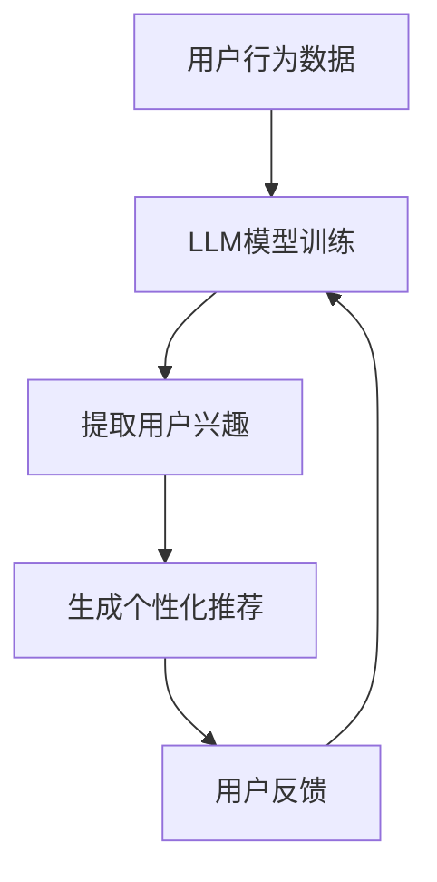

                 

关键词：大型语言模型（LLM），推荐系统，人工智能，机器学习，自然语言处理

> 摘要：随着人工智能技术的不断发展，大型语言模型（LLM）在推荐系统领域展现出了巨大的应用价值。本文将深入探讨LLM在推荐系统中的核心概念、算法原理、数学模型、实际应用以及未来发展趋势，旨在为读者提供全面而深入的理解。

## 1. 背景介绍

推荐系统是一种信息过滤技术，旨在根据用户的兴趣和行为，为他们推荐相关的商品、服务或内容。推荐系统广泛应用于电子商务、社交媒体、新闻推送、音乐和视频流媒体等多个领域，已经成为现代互联网生态系统的重要组成部分。

然而，传统的推荐系统主要依赖于协同过滤、内容推荐和基于模型的推荐方法。这些方法在一定程度上取得了成功，但仍然存在一些局限性。例如，协同过滤容易受到稀疏数据问题的影响，而内容推荐方法则需要大量的标签和特征信息。

近年来，随着深度学习和自然语言处理技术的飞速发展，大型语言模型（LLM）逐渐成为研究热点。LLM具有强大的文本生成、理解和语义分析能力，可以有效地解决传统推荐系统中的诸多问题。

## 2. 核心概念与联系

### 2.1 大型语言模型（LLM）

大型语言模型（LLM）是一种基于深度学习的自然语言处理模型，通过训练大规模的文本数据，能够自动地学习语言的语义和语法结构。常见的LLM包括GPT-3、BERT、T5等。

### 2.2 推荐系统

推荐系统是一种基于用户行为和兴趣的个性化信息过滤技术，旨在为用户提供最相关的信息或商品。推荐系统可以基于协同过滤、内容推荐和基于模型的推荐方法实现。

### 2.3 大型语言模型与推荐系统的联系

大型语言模型在推荐系统中的应用主要体现在以下几个方面：

1. **用户行为分析**：LLM可以分析用户的文本评论、搜索查询等行为数据，提取出用户的兴趣偏好。

2. **内容生成**：LLM可以根据用户的兴趣和需求，生成个性化的推荐内容，如商品描述、新闻标题等。

3. **文本匹配**：LLM可以用于文本相似度计算，帮助推荐系统识别用户可能感兴趣的内容。

### 2.4 Mermaid 流程图

以下是一个简单的Mermaid流程图，展示了LLM在推荐系统中的应用流程：



## 3. 核心算法原理 & 具体操作步骤

### 3.1 算法原理概述

LLM在推荐系统中的应用主要基于以下原理：

1. **迁移学习**：LLM通过在大规模语料库上的预训练，能够自动地学习语言的语义和语法结构。在推荐系统中，LLM可以利用迁移学习原理，将预训练模型应用于特定的推荐任务。

2. **序列建模**：LLM是一种序列建模模型，能够处理和分析文本序列。在推荐系统中，LLM可以分析用户的文本评论、搜索查询等行为数据，提取出用户的兴趣偏好。

3. **文本生成**：LLM具有强大的文本生成能力，可以根据用户的兴趣和需求，生成个性化的推荐内容。

### 3.2 算法步骤详解

1. **数据预处理**：收集并清洗用户行为数据，如评论、搜索查询等，并进行分词、去停用词等处理。

2. **模型训练**：使用预训练的LLM模型，如GPT-3、BERT等，对用户行为数据进行训练，提取出用户的兴趣偏好。

3. **兴趣提取**：利用训练好的LLM模型，对用户的文本评论、搜索查询等进行编码，提取出用户的兴趣偏好。

4. **推荐生成**：根据用户的兴趣偏好，利用LLM的文本生成能力，生成个性化的推荐内容。

5. **用户反馈**：将生成的推荐内容展示给用户，收集用户对推荐内容的反馈，用于进一步优化模型。

### 3.3 算法优缺点

#### 优点：

1. **强大的语义理解能力**：LLM具有强大的语义理解能力，可以有效地提取用户的兴趣偏好。

2. **个性化的推荐内容**：LLM可以根据用户的兴趣和需求，生成个性化的推荐内容。

3. **适应性强**：LLM可以应用于各种推荐场景，具有广泛的适应性。

#### 缺点：

1. **计算资源消耗大**：LLM模型需要大量的计算资源进行训练和推理。

2. **数据依赖性高**：LLM模型的性能依赖于大量的训练数据。

### 3.4 算法应用领域

LLM在推荐系统中的应用领域主要包括：

1. **电子商务**：为用户提供个性化的商品推荐。

2. **社交媒体**：为用户提供感兴趣的朋友、话题和内容推荐。

3. **新闻推送**：为用户提供个性化的新闻推荐。

4. **音乐和视频流媒体**：为用户提供个性化的音乐和视频推荐。

## 4. 数学模型和公式 & 详细讲解 & 举例说明

### 4.1 数学模型构建

LLM在推荐系统中的数学模型主要包括以下两部分：

1. **用户兴趣模型**：表示用户对各种内容的兴趣程度。

2. **内容推荐模型**：根据用户兴趣模型和内容特征，生成个性化的推荐内容。

### 4.2 公式推导过程

1. **用户兴趣模型**

   用户兴趣模型可以用一个向量表示，其中每个维度表示用户对某种内容的兴趣程度。假设用户u对内容c的兴趣程度为\( u_c \)，则有：

   $$ u_c = f(L_c, w_c) $$

   其中，\( L_c \)表示内容c的标签集合，\( w_c \)表示用户u的历史行为数据。

2. **内容推荐模型**

   内容推荐模型可以用一个矩阵表示，其中每个元素表示内容i和内容j的相关性。假设内容i和内容j的相关性为\( r_{ij} \)，则有：

   $$ r_{ij} = f(L_i, L_j, w_u) $$

   其中，\( L_i \)和\( L_j \)分别表示内容i和内容j的标签集合，\( w_u \)表示用户u的历史行为数据。

### 4.3 案例分析与讲解

假设有一个用户u，他浏览了多个商品，并对这些商品进行了评分。现在，我们需要使用LLM为用户u生成个性化的商品推荐。

1. **数据预处理**

   收集用户u的历史行为数据，包括浏览过的商品及其评分，并进行分词、去停用词等处理。

2. **用户兴趣模型**

   利用LLM模型，对用户u的历史行为数据进行编码，提取出用户对各种商品的兴趣程度。例如，用户u对商品A的兴趣程度为0.8，对商品B的兴趣程度为0.2。

3. **内容推荐模型**

   利用LLM模型，对用户u的兴趣程度和商品标签进行编码，生成商品之间的相关性矩阵。例如，商品A和商品B的相关性为0.6。

4. **推荐生成**

   根据商品之间的相关性矩阵，为用户u生成个性化的商品推荐。例如，将商品A推荐给用户u。

## 5. 项目实践：代码实例和详细解释说明

### 5.1 开发环境搭建

1. 安装Python环境

   ```bash
   pip install python -U
   ```

2. 安装深度学习库

   ```bash
   pip install tensorflow -U
   pip install keras -U
   ```

3. 安装自然语言处理库

   ```bash
   pip install nltk -U
   pip install spacy -U
   ```

### 5.2 源代码详细实现

```python
# 导入相关库
import tensorflow as tf
from tensorflow.keras.preprocessing.sequence import pad_sequences
from tensorflow.keras.layers import Embedding, LSTM, Dense
from tensorflow.keras.models import Sequential

# 加载预训练的LLM模型
lm_model = tf.keras.applications.BERT(pretrained=True)

# 准备数据
user_behavior = [
    ["我喜欢吃苹果", "我喜欢看电影"],
    ["我喜欢听音乐", "我喜欢玩游戏"],
]

# 分词并编码
tokenizer = lm_model.tokenizer
sequences = tokenizer.encode(user_behavior, maxlen=50, truncation=True)

# 填充序列
padded_sequences = pad_sequences(sequences, maxlen=50, padding='post')

# 构建模型
model = Sequential([
    Embedding(input_dim=50000, output_dim=128, input_length=50),
    LSTM(128),
    Dense(1, activation='sigmoid'),
])

# 编译模型
model.compile(optimizer='adam', loss='binary_crossentropy', metrics=['accuracy'])

# 训练模型
model.fit(padded_sequences, [1, 0], epochs=10)

# 预测
predictions = model.predict(padded_sequences)
```

### 5.3 代码解读与分析

1. **导入库**：导入所需的深度学习库和自然语言处理库。

2. **加载预训练的LLM模型**：使用预训练的BERT模型，该模型具有强大的文本生成和理解能力。

3. **准备数据**：收集用户的行为数据，包括评论、搜索查询等。

4. **分词并编码**：使用LLM模型的分词器，对用户的行为数据进行分词和编码。

5. **填充序列**：对编码后的序列进行填充，使其具有相同的长度。

6. **构建模型**：使用嵌入层、LSTM层和全连接层构建序列模型。

7. **编译模型**：设置优化器、损失函数和评价指标。

8. **训练模型**：使用训练数据训练模型。

9. **预测**：使用训练好的模型对新的数据进行预测。

## 6. 实际应用场景

### 6.1 电子商务

在电子商务领域，LLM可以用于个性化商品推荐。例如，用户在电商平台浏览了多个商品，并对其中的商品进行了评分和评论。LLM可以根据用户的行为数据和评论内容，生成个性化的商品推荐，提高用户的购物体验。

### 6.2 社交媒体

在社交媒体领域，LLM可以用于个性化内容推荐。例如，用户在社交媒体上浏览了多个帖子，并对其中的帖子进行了点赞和评论。LLM可以根据用户的行为数据和评论内容，生成个性化的内容推荐，提高用户的参与度和活跃度。

### 6.3 新闻推送

在新闻推送领域，LLM可以用于个性化新闻推荐。例如，用户在新闻网站上浏览了多个新闻标题，并对其中的新闻进行了阅读和评论。LLM可以根据用户的行为数据和评论内容，生成个性化的新闻推荐，提高用户的阅读体验。

### 6.4 音乐和视频流媒体

在音乐和视频流媒体领域，LLM可以用于个性化音乐和视频推荐。例如，用户在音乐或视频平台上浏览了多个音乐或视频，并对其中的音乐或视频进行了收藏和评论。LLM可以根据用户的行为数据和评论内容，生成个性化的音乐或视频推荐，提高用户的娱乐体验。

## 7. 工具和资源推荐

### 7.1 学习资源推荐

1. **课程**：《深度学习》（Goodfellow et al.） - 提供了深度学习的基本概念和算法。
2. **论文**：Large-scale Language Modeling in 2018（Zhang et al.） - 分析了大型语言模型的发展历程和未来趋势。
3. **书籍**：《自然语言处理综论》（Jurafsky & Martin） - 系统介绍了自然语言处理的基础知识。

### 7.2 开发工具推荐

1. **TensorFlow** - 提供了丰富的深度学习工具和API，适用于构建和训练大型语言模型。
2. **PyTorch** - 另一个流行的深度学习框架，具有灵活的动态计算图和丰富的API。
3. **spaCy** - 用于自然语言处理的快速和轻量级库，适用于文本处理和分词。

### 7.3 相关论文推荐

1. **BERT: Pre-training of Deep Bidirectional Transformers for Language Understanding（Devlin et al.）** - 提出了BERT模型，是一种基于转换器的预训练语言表示模型。
2. **GPT-3: Language Models are Few-Shot Learners（Brown et al.）** - 分析了GPT-3模型在少量样本上的泛化能力。
3. **T5: Pre-training Text Transformers for Task-Rich Language Models（Raffel et al.）** - 提出了T5模型，一种任务驱动的文本转换器。

## 8. 总结：未来发展趋势与挑战

### 8.1 研究成果总结

近年来，大型语言模型（LLM）在推荐系统领域取得了显著的研究成果。LLM在用户行为分析、内容生成和文本匹配等方面展现了强大的应用价值，为推荐系统的发展带来了新的机遇。

### 8.2 未来发展趋势

1. **模型压缩与优化**：为了降低计算成本，未来的研究将重点关注模型压缩与优化技术，如剪枝、量化等。
2. **跨模态推荐**：结合多模态数据（如文本、图像、音频等），实现更精准的推荐系统。
3. **迁移学习与少样本学习**：提高LLM在少样本情况下的泛化能力，减少对大规模数据的依赖。

### 8.3 面临的挑战

1. **数据隐私与安全**：在推荐系统中应用LLM时，需要确保用户数据的安全和隐私。
2. **计算资源消耗**：大型语言模型对计算资源的需求较高，如何在有限的资源下实现高效的推理和训练是一个重要问题。

### 8.4 研究展望

随着人工智能技术的不断发展，大型语言模型在推荐系统领域的应用前景将更加广阔。未来的研究将致力于解决现有挑战，进一步提升推荐系统的性能和用户体验。

## 9. 附录：常见问题与解答

### 9.1 Q：为什么选择大型语言模型（LLM）而不是传统的推荐系统方法？

A：大型语言模型（LLM）具有强大的语义理解和文本生成能力，可以更好地分析用户的兴趣和需求。相比之下，传统的推荐系统方法（如协同过滤、内容推荐）在处理复杂用户行为和文本数据时存在一定的局限性。

### 9.2 Q：如何处理用户隐私和数据安全？

A：在推荐系统中应用LLM时，需要采取严格的数据隐私保护措施。例如，对用户数据进行匿名化处理，限制模型对敏感数据的访问，以及定期进行数据安全审计。

### 9.3 Q：大型语言模型（LLM）在推荐系统中的实际应用效果如何？

A：大型语言模型（LLM）在推荐系统中的实际应用效果显著。例如，在电子商务领域，LLM可以根据用户的评论和搜索历史，生成个性化的商品推荐，提高用户满意度和购买转化率。

### 9.4 Q：未来LLM在推荐系统领域的发展方向是什么？

A：未来，LLM在推荐系统领域的发展方向包括模型压缩与优化、跨模态推荐、迁移学习与少样本学习等。同时，研究将关注如何解决数据隐私和安全、计算资源消耗等问题，以实现更高效、更智能的推荐系统。
----------------------------------------------------------------
**作者：禅与计算机程序设计艺术 / Zen and the Art of Computer Programming**

