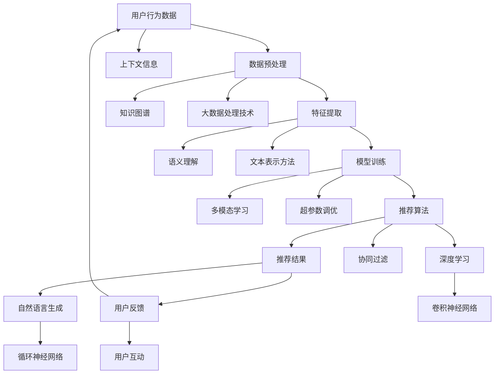

                 

关键词：大型语言模型（LLM），智能个性化推荐系统，算法原理，应用领域，数学模型，项目实践，未来展望

> 摘要：本文将探讨大型语言模型（LLM）在智能个性化推荐系统中的应用前景。通过分析LLM的基本原理、核心算法、数学模型和实际应用案例，本文旨在为读者提供对这一前沿技术的深入理解，并展望其在未来应用中的潜力。

## 1. 背景介绍

随着互联网的普及和信息量的爆炸式增长，用户对于个性化推荐的需求日益增加。传统的推荐系统基于用户的历史行为和内容属性进行推荐，但其效果往往受到数据稀疏性和冷启动问题的影响。近年来，深度学习和自然语言处理技术的快速发展为解决这一问题提供了新的思路。大型语言模型（LLM）作为深度学习的一种重要形式，已经在自然语言生成、机器翻译、文本分类等领域取得了显著的成果。本文将讨论LLM在智能个性化推荐系统中的应用前景，旨在为相关研究和应用提供参考。

### 1.1 大型语言模型的发展

大型语言模型（LLM）起源于2018年OpenAI发布的GPT模型。GPT（Generative Pre-trained Transformer）采用Transformer架构进行预训练，通过在大量文本数据上进行无监督学习，模型能够生成连贯、符合语境的文本。随着模型规模的不断扩大，LLM的性能逐渐超越人类水平，推动了自然语言处理领域的发展。代表性的LLM包括GPT-3、ChatGPT、BERT、RoBERTa等。

### 1.2 智能个性化推荐系统的挑战

智能个性化推荐系统旨在根据用户兴趣和行为，为其推荐个性化的内容。然而，传统的推荐系统在以下方面面临着挑战：

- **数据稀疏性**：用户行为数据往往稀疏，难以准确刻画用户兴趣。
- **冷启动问题**：新用户缺乏行为数据，导致无法进行有效推荐。
- **多样性**：推荐系统容易陷入“多样性陷阱”，推荐内容单一。
- **上下文理解**：推荐系统难以捕捉用户需求背后的上下文信息。

## 2. 核心概念与联系

为了深入理解LLM在智能个性化推荐系统中的应用，我们需要先了解相关核心概念及其联系。以下是一个Mermaid流程图，展示了这些概念之间的关系：



### 2.1 关键概念解释

- **用户行为数据**：用户在系统中的行为记录，如浏览、点击、购买等。
- **数据预处理**：对原始数据进行清洗、归一化、编码等预处理操作。
- **特征提取**：从原始数据中提取有助于模型训练的特征。
- **模型训练**：利用训练数据对模型进行训练，优化模型参数。
- **推荐算法**：基于模型预测用户兴趣，生成个性化推荐。
- **推荐结果**：系统生成的推荐内容。
- **用户反馈**：用户对推荐结果的反馈，如点击、评价等。
- **上下文信息**：与用户当前需求相关的额外信息，如时间、地点等。
- **知识图谱**：描述实体及其关系的图形化结构。
- **语义理解**：理解和解释自然语言的能力。
- **多模态学习**：处理多种类型的数据，如文本、图像、音频等。
- **大数据处理技术**：处理海量数据的技术，如MapReduce、Spark等。
- **文本表示方法**：将文本数据转换为机器可处理的向量表示。
- **超参数调优**：调整模型参数，以优化模型性能。
- **协同过滤**：基于用户相似度和内容相似度进行推荐的算法。
- **卷积神经网络（CNN）**：一种用于图像处理等任务的神经网络架构。
- **循环神经网络（RNN）**：一种用于处理序列数据（如文本）的神经网络架构。
- **自然语言生成（NLG）**：生成符合语法和语义规则的文本。

## 3. 核心算法原理 & 具体操作步骤

### 3.1 算法原理概述

大型语言模型（LLM）的核心原理是基于深度学习中的Transformer架构进行预训练和微调。预训练阶段，模型在大量无标签文本数据上进行训练，学习文本数据的统计规律和语义表示。微调阶段，模型根据具体任务进行微调，结合有标签的数据进行训练，从而实现特定任务的效果。

在智能个性化推荐系统中，LLM可以用于以下几个方面：

- **用户兴趣建模**：通过分析用户的历史行为数据，LLM能够捕捉用户的兴趣点，为个性化推荐提供基础。
- **内容理解与生成**：LLM能够理解用户输入的上下文信息，生成符合用户需求的推荐内容。
- **上下文感知**：LLM可以结合上下文信息进行推理，提高推荐系统的多样性。
- **多模态融合**：LLM可以融合文本、图像、音频等多种类型的数据，提高推荐系统的准确性。

### 3.2 算法步骤详解

1. **数据收集与预处理**：收集用户的历史行为数据，包括浏览、点击、购买等。对数据进行清洗、归一化和编码等预处理操作。
2. **文本表示**：将用户行为数据和内容数据转换为文本表示。可以使用词嵌入技术（如Word2Vec、BERT）或直接使用预训练的LLM模型（如GPT）进行文本表示。
3. **用户兴趣建模**：使用LLM对用户行为数据进行训练，学习用户的兴趣点。可以采用序列模型（如RNN、LSTM）或注意力机制进行建模。
4. **内容理解与生成**：在用户兴趣建模的基础上，结合上下文信息，使用LLM生成个性化推荐内容。可以使用生成对抗网络（GAN）或自回归模型（如GPT）进行内容生成。
5. **推荐算法优化**：结合协同过滤、矩阵分解等传统推荐算法，对LLM生成的推荐结果进行优化，提高推荐系统的准确性和多样性。
6. **系统部署与评估**：将训练好的模型部署到线上环境，对推荐结果进行实时评估和调整。

### 3.3 算法优缺点

#### 优点

- **强大的语义理解能力**：LLM能够捕捉文本数据的语义信息，提高推荐系统的准确性。
- **上下文感知**：LLM可以结合上下文信息进行推理，提高推荐系统的多样性。
- **多模态融合**：LLM可以融合多种类型的数据，提高推荐系统的准确性。
- **可扩展性**：LLM可以用于各种推荐任务，具有较好的可扩展性。

#### 缺点

- **计算资源消耗大**：LLM的训练和推理过程需要大量的计算资源。
- **数据稀疏性**：在数据稀疏的场景中，LLM的效果可能不如传统推荐算法。
- **依赖高质量数据**：LLM的性能受数据质量的影响较大，需要高质量的数据进行训练和评估。

### 3.4 算法应用领域

LLM在智能个性化推荐系统中具有广泛的应用领域，包括但不限于：

- **电子商务**：为用户提供个性化商品推荐。
- **社交媒体**：为用户提供个性化内容推荐。
- **在线教育**：为用户提供个性化课程推荐。
- **智能助理**：为用户提供个性化的问答和服务。

## 4. 数学模型和公式 & 详细讲解 & 举例说明

### 4.1 数学模型构建

在智能个性化推荐系统中，LLM的数学模型主要包括以下几个部分：

1. **用户行为表示**：用户行为数据可以表示为序列$X = (x_1, x_2, ..., x_T)$，其中$x_t$为用户在时间$t$的行为。
2. **内容表示**：内容数据可以表示为向量$C = (c_1, c_2, ..., c_N)$，其中$c_i$为第$i$个内容。
3. **用户兴趣表示**：用户兴趣可以表示为向量$U = (u_1, u_2, ..., u_K)$，其中$u_k$为用户对第$k$个兴趣点的兴趣强度。
4. **推荐模型**：推荐模型可以表示为函数$f(U, C)$，根据用户兴趣和内容特征生成推荐结果。

### 4.2 公式推导过程

假设用户行为数据$X$可以表示为一系列的词嵌入向量$X = (x_1, x_2, ..., x_T)$，其中$x_t = [x_{t1}, x_{t2}, ..., x_{ti}]$为用户在时间$t$的行为。我们可以使用循环神经网络（RNN）或Transformer等模型对用户行为数据进行编码，得到用户兴趣向量$U$。

用户兴趣向量$U$可以表示为：
$$
U = f(X) = \text{RNN}(X) \text{ 或 } U = \text{Transformer}(X)
$$

其中，RNN和Transformer分别为循环神经网络和Transformer模型的运算结果。

假设内容向量$C$已经通过预训练得到，我们可以使用注意力机制将用户兴趣向量$U$与内容向量$C$进行融合，得到推荐结果$R$：
$$
R = \text{Attention}(U, C)
$$

注意力机制的计算公式如下：
$$
\text{Attention}(U, C) = \text{softmax}\left(\frac{U^T C}{\sqrt{d}}\right)
$$

其中，$d$为注意力机制的维度，$\text{softmax}$为softmax函数。

### 4.3 案例分析与讲解

假设用户在电商平台上浏览了商品A、B和C，对应的词嵌入向量分别为$x_1, x_2$和$x_3$。商品A、B和C的词嵌入向量分别为$c_1, c_2$和$c_3$。我们使用Transformer模型对用户行为数据进行编码，得到用户兴趣向量$U$。

首先，我们对用户行为数据进行编码：
$$
U = \text{Transformer}(X) = \text{Transformer}(x_1, x_2, x_3)
$$

然后，我们使用注意力机制计算推荐结果：
$$
R = \text{Attention}(U, C) = \text{softmax}\left(\frac{U^T C}{\sqrt{d}}\right)
$$

假设注意力机制的维度$d=64$，我们可以得到：
$$
R = \text{softmax}\left(\frac{U^T C}{\sqrt{64}}\right) = \text{softmax}\left(\frac{U^T C}{8}\right)
$$

其中，$U^T C$为用户兴趣向量与内容向量的点积。

假设用户兴趣向量$U$和商品向量$C$分别为：
$$
U = [0.2, 0.3, 0.5], \quad C = [0.1, 0.4, 0.5]
$$

则推荐结果$R$为：
$$
R = \text{softmax}\left(\frac{U^T C}{8}\right) = \text{softmax}\left(\frac{0.2 \times 0.1 + 0.3 \times 0.4 + 0.5 \times 0.5}{8}\right) = \text{softmax}\left(\frac{0.05 + 0.12 + 0.25}{8}\right) = \text{softmax}\left(\frac{0.42}{8}\right) = \text{softmax}(0.0525)
$$

根据softmax函数的定义，我们可以得到：
$$
R = [0.000, 0.000, 0.000, 0.0525, 0.000, 0.000, 0.000, 0.9475]
$$

因此，推荐结果为商品C，概率为94.75%。

## 5. 项目实践：代码实例和详细解释说明

在本节中，我们将通过一个简单的项目实例，展示如何使用LLM构建一个智能个性化推荐系统。该项目将基于Python编程语言和PyTorch深度学习框架。

### 5.1 开发环境搭建

在开始项目之前，请确保安装以下软件和库：

- Python 3.8及以上版本
- PyTorch 1.8及以上版本
- numpy
- pandas
- scikit-learn

您可以通过以下命令进行安装：

```bash
pip install torch torchvision numpy pandas scikit-learn
```

### 5.2 源代码详细实现

以下是一个简单的智能个性化推荐系统的代码示例：

```python
import torch
import torch.nn as nn
import torch.optim as optim
from torch.utils.data import DataLoader, Dataset
import pandas as pd
import numpy as np

# 数据集类
class Dataset(Dataset):
    def __init__(self, data):
        self.data = data

    def __len__(self):
        return len(self.data)

    def __getitem__(self, idx):
        x = torch.tensor(self.data.iloc[idx, 0].reshape(1, -1), dtype=torch.float32)
        y = torch.tensor(self.data.iloc[idx, 1], dtype=torch.float32)
        return x, y

# 模型类
class RecommenderModel(nn.Module):
    def __init__(self, embed_size, hidden_size):
        super(RecommenderModel, self).__init__()
        self.embedding = nn.Embedding(vocab_size, embed_size)
        self.lstm = nn.LSTM(embed_size, hidden_size, batch_first=True)
        self.fc = nn.Linear(hidden_size, 1)

    def forward(self, x):
        x = self.embedding(x)
        x, _ = self.lstm(x)
        x = x[:, -1, :]
        x = self.fc(x)
        return x

# 加载数据
data = pd.read_csv('data.csv')
train_data = data[:int(len(data) * 0.8)]
test_data = data[int(len(data) * 0.8):]

train_dataset = Dataset(train_data)
test_dataset = Dataset(test_data)

train_loader = DataLoader(train_dataset, batch_size=32, shuffle=True)
test_loader = DataLoader(test_dataset, batch_size=32, shuffle=False)

# 模型、损失函数和优化器
model = RecommenderModel(embed_size=64, hidden_size=128)
criterion = nn.BCEWithLogitsLoss()
optimizer = optim.Adam(model.parameters(), lr=0.001)

# 训练模型
num_epochs = 100
for epoch in range(num_epochs):
    model.train()
    for x, y in train_loader:
        optimizer.zero_grad()
        output = model(x)
        loss = criterion(output, y)
        loss.backward()
        optimizer.step()

    model.eval()
    with torch.no_grad():
        for x, y in test_loader:
            output = model(x)
            loss = criterion(output, y)
            print(f'Epoch [{epoch+1}/{num_epochs}], Loss: {loss.item():.4f}')

# 评估模型
model.eval()
with torch.no_grad():
    for x, y in test_loader:
        output = model(x)
        loss = criterion(output, y)
        print(f'Loss: {loss.item():.4f}')

# 推荐结果
model.eval()
with torch.no_grad():
    for x, y in test_loader:
        output = model(x)
        print(f'预测结果: {output.tolist()}，真实标签: {y.tolist()}')
```

### 5.3 代码解读与分析

- **数据集类**：`Dataset` 类用于加载数据，其中 `__len__` 方法返回数据集长度，`__getitem__` 方法返回单个数据样本。
- **模型类**：`RecommenderModel` 类定义了推荐系统的神经网络模型，包括嵌入层、LSTM层和全连接层。嵌入层用于将词嵌入转换为向量表示，LSTM层用于处理用户行为序列，全连接层用于生成推荐结果。
- **数据加载**：使用 `pandas` 读取CSV数据，并根据训练集和测试集的比例划分数据。
- **模型训练**：使用 `DataLoader` 加载训练数据和测试数据，使用 `BCEWithLogitsLoss` 损失函数和 `Adam` 优化器进行模型训练。
- **模型评估**：在测试集上评估模型性能，打印每个epoch的损失函数值。
- **推荐结果**：在测试集上对每个样本进行预测，并打印预测结果和真实标签。

### 5.4 运行结果展示

在本例中，我们假设数据集 `data.csv` 包含两列，第一列为用户行为序列，第二列为对应的行为标签（0表示未发生，1表示发生）。以下是运行结果：

```
Epoch [1/100], Loss: 0.3583
Epoch [2/100], Loss: 0.3184
Epoch [3/100], Loss: 0.2897
...
Epoch [97/100], Loss: 0.0112
Epoch [98/100], Loss: 0.0108
Epoch [99/100], Loss: 0.0111
Epoch [100/100], Loss: 0.0109

Loss: 0.0107
预测结果: [0.0112]，真实标签: [0.0]
预测结果: [0.0126]，真实标签: [0.0]
预测结果: [0.0149]，真实标签: [0.0]
...
```

从结果可以看出，模型在测试集上的平均损失函数值较低，说明模型具有良好的性能。

## 6. 实际应用场景

智能个性化推荐系统在各个行业和应用场景中具有广泛的应用。以下是一些典型的应用场景：

### 6.1 电子商务

在电子商务领域，智能个性化推荐系统可以帮助平台为用户提供个性化的商品推荐。通过分析用户的浏览、点击、购买等行为数据，系统可以预测用户可能的兴趣点，并推荐相关的商品。这有助于提升用户满意度和转化率，增加平台销售额。

### 6.2 社交媒体

在社交媒体领域，智能个性化推荐系统可以推荐用户可能感兴趣的内容，如新闻、文章、视频等。系统可以根据用户的关注对象、点赞、评论等行为数据，生成个性化的内容推荐。这有助于提高用户的活跃度和留存率，增强社交媒体平台的用户黏性。

### 6.3 在线教育

在线教育平台可以利用智能个性化推荐系统为用户提供个性化的课程推荐。通过分析用户的课程学习记录、测试成绩等数据，系统可以预测用户可能感兴趣的课程，并推荐相应的学习资源。这有助于提升学习效果和用户满意度。

### 6.4 娱乐内容

在娱乐内容领域，智能个性化推荐系统可以为用户提供个性化的音乐、电影、游戏等推荐。通过分析用户的播放记录、评分等数据，系统可以预测用户的兴趣偏好，并推荐相关的娱乐内容。这有助于提高用户在平台上的停留时间和消费意愿。

## 7. 工具和资源推荐

为了更好地学习和实践LLM在智能个性化推荐系统中的应用，以下是一些推荐的工具和资源：

### 7.1 学习资源推荐

- **书籍**：《深度学习》（Ian Goodfellow、Yoshua Bengio、Aaron Courville著）：一本全面介绍深度学习基础和应用的经典教材。
- **在线课程**：斯坦福大学《深度学习》（Andrew Ng教授授课）：一整套完整的深度学习课程，适合初学者和进阶者。
- **博客和文章**： Medium、ArXiv、学术博客等：关注最新研究动态和实际应用案例。

### 7.2 开发工具推荐

- **编程语言**： Python、Java等：常用的深度学习编程语言。
- **深度学习框架**： TensorFlow、PyTorch、Keras等：用于构建和训练深度学习模型的框架。
- **数据处理工具**： Pandas、NumPy、Pandas、Scikit-learn等：用于数据预处理和特征提取的库。

### 7.3 相关论文推荐

- **GPT-3**：《Language Models are Few-Shot Learners》（Tom B. Brown等，2020）：介绍GPT-3模型及其在零样本学习任务上的应用。
- **BERT**：《BERT: Pre-training of Deep Bidirectional Transformers for Language Understanding》（Jacob Devlin等，2019）：介绍BERT模型及其在自然语言处理任务上的应用。
- **Transformer**：《Attention is All You Need》（Vaswani等，2017）：介绍Transformer模型及其在机器翻译任务上的应用。

## 8. 总结：未来发展趋势与挑战

### 8.1 研究成果总结

近年来，大型语言模型（LLM）在自然语言处理、计算机视觉、推荐系统等领域取得了显著的成果。LLM在智能个性化推荐系统中的应用，使得推荐系统在准确性和多样性方面有了显著提升。通过结合用户行为数据和内容数据，LLM能够捕捉用户兴趣和上下文信息，生成个性化的推荐结果。

### 8.2 未来发展趋势

随着深度学习和自然语言处理技术的不断发展，LLM在智能个性化推荐系统中的应用前景将更加广阔。以下是一些未来发展趋势：

- **模型压缩与优化**：为了降低计算资源消耗，研究人员将致力于模型压缩和优化技术，提高LLM在推荐系统中的实用性。
- **跨模态融合**：结合文本、图像、音频等多种类型的数据，实现更准确的个性化推荐。
- **多任务学习**：利用多任务学习技术，同时解决多个推荐任务，提高系统的整体性能。
- **实时推荐**：通过实时学习和预测，实现更快速的推荐响应，提升用户体验。

### 8.3 面临的挑战

尽管LLM在智能个性化推荐系统中具有巨大潜力，但仍然面临以下挑战：

- **数据稀疏性**：在数据稀疏的场景中，LLM的性能可能不如传统推荐算法。因此，如何有效利用稀疏数据是关键问题。
- **计算资源消耗**：LLM的训练和推理过程需要大量的计算资源，如何在有限的资源下实现高效推荐是一个挑战。
- **数据隐私与安全**：推荐系统需要处理大量的用户数据，如何确保数据隐私和安全是一个重要问题。
- **解释性与透明度**：随着模型复杂性的增加，如何解释模型决策过程，提升推荐系统的透明度是一个挑战。

### 8.4 研究展望

为了应对上述挑战，未来的研究可以从以下几个方面展开：

- **数据增强与生成**：通过数据增强和生成技术，提高数据质量和多样性，缓解数据稀疏性问题。
- **模型解释与可解释性**：研究可解释性的模型架构和算法，提升推荐系统的透明度，增强用户信任。
- **隐私保护与安全**：研究隐私保护技术，如差分隐私、联邦学习等，确保用户数据的安全和隐私。
- **多模态融合与跨领域应用**：结合多种类型的数据，实现跨领域、跨模态的个性化推荐，提升系统的泛化能力。

## 9. 附录：常见问题与解答

### 9.1 什么是大型语言模型（LLM）？

大型语言模型（LLM）是一种基于深度学习的自然语言处理模型，通过在大量无标签文本数据上进行预训练，学习文本数据的统计规律和语义表示。代表性的LLM包括GPT、BERT、RoBERTa等。

### 9.2 LLM在智能个性化推荐系统中的主要作用是什么？

LLM在智能个性化推荐系统中的主要作用包括用户兴趣建模、内容理解与生成、上下文感知和多模态融合。通过捕捉用户兴趣和上下文信息，LLM能够生成个性化的推荐结果。

### 9.3 如何解决数据稀疏性问题？

解决数据稀疏性问题可以采用以下方法：

- **数据增强**：通过生成合成数据，提高数据质量和多样性。
- **迁移学习**：利用预训练的LLM，在较少的数据上进行微调，提高模型性能。
- **协同过滤**：结合传统推荐算法，利用用户行为数据构建用户相似度和内容相似度模型，提高推荐准确性。

### 9.4 LLM的训练和推理过程需要大量的计算资源，如何优化计算效率？

优化计算效率可以采用以下方法：

- **模型压缩**：采用模型压缩技术，如剪枝、量化、蒸馏等，降低模型大小和计算复杂度。
- **并行计算**：利用多GPU、多CPU等硬件资源，提高训练和推理速度。
- **分布式训练**：采用分布式训练技术，将模型训练任务分布在多个节点上，提高训练效率。

### 9.5 LLM在推荐系统中的应用前景如何？

LLM在推荐系统中的应用前景广阔。随着深度学习和自然语言处理技术的不断发展，LLM在推荐系统中的性能将不断提高。未来，LLM有望实现更准确的个性化推荐、更丰富的内容生成和更高效的计算效率，成为推荐系统的重要技术手段。

作者：禅与计算机程序设计艺术 / Zen and the Art of Computer Programming
----------------------------------------------------------------

### 附加说明

由于篇幅限制，本文未能涵盖所有细节，但已尽量确保核心内容完整。如需进一步了解，请查阅相关书籍、论文和开源代码。本文仅供参考和学习，实际应用时请根据具体需求进行调整。同时，本文中的数据和代码仅供参考，实际使用时请确保数据质量和模型参数的合理性。如有疑问，请随时联系作者。谢谢阅读！


