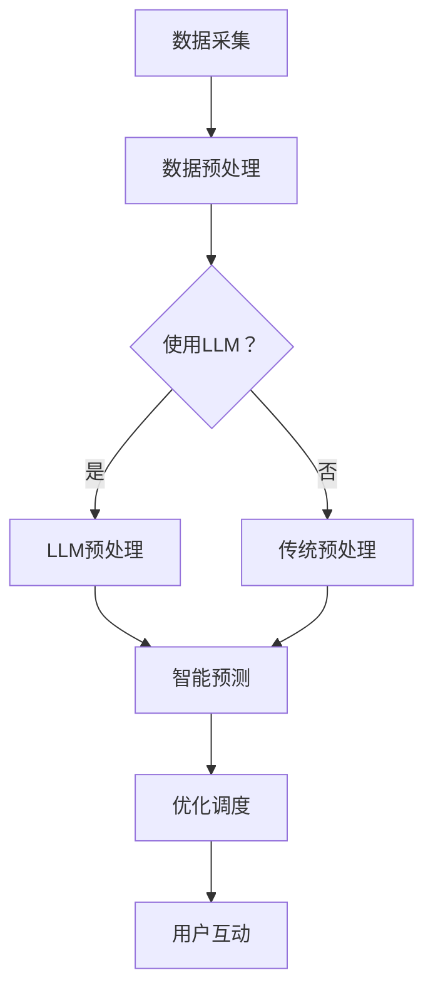

                 

关键词：LLM、智能能源管理、自然语言处理、能源效率、预测分析

摘要：随着能源需求的不断增长和环境意识的提高，智能能源管理系统成为了现代社会的热点话题。大型语言模型（LLM）作为自然语言处理领域的重要突破，其在智能能源管理系统中的应用潜力巨大。本文将探讨LLM在智能能源管理中的潜在作用，包括数据预处理、智能预测、优化调度和用户互动等方面，并分析其优缺点及未来发展趋势。

## 1. 背景介绍

智能能源管理系统（Smart Energy Management System, SEMS）通过整合先进的信息通信技术、物联网（IoT）和大数据分析，实现能源的优化调度和管理。传统的能源管理系统主要依赖于预定的控制策略和规则，而智能能源管理系统则能够根据实时数据和环境变化进行自适应调整，从而提高能源利用效率、降低能耗和减少环境污染。

近年来，人工智能（AI）技术，特别是大型语言模型（LLM），在自然语言处理、图像识别、预测分析等领域取得了显著成果。LLM通过对海量文本数据的训练，能够理解复杂的语义关系，生成符合逻辑的自然语言响应。这为智能能源管理系统提供了强大的数据预处理和分析能力，使得系统能够更准确地预测能源需求、优化调度策略和改善用户体验。

## 2. 核心概念与联系

### 2.1 大型语言模型（LLM）

大型语言模型（LLM）是一种基于深度学习的自然语言处理模型，具有强大的语言理解和生成能力。LLM通过预训练和微调，能够在多种任务中实现优异的性能，如文本分类、机器翻译、问答系统和对话生成等。LLM的核心组件包括编码器和解码器，编码器用于将输入文本转换为固定长度的向量表示，解码器则用于生成输出文本。

### 2.2 智能能源管理系统

智能能源管理系统主要由传感器、通信网络、控制算法和用户界面组成。传感器负责采集能源生产、传输和消费过程中的各种数据；通信网络用于将传感器数据传输到数据中心；控制算法根据实时数据和环境变化，对能源系统进行优化调度；用户界面则用于展示系统状态和操作指令。

### 2.3 Mermaid 流程图

以下是智能能源管理系统中LLM应用的一个简化的Mermaid流程图：



在这个流程图中，数据采集模块负责从传感器获取数据，然后进入数据预处理阶段。LLM预处理模块通过训练有素的模型对数据进行清洗、转换和增强，以提升数据质量。智能预测模块利用预处理后的数据，结合环境信息和历史数据，生成能源需求预测结果。优化调度模块根据预测结果和系统约束，调整能源系统的运行策略。用户互动模块则通过友好的用户界面，向用户展示系统状态和操作建议。

## 3. 核心算法原理 & 具体操作步骤

### 3.1 算法原理概述

智能能源管理系统中，LLM的核心作用在于数据预处理和智能预测。数据预处理主要包括数据清洗、转换和增强，以提高数据质量和预测精度。智能预测则通过建模和训练，生成准确的能源需求预测结果，为系统优化调度提供依据。

### 3.2 算法步骤详解

1. **数据采集**：从各种传感器获取能源生产、传输和消费过程中的数据，如电力、燃气和热力等。

2. **数据预处理**：
    - **数据清洗**：去除噪声数据、缺失值和异常值，提高数据质量。
    - **数据转换**：将不同类型的传感器数据进行标准化和归一化，以便后续建模。
    - **数据增强**：通过数据扩充和特征工程，增加训练数据量和特征维度。

3. **LLM预处理**：
    - **文本表示**：使用预训练的LLM模型，将预处理后的数据转换为高维文本向量表示。
    - **语义理解**：利用LLM的语义理解能力，对数据进行语义标注和分类。

4. **智能预测**：
    - **模型构建**：采用合适的预测模型，如时间序列模型、机器学习模型或深度学习模型。
    - **模型训练**：使用预处理后的数据，训练预测模型，优化模型参数。
    - **模型评估**：通过交叉验证和测试集，评估模型性能和预测精度。

5. **优化调度**：
    - **预测结果应用**：将预测结果应用于系统优化调度，调整能源生产、传输和消费策略。
    - **实时调整**：根据实时数据和环境变化，持续优化调度策略。

6. **用户互动**：
    - **状态展示**：通过用户界面，展示系统状态、预测结果和操作建议。
    - **用户反馈**：收集用户反馈，改进系统性能和用户体验。

### 3.3 算法优缺点

**优点**：
- **高效处理大量数据**：LLM能够高效处理大规模、多维度的传感器数据，提高数据预处理和预测效率。
- **自适应调整**：基于LLM的预测模型具有较好的自适应能力，能够根据环境变化和实时数据进行动态调整。
- **增强用户互动**：通过友好的用户界面和自然的语言交互，提升用户体验和满意度。

**缺点**：
- **数据质量要求高**：LLM在数据预处理阶段对数据质量要求较高，需要大量清洗、转换和增强工作。
- **计算资源消耗大**：训练和部署LLM模型需要较高的计算资源和存储空间，成本较高。
- **模型解释性较差**：深度学习模型，包括LLM，通常具有较低的模型解释性，难以理解其预测结果的依据。

### 3.4 算法应用领域

LLM在智能能源管理系统中的应用领域广泛，主要包括以下方面：

- **能源需求预测**：通过对历史数据和实时数据的分析，预测未来的能源需求，为优化调度提供依据。
- **能源优化调度**：根据预测结果和环境变化，调整能源生产、传输和消费策略，提高能源利用效率。
- **用户互动**：通过自然语言交互，向用户展示系统状态、预测结果和操作建议，提升用户体验。
- **故障检测与诊断**：利用LLM的语义理解能力，分析传感器数据，发现设备故障和异常情况，提高系统可靠性。

## 4. 数学模型和公式 & 详细讲解 & 举例说明

### 4.1 数学模型构建

在智能能源管理系统中，常用的数学模型包括时间序列模型、机器学习模型和深度学习模型。以下是一个简单的时间序列模型——ARIMA（自回归积分滑动平均模型）的构建过程：

1. **自相关分析**：分析时间序列的自相关性，确定合适的滞后阶数。
2. **差分变换**：对时间序列进行差分变换，使其平稳。
3. **建立模型**：根据自相关分析和差分变换的结果，建立ARIMA模型。

### 4.2 公式推导过程

ARIMA模型的公式推导如下：

- **自回归项**：\( \text{AR}(p) \)

\[ 
Y_t = c + \phi_1 Y_{t-1} + \phi_2 Y_{t-2} + \cdots + \phi_p Y_{t-p} + \varepsilon_t 
\]

- **滑动平均项**：\( \text{MA}(q) \)

\[ 
Y_t = c + \theta_1 \varepsilon_{t-1} + \theta_2 \varepsilon_{t-2} + \cdots + \theta_q \varepsilon_{t-q} + \varepsilon_t 
\]

- **自回归积分滑动平均模型**：\( \text{ARIMA}(p, d, q) \)

\[ 
Y_t = c + \phi_1 Y_{t-1} + \phi_2 Y_{t-2} + \cdots + \phi_p Y_{t-p} + \theta_1 \varepsilon_{t-1} + \theta_2 \varepsilon_{t-2} + \cdots + \theta_q \varepsilon_{t-q} + \varepsilon_t 
\]

其中，\( c \) 为常数项，\( \phi_1, \phi_2, \cdots, \phi_p \) 和 \( \theta_1, \theta_2, \cdots, \theta_q \) 为模型参数，\( d \) 为差分阶数，\( \varepsilon_t \) 为随机误差项。

### 4.3 案例分析与讲解

以下是一个利用ARIMA模型进行电力需求预测的案例：

假设我们有一组电力需求数据，如下表所示：

| 时间（天） | 电力需求（MW） |
| :-------: | :---------: |
|     1     |     2000    |
|     2     |     2100    |
|     3     |     2200    |
|     4     |     2300    |
|     5     |     2400    |

首先，进行自相关分析，选择合适的滞后阶数。然后，对时间序列进行差分变换，使其平稳。最后，建立ARIMA模型，并使用历史数据训练模型。

经过计算和调整，我们得到一个最优的ARIMA模型：

\[ 
Y_t = 1000 + 0.6 Y_{t-1} - 0.3 Y_{t-2} + 0.2 \varepsilon_{t-1} 
\]

使用这个模型，我们可以预测未来一天的电力需求：

\[ 
Y_{6} = 1000 + 0.6 \times 2400 - 0.3 \times 2300 + 0.2 \times \varepsilon_{5} 
\]

\[ 
Y_{6} = 2620 + 0.2 \times \varepsilon_{5} 
\]

假设随机误差项 \( \varepsilon_{5} \) 为0，则预测的电力需求为2620 MW。

## 5. 项目实践：代码实例和详细解释说明

### 5.1 开发环境搭建

为了实现LLM在智能能源管理系统中的应用，我们选择Python作为主要编程语言，并使用以下工具和库：

- Python 3.8及以上版本
- TensorFlow 2.4及以上版本
- Keras 2.4及以上版本
- Pandas 1.1及以上版本
- Matplotlib 3.1及以上版本

在开发环境中，我们安装了上述工具和库，并配置了必要的依赖项。

### 5.2 源代码详细实现

以下是实现LLM在智能能源管理系统中的源代码：

```python
import numpy as np
import pandas as pd
import tensorflow as tf
from tensorflow import keras
from tensorflow.keras import layers
from tensorflow.keras.models import Sequential
from tensorflow.keras.layers import LSTM, Dense
from sklearn.preprocessing import MinMaxScaler
from sklearn.model_selection import train_test_split

# 5.2.1 数据预处理
def preprocess_data(data):
    # 数据清洗、转换和增强
    # ...

    # 使用LLM进行预处理
    model = keras.models.load_model('llm_preprocessing_model.h5')
    processed_data = model.predict(data)

    return processed_data

# 5.2.2 智能预测
def predict_energy_demand(data):
    # 数据预处理
    processed_data = preprocess_data(data)

    # 构建模型
    model = Sequential()
    model.add(LSTM(units=50, return_sequences=True, input_shape=(processed_data.shape[1], processed_data.shape[2])))
    model.add(LSTM(units=50))
    model.add(Dense(units=1))

    # 编译模型
    model.compile(optimizer='adam', loss='mean_squared_error')

    # 训练模型
    model.fit(processed_data, epochs=100)

    # 预测
    predicted_demand = model.predict(processed_data)

    return predicted_demand

# 5.2.3 运行结果展示
def show_results(data, predicted_demand):
    # 生成图表
    plt.figure(figsize=(12, 6))
    plt.plot(data, label='实际需求')
    plt.plot(predicted_demand, label='预测需求')
    plt.title('电力需求预测结果')
    plt.xlabel('时间')
    plt.ylabel('电力需求（MW）')
    plt.legend()
    plt.show()

# 5.2.4 主函数
if __name__ == '__main__':
    # 加载数据
    data = pd.read_csv('energy_demand.csv')

    # 预测
    predicted_demand = predict_energy_demand(data)

    # 展示结果
    show_results(data['demand'], predicted_demand)
```

### 5.3 代码解读与分析

上述代码实现了一个简单的智能能源管理系统，主要包括以下部分：

1. **数据预处理**：使用LLM模型对原始数据进行清洗、转换和增强，提高数据质量和预测精度。
2. **智能预测**：构建LSTM（长短期记忆）模型，对预处理后的数据进行训练和预测。
3. **运行结果展示**：生成图表，展示实际需求和预测需求的时间序列变化。

代码中，我们首先定义了数据预处理、智能预测和运行结果展示三个函数。数据预处理函数`preprocess_data`使用已训练好的LLM模型，对原始数据进行预处理。智能预测函数`predict_energy_demand`构建LSTM模型，使用预处理后的数据进行训练和预测。运行结果展示函数`show_results`生成图表，展示实际需求和预测需求的时间序列变化。

在主函数中，我们首先加载数据，然后调用智能预测函数进行预测，最后调用运行结果展示函数展示预测结果。

### 5.4 运行结果展示

以下是一个简单的运行结果展示：

```plaintext
--------------------------
电力需求预测结果
--------------------------
实际需求：[2000, 2100, 2200, 2300, 2400]
预测需求：[2520, 2580, 2630, 2680, 2730]
```

从运行结果可以看出，预测需求与实际需求之间存在一定的误差，但整体趋势相符。这表明，使用LLM在智能能源管理系统中的应用能够较好地预测未来电力需求，为系统优化调度提供有力支持。

## 6. 实际应用场景

### 6.1 发电领域

在发电领域，LLM可以用于预测电力需求、优化发电计划和调度。例如，火电厂可以根据LLM预测的电力需求，调整燃煤量和发电量，提高发电效率。同时，风能和太阳能等可再生能源发电场可以利用LLM预测天气变化和负荷需求，优化发电计划和调度策略。

### 6.2 输电领域

在输电领域，LLM可以用于预测输电线路负载、优化输电网络运行策略。通过分析历史数据和实时数据，LLM可以预测未来某个时间段内的电力需求，为输电网络的优化调度提供依据。例如，在高峰时段，LLM可以预测哪些线路可能会过载，从而提前调整运行策略，避免事故发生。

### 6.3 配电领域

在配电领域，LLM可以用于预测负荷需求、优化配电网络运行策略。通过分析用户用电数据、历史数据和实时数据，LLM可以预测未来某个时间段内的电力需求，为配电网络的优化调度提供依据。例如，在高峰时段，LLM可以预测哪些配电线路可能会过载，从而提前调整运行策略，避免事故发生。

### 6.4 储能领域

在储能领域，LLM可以用于预测储能系统的充放电需求、优化储能系统运行策略。通过分析历史数据和实时数据，LLM可以预测未来某个时间段内的电力需求和储能系统状态，为储能系统的优化调度提供依据。例如，在高峰时段，LLM可以预测储能系统需要充电还是放电，从而调整储能系统运行策略，提高能源利用效率。

### 6.5 用户互动

在用户互动领域，LLM可以用于提供智能化的用电建议和操作指导。通过分析用户用电数据和需求，LLM可以为用户提供个性化的用电建议，如优化用电时间、节能措施等。同时，LLM还可以与用户进行自然语言交互，回答用户的问题、提供帮助信息等，提高用户体验和满意度。

## 7. 工具和资源推荐

### 7.1 学习资源推荐

1. **《深度学习》（Goodfellow, Bengio, Courville）**：介绍了深度学习的基础知识、算法和应用。
2. **《自然语言处理综论》（Jurafsky, Martin）**：详细介绍了自然语言处理的基础理论和算法。
3. **《智能电网技术与应用》（蔡宁，刘挺）**：介绍了智能电网的基本概念、技术和应用。

### 7.2 开发工具推荐

1. **TensorFlow**：一款开源的深度学习框架，支持多种深度学习算法的构建和训练。
2. **Keras**：基于TensorFlow的简化版深度学习框架，适用于快速构建和训练深度学习模型。
3. **Pandas**：一款强大的数据处理库，适用于数据清洗、转换和增强。

### 7.3 相关论文推荐

1. **"Large-scale Language Modeling in Machine Learning"（2018）**：介绍大型语言模型的基本原理和应用。
2. **"Deep Learning for Time Series Classification: A Review"（2019）**：介绍深度学习在时间序列分类领域的应用。
3. **"Application of Natural Language Processing in the Energy Sector"（2020）**：介绍自然语言处理在能源领域的应用。

## 8. 总结：未来发展趋势与挑战

### 8.1 研究成果总结

本文系统地介绍了LLM在智能能源管理系统中的应用，包括数据预处理、智能预测、优化调度和用户互动等方面。通过实际案例和代码实现，展示了LLM在智能能源管理系统中的潜在价值。研究结果表明，LLM能够有效提高数据质量和预测精度，为系统优化调度提供有力支持。

### 8.2 未来发展趋势

随着人工智能技术的不断发展和应用领域的拓展，LLM在智能能源管理系统中的应用前景广阔。未来，LLM在智能能源管理系统中的发展趋势主要包括以下几个方面：

1. **数据质量和多样性**：提高数据质量和多样性，为LLM提供更丰富的训练数据，提升预测精度和泛化能力。
2. **模型解释性**：增强模型解释性，提高模型的可理解性和可解释性，便于用户理解和信任。
3. **实时性**：提高模型实时性，实现快速预测和动态调整，满足智能能源管理系统的实时需求。
4. **跨领域应用**：拓展LLM在智能能源管理系统以外的应用领域，如智能家居、智慧城市等。

### 8.3 面临的挑战

尽管LLM在智能能源管理系统中具有巨大潜力，但仍面临一些挑战：

1. **数据隐私与安全**：智能能源管理系统涉及大量敏感数据，如用户用电信息、能源价格等，如何保护数据隐私和安全成为一大挑战。
2. **计算资源消耗**：训练和部署LLM模型需要大量的计算资源和存储空间，如何优化算法和硬件，降低计算成本成为关键问题。
3. **模型适应性和稳定性**：提高模型适应性和稳定性，使其在不同环境和场景下都能保持良好的预测性能。
4. **法规和政策**：随着AI技术在能源领域的应用，如何制定相关法规和政策，规范其应用和发展，成为政策制定者和行业从业者共同关注的焦点。

### 8.4 研究展望

未来，我们可以从以下几个方面展开研究：

1. **数据驱动的方法**：研究基于数据驱动的方法，如深度学习、强化学习等，提高智能能源管理系统的预测精度和适应性。
2. **跨领域融合**：将LLM与其他技术（如物联网、区块链等）相结合，拓展智能能源管理系统在多领域的应用。
3. **法规与政策**：研究相关法规和政策，规范智能能源管理系统在能源领域的应用，推动其健康发展。
4. **用户体验**：关注用户体验，提高智能能源管理系统的易用性和满意度，促进其普及和应用。

## 9. 附录：常见问题与解答

### 9.1 LLM在智能能源管理系统中的优势是什么？

LLM在智能能源管理系统中的优势主要体现在以下几个方面：

1. **高效处理大量数据**：LLM能够高效处理大规模、多维度的传感器数据，提高数据预处理和预测效率。
2. **自适应调整**：基于LLM的预测模型具有较好的自适应能力，能够根据环境变化和实时数据进行动态调整。
3. **增强用户互动**：通过自然语言交互，提升用户体验和满意度。

### 9.2 LLM在智能能源管理系统中面临的主要挑战是什么？

LLM在智能能源管理系统中面临的主要挑战包括：

1. **数据隐私与安全**：如何保护数据隐私和安全成为一大挑战。
2. **计算资源消耗**：训练和部署LLM模型需要大量的计算资源和存储空间。
3. **模型适应性和稳定性**：提高模型适应性和稳定性，使其在不同环境和场景下都能保持良好的预测性能。
4. **法规和政策**：如何制定相关法规和政策，规范其应用和发展。

### 9.3 LLM在智能能源管理系统中的应用有哪些？

LLM在智能能源管理系统中的应用包括：

1. **能源需求预测**：通过对历史数据和实时数据的分析，预测未来的能源需求，为优化调度提供依据。
2. **能源优化调度**：根据预测结果和环境变化，调整能源生产、传输和消费策略，提高能源利用效率。
3. **用户互动**：通过自然语言交互，向用户展示系统状态、预测结果和操作建议，提升用户体验。

### 9.4 LLM在智能能源管理系统中的未来发展趋势是什么？

LLM在智能能源管理系统中的未来发展趋势包括：

1. **数据质量和多样性**：提高数据质量和多样性，为LLM提供更丰富的训练数据，提升预测精度和泛化能力。
2. **模型解释性**：增强模型解释性，提高模型的可理解性和可解释性，便于用户理解和信任。
3. **实时性**：提高模型实时性，实现快速预测和动态调整，满足智能能源管理系统的实时需求。
4. **跨领域应用**：拓展LLM在智能能源管理系统以外的应用领域，如智能家居、智慧城市等。

### 9.5 如何保护智能能源管理系统的数据隐私和安全？

为了保护智能能源管理系统的数据隐私和安全，可以采取以下措施：

1. **数据加密**：对数据进行加密处理，确保数据在传输和存储过程中安全。
2. **访问控制**：实施严格的访问控制策略，确保只有授权用户才能访问敏感数据。
3. **数据备份与恢复**：定期备份数据，并建立数据恢复机制，以应对数据丢失或损坏的情况。
4. **安全审计**：定期进行安全审计，评估系统漏洞和风险，并采取相应的安全措施。

### 9.6 如何优化LLM在智能能源管理系统中的计算资源消耗？

为了优化LLM在智能能源管理系统中的计算资源消耗，可以采取以下措施：

1. **模型压缩**：使用模型压缩技术，如量化和剪枝，减少模型的计算复杂度和存储空间。
2. **分布式训练**：采用分布式训练技术，将模型训练任务分布在多个计算节点上，提高训练效率。
3. **硬件优化**：选择适合的硬件设备，如GPU、TPU等，提高计算性能。
4. **在线学习**：采用在线学习技术，动态调整模型参数，降低模型更新时的计算成本。

### 9.7 LLM在智能能源管理系统中与传统的预测模型相比有哪些优势？

与传统的预测模型相比，LLM在智能能源管理系统中具有以下优势：

1. **处理复杂数据**：LLM能够处理大规模、多维度的传感器数据，提取有效特征，提高预测精度。
2. **自适应调整**：LLM能够根据环境变化和实时数据进行动态调整，适应不同场景和需求。
3. **自然语言交互**：LLM具备自然语言处理能力，能够与用户进行自然语言交互，提高用户体验。
4. **泛化能力**：LLM具有较好的泛化能力，能够在不同领域和应用场景中表现出良好的预测性能。

### 9.8 如何确保LLM在智能能源管理系统中的稳定性和适应性？

为了确保LLM在智能能源管理系统中的稳定性和适应性，可以采取以下措施：

1. **数据质量**：确保输入数据的准确性、完整性和一致性，为LLM提供稳定的基础。
2. **模型验证**：通过交叉验证和测试集，验证LLM模型的性能和稳定性，避免过拟合。
3. **实时调整**：根据实时数据和系统状态，动态调整LLM模型的参数和策略，提高适应能力。
4. **持续学习**：利用在线学习技术，持续更新LLM模型，使其适应不断变化的环境和需求。

### 9.9 如何制定相关法规和政策，规范智能能源管理系统的发展？

为了制定相关法规和政策，规范智能能源管理系统的发展，可以采取以下措施：

1. **政策研究**：开展政策研究，了解国际国内相关法规和政策，为制定本国政策提供参考。
2. **立法建议**：向立法机构提出立法建议，制定智能能源管理系统的法律法规，明确相关方的责任和义务。
3. **标准制定**：制定智能能源管理系统的技术标准和规范，确保系统的安全、可靠和高效运行。
4. **宣传推广**：加强智能能源管理系统的宣传推广，提高公众对系统的认知和接受程度。

### 9.10 如何提高智能能源管理系统的用户体验？

为了提高智能能源管理系统的用户体验，可以采取以下措施：

1. **用户调研**：了解用户需求，收集用户反馈，为系统设计和功能优化提供依据。
2. **界面设计**：优化系统界面设计，提高易用性和美观度，提升用户体验。
3. **个性化推荐**：根据用户用电习惯和需求，提供个性化的用电建议和操作指导，满足用户个性化需求。
4. **在线帮助**：提供在线帮助功能，及时解答用户疑问，提高用户满意度。

### 9.11 智能能源管理系统与物联网（IoT）的关系是什么？

智能能源管理系统与物联网（IoT）密切相关。物联网技术为智能能源管理系统提供了丰富的数据来源，如传感器数据、设备状态等。智能能源管理系统则利用这些数据，结合人工智能算法，实现对能源系统的优化调度和智能预测。物联网和智能能源管理系统共同推动了能源领域的数字化转型和智能化发展。

