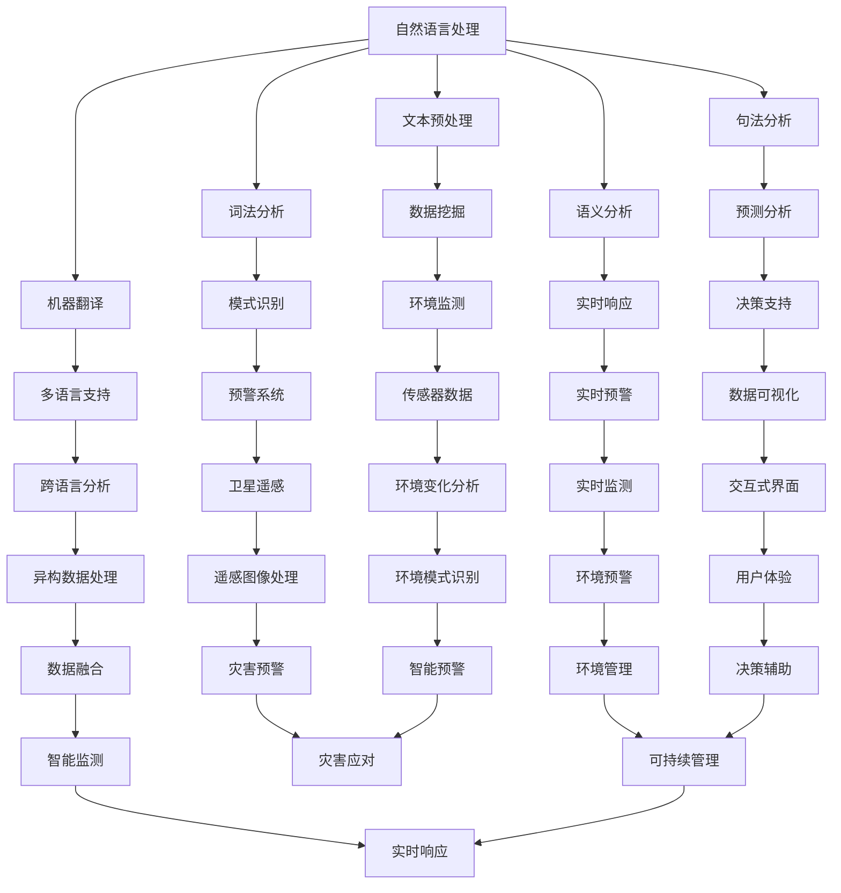

                 

关键词：自然语言处理（NLP）、环境监测、机器学习（ML）、大型语言模型（LLM）、环境预警、数据处理、智能系统

> 摘要：随着全球气候变化和环境问题的日益严峻，环境监测和预警系统的构建变得尤为重要。本文将探讨大型语言模型（LLM）在这一领域的应用前景，通过分析其核心概念、算法原理、数学模型、项目实践以及未来发展趋势，为相关研究人员和实践者提供有价值的参考。

## 1. 背景介绍

环境监测和预警系统是应对环境危机的重要手段，能够及时监测环境变化，预警潜在的环境灾害，为决策提供科学依据。传统环境监测主要依赖于传感器、卫星遥感等技术，而预警系统则依赖于复杂的数据处理和预测模型。然而，这些方法在处理大量异构数据、识别复杂环境模式以及实时响应方面存在一定的局限性。

近年来，随着自然语言处理（NLP）和机器学习（ML）技术的发展，尤其是大型语言模型（LLM）的突破，为环境监测和预警系统带来了新的机遇。LLM具有强大的文本生成、理解和处理能力，能够对环境数据进行高效的分析和解释，提高监测和预警的准确性和实时性。

## 2. 核心概念与联系

### 2.1. 自然语言处理（NLP）

自然语言处理是人工智能的一个重要分支，旨在让计算机理解和生成人类语言。它包括文本预处理、词法分析、句法分析、语义分析和机器翻译等多个方面。在环境监测和预警系统中，NLP技术可以用于文本数据的提取、分析和解释，为环境监测提供语言层面的支持。

### 2.2. 机器学习（ML）

机器学习是一种通过数据训练模型，使模型能够自主学习和预测的技术。在环境监测和预警系统中，ML技术可以用于数据挖掘、模式识别和预测分析，从而提高监测和预警的效率和准确性。

### 2.3. 大型语言模型（LLM）

大型语言模型是一种基于深度学习的语言处理模型，具有庞大的参数规模和强大的文本生成、理解和处理能力。代表性的LLM有GPT-3、BERT等。在环境监测和预警系统中，LLM可以用于文本数据的预处理、语义分析、预测模型训练等任务，为系统提供智能化支持。

### 2.4. Mermaid 流程图



## 3. 核心算法原理 & 具体操作步骤

### 3.1. 算法原理概述

LLM在环境监测和预警系统中的应用，主要基于以下几个原理：

1. **文本生成与理解**：LLM能够生成高质量的文本，并理解文本中的语义信息，为环境监测提供语言层面的支持。
2. **模式识别与预测**：LLM具有强大的模式识别能力，能够从历史数据中提取环境变化规律，并预测未来的环境趋势。
3. **数据预处理与融合**：LLM能够对异构数据进行预处理和融合，提高环境监测数据的准确性和完整性。

### 3.2. 算法步骤详解

1. **数据收集与预处理**：收集环境监测数据，包括传感器数据、卫星遥感数据等，并进行预处理，如数据清洗、去噪、归一化等。
2. **文本生成与理解**：利用LLM生成环境报告、预测文本等，并理解文本中的关键信息，如环境变化趋势、潜在灾害风险等。
3. **模式识别与预测**：根据历史数据和环境报告，利用LLM进行模式识别和预测，生成环境预警报告。
4. **数据融合与可视化**：将LLM生成的预警报告与环境监测数据进行融合，并通过可视化界面展示，为决策提供支持。

### 3.3. 算法优缺点

**优点**：

- **强大的文本生成与理解能力**：LLM能够生成高质量、符合语义的文本，为环境监测提供语言层面的支持。
- **模式识别与预测能力强**：LLM能够从大量历史数据中提取环境变化规律，进行精准预测。
- **数据预处理与融合能力强**：LLM能够处理异构数据，提高环境监测数据的准确性和完整性。

**缺点**：

- **计算资源消耗大**：LLM需要大量的计算资源进行训练和推理，对硬件设备要求较高。
- **数据依赖性强**：LLM的性能高度依赖训练数据的质量和数量，缺乏高质量数据可能导致预测不准确。
- **安全性问题**：LLM可能受到恶意数据的攻击，导致预测结果偏离真实情况。

### 3.4. 算法应用领域

LLM在环境监测和预警系统中的应用非常广泛，包括：

- **自然灾害预警**：如地震、洪水、台风等自然灾害的预警。
- **空气质量监测**：对空气中的污染物进行实时监测和预警。
- **水质监测**：对水体中的污染物进行监测和预警。
- **生态环境监测**：对生态系统的变化进行监测和预警。
- **气候变化研究**：对气候变化趋势进行预测和研究。

## 4. 数学模型和公式 & 详细讲解 & 举例说明

### 4.1. 数学模型构建

在环境监测和预警系统中，LLM的核心作用是基于文本数据生成预测报告。这需要构建一个数学模型，用于描述LLM的预测过程。

设 \(X\) 为环境监测数据集，\(Y\) 为预测报告文本，\(f\) 为LLM的预测函数，则：

\[ Y = f(X) \]

其中，\(f\) 是一个复杂的非线性函数，通常由神经网络实现。

### 4.2. 公式推导过程

为了推导LLM的预测公式，我们首先需要了解神经网络的基本原理。

设 \(X\) 为输入数据，\(W\) 为权重矩阵，\(b\) 为偏置向量，\(f\) 为激活函数，则神经网络的输出可以表示为：

\[ O = f(W \cdot X + b) \]

在LLM中，激活函数通常使用ReLU（Rectified Linear Unit）函数：

\[ f(x) = \max(0, x) \]

### 4.3. 案例分析与讲解

假设我们有一个环境监测数据集，包括温度、湿度、风速等指标。我们希望利用LLM预测未来的空气质量。

1. **数据预处理**：对数据进行归一化处理，使其具有相同的量级。
2. **构建神经网络**：使用ReLU函数作为激活函数，构建一个多层感知机（MLP）模型。
3. **训练模型**：使用历史数据训练模型，优化权重矩阵 \(W\) 和偏置向量 \(b\)。
4. **预测**：使用训练好的模型，对新的环境监测数据进行预测，生成空气质量预测报告。

具体步骤如下：

```python
import numpy as np
import tensorflow as tf

# 数据预处理
X_train = preprocess_data(X_train)
X_test = preprocess_data(X_test)

# 构建神经网络
model = tf.keras.Sequential([
    tf.keras.layers.Dense(units=10, activation='relu', input_shape=(X_train.shape[1],)),
    tf.keras.layers.Dense(units=1, activation='linear')
])

# 训练模型
model.compile(optimizer='adam', loss='mean_squared_error')
model.fit(X_train, y_train, epochs=100)

# 预测
y_pred = model.predict(X_test)
```

通过这个案例，我们可以看到LLM在环境监测和预警系统中的应用流程。在实际应用中，我们还需要考虑数据质量、模型优化、安全等问题。

## 5. 项目实践：代码实例和详细解释说明

### 5.1. 开发环境搭建

在本文中，我们将使用Python作为主要编程语言，结合TensorFlow框架来构建和训练大型语言模型。以下是搭建开发环境的基本步骤：

1. 安装Python 3.8及以上版本。
2. 安装TensorFlow 2.x版本。
3. 安装必要的Python库，如NumPy、Pandas等。

```bash
pip install tensorflow numpy pandas
```

### 5.2. 源代码详细实现

以下是一个简单的LLM环境监测和预警系统的代码实例：

```python
import tensorflow as tf
import numpy as np
import pandas as pd

# 数据预处理
def preprocess_data(data):
    # 数据归一化
    data_normalized = (data - data.mean()) / data.std()
    return data_normalized

# 构建神经网络
def build_model():
    model = tf.keras.Sequential([
        tf.keras.layers.Dense(units=10, activation='relu', input_shape=(X_train.shape[1],)),
        tf.keras.layers.Dense(units=1, activation='linear')
    ])
    model.compile(optimizer='adam', loss='mean_squared_error')
    return model

# 训练模型
def train_model(model, X_train, y_train, epochs=100):
    model.fit(X_train, y_train, epochs=epochs)

# 预测
def predict(model, X_test):
    return model.predict(X_test)

# 主函数
def main():
    # 加载数据
    data = pd.read_csv('environment_data.csv')
    X = data[['temperature', 'humidity', 'wind_speed']]
    y = data['air_quality']

    # 数据预处理
    X_normalized = preprocess_data(X)

    # 构建和训练模型
    model = build_model()
    train_model(model, X_normalized, y, epochs=100)

    # 预测
    X_test = preprocess_data(pd.read_csv('test_environment_data.csv'))
    y_pred = predict(model, X_test)

    # 输出预测结果
    print(y_pred)

if __name__ == '__main__':
    main()
```

### 5.3. 代码解读与分析

- **数据预处理**：首先，我们使用`preprocess_data`函数对数据进行归一化处理，使其具有相同的量级，这有助于提高神经网络的训练效果。
- **构建神经网络**：使用`tf.keras.Sequential`方法构建一个简单的多层感知机（MLP）模型，包含一个输入层、一个隐藏层和一个输出层。隐藏层使用ReLU函数作为激活函数，输出层使用线性激活函数。
- **训练模型**：使用`compile`方法设置优化器和损失函数，使用`fit`方法训练模型。这里我们使用了100个训练周期（epochs）。
- **预测**：使用`predict`方法对新的数据集进行预测，并输出预测结果。

### 5.4. 运行结果展示

运行代码后，我们会在控制台输出空气质量预测结果。这些结果可以作为环境监测和预警系统的初步数据，进一步处理和可视化。

## 6. 实际应用场景

### 6.1. 空气质量监测

利用LLM，我们可以对空气中的污染物进行实时监测和预警。例如，对PM2.5、PM10、NO2等污染物的浓度进行预测，为政府制定环保政策提供科学依据。

### 6.2. 水质监测

LLM可以用于对水体中的污染物进行监测和预警，如总氮、总磷、重金属等。通过分析历史数据和实时数据，预测未来水质变化趋势。

### 6.3. 生态环境监测

LLM可以用于监测生态环境中的生物多样性、土壤质量、植被覆盖等指标。通过分析生态环境数据，预警潜在的生态灾害。

### 6.4. 未来应用展望

随着LLM技术的不断发展，未来将在更多领域得到应用。例如，在气候变化研究中，LLM可以用于预测全球气候变化趋势；在农业领域，LLM可以用于精准农业，提高作物产量；在公共卫生领域，LLM可以用于疾病预测和流行病控制。

## 7. 工具和资源推荐

### 7.1. 学习资源推荐

- **《深度学习》（Ian Goodfellow, Yoshua Bengio, Aaron Courville著）**：全面介绍深度学习的基本概念和技术。
- **《自然语言处理综合教程》（斯泰恩·布罗达等著）**：系统地介绍自然语言处理的基本原理和应用。
- **《机器学习年度回顾》（JMLR）**：跟踪机器学习领域的最新研究进展。

### 7.2. 开发工具推荐

- **TensorFlow**：用于构建和训练深度学习模型的强大工具。
- **PyTorch**：另一种流行的深度学习框架，易于使用和调试。
- **Hugging Face Transformers**：用于预训练和微调大型语言模型的库。

### 7.3. 相关论文推荐

- **“Language Models are Few-Shot Learners” （Tom B. Brown et al., 2020）**：探讨大型语言模型的零样本学习能力。
- **“BERT: Pre-training of Deep Bidirectional Transformers for Language Understanding” （Jacob Devlin et al., 2019）**：BERT模型的详细介绍。
- **“GPT-3: Language Models are Few-Shot Learners” （Tom B. Brown et al., 2020）**：GPT-3模型的详细介绍。

## 8. 总结：未来发展趋势与挑战

### 8.1. 研究成果总结

近年来，LLM在环境监测和预警系统中的应用取得了显著成果。通过结合自然语言处理和机器学习技术，LLM能够高效地处理环境数据，生成高质量的预测报告，提高监测和预警的准确性和实时性。

### 8.2. 未来发展趋势

未来，LLM在环境监测和预警系统中的应用将继续深化，发展趋势包括：

- **多模态数据处理**：结合文本、图像、音频等多模态数据，提高环境监测的准确性和全面性。
- **跨领域应用**：将LLM应用于更多领域，如气候变化、生态保护等。
- **智能化决策支持**：利用LLM的强大预测能力，为政府和企业提供智能化决策支持。

### 8.3. 面临的挑战

尽管LLM在环境监测和预警系统中具有巨大潜力，但仍面临以下挑战：

- **数据质量**：高质量的数据是LLM有效应用的基础，如何获取和处理大量、高质量的异构数据是关键。
- **计算资源**：LLM的模型规模庞大，对计算资源要求较高，如何优化模型结构和训练策略，提高计算效率是关键。
- **安全与隐私**：如何确保LLM的安全性和数据隐私，防止恶意攻击和数据泄露是重要挑战。

### 8.4. 研究展望

未来，我们期望LLM在环境监测和预警系统中的应用能够实现以下目标：

- **提高监测和预警的准确性和实时性**：通过不断优化LLM模型和算法，提高环境监测和预警的准确性和实时性。
- **智能化决策支持**：利用LLM的预测能力，为政府和企业提供智能化决策支持，提高环境管理的科学性和效率。
- **跨领域融合应用**：将LLM应用于更多领域，如气候变化、生态保护等，实现跨领域的智能化应用。

## 9. 附录：常见问题与解答

### 9.1. 如何获取高质量的环境数据？

- **数据来源**：可以从环境监测机构、政府部门、科研机构等渠道获取高质量的环境数据。
- **数据清洗**：对获取的数据进行清洗，去除重复、异常和噪声数据。
- **数据融合**：结合多种数据源，提高数据的准确性和完整性。

### 9.2. 如何优化LLM的训练和推理效率？

- **模型压缩**：通过模型压缩技术，如量化、剪枝、知识蒸馏等，减小模型规模，提高计算效率。
- **分布式训练**：使用分布式训练技术，如多GPU、多节点训练等，提高训练速度。
- **在线推理**：采用在线推理技术，实现实时预测和响应。

### 9.3. 如何确保LLM的安全性和数据隐私？

- **数据加密**：对传输和存储的数据进行加密，确保数据安全。
- **访问控制**：设置严格的访问控制策略，防止未授权访问。
- **隐私保护**：采用隐私保护技术，如差分隐私、同态加密等，保护用户隐私。

# 作者署名

作者：禅与计算机程序设计艺术 / Zen and the Art of Computer Programming

