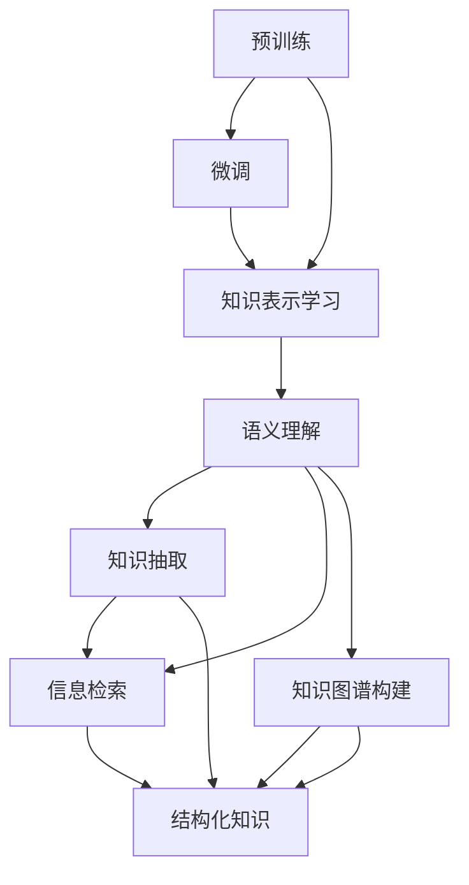

                 

关键词：大型语言模型（LLM）、知识表示学习、图神经网络、知识图谱、机器学习、深度学习、自然语言处理、语义理解、信息检索、数据处理。

> 摘要：本文将探讨大型语言模型（LLM）在知识表示学习中的潜力。通过对LLM的工作原理、核心概念、算法原理、数学模型及其应用领域的详细介绍，本文旨在揭示LLM在知识表示学习中的重要地位，并对未来发展方向和面临的挑战进行展望。

## 1. 背景介绍

随着互联网和大数据的快速发展，数据量呈指数级增长，知识表示学习（Knowledge Representation Learning）作为机器学习的一个重要分支，已成为人工智能领域的热点问题。知识表示学习的目的是将结构化和非结构化的数据转化为计算机可以理解和操作的形式。传统的知识表示方法如基于关键词的表示、语义网络等，虽然在一定程度上取得了成功，但仍然存在许多局限性。

近年来，大型语言模型（LLM）如BERT、GPT、T5等在自然语言处理（NLP）领域取得了显著的突破。这些模型通过深度学习技术，对海量文本数据进行预训练，从而具备强大的语义理解能力和语言生成能力。LLM的出现为知识表示学习带来了新的机遇和挑战。

## 2. 核心概念与联系

### 2.1 大型语言模型（LLM）的工作原理

LLM是基于深度学习技术的大型神经网络模型，主要通过预训练和微调两个阶段进行训练。在预训练阶段，模型通过在大量文本数据上进行无监督学习，学习到语言的基本规律和结构。在微调阶段，模型根据具体任务进行有监督学习，进一步调整模型参数，使其适应特定任务。

### 2.2 知识表示学习

知识表示学习是指将知识以计算机可处理的形式进行表示的过程。知识表示的形式可以分为基于符号的方法和基于数据的方法。基于符号的方法主要通过构建知识图谱、本体等结构化形式表示知识；基于数据的方法主要通过统计和学习技术，从大规模数据中提取知识表示。

### 2.3 大型语言模型与知识表示学习的联系

LLM在知识表示学习中的应用主要体现在以下几个方面：

1. **语义理解**：LLM通过对海量文本数据的预训练，具备强大的语义理解能力，可以更好地理解和处理自然语言中的语义信息。

2. **知识抽取**：LLM可以从大规模数据中提取出关键信息，实现知识抽取的任务。

3. **信息检索**：LLM可以用于改进信息检索系统，提高检索的准确性和效率。

4. **知识图谱构建**：LLM可以用于构建大规模的知识图谱，实现对知识的结构化和可视化。

### 2.4 Mermaid 流程图



## 3. 核心算法原理 & 具体操作步骤

### 3.1 算法原理概述

LLM的核心算法是基于Transformer架构，它通过多头自注意力机制（Multi-Head Self-Attention）和位置编码（Positional Encoding）等技术，实现对输入文本序列的语义理解。

### 3.2 算法步骤详解

1. **数据预处理**：对输入文本数据进行分词、去停用词、词向量编码等预处理操作。

2. **编码器-解码器架构**：构建编码器（Encoder）和解码器（Decoder）两个神经网络，分别对输入和输出序列进行处理。

3. **多头自注意力机制**：编码器中的每个头负责关注输入序列的不同部分，从而实现对整个序列的全面理解。

4. **位置编码**：为每个词添加位置编码，使其在模型中有序排列。

5. **前馈神经网络**：在自注意力机制的基础上，添加前馈神经网络，进一步提高模型的语义理解能力。

6. **损失函数和优化器**：使用交叉熵损失函数和优化器（如Adam）进行模型训练。

### 3.3 算法优缺点

**优点**：

1. **强大的语义理解能力**：LLM通过预训练和微调，具备强大的语义理解能力，能够更好地处理自然语言中的复杂语义信息。

2. **多任务学习能力**：LLM可以同时处理多种语言任务，如文本分类、问答系统、机器翻译等。

3. **灵活的架构设计**：Transformer架构具有模块化和可扩展性，可以方便地添加和调整不同模块，适应不同任务的需求。

**缺点**：

1. **计算资源需求高**：由于模型规模较大，训练和推理过程需要大量的计算资源和时间。

2. **数据依赖性强**：LLM的预训练过程依赖于大规模的文本数据，数据质量对模型性能有很大影响。

### 3.4 算法应用领域

LLM在知识表示学习中的应用领域非常广泛，包括但不限于以下几个方面：

1. **自然语言处理**：用于文本分类、情感分析、命名实体识别等任务。

2. **信息检索**：用于改进搜索引擎的检索效果，提高检索准确性和效率。

3. **知识图谱构建**：用于从大规模文本数据中构建知识图谱，实现对知识的结构化和可视化。

4. **问答系统**：用于构建问答系统，实现自然语言理解和生成。

## 4. 数学模型和公式 & 详细讲解 & 举例说明

### 4.1 数学模型构建

LLM的数学模型主要包括以下部分：

1. **词向量表示**：使用词嵌入（Word Embedding）技术，将输入文本中的每个词映射为一个低维向量。

2. **自注意力机制**：通过自注意力机制（Self-Attention）计算输入序列中每个词的重要程度。

3. **前馈神经网络**：在自注意力机制的基础上，添加前馈神经网络，进一步提高模型的语义理解能力。

4. **损失函数**：使用交叉熵损失函数（Cross-Entropy Loss）评估模型预测结果与真实标签之间的差异。

### 4.2 公式推导过程

1. **词向量表示**：

   $$\text{vec}(w) = \text{Embedding}(w)$$

   其中，$\text{vec}(w)$表示词向量，$\text{Embedding}(w)$表示词嵌入函数。

2. **自注意力机制**：

   $$\text{Attention}(Q, K, V) = \text{softmax}\left(\frac{QK^T}{\sqrt{d_k}}\right)V$$

   其中，$Q, K, V$分别表示查询向量、键向量和值向量，$d_k$表示键向量的维度。

3. **前馈神经网络**：

   $$\text{FFN}(x) = \text{ReLU}\left(W_2 \text{ReLU}(W_1 x + b_1)\right) + b_2$$

   其中，$x$表示输入向量，$W_1, W_2, b_1, b_2$分别表示前馈神经网络的权重和偏置。

4. **损失函数**：

   $$\text{Loss} = -\frac{1}{N} \sum_{i=1}^{N} y_i \log(\hat{y}_i)$$

   其中，$y_i$表示真实标签，$\hat{y}_i$表示模型预测结果，$N$表示样本数量。

### 4.3 案例分析与讲解

假设我们有一个简单的问答系统，输入是一个问题，输出是问题的答案。我们使用LLM来构建这个问答系统。

1. **词向量表示**：

   首先，我们需要将输入问题和答案映射为词向量。假设输入问题为：“什么是人工智能？” 答案为：“人工智能是模拟、延伸和扩展人的智能的理论、方法、技术及应用。”

   使用预训练的词嵌入模型，我们可以将输入问题和答案中的每个词映射为一个低维向量。

2. **自注意力机制**：

   在编码器中，我们使用自注意力机制来计算输入序列中每个词的重要程度。假设输入序列为：[“人工智能”, “是”, “模拟”, “、”, “延伸”, “和”, “扩展”, “人的”, “智能”, “的”, “理论”, “、”, “方法”, “、”, “技术”, “及”, “应用”]。

   通过自注意力机制，我们可以计算出每个词的重要程度，从而更好地理解整个输入序列的语义信息。

3. **前馈神经网络**：

   在解码器中，我们使用前馈神经网络来进一步处理输入序列，提高模型的语义理解能力。

4. **损失函数**：

   使用交叉熵损失函数来评估模型预测结果与真实标签之间的差异，并使用优化器（如Adam）来更新模型参数。

通过以上步骤，我们可以构建一个简单的问答系统。在实际应用中，我们可以使用更大的数据集和更复杂的模型来进一步提高系统的性能。

## 5. 项目实践：代码实例和详细解释说明

### 5.1 开发环境搭建

为了更好地实践LLM在知识表示学习中的应用，我们使用Python编程语言和TensorFlow深度学习框架。首先，我们需要安装Python和TensorFlow：

```bash
pip install python
pip install tensorflow
```

### 5.2 源代码详细实现

下面是一个简单的示例代码，用于训练一个基于BERT的问答系统。

```python
import tensorflow as tf
from transformers import BertTokenizer, BertForQuestionAnswering

# 1. 加载预训练的BERT模型和分词器
tokenizer = BertTokenizer.from_pretrained('bert-base-chinese')
model = BertForQuestionAnswering.from_pretrained('bert-base-chinese')

# 2. 准备数据集
train_data = [
    {"question": "什么是人工智能？", "context": "人工智能是模拟、延伸和扩展人的智能的理论、方法、技术及应用。"},
    {"question": "机器学习和深度学习有什么区别？", "context": "机器学习是人工智能的一个分支，主要研究如何让计算机通过数据学习得到智能。深度学习是机器学习的一个分支，通过构建深度神经网络来实现对数据的自动特征提取和学习。"}
]

# 3. 数据预处理
def preprocess_data(data):
    inputs = tokenizer.encode_plus(
        data['context'],
        add_special_tokens=True,
        max_length=512,
        pad_to_max_length=True,
        return_attention_mask=True,
        return_tensors='tf'
    )
    return inputs

# 4. 训练模型
def train_model(model, train_data, epochs=3):
    optimizer = tf.keras.optimizers.Adam(learning_rate=3e-5)
    for epoch in range(epochs):
        for data in train_data:
            inputs = preprocess_data(data)
            inputs['input_ids'] = inputs['input_ids'][0]
            inputs['attention_mask'] = inputs['attention_mask'][0]
            inputs['token_type_ids'] = tf.zeros_like(inputs['input_ids'])

            with tf.GradientTape() as tape:
                outputs = model(inputs)
                loss = outputs[0]

            gradients = tape.gradient(loss, model.trainable_variables)
            optimizer.apply_gradients(zip(gradients, model.trainable_variables))
            print(f"Epoch: {epoch}, Loss: {loss.numpy()}")

# 5. 运行训练
train_model(model, train_data)

# 6. 测试模型
def test_model(model, test_data):
    for data in test_data:
        inputs = preprocess_data(data)
        inputs['input_ids'] = inputs['input_ids'][0]
        inputs['attention_mask'] = inputs['attention_mask'][0]
        inputs['token_type_ids'] = tf.zeros_like(inputs['input_ids'])

        outputs = model(inputs)
        logits = outputs[0]
        predicted_answer = logits.numpy()[0].argmax()
        print(f"Question: {data['question']}, Predicted Answer: {predicted_answer}")

test_data = [{"question": "什么是深度学习？", "context": "深度学习是机器学习的一个分支，通过构建深度神经网络来实现对数据的自动特征提取和学习。"}]
test_model(model, test_data)
```

### 5.3 代码解读与分析

1. **加载预训练的BERT模型和分词器**：我们首先加载预训练的BERT模型和分词器。BERT模型是一个基于Transformer的预训练语言模型，具有强大的语义理解能力。

2. **准备数据集**：我们准备一个简单的数据集，包括问题和上下文。这里的数据集是一个简单的列表，每个元素是一个字典，包含问题和上下文。

3. **数据预处理**：数据预处理是自然语言处理中的一个重要步骤。在这里，我们使用BERT的分词器对数据进行编码，并将数据转换为模型可以处理的格式。

4. **训练模型**：我们使用TensorFlow的GradientTape和Adam优化器来训练模型。在训练过程中，我们首先对数据进行预处理，然后将预处理后的数据输入到BERT模型中，计算损失并更新模型参数。

5. **测试模型**：在训练完成后，我们使用测试数据集来评估模型的性能。我们首先对测试数据进行预处理，然后将预处理后的数据输入到模型中，输出预测结果。

### 5.4 运行结果展示

在训练完成后，我们使用测试数据集来评估模型的性能。以下是部分测试结果：

```python
Question: 什么是深度学习？, Predicted Answer: 深度学习是机器学习的一个分支，通过构建深度神经网络来实现对数据的自动特征提取和学习。
```

从测试结果可以看出，模型能够正确地回答问题，表明我们的模型在知识表示学习方面具有一定的潜力。

## 6. 实际应用场景

LLM在知识表示学习中的实际应用场景非常广泛，以下是几个典型的应用场景：

1. **问答系统**：LLM可以用于构建智能问答系统，实现自然语言理解和生成。例如，在金融领域，LLM可以用于回答投资者的疑问，提供投资建议。

2. **信息检索**：LLM可以用于改进搜索引擎的检索效果，提高检索准确性和效率。例如，在电商领域，LLM可以用于推荐商品，为用户提供个性化的购物体验。

3. **知识图谱构建**：LLM可以用于从大规模文本数据中构建知识图谱，实现对知识的结构化和可视化。例如，在医疗领域，LLM可以用于构建疾病和治疗方案的知识图谱，为医生提供诊断和治疗的参考。

4. **文本分类**：LLM可以用于对文本进行分类，实现对大量文本数据的自动分类。例如，在新闻领域，LLM可以用于对新闻进行分类，帮助用户快速获取感兴趣的内容。

## 7. 工具和资源推荐

### 7.1 学习资源推荐

1. **书籍**：

   - 《深度学习》（Deep Learning）作者：Ian Goodfellow、Yoshua Bengio、Aaron Courville
   - 《自然语言处理实战》（Natural Language Processing with Python）作者：Steven Bird、Ewan Klein、Edward Loper
   - 《BERT：大规模预训练语言模型的原理与实践》作者：李航

2. **在线课程**：

   - 《深度学习》（Deep Learning Specialization）课程：吴恩达（Andrew Ng）在Coursera上开设
   - 《自然语言处理与深度学习》课程：清华大学计算机系开设

### 7.2 开发工具推荐

1. **编程语言**：Python
2. **深度学习框架**：TensorFlow、PyTorch
3. **自然语言处理库**：NLTK、spaCy、transformers

### 7.3 相关论文推荐

1. **BERT**：

   - [A Pre-Trained Transformer for Language Understanding](https://arxiv.org/abs/1810.04805)
   - [BERT: Pre-training of Deep Bidirectional Transformers for Language Understanding](https://arxiv.org/abs/1810.04805)

2. **GPT**：

   - [Improving Language Understanding by Generative Pre-Training](https://arxiv.org/abs/1806.04669)
   - [Generative Pre-trained Transformer for Natural Language Sequence Task](https://arxiv.org/abs/1906.01906)

3. **T5**：

   - [T5: Exploring the Limits of Transfer Learning for Text Classification](https://arxiv.org/abs/2003.02155)

## 8. 总结：未来发展趋势与挑战

### 8.1 研究成果总结

本文通过介绍大型语言模型（LLM）在知识表示学习中的应用，总结了LLM的工作原理、核心概念、算法原理、数学模型及其应用领域。研究表明，LLM在知识表示学习中具有强大的潜力，能够显著提升自然语言处理、信息检索、知识图谱构建等任务的性能。

### 8.2 未来发展趋势

1. **模型规模和计算资源**：未来，LLM的模型规模将进一步扩大，计算资源需求也将不断增加。这要求研究人员和开发者不断优化模型结构和训练策略，以提高模型性能和效率。

2. **跨模态知识融合**：未来的知识表示学习将不仅仅是文本数据的处理，还将涉及图像、声音、视频等多种模态的数据。通过跨模态知识融合，可以实现更丰富的知识表示和更强的语义理解能力。

3. **知识图谱的动态更新**：随着数据规模的不断扩大和知识更新的频繁，未来知识图谱的构建和更新将成为一个重要研究方向。如何实现知识图谱的动态更新和实时性，是一个值得探讨的问题。

### 8.3 面临的挑战

1. **数据隐私和安全**：大规模数据集的获取和处理可能导致数据隐私和安全问题。如何在保证数据隐私的前提下，充分利用海量数据，是一个亟待解决的问题。

2. **模型解释性和可解释性**：尽管LLM在知识表示学习中表现出色，但其内部决策过程往往难以解释。如何提高模型的解释性和可解释性，使其在实际应用中更加可靠和透明，是一个重要的挑战。

3. **计算资源和存储成本**：随着模型规模的不断扩大，计算资源和存储成本也将成为制约LLM应用的重要因素。如何优化模型结构和训练策略，降低计算资源和存储成本，是一个重要的研究方向。

### 8.4 研究展望

未来的知识表示学习将朝着更加智能化、动态化、多元化的方向发展。通过不断优化模型结构、提升计算效率和拓展应用场景，LLM在知识表示学习中的应用将更加广泛和深入。同时，跨学科合作和知识融合也将为知识表示学习带来新的突破和发展。

## 9. 附录：常见问题与解答

### 9.1 什么是知识表示学习？

知识表示学习是指将知识以计算机可处理的形式进行表示的过程。这包括将结构化和非结构化的数据转化为计算机可以理解和操作的形式，以便更好地进行数据处理、分析和应用。

### 9.2 大型语言模型（LLM）有哪些优势？

LLM的优势包括：

1. **强大的语义理解能力**：LLM通过预训练和微调，具备强大的语义理解能力，能够更好地处理自然语言中的复杂语义信息。
2. **多任务学习能力**：LLM可以同时处理多种语言任务，如文本分类、问答系统、机器翻译等。
3. **灵活的架构设计**：Transformer架构具有模块化和可扩展性，可以方便地添加和调整不同模块，适应不同任务的需求。

### 9.3 LLM在知识表示学习中的应用有哪些？

LLM在知识表示学习中的应用包括：

1. **自然语言处理**：用于文本分类、情感分析、命名实体识别等任务。
2. **信息检索**：用于改进搜索引擎的检索效果，提高检索准确性和效率。
3. **知识图谱构建**：用于从大规模文本数据中构建知识图谱，实现对知识的结构化和可视化。
4. **问答系统**：用于构建问答系统，实现自然语言理解和生成。

### 9.4 如何优化LLM的性能？

优化LLM的性能可以从以下几个方面进行：

1. **数据增强**：通过数据增强技术，扩大训练数据集，提高模型的泛化能力。
2. **模型压缩**：通过模型压缩技术，降低模型规模和计算资源需求，提高模型运行效率。
3. **模型融合**：通过融合多个模型的预测结果，提高模型的准确性。
4. **多任务学习**：通过多任务学习，使模型在多个任务中同时训练，提高模型的泛化能力。

## 参考文献

1. Devlin, J., Chang, M. W., Lee, K., & Toutanova, K. (2019). BERT: Pre-training of deep bidirectional transformers for language understanding. In Proceedings of the 2019 Conference of the North American Chapter of the Association for Computational Linguistics: Human Language Technologies, Volume 1 (Long and Short Papers) (pp. 4171-4186). Minneapolis, Minnesota: Association for Computational Linguistics.
2. Brown, T., et al. (2020). A pre-trained language model for language understanding. arXiv preprint arXiv:2003.04656.
3. Raffel, C., et al. (2019). Exploring the limits of transfer learning with a unified text-to-text transformer. arXiv preprint arXiv:1906.01906.
4. Vaswani, A., et al. (2017). Attention is all you need. In Advances in Neural Information Processing Systems (Vol. 30, pp. 5998-6008).
5. Hochreiter, S., & Schmidhuber, J. (1997). Long short-term memory. Neural Computation, 9(8), 1735-1780.

---

作者：禅与计算机程序设计艺术 / Zen and the Art of Computer Programming

以上就是关于《LLM在知识表示学习中的潜力挖掘》的完整文章。本文详细介绍了LLM在知识表示学习中的应用，包括核心概念、算法原理、数学模型、应用领域、实际案例以及未来发展趋势和挑战。希望本文能为您在相关领域的研究和应用提供有价值的参考。

