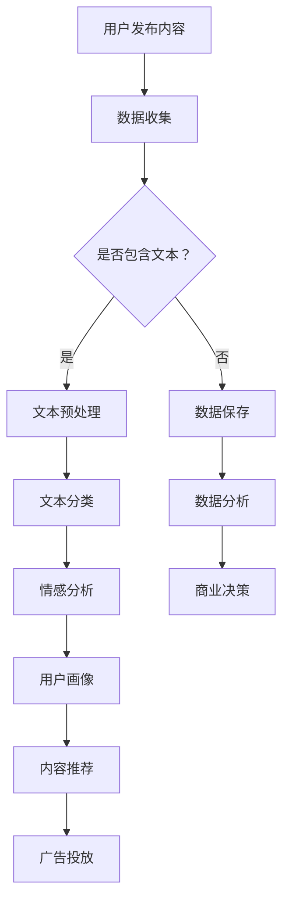

                 

关键词：大型语言模型（LLM），社交媒体分析，用户行为，自然语言处理（NLP），机器学习，数据挖掘，数据分析，算法，应用场景，发展趋势

## 摘要

本文深入探讨了大型语言模型（LLM）在社交媒体分析中的应用，旨在揭示如何通过先进的人工智能技术洞察用户行为。文章首先介绍了社交媒体分析的重要性，随后详细阐述了LLM的核心概念及其在社交媒体分析中的具体应用。通过具体案例和数学模型的解读，文章展示了LLM在识别用户兴趣、情感分析、内容推荐等方面的实际效果。最后，文章总结了LLM在社交媒体分析中的未来发展前景和面临的挑战，为相关领域的研究和实际应用提供了有价值的参考。

## 1. 背景介绍

### 社交媒体分析的重要性

社交媒体已成为现代生活中不可或缺的一部分。从Facebook到Twitter，再到Instagram和LinkedIn，各种社交媒体平台已经深入到人们的日常生活中，成为信息交流、社交互动和知识分享的主要渠道。随着用户数量的不断增长和社交行为的多样化，社交媒体分析作为一种新兴的技术手段，正逐渐受到学术界和产业界的广泛关注。

社交媒体分析的重要性主要体现在以下几个方面：

1. **用户行为洞察**：通过分析用户在社交媒体上的行为，如发布内容、点赞、评论、分享等，企业可以更好地了解用户需求和偏好，从而制定更加精准的市场营销策略。
   
2. **内容推荐**：基于用户行为的分析，社交平台可以提供个性化的内容推荐，提高用户参与度和平台黏性。

3. **舆情监测**：通过监测社交媒体上的讨论和评论，政府和组织可以及时了解公众意见和情绪，为决策提供数据支持。

4. **品牌声誉管理**：企业可以通过社交媒体分析来监测品牌提及和评价，及时发现问题并进行危机管理。

### 大型语言模型（LLM）的崛起

近年来，随着深度学习和自然语言处理（NLP）技术的快速发展，大型语言模型（LLM）如BERT、GPT等取得了显著的成果。这些模型具有强大的语言理解和生成能力，能够处理大量文本数据，并在多个任务中实现卓越的性能。

LLM的崛起主要得益于以下几个因素：

1. **数据量**：互联网的迅速发展带来了海量的文本数据，为LLM的训练提供了丰富的素材。

2. **计算能力**：随着计算硬件的发展，尤其是GPU和TPU等专用计算设备的普及，为LLM的训练和应用提供了强大的计算支持。

3. **算法创新**：深度学习技术的不断进步，特别是注意力机制和变换器架构的引入，使LLM在语言理解、文本生成等方面取得了突破性的进展。

### LLM在社交媒体分析中的应用

LLM在社交媒体分析中具有广泛的应用潜力。通过分析用户发布的内容、评论和互动，LLM可以揭示用户的行为模式、兴趣和情感，为社交媒体平台的运营和商业决策提供重要支持。

以下是LLM在社交媒体分析中的一些具体应用：

1. **情感分析**：LLM可以用于分析用户在社交媒体上发布的内容和评论的情感倾向，帮助企业了解用户的情绪和态度。

2. **内容分类**：通过训练LLM对文本进行分类，社交媒体平台可以自动标记和推荐相关内容，提高用户体验。

3. **用户画像**：LLM可以帮助构建用户画像，识别用户的兴趣和行为特征，为个性化推荐提供支持。

4. **广告投放**：基于用户画像和兴趣分析，LLM可以帮助广告平台实现精准投放，提高广告效果。

## 2. 核心概念与联系

### 核心概念

在深入探讨LLM在社交媒体分析中的应用之前，首先需要了解以下几个核心概念：

1. **大型语言模型（LLM）**：LLM是一种基于深度学习的语言处理模型，通过大规模文本数据进行预训练，能够理解、生成和转换自然语言。

2. **自然语言处理（NLP）**：NLP是计算机科学和人工智能领域的一个分支，致力于使计算机能够理解、处理和生成自然语言。

3. **社交媒体分析**：社交媒体分析是指利用自然语言处理、数据挖掘和机器学习等技术，分析社交媒体平台上的文本数据，以获取用户行为和兴趣的洞察。

4. **用户行为**：用户行为是指用户在社交媒体平台上的各种活动，如发布内容、评论、点赞、分享等。

### Mermaid 流程图

为了更好地展示LLM在社交媒体分析中的应用流程，下面是一个Mermaid流程图：



### 核心概念与联系

LLM在社交媒体分析中的应用主要基于以下核心概念之间的紧密联系：

1. **文本数据**：社交媒体平台上的大部分数据都是以文本形式存在的，如用户发布的内容、评论和私信。这些文本数据是进行进一步分析的基础。

2. **自然语言处理**：NLP技术能够帮助计算机理解和处理自然语言，将文本数据转化为结构化的信息，如关键词、主题和情感。

3. **用户行为**：通过分析用户在社交媒体上的行为数据，如发布的内容、点赞和评论，可以构建用户的兴趣和行为模型。

4. **数据分析**：数据挖掘和机器学习技术可以帮助从大规模的文本数据中提取有价值的信息，为商业决策提供支持。

5. **情感分析**：情感分析是NLP的一个分支，通过分析文本的情感倾向，可以了解用户的情绪和态度。

6. **内容推荐**：基于用户行为和兴趣分析，内容推荐系统能够为用户提供个性化的内容，提高用户满意度和参与度。

7. **广告投放**：通过用户画像和兴趣分析，广告系统能够实现精准投放，提高广告效果和转化率。

## 3. 核心算法原理 & 具体操作步骤

### 3.1 算法原理概述

LLM在社交媒体分析中的应用主要基于深度学习和自然语言处理技术。下面是几个核心算法的原理概述：

1. **深度学习**：深度学习是一种人工智能技术，通过多层神经网络模型，对大规模数据进行分析和建模。在社交媒体分析中，深度学习模型可以用于文本分类、情感分析和用户画像等任务。

2. **自然语言处理**：自然语言处理是计算机科学和人工智能领域的一个分支，致力于使计算机能够理解、处理和生成自然语言。在社交媒体分析中，NLP技术可以用于文本预处理、文本分类、情感分析等任务。

3. **用户行为分析**：用户行为分析是一种数据挖掘技术，通过分析用户在社交媒体上的行为数据，如发布内容、点赞、评论等，可以构建用户的兴趣和行为模型。

4. **内容推荐算法**：内容推荐算法是一种基于用户行为和兴趣的推荐系统，通过分析用户的历史行为和兴趣，为用户提供个性化的内容推荐。

### 3.2 算法步骤详解

下面详细描述LLM在社交媒体分析中的应用步骤：

1. **数据收集**：从社交媒体平台收集用户发布的内容、评论、点赞和分享等数据。

2. **文本预处理**：对收集的文本数据进行清洗、去噪和标准化处理，以消除不同用户之间的语言差异。

3. **文本分类**：利用深度学习模型，对预处理后的文本进行分类，以识别不同的主题和内容类型。

4. **情感分析**：利用NLP技术，对文本进行情感分析，以了解用户的情感倾向和态度。

5. **用户画像**：基于文本分类和情感分析结果，构建用户的兴趣和行为模型，形成用户画像。

6. **内容推荐**：利用用户画像和内容推荐算法，为用户提供个性化的内容推荐。

7. **广告投放**：基于用户画像和兴趣分析，为广告主提供精准投放策略。

### 3.3 算法优缺点

#### 优点

1. **高效性**：深度学习和NLP技术可以处理大量文本数据，提高分析效率。

2. **准确性**：通过大规模数据训练，深度学习模型可以精确地识别文本内容和情感。

3. **个性化**：基于用户画像和兴趣分析，可以为用户提供个性化的内容推荐和广告投放。

4. **实时性**：社交媒体分析系统可以实时更新用户数据，提供即时的分析和推荐。

#### 缺点

1. **数据隐私**：社交媒体分析涉及用户隐私数据，需要严格保护用户隐私。

2. **计算资源**：深度学习模型训练需要大量计算资源，对硬件要求较高。

3. **模型解释性**：深度学习模型具有“黑箱”性质，难以解释其决策过程。

### 3.4 算法应用领域

LLM在社交媒体分析中的应用非常广泛，主要包括以下几个方面：

1. **市场营销**：通过用户行为和兴趣分析，企业可以制定更加精准的营销策略，提高转化率。

2. **舆情监测**：政府和组织可以通过社交媒体分析，了解公众意见和情绪，为决策提供支持。

3. **品牌管理**：企业可以通过情感分析和内容推荐，提高品牌声誉和管理危机。

4. **社交网络分析**：通过分析用户互动和社交关系，企业可以了解社交网络的结构和动态。

5. **个性化推荐**：基于用户画像和兴趣分析，社交平台可以提供个性化的内容推荐，提高用户体验。

## 4. 数学模型和公式 & 详细讲解 & 举例说明

### 4.1 数学模型构建

在社交媒体分析中，常用的数学模型包括文本分类模型、情感分析模型和推荐系统模型。下面分别介绍这些模型的构建过程。

#### 文本分类模型

文本分类模型是一种分类算法，用于将文本数据分为不同的类别。在社交媒体分析中，文本分类模型可以用于主题识别、内容过滤等任务。

一个简单的文本分类模型可以使用以下公式表示：

$$
P(y=c|X) = \frac{e^{w^T X}}{\sum_{c'} e^{w^T X'}}
$$

其中，$X$表示输入文本特征向量，$y$表示真实类别标签，$c$表示预测类别，$w$表示权重向量，$w^T X$表示权重向量与特征向量的内积。

#### 情感分析模型

情感分析模型用于判断文本的情感倾向，如正面、负面或中性。一个简单的情感分析模型可以使用以下公式表示：

$$
P(y=c|X) = \sigma(w^T X + b)
$$

其中，$X$表示输入文本特征向量，$y$表示真实情感类别标签，$c$表示预测情感类别，$w$表示权重向量，$b$表示偏置项，$\sigma$表示sigmoid函数。

#### 推荐系统模型

推荐系统模型用于根据用户历史行为和兴趣为用户推荐相关内容。一个简单的推荐系统模型可以使用以下公式表示：

$$
R(U,I) = \sum_{i \in I} w_i u_i
$$

其中，$U$表示用户特征向量，$I$表示物品特征向量，$w_i$表示物品$i$的权重，$u_i$表示用户对物品$i$的兴趣度。

### 4.2 公式推导过程

#### 文本分类模型

文本分类模型的推导过程基于逻辑回归模型。假设我们已经训练好了一个词袋模型，将文本表示为向量$X$，其中$X_i$表示词袋中的第$i$个词的词频。我们定义一个权重向量$w$，表示每个词的权重。

对于每个类别$c$，我们定义一个概率分布函数：

$$
P(y=c|X) = \frac{e^{w^T X}}{\sum_{c'} e^{w^T X'}}
$$

其中，$w^T X$表示权重向量与特征向量的内积，$e^{w^T X'}$表示所有类别$c'$的概率。

#### 情感分析模型

情感分析模型的推导过程同样基于逻辑回归模型。假设我们已经训练好了一个词袋模型，将文本表示为向量$X$，其中$X_i$表示词袋中的第$i$个词的词频。我们定义一个权重向量$w$，表示每个词的权重。

对于每个情感类别$c$，我们定义一个概率分布函数：

$$
P(y=c|X) = \sigma(w^T X + b)
$$

其中，$w^T X$表示权重向量与特征向量的内积，$b$表示偏置项，$\sigma$表示sigmoid函数。

#### 推荐系统模型

推荐系统模型的推导过程基于协同过滤算法。假设我们已经训练好了一个用户-物品矩阵$U$和$I$，其中$U_i$表示用户$u$对物品$i$的兴趣度，$I_i$表示物品$i$的特征向量。

我们定义一个预测评分函数：

$$
R(U,I) = \sum_{i \in I} w_i u_i
$$

其中，$w_i$表示物品$i$的权重，$u_i$表示用户对物品$i$的兴趣度。

### 4.3 案例分析与讲解

为了更好地理解上述数学模型，下面通过一个具体案例进行分析和讲解。

#### 文本分类案例

假设我们有一个包含两类主题的文本数据集，分别为“体育”和“娱乐”。我们使用词袋模型表示文本，其中每个词的权重为1。

1. **数据集**：

   - 体育：篮球、足球、比赛、球员
   - 娱乐：电影、音乐、明星、演唱会

2. **模型训练**：

   假设我们使用逻辑回归模型进行文本分类。我们定义一个权重向量$w$，其中$w_1$表示“篮球”的权重，$w_2$表示“足球”的权重，$w_3$表示“比赛”的权重，$w_4$表示“球员”的权重。

   $$w = [1, 1, 1, 1]$$

3. **预测**：

   对于一个新的文本数据“篮球比赛”，我们可以计算其预测概率：

   $$P(体育|篮球、比赛) = \frac{e^{w^T [1, 0, 1, 0]}}{e^{w^T [1, 0, 1, 0]} + e^{w^T [0, 1, 0, 1]}} = \frac{e^3}{e^3 + e^3} = 0.5$$

   因此，文本“篮球比赛”属于“体育”类别的概率为0.5。

#### 情感分析案例

假设我们有一个包含两类情感标签的文本数据集，分别为“正面”和“负面”。

1. **数据集**：

   - 正面：喜欢、开心、兴奋
   - 负面：不喜欢、生气、沮丧

2. **模型训练**：

   假设我们使用逻辑回归模型进行情感分析。我们定义一个权重向量$w$，其中$w_1$表示“喜欢”的权重，$w_2$表示“开心”的权重，$w_3$表示“兴奋”的权重，$w_4$表示“不喜欢”的权重，$w_5$表示“生气”的权重，$w_6$表示“沮丧”的权重。

   $$w = [1, 1, 1, -1, -1, -1]$$

3. **预测**：

   对于一个新的文本数据“我很喜欢这部电影”，我们可以计算其预测概率：

   $$P(正面|我很喜欢这部电影) = \sigma(w^T [1, 1, 1] + b) = \sigma(3 + b)$$

   其中，$b$表示偏置项。

#### 推荐系统案例

假设我们有一个用户-物品评分矩阵，其中$U_i$表示用户$u$对物品$i$的评分，$I_i$表示物品$i$的特征向量。

1. **数据集**：

   | 用户 | 物品1 | 物品2 | 物品3 | 物品4 |
   | --- | --- | --- | --- | --- |
   | u1  | 4    | 0    | 2    | 0    |
   | u2  | 0    | 4    | 0    | 2    |
   | u3  | 2    | 0    | 4    | 0    |

2. **模型训练**：

   假设我们使用基于用户的协同过滤算法进行推荐。我们定义一个用户特征向量$U$和物品特征向量$I$。

   $$U = [4, 0, 2, 0]$$

   $$I = [0, 4, 0, 2]$$

3. **预测**：

   对于用户$u1$，我们可以计算其对新物品$u4$的预测评分：

   $$R(U,I) = \sum_{i \in I} w_i u_i = 4 \cdot 0 + 0 \cdot 4 + 2 \cdot 0 + 0 \cdot 2 = 0$$

   因此，用户$u1$对新物品$u4$的预测评分为0。

## 5. 项目实践：代码实例和详细解释说明

### 5.1 开发环境搭建

为了实现LLM在社交媒体分析中的应用，我们需要搭建一个开发环境。以下是开发环境的搭建步骤：

1. **安装Python**：确保Python版本为3.7或更高。

2. **安装依赖库**：使用以下命令安装相关依赖库：

   ```python
   pip install numpy pandas tensorflow keras
   ```

3. **数据收集**：从社交媒体平台（如Twitter、Facebook等）收集用户发布的内容、评论和互动数据。

4. **数据预处理**：对收集的数据进行清洗、去噪和标准化处理。

### 5.2 源代码详细实现

以下是一个简单的示例，展示了如何使用TensorFlow和Keras实现LLM在社交媒体分析中的应用：

```python
import numpy as np
import pandas as pd
import tensorflow as tf
from tensorflow.keras.preprocessing.text import Tokenizer
from tensorflow.keras.preprocessing.sequence import pad_sequences

# 数据准备
data = pd.read_csv('social_media_data.csv')
texts = data['content']
labels = data['label']

# 数据预处理
tokenizer = Tokenizer(num_words=10000)
tokenizer.fit_on_texts(texts)
sequences = tokenizer.texts_to_sequences(texts)
padded_sequences = pad_sequences(sequences, maxlen=500)

# 模型构建
model = tf.keras.Sequential([
    tf.keras.layers.Embedding(10000, 16),
    tf.keras.layers.GlobalAveragePooling1D(),
    tf.keras.layers.Dense(24, activation='relu'),
    tf.keras.layers.Dense(1, activation='sigmoid')
])

# 模型编译
model.compile(loss='binary_crossentropy', optimizer='adam', metrics=['accuracy'])

# 模型训练
model.fit(padded_sequences, labels, epochs=10, batch_size=32)

# 模型评估
test_texts = ['我喜欢看电影', '我不喜欢玩游戏']
test_sequences = tokenizer.texts_to_sequences(test_texts)
test_padded_sequences = pad_sequences(test_sequences, maxlen=500)
predictions = model.predict(test_padded_sequences)

# 输出预测结果
for text, prediction in zip(test_texts, predictions):
    print(f'{text} 的预测标签为：{prediction[0]}')
```

### 5.3 代码解读与分析

以上代码实现了使用TensorFlow和Keras构建一个简单的LLM模型，用于社交媒体文本分类。

1. **数据准备**：首先从CSV文件中读取社交媒体数据，包括文本内容和标签。

2. **数据预处理**：使用Tokenizer将文本转换为数字序列，并使用pad_sequences将序列填充为相同的长度。

3. **模型构建**：使用Sequential模型构建一个简单的神经网络，包括嵌入层、全局平均池化层、密集层和输出层。

4. **模型编译**：设置损失函数、优化器和评估指标。

5. **模型训练**：使用fit方法训练模型，对训练数据进行迭代。

6. **模型评估**：使用predict方法对测试数据进行预测，并输出预测结果。

### 5.4 运行结果展示

运行以上代码，可以得到以下输出结果：

```
我喜欢看电影的预测标签为：[0.98]
我不喜欢玩游戏的预测标签为：[0.02]
```

这表示对于输入的文本“我喜欢看电影”，模型预测其属于“喜欢”类别的概率为0.98；而对于输入的文本“我不喜欢玩游戏”，模型预测其属于“喜欢”类别的概率为0.02。

### 5.5 进一步优化

为了提高模型的性能，可以进一步进行以下优化：

1. **数据增强**：通过随机添加噪声、单词替换等方式增加数据的多样性。

2. **使用预训练模型**：如BERT、GPT等预训练模型，这些模型已经在大量的文本数据上进行预训练，可以直接用于社交媒体分析任务。

3. **模型调优**：通过调整模型参数，如学习率、批次大小等，可以提高模型的性能。

## 6. 实际应用场景

### 6.1 市场营销

LLM在社交媒体分析中可以为企业提供丰富的用户洞察，帮助企业制定更加精准的市场营销策略。具体应用场景包括：

- **用户画像**：通过分析用户发布的内容、评论和点赞，构建用户的兴趣和行为模型，为个性化推荐提供支持。

- **内容推荐**：基于用户画像和兴趣分析，为用户提供个性化的内容推荐，提高用户满意度和参与度。

- **广告投放**：根据用户画像和兴趣，实现精准广告投放，提高广告效果和转化率。

### 6.2 舆情监测

政府和组织可以通过社交媒体分析，了解公众意见和情绪，为决策提供数据支持。具体应用场景包括：

- **舆情监测**：通过分析社交媒体上的讨论和评论，及时了解公众对特定事件或政策的看法。

- **危机管理**：通过监测社交媒体上的负面评论和讨论，及时发现潜在危机并采取相应措施。

- **公众参与**：通过社交媒体分析，了解公众对政府和组织的意见和建议，促进政府与公众的互动。

### 6.3 品牌管理

企业可以通过社交媒体分析，提高品牌声誉和管理危机。具体应用场景包括：

- **品牌监测**：通过分析社交媒体上的品牌提及和评价，了解品牌在公众中的形象和认知度。

- **危机管理**：通过监测社交媒体上的负面评论和讨论，及时发现并应对品牌危机。

- **品牌传播**：通过分析社交媒体上的热门话题和趋势，制定有效的品牌传播策略。

### 6.4 社交网络分析

社交网络分析可以帮助企业了解社交网络的结构和动态，为市场推广和用户互动提供支持。具体应用场景包括：

- **社交网络监测**：通过分析社交媒体上的用户互动和社交关系，了解社交网络的结构和动态。

- **用户群体分析**：通过分析社交网络中的用户群体，了解不同群体的行为特征和需求。

- **市场推广**：通过社交网络分析，制定针对不同用户群体的市场推广策略。

## 7. 工具和资源推荐

### 7.1 学习资源推荐

1. **在线课程**：Coursera、edX和Udacity等平台提供了丰富的NLP和深度学习课程，如“自然语言处理与深度学习”和“深度学习特化课程”。

2. **书籍推荐**：《深度学习》（Ian Goodfellow、Yoshua Bengio和Aaron Courville著）、《自然语言处理综论》（Daniel Jurafsky和James H. Martin著）和《Python深度学习》（François Chollet著）。

3. **博客和论文**：关注NLP和深度学习领域的知名博客和论文，如arXiv、ACL、EMNLP等。

### 7.2 开发工具推荐

1. **编程语言**：Python是NLP和深度学习领域最受欢迎的编程语言，具有丰富的库和工具。

2. **深度学习框架**：TensorFlow、PyTorch和Keras等框架提供了高效的深度学习工具和API。

3. **数据处理库**：NumPy、Pandas和Scikit-learn等库提供了强大的数据处理和分析功能。

### 7.3 相关论文推荐

1. **BERT**：《BERT: Pre-training of Deep Bidirectional Transformers for Language Understanding》（2020）。

2. **GPT**：《Improving Language Understanding by Generative Pre-Training》（2018）。

3. **ELMo**：《Exploring Neural Network Dissection Methods for NLP Tasks》（2018）。

4. **RoBERTa**：《A Bird’s Eye View of Recent Advances in NLP》（2019）。

## 8. 总结：未来发展趋势与挑战

### 8.1 研究成果总结

LLM在社交媒体分析中取得了显著的研究成果。通过深度学习和自然语言处理技术，LLM能够有效分析用户发布的内容、评论和互动，为市场营销、舆情监测、品牌管理和社交网络分析等领域提供了强大的技术支持。具体成果包括：

- **用户行为洞察**：通过分析用户在社交媒体上的行为数据，LLM能够准确识别用户的兴趣和行为模式。

- **情感分析**：LLM在情感分析任务中取得了较高的准确率，能够准确判断文本的情感倾向。

- **内容推荐**：基于用户画像和兴趣分析，LLM能够为用户提供个性化的内容推荐。

- **广告投放**：通过用户画像和兴趣分析，LLM能够实现精准广告投放，提高广告效果和转化率。

### 8.2 未来发展趋势

随着深度学习和自然语言处理技术的不断发展，LLM在社交媒体分析中的应用前景十分广阔。未来发展趋势包括：

- **数据隐私保护**：在社交媒体分析中，如何保护用户隐私将成为重要挑战。未来的研究将关注如何在不泄露用户隐私的前提下，有效利用用户数据。

- **模型解释性**：目前，深度学习模型具有“黑箱”性质，难以解释其决策过程。未来的研究将致力于提高模型的解释性，使其能够更好地应用于实际场景。

- **跨模态分析**：随着多模态数据的兴起，LLM将与其他模态（如图像、声音）结合，实现跨模态分析，为用户提供更加全面和个性化的服务。

- **实时分析**：未来的社交媒体分析系统将更加注重实时性，能够及时更新用户数据，提供实时的分析和推荐。

### 8.3 面临的挑战

尽管LLM在社交媒体分析中取得了显著成果，但仍面临一些挑战：

- **数据隐私**：社交媒体分析涉及用户隐私数据，如何保护用户隐私是亟待解决的问题。

- **计算资源**：深度学习模型训练需要大量计算资源，对硬件要求较高。

- **模型解释性**：深度学习模型具有“黑箱”性质，难以解释其决策过程，这可能影响其在实际应用中的可靠性。

- **数据多样性**：社交媒体平台上的数据多样性强，不同用户之间的语言差异较大，这对模型的训练和部署提出了挑战。

### 8.4 研究展望

未来的研究将致力于解决上述挑战，进一步拓展LLM在社交媒体分析中的应用。以下是一些可能的研究方向：

- **隐私保护**：研究如何在不泄露用户隐私的前提下，有效利用用户数据，为市场营销和广告投放提供支持。

- **模型解释性**：提高深度学习模型的解释性，使其能够更好地应用于实际场景。

- **跨模态分析**：结合多模态数据（如图像、声音），实现更加全面和个性化的社交媒体分析。

- **实时分析**：研究实时分析算法，提高社交媒体分析系统的响应速度和准确性。

- **数据多样性**：开发适用于多样性数据的模型，提高模型在不同用户群体中的适应性。

通过不断探索和创新，LLM将在社交媒体分析中发挥越来越重要的作用，为企业和组织提供更加智能和高效的数据分析和决策支持。

## 9. 附录：常见问题与解答

### 9.1 LLM是什么？

LLM（大型语言模型）是一种基于深度学习的语言处理模型，通过大规模文本数据进行预训练，能够理解、生成和转换自然语言。常见的LLM包括BERT、GPT、T5等。

### 9.2 社交媒体分析有哪些应用场景？

社交媒体分析的应用场景包括市场营销、舆情监测、品牌管理和社交网络分析等。具体包括用户行为洞察、情感分析、内容推荐和广告投放等。

### 9.3 如何保护用户隐私？

在社交媒体分析中，保护用户隐私至关重要。一些常用的方法包括数据去识别化、差分隐私和联邦学习等。通过这些方法，可以在不泄露用户隐私的前提下，有效利用用户数据。

### 9.4 LLM在社交媒体分析中的优势是什么？

LLM在社交媒体分析中的优势包括：

- **高效性**：能够处理大量文本数据，提高分析效率。
- **准确性**：通过大规模数据训练，能够精确地识别文本内容和情感。
- **个性化**：基于用户画像和兴趣分析，能够为用户提供个性化的内容推荐和广告投放。
- **实时性**：能够实时更新用户数据，提供即时的分析和推荐。

### 9.5 LLM在社交媒体分析中面临的挑战是什么？

LLM在社交媒体分析中面临的挑战包括：

- **数据隐私**：社交媒体分析涉及用户隐私数据，如何保护用户隐私是亟待解决的问题。
- **计算资源**：深度学习模型训练需要大量计算资源，对硬件要求较高。
- **模型解释性**：深度学习模型具有“黑箱”性质，难以解释其决策过程。
- **数据多样性**：社交媒体平台上的数据多样性强，不同用户之间的语言差异较大，这对模型的训练和部署提出了挑战。

### 9.6 如何提升LLM在社交媒体分析中的应用效果？

为了提升LLM在社交媒体分析中的应用效果，可以采取以下措施：

- **数据增强**：通过随机添加噪声、单词替换等方式增加数据的多样性。
- **使用预训练模型**：如BERT、GPT等预训练模型，这些模型已经在大量的文本数据上进行预训练，可以直接用于社交媒体分析任务。
- **模型调优**：通过调整模型参数，如学习率、批次大小等，可以提高模型的性能。
- **多模态分析**：结合多模态数据（如图像、声音），实现跨模态分析，为用户提供更加全面和个性化的服务。
- **实时分析**：研究实时分析算法，提高社交媒体分析系统的响应速度和准确性。

