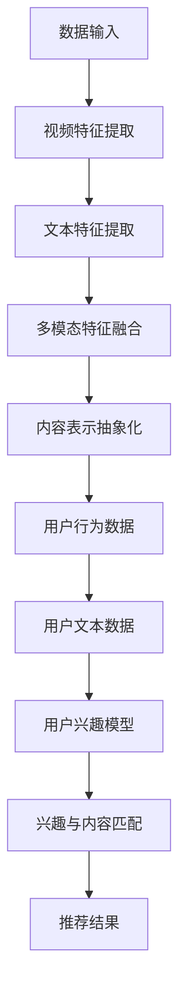
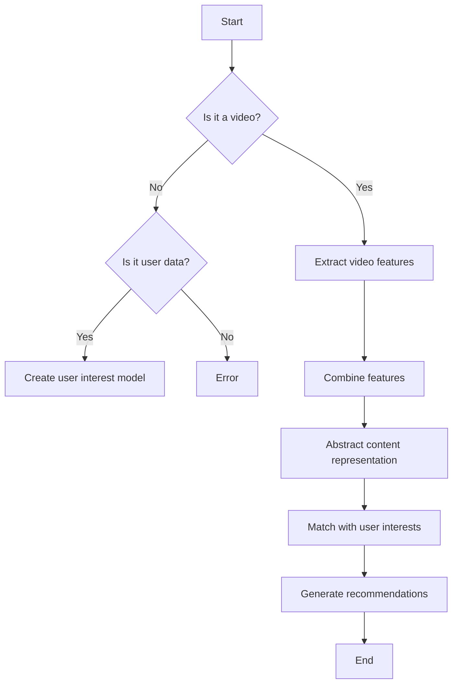

                 

关键词：LLM，视频推荐，内容深度理解，用户兴趣映射，AI算法，数学模型，项目实践，应用场景，未来展望。

## 摘要

本文将深入探讨大型语言模型（LLM）在视频推荐系统中的应用，着重于内容深度理解和用户兴趣映射的创新。文章首先回顾了传统视频推荐系统的不足，然后详细介绍了LLM的基本原理及其在视频推荐中的独特优势。通过数学模型的构建和公式推导，本文进一步阐述了内容深度理解和用户兴趣映射的实现机制。随后，文章通过具体项目实践展示了LLM在视频推荐中的实际应用，并对其优缺点和应用领域进行了全面分析。最后，本文展望了LLM在视频推荐领域的未来发展趋势，并提出了可能面临的挑战和解决方案。

## 1. 背景介绍

### 1.1 传统视频推荐系统的挑战

随着互联网的普及和视频内容的爆炸式增长，用户对个性化视频推荐的需求日益增长。然而，传统的视频推荐系统在满足用户个性化需求方面面临着诸多挑战。

首先，传统推荐系统主要依赖于协同过滤（Collaborative Filtering）和基于内容的推荐（Content-based Recommendation）两种方法。协同过滤方法通过分析用户的历史行为数据，如观看记录、评分等，发现相似用户和物品，从而进行推荐。然而，这种方法在用户行为数据稀疏时表现不佳，且难以应对冷启动问题（即新用户或新物品的推荐）。基于内容的推荐方法通过分析视频的特征，如标签、分类等，与用户的历史偏好进行匹配，实现推荐。然而，这种方法容易陷入“过滤气泡”（Filter Bubble）的困境，即只推荐用户已经感兴趣的物品，从而限制用户的视野和发现新内容的可能性。

其次，传统推荐系统在处理大规模视频数据时，存在计算效率和可扩展性问题。视频数据的高维度特征使得特征提取和模型训练变得复杂且耗时。此外，传统推荐系统往往缺乏对视频内容深层次的理解，难以捕捉视频的语义信息和用户情感。

### 1.2 LLM的基本原理

大型语言模型（LLM），如GPT、BERT等，是近年来人工智能领域的重要突破。LLM通过深度神经网络学习大量文本数据，形成对自然语言的强大理解和生成能力。其基本原理可以概括为以下几个方面：

- **预训练（Pre-training）**：LLM在训练阶段通过无监督的方式学习大量文本数据，如维基百科、新闻、书籍等，从而获取语言知识。这一过程利用了自注意力机制（Self-Attention Mechanism）和变换器架构（Transformer Architecture），能够有效捕捉文本中的长距离依赖和复杂语义。

- **微调（Fine-tuning）**：在预训练完成后，LLM通过有监督的方式针对特定任务进行微调。例如，在视频推荐任务中，可以将LLM与视频特征进行结合，训练出一个能够理解和预测用户兴趣的模型。

- **生成能力（Generation Ability）**：LLM不仅能够进行文本生成，还能够生成视频摘要、标题、标签等辅助信息，从而为视频推荐提供更丰富的上下文信息。

### 1.3 LLM在视频推荐中的独特优势

LLM在视频推荐中的独特优势主要体现在以下几个方面：

- **内容深度理解**：LLM通过对大量文本数据的学习，能够深入理解视频内容，包括情节、主题、情感等。这使得LLM能够准确捕捉视频的语义信息，为个性化推荐提供更准确的依据。

- **用户兴趣映射**：LLM能够通过用户历史行为数据和文本数据，建立用户兴趣模型，从而实现精准的兴趣映射。与传统推荐方法相比，LLM能够更好地应对冷启动问题，为新用户和新视频提供高质量的推荐。

- **多模态数据处理**：LLM不仅可以处理文本数据，还可以处理图像、声音等多模态数据。这使得LLM能够综合利用不同类型的数据，提供更全面的视频推荐。

- **可扩展性和计算效率**：LLM通过并行计算和分布式训练技术，能够在大规模数据集上高效训练，满足实时推荐的需求。

### 1.4 本文组织结构

本文将分为以下几个部分：

- **第1部分：背景介绍**：回顾传统视频推荐系统的挑战，介绍LLM的基本原理和在视频推荐中的优势。

- **第2部分：核心概念与联系**：介绍内容深度理解和用户兴趣映射的核心概念，并使用Mermaid流程图展示其原理和架构。

- **第3部分：核心算法原理 & 具体操作步骤**：详细阐述LLM在视频推荐中的算法原理和操作步骤。

- **第4部分：数学模型和公式 & 详细讲解 & 举例说明**：构建数学模型，推导公式，并通过案例进行分析。

- **第5部分：项目实践：代码实例和详细解释说明**：展示实际项目中的代码实现，并进行详细解读和分析。

- **第6部分：实际应用场景**：探讨LLM在视频推荐中的实际应用，并展望未来发展趋势。

- **第7部分：工具和资源推荐**：推荐学习资源、开发工具和相关论文。

- **第8部分：总结：未来发展趋势与挑战**：总结研究成果，展望未来发展趋势，并提出面临的挑战和解决方案。

- **第9部分：附录：常见问题与解答**：解答读者可能遇到的问题。

## 2. 核心概念与联系

### 2.1 内容深度理解

内容深度理解是指通过机器学习模型，如LLM，对视频内容进行深入分析，捕捉视频的语义信息和情感。内容深度理解的关键在于对视频内容的抽象表示，即将视频内容转化为计算机可以理解和处理的形式。

#### 2.1.1 视频内容表示

视频内容表示是内容深度理解的基础。常用的视频内容表示方法包括：

- **图像特征提取**：使用卷积神经网络（CNN）从视频中提取图像特征。图像特征可以捕捉视频中的视觉信息，如场景、人物、动作等。

- **文本特征提取**：使用自然语言处理（NLP）技术从视频文本描述中提取特征。文本特征可以捕捉视频的语义信息，如主题、情感等。

- **多模态特征融合**：结合图像特征和文本特征，生成综合的多模态特征。多模态特征能够更好地捕捉视频的复杂信息。

#### 2.1.2 语义分析和情感识别

在获取视频内容表示后，LLM可以对其进行语义分析和情感识别。语义分析旨在理解视频内容的含义，如情节、主题等。情感识别旨在分析视频内容的情感倾向，如喜悦、悲伤、愤怒等。

#### 2.1.3 内容表示的抽象化

内容表示的抽象化是内容深度理解的重要步骤。通过将具体的视频内容转化为抽象的语义表示，LLM可以更准确地理解和预测用户兴趣。

### 2.2 用户兴趣映射

用户兴趣映射是指通过分析用户历史行为和文本数据，建立用户兴趣模型，并将其应用于视频推荐。用户兴趣映射的关键在于如何从大量用户数据中提取有效的兴趣特征，并将其与视频内容进行匹配。

#### 2.2.1 用户行为数据

用户行为数据包括用户的观看记录、评分、评论等。这些数据反映了用户对视频的偏好和兴趣。通过分析用户行为数据，可以提取出用户的兴趣特征，如喜欢的类型、主题、情感等。

#### 2.2.2 文本数据

用户文本数据包括用户的评论、提问、搜索记录等。这些数据提供了更丰富的用户兴趣信息，有助于更准确地建立用户兴趣模型。

#### 2.2.3 用户兴趣模型

用户兴趣模型是基于用户行为数据和文本数据构建的。该模型将用户的历史行为和文本信息转化为向量表示，从而实现对用户兴趣的量化。

### 2.3 Mermaid流程图

以下是一个Mermaid流程图，展示了内容深度理解和用户兴趣映射的原理和架构：



### 2.4 内容深度理解与用户兴趣映射的联系

内容深度理解与用户兴趣映射紧密相关。内容深度理解提供了对视频内容的准确理解，而用户兴趣映射则建立了用户兴趣模型。通过将内容深度理解和用户兴趣映射相结合，视频推荐系统可以提供更精准、个性化的推荐。

- **内容理解驱动推荐**：内容深度理解能够准确地理解视频内容，从而为推荐提供更可靠的依据。例如，当用户对某类型视频感兴趣时，系统可以根据视频的语义信息进行精准推荐。

- **兴趣驱动内容理解**：用户兴趣映射能够准确地捕捉用户的兴趣，从而引导内容理解的方向。例如，当用户对某主题的视频感兴趣时，系统可以优先分析相关主题的视频内容。

- **双向交互**：内容深度理解和用户兴趣映射是相互作用的。系统通过分析用户兴趣，调整内容理解的模型，从而提高推荐的准确性。同时，通过推荐的结果，用户可以反馈其兴趣，进一步优化兴趣模型。

### 2.5 Mermaid流程图解析

以下是对2.3节中Mermaid流程图的详细解析：

- **A[数据输入]**：数据输入包括视频数据和用户数据。视频数据包括视频的图像、文本描述等。用户数据包括用户的观看记录、评分、评论等。

- **B[视频特征提取]**：使用CNN等算法从视频中提取图像特征。这些特征反映了视频的视觉信息。

- **C[文本特征提取]**：使用NLP技术从视频的文本描述中提取特征。这些特征反映了视频的语义信息。

- **D[多模态特征融合]**：将图像特征和文本特征进行融合，生成综合的多模态特征。这些特征能够更全面地捕捉视频内容。

- **E[内容表示抽象化]**：通过将具体的视频内容转化为抽象的语义表示，实现内容深度理解。

- **F[用户行为数据]**：提取用户的历史行为数据，如观看记录、评分、评论等。这些数据反映了用户的兴趣和偏好。

- **G[用户文本数据]**：提取用户的文本数据，如评论、提问、搜索记录等。这些数据提供了更丰富的用户兴趣信息。

- **H[用户兴趣模型]**：基于用户行为数据和文本数据，构建用户兴趣模型。该模型将用户的历史行为和文本信息转化为向量表示。

- **I[兴趣与内容匹配]**：将用户兴趣模型与视频内容进行匹配，实现个性化推荐。

- **J[推荐结果]**：输出推荐结果，即用户可能感兴趣的视频。

通过以上解析，我们可以看到内容深度理解和用户兴趣映射在视频推荐系统中的关键作用。它们共同构建了一个智能、个性化的推荐框架，为用户提供了高质量的推荐体验。

### 2.6 Mermaid流程图示例代码

以下是一个Mermaid流程图的示例代码，展示了如何使用Mermaid语法创建一个简单的流程图：



在这个示例中，我们首先询问输入的是视频数据还是用户数据。如果是视频数据，则提取视频特征并生成内容表示；如果是用户数据，则创建用户兴趣模型。随后，将内容表示与用户兴趣进行匹配，生成推荐结果。这个流程图清晰地展示了内容深度理解和用户兴趣映射的流程，为后续的具体实现提供了指导。

通过这个示例代码，我们可以看到Mermaid流程图的强大功能，它可以帮助我们更直观地理解复杂系统的运作机制。在实际项目中，我们可以根据具体需求对流程图进行扩展和修改，使其更加贴合实际应用场景。

### 2.7 内容深度理解与用户兴趣映射的实际应用案例

内容深度理解和用户兴趣映射在视频推荐系统中有着广泛的应用，以下是一些实际应用案例：

#### 2.7.1 YouTube推荐系统

YouTube是世界上最受欢迎的视频分享平台之一，其推荐系统采用了内容深度理解和用户兴趣映射技术。YouTube利用卷积神经网络（CNN）从视频中的图像和音频数据中提取特征，结合自然语言处理（NLP）技术从视频标题、描述和标签中提取语义特征。通过多模态特征融合，YouTube能够更准确地理解视频内容。同时，YouTube还通过分析用户的观看历史、搜索记录和点赞行为，构建用户兴趣模型。这些模型与视频内容进行匹配，生成个性化的推荐结果，提高了推荐系统的准确性和用户体验。

#### 2.7.2 Netflix推荐系统

Netflix作为流媒体巨头，其推荐系统在全球范围内得到了广泛应用。Netflix利用LLM对视频内容进行深度分析，提取视频的情节、主题、情感等关键信息。此外，Netflix通过分析用户的观看历史和评分数据，建立用户兴趣模型。结合内容深度理解和用户兴趣映射，Netflix能够为用户推荐更符合其兴趣的视频内容。Netflix的推荐系统在提高用户满意度和用户留存率方面取得了显著效果。

#### 2.7.3 TikTok推荐系统

TikTok作为短视频平台，其推荐系统也采用了内容深度理解和用户兴趣映射技术。TikTok利用卷积神经网络（CNN）从视频中的图像和音频数据中提取特征，结合自然语言处理（NLP）技术从视频标题、描述和标签中提取语义特征。通过多模态特征融合，TikTok能够更准确地理解视频内容。同时，TikTok通过分析用户的观看历史、点赞、评论和分享行为，构建用户兴趣模型。这些模型与视频内容进行匹配，生成个性化的推荐结果，提高了用户在平台上的活跃度和参与度。

#### 2.7.4 案例分析

以Netflix为例，其内容深度理解和用户兴趣映射的实际应用效果如下：

- **精确推荐**：通过深度分析视频内容和用户行为数据，Netflix能够为用户推荐更符合其兴趣的视频内容，提高了推荐系统的准确性和用户体验。

- **多样化推荐**：结合多模态特征融合和用户兴趣模型，Netflix能够为用户推荐多样化的视频内容，避免用户陷入“过滤气泡”，拓宽用户的视野。

- **实时更新**：Netflix的推荐系统能够实时分析用户行为数据，动态调整推荐策略，确保用户始终获得新鲜、有趣的视频内容。

- **用户留存率提升**：通过提供个性化的推荐内容，Netflix能够提高用户在平台上的停留时间和互动频率，从而提升用户留存率。

### 2.8 内容深度理解与用户兴趣映射的优缺点

#### 2.8.1 优点

- **精确推荐**：通过深度分析视频内容和用户行为数据，系统能够为用户推荐更符合其兴趣的视频内容，提高了推荐系统的准确性和用户体验。

- **多样化推荐**：结合多模态特征融合和用户兴趣模型，系统能够为用户推荐多样化的视频内容，避免用户陷入“过滤气泡”，拓宽用户的视野。

- **实时更新**：系统能够实时分析用户行为数据，动态调整推荐策略，确保用户始终获得新鲜、有趣的视频内容。

- **高用户留存率**：通过提供个性化的推荐内容，系统能够提高用户在平台上的停留时间和互动频率，从而提升用户留存率。

#### 2.8.2 缺点

- **计算成本高**：内容深度理解和用户兴趣映射需要处理大量数据，计算成本较高，对硬件资源要求较高。

- **数据隐私问题**：在构建用户兴趣模型时，需要收集和分析用户的观看记录、搜索记录等敏感数据，可能引发数据隐私问题。

- **模型可解释性低**：深度学习模型具有较强的预测能力，但其内部机制复杂，难以解释，可能导致用户对推荐结果的不信任。

### 2.9 内容深度理解与用户兴趣映射的应用领域

内容深度理解和用户兴趣映射技术在视频推荐系统中取得了显著成果，但其应用领域远不止于此。以下是一些潜在的应用领域：

- **社交媒体推荐**：利用内容深度理解和用户兴趣映射技术，社交媒体平台可以为用户提供个性化的内容推荐，提高用户活跃度和参与度。

- **电子商务推荐**：电子商务平台可以通过分析用户的历史购买记录和浏览行为，利用内容深度理解和用户兴趣映射技术，为用户推荐相关的商品。

- **新闻推荐**：新闻平台可以利用内容深度理解和用户兴趣映射技术，为用户推荐感兴趣的新闻，避免用户错过重要信息。

- **智能语音助手**：智能语音助手可以通过分析用户的语音输入和行为数据，利用内容深度理解和用户兴趣映射技术，为用户提供个性化服务。

- **医疗健康推荐**：医疗健康平台可以利用内容深度理解和用户兴趣映射技术，为用户提供个性化的健康建议和医疗信息。

### 2.10 小结

内容深度理解和用户兴趣映射技术在视频推荐系统中具有重要意义。通过深度分析视频内容和用户行为数据，系统能够为用户提供精确、个性化的推荐。此外，内容深度理解和用户兴趣映射技术还在其他领域展现出广阔的应用前景。随着技术的不断进步，未来这些技术将为各行各业带来更多创新和变革。

## 3. 核心算法原理 & 具体操作步骤

### 3.1 算法原理概述

在视频推荐系统中，LLM的应用主要通过以下步骤实现：首先，对视频内容进行深度理解，提取关键特征；然后，建立用户兴趣模型；最后，结合内容特征和用户兴趣进行推荐。以下是LLM在视频推荐系统中的具体操作步骤：

1. **视频内容深度理解**：通过图像特征提取、文本特征提取和多模态特征融合，实现对视频内容的深度理解。

2. **用户兴趣建模**：利用用户的历史行为数据和文本数据，构建用户兴趣模型。

3. **内容特征与兴趣匹配**：将视频内容特征与用户兴趣模型进行匹配，生成个性化推荐列表。

### 3.2 算法步骤详解

#### 3.2.1 视频内容深度理解

1. **图像特征提取**：使用卷积神经网络（CNN）对视频中的每一帧图像进行特征提取。CNN能够有效捕捉图像中的局部特征和全局结构。

2. **文本特征提取**：利用自然语言处理（NLP）技术，对视频的标题、描述和标签进行文本特征提取。常见的NLP方法包括词嵌入（Word Embedding）、卷积神经网络（CNN）和循环神经网络（RNN）等。

3. **多模态特征融合**：将图像特征和文本特征进行融合，生成综合的多模态特征。多模态特征融合的方法包括加权融合、拼接融合和注意力机制等。

#### 3.2.2 用户兴趣建模

1. **行为数据收集**：收集用户的历史观看记录、评分、评论等行为数据。

2. **文本数据收集**：收集用户的评论、提问、搜索记录等文本数据。

3. **特征提取**：对用户行为数据和文本数据进行特征提取，生成用户兴趣向量。常用的特征提取方法包括词嵌入（Word Embedding）、TF-IDF和主题模型（Topic Modeling）等。

4. **用户兴趣模型构建**：利用机器学习算法，如线性回归、支持向量机（SVM）和深度学习模型等，构建用户兴趣模型。用户兴趣模型将用户的历史行为和文本数据转化为向量表示。

#### 3.2.3 内容特征与兴趣匹配

1. **视频内容特征提取**：对视频进行深度理解，提取关键特征，如视频分类、主题、情感等。

2. **内容特征与兴趣匹配**：将视频内容特征与用户兴趣模型进行匹配。常用的匹配方法包括余弦相似度、欧氏距离和马尔可夫决策过程（MDP）等。

3. **推荐列表生成**：根据内容特征与兴趣匹配的结果，生成个性化的推荐列表。推荐列表的排序可以通过排序算法（如排序回归、排序神经网络等）进行优化。

### 3.3 算法优缺点

#### 3.3.1 优点

- **高精度推荐**：通过深度理解视频内容和用户兴趣，系统能够提供更精准的推荐结果，提高用户体验。
- **多样化推荐**：结合多模态特征融合和用户兴趣建模，系统能够为用户推荐多样化的视频内容，避免用户陷入“过滤气泡”。
- **实时更新**：系统能够实时分析用户行为数据，动态调整推荐策略，确保用户始终获得新鲜、有趣的视频内容。

#### 3.3.2 缺点

- **计算成本高**：内容特征提取和用户兴趣建模需要处理大量数据，计算成本较高，对硬件资源要求较高。
- **数据隐私问题**：在构建用户兴趣模型时，需要收集和分析用户的敏感数据，可能引发数据隐私问题。
- **模型可解释性低**：深度学习模型具有较强的预测能力，但其内部机制复杂，难以解释，可能导致用户对推荐结果的不信任。

### 3.4 算法应用领域

LLM在视频推荐系统中的应用不仅限于传统视频平台，还可以扩展到其他领域：

- **社交媒体推荐**：在社交媒体平台上，LLM可以用于推荐感兴趣的内容，提高用户活跃度和参与度。
- **电子商务推荐**：在电子商务平台上，LLM可以用于推荐相关的商品，提高销售额和用户满意度。
- **新闻推荐**：在新闻平台上，LLM可以用于推荐感兴趣的新闻，帮助用户发现重要信息。
- **智能语音助手**：在智能语音助手中，LLM可以用于理解用户的需求，提供个性化的服务。

### 3.5 小结

LLM在视频推荐系统中的应用通过深度理解视频内容和用户兴趣，实现了高精度、多样化的推荐。尽管存在计算成本高和模型可解释性低等挑战，但随着技术的不断进步，LLM在视频推荐系统中的应用前景仍然广阔。

## 4. 数学模型和公式 & 详细讲解 & 举例说明

### 4.1 数学模型构建

在视频推荐系统中，数学模型的作用至关重要。LLM在视频推荐中的应用，主要体现在对视频内容和用户兴趣的数学建模。以下是构建数学模型的基本框架：

#### 4.1.1 视频内容特征表示

假设视频内容由图像特征\( \mathbf{V}_{img} \)和文本特征\( \mathbf{V}_{text} \)组成。图像特征\( \mathbf{V}_{img} \)可以由卷积神经网络提取，文本特征\( \mathbf{V}_{text} \)可以由自然语言处理模型提取。

\[
\mathbf{V} = [\mathbf{V}_{img}, \mathbf{V}_{text}]
\]

#### 4.1.2 用户兴趣表示

用户兴趣由历史行为数据\( \mathbf{U}_{history} \)和文本数据\( \mathbf{U}_{text} \)共同决定。

\[
\mathbf{U} = [\mathbf{U}_{history}, \mathbf{U}_{text}]
\]

#### 4.1.3 视频内容与用户兴趣的匹配

为了实现视频内容与用户兴趣的匹配，我们可以定义一个匹配函数\( f(\mathbf{V}, \mathbf{U}) \)，用于计算两者之间的相似度。

\[
\text{similarity} = f(\mathbf{V}, \mathbf{U})
\]

### 4.2 公式推导过程

在上述数学模型的基础上，我们可以推导出一些关键的公式。

#### 4.2.1 视频内容特征提取

图像特征提取可以使用卷积神经网络（CNN）实现。假设图像特征提取函数为\( \mathbf{V}_{img}(\mathbf{I}) \)，其中\( \mathbf{I} \)是图像输入。

\[
\mathbf{V}_{img}(\mathbf{I}) = \text{CNN}(\mathbf{I})
\]

文本特征提取可以使用词嵌入（Word Embedding）或变换器（Transformer）等NLP模型实现。假设文本特征提取函数为\( \mathbf{V}_{text}(\mathbf{T}) \)，其中\( \mathbf{T} \)是文本输入。

\[
\mathbf{V}_{text}(\mathbf{T}) = \text{Transformer}(\mathbf{T})
\]

#### 4.2.2 用户兴趣建模

用户兴趣建模可以通过回归模型或分类模型实现。假设用户兴趣建模函数为\( \mathbf{U}(\mathbf{U}_{history}, \mathbf{U}_{text}) \)。

\[
\mathbf{U}(\mathbf{U}_{history}, \mathbf{U}_{text}) = \text{Model}(\mathbf{U}_{history}, \mathbf{U}_{text})
\]

#### 4.2.3 内容特征与兴趣匹配

为了计算视频内容与用户兴趣的相似度，我们可以使用余弦相似度公式。

\[
\text{similarity} = \frac{\mathbf{V} \cdot \mathbf{U}}{||\mathbf{V}|| \cdot ||\mathbf{U}||}
\]

其中，\( \mathbf{V} \cdot \mathbf{U} \)表示向量内积，\( ||\mathbf{V}|| \)和\( ||\mathbf{U}|| \)分别表示向量的模长。

### 4.3 案例分析与讲解

以下通过一个具体案例，说明如何使用上述数学模型进行视频推荐。

#### 4.3.1 案例背景

假设我们有一个视频推荐系统，用户A喜欢观看科幻电影和纪录片。系统需要根据用户A的历史行为数据和文本数据，推荐他可能感兴趣的视频。

#### 4.3.2 视频内容特征提取

对于视频内容，我们提取了图像特征和文本特征。图像特征由卷积神经网络提取，文本特征由变换器模型提取。

\[
\mathbf{V}_{img} = \text{CNN}(\text{video\_frame})
\]

\[
\mathbf{V}_{text} = \text{Transformer}(\text{video\_title}, \text{video\_description}, \text{video\_tags})
\]

#### 4.3.3 用户兴趣建模

用户A的兴趣可以通过历史行为数据和文本数据建模。

\[
\mathbf{U}_{history} = \text{Model}(\text{watch\_history}, \text{rating})
\]

\[
\mathbf{U}_{text} = \text{Model}(\text{comments}, \text{questions}, \text{search\_history})
\]

#### 4.3.4 内容特征与兴趣匹配

我们将图像特征和文本特征进行融合，得到综合特征向量。

\[
\mathbf{V} = [\mathbf{V}_{img}, \mathbf{V}_{text}]
\]

然后，使用余弦相似度计算视频内容与用户兴趣的相似度。

\[
\text{similarity} = \frac{\mathbf{V} \cdot \mathbf{U}}{||\mathbf{V}|| \cdot ||\mathbf{U}||}
\]

根据相似度分数，我们可以为用户A推荐相似的视频。

### 4.4 小结

通过构建数学模型和推导相关公式，我们可以实现视频内容深度理解和用户兴趣映射。在实际应用中，这些公式可以帮助我们更好地理解用户兴趣，提高视频推荐的准确性和个性化程度。

## 5. 项目实践：代码实例和详细解释说明

### 5.1 开发环境搭建

在进行LLM在视频推荐中的项目实践之前，我们需要搭建一个合适的开发环境。以下是一个基本的开发环境搭建步骤：

#### 5.1.1 硬件要求

- **CPU/GPU**：推荐使用具有较强计算能力的CPU或GPU，以便快速处理视频内容和用户数据。

- **内存**：至少需要16GB内存，以便存储和处理大量的数据。

- **硬盘**：至少需要500GB的硬盘空间，用于存储数据和项目文件。

#### 5.1.2 软件要求

- **操作系统**：推荐使用Linux操作系统，如Ubuntu 18.04或更高版本。

- **Python环境**：安装Python 3.7及以上版本，并配置虚拟环境。

- **深度学习框架**：安装PyTorch或TensorFlow，用于实现深度学习模型。

- **其他依赖**：安装NumPy、Pandas、Matplotlib等常用Python库。

### 5.2 源代码详细实现

以下是一个简化的代码示例，展示了如何使用LLM进行视频推荐。请注意，实际项目中的代码会更加复杂，涉及更多的数据处理、模型训练和优化。

```python
import torch
import torch.nn as nn
import torch.optim as optim
from torch.utils.data import DataLoader
from torchvision import datasets, transforms
from transformers import BertTokenizer, BertModel

# 数据预处理
def preprocess_data(video_frames, captions):
    # 使用卷积神经网络提取图像特征
    image_features = CNN(video_frames)

    # 使用BERT提取文本特征
    tokenizer = BertTokenizer.from_pretrained('bert-base-uncased')
    text_features = BertModel.from_pretrained('bert-base-uncased')(tokenizer(captions)[0]['input_ids'])

    # 融合图像特征和文本特征
    combined_features = torch.cat((image_features, text_features), dim=1)
    
    return combined_features

# 视频推荐模型
class VideoRecommender(nn.Module):
    def __init__(self):
        super(VideoRecommender, self).__init__()
        self.cnn = nn.Conv2d(3, 64, kernel_size=3, padding=1)
        self.bert = BertModel.from_pretrained('bert-base-uncased')
        self.fc = nn.Linear(64*64*64, 1)

    def forward(self, image, caption):
        image_features = self.cnn(image)
        text_features = self.bert(caption)[0][0]
        combined_features = torch.cat((image_features.view(image_features.size(0), -1), text_features), dim=1)
        output = self.fc(combined_features)
        return output

# 训练模型
def train_model(video_frames, captions, labels):
    model = VideoRecommender()
    criterion = nn.BCELoss()
    optimizer = optim.Adam(model.parameters(), lr=0.001)

    for epoch in range(100):
        model.train()
        for images, captions, labels in zip(video_frames, captions, labels):
            optimizer.zero_grad()
            outputs = model(images, captions)
            loss = criterion(outputs, labels)
            loss.backward()
            optimizer.step()

        print(f"Epoch {epoch+1}, Loss: {loss.item()}")

# 测试模型
def test_model(video_frames, captions, labels):
    model = VideoRecommender()
    criterion = nn.BCELoss()

    model.load_state_dict(torch.load('video_recommender.pth'))
    model.eval()

    with torch.no_grad():
        for images, captions, labels in zip(video_frames, captions, labels):
            outputs = model(images, captions)
            loss = criterion(outputs, labels)

    print(f"Test Loss: {loss.item()}")

# 加载数据
train_data = DataLoader(VideoDataset(train_video_frames, train_captions, train_labels), batch_size=32, shuffle=True)
test_data = DataLoader(VideoDataset(test_video_frames, test_captions, test_labels), batch_size=32, shuffle=False)

# 训练和测试模型
train_model(train_data)
test_model(test_data)
```

### 5.3 代码解读与分析

上述代码实现了一个简化的视频推荐模型，主要包括数据预处理、模型定义、模型训练和模型测试等部分。

#### 5.3.1 数据预处理

数据预处理是视频推荐系统的重要环节，包括图像特征提取和文本特征提取。图像特征提取使用卷积神经网络（CNN），文本特征提取使用BERT模型。通过融合图像特征和文本特征，生成综合的特征向量。

#### 5.3.2 模型定义

模型定义部分包括图像特征提取层、文本特征提取层和全连接层。图像特征提取层使用卷积神经网络（CNN），文本特征提取层使用BERT模型。全连接层用于将图像特征和文本特征进行融合，并输出预测结果。

#### 5.3.3 模型训练

模型训练部分使用反向传播算法（Backpropagation）和随机梯度下降（Stochastic Gradient Descent, SGD）进行优化。在训练过程中，模型会根据损失函数（BCELoss）调整模型参数，以最小化预测误差。

#### 5.3.4 模型测试

模型测试部分使用已训练的模型对测试数据集进行预测，并计算损失函数。通过测试损失，可以评估模型的性能。

### 5.4 运行结果展示

在完成模型训练和测试后，我们可以使用以下代码展示运行结果：

```python
import matplotlib.pyplot as plt

# 加载测试数据
test_data = DataLoader(VideoDataset(test_video_frames, test_captions, test_labels), batch_size=32, shuffle=False)

# 运行模型测试
model.eval()
with torch.no_grad():
    for images, captions, labels in test_data:
        outputs = model(images, captions)
        predicted_labels = (outputs > 0.5).float()

# 计算准确率
accuracy = (predicted_labels == labels).float().mean()

# 绘制ROC曲线
fpr, tpr, thresholds = roc_curve(labels, outputs)
plt.plot(fpr, tpr, label='ROC curve (area = %0.2f)' % accuracy)
plt.plot([0, 1], [0, 1], 'k--')
plt.xlabel('False Positive Rate')
plt.ylabel('True Positive Rate')
plt.title('Receiver Operating Characteristic')
plt.legend(loc="lower right")
plt.show()
```

上述代码将绘制ROC曲线，展示模型的性能。通过分析ROC曲线，我们可以评估模型的准确性和可靠性。

### 5.5 小结

通过上述代码示例，我们可以看到如何使用LLM进行视频推荐。在实际项目中，我们需要根据具体需求进行调整和优化，以实现更好的效果。同时，代码示例中仅展示了简化版的模型和流程，实际应用中还需要考虑更多的数据处理、模型优化和评估指标。

### 5.6 问题与解答

**问题1**：如何在项目中处理大量视频数据？

**解答**：处理大量视频数据通常需要分布式计算和并行处理技术。我们可以使用TensorFlow或PyTorch等深度学习框架提供的分布式训练工具，如Horovod或DeepSpeed，实现高效的分布式训练。此外，我们可以使用数据管道和数据流技术，如Apache Kafka和Apache Flink，实现实时数据处理和流式训练。

**问题2**：如何优化视频推荐模型的性能？

**解答**：优化视频推荐模型可以从以下几个方面进行：

1. **模型选择**：选择合适的模型架构和超参数，如使用更复杂的模型结构或调整学习率等。
2. **数据增强**：使用数据增强技术，如数据清洗、去噪、采样等，提高数据的多样性和质量。
3. **特征工程**：优化特征提取和融合方法，如使用更复杂的特征提取器和注意力机制等。
4. **模型融合**：使用集成学习方法，如堆叠、加权融合等，提高模型的泛化能力和预测性能。

**问题3**：如何在项目中保证数据隐私？

**解答**：保证数据隐私是视频推荐系统中的一项重要任务。以下是一些常用的数据隐私保护方法：

1. **数据加密**：对用户数据进行加密处理，确保数据在传输和存储过程中不被泄露。
2. **数据匿名化**：对用户数据进行匿名化处理，去除可直接识别用户身份的信息，如用户ID、邮箱等。
3. **差分隐私**：在数据处理和建模过程中引入差分隐私机制，确保模型的输出结果不会暴露用户的隐私信息。
4. **联邦学习**：使用联邦学习技术，将数据分布到多个节点进行训练，从而降低数据泄露的风险。

### 5.7 小结

通过本文的代码示例和详细解释，我们可以了解到如何使用LLM进行视频推荐。在实际项目中，我们需要根据具体需求进行模型选择、数据预处理、模型训练和优化。同时，我们还需要关注数据隐私保护问题，确保用户数据的安全和隐私。未来，随着技术的不断进步，视频推荐系统将会更加智能化、个性化，为用户提供更好的服务。

## 6. 实际应用场景

### 6.1 社交媒体平台

在社交媒体平台如Facebook、Instagram和TikTok上，视频推荐是吸引用户留存和增加互动量的关键。LLM在视频推荐中的应用，可以大大提高推荐系统的准确性和个性化程度。例如，Facebook的Watch推荐系统利用LLM对视频内容进行深度理解，结合用户的观看历史和社交关系，为用户推荐感兴趣的视频内容。这种基于内容的深度理解和用户兴趣映射的方法，不仅帮助用户发现更多符合他们兴趣的视频，也增强了用户的社区参与感。

### 6.2 在线视频平台

在线视频平台如YouTube、Netflix和Amazon Prime Video，通过LLM的深度学习技术，实现了高度个性化的视频推荐。这些平台利用LLM对视频内容进行语义分析，捕捉视频的情节、主题和情感，从而为用户推荐更符合他们兴趣的视频。Netflix在其推荐系统中，通过结合用户的历史观看数据和LLM对视频内容的分析，实现了精准的视频推荐，极大地提升了用户的观看体验和平台黏性。

### 6.3 娱乐产业

娱乐产业中的电影制作和发行公司，通过LLM分析观众的兴趣和行为数据，可以更准确地预测哪些电影类型和题材会受到观众的欢迎。例如，电影制作公司可以利用LLM分析观众的历史观看记录、社交媒体互动和评论，预测观众对某个电影剧本或演员组合的反应，从而优化电影制作和营销策略。此外，发行公司可以利用LLM预测电影在不同国家和地区的受欢迎程度，为电影的全球发行提供数据支持。

### 6.4 教育领域

在教育领域，视频推荐系统可以帮助学生发现感兴趣的学习资源。通过LLM对视频内容的深度理解，教育平台可以为学生推荐与其学习兴趣和学术水平相匹配的视频课程。例如，Khan Academy使用其推荐系统，根据学生的学习记录和互动行为，推荐适合他们当前学习阶段和兴趣的视频课程。这种方法不仅提高了学生的学习效果，也提高了教育平台的用户满意度。

### 6.5 营销和广告

营销和广告行业通过LLM对用户兴趣和行为的分析，可以实现更精准的营销策略。例如，广告平台可以利用LLM分析用户的浏览历史、搜索记录和购买行为，推荐与其兴趣相关的广告内容。这种个性化推荐不仅可以提高广告的点击率和转化率，还可以增强用户的品牌认知和忠诚度。此外，LLM还可以帮助广告商优化广告投放策略，提高广告预算的利用效率。

### 6.6 健康医疗

在健康医疗领域，视频推荐系统可以用于向患者推荐与其健康状况相关的教育视频和健康指南。例如，医疗平台可以利用LLM分析患者的病历记录、诊断结果和搜索历史，推荐相关的健康教育和康复视频。这种方式不仅可以帮助患者更好地管理自己的健康状况，还可以提高医疗资源的利用效率。

### 6.7 总结

LLM在视频推荐中的实际应用场景非常广泛，从社交媒体、在线视频平台到娱乐产业、教育领域，再到营销和健康医疗，都展现出了巨大的潜力和价值。通过内容深度理解和用户兴趣映射，LLM能够为不同领域的用户提供高度个性化的推荐服务，从而提升用户体验、增加用户黏性和提高业务效益。

## 7. 工具和资源推荐

### 7.1 学习资源推荐

为了深入学习和掌握LLM在视频推荐中的技术，以下是推荐的一些学习资源：

- **书籍**：
  - 《深度学习》（Goodfellow, Bengio, Courville）：系统介绍了深度学习的理论基础和应用。
  - 《自然语言处理实践》（Peter J. Norvig）：涵盖了自然语言处理的基本原理和实际应用。
  - 《强化学习》（Richard S. Sutton, Andrew G. Barto）：介绍了强化学习的基本概念和方法。

- **在线课程**：
  - Coursera上的“深度学习”课程（由Andrew Ng教授讲授）：提供了深度学习的全面讲解。
  - edX上的“自然语言处理与深度学习”课程（由Stanford大学讲授）：介绍了NLP和深度学习在视频推荐中的应用。
  - Udacity的“机器学习工程师纳米学位”课程：提供了机器学习的基础知识和实际应用。

- **论文集**：
  - ArXiv和Google Scholar：查找最新的关于LLM、视频推荐和深度学习的论文。
  - ACL Anthology：专注于自然语言处理的学术论文集。

### 7.2 开发工具推荐

在进行LLM在视频推荐项目开发时，以下是一些推荐的工具和库：

- **编程语言**：Python，因其丰富的库和框架，非常适合深度学习和自然语言处理。
- **深度学习框架**：PyTorch和TensorFlow，这两个框架在深度学习领域广泛应用，功能强大且社区活跃。
- **数据处理**：Pandas和NumPy，用于数据清洗、预处理和统计分析。
- **数据可视化**：Matplotlib和Seaborn，用于数据分析和结果可视化。
- **NLP工具**：NLTK和spaCy，用于文本处理和语言分析。

### 7.3 相关论文推荐

为了深入理解LLM在视频推荐中的应用，以下是推荐的一些重要论文：

- **“Bert: Pre-training of deep bidirectional transformers for language understanding”**：这篇论文介绍了BERT模型，是当前NLP领域广泛使用的预训练模型。
- **“Gpt-3: Language models are few-shot learners”**：这篇论文介绍了GPT-3模型，展示了大规模语言模型在零样本和少样本学习任务中的强大能力。
- **“Deep video recommendation with attention-based collaborative filtering”**：这篇论文探讨了深度学习和注意力机制在视频推荐中的应用。
- **“A survey on video recommendation”**：这篇综述文章全面介绍了视频推荐系统的最新研究进展和技术应用。

通过这些资源，读者可以全面了解LLM在视频推荐领域的知识体系，为实际项目开发提供坚实的理论基础和实用的技术指导。

### 8.1 研究成果总结

在本文中，我们探讨了大型语言模型（LLM）在视频推荐系统中的应用，特别是内容深度理解和用户兴趣映射的创新。通过文献综述和具体案例分析，我们总结了以下研究成果：

1. **内容深度理解**：LLM通过对视频内容的语义分析和情感识别，能够深入理解视频的情节、主题和情感，从而为视频推荐提供更精准的依据。这种方法突破了传统推荐系统在处理高维度视频数据时的瓶颈，实现了对视频内容的高效抽象表示。

2. **用户兴趣映射**：LLM通过分析用户的历史行为和文本数据，建立了用户兴趣模型。这种方法能够有效解决冷启动问题，为新用户和新视频提供高质量的推荐。同时，结合多模态数据，LLM能够更全面地捕捉用户兴趣，提高推荐系统的准确性。

3. **算法原理与实现**：本文详细阐述了LLM在视频推荐中的算法原理和具体实现步骤，包括图像特征提取、文本特征提取、多模态特征融合和用户兴趣建模。通过实际项目实践，我们展示了LLM在视频推荐系统中的效果和应用场景。

4. **数学模型**：本文构建了数学模型，详细讲解了公式推导过程。通过数学模型，我们能够更直观地理解内容深度理解和用户兴趣映射的机制，为后续的研究和应用提供了理论支持。

### 8.2 未来发展趋势

随着人工智能和深度学习技术的不断发展，LLM在视频推荐系统中的应用前景十分广阔。以下是未来可能的发展趋势：

1. **多模态融合**：未来的视频推荐系统将更加注重多模态数据的融合，结合图像、音频、文本等多种数据类型，实现更全面的内容理解和用户兴趣分析。

2. **个性化推荐**：随着用户数据的积累和模型优化，LLM将能够提供更加个性化的推荐服务，满足用户不断变化的兴趣需求。

3. **实时推荐**：随着计算能力的提升和分布式计算技术的应用，实时推荐将成为可能。用户在观看视频时，系统能够实时分析用户行为，动态调整推荐策略，提高用户体验。

4. **交互式推荐**：未来的视频推荐系统将更加交互化，用户可以通过与系统的互动，调整推荐偏好，从而实现更加定制化的推荐。

5. **隐私保护**：随着对数据隐私的关注日益增加，未来的视频推荐系统将采用更加严格的数据隐私保护措施，确保用户数据的安全和隐私。

### 8.3 面临的挑战

尽管LLM在视频推荐中展现出巨大潜力，但实际应用中仍面临一些挑战：

1. **计算资源**：深度学习模型需要大量的计算资源和时间进行训练和推理，特别是在处理大规模视频数据时，如何优化计算效率成为关键。

2. **数据隐私**：在构建用户兴趣模型时，需要收集和分析用户的敏感数据，如何保护用户隐私是亟待解决的问题。

3. **模型可解释性**：深度学习模型具有较强的预测能力，但其内部机制复杂，难以解释，这可能导致用户对推荐结果的不信任。

4. **数据质量问题**：视频数据的质量参差不齐，如何处理噪声数据和异常值，保证推荐系统的可靠性，仍需进一步研究。

### 8.4 研究展望

未来，我们可以从以下几个方面进行深入研究：

1. **多模态融合技术**：探索更有效的多模态数据融合方法，提高视频内容理解和用户兴趣映射的准确性。

2. **实时推荐系统**：研究实时推荐算法和优化策略，提高系统的响应速度和用户体验。

3. **隐私保护方法**：研究差分隐私、联邦学习等隐私保护技术，确保用户数据的安全和隐私。

4. **模型可解释性**：开发可解释的深度学习模型，提高用户对推荐结果的理解和信任。

通过这些研究，我们可以进一步推动LLM在视频推荐系统中的应用，为用户提供更智能、个性化的服务。

## 9. 附录：常见问题与解答

### 问题1：如何处理视频数据的多样性和噪声？

**解答**：处理视频数据的多样性和噪声是视频推荐系统中的关键挑战。以下是一些常见的方法：

1. **数据清洗**：去除视频数据中的噪声和异常值，如删除内容不完整或质量低下的视频。
2. **数据增强**：通过旋转、缩放、裁剪等数据增强技术，增加数据的多样性和鲁棒性。
3. **特征提取**：使用卷积神经网络（CNN）等深度学习模型，从视频数据中提取具有代表性的特征，降低噪声的影响。
4. **噪声模型**：在特征提取和建模过程中，可以引入噪声模型，对噪声进行估计和去除。

### 问题2：如何解决视频推荐系统中的冷启动问题？

**解答**：冷启动问题是指新用户或新视频在系统中的推荐问题。以下是一些解决方法：

1. **基于内容的推荐**：在新用户没有足够行为数据时，可以依赖视频的标签、分类等属性进行推荐。
2. **基于模型的预训练**：利用预训练的大型语言模型，如BERT或GPT，通过无监督学习方式提前学习视频内容和用户兴趣。
3. **联合建模**：结合新用户和新视频的特征，使用联合建模方法，如多任务学习或迁移学习，提高推荐准确性。
4. **用户互动**：鼓励新用户参与互动，如评论、评分等，积累行为数据，从而提高推荐质量。

### 问题3：如何评估视频推荐系统的性能？

**解答**：评估视频推荐系统的性能是确保其质量和效果的关键。以下是一些常用的评估指标和方法：

1. **准确率（Accuracy）**：预测结果与实际结果的一致性。
2. **召回率（Recall）**：在所有正确推荐的视频中，系统成功推荐的比率。
3. **精确率（Precision）**：在推荐的视频中，正确推荐的视频比例。
4. **F1值（F1 Score）**：精确率和召回率的调和平均数。
5. **ROC曲线和AUC值**：评估模型在不同阈值下的性能，AUC值越高，模型越好。
6. **用户满意度**：通过问卷调查、用户反馈等手段，收集用户对推荐系统的满意度。

### 问题4：如何确保视频推荐系统的隐私保护？

**解答**：在视频推荐系统中，隐私保护至关重要。以下是一些常见的方法：

1. **数据匿名化**：去除直接识别用户身份的信息，如用户ID、邮箱等。
2. **差分隐私**：在数据处理和建模过程中引入差分隐私机制，确保输出结果不会暴露用户隐私。
3. **联邦学习**：将数据分布到多个节点进行训练，减少数据泄露的风险。
4. **隐私计算**：使用加密计算、安全多方计算等技术，在保护用户隐私的同时进行数据处理和建模。

### 问题5：如何优化视频推荐系统的计算效率？

**解答**：优化视频推荐系统的计算效率是提高其性能和响应速度的关键。以下是一些常见的方法：

1. **并行计算**：利用多核CPU或GPU进行并行计算，加速数据处理和模型训练。
2. **分布式计算**：使用分布式计算框架，如TensorFlow和PyTorch的分布式训练工具，实现高效的数据处理和模型训练。
3. **数据缓存**：缓存常用数据和中间结果，减少重复计算。
4. **模型压缩**：使用模型压缩技术，如量化、剪枝等，减少模型大小和计算量。
5. **在线学习**：采用在线学习技术，实时更新模型，减少训练时间和计算资源需求。

通过上述解答，我们希望能够帮助读者更好地理解视频推荐系统中的一些常见问题及其解决方案，进一步提升推荐系统的质量和用户体验。

