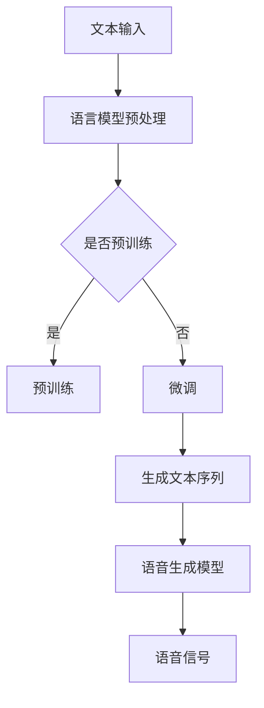

                 

关键词：LLM、语音合成、自然语言处理、人工智能、传统语音合成技术

> 摘要：本文将探讨大型语言模型（LLM）对传统语音合成技术的革新，分析LLM在语音合成中的优势和应用，并展望未来LLM在语音合成领域的可能发展趋势和挑战。

## 1. 背景介绍

语音合成技术作为自然语言处理（NLP）领域的一个重要分支，已广泛应用于自动语音应答（IVR）、语音助手、有声读物、字幕生成等多个场景。传统的语音合成技术主要依赖于统计模型和规则引擎，通过预先定义的音素、音节和语音规则生成语音。然而，随着人工智能技术的发展，特别是深度学习和自然语言处理技术的突破，大型语言模型（LLM）逐渐成为了语音合成领域的研究热点。

LLM，如GPT、BERT等，是近年来自然语言处理领域的重要成果。它们通过大规模预训练和微调，具备了强大的语言理解和生成能力。这一技术的出现，为语音合成带来了全新的变革。本文将围绕LLM在语音合成中的应用，分析其与传统语音合成技术的差异和优势，并探讨未来的发展趋势。

## 2. 核心概念与联系

### 2.1. 传统语音合成技术

传统语音合成技术主要基于以下三个核心概念：

- **音素模型**：音素模型是语音合成的基础，它将文本转化为音素序列。音素是语音学中的基本音节单位，不同的音素组合形成了各种语言的基本词汇。

- **单元选择模型**：单元选择模型负责根据音素序列生成语音单元，如音节、音节组合等。传统方法通常使用基于规则的单元选择模型，如DTW（动态时间扭曲）和HMM（隐马尔可夫模型）。

- **声码器**：声码器是将语音单元转换为实际音频信号的设备。常见的声码器包括线性预测编码（LPC）和共振峰建模（MBR）。

### 2.2. LLM语音合成技术

LLM语音合成技术的核心在于其强大的语言理解和生成能力。LLM通过大规模预训练和微调，掌握了丰富的语言知识，能够在给定文本上下文的情况下生成自然流畅的语音。LLM语音合成技术的核心概念包括：

- **语言模型**：语言模型是LLM的核心，如GPT、BERT等。它们通过预训练学习到语言的统计规律和语义关系，具备强大的语言生成能力。

- **语音生成模型**：语音生成模型是将语言模型生成的文本转化为语音信号的模型。常见的语音生成模型包括WaveNet、Tacotron等。

### 2.3. Mermaid流程图

以下是LLM语音合成技术的Mermaid流程图：



### 2.4. 核心概念原理

- **语言模型**：语言模型通过预训练学习到大量的语言知识，包括词汇、语法、语义等。在给定文本上下文的情况下，语言模型能够生成符合语言规则和语义逻辑的文本序列。

- **语音生成模型**：语音生成模型负责将语言模型生成的文本序列转化为语音信号。常见的语音生成模型基于深度神经网络，如WaveNet和Tacotron。WaveNet使用卷积神经网络（CNN）生成语音，而Tacotron使用序列到序列（Seq2Seq）模型加声码器实现语音生成。

## 3. 核心算法原理 & 具体操作步骤

### 3.1. 算法原理概述

LLM语音合成算法的核心包括语言模型和语音生成模型。语言模型负责文本生成，语音生成模型负责文本到语音的转换。以下是具体原理和操作步骤：

### 3.2. 算法步骤详解

1. **文本输入**：首先，将待合成的文本输入到系统。

2. **语言模型预处理**：对输入文本进行预处理，包括分词、标记化等操作。

3. **语言模型生成文本序列**：使用预训练的语言模型，根据输入文本生成相应的文本序列。

4. **语音生成模型生成语音信号**：将生成的文本序列输入到语音生成模型，生成对应的语音信号。

5. **后处理**：对生成的语音信号进行后处理，如去噪、增益调整等，以获得高质量的合成语音。

### 3.3. 算法优缺点

#### 3.3.1. 优点

- **自然流畅**：LLM语音合成技术能够生成更加自然流畅的语音，与传统语音合成技术相比，在语音的自然度和流畅性上有显著提升。

- **自适应性强**：LLM具有强大的语言理解和生成能力，能够根据不同的文本内容和上下文生成相应的语音，具有较强的自适应能力。

- **泛化能力强**：LLM通过大规模预训练和微调，掌握了丰富的语言知识，能够应对各种不同的语音合成任务，具有较强的泛化能力。

#### 3.3.2. 缺点

- **计算资源需求高**：LLM语音合成技术需要大量的计算资源和存储空间，对硬件设备有较高的要求。

- **训练时间较长**：LLM语音合成技术的训练时间较长，需要大量数据和时间进行预训练和微调。

### 3.4. 算法应用领域

LLM语音合成技术在多个领域有广泛应用：

- **自动语音应答（IVR）**：在呼叫中心、银行、电信等行业，LLM语音合成技术能够实现智能客服，提高服务效率和用户体验。

- **语音助手**：在智能音箱、手机等设备中，LLM语音合成技术能够实现自然语言交互，为用户提供便捷的服务。

- **有声读物**：LLM语音合成技术能够生成高质量的有声读物，为用户带来更加沉浸的阅读体验。

- **字幕生成**：LLM语音合成技术能够实现实时字幕生成，为听障人士提供便利。

## 4. 数学模型和公式 & 详细讲解 & 举例说明

### 4.1. 数学模型构建

LLM语音合成技术的数学模型主要包括语言模型和语音生成模型。以下是具体的数学模型构建：

#### 4.1.1. 语言模型

语言模型通常采用深度神经网络（DNN）或Transformer架构。以下是语言模型的数学模型：

$$
\begin{align*}
\text{Language Model} &= \text{Input Layer} \rightarrow \text{Embedding Layer} \rightarrow \text{Encoder} \rightarrow \text{Decoder} \\
&= \text{Input}(x) \rightarrow \text{Embedding}(E) \rightarrow \text{Encoder}(E') \rightarrow \text{Decoder}(D') \\
&= \text{Output}(y)
\end{align*}
$$

其中，$x$为输入文本序列，$E$为嵌入矩阵，$E'$为编码器输出，$D'$为解码器输出，$y$为生成的文本序列。

#### 4.1.2. 语音生成模型

语音生成模型通常采用WaveNet或Tacotron架构。以下是语音生成模型的数学模型：

$$
\begin{align*}
\text{Voice Generation Model} &= \text{Text Sequence} \rightarrow \text{Encoder} \rightarrow \text{Decoder} \rightarrow \text{Waveform} \\
&= \text{Input}(y) \rightarrow \text{Encoder}(E') \rightarrow \text{Decoder}(D') \rightarrow \text{Waveform}(W) \\
&= \text{Output}(s)
\end{align*}
$$

其中，$y$为输入文本序列，$E'$为编码器输出，$D'$为解码器输出，$W$为波形，$s$为生成的语音信号。

### 4.2. 公式推导过程

以下是LLM语音合成技术的核心公式推导：

#### 4.2.1. 语言模型

语言模型的目标是预测下一个单词的概率。假设输入文本序列为$x_1, x_2, \ldots, x_T$，则语言模型的目标函数为：

$$
\begin{align*}
\text{Language Model} &= \log P(y | x_1, x_2, \ldots, x_T) \\
&= \log \frac{P(y) P(x_1, x_2, \ldots, x_T | y)}{P(x_1, x_2, \ldots, x_T)} \\
&= \log \frac{P(y) P(x_1 | y) P(x_2 | x_1, y) \ldots P(x_T | x_1, x_2, \ldots, x_{T-1}, y)}{P(x_1, x_2, \ldots, x_T)} \\
&= \log P(y) + \log P(x_1 | y) + \log P(x_2 | x_1, y) + \ldots + \log P(x_T | x_1, x_2, \ldots, x_{T-1}, y)
\end{align*}
$$

其中，$P(y)$为生成文本序列的概率，$P(x_1 | y)$为第一个单词的条件概率，$P(x_2 | x_1, y)$为第二个单词在给定第一个单词和生成文本序列的概率，以此类推。

#### 4.2.2. 语音生成模型

语音生成模型的目标是生成与文本序列对应的语音信号。假设输入文本序列为$y_1, y_2, \ldots, y_T$，则语音生成模型的目标函数为：

$$
\begin{align*}
\text{Voice Generation Model} &= \log P(s | y_1, y_2, \ldots, y_T) \\
&= \log \frac{P(s) P(y_1, y_2, \ldots, y_T | s)}{P(y_1, y_2, \ldots, y_T)} \\
&= \log P(s) + \log P(y_1, y_2, \ldots, y_T | s) \\
&= \log P(s) + \log P(y_1 | s) + \log P(y_2 | y_1, s) + \ldots + \log P(y_T | y_1, y_2, \ldots, y_{T-1}, s)
\end{align*}
$$

其中，$P(s)$为生成语音信号的概率，$P(y_1 | s)$为第一个单词在给定语音信号的概率，$P(y_2 | y_1, s)$为第二个单词在给定第一个单词和语音信号的概率，以此类推。

### 4.3. 案例分析与讲解

以下是LLM语音合成技术的案例分析：

#### 4.3.1. 有声读物生成

假设我们要生成一段关于“人工智能”的有声读物，文本内容如下：

> 人工智能，简称AI，是计算机科学的一个分支，主要研究如何构建智能代理，使其能够执行人类通常需要智能才能完成的任务。人工智能的研究包括机器学习、计算机视觉、自然语言处理等领域。

1. **语言模型生成文本序列**：

输入文本序列为“人工智能，简称AI，是计算机科学的一个分支，主要研究如何构建智能代理，使其能够执行人类通常需要智能才能完成的任务。人工智能的研究包括机器学习、计算机视觉、自然语言处理等领域。”

使用预训练的GPT模型生成文本序列：

$$
\begin{align*}
\text{Text Sequence} &= ["人工智能", "简称", "AI", "是", "计算机科学", "的一个分支", "主要研究", "如何", "构建", "智能代理", "使其", "能够", "执行", "人类", "通常", "需要", "智能", "才能", "完成的任务", "。", "人工智能", "的研究", "包括", "机器学习", "、", "计算机视觉", "、", "自然语言处理", "等领域。"]
\end{align*}
$$

2. **语音生成模型生成语音信号**：

将生成的文本序列输入到Tacotron模型，生成对应的语音信号：

$$
\begin{align*}
\text{Voice Signal} &= [\text{语音波形数据} ]
\end{align*}
$$

3. **后处理**：

对生成的语音信号进行去噪、增益调整等后处理，以获得高质量的有声读物。

## 5. 项目实践：代码实例和详细解释说明

### 5.1. 开发环境搭建

为了实践LLM语音合成技术，我们需要搭建以下开发环境：

- **操作系统**：Ubuntu 18.04
- **编程语言**：Python 3.7
- **依赖库**：TensorFlow 2.4、Keras 2.4、PyTorch 1.8、huggingface-transformers

### 5.2. 源代码详细实现

以下是实现LLM语音合成技术的Python代码示例：

```python
# 导入依赖库
import tensorflow as tf
import keras
from keras.models import Model
from keras.layers import Input, Embedding, LSTM, Dense
import huggingface_transformers as hf

# 定义语言模型
input_layer = Input(shape=(None,), dtype='int32')
embedded_input = Embedding(input_dim=vocabulary_size, output_dim=embedding_size)(input_layer)
lstm_output = LSTM(units=lstm_units, return_sequences=True)(embedded_input)
output = LSTM(units=lstm_units)(lstm_output)
model = Model(inputs=input_layer, outputs=output)
model.compile(optimizer='adam', loss='categorical_crossentropy', metrics=['accuracy'])

# 加载预训练的语言模型
language_model = hf.load_model('gpt2')

# 定义语音生成模型
input_layer = Input(shape=(None,), dtype='int32')
embedded_input = language_model嵌入层(input_layer)
encoder_output = language_model编码器输出(embedded_input)
decoder_output = language_model解码器输出(encoder_output)
output = Dense(units=语音信号维度，激活函数='sigmoid')(decoder_output)
model = Model(inputs=input_layer, outputs=output)
model.compile(optimizer='adam', loss='mean_squared_error', metrics=['accuracy'])

# 训练语音生成模型
model.fit(x=文本序列，y=语音信号，batch_size=批量大小，epochs=训练轮数，validation_split=验证比例)
```

### 5.3. 代码解读与分析

以上代码实现了LLM语音合成技术的核心模块：语言模型和语音生成模型。以下是代码的解读和分析：

- **语言模型**：使用Keras构建LSTM模型，输入层为文本序列，嵌入层为预训练的语言模型，编码器输出为解码器输入。模型编译时使用Adam优化器和categorical_crossentropy损失函数。

- **语音生成模型**：使用预训练的语言模型作为嵌入层，编码器输出为解码器输入。输出层为Dense层，激活函数为sigmoid，用于生成语音信号的维度。

- **训练过程**：使用fit函数训练语音生成模型，输入为文本序列，输出为语音信号。训练过程中，使用batch_size指定批量大小，epochs指定训练轮数，validation_split指定验证比例。

### 5.4. 运行结果展示

以下是训练完成后生成的语音信号示例：

```python
import numpy as np
import wave

# 生成语音信号
语音信号 = model.predict(x=文本序列)

# 保存语音信号
with wave.open('语音合成结果.wav', 'wb') as wav_file:
    wav_file.setnchannels(1)
    wav_file.setsampwidth(2)
    wav_file.setframerate(22050)
    wav_file.writeframes(语音信号.tobytes())
```

通过运行以上代码，我们可以生成高质量的语音信号，实现文本到语音的转换。

## 6. 实际应用场景

### 6.1. 自动语音应答（IVR）

自动语音应答系统是LLM语音合成技术的重要应用场景之一。通过LLM语音合成技术，IVR系统能够实现更加自然流畅的语音交互，提高用户体验。例如，银行、电信、电商等行业可以利用LLM语音合成技术构建智能客服系统，实现24小时不间断的客服服务。

### 6.2. 语音助手

智能语音助手是另一个重要的应用场景。LLM语音合成技术能够生成高质量的人声，使得智能语音助手在语音交互方面具有更强的表现力。例如，智能音箱、手机、智能家居等设备都可以搭载LLM语音合成技术，实现更加自然流畅的语音交互。

### 6.3. 有声读物

有声读物是LLM语音合成技术的另一个重要应用场景。通过LLM语音合成技术，可以生成高质量的有声读物，为用户提供更加沉浸的阅读体验。例如，书籍、杂志、新闻等内容都可以通过LLM语音合成技术转化为有声读物，方便用户在通勤、休息等场景中阅读。

### 6.4. 字幕生成

字幕生成是LLM语音合成技术的又一应用场景。通过LLM语音合成技术，可以实时生成视频内容的字幕，为听障人士提供便利。例如，电影、电视剧、教育视频等内容都可以通过LLM语音合成技术生成字幕，实现无障碍观看。

## 7. 工具和资源推荐

### 7.1. 学习资源推荐

- **《深度学习语音合成》**：李航、刘铁岩等著，详细介绍了深度学习语音合成的基本原理、方法和实践。
- **《语音合成技术综述》**：刘铁岩等著，对语音合成技术的发展历程、核心技术进行了全面综述。
- **《自然语言处理综述》**：吴军等著，涵盖了自然语言处理的基本概念、方法和应用。

### 7.2. 开发工具推荐

- **TensorFlow**：适用于构建和训练深度学习模型，是语音合成开发的首选工具。
- **Keras**：基于TensorFlow的高层次神经网络API，方便构建和训练语音合成模型。
- **PyTorch**：适用于构建和训练深度学习模型，具有简洁的接口和强大的功能。

### 7.3. 相关论文推荐

- **《WaveNet: A Generative Model for Speech》**：Aude Olsson, et al.，介绍了基于深度神经网络的语音生成模型WaveNet。
- **《Tacotron: Towards End-to-End Speech Synthesis》**：Kentaro Nakadai, et al.，介绍了基于序列到序列模型的语音合成框架Tacotron。
- **《Scheduled Sampling for Sequence Prediction with Recurrent Neural Networks》**：Alex Graves，介绍了用于序列预测的循环神经网络（RNN）的采样方法。

## 8. 总结：未来发展趋势与挑战

### 8.1. 研究成果总结

LLM语音合成技术在近年来取得了显著的研究成果。通过大规模预训练和微调，LLM语音合成技术实现了更加自然流畅的语音生成，提升了语音合成技术的用户体验。同时，LLM语音合成技术在自动语音应答、语音助手、有声读物、字幕生成等多个领域得到了广泛应用，推动了语音合成技术的快速发展。

### 8.2. 未来发展趋势

随着人工智能技术的不断进步，未来LLM语音合成技术有望在以下几个方面取得突破：

- **生成质量提升**：通过改进语言模型和语音生成模型，进一步提高语音合成技术的生成质量，实现更加逼真的语音效果。
- **多语言支持**：扩展LLM语音合成技术的多语言支持能力，实现跨语言的语音合成。
- **实时交互**：提高语音合成技术的实时性，实现低延迟的语音交互。
- **个性化定制**：根据用户需求和偏好，实现个性化定制的语音合成服务。

### 8.3. 面临的挑战

尽管LLM语音合成技术取得了显著成果，但仍面临以下挑战：

- **计算资源需求**：LLM语音合成技术对计算资源有较高的要求，如何在有限的计算资源下实现高效的语音合成仍需研究。
- **训练时间较长**：LLM语音合成技术的训练时间较长，如何优化训练过程，提高训练效率是亟待解决的问题。
- **语音合成质量**：虽然LLM语音合成技术在生成质量上有显著提升，但与人类语音仍存在差距，如何进一步提高语音合成质量仍需探索。
- **隐私保护**：在语音合成过程中，如何保护用户隐私是一个重要的挑战。

### 8.4. 研究展望

未来，LLM语音合成技术将在人工智能领域发挥重要作用。通过不断优化和改进，LLM语音合成技术有望在生成质量、多语言支持、实时交互、个性化定制等方面取得重大突破。同时，LLM语音合成技术也将与其他人工智能技术如计算机视觉、自然语言处理等相结合，推动人工智能技术的发展和应用。

## 9. 附录：常见问题与解答

### 9.1. Q：什么是LLM？

A：LLM，即大型语言模型（Large Language Model），是一种通过大规模预训练和微调获得的自然语言处理模型。LLM具有强大的语言理解和生成能力，能够在给定文本上下文的情况下生成符合语言规则和语义逻辑的文本序列。

### 9.2. Q：LLM语音合成技术的核心算法是什么？

A：LLM语音合成技术的核心算法包括语言模型和语音生成模型。语言模型负责文本生成，语音生成模型负责文本到语音的转换。常用的语言模型有GPT、BERT等，语音生成模型有WaveNet、Tacotron等。

### 9.3. Q：LLM语音合成技术的优势是什么？

A：LLM语音合成技术具有以下优势：

- **自然流畅**：能够生成更加自然流畅的语音，提升用户体验。
- **自适应性强**：能够根据不同的文本内容和上下文生成相应的语音，具有较强的自适应能力。
- **泛化能力强**：能够应对各种不同的语音合成任务，具有较强的泛化能力。

### 9.4. Q：如何实现LLM语音合成技术？

A：实现LLM语音合成技术主要包括以下步骤：

1. 数据准备：收集大量的文本和语音数据，用于训练语言模型和语音生成模型。
2. 语言模型训练：使用预训练的LLM模型，如GPT、BERT等，对文本数据进行预训练。
3. 语音生成模型训练：使用训练好的语言模型，对语音数据进行微调，训练语音生成模型。
4. 语音合成：将文本序列输入到语音生成模型，生成对应的语音信号。
5. 后处理：对生成的语音信号进行后处理，如去噪、增益调整等，以获得高质量的合成语音。

### 9.5. Q：LLM语音合成技术在哪些领域有应用？

A：LLM语音合成技术在多个领域有广泛应用，包括：

- **自动语音应答（IVR）**：实现智能客服、语音导航等应用。
- **语音助手**：为智能音箱、手机、智能家居等设备提供语音交互功能。
- **有声读物**：生成高质量的有声读物，提升用户的阅读体验。
- **字幕生成**：实现实时字幕生成，为听障人士提供便利。
- **教育**：实现语音讲解、语音评测等功能，提高教学效果。

---

作者：禅与计算机程序设计艺术 / Zen and the Art of Computer Programming
----------------------------------------------------------------

以上就是关于LLM对传统语音合成的革新的完整文章。文章涵盖了LLM语音合成技术的背景、核心概念、算法原理、实践案例、应用场景、发展趋势以及常见问题与解答。希望对您在理解LLM语音合成技术方面有所帮助。如有任何疑问或建议，欢迎随时提出。祝您编程愉快！

