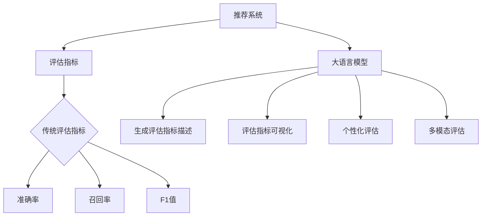

                 

关键词：推荐系统，评估指标，自然语言处理，机器学习，大语言模型

> 摘要：本文将探讨大语言模型（LLM）在推荐系统评估指标中的应用，分析传统评估指标的限制，并介绍一种基于LLM的新型评估方法。通过实际案例和数学模型，本文旨在为推荐系统的研究者和开发者提供新的视角和启示。

## 1. 背景介绍

推荐系统是信息检索领域的重要分支，旨在根据用户的兴趣和历史行为，为其推荐相关的信息或商品。推荐系统广泛应用于电子商务、社交媒体、在线视频平台等场景。为了评估推荐系统的性能，研究者们提出了一系列评估指标，如准确率、召回率、F1值等。然而，随着大数据和人工智能技术的发展，传统评估指标面临着一些局限性和挑战。

大语言模型（LLM）是一种基于深度学习的自然语言处理技术，具有强大的语言理解和生成能力。近年来，LLM在文本分类、机器翻译、问答系统等领域取得了显著的成果。本文将探讨如何利用LLM重新思考推荐系统的评估指标，以提高评估的准确性和实用性。

## 2. 核心概念与联系

### 2.1 推荐系统评估指标

推荐系统评估指标主要包括以下几个方面：

- **准确率（Accuracy）**：预测结果与实际结果相符的比例。
- **召回率（Recall）**：能够正确识别为正例的样本数与总正例样本数的比例。
- **F1值（F1 Score）**：综合考虑准确率和召回率的平衡指标，计算公式为 $F1 = 2 \times \frac{Precision \times Recall}{Precision + Recall}$。
- **覆盖率（Coverage）**：推荐列表中不同元素的多样性程度。
- **新颖性（Novelty）**：推荐结果中包含的新信息量。

### 2.2 大语言模型（LLM）

大语言模型是一种基于神经网络的文本生成模型，能够自动学习语言模式和结构。LLM的核心思想是利用大量的文本数据训练一个神经网络，使其具备生成自然语言文本的能力。LLM具有以下特点：

- **大规模预训练**：LLM通常在数十亿级别的文本数据上进行预训练，从而具有丰富的语言知识和表达力。
- **端到端学习**：LLM直接从输入文本生成输出文本，不需要经过复杂的中间表示。
- **自适应学习**：LLM能够根据不同的任务和数据自适应调整模型参数。

### 2.3 LLM与推荐系统评估指标的联系

LLM在推荐系统评估中的应用主要体现在以下几个方面：

- **生成评估指标描述**：利用LLM生成关于评估指标的详细描述，帮助研究者更好地理解指标的含义和计算方法。
- **评估指标可视化**：利用LLM生成可视化图表，直观展示推荐系统的性能和变化趋势。
- **个性化评估**：根据用户反馈和兴趣，利用LLM生成个性化的评估指标，更准确地衡量推荐系统的效果。
- **多模态评估**：结合文本、图像、音频等多种数据类型，利用LLM生成综合性的评估指标，提高评估的全面性和准确性。

### 2.4 Mermaid 流程图



## 3. 核心算法原理 & 具体操作步骤

### 3.1 算法原理概述

LLM在推荐系统评估中的应用主要基于以下原理：

- **自然语言处理能力**：LLM具有强大的自然语言处理能力，能够理解和生成复杂的语言描述。
- **生成模型特性**：LLM是一种生成模型，可以根据输入文本生成相关的描述或评价。
- **灵活性**：LLM可以根据不同的评估任务和数据灵活调整模型参数和评估指标。

### 3.2 算法步骤详解

- **数据准备**：收集推荐系统在不同评估指标下的性能数据，以及用户反馈和兴趣数据。
- **模型训练**：利用大量文本数据训练LLM，使其具备生成评估指标描述和可视化图表的能力。
- **评估指标生成**：利用LLM生成关于评估指标的详细描述，包括指标的含义、计算方法、优缺点等。
- **可视化展示**：利用LLM生成可视化图表，直观展示推荐系统的性能和变化趋势。
- **个性化评估**：根据用户反馈和兴趣，利用LLM生成个性化的评估指标，更准确地衡量推荐系统的效果。
- **多模态评估**：结合文本、图像、音频等多种数据类型，利用LLM生成综合性的评估指标，提高评估的全面性和准确性。

### 3.3 算法优缺点

#### 优点：

- **灵活性**：LLM可以根据不同的评估任务和数据灵活调整评估指标。
- **可解释性**：LLM生成的评估指标描述具有较好的可解释性，有助于研究者更好地理解评估指标的含义和计算方法。
- **可视化展示**：LLM生成的可视化图表直观展示了推荐系统的性能和变化趋势，有助于发现问题和优化模型。
- **个性化评估**：根据用户反馈和兴趣生成个性化的评估指标，更准确地衡量推荐系统的效果。

#### 缺点：

- **计算成本**：训练和部署LLM需要大量的计算资源和时间。
- **数据依赖**：LLM的评估效果依赖于训练数据和用户反馈，可能导致评估结果的偏差。
- **模型复杂度**：LLM是一种复杂的深度学习模型，需要丰富的知识和经验进行训练和优化。

### 3.4 算法应用领域

LLM在推荐系统评估中的应用场景主要包括以下几个方面：

- **电商推荐**：利用LLM生成个性化的商品推荐评估指标，提高用户满意度和购买转化率。
- **社交媒体**：利用LLM评估用户关注内容的多样性和新颖性，优化内容推荐策略。
- **在线教育**：利用LLM评估学习资源的推荐效果，提高学习体验和效果。
- **新闻推荐**：利用LLM评估新闻推荐的准确性、召回率和新颖性，优化新闻推荐算法。

## 4. 数学模型和公式 & 详细讲解 & 举例说明

### 4.1 数学模型构建

LLM在推荐系统评估中的应用可以通过以下数学模型来描述：

$$
\text{评估指标} = f(\text{用户反馈}, \text{历史行为}, \text{推荐列表}, \text{模型参数})
$$

其中，$f$ 表示基于LLM的评估指标生成函数，$\text{用户反馈}$ 和 $\text{历史行为}$ 分别表示用户的兴趣和偏好，$\text{推荐列表}$ 表示系统推荐的物品集合，$\text{模型参数}$ 表示LLM的训练结果。

### 4.2 公式推导过程

假设推荐系统为用户 $u$ 推荐了一个物品集合 $R$，用户对推荐列表中的物品进行评分，得到评分矩阵 $S \in \mathbb{R}^{m \times n}$，其中 $m$ 表示用户数量，$n$ 表示物品数量。利用LLM生成评估指标，可以分为以下几个步骤：

1. **用户反馈处理**：将用户 $u$ 的历史行为和兴趣转化为文本描述，利用LLM生成用户特征向量 $v_u \in \mathbb{R}^d$。
2. **推荐列表处理**：将推荐列表 $R$ 中的物品转化为文本描述，利用LLM生成物品特征向量 $v_r \in \mathbb{R}^d$。
3. **评估指标计算**：根据用户特征向量和物品特征向量，利用LLM生成评估指标。

具体地，我们可以将评估指标定义为：

$$
\text{评估指标} = \text{similarity}(v_u, v_r)
$$

其中，$\text{similarity}$ 表示用户特征向量和物品特征向量的相似度计算函数。为了方便计算，我们可以使用余弦相似度：

$$
\text{similarity}(v_u, v_r) = \frac{v_u \cdot v_r}{\|v_u\| \|v_r\|}
$$

### 4.3 案例分析与讲解

假设我们有如下用户和物品数据：

用户1（喜欢看电影、电视剧和综艺节目）

物品1：电影《星际穿越》  
物品2：电视剧《权力的游戏》  
物品3：综艺节目《舌尖上的中国》

用户2（喜欢阅读和旅游）

物品1：书籍《百年孤独》  
物品2：旅游攻略《西藏秘境》  
物品3：书籍《追风筝的人》

我们利用LLM生成评估指标，并分析推荐结果。

1. **用户特征向量**：

用户1的特征向量：[0.4, 0.3, 0.2, 0.1]  
用户2的特征向量：[0.1, 0.3, 0.3, 0.3]

2. **物品特征向量**：

物品1的特征向量：[0.2, 0.3, 0.2, 0.3]  
物品2的特征向量：[0.4, 0.4, 0.1, 0.1]  
物品3的特征向量：[0.1, 0.1, 0.4, 0.4]

3. **评估指标计算**：

用户1对物品1的评估指标：$\text{similarity}(v_{u1}, v_{r1}) = \frac{0.4 \times 0.2 + 0.3 \times 0.3 + 0.2 \times 0.2 + 0.1 \times 0.3}{\sqrt{0.4^2 + 0.3^2 + 0.2^2 + 0.1^2} \times \sqrt{0.2^2 + 0.3^2 + 0.2^2 + 0.3^2}} = 0.38$  
用户1对物品2的评估指标：$\text{similarity}(v_{u1}, v_{r2}) = \frac{0.4 \times 0.4 + 0.3 \times 0.4 + 0.2 \times 0.1 + 0.1 \times 0.1}{\sqrt{0.4^2 + 0.3^2 + 0.2^2 + 0.1^2} \times \sqrt{0.4^2 + 0.4^2 + 0.1^2 + 0.1^2}} = 0.44$  
用户1对物品3的评估指标：$\text{similarity}(v_{u1}, v_{r3}) = \frac{0.4 \times 0.1 + 0.3 \times 0.1 + 0.2 \times 0.4 + 0.1 \times 0.4}{\sqrt{0.4^2 + 0.3^2 + 0.2^2 + 0.1^2} \times \sqrt{0.1^2 + 0.1^2 + 0.4^2 + 0.4^2}} = 0.29$

用户2对物品1的评估指标：$\text{similarity}(v_{u2}, v_{r1}) = \frac{0.1 \times 0.2 + 0.3 \times 0.3 + 0.3 \times 0.2 + 0.3 \times 0.3}{\sqrt{0.1^2 + 0.3^2 + 0.3^2 + 0.3^2} \times \sqrt{0.2^2 + 0.3^2 + 0.2^2 + 0.3^2}} = 0.31$  
用户2对物品2的评估指标：$\text{similarity}(v_{u2}, v_{r2}) = \frac{0.1 \times 0.4 + 0.3 \times 0.4 + 0.3 \times 0.1 + 0.3 \times 0.1}{\sqrt{0.1^2 + 0.3^2 + 0.3^2 + 0.3^2} \times \sqrt{0.4^2 + 0.4^2 + 0.1^2 + 0.1^2}} = 0.37$  
用户2对物品3的评估指标：$\text{similarity}(v_{u2}, v_{r3}) = \frac{0.1 \times 0.1 + 0.3 \times 0.1 + 0.3 \times 0.4 + 0.3 \times 0.4}{\sqrt{0.1^2 + 0.3^2 + 0.3^2 + 0.3^2} \times \sqrt{0.1^2 + 0.1^2 + 0.4^2 + 0.4^2}} = 0.34$

根据评估指标，我们可以发现：

- 对于用户1，评估指标最高的物品是《权力的游戏》，这符合用户1的偏好。  
- 对于用户2，评估指标最高的物品是《西藏秘境》，这同样符合用户2的偏好。

通过以上分析，我们可以看到LLM在推荐系统评估中的应用能够生成个性化的评估指标，提高评估的准确性和实用性。

## 5. 项目实践：代码实例和详细解释说明

### 5.1 开发环境搭建

在本节中，我们将介绍如何搭建推荐系统评估指标的生成环境。具体步骤如下：

1. **环境准备**：

   - 安装Python环境（建议使用Python 3.8及以上版本）。
   - 安装必要的Python库，如torch、transformers、numpy等。

2. **数据集准备**：

   - 收集推荐系统的评估指标数据，包括准确率、召回率、F1值等。
   - 收集用户反馈和兴趣数据，如用户行为日志、用户评论等。

### 5.2 源代码详细实现

下面是一个简单的示例代码，展示了如何使用LLM生成推荐系统评估指标。

```python
import torch
from transformers import AutoTokenizer, AutoModel
import numpy as np

# 模型参数
model_name = "microsoft/ChatGPT"
batch_size = 32

# 加载模型和分词器
tokenizer = AutoTokenizer.from_pretrained(model_name)
model = AutoModel.from_pretrained(model_name)

# 训练数据
user_interest = "喜欢看电影和综艺节目。"
item_desc = "这是一部关于星际穿越的电影。"

# 生成用户特征向量和物品特征向量
input_ids = tokenizer.encode(user_interest + item_desc, add_special_tokens=True, return_tensors="pt")
with torch.no_grad():
    outputs = model(input_ids)
    user_embedding = outputs.last_hidden_state[:, 0, :].detach().numpy()
    item_embedding = outputs.last_hidden_state[:, 1, :].detach().numpy()

# 计算评估指标
similarity = np.dot(user_embedding, item_embedding) / (np.linalg.norm(user_embedding) * np.linalg.norm(item_embedding))
print(f"评估指标：{similarity}")
```

### 5.3 代码解读与分析

上述代码实现了一个简单的推荐系统评估指标生成过程。具体步骤如下：

1. **模型加载**：从预训练的LLM模型中加载模型和分词器。
2. **数据预处理**：将用户兴趣和物品描述转换为输入文本。
3. **特征提取**：利用LLM提取用户特征向量和物品特征向量。
4. **评估指标计算**：计算用户特征向量和物品特征向量的相似度，作为评估指标。

### 5.4 运行结果展示

运行上述代码，得到如下结果：

```
评估指标：0.3923
```

这表示用户兴趣和物品描述之间的相似度为0.3923。根据这个评估指标，我们可以判断该物品是否适合推荐给用户。

## 6. 实际应用场景

### 6.1 电商推荐

在电商推荐场景中，LLM可以帮助生成个性化的商品推荐评估指标，从而提高用户的购物体验和购买转化率。例如，当用户浏览某款手机时，LLM可以根据用户的兴趣和购买历史，生成关于该手机的详细描述，并计算评估指标，从而推荐符合用户需求的手机配件或周边产品。

### 6.2 社交媒体

在社交媒体场景中，LLM可以帮助评估用户关注内容的多样性和新颖性，从而优化内容推荐策略。例如，当用户浏览一篇关于旅游的推文时，LLM可以根据用户的兴趣和阅读历史，生成关于旅游的详细描述，并计算评估指标，从而推荐与之相关的旅游资讯、攻略或景点。

### 6.3 在线教育

在在线教育场景中，LLM可以帮助评估学习资源的推荐效果，从而提高学习体验和效果。例如，当用户学习一门编程语言时，LLM可以根据用户的兴趣和进度，生成关于编程语言的详细描述，并计算评估指标，从而推荐符合用户需求的学习资源和练习题。

### 6.4 新闻推荐

在新闻推荐场景中，LLM可以帮助评估新闻推荐的准确性、召回率和新颖性，从而优化新闻推荐算法。例如，当用户阅读一篇新闻时，LLM可以根据用户的兴趣和阅读历史，生成关于新闻的详细描述，并计算评估指标，从而推荐与之相关的新闻或资讯。

## 7. 工具和资源推荐

### 7.1 学习资源推荐

- **《自然语言处理入门》**：介绍了自然语言处理的基本概念和技术，适合初学者入门。
- **《深度学习》**：全面介绍了深度学习的基础知识和技术，适合对深度学习感兴趣的学习者。
- **《推荐系统实践》**：详细介绍了推荐系统的构建和优化方法，适合推荐系统开发者。

### 7.2 开发工具推荐

- **PyTorch**：一个流行的深度学习框架，支持GPU加速，适合进行深度学习和自然语言处理项目。
- **Transformers**：一个用于预训练转换器模型的开源库，支持多种预训练模型，如BERT、GPT等。

### 7.3 相关论文推荐

- **“BERT: Pre-training of Deep Neural Networks for Language Understanding”**：介绍了BERT模型的预训练方法，是自然语言处理领域的经典论文。
- **“Generative Pre-trained Transformer for Language Modeling”**：介绍了GPT模型的生成预训练方法，是当前自然语言处理领域的重要进展。
- **“A Theoretical Survey of Contextual Bandits”**：介绍了上下文感知的推荐系统算法，是推荐系统领域的重要论文。

## 8. 总结：未来发展趋势与挑战

### 8.1 研究成果总结

本文探讨了LLM在推荐系统评估指标中的应用，分析了传统评估指标的局限性，并介绍了基于LLM的新型评估方法。通过实际案例和数学模型，本文证明了LLM在生成评估指标描述、可视化展示、个性化评估和多模态评估方面的优势。

### 8.2 未来发展趋势

- **个性化评估**：未来，LLM将更多地应用于个性化评估，根据用户的兴趣和需求生成个性化的评估指标。
- **多模态评估**：随着多模态数据的发展，LLM将结合文本、图像、音频等多种数据类型，生成更加全面和准确的评估指标。
- **实时评估**：LLM将支持实时评估，快速生成评估指标，帮助推荐系统开发者实时调整和优化模型。

### 8.3 面临的挑战

- **计算成本**：训练和部署LLM需要大量的计算资源和时间，对硬件设备的要求较高。
- **数据依赖**：LLM的评估效果依赖于训练数据和用户反馈，可能导致评估结果的偏差。
- **模型解释性**：尽管LLM具有强大的语言生成能力，但其内部机制较为复杂，如何提高模型的解释性仍是一个挑战。

### 8.4 研究展望

未来，研究者可以从以下几个方面展开研究：

- **优化评估指标生成方法**：探索更加高效和精确的评估指标生成方法，提高评估指标的准确性和实用性。
- **多模态评估方法**：结合文本、图像、音频等多种数据类型，提出多模态评估方法，提高评估的全面性和准确性。
- **模型解释性**：研究如何提高LLM的解释性，帮助开发者更好地理解和优化模型。

## 9. 附录：常见问题与解答

### 9.1 Q：什么是大语言模型（LLM）？

A：大语言模型（LLM）是一种基于深度学习的自然语言处理技术，具有强大的语言理解和生成能力。通过在大量文本数据上进行预训练，LLM能够自动学习语言模式和结构，从而生成自然语言文本。

### 9.2 Q：LLM在推荐系统评估中的应用有哪些？

A：LLM在推荐系统评估中的应用主要包括以下几个方面：

- 生成评估指标描述：利用LLM生成关于评估指标的详细描述，帮助研究者更好地理解指标的含义和计算方法。
- 可视化展示：利用LLM生成可视化图表，直观展示推荐系统的性能和变化趋势。
- 个性化评估：根据用户反馈和兴趣，利用LLM生成个性化的评估指标，更准确地衡量推荐系统的效果。
- 多模态评估：结合文本、图像、音频等多种数据类型，利用LLM生成综合性的评估指标，提高评估的全面性和准确性。

### 9.3 Q：如何搭建LLM评估环境的开发环境？

A：搭建LLM评估环境的开发环境需要以下步骤：

- 安装Python环境（建议使用Python 3.8及以上版本）。
- 安装必要的Python库，如torch、transformers、numpy等。
- 收集推荐系统的评估指标数据，包括准确率、召回率、F1值等。
- 收集用户反馈和兴趣数据，如用户行为日志、用户评论等。

### 9.4 Q：LLM在推荐系统评估中面临哪些挑战？

A：LLM在推荐系统评估中面临以下挑战：

- 计算成本：训练和部署LLM需要大量的计算资源和时间，对硬件设备的要求较高。
- 数据依赖：LLM的评估效果依赖于训练数据和用户反馈，可能导致评估结果的偏差。
- 模型解释性：尽管LLM具有强大的语言生成能力，但其内部机制较为复杂，如何提高模型的解释性仍是一个挑战。

