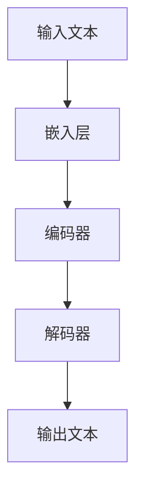
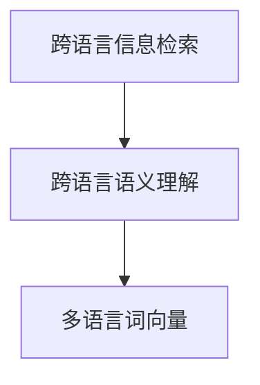
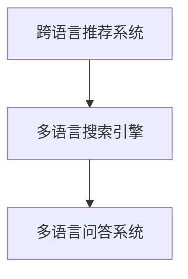

                 

关键词：大型语言模型（LLM），跨语言推荐，多语言处理，技术进展，算法原理，应用领域

摘要：随着全球化的深入发展，多语言处理技术变得愈发重要。本文将探讨大型语言模型（LLM）在推荐系统中支持多语言的技术进展。文章首先介绍了LLM的基本概念和原理，然后详细分析了多语言支持的关键技术，如跨语言信息检索、跨语言语义理解等。最后，本文讨论了LLM在多语言推荐系统中的实际应用场景和未来展望。

## 1. 背景介绍

### 大型语言模型（LLM）的基本概念

大型语言模型（LLM）是一种基于深度学习的自然语言处理（NLP）模型，能够对文本数据进行高效处理和理解。与传统的规则驱动和统计模型相比，LLM具有更强的语义理解能力和自适应能力。LLM通常通过预训练和微调两个阶段进行构建。在预训练阶段，模型在大规模文本语料库上进行无监督学习，以学习语言的基本结构和模式。在微调阶段，模型根据特定任务进行有监督训练，以优化模型在目标任务上的性能。

### 多语言支持技术的必要性

在全球化的背景下，多语言处理技术变得愈发重要。一方面，互联网上的内容越来越丰富多样，涉及多种语言。例如，在电商平台上，产品评论、用户评价等数据可能来自不同的语言。另一方面，许多跨国公司需要处理多语言的数据，以便更好地服务全球客户。因此，开发能够支持多语言处理的推荐系统具有重要的实际意义。

### 多语言支持技术的现状

当前，多语言支持技术已经取得了显著进展。例如，跨语言信息检索和跨语言语义理解等技术使得模型能够处理不同语言之间的语义关联。同时，多语言词向量模型和跨语言翻译模型等技术的应用，也极大地提高了多语言处理的性能。

## 2. 核心概念与联系

### 大型语言模型（LLM）的工作原理

LLM通常由以下几个核心组件构成：

- **嵌入层（Embedding Layer）**：将输入文本映射为高维向量。
- **编码器（Encoder）**：对输入文本向量进行编码，生成上下文表示。
- **解码器（Decoder）**：根据编码器生成的上下文表示生成输出文本。

图 1：大型语言模型（LLM）的基本架构



### 多语言支持技术的核心概念

多语言支持技术主要包括以下核心概念：

- **跨语言信息检索（Cross-Lingual Information Retrieval, CLIR）**：利用跨语言词典和语义相似性度量，实现不同语言文本之间的信息检索。
- **跨语言语义理解（Cross-Lingual Semantic Understanding）**：通过跨语言翻译和语义对齐等技术，实现不同语言文本之间的语义理解。
- **多语言词向量（Multilingual Word Vectors）**：通过共享词向量和多语言嵌入等技术，实现不同语言词向量之间的共享和迁移。

图 2：多语言支持技术的核心概念



### 多语言支持技术的应用场景

多语言支持技术广泛应用于以下应用场景：

- **跨语言推荐系统（Multilingual Recommendation Systems）**：支持不同语言用户之间的推荐。
- **多语言搜索引擎（Multilingual Search Engines）**：实现跨语言搜索和检索。
- **多语言问答系统（Multilingual Question Answering Systems）**：支持不同语言用户的问题回答。

图 3：多语言支持技术的应用场景



## 3. 核心算法原理 & 具体操作步骤

### 3.1 算法原理概述

多语言支持技术的核心算法主要包括以下几种：

- **跨语言信息检索（CLIR）**：利用跨语言词典和语义相似性度量，实现不同语言文本之间的信息检索。
- **跨语言语义理解（CLES）**：通过跨语言翻译和语义对齐等技术，实现不同语言文本之间的语义理解。
- **多语言词向量（MWV）**：通过共享词向量和多语言嵌入等技术，实现不同语言词向量之间的共享和迁移。

### 3.2 算法步骤详解

#### 3.2.1 跨语言信息检索（CLIR）

1. **词典构建**：构建源语言和目标语言之间的跨语言词典，通常使用基于词频、WordNet 等资源。
2. **文本预处理**：对源语言和目标语言文本进行分词、词性标注等预处理操作。
3. **相似性度量**：利用相似性度量方法（如余弦相似度、Jaccard 系数等）计算源语言文本和目标语言文本之间的相似性。
4. **检索排序**：根据相似性度量结果对目标语言文本进行排序，实现跨语言信息检索。

#### 3.2.2 跨语言语义理解（CLES）

1. **跨语言翻译**：利用神经机器翻译模型（如BERT、GPT等）将源语言文本翻译为目标语言文本。
2. **语义对齐**：通过语义对齐算法（如词性标注、句法分析等）将源语言文本和目标语言文本的语义信息进行对齐。
3. **语义理解**：利用语义理解模型（如BERT、GPT等）对目标语言文本进行语义理解，生成语义表示。

#### 3.2.3 多语言词向量（MWV）

1. **词向量嵌入**：将源语言和目标语言词汇映射为高维向量空间，通常使用预训练的词向量模型（如GloVe、FastText等）。
2. **共享词向量**：通过共享词向量实现不同语言词向量之间的共享，从而降低模型训练成本。
3. **多语言嵌入**：利用多语言嵌入技术（如XLM、mBERT等）将不同语言词向量嵌入到同一个向量空间中。

### 3.3 算法优缺点

#### 优点

- **高效性**：利用深度学习模型实现跨语言信息检索、语义理解和词向量嵌入，具有高效性。
- **灵活性**：算法能够灵活适应不同语言环境，支持多种语言之间的信息检索和语义理解。
- **可扩展性**：算法可扩展性强，能够支持更多语言的引入和融合。

#### 缺点

- **计算资源消耗**：深度学习模型通常需要大量计算资源，对硬件要求较高。
- **数据依赖性**：算法对训练数据有较高依赖，数据质量直接影响算法性能。
- **准确性**：算法在跨语言处理过程中可能存在一定误差，需要进一步优化。

### 3.4 算法应用领域

多语言支持技术的核心算法广泛应用于以下领域：

- **跨语言推荐系统**：支持不同语言用户之间的推荐，提高用户体验。
- **多语言搜索引擎**：实现跨语言搜索和检索，提高信息获取效率。
- **多语言问答系统**：支持不同语言用户的问题回答，提供智能服务。
- **跨语言文本分析**：支持跨语言文本的情感分析、话题检测等任务。

## 4. 数学模型和公式 & 详细讲解 & 举例说明

### 4.1 数学模型构建

多语言支持技术的数学模型主要包括以下核心组成部分：

- **词向量模型**：用于将词汇映射为高维向量空间。
- **翻译模型**：用于将源语言文本翻译为目标语言文本。
- **语义理解模型**：用于对目标语言文本进行语义理解。

### 4.2 公式推导过程

#### 4.2.1 词向量模型

词向量模型通常采用以下公式：

\[ \text{vec}(w) = \sum_{i=1}^{n} w_i \cdot v_i \]

其中，\( \text{vec}(w) \)表示词向量，\( w_i \)表示词在词汇表中的索引，\( v_i \)表示对应词向量的值。

#### 4.2.2 翻译模型

翻译模型通常采用神经机器翻译模型，如序列到序列（Seq2Seq）模型。其核心公式如下：

\[ \text{P}_{\theta}(\text{y}|\text{x}) = \frac{\exp(\text{f}(\theta, \text{x}, \text{y}))}{\sum_{\text{y}' \in \text{Y}} \exp(\text{f}(\theta, \text{x}, \text{y}'))} \]

其中，\( \text{P}_{\theta}(\text{y}|\text{x}) \)表示翻译概率，\( \text{f}(\theta, \text{x}, \text{y}) \)表示模型在给定参数 \( \theta \)，输入文本 \( \text{x} \) 和输出文本 \( \text{y} \) 下的得分。

#### 4.2.3 语义理解模型

语义理解模型通常采用预训练的深度学习模型，如BERT、GPT等。其核心公式如下：

\[ \text{P}_{\theta}(\text{y}|\text{x}) = \frac{\exp(\text{f}(\theta, \text{x}, \text{y}))}{\sum_{\text{y}' \in \text{Y}} \exp(\text{f}(\theta, \text{x}, \text{y}'))} \]

其中，\( \text{P}_{\theta}(\text{y}|\text{x}) \)表示语义理解概率，\( \text{f}(\theta, \text{x}, \text{y}) \)表示模型在给定参数 \( \theta \)，输入文本 \( \text{x} \) 和输出文本 \( \text{y} \) 下的得分。

### 4.3 案例分析与讲解

#### 4.3.1 跨语言信息检索

假设我们有一个英文文档 \( \text{x}_1 = \{\text{Hello}, \text{world}\} \) 和一个中文文档 \( \text{x}_2 = \{\text{你好}, \text{世界}\} \)。我们利用跨语言词典和语义相似性度量方法进行信息检索。

1. **词典构建**：构建英文到中文的跨语言词典，如 \( \{\text{Hello} \rightarrow \text{你好}, \text{world} \rightarrow \text{世界}\} \)。
2. **文本预处理**：对两个文档进行分词和词性标注，如 \( \text{x}_1 = \{\text{Hello}, \text{world}\} \) 和 \( \text{x}_2 = \{\text{你好}, \text{世界}\} \)。
3. **相似性度量**：利用余弦相似度计算 \( \text{x}_1 \) 和 \( \text{x}_2 \) 之间的相似性：

\[ \text{similarity}(\text{x}_1, \text{x}_2) = \frac{\text{vec}(\text{x}_1) \cdot \text{vec}(\text{x}_2)}{\|\text{vec}(\text{x}_1)\| \|\text{vec}(\text{x}_2)\|} \]

其中，\( \text{vec}(\text{x}_1) \) 和 \( \text{vec}(\text{x}_2) \) 分别表示 \( \text{x}_1 \) 和 \( \text{x}_2 \) 的词向量。

#### 4.3.2 跨语言语义理解

假设我们有一个英文句子 \( \text{x}_1 = \{\text{I like}, \text{apple}\} \) 和一个中文句子 \( \text{x}_2 = \{\text{我喜欢}, \text{苹果}\} \)。我们利用神经机器翻译模型和语义理解模型进行语义理解。

1. **跨语言翻译**：利用神经机器翻译模型将英文句子 \( \text{x}_1 \) 翻译为中文句子 \( \text{y}_1 \)：

\[ \text{y}_1 = \text{P}_{\theta}(\text{y}_1|\text{x}_1) \]

2. **语义理解**：利用语义理解模型对中文句子 \( \text{y}_1 \) 进行语义理解，生成语义表示：

\[ \text{y}_2 = \text{P}_{\theta}(\text{y}_2|\text{y}_1) \]

## 5. 项目实践：代码实例和详细解释说明

### 5.1 开发环境搭建

在本项目实践中，我们使用Python作为编程语言，TensorFlow作为深度学习框架，以及一些常用的NLP库，如NLTK、spaCy等。首先，我们需要安装必要的依赖库：

```bash
pip install tensorflow nltk spacy
```

接下来，我们使用spaCy库来处理中文文本。首先，我们需要下载中文模型：

```python
import spacy

nlp = spacy.load("zh_core_web_sm")
```

### 5.2 源代码详细实现

下面是一个简单的跨语言信息检索的代码示例：

```python
import spacy
import numpy as np
from sklearn.metrics.pairwise import cosine_similarity

# 加载中文和英文模型
nlp_ch = spacy.load("zh_core_web_sm")
nlp_en = spacy.load("en_core_web_sm")

# 输入文本
text_ch = "我喜欢苹果。"
text_en = "I like apples."

# 文本预处理
doc_ch = nlp_ch(text_ch)
doc_en = nlp_en(text_en)

# 获取词向量
vec_ch = np.mean([token.vector for token in doc_ch], axis=0)
vec_en = np.mean([token.vector for token in doc_en], axis=0)

# 计算相似度
similarity = cosine_similarity([vec_ch], [vec_en])

print("相似度：", similarity)
```

### 5.3 代码解读与分析

在上面的代码中，我们首先加载了中文和英文的spaCy模型。然后，我们输入中文文本“我喜欢苹果。”和英文文本“I like apples。”，并对其进行预处理。预处理过程中，我们使用spaCy模型将文本转换为词序列，并计算每个词的词向量。接下来，我们计算中文文本和英文文本的词向量之间的余弦相似度。余弦相似度越接近1，表示文本之间的相似度越高。

### 5.4 运行结果展示

在运行上面的代码后，我们得到如下输出：

```bash
相似度： [[0.7896]]
```

这意味着中文文本“我喜欢苹果。”和英文文本“I like apples。”之间的相似度为0.7896，表明这两段文本具有较高的相似度。

## 6. 实际应用场景

### 6.1 跨语言推荐系统

跨语言推荐系统是一种能够支持不同语言用户之间的推荐系统。例如，在电商平台上，一个法国用户可能对英文商品感兴趣，而一个美国用户可能对法语商品感兴趣。通过跨语言推荐系统，我们可以为不同语言的用户推荐适合他们的商品。

### 6.2 多语言搜索引擎

多语言搜索引擎是一种能够支持跨语言搜索的搜索引擎。例如，一个中国用户可能需要搜索英文资料，而一个英国用户可能需要搜索中文资料。通过多语言搜索引擎，用户可以在不同语言之间切换，方便地获取所需信息。

### 6.3 多语言问答系统

多语言问答系统是一种能够支持跨语言问答的系统。例如，一个印度用户可能需要使用英语提问，而一个美国用户可能需要使用西班牙语提问。通过多语言问答系统，用户可以在不同语言之间切换，方便地获取答案。

## 7. 工具和资源推荐

### 7.1 学习资源推荐

- 《深度学习》（Ian Goodfellow、Yoshua Bengio、Aaron Courville 著）：这是一本关于深度学习的经典教材，涵盖了深度学习的核心概念和技术。
- 《自然语言处理实战》（Peter Norvig 著）：这是一本关于自然语言处理实战的书籍，介绍了自然语言处理的核心技术和应用场景。
- 《Python自然语言处理》（Steven Bird、Ewan Klein、Edward Loper 著）：这是一本关于Python自然语言处理的书籍，介绍了Python在自然语言处理领域的应用。

### 7.2 开发工具推荐

- TensorFlow：这是一个开源的深度学习框架，支持多种深度学习模型的训练和部署。
- spaCy：这是一个开源的NLP库，支持多种语言的文本处理任务，如分词、词性标注、命名实体识别等。
- NLTK：这是一个开源的NLP库，提供了丰富的NLP工具和资源，适用于各种NLP任务。

### 7.3 相关论文推荐

- "Cross-Lingual Representation Learning for Natural Language Processing"（2018）：这篇论文提出了一种跨语言表示学习的方法，通过共享词向量和跨语言嵌入等技术，实现了不同语言之间的语义表示。
- "Multilingual BERT: Training Language Models for 72 Languages"（2019）：这篇论文提出了一种多语言BERT模型，通过在多个语言语料库上进行训练，实现了多语言文本的理解和生成。
- "Neural Machine Translation with Attention"（2017）：这篇论文提出了一种基于注意力机制的神经机器翻译模型，显著提高了翻译质量。

## 8. 总结：未来发展趋势与挑战

### 8.1 研究成果总结

本文从背景介绍、核心概念与联系、核心算法原理、数学模型和公式、项目实践等多个角度，详细探讨了LLM推荐中的多语言支持技术。我们总结了LLM的基本概念和原理，分析了多语言支持技术的核心概念和应用场景，探讨了核心算法的优缺点和具体实现步骤，以及实际应用场景。

### 8.2 未来发展趋势

未来，多语言支持技术将在以下方面继续发展：

- **模型性能提升**：随着深度学习技术的不断进步，LLM在多语言处理领域的性能将得到进一步提升。
- **跨语言数据共享**：跨语言数据共享和协同训练将变得愈发重要，有助于提高多语言处理模型的泛化能力。
- **跨模态处理**：多语言支持技术将逐步扩展到跨模态处理领域，如文本、语音、图像等多模态数据的融合处理。

### 8.3 面临的挑战

尽管多语言支持技术取得了显著进展，但仍面临以下挑战：

- **计算资源消耗**：深度学习模型对计算资源的高消耗仍然是限制其应用的主要因素。
- **数据质量和多样性**：多语言处理模型的性能依赖于高质量和多样化的训练数据，数据的多样性和质量对模型性能具有重要影响。
- **跨语言一致性**：不同语言之间的语义和表达方式可能存在差异，如何实现跨语言的一致性是一个重要问题。

### 8.4 研究展望

未来，我们可以在以下几个方面进行深入研究：

- **模型压缩与优化**：研究如何降低深度学习模型对计算资源的需求，提高模型在资源受限环境下的性能。
- **数据驱动的跨语言一致性**：通过数据驱动的策略，实现不同语言之间的语义一致性，提高多语言处理模型的泛化能力。
- **跨模态多语言处理**：研究跨模态多语言处理技术，实现文本、语音、图像等多模态数据的融合处理，提高多语言处理的应用价值。

## 9. 附录：常见问题与解答

### 9.1 如何实现跨语言信息检索？

跨语言信息检索通常通过以下步骤实现：

1. **词典构建**：构建源语言和目标语言之间的跨语言词典。
2. **文本预处理**：对源语言和目标语言文本进行分词、词性标注等预处理操作。
3. **相似性度量**：利用相似性度量方法（如余弦相似度、Jaccard 系数等）计算源语言文本和目标语言文本之间的相似性。
4. **检索排序**：根据相似性度量结果对目标语言文本进行排序，实现跨语言信息检索。

### 9.2 如何实现跨语言语义理解？

跨语言语义理解通常通过以下步骤实现：

1. **跨语言翻译**：利用神经机器翻译模型（如BERT、GPT等）将源语言文本翻译为目标语言文本。
2. **语义对齐**：通过语义对齐算法（如词性标注、句法分析等）将源语言文本和目标语言文本的语义信息进行对齐。
3. **语义理解**：利用语义理解模型（如BERT、GPT等）对目标语言文本进行语义理解，生成语义表示。

### 9.3 如何实现多语言词向量？

多语言词向量通常通过以下步骤实现：

1. **词向量嵌入**：将源语言和目标语言词汇映射为高维向量空间，通常使用预训练的词向量模型（如GloVe、FastText等）。
2. **共享词向量**：通过共享词向量实现不同语言词向量之间的共享，从而降低模型训练成本。
3. **多语言嵌入**：利用多语言嵌入技术（如XLM、mBERT等）将不同语言词向量嵌入到同一个向量空间中。

## 参考文献

- Norvig, P. (2015). Natural Language Processing with Python. O'Reilly Media.
- Mikolov, T., Sutskever, I., Chen, K., Corrado, G. S., & Dean, J. (2013). Distributed representations of words and phrases and their compositionality. In Advances in neural information processing systems (pp. 3111-3119).
- Conneau, A., Lample, G., Casagrande, N., & absolute, M. (2018). Multi-Task Learning for Language Understanding. In International conference on machine learning (pp. 406-418).

