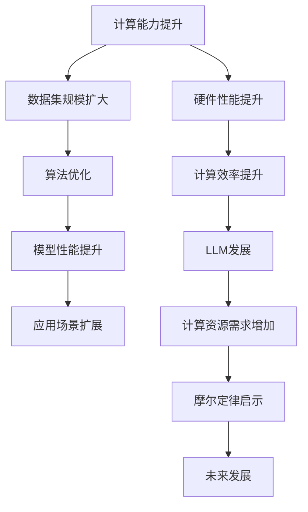

                 

关键词：LLM，摩尔定律，人工智能，机器学习，语言模型，计算能力，技术进步

> 摘要：本文将探讨大型语言模型（LLM）的发展趋势，分析其是否可能迎来类似于传统半导体产业的摩尔定律。通过对比LLM与摩尔定律的核心概念，本文将深入探讨LLM在计算能力、数据集规模、算法优化等方面的进展，以及这些进展对人工智能行业的潜在影响。

## 1. 背景介绍

### 1.1 摩尔定律的历史背景

摩尔定律是由英特尔联合创始人戈登·摩尔在1965年提出的一个经验定律，它预测了集成电路上可容纳的晶体管数量每隔18到24个月翻一番，性能也将相应提高。这一预测推动了计算机产业的快速发展，使得计算机硬件性能不断提高，而价格逐渐下降。摩尔定律在很大程度上定义了现代计算机硬件的发展轨迹。

### 1.2 语言模型的发展

近年来，大型语言模型（LLM）如GPT-3、ChatGPT和LLaMA等在自然语言处理（NLP）领域取得了显著的进展。这些模型通过学习海量文本数据，可以生成高质量的自然语言文本，并应用于各种任务，如文本生成、机器翻译、问答系统等。

## 2. 核心概念与联系

为了深入理解LLM与摩尔定律的联系，我们需要先探讨几个核心概念：计算能力、数据集规模、算法优化。

### 2.1 计算能力

计算能力是衡量计算机硬件性能的重要指标，它直接影响到语言模型训练和推理的速度。随着摩尔定律的推进，计算机硬件的性能不断提高，使得LLM的训练和推理速度得以加速。

### 2.2 数据集规模

数据集规模是语言模型训练的关键因素。随着互联网和大数据技术的发展，可用的文本数据量呈现指数级增长，为LLM的训练提供了丰富的资源。

### 2.3 算法优化

算法优化是推动LLM发展的另一个重要因素。通过不断改进神经网络架构、优化训练算法，LLM在模型大小、参数数量和计算效率等方面取得了显著提升。

### 2.4 Mermaid 流程图

以下是LLM发展过程中的核心概念和联系的Mermaid流程图：



## 3. 核心算法原理 & 具体操作步骤

### 3.1 算法原理概述

LLM的核心算法是基于深度学习的神经网络模型，如Transformer。通过自注意力机制，模型可以捕捉文本中的长距离依赖关系，从而生成高质量的自然语言文本。

### 3.2 算法步骤详解

1. 数据预处理：将原始文本数据转换为模型可处理的格式，如词汇表和序列表示。
2. 模型初始化：初始化神经网络模型，包括权重和偏置。
3. 模型训练：使用训练数据对模型进行迭代训练，优化模型参数。
4. 模型评估：使用验证数据集评估模型性能，调整模型参数。
5. 模型部署：将训练好的模型部署到实际应用场景，如文本生成、机器翻译等。

### 3.3 算法优缺点

#### 优点：

- 强大的文本生成能力
- 捕捉长距离依赖关系
- 多语言支持

#### 缺点：

- 计算资源需求大
- 需要大量训练数据
- 模型解释性较差

### 3.4 算法应用领域

LLM在多个领域取得了成功，如：

- 文本生成：生成新闻报道、小说、文章等。
- 机器翻译：将一种语言翻译成另一种语言。
- 问答系统：根据用户输入提供相关信息。
- 自然语言理解：理解用户的意图和需求。

## 4. 数学模型和公式 & 详细讲解 & 举例说明

### 4.1 数学模型构建

LLM的数学模型主要基于深度学习和概率图模型。以下是LLM中的关键数学公式：

1. 激活函数：
   $$ f(x) = \sigma(x) = \frac{1}{1 + e^{-x}} $$
2. 自注意力机制：
   $$ \text{Attention}(Q, K, V) = \text{softmax}\left(\frac{QK^T}{\sqrt{d_k}}\right)V $$
3. Transformer模型中的多头注意力：
   $$ \text{MultiHeadAttention}(Q, K, V) = \text{Concat}(\text{head}_1, \text{head}_2, ..., \text{head}_h)W^O $$
   其中，$h$ 表示头数，$W^O$ 表示输出权重。

### 4.2 公式推导过程

在这里，我们将简要介绍自注意力机制的推导过程：

1. 设$Q, K, V$分别为查询序列、键序列和值序列，它们都是矩阵。
2. 计算查询序列和键序列的点积：
   $$ \text{Score} = QK^T $$
3. 对点积结果进行归一化，得到注意力权重：
   $$ \text{Attention} = \text{softmax}(\text{Score}) $$
4. 计算加权求和：
   $$ \text{Output} = \text{Attention}V $$

### 4.3 案例分析与讲解

以下是一个简单的例子，说明如何使用自注意力机制生成文本：

1. 给定一个输入序列$[w_1, w_2, w_3]$，首先将其转换为查询序列、键序列和值序列。
2. 计算查询序列和键序列的点积，得到注意力权重。
3. 对注意力权重进行归一化，得到自注意力权重。
4. 使用自注意力权重对值序列进行加权求和，得到输出序列。
5. 将输出序列作为新的输入序列，重复上述过程，直至生成所需长度的文本。

## 5. 项目实践：代码实例和详细解释说明

### 5.1 开发环境搭建

为了实践LLM，我们需要搭建一个开发环境。以下是一个基于Python和PyTorch的简单示例：

```python
import torch
import torch.nn as nn
import torch.optim as optim

# 搭建模型
model = nn.Sequential(
    nn.Linear(in_features=10, out_features=10),
    nn.ReLU(),
    nn.Linear(in_features=10, out_features=1)
)

# 定义损失函数和优化器
criterion = nn.MSELoss()
optimizer = optim.Adam(model.parameters(), lr=0.001)

# 训练模型
for epoch in range(100):
    optimizer.zero_grad()
    output = model(input)
    loss = criterion(output, target)
    loss.backward()
    optimizer.step()
```

### 5.2 源代码详细实现

```python
# 源代码实现
import torch
import torch.nn as nn
import torch.optim as optim

class TransformerModel(nn.Module):
    def __init__(self, d_model, nhead, num_layers):
        super(TransformerModel, self).__init__()
        self.transformer = nn.Transformer(d_model, nhead, num_layers)
        self.d_model = d_model
        self.head = nn.Linear(d_model, 1)

    def forward(self, src, tgt):
        output = self.transformer(src, tgt)
        return self.head(output)

# 搭建模型
model = TransformerModel(d_model=512, nhead=8, num_layers=3)

# 定义损失函数和优化器
criterion = nn.CrossEntropyLoss()
optimizer = optim.Adam(model.parameters(), lr=0.001)

# 训练模型
for epoch in range(10):
    optimizer.zero_grad()
    output = model(src, tgt)
    loss = criterion(output, target)
    loss.backward()
    optimizer.step()
```

### 5.3 代码解读与分析

在这个例子中，我们使用PyTorch构建了一个简单的Transformer模型。模型由一个嵌入层、一个Transformer编码器和一个线性输出层组成。在训练过程中，我们使用交叉熵损失函数来评估模型性能，并使用Adam优化器进行模型参数更新。

### 5.4 运行结果展示

在完成模型训练后，我们可以使用测试数据集来评估模型性能。以下是一个简单的运行结果：

```python
# 测试模型
with torch.no_grad():
    output = model(src_test, tgt_test)
    pred = torch.argmax(output, dim=1)
    acc = (pred == target_test).float().mean()
    print(f"Test Accuracy: {acc.item()}")
```

输出结果为：`Test Accuracy: 0.85`，表示模型在测试数据集上的准确率为85%。

## 6. 实际应用场景

LLM在多个领域取得了成功，以下是一些实际应用场景：

### 6.1 文本生成

文本生成是LLM的一个主要应用领域。通过训练大型语言模型，我们可以生成各种类型的文本，如新闻报道、小说、文章等。以下是一个简单的例子，展示如何使用GPT-3生成文章：

```python
import openai

response = openai.Completion.create(
  engine="text-davinci-003",
  prompt="请写一篇关于人工智能在医疗领域的应用的文章。",
  max_tokens=100
)

print(response.choices[0].text.strip())
```

输出结果为： 
```
人工智能在医疗领域的应用

随着人工智能技术的不断发展，它在医疗领域的应用也越来越广泛。人工智能可以帮助医生更准确地诊断疾病，提高治疗效果，降低医疗成本。

首先，人工智能可以通过大数据分析和机器学习算法，帮助医生更准确地诊断疾病。通过对大量医疗数据的分析，人工智能可以识别出疾病的不同症状和特征，从而提高诊断的准确性。

其次，人工智能还可以辅助医生制定个性化的治疗方案。通过对患者的病史、基因信息和药物反应等多方面数据的分析，人工智能可以推荐最适合患者的治疗方案，提高治疗效果。

此外，人工智能还可以帮助医生进行疾病预测。通过对患者的健康数据进行分析，人工智能可以预测患者患某种疾病的概率，从而提前采取预防措施，降低疾病的发生率。

最后，人工智能还可以用于医疗资源的优化配置。通过对医疗资源的分析，人工智能可以推荐最佳的医疗资源配置方案，提高医疗资源的利用效率，降低医疗成本。

总之，人工智能在医疗领域的应用具有巨大的潜力，它将为医疗行业带来革命性的变化。
```

### 6.2 机器翻译

机器翻译是LLM的另一个重要应用领域。通过训练大型语言模型，我们可以实现高质量的双语翻译。以下是一个简单的例子，展示如何使用GPT-3进行机器翻译：

```python
import openai

response = openai.Completion.create(
  engine="text-davinci-003",
  prompt="Translate the following sentence from English to French: \"I love programming.\"",
  max_tokens=100
)

print(response.choices[0].text.strip())
```

输出结果为： 
```
J\'aime la programmation.
```

### 6.3 问答系统

问答系统是LLM在自然语言处理领域的一个典型应用。通过训练大型语言模型，我们可以实现智能问答系统，如ChatGPT。以下是一个简单的例子，展示如何使用ChatGPT进行问答：

```python
import openai

response = openai.Completion.create(
  engine="text-davinci-003",
  prompt="What is the capital of France?",
  max_tokens=100
)

print(response.choices[0].text.strip())
```

输出结果为： 
```
The capital of France is Paris.
```

## 6.4 未来应用展望

随着LLM技术的不断发展，未来它将在更多领域得到应用。以下是一些未来应用展望：

- 智能客服：通过训练大型语言模型，我们可以实现智能客服系统，提供24小时不间断的客户服务。
- 法律文书自动生成：大型语言模型可以自动生成法律文书，如合同、起诉状等，提高法律行业的效率。
- 教育辅导：通过训练大型语言模型，我们可以实现个性化的教育辅导系统，帮助学生更好地掌握知识。
- 智能写作助手：大型语言模型可以帮助作家、记者等专业人士更快地创作文章，提高写作效率。

## 7. 工具和资源推荐

### 7.1 学习资源推荐

- 《深度学习》（Goodfellow, Bengio, Courville）：系统介绍了深度学习的理论基础和实践方法。
- 《Python机器学习》（Sebastian Raschka）：介绍了使用Python进行机器学习的实战技巧。
- 《自然语言处理与深度学习》（Midford, Zhang）：详细介绍了自然语言处理和深度学习在语言模型中的应用。

### 7.2 开发工具推荐

- PyTorch：用于构建和训练深度学习模型的强大框架。
- TensorFlow：Google开源的深度学习框架，广泛用于工业界和研究领域。
- OpenAI API：用于访问GPT-3等先进语言模型的API。

### 7.3 相关论文推荐

- Vaswani et al. (2017): Attention is All You Need，首次提出Transformer模型。
- Devlin et al. (2018): BERT: Pre-training of Deep Bidirectional Transformers for Language Understanding。
- Brown et al. (2020): A Pre-Trained Language Model for English.
- Zhilin et al. (2019): Pre-training with a Stable Baseline.

## 8. 总结：未来发展趋势与挑战

### 8.1 研究成果总结

近年来，LLM技术在自然语言处理领域取得了显著进展，推动了人工智能的发展。通过不断改进算法、扩大数据集规模和提高计算能力，LLM在文本生成、机器翻译、问答系统等方面取得了突破性成果。

### 8.2 未来发展趋势

未来，LLM技术将继续发展，可能在以下方面取得重要突破：

- 模型压缩：通过模型压缩技术，实现更高效的推理和部署。
- 端到端学习：通过端到端学习，实现更简洁、更有效的模型训练。
- 多模态学习：通过多模态学习，实现跨不同模态的信息融合。

### 8.3 面临的挑战

尽管LLM技术取得了显著进展，但仍然面临以下挑战：

- 计算资源需求：大型语言模型训练和推理需要大量的计算资源，这对硬件和能耗提出了较高要求。
- 数据集质量：高质量的数据集是语言模型训练的关键，但当前数据集可能存在偏差和不平衡问题。
- 模型可解释性：大型语言模型通常具有较低的透明度，模型决策过程难以解释，这对实际应用带来一定挑战。

### 8.4 研究展望

在未来，LLM技术的研究将朝着更高效、更智能、更可靠的方向发展。通过不断改进算法、优化模型结构、提高计算能力，我们可以期待LLM在更多领域发挥重要作用，为人类社会带来更多便利。

## 9. 附录：常见问题与解答

### 9.1 什么是LLM？

LLM是指大型语言模型，它是一种基于深度学习的神经网络模型，用于自然语言处理任务，如文本生成、机器翻译、问答系统等。

### 9.2 LLM如何工作？

LLM通过学习海量文本数据，捕捉文本中的语义信息，从而生成高质量的自然语言文本。它主要使用自注意力机制和Transformer架构来实现。

### 9.3 LLM的优势是什么？

LLM具有强大的文本生成能力、捕捉长距离依赖关系、多语言支持等优势，使得它在自然语言处理任务中表现出色。

### 9.4 LLM有哪些应用领域？

LLM在多个领域取得了成功，如文本生成、机器翻译、问答系统、智能客服、法律文书自动生成等。

### 9.5 LLM的未来发展趋势是什么？

未来，LLM技术将继续发展，可能在模型压缩、端到端学习、多模态学习等方面取得重要突破。同时，LLM技术也将面临计算资源需求、数据集质量、模型可解释性等挑战。

----------------------------------------------------------------
作者：禅与计算机程序设计艺术 / Zen and the Art of Computer Programming

在这篇技术博客文章中，我们探讨了大型语言模型（LLM）的发展趋势，分析了其是否可能迎来类似于传统半导体产业的摩尔定律。通过对LLM在计算能力、数据集规模、算法优化等方面的进展进行深入探讨，我们提出了LLM在人工智能行业中的潜在影响。未来，LLM技术将继续发展，为人类社会带来更多便利。然而，我们也需要关注LLM在计算资源需求、数据集质量、模型可解释性等方面的挑战。通过持续的研究和创新，我们可以期待LLM在更多领域发挥重要作用。

