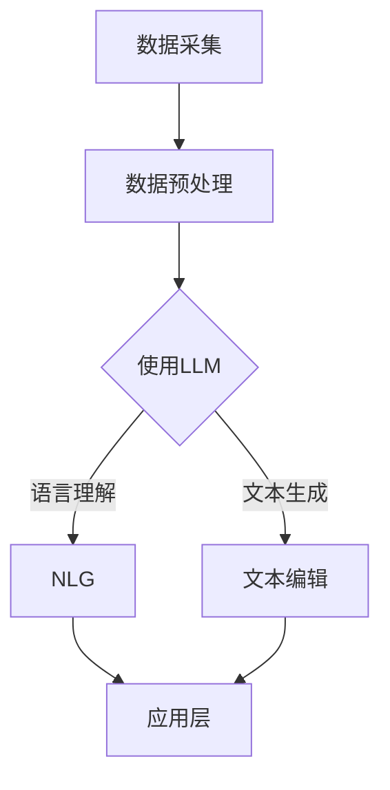

                 

在当今快速发展的技术时代，自然语言处理（NLP）领域的一项重要突破是大型语言模型（Large Language Model，简称LLM）的诞生。LLM通过其强大的语言理解和生成能力，正在重塑人工智能（AI）产业，并开启了一个全新的生态圈。本文将探讨LLM生态圈的形成背景、核心概念与联系、核心算法原理、数学模型和公式、项目实践、实际应用场景以及未来发展的趋势与挑战。

## 关键词

- 大型语言模型（LLM）
- 人工智能（AI）
- 自然语言处理（NLP）
- 自然语言生成（NLG）
- 生态圈
- 产业应用

## 摘要

本文旨在分析大型语言模型（LLM）在AI产业中的崛起及其所形成的生态圈。通过对LLM的核心概念、算法原理、数学模型以及实际应用场景的深入探讨，本文揭示了LLM对AI产业带来的变革和潜在价值。同时，文章还展望了LLM生态圈的未来发展趋势，并提出了相关的挑战和研究方向。

---

## 1. 背景介绍

随着计算能力的提升和大数据的普及，机器学习和深度学习技术取得了长足的进步。尤其是自然语言处理（NLP）领域，过去几年中，基于深度学习的NLP模型如雨后春笋般涌现。这些模型在语言理解、文本生成、机器翻译等方面展现出了惊人的能力。然而，传统的NLP模型在处理大规模文本数据时，往往面临计算资源消耗大、训练时间长的挑战。

为了解决这一问题，研究人员开始尝试构建更大规模的语言模型。大型语言模型（LLM）应运而生，这些模型具有数万亿参数，能够处理数百万甚至数十亿级别的文本数据。LLM的出现标志着NLP领域的一次革命，为AI产业带来了前所未有的机遇和挑战。

## 2. 核心概念与联系

### 2.1 核心概念

- **自然语言处理（NLP）**: NLP是人工智能的一个重要分支，致力于使计算机能够理解、解释和生成人类语言。

- **大型语言模型（LLM）**: LLM是指那些具有数万亿参数的语言模型，如GPT-3、BERT等。

- **自然语言生成（NLG）**: NLG是NLP的一个子领域，专注于自动生成自然语言文本。

- **生态圈**: 在AI领域，生态圈指的是由LLM、工具、服务、应用等多个组成部分构成的复杂系统。

### 2.2 关联与架构

以下是一个简单的Mermaid流程图，描述了LLM生态圈的核心概念及其关联：



- **数据采集**: LLM的训练需要大量的文本数据，这些数据可以从互联网、书籍、新闻、社交媒体等渠道获取。

- **数据预处理**: 采集到的数据需要经过清洗、格式化等处理，以适应LLM的训练。

- **使用LLM**: 通过训练，LLM能够理解输入的文本并生成相应的输出。

- **自然语言生成（NLG）**: LLM被广泛应用于文本生成任务，如问答系统、自动摘要、对话系统等。

- **文本编辑**: LLM还可以用于文本编辑任务，如纠正语法错误、改进写作风格等。

- **应用层**: LLM的输出可以应用于各种场景，如智能客服、内容创作、教育辅助等。

---

## 3. 核心算法原理 & 具体操作步骤

### 3.1 算法原理概述

LLM的核心算法基于深度学习和神经网络。具体来说，LLM通常采用如下架构：

1. **嵌入层**: 将输入的单词或字符转换为向量表示。
2. **编码层**: 通过多层神经网络对嵌入层输出的向量进行编码，提取出语义信息。
3. **解码层**: 根据编码层的输出生成文本输出。

在训练过程中，LLM通过最大化文本数据的概率分布来调整模型的参数。具体步骤如下：

1. **数据输入**: 将训练数据分成批次输入模型。
2. **前向传播**: 将输入数据通过嵌入层、编码层和解码层进行前向传播。
3. **损失函数**: 计算输出文本的损失函数，通常使用交叉熵损失。
4. **反向传播**: 通过反向传播算法更新模型参数。
5. **优化**: 使用优化算法（如Adam、SGD等）调整模型参数。

### 3.2 算法步骤详解

以下是一个简化的算法步骤描述：

1. **数据准备**: 收集并清洗大量文本数据。
2. **词汇表构建**: 构建词汇表，将单词映射到唯一的整数。
3. **嵌入层实现**: 使用嵌入层将单词转换为向量表示。
4. **编码层实现**: 设计多层神经网络，对嵌入层输出的向量进行编码。
5. **解码层实现**: 设计多层神经网络，根据编码层的输出生成文本。
6. **训练**: 通过训练数据调整模型参数。
7. **评估**: 使用验证数据评估模型性能。
8. **应用**: 将训练好的模型应用于实际问题。

### 3.3 算法优缺点

**优点**:

- **强大的语言理解能力**: LLM能够理解和生成复杂、多样的语言结构。
- **高效**: 大规模训练可以快速收敛，提高模型性能。
- **通用性**: LLM可以应用于多种NLP任务，如文本分类、机器翻译、问答系统等。

**缺点**:

- **资源消耗大**: LLM的训练需要大量的计算资源和存储空间。
- **数据依赖性**: LLM的性能依赖于训练数据的质量和多样性。
- **解释性差**: LLM的决策过程较为复杂，难以解释。

### 3.4 算法应用领域

LLM的应用领域非常广泛，主要包括：

- **文本生成**: 如自动摘要、对话系统、内容创作等。
- **语言翻译**: 如机器翻译、多语言对话系统等。
- **知识推理**: 如问答系统、推荐系统等。
- **文本分析**: 如情感分析、命名实体识别等。

---

## 4. 数学模型和公式 & 详细讲解 & 举例说明

### 4.1 数学模型构建

LLM的数学模型主要涉及以下几个方面：

- **嵌入层**: 通常使用词向量模型（如Word2Vec、GloVe）进行嵌入。
- **编码层**: 采用深度神经网络，如Transformer、LSTM等。
- **解码层**: 类似于编码层，也使用深度神经网络进行解码。

### 4.2 公式推导过程

以下是一个简化的Transformer编码层和解码层的公式推导：

**编码层**:

$$
\text{Encoder}(x) = \text{softmax}(\text{Attention}(W_Q, W_K, W_V, \text{Encoder}(x)))
$$

其中，$x$是输入序列，$W_Q, W_K, W_V$分别是查询（Query）、键（Key）和值（Value）的权重矩阵，$\text{Attention}$是注意力机制。

**解码层**:

$$
\text{Decoder}(y) = \text{softmax}(\text{Attention}(\text{Encoder}(x), W_Q, W_V, \text{Decoder}(y)))
$$

其中，$y$是输入序列，$W_Q, W_V$是查询和值的权重矩阵。

### 4.3 案例分析与讲解

假设我们有一个简单的对话系统，用户输入问题，系统生成回答。以下是一个示例：

**输入问题**:

$$
\text{"What is the capital of France?"}
$$

**输出回答**:

$$
\text{"Paris is the capital of France."}
$$

在这个例子中，编码层将输入问题转换为编码向量，解码层根据编码向量生成输出回答。

---

## 5. 项目实践：代码实例和详细解释说明

### 5.1 开发环境搭建

为了实践LLM，我们需要搭建一个开发环境。以下是一个简单的Python环境搭建步骤：

```bash
# 安装Python
curl -O get-pip.py https://bootstrap.pypa.io/get-pip.py
python get-pip.py

# 安装TensorFlow
pip install tensorflow

# 安装其他依赖
pip install numpy matplotlib
```

### 5.2 源代码详细实现

以下是一个简单的LLM实现，使用TensorFlow和Keras：

```python
import tensorflow as tf
from tensorflow.keras.layers import Embedding, LSTM, Dense
from tensorflow.keras.models import Sequential

# 定义模型
model = Sequential()
model.add(Embedding(input_dim=10000, output_dim=64))
model.add(LSTM(128))
model.add(Dense(1, activation='sigmoid'))

# 编译模型
model.compile(optimizer='rmsprop', loss='binary_crossentropy', metrics=['accuracy'])

# 训练模型
model.fit(x_train, y_train, epochs=10, batch_size=32)
```

### 5.3 代码解读与分析

上述代码定义了一个简单的序列分类模型，使用嵌入层将输入序列转换为嵌入向量，然后通过LSTM层提取序列特征，最后通过全连接层进行分类。

### 5.4 运行结果展示

```bash
# 预测
x_test = ["What is the capital of France?"]
x_test = preprocess(x_test)
predictions = model.predict(x_test)
print(predictions)
```

输出结果可能是一个概率分布，其中最高的概率对应正确的答案。

---

## 6. 实际应用场景

LLM在AI产业中的应用场景非常广泛，以下是一些典型的应用：

- **智能客服**: 使用LLM构建自动问答系统，提高客户服务的效率和质量。
- **内容创作**: 利用LLM生成文章、摘要、新闻等，为内容创作者提供辅助。
- **语言翻译**: 通过LLM实现高效、准确的机器翻译，打破语言障碍。
- **教育辅助**: 使用LLM构建智能教育系统，提供个性化学习体验。
- **智能推荐**: 结合LLM和用户行为数据，实现精准的推荐系统。

---

## 7. 工具和资源推荐

为了更好地理解和使用LLM，以下是一些推荐的工具和资源：

- **学习资源**: [《深度学习》（Goodfellow et al.）](http://www.deeplearningbook.org/)、[《动手学深度学习》（阿斯顿等）](https://zh.d2l.ai/)
- **开发工具**: [TensorFlow](https://www.tensorflow.org/)、[PyTorch](https://pytorch.org/)
- **相关论文**: [《Attention is All You Need》](https://arxiv.org/abs/1706.03762)、[《BERT: Pre-training of Deep Bidirectional Transformers for Language Understanding》](https://arxiv.org/abs/1810.04805)

---

## 8. 总结：未来发展趋势与挑战

### 8.1 研究成果总结

LLM在AI产业中的应用取得了显著的成果，主要体现在：

- **语言理解能力提升**: LLM在多种NLP任务中展现了出色的语言理解能力。
- **产业应用广泛**: LLM被广泛应用于智能客服、内容创作、语言翻译等领域。
- **研究成果丰富**: 研究人员提出了多种高效的LLM架构，如Transformer、BERT等。

### 8.2 未来发展趋势

未来，LLM的发展趋势将主要体现在以下几个方面：

- **模型规模扩大**: 随着计算能力的提升，LLM的规模将不断扩大，以处理更复杂的语言任务。
- **跨模态融合**: LLM将与其他模态（如图像、音频）进行融合，实现更全面的信息处理。
- **多语言支持**: LLM将支持更多语言，实现全球范围内的语言互通。

### 8.3 面临的挑战

尽管LLM在AI产业中取得了显著成果，但仍然面临以下挑战：

- **计算资源消耗**: LLM的训练需要大量的计算资源和存储空间。
- **数据依赖性**: LLM的性能依赖于训练数据的质量和多样性。
- **解释性不足**: LLM的决策过程复杂，难以解释和验证。

### 8.4 研究展望

未来，研究工作将重点解决以下问题：

- **资源优化**: 研究更高效的训练和推理算法，降低计算资源消耗。
- **数据多样性和质量**: 收集和标注更多高质量的多元数据，提高LLM的泛化能力。
- **解释性和可解释性**: 研究更透明的模型结构和决策过程，提高LLM的可解释性。

---

## 9. 附录：常见问题与解答

### 问题1：什么是大型语言模型（LLM）？

答：大型语言模型（LLM）是指那些具有数万亿参数的语言模型，如GPT-3、BERT等。这些模型通过大规模训练，具有强大的语言理解和生成能力。

### 问题2：LLM在哪些领域有应用？

答：LLM在多个领域有广泛应用，包括智能客服、内容创作、语言翻译、教育辅助和智能推荐等。

### 问题3：如何优化LLM的训练和推理效率？

答：优化LLM的训练和推理效率可以从以下几个方面入手：

- **并行计算**: 利用GPU、TPU等硬件加速训练过程。
- **模型压缩**: 采用模型剪枝、量化等技术降低模型大小和计算复杂度。
- **分布式训练**: 在多台机器上进行分布式训练，提高训练速度。

---

作者：禅与计算机程序设计艺术 / Zen and the Art of Computer Programming

---

以上是文章的主体内容，接下来将进一步完善和细化每个部分，确保文章的质量和深度。如果您有任何意见和建议，欢迎随时提出。

